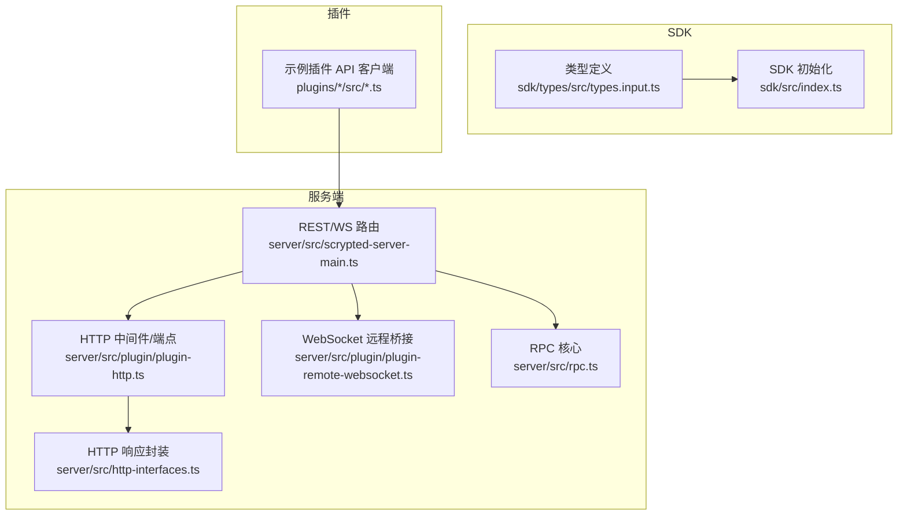
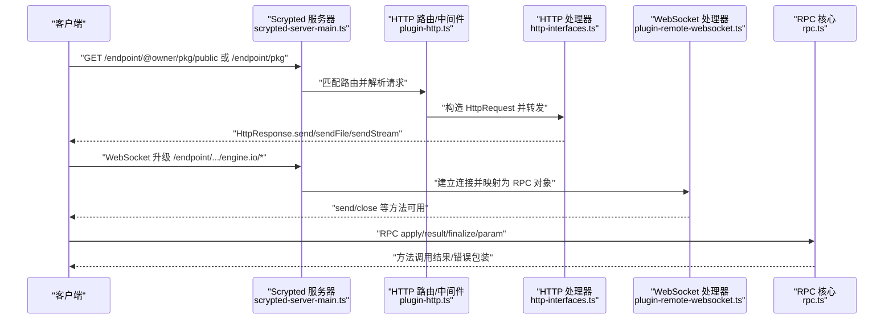
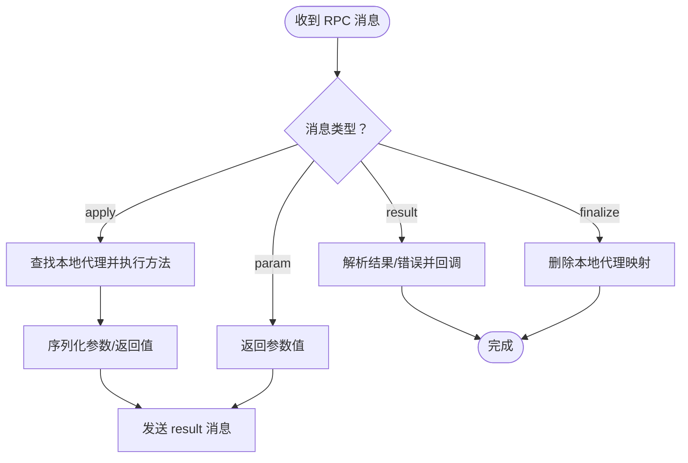
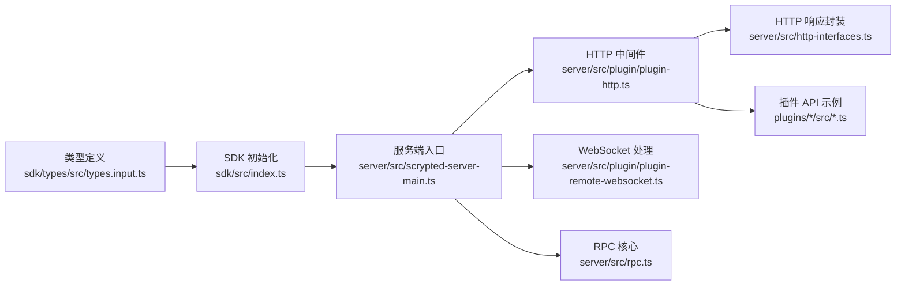

# API 参考手册

<cite>
**本文引用的文件**
- [server/src/scrypted-server-main.ts](file://server/src/scrypted-server-main.ts)
- [server/src/plugin/plugin-http.ts](file://server/src/plugin/plugin-http.ts)
- [server/src/http-interfaces.ts](file://server/src/http-interfaces.ts)
- [server/src/plugin/plugin-remote-websocket.ts](file://server/src/plugin/plugin-remote-websocket.ts)
- [server/src/rpc.ts](file://server/src/rpc.ts)
- [sdk/types/src/types.input.ts](file://sdk/types/src/types.input.ts)
- [sdk/src/index.ts](file://sdk/src/index.ts)
- [packages/auth-fetch/src/auth-fetch.ts](file://packages/auth-fetch/src/auth-fetch.ts)
- [common/src/rtsp-server.ts](file://common/src/rtsp-server.ts)
- [plugins/hikvision-doorbell/src/doorbell-api.ts](file://plugins/hikvision-doorbell/src/doorbell-api.ts)
- [plugins/synology-ss/src/api/synology-api-client.ts](file://plugins/synology-ss/src/api/synology-api-client.ts)
- [plugins/ring/src/ring-client-api.ts](file://plugins/ring/src/ring-client-api.ts)
- [server/src/plugin/plugin-npm-dependencies.ts](file://server/src/plugin/plugin-npm-dependencies.ts)
- [server/src/runtime.ts](file://server/src/runtime.ts)
- [sdk/bin/scrypted-changelog.js](file://sdk/bin/scrypted-changelog.js)
</cite>

## 目录
1. [简介](#简介)
2. [项目结构](#项目结构)
3. [核心组件](#核心组件)
4. [架构总览](#架构总览)
5. [详细组件分析](#详细组件分析)
6. [依赖关系分析](#依赖关系分析)
7. [性能考量](#性能考量)
8. [故障排查指南](#故障排查指南)
9. [结论](#结论)
10. [附录](#附录)

## 简介
本参考手册面向 Scrypted 的开发者与集成者，系统化梳理 Scrypted 的 API 体系，覆盖以下方面：
- REST API：HTTP 方法、URL 模式、请求/响应模式、认证方式
- WebSocket 接口：连接处理、消息格式、事件类型、实时交互模式
- RPC 接口规范：方法调用、参数传递、返回值处理、错误码定义
- SDK API 参考：公共类、接口、方法说明、参数类型、返回值、使用示例
- 数据模型与接口规范：JSON Schema、数据类型定义、验证规则
- API 版本管理、向后兼容性、废弃功能迁移指南
- 使用示例、客户端实现指南、性能优化建议
- 错误处理策略、安全考虑、速率限制与版本信息

## 项目结构
Scrypted 的 API 层由服务端（server）、SDK（sdk）与插件（plugins）共同组成。服务端负责对外暴露 REST 与 WebSocket 接口，并通过 RPC 实现跨进程/跨边界通信；SDK 提供类型与运行时能力；插件实现具体设备或服务逻辑。

图表来源
- [server/src/scrypted-server-main.ts:112-200](file://server/src/scrypted-server-main.ts#L112-L200)
- [server/src/plugin/plugin-http.ts:12-37](file://server/src/plugin/plugin-http.ts#L12-L37)
- [server/src/http-interfaces.ts:10-125](file://server/src/http-interfaces.ts#L10-L125)
- [server/src/plugin/plugin-remote-websocket.ts:154-174](file://server/src/plugin/plugin-remote-websocket.ts#L154-L174)
- [server/src/rpc.ts:285-456](file://server/src/rpc.ts#L285-L456)
- [sdk/types/src/types.input.ts:1-50](file://sdk/types/src/types.input.ts#L1-L50)
- [sdk/src/index.ts:250-295](file://sdk/src/index.ts#L250-L295)

章节来源
- [server/src/scrypted-server-main.ts:112-200](file://server/src/scrypted-server-main.ts#L112-L200)
- [server/src/plugin/plugin-http.ts:12-37](file://server/src/plugin/plugin-http.ts#L12-L37)
- [server/src/http-interfaces.ts:10-125](file://server/src/http-interfaces.ts#L10-L125)
- [server/src/plugin/plugin-remote-websocket.ts:154-174](file://server/src/plugin/plugin-remote-websocket.ts#L154-L174)
- [server/src/rpc.ts:285-456](file://server/src/rpc.ts#L285-L456)
- [sdk/types/src/types.input.ts:1-50](file://sdk/types/src/types.input.ts#L1-L50)
- [sdk/src/index.ts:250-295](file://sdk/src/index.ts#L250-L295)

## 核心组件
- REST/WS 路由与认证
  - 服务端启动与中间件配置，支持 Basic/Cookie/环境变量默认登录等机制。
  - 对外提供统一入口路径与端点路由。
- 插件 HTTP/WebSocket 端点
  - 统一的 /endpoint/{owner}/{pkg} 或 /endpoint/{pkg} 路径，区分公开与私有端点。
  - 支持 Engine.IO 升级与 OPTIONS 预检。
- HTTP 响应封装
  - 封装 HttpResponse，支持 send/sendFile/sendStream/sendSocket 等多种输出。
- WebSocket 远程桥接
  - 将 WebSocket 连接映射为 RPC 对象，支持 send/close 等方法。
- RPC 核心
  - 定义 apply/result/finalize/param 等消息类型，支持序列化/反序列化、错误包装、异步迭代器等。
- SDK 类型与初始化
  - 提供设备接口、媒体对象、设置、事件等类型定义；SDK 初始化时注入运行时能力。

章节来源
- [server/src/scrypted-server-main.ts:175-200](file://server/src/scrypted-server-main.ts#L175-L200)
- [server/src/plugin/plugin-http.ts:18-37](file://server/src/plugin/plugin-http.ts#L18-L37)
- [server/src/http-interfaces.ts:10-125](file://server/src/http-interfaces.ts#L10-L125)
- [server/src/plugin/plugin-remote-websocket.ts:154-174](file://server/src/plugin/plugin-remote-websocket.ts#L154-L174)
- [server/src/rpc.ts:29-83](file://server/src/rpc.ts#L29-L83)
- [sdk/types/src/types.input.ts:1-50](file://sdk/types/src/types.input.ts#L1-L50)
- [sdk/src/index.ts:250-295](file://sdk/src/index.ts#L250-L295)

## 架构总览
下图展示从客户端到服务端、再到插件与设备的完整调用链路，涵盖 REST、WebSocket 与 RPC：

图表来源
- [server/src/scrypted-server-main.ts:691-780](file://server/src/scrypted-server-main.ts#L691-L780)
- [server/src/plugin/plugin-http.ts:45-143](file://server/src/plugin/plugin-http.ts#L45-L143)
- [server/src/http-interfaces.ts:10-125](file://server/src/http-interfaces.ts#L10-L125)
- [server/src/plugin/plugin-remote-websocket.ts:73-152](file://server/src/plugin/plugin-remote-websocket.ts#L73-L152)
- [server/src/rpc.ts:697-839](file://server/src/rpc.ts#L697-L839)

## 详细组件分析

### REST API 规范
- URL 模式
  - 公开端点：/endpoint/:pkg/public 或 /endpoint/@:owner/:pkg/public
  - 私有端点：/endpoint/:pkg 或 /endpoint/@:owner/:pkg
  - Engine.IO 升级：/endpoint/:pkg/public/engine.io/* 或 /endpoint/@:owner/:pkg/engine.io/*
- HTTP 方法
  - 所有方法均可使用（GET/POST/PUT/DELETE 等），由插件处理器自行判断。
- 请求体
  - 默认对公开端点进行字符串化处理，便于统一处理。
- 认证与授权
  - 私有端点需认证，支持 Basic、Cookie、环境变量默认登录。
  - 未认证时返回 401。
- 响应
  - 支持文本、Buffer、文件、流、套接字等多种输出。
  - 发送文件时优先使用 ETag，支持自定义状态码与头。
- 引擎 IO（Engine.IO）
  - 支持 OPTIONS 预检；升级失败时返回相应状态码并销毁套接字。

章节来源
- [server/src/plugin/plugin-http.ts:18-37](file://server/src/plugin/plugin-http.ts#L18-L37)
- [server/src/plugin/plugin-http.ts:45-143](file://server/src/plugin/plugin-http.ts#L45-L143)
- [server/src/http-interfaces.ts:10-125](file://server/src/http-interfaces.ts#L10-L125)
- [server/src/scrypted-server-main.ts:239-271](file://server/src/scrypted-server-main.ts#L239-L271)
- [server/src/scrypted-server-main.ts:691-780](file://server/src/scrypted-server-main.ts#L691-L780)

### WebSocket 接口规范
- 连接处理
  - 通过 /endpoint/:pkg/engine.io/* 或 /endpoint/@:owner/:pkg/engine.io/* 升级。
  - 未指定协议或协议不为 WebSocket 时拒绝。
- 消息格式
  - 以 Engine.IO 协议承载，底层由服务端 WebSocket 服务器接管。
- 事件类型与实时交互
  - 通过 WebSocket 事件模型（open/message/error/close）驱动。
  - 服务端将 WebSocket 映射为 RPC 对象，提供 send/close 等方法。
- 与 RPC 的关系
  - WebSocket 连接可作为 RPC 传输通道，消息类型与 RPC 一致。

章节来源
- [server/src/plugin/plugin-http.ts:75-94](file://server/src/plugin/plugin-http.ts#L75-L94)
- [server/src/plugin/plugin-remote-websocket.ts:73-152](file://server/src/plugin/plugin-remote-websocket.ts#L73-L152)
- [server/src/plugin/plugin-remote-websocket.ts:154-174](file://server/src/plugin/plugin-remote-websocket.ts#L154-L174)

### RPC 接口规范
- 消息类型
  - apply：调用远端对象方法
  - result：返回调用结果或错误
  - finalize：释放本地代理
  - param：获取参数值
- 参数与返回值
  - 支持 JSON 可序列化类型与自定义序列化器。
  - 错误通过包装对象返回，包含 name/stack/message。
- 序列化与反序列化
  - 自动识别远程代理、本地代理、错误类型与自定义构造器名称。
- 生命周期
  - 通过 finalize 机制回收本地代理；kill 后拒绝后续调用。
- 异步迭代器
  - 支持 async iterator，next/throw/return 控制流。

图表来源
- [server/src/rpc.ts:29-83](file://server/src/rpc.ts#L29-L83)
- [server/src/rpc.ts:714-839](file://server/src/rpc.ts#L714-L839)

章节来源
- [server/src/rpc.ts:29-83](file://server/src/rpc.ts#L29-L83)
- [server/src/rpc.ts:476-513](file://server/src/rpc.ts#L476-L513)
- [server/src/rpc.ts:548-568](file://server/src/rpc.ts#L548-L568)
- [server/src/rpc.ts:570-678](file://server/src/rpc.ts#L570-L678)
- [server/src/rpc.ts:697-839](file://server/src/rpc.ts#L697-L839)

### SDK API 参考
- 设备接口与能力
  - 包含 OnOff/Brightness/Lock/Thermostat/SecuritySystem/Intercom/VideoCamera/Microphone 等常用接口。
  - 每个接口定义了方法签名、属性与行为约束。
- 媒体对象与转换
  - MediaObject 表示中间媒体对象；MediaManager 提供转换、创建、本地/公网 URL 获取等能力。
- 设置与事件
  - Setting/SettingValue 定义设置项；Event/EventListener 定义事件监听与回调。
- 系统与设备管理
  - SystemManager 提供设备查询、事件订阅、组件获取等。
  - DeviceManager 提供设备发现、事件上报、存储访问等。

章节来源
- [sdk/types/src/types.input.ts:166-320](file://sdk/types/src/types.input.ts#L166-L320)
- [sdk/types/src/types.input.ts:298-305](file://sdk/types/src/types.input.ts#L298-L305)
- [sdk/types/src/types.input.ts:712-726](file://sdk/types/src/types.input.ts#L712-L726)
- [sdk/types/src/types.input.ts:1915-1972](file://sdk/types/src/types.input.ts#L1915-L1972)
- [sdk/types/src/types.input.ts:2150-2206](file://sdk/types/src/types.input.ts#L2150-L2206)
- [sdk/types/src/types.input.ts:1198-1270](file://sdk/types/src/types.input.ts#L1198-L1270)

### 数据模型与接口规范
- JSON Schema 与类型
  - 通过 TypeScript 接口表达数据结构，如 Device、MediaObject、Setting、EventDetails 等。
  - 支持嵌套对象、数组、枚举与可选字段。
- 验证规则
  - 运行时通过 SDK 类型系统与 RPC 序列化进行基本校验。
  - 插件侧可结合第三方库（如 axios/自定义校验）增强输入验证。

章节来源
- [sdk/types/src/types.input.ts:2003-2018](file://sdk/types/src/types.input.ts#L2003-L2018)
- [sdk/types/src/types.input.ts:2315-2365](file://sdk/types/src/types.input.ts#L2315-L2365)
- [sdk/types/src/types.input.ts:86-91](file://sdk/types/src/types.input.ts#L86-L91)

### API 版本管理与兼容性
- 版本信息
  - 通过工具生成变更日志，记录各版本提交摘要。
- 兼容性策略
  - 保留接口名称与语义，避免破坏性变更；新增接口采用可选方式。
- 废弃功能迁移
  - 旧接口标注为 deprecated，提供替代方案与迁移指引。

章节来源
- [sdk/bin/scrypted-changelog.js:1-58](file://sdk/bin/scrypted-changelog.js#L1-L58)
- [sdk/types/src/types.input.ts:10-16](file://sdk/types/src/types.input.ts#L10-L16)

### 客户端实现指南
- REST 客户端
  - 使用 auth-fetch 在 401 时自动携带凭据重试。
- WebSocket 客户端
  - 通过 Engine.IO 协议连接 /endpoint/.../engine.io/*。
- 插件端点
  - 使用 EndpointManager 获取本地/公网端点路径，注意区分 public/insecure/publicPush/cloud 等场景。

章节来源
- [packages/auth-fetch/src/auth-fetch.ts:89-119](file://packages/auth-fetch/src/auth-fetch.ts#L89-L119)
- [sdk/types/src/types.input.ts:2055-2144](file://sdk/types/src/types.input.ts#L2055-L2144)

## 依赖关系分析

图表来源
- [sdk/types/src/types.input.ts:1-50](file://sdk/types/src/types.input.ts#L1-L50)
- [sdk/src/index.ts:250-295](file://sdk/src/index.ts#L250-L295)
- [server/src/scrypted-server-main.ts:112-200](file://server/src/scrypted-server-main.ts#L112-L200)
- [server/src/plugin/plugin-http.ts:12-37](file://server/src/plugin/plugin-http.ts#L12-L37)
- [server/src/http-interfaces.ts:10-125](file://server/src/http-interfaces.ts#L10-L125)
- [server/src/plugin/plugin-remote-websocket.ts:154-174](file://server/src/plugin/plugin-remote-websocket.ts#L154-L174)
- [server/src/rpc.ts:285-456](file://server/src/rpc.ts#L285-L456)

章节来源
- [sdk/types/src/types.input.ts:1-50](file://sdk/types/src/types.input.ts#L1-L50)
- [sdk/src/index.ts:250-295](file://sdk/src/index.ts#L250-L295)
- [server/src/scrypted-server-main.ts:112-200](file://server/src/scrypted-server-main.ts#L112-L200)
- [server/src/plugin/plugin-http.ts:12-37](file://server/src/plugin/plugin-http.ts#L12-L37)
- [server/src/http-interfaces.ts:10-125](file://server/src/http-interfaces.ts#L10-L125)
- [server/src/plugin/plugin-remote-websocket.ts:154-174](file://server/src/plugin/plugin-remote-websocket.ts#L154-L174)
- [server/src/rpc.ts:285-456](file://server/src/rpc.ts#L285-L456)

## 性能考量
- 流式传输
  - 使用 sendStream 将异步生成的二进制块写入响应，避免一次性加载至内存。
- 序列化优化
  - 仅在必要时进行 RPC 序列化，减少大对象传输。
- 迭代器与异步
  - 利用 async iterator 控制消费节奏，及时释放资源。
- 缓存与预取
  - 媒体对象转换与图片抓拍可利用缓存与批量请求优化。

章节来源
- [server/src/http-interfaces.ts:80-119](file://server/src/http-interfaces.ts#L80-L119)
- [server/src/rpc.ts:104-219](file://server/src/rpc.ts#L104-L219)

## 故障排查指南
- 认证失败
  - Basic/Cookie 登录失败会返回 401；检查用户名密码、令牌与环境变量默认登录配置。
- 端点不可达
  - 检查是否为公开端点、是否正确传入 owner/pkg、是否满足访问控制。
- WebSocket 升级失败
  - 确认请求头 Upgrade 是否为 WebSocket，路径是否匹配 engine.io。
- 错误码与异常
  - RPC 返回的错误对象包含 name/stack/message；根据堆栈定位问题。
- 插件依赖安装
  - 可选依赖通过 npm 安装流程更新，确保本地编译产物与当前依赖一致。

章节来源
- [server/src/scrypted-server-main.ts:175-200](file://server/src/scrypted-server-main.ts#L175-L200)
- [server/src/plugin/plugin-http.ts:75-94](file://server/src/plugin/plugin-http.ts#L75-L94)
- [server/src/rpc.ts:548-568](file://server/src/rpc.ts#L548-L568)
- [server/src/plugin/plugin-npm-dependencies.ts:45-81](file://server/src/plugin/plugin-npm-dependencies.ts#L45-L81)

## 结论
Scrypted 的 API 体系以统一的 REST/WebSocket 入口与强大的 RPC 为核心，配合 SDK 类型系统与丰富的设备接口，为设备接入、媒体处理与自动化提供了清晰、可扩展的开发框架。遵循本文档的规范与最佳实践，可在保证安全性与性能的前提下快速构建稳定可靠的集成方案。

## 附录

### API 使用示例（路径索引）
- 获取认证令牌
  - [server/src/scrypted-server-main.ts:691-780](file://server/src/scrypted-server-main.ts#L691-L780)
- 注册 HTTP 端点
  - [server/src/plugin/plugin-http.ts:18-37](file://server/src/plugin/plugin-http.ts#L18-L37)
- 发送 HTTP 响应
  - [server/src/http-interfaces.ts:36-79](file://server/src/http-interfaces.ts#L36-L79)
- 建立 WebSocket 连接
  - [server/src/plugin/plugin-remote-websocket.ts:73-152](file://server/src/plugin/plugin-remote-websocket.ts#L73-L152)
- 调用 RPC 方法
  - [server/src/rpc.ts:152-219](file://server/src/rpc.ts#L152-L219)
- SDK 初始化与注入
  - [sdk/src/index.ts:250-295](file://sdk/src/index.ts#L250-L295)

### 客户端实现要点（路径索引）
- 自动认证与重试
  - [packages/auth-fetch/src/auth-fetch.ts:89-119](file://packages/auth-fetch/src/auth-fetch.ts#L89-L119)
- RTSP 请求校验
  - [common/src/rtsp-server.ts:1148-1177](file://common/src/rtsp-server.ts#L1148-L1177)
- SIP/HTTP 客户端健壮性
  - [plugins/hikvision-doorbell/src/doorbell-api.ts:139-170](file://plugins/hikvision-doorbell/src/doorbell-api.ts#L139-L170)
- 第三方 API 客户端
  - [plugins/synology-ss/src/api/synology-api-client.ts:20-44](file://plugins/synology-ss/src/api/synology-api-client.ts#L20-L44)
  - [plugins/ring/src/ring-client-api.ts:1-14](file://plugins/ring/src/ring-client-api.ts#L1-L14)