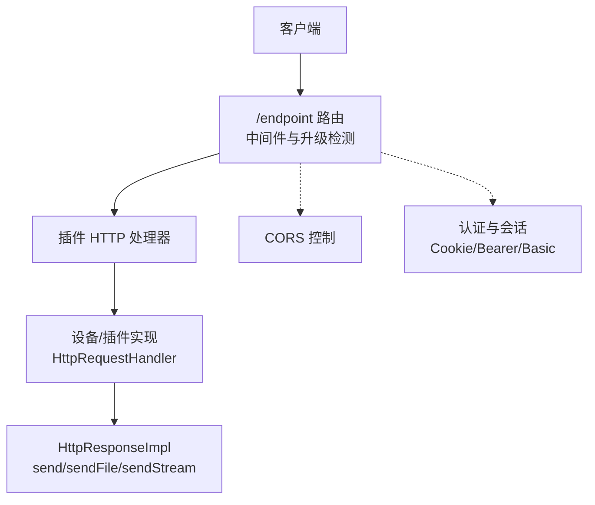
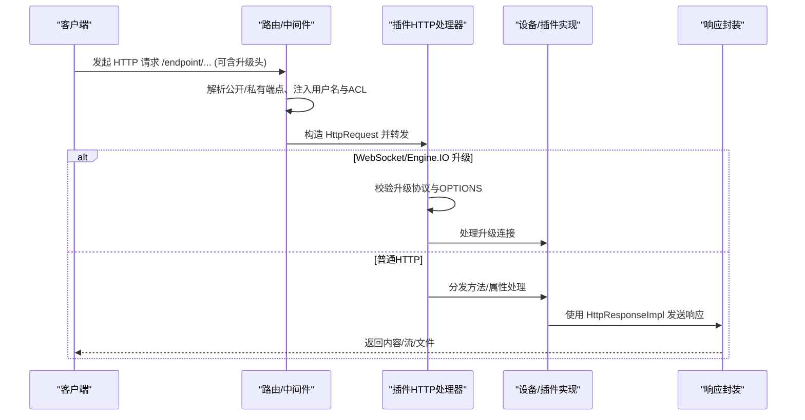
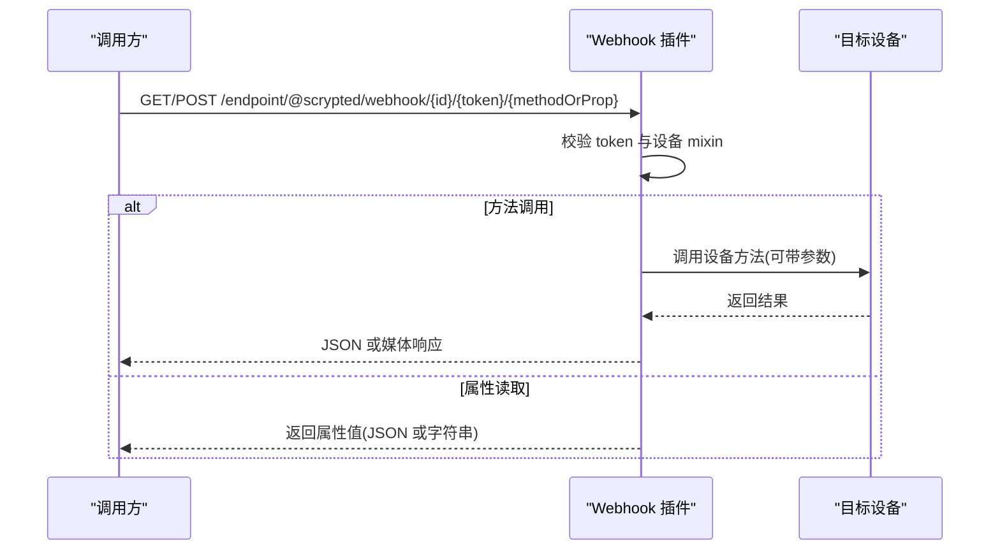
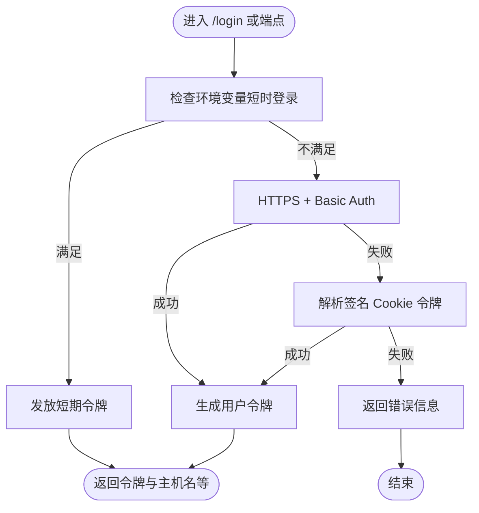
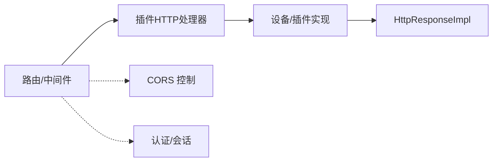

# REST API 接口

<cite>
**本文引用的文件**
- [server/src/plugin/plugin-http.ts](file://server/src/plugin/plugin-http.ts)
- [server/src/http-interfaces.ts](file://server/src/http-interfaces.ts)
- [server/src/services/cors.ts](file://server/src/services/cors.ts)
- [server/src/scrypted-server-main.ts](file://server/src/scrypted-server-main.ts)
- [server/src/usertoken.ts](file://server/src/usertoken.ts)
- [server/src/fetch/index.ts](file://server/src/fetch/index.ts)
- [plugins/webhook/src/main.ts](file://plugins/webhook/src/main.ts)
- [plugins/core/src/main.ts](file://plugins/core/src/main.ts)
- [plugins/core/src/http-helpers.ts](file://plugins/core/src/http-helpers.ts)
- [packages/auth-fetch/src/auth-fetch.ts](file://packages/auth-fetch/src/auth-fetch.ts)
- [sdk/types/src/types.input.ts](file://sdk/types/src/types.input.ts)
</cite>

## 目录
1. [简介](#简介)
2. [项目结构](#项目结构)
3. [核心组件](#核心组件)
4. [架构总览](#架构总览)
5. [详细组件分析](#详细组件分析)
6. [依赖关系分析](#依赖关系分析)
7. [性能考虑](#性能考虑)
8. [故障排查指南](#故障排查指南)
9. [结论](#结论)
10. [附录](#附录)

## 简介
本文件为 Scrypted REST API 的权威接口文档，覆盖设备控制、状态查询、配置管理、媒体传输、推送与事件等能力。文档从系统架构、端点设计、认证与授权、CORS、版本与兼容性、性能与缓存策略、错误处理与重试等方面进行系统化说明，并提供端到端调用序列图与流程图，帮助开发者快速集成。

## 项目结构
Scrypted 的 REST API 主要由以下层次构成：
- 路由与中间件层：统一挂载 /endpoint 前缀，解析公开/私有端点、升级协议（WebSocket/Engine.IO），注入用户上下文。
- 插件 HTTP 处理器：将外部 HTTP 请求转换为内部 HttpRequest，转发给具体插件或设备实现。
- 插件/设备实现：遵循 HttpRequestHandler 接口，按路径分发方法/属性访问。
- 响应封装：HttpResponseImpl 提供 send/sendFile/sendStream/sendSocket 等多种响应方式。
- 认证与会话：支持 Cookie、Basic、环境变量短时登录；生成短期令牌并返回过期时间。
- CORS 控制：动态配置来源白名单，支持按 ID 维度管理。
- 客户端工具：提供带 401 自动凭据处理的 fetch 封装。

图表来源
- [server/src/plugin/plugin-http.ts:18-37](file://server/src/plugin/plugin-http.ts#L18-L37)
- [server/src/http-interfaces.ts:10-120](file://server/src/http-interfaces.ts#L10-L120)
- [server/src/services/cors.ts:3-18](file://server/src/services/cors.ts#L3-L18)
- [server/src/scrypted-server-main.ts:257-280](file://server/src/scrypted-server-main.ts#L257-L280)

章节来源
- [server/src/plugin/plugin-http.ts:1-145](file://server/src/plugin/plugin-http.ts#L1-L145)
- [server/src/http-interfaces.ts:1-125](file://server/src/http-interfaces.ts#L1-L125)
- [server/src/services/cors.ts:1-30](file://server/src/services/cors.ts#L1-L30)
- [server/src/scrypted-server-main.ts:239-280](file://server/src/scrypted-server-main.ts#L239-L280)

## 核心组件
- 路由与端点前缀
  - 公开端点：/endpoint/{owner}/{pkg}/public 或 /endpoint/{pkg}/public
  - 私有端点：/endpoint/{owner}/{pkg} 或 /endpoint/{pkg}
  - 支持通配符匹配与升级协议（WebSocket/Engine.IO）
- 请求对象 HttpRequest
  - 字段：method、url、headers、body、rootPath、isPublicEndpoint、username、aclId
- 响应对象 HttpResponse
  - 方法：send、sendFile、sendStream、sendSocket
  - 支持自定义响应头与状态码
- 认证与会话
  - Cookie 登录、Basic Auth（仅 HTTPS）、环境变量短时登录
  - 返回短期令牌与剩余有效期
- CORS
  - 动态设置来源白名单，按 ID 维度存储

章节来源
- [server/src/plugin/plugin-http.ts:18-37](file://server/src/plugin/plugin-http.ts#L18-L37)
- [sdk/types/src/types.input.ts:2265-2293](file://sdk/types/src/types.input.ts#L2265-L2293)
- [server/src/http-interfaces.ts:10-120](file://server/src/http-interfaces.ts#L10-L120)
- [server/src/services/cors.ts:3-18](file://server/src/services/cors.ts#L3-L18)
- [server/src/scrypted-server-main.ts:691-780](file://server/src/scrypted-server-main.ts#L691-L780)

## 架构总览
下图展示从客户端到设备实现的整体调用链路，包括认证、CORS、升级协议处理与响应封装。

图表来源
- [server/src/plugin/plugin-http.ts:45-143](file://server/src/plugin/plugin-http.ts#L45-L143)
- [server/src/http-interfaces.ts:10-120](file://server/src/http-interfaces.ts#L10-L120)

章节来源
- [server/src/plugin/plugin-http.ts:45-143](file://server/src/plugin/plugin-http.ts#L45-L143)
- [server/src/http-interfaces.ts:10-120](file://server/src/http-interfaces.ts#L10-L120)

## 详细组件分析

### 1) 端点与路由规则
- URL 模式
  - 公开端点：/endpoint/{owner}/{pkg}/public 或 /endpoint/{pkg}/public
  - 私有端点：/endpoint/{owner}/{pkg} 或 /endpoint/{pkg}
  - 支持通配符 /*ignored 匹配任意子路径
- 方法
  - 所有 HTTP 方法均被接受（ALL），由插件内部根据路径与方法分发
- 请求体
  - 文本中间件对公开端点自动 stringify，确保插件收到字符串形式的 body
- 升级协议
  - WebSocket：当请求头包含 Upgrade 且值为 websocket 时，建立 WebSocket 连接
  - Engine.IO：通过 /engine.io/* 路径识别，支持 OPTIONS 预检与升级校验

章节来源
- [server/src/plugin/plugin-http.ts:18-37](file://server/src/plugin/plugin-http.ts#L18-L37)
- [server/src/plugin/plugin-http.ts:45-143](file://server/src/plugin/plugin-http.ts#L45-L143)

### 2) 设备控制与状态查询（以 Webhook 插件为例）
- 设备控制
  - 通过 /endpoint/@scrypted/webhook/{deviceId}/{token}/{methodOrProperty}?parameters=[...]
  - 支持 JSON 参数数组传入
  - 返回 JSON 或媒体对象（如图片）
- 状态查询
  - 通过 /endpoint/@scrypted/webhook/{deviceId}/{token}/{propertyName}
  - 返回属性当前值，JSON 或字符串
- 错误处理
  - 无效 token：401
  - 设备不存在或未启用 webhook：404
  - 方法/属性未知：404
  - 内部错误：500

图表来源
- [plugins/webhook/src/main.ts:110-173](file://plugins/webhook/src/main.ts#L110-L173)
- [plugins/webhook/src/main.ts:175-208](file://plugins/webhook/src/main.ts#L175-L208)

章节来源
- [plugins/webhook/src/main.ts:110-173](file://plugins/webhook/src/main.ts#L110-L173)
- [plugins/webhook/src/main.ts:175-208](file://plugins/webhook/src/main.ts#L175-L208)

### 3) 配置管理与系统服务（以 Core 插件为例）
- 系统首页与静态资源
  - 公共端点：/endpoint/@scrypted/core/public 下的静态资源
  - 自动注入云端端点查询参数，便于离线资源加载
- 路由分发
  - isPublicEndpoint 时走 publicRouter；否则 404
- JSON 辅助
  - 提供 sendJSON 工具函数简化 JSON 响应

章节来源
- [plugins/core/src/main.ts:322-371](file://plugins/core/src/main.ts#L322-L371)
- [plugins/core/src/main.ts:352-371](file://plugins/core/src/main.ts#L352-L371)
- [plugins/core/src/http-helpers.ts:3-9](file://plugins/core/src/http-helpers.ts#L3-L9)

### 4) 认证机制与权限控制
- 认证来源
  - Cookie 登录：签名的用户令牌，成功后返回短期令牌与剩余有效期
  - Basic Auth：仅在 HTTPS 下生效，成功后生成令牌
  - 环境变量短时登录：满足条件时自动发放短期令牌
- 用户令牌
  - 结构：包含用户名、ACL ID、签发时间戳、持续时间
  - 校验：禁止未来时间戳、超长持续时间、过期令牌
- 权限控制
  - 私有端点必须具备 res.locals.username；否则 401
  - ACL ID 可用于细粒度权限判定（由具体插件实现）

图表来源
- [server/src/scrypted-server-main.ts:691-780](file://server/src/scrypted-server-main.ts#L691-L780)
- [server/src/usertoken.ts:4-48](file://server/src/usertoken.ts#L4-L48)
- [server/src/plugin/plugin-http.ts:85-89](file://server/src/plugin/plugin-http.ts#L85-L89)

章节来源
- [server/src/scrypted-server-main.ts:691-780](file://server/src/scrypted-server-main.ts#L691-L780)
- [server/src/usertoken.ts:4-48](file://server/src/usertoken.ts#L4-L48)
- [server/src/plugin/plugin-http.ts:85-89](file://server/src/plugin/plugin-http.ts#L85-L89)

### 5) CORS 配置与跨域处理
- 动态配置
  - 通过 CORSControl 类按 ID 维度设置/获取允许来源列表
- 使用场景
  - 插件/设备需要对外暴露跨域资源时，可通过该服务设置来源白名单
- 注意事项
  - 未显式设置时默认为空列表，需在运行时配置

章节来源
- [server/src/services/cors.ts:3-18](file://server/src/services/cors.ts#L3-L18)

### 6) 媒体与流式传输
- 响应类型
  - send：发送字符串或 Buffer
  - sendFile：发送本地文件，支持 ETag 优先与安全路径查找
  - sendStream：发送异步生成的二进制流，支持集群 RPC 对象连接
  - sendSocket：将 net.Socket 数据直接写入响应
- 流式传输
  - sendStream 内部建立 RPC Peer，连接到集群工作节点，逐块写入响应并等待 drain

章节来源
- [server/src/http-interfaces.ts:36-120](file://server/src/http-interfaces.ts#L36-L120)

### 7) HTTP 客户端与重试策略
- fetch 封装
  - 自动选择方法（GET/POST），支持响应类型（json/text/buffer/readable）
  - 提供 checkStatus 与 fetchStatusCodeOk 便捷函数
- 401 自动处理
  - 当提供 credential 时，允许在 401 时重试
  - 通过 checkStatusCode 钩子拦截并处理 401

章节来源
- [server/src/fetch/index.ts:39-82](file://server/src/fetch/index.ts#L39-L82)
- [packages/auth-fetch/src/auth-fetch.ts:89-119](file://packages/auth-fetch/src/auth-fetch.ts#L89-L119)

## 依赖关系分析
- 组件耦合
  - 路由层与插件层解耦：通过 HttpRequest 抽象传递请求
  - 响应层与业务层解耦：HttpResponseImpl 统一输出
- 外部依赖
  - Express Router、WebSocket、Engine.IO 升级
  - MIME、ETag、Cluster RPC（用于流式传输）

图表来源
- [server/src/plugin/plugin-http.ts:18-37](file://server/src/plugin/plugin-http.ts#L18-L37)
- [server/src/http-interfaces.ts:10-120](file://server/src/http-interfaces.ts#L10-L120)
- [server/src/services/cors.ts:3-18](file://server/src/services/cors.ts#L3-L18)
- [server/src/scrypted-server-main.ts:257-280](file://server/src/scrypted-server-main.ts#L257-L280)

章节来源
- [server/src/plugin/plugin-http.ts:18-37](file://server/src/plugin/plugin-http.ts#L18-L37)
- [server/src/http-interfaces.ts:10-120](file://server/src/http-interfaces.ts#L10-L120)
- [server/src/services/cors.ts:3-18](file://server/src/services/cors.ts#L3-L18)
- [server/src/scrypted-server-main.ts:257-280](file://server/src/scrypted-server-main.ts#L257-L280)

## 性能考虑
- 缓存策略
  - sendFile 优先使用 ETag，减少重复传输
  - 资源下载时避免缓存控制（cacheControl: false），由客户端决定缓存行为
- 流式传输
  - sendStream 逐块写入并等待 drain，避免内存峰值
  - 通过 RPC Peer 连接集群工作节点，提升大文件/高并发场景吞吐
- 压缩与编码
  - 插件可自行设置 Content-Type 与编码头；客户端工具支持 json/text 两种响应类型
- 批量操作
  - 通过 Engine.IO 或 WebSocket 实现长连接，降低握手开销
  - 在插件内聚合多次小请求为一次批量处理（由具体插件实现）

## 故障排查指南
- 常见错误码
  - 401 未授权：私有端点缺少有效 Cookie/Bearer/Basic
  - 404 未找到：设备/端点不存在或路径不正确
  - 500 内部错误：插件实现异常或底层资源不可用
- 错误响应结构
  - 认证失败时返回 { error, hasLogin, ... }，其中 hasLogin 表示是否具备登录入口
- 重试策略
  - 客户端 401 时可携带 credential 自动重试
  - 对于网络波动，建议指数退避重试（例如 1s、2s、4s、最大次数限制）

章节来源
- [server/src/scrypted-server-main.ts:771-777](file://server/src/scrypted-server-main.ts#L771-L777)
- [server/src/fetch/index.ts:39-47](file://server/src/fetch/index.ts#L39-L47)
- [packages/auth-fetch/src/auth-fetch.ts:89-119](file://packages/auth-fetch/src/auth-fetch.ts#L89-L119)

## 结论
Scrypted REST API 采用清晰的端点前缀与中间件抽象，结合灵活的认证与响应封装，既满足设备控制与状态查询需求，又兼顾媒体与流式传输场景。通过 CORS 动态配置与客户端工具的 401 自动处理，能够稳定地支撑多端集成与生产部署。

## 附录

### A. 端点清单与示例（基于现有实现）
- 设备控制（Webhook 示例）
  - 方法：GET/POST
  - 路径：/endpoint/@scrypted/webhook/{deviceId}/{token}/{methodOrProperty}
  - 查询参数：parameters=[...]
  - 成功响应：JSON 或媒体对象
  - 错误响应：401/404/500
- 状态查询（Webhook 示例）
  - 方法：GET
  - 路径：/endpoint/@scrypted/webhook/{deviceId}/{token}/{propertyName}
  - 成功响应：JSON 或字符串
  - 错误响应：401/404
- 系统首页与静态资源（Core 示例）
  - 方法：GET
  - 路径：/endpoint/@scrypted/core/public/*
  - 成功响应：HTML/静态文件
  - 错误响应：404

章节来源
- [plugins/webhook/src/main.ts:110-173](file://plugins/webhook/src/main.ts#L110-L173)
- [plugins/webhook/src/main.ts:175-208](file://plugins/webhook/src/main.ts#L175-L208)
- [plugins/core/src/main.ts:322-371](file://plugins/core/src/main.ts#L322-L371)

### B. 数据格式与编码规范
- JSON：使用 application/json，响应头 Content-Type 设置为 application/json
- 文本：使用 text/plain
- 媒体：由插件设置合适的 Content-Type（如 image/jpeg）
- 时间戳：统一使用毫秒级时间戳（Date.now()）

章节来源
- [plugins/core/src/http-helpers.ts:3-9](file://plugins/core/src/http-helpers.ts#L3-L9)
- [server/src/usertoken.ts:4-48](file://server/src/usertoken.ts#L4-L48)

### C. CORS 配置接口
- 获取来源：getCORS(id): string[]
- 设置来源：setCORS(id, origins: string[])
- 用途：为特定设备/插件开放跨域访问

章节来源
- [server/src/services/cors.ts:11-17](file://server/src/services/cors.ts#L11-L17)

### D. API 版本管理与兼容性
- 当前实现未发现显式的 API 版本号字段
- 建议在请求头中引入 X-API-Version 或在路径中加入版本前缀（如 /v1/endpoint/...），以便后续演进
- 向后兼容：保持现有端点不变，新增端点时提供迁移指引

[本节为通用建议，无需列出章节来源]