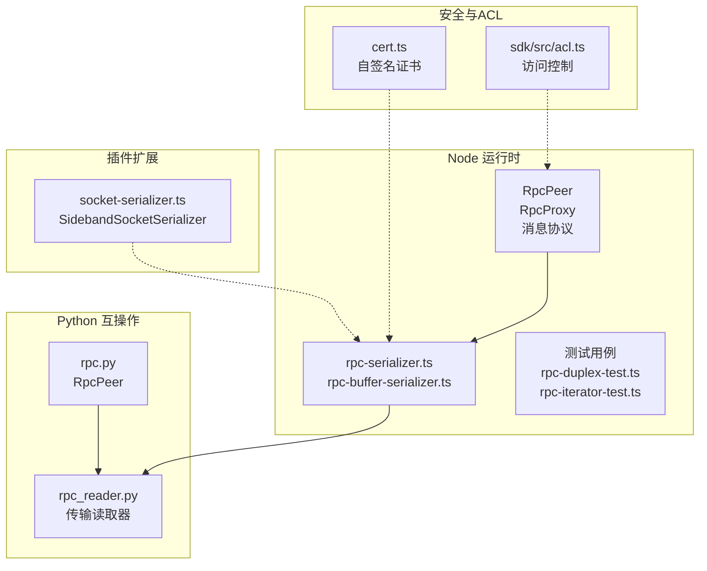
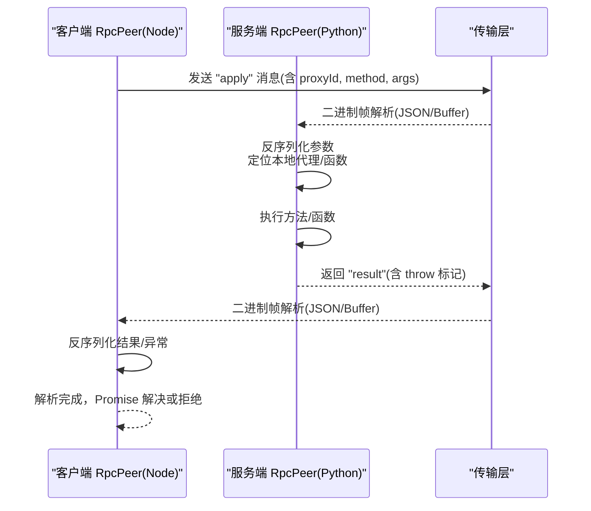
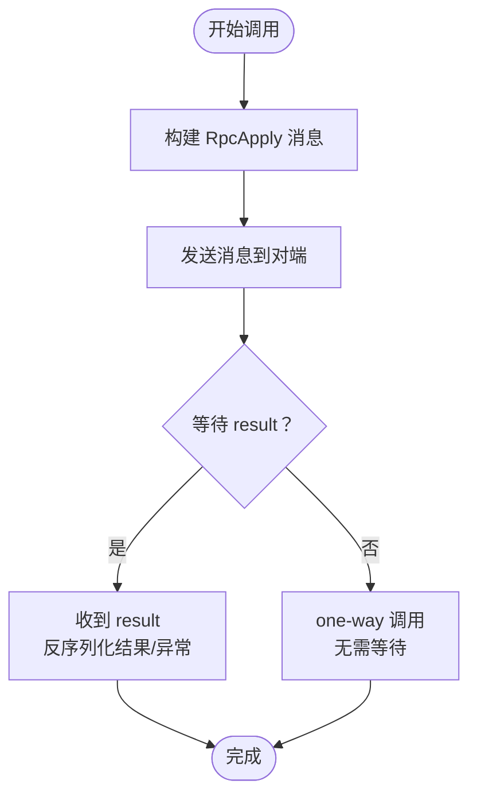
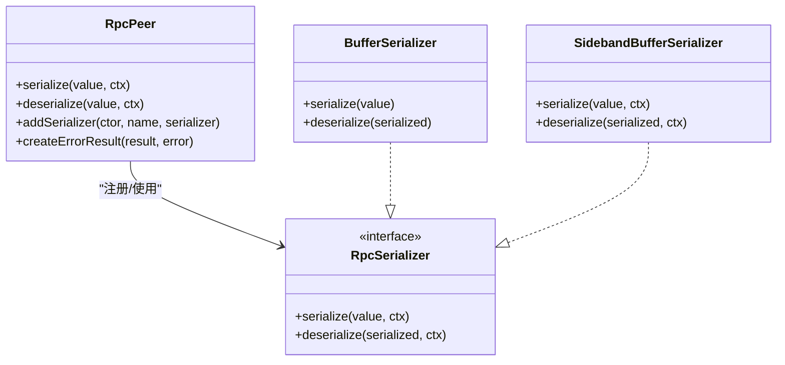
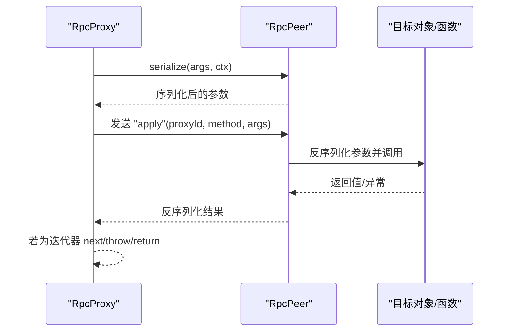
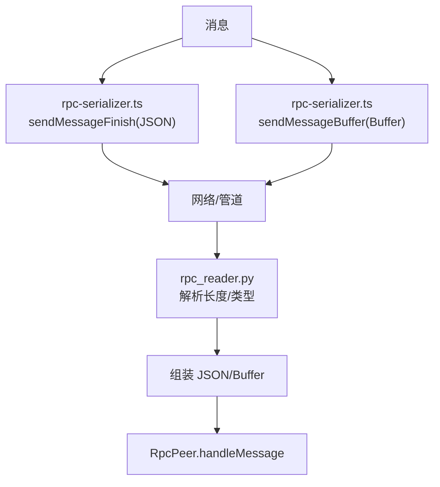
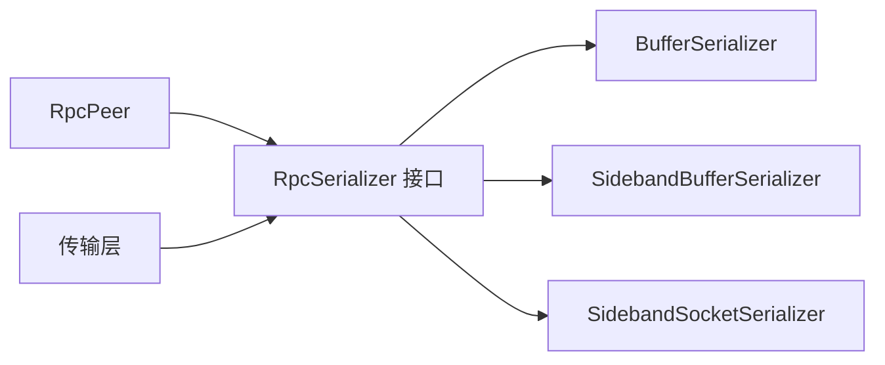

# RPC 接口规范

<cite>
**本文档引用的文件**
- [server/src/rpc.ts](file://server/src/rpc.ts)
- [server/src/rpc-serializer.ts](file://server/src/rpc-serializer.ts)
- [server/src/rpc-buffer-serializer.ts](file://server/src/rpc-buffer-serializer.ts)
- [server/python/rpc.py](file://server/python/rpc.py)
- [server/python/rpc_reader.py](file://server/python/rpc_reader.py)
- [server/test/rpc-duplex-test.ts](file://server/test/rpc-duplex-test.ts)
- [server/test/rpc-iterator-test.ts](file://server/test/rpc-iterator-test.ts)
- [server/test/rpc-proxy-set.ts](file://server/test/rpc-proxy-set.ts)
- [server/test/rpc-python-test.ts](file://server/test/rpc-python-test.ts)
- [packages/rpc/src/index.ts](file://packages/rpc/src/index.ts)
- [server/src/plugin/socket-serializer.ts](file://server/src/plugin/socket-serializer.ts)
- [server/src/cert.ts](file://server/src/cert.ts)
- [sdk/src/acl.ts](file://sdk/src/acl.ts)
</cite>

## 目录
1. [简介](#简介)
2. [项目结构](#项目结构)
3. [核心组件](#核心组件)
4. [架构总览](#架构总览)
5. [详细组件分析](#详细组件分析)
6. [依赖关系分析](#依赖关系分析)
7. [性能考量](#性能考量)
8. [故障排查指南](#故障排查指南)
9. [结论](#结论)
10. [附录](#附录)

## 简介
本规范面向 Scrypted 的 RPC（远程过程调用）子系统，覆盖以下主题：
- RPC 调用机制：方法调用、参数传递、返回值处理、异常传播
- RPC 对象的序列化与反序列化：数据类型映射、循环引用处理、大对象传输
- RPC 通道管理：连接建立、消息路由、多传输适配
- RPC 生命周期：超时与取消、迭代器支持、资源回收
- RPC 接口定义规范：接口声明、方法签名、参数验证
- 错误码与异常处理策略
- 性能优化：批量调用、缓冲侧带传输、缓存策略
- 客户端与服务端实现指南、调试工具使用
- 安全机制：访问控制、证书生成与加密传输

## 项目结构
Scrypted 的 RPC 子系统主要由以下模块组成：
- 核心运行时：Node 端的 RpcPeer、RpcProxy、消息协议与序列化
- Python 互操作：Python 端的 RpcPeer 实现与传输读取器
- 序列化器：通用消息编解码、缓冲侧带传输、数据通道分片
- 测试用例：双工连接、异步迭代器、跨语言交互
- 插件扩展：套接字句柄传输等平台特定序列化器
- 安全与访问控制：自签名证书与用户权限控制

**图表来源**
- [server/src/rpc.ts:285-839](file://server/src/rpc.ts#L285-L839)
- [server/src/rpc-serializer.ts:1-240](file://server/src/rpc-serializer.ts#L1-L240)
- [server/src/rpc-buffer-serializer.ts:1-32](file://server/src/rpc-buffer-serializer.ts#L1-L32)
- [server/python/rpc.py:157-241](file://server/python/rpc.py#L157-L241)
- [server/python/rpc_reader.py:41-182](file://server/python/rpc_reader.py#L41-L182)
- [server/src/plugin/socket-serializer.ts:1-15](file://server/src/plugin/socket-serializer.ts#L1-L15)
- [server/src/cert.ts:1-102](file://server/src/cert.ts#L1-L102)
- [sdk/src/acl.ts:1-124](file://sdk/src/acl.ts#L1-L124)

**章节来源**
- [server/src/rpc.ts:1-858](file://server/src/rpc.ts#L1-L858)
- [server/src/rpc-serializer.ts:1-240](file://server/src/rpc-serializer.ts#L1-L240)
- [server/src/rpc-buffer-serializer.ts:1-32](file://server/src/rpc-buffer-serializer.ts#L1-L32)
- [server/python/rpc.py:157-241](file://server/python/rpc.py#L157-L241)
- [server/python/rpc_reader.py:41-182](file://server/python/rpc_reader.py#L41-L182)
- [server/src/plugin/socket-serializer.ts:1-15](file://server/src/plugin/socket-serializer.ts#L1-L15)
- [server/src/cert.ts:1-102](file://server/src/cert.ts#L1-L102)
- [sdk/src/acl.ts:1-124](file://sdk/src/acl.ts#L1-L124)

## 核心组件
- RpcPeer：RPC 对等体，负责消息发送、参数/结果序列化、代理对象管理、错误传播、生命周期控制
- RpcProxy：代理处理器，拦截属性访问与函数调用，将调用转换为 RPC 消息
- 消息协议：apply、result、param、finalize 四类消息，统一通过 RpcMessage 接口表达
- 序列化器：默认 JSON 可序列化类型直传；Buffer/Uint8Array 采用侧带缓冲传输；自定义类型可注册构造名与序列化器
- 传输层：支持流式 TCP、WebSocket 数据通道、进程间文件描述符、套接字句柄等

**章节来源**
- [server/src/rpc.ts:29-839](file://server/src/rpc.ts#L29-L839)
- [server/src/rpc-serializer.ts:1-240](file://server/src/rpc-serializer.ts#L1-L240)
- [server/src/rpc-buffer-serializer.ts:1-32](file://server/src/rpc-buffer-serializer.ts#L1-L32)
- [server/python/rpc.py:157-241](file://server/python/rpc.py#L157-L241)

## 架构总览
RPC 架构分为“客户端/服务端对等体”与“传输适配层”。Node 端通过 rpc-serializer.ts 将消息编码为二进制帧（长度+类型+JSON 或 Buffer），Python 端通过 rpc_reader.py 解析相同格式。双方共享相同的序列化规则与代理模型。

**图表来源**
- [server/src/rpc.ts:714-839](file://server/src/rpc.ts#L714-L839)
- [server/src/rpc-serializer.ts:87-182](file://server/src/rpc-serializer.ts#L87-L182)
- [server/python/rpc.py:179-241](file://server/python/rpc.py#L179-L241)

## 详细组件分析

### 组件一：消息协议与生命周期
- 消息类型
  - apply：调用远端代理或函数，携带 proxyId、method、args；one-way 调用不期望返回
  - result：返回调用结果或异常，throw 标记区分成功/失败
  - param：请求远端参数值
  - finalize：通知销毁本地代理引用
- 生命周期
  - pendingResults：按消息 ID 管理未完成的 Promise
  - kill：冻结 pendingResults 并向所有挂起调用抛出 RPCResultError
  - yieldedAsyncIterators：跟踪异步迭代器的挂起状态，确保在 kill 时正确清理

**图表来源**
- [server/src/rpc.ts:39-839](file://server/src/rpc.ts#L39-L839)

**章节来源**
- [server/src/rpc.ts:29-839](file://server/src/rpc.ts#L29-L839)

### 组件二：序列化与反序列化
- 默认安全类型：Number、String、Object、Boolean、Array
- 传输安全检测：禁止 asyncIterator 与显式禁用标记的值直接作为参数
- 自定义类型：通过构造名与 RpcSerializer 注册，支持任意对象的序列化/反序列化
- 大对象传输：SidebandBufferSerializer 将 Buffer/TypedArray 以“侧带缓冲”方式发送，避免 JSON 编码开销
- 错误对象：统一序列化为特殊构造名，携带 name、message、stack

**图表来源**
- [server/src/rpc.ts:494-678](file://server/src/rpc.ts#L494-L678)
- [server/src/rpc-buffer-serializer.ts:1-32](file://server/src/rpc-buffer-serializer.ts#L1-L32)

**章节来源**
- [server/src/rpc.ts:402-678](file://server/src/rpc.ts#L402-L678)
- [server/src/rpc-buffer-serializer.ts:1-32](file://server/src/rpc-buffer-serializer.ts#L1-L32)

### 组件三：代理模型与异步迭代器
- RpcProxy：拦截属性访问与函数调用，将方法名与参数序列化为 RPC 调用
- 异步迭代器：通过 Symbol.asyncIterator 属性桥接 next/throw/return 方法
- 自定义属性：可通过代理属性映射设置/读取，用于传递上下文信息

**图表来源**
- [server/src/rpc.ts:84-220](file://server/src/rpc.ts#L84-L220)
- [server/test/rpc-iterator-test.ts:1-47](file://server/test/rpc-iterator-test.ts#L1-L47)

**章节来源**
- [server/src/rpc.ts:84-220](file://server/src/rpc.ts#L84-L220)
- [server/test/rpc-iterator-test.ts:1-47](file://server/test/rpc-iterator-test.ts#L1-L47)
- [server/test/rpc-proxy-set.ts:1-23](file://server/test/rpc-proxy-set.ts#L1-L23)

### 组件四：传输与通道管理
- 双工序列化器：将消息拆分为 JSON 帧与 Buffer 帧，分别发送，接收端按长度与类型重组
- 数据通道分片：针对 16KB 数据通道限制进行分片与去抖动合并
- Python 传输：基于文件描述符或套接字的读写器，支持异步读取与线程池解码
- 套接字句柄：通过 SidebandSocketSerializer 传输 Node.js Socket 句柄

**图表来源**
- [server/src/rpc-serializer.ts:87-182](file://server/src/rpc-serializer.ts#L87-L182)
- [server/python/rpc_reader.py:108-182](file://server/python/rpc_reader.py#L108-L182)
- [server/src/plugin/socket-serializer.ts:1-15](file://server/src/plugin/socket-serializer.ts#L1-L15)

**章节来源**
- [server/src/rpc-serializer.ts:1-240](file://server/src/rpc-serializer.ts#L1-L240)
- [server/python/rpc_reader.py:41-182](file://server/python/rpc_reader.py#L41-L182)
- [server/src/plugin/socket-serializer.ts:1-15](file://server/src/plugin/socket-serializer.ts#L1-L15)

### 组件五：跨语言互操作与测试
- Node → Python：通过子进程标准文件描述符建立通道，测试用例展示异步迭代器与参数传递
- 双工测试：使用本地回环网络端口，验证两端 RpcPeer 的互通性

**章节来源**
- [server/test/rpc-python-test.ts:1-48](file://server/test/rpc-python-test.ts#L1-L48)
- [server/test/rpc-duplex-test.ts:1-31](file://server/test/rpc-duplex-test.ts#L1-L31)

## 依赖关系分析
- RpcPeer 依赖序列化器与传输层；通过 addSerializer 注入自定义类型
- 传输层依赖底层 I/O（TCP、数据通道、文件描述符）
- 插件扩展通过自定义 RpcSerializer 适配平台能力（如套接字句柄）

**图表来源**
- [server/src/rpc.ts:269-301](file://server/src/rpc.ts#L269-L301)
- [server/src/rpc-buffer-serializer.ts:1-32](file://server/src/rpc-buffer-serializer.ts#L1-L32)
- [server/src/plugin/socket-serializer.ts:1-15](file://server/src/plugin/socket-serializer.ts#L1-L15)

**章节来源**
- [server/src/rpc.ts:269-301](file://server/src/rpc.ts#L269-L301)
- [server/src/rpc-buffer-serializer.ts:1-32](file://server/src/rpc-buffer-serializer.ts#L1-L32)
- [server/src/plugin/socket-serializer.ts:1-15](file://server/src/plugin/socket-serializer.ts#L1-L15)

## 性能考量
- 传输安全类型直传：减少序列化成本
- 侧带缓冲传输：避免大对象 JSON 编码与拷贝
- 数据通道分片：按 16KB 分片，结合去抖动合并，降低碎片化与内存峰值
- 异步迭代器挂起管理：在 kill 时主动抛错，避免悬挂迭代器占用资源
- 周期性垃圾回收：统计远端对象创建/回收，必要时触发 GC

**章节来源**
- [server/src/rpc.ts:1-27](file://server/src/rpc.ts#L1-L27)
- [server/src/rpc-serializer.ts:184-240](file://server/src/rpc-serializer.ts#L184-L240)
- [server/src/rpc.ts:410-416](file://server/src/rpc.ts#L410-L416)

## 故障排查指南
- 连接断开：传输层 onDisconnected 会调用 RpcPeer.kill，所有挂起调用将以 RPCResultError 结束
- 未知 result ID：handleMessage 中对未知 result 抛出错误
- 代理销毁：收到 finalize 消息后，移除本地代理映射
- Python 端异常：RPCResultError 名称与堆栈在两端保持一致，便于定位

**章节来源**
- [server/src/rpc-serializer.ts:33-41](file://server/src/rpc-serializer.ts#L33-L41)
- [server/src/rpc.ts:802-832](file://server/src/rpc.ts#L802-L832)
- [server/src/rpc.ts:816-829](file://server/src/rpc.ts#L816-L829)
- [server/python/rpc.py:237-241](file://server/python/rpc.py#L237-L241)

## 结论
Scrypted 的 RPC 子系统以简洁的消息协议与灵活的序列化模型为核心，既保证了跨语言互操作，又提供了高性能的大对象传输与完善的生命周期管理。通过 ACL 与证书机制，系统在功能开放的同时兼顾安全与可控性。

## 附录

### RPC 接口定义规范
- 接口声明：通过 RpcPeer.params 暴露方法或对象；通过 getParam 获取远端参数
- 方法签名：支持同步/异步函数、构造函数；异步迭代器需提供 next/throw/return 映射
- 参数验证：仅允许传输安全类型；自定义类型需注册序列化器
- 返回值处理：成功返回 result，异常通过 throw 标记与 RPCResultError 传播

**章节来源**
- [server/src/rpc.ts:476-486](file://server/src/rpc.ts#L476-L486)
- [server/src/rpc.ts:714-839](file://server/src/rpc.ts#L714-L839)

### 错误码与异常处理策略
- RPCResultError：统一异常包装，包含名称、消息、堆栈与对端标识
- 传输失败回退：sendResult 在序列化失败时自动发送错误结果
- kill 行为：冻结 pendingResults，拒绝所有未完成调用，并清理异步迭代器

**章节来源**
- [server/src/rpc.ts:229-240](file://server/src/rpc.ts#L229-L240)
- [server/src/rpc.ts:707-712](file://server/src/rpc.ts#L707-L712)
- [server/src/rpc.ts:439-456](file://server/src/rpc.ts#L439-L456)

### 客户端与服务端实现指南
- 客户端（Node）：使用 createDuplexRpcPeer 建立对等体，注册 Buffer/TypedArray 序列化器，发送消息时提供 serializationContext
- 服务端（Python）：使用 prepare_peer_readloop 建立对等体，遵循相同的 JSON/Buffer 帧格式
- 调试工具：利用 rpc-duplex-test 与 rpc-python-test 快速验证双端互通与异步迭代器行为

**章节来源**
- [server/src/rpc-serializer.ts:5-23](file://server/src/rpc-serializer.ts#L5-L23)
- [server/python/rpc_reader.py:1-52](file://server/python/rpc_reader.py#L1-L52)
- [server/test/rpc-duplex-test.ts:1-31](file://server/test/rpc-duplex-test.ts#L1-L31)
- [server/test/rpc-python-test.ts:1-48](file://server/test/rpc-python-test.ts#L1-L48)

### 安全机制
- 访问控制：通过 SDK 的 AccessControls 与设备/接口维度的 ACL 控制方法与属性访问
- 加密传输：自签名证书生成与复用，建议在生产环境启用 TLS

**章节来源**
- [sdk/src/acl.ts:1-124](file://sdk/src/acl.ts#L1-L124)
- [server/src/cert.ts:1-102](file://server/src/cert.ts#L1-L102)