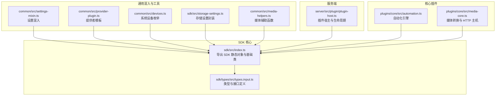
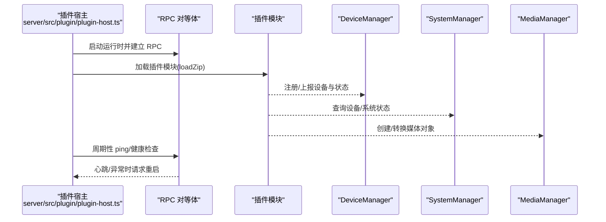
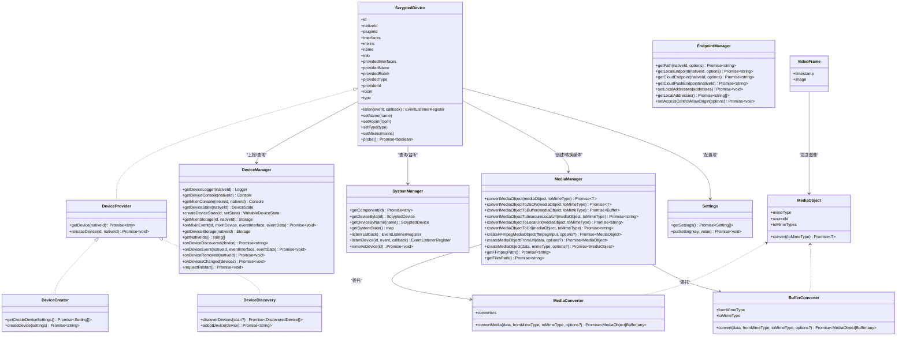
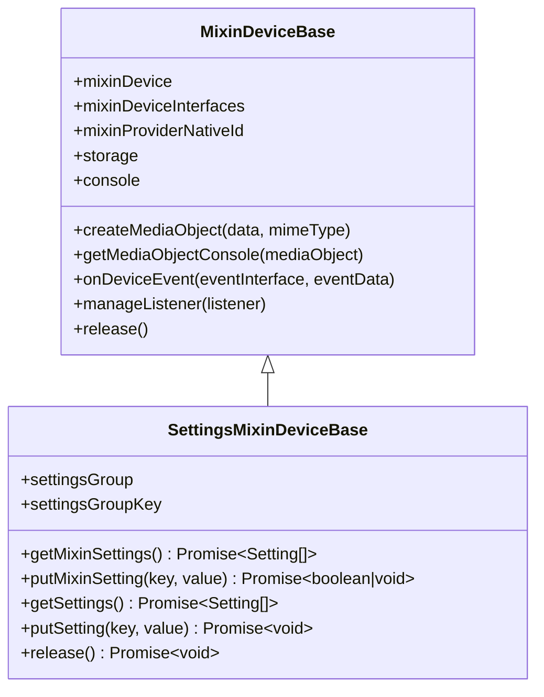
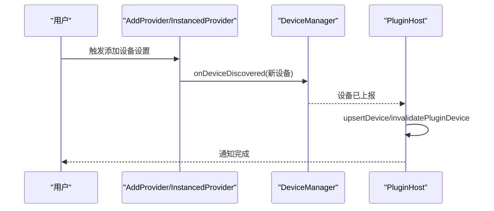
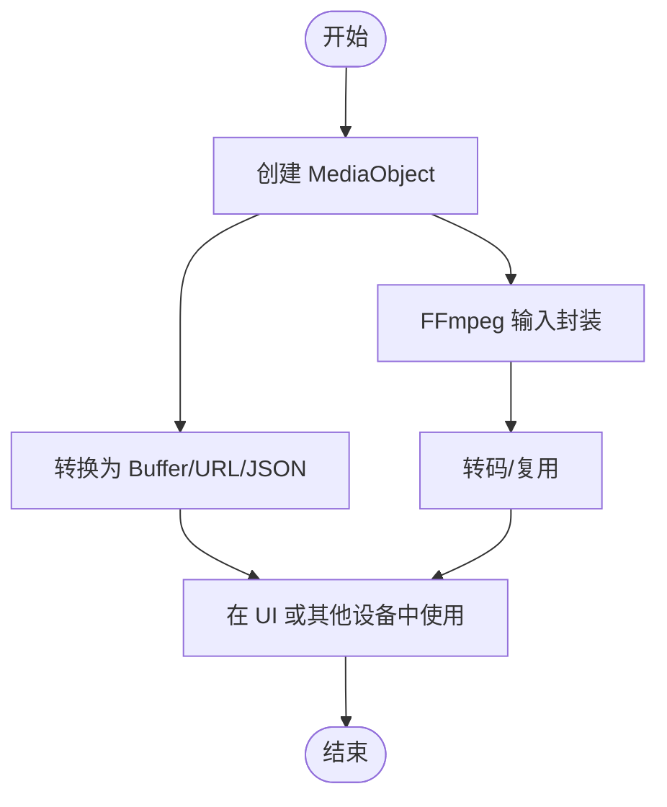
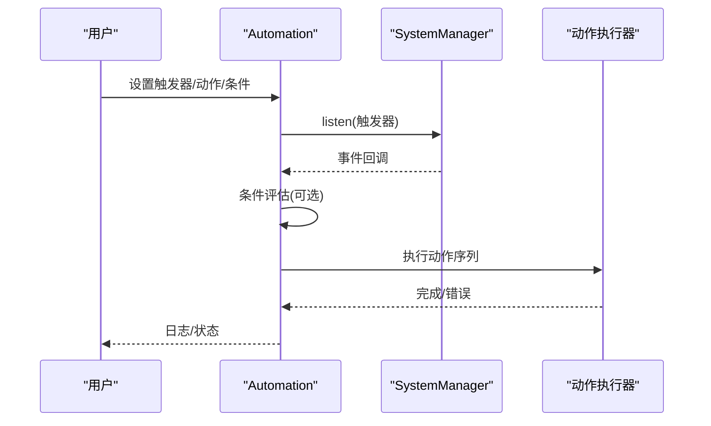
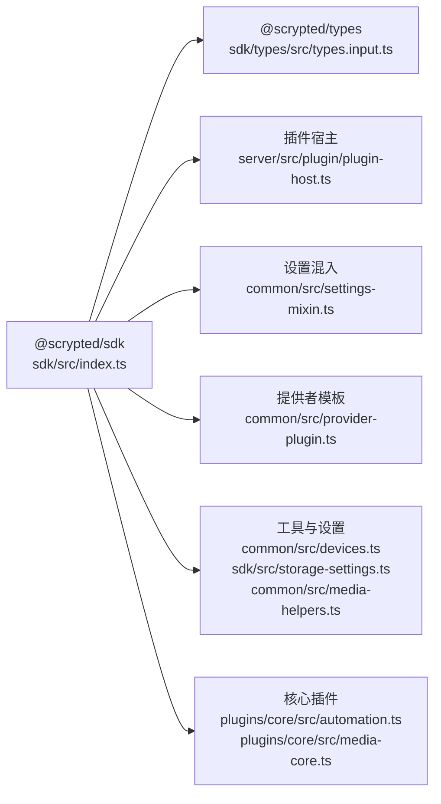

# SDK API 参考

<cite>
**本文引用的文件**
- [sdk/src/index.ts](file://sdk/src/index.ts)
- [common/src/settings-mixin.ts](file://common/src/settings-mixin.ts)
- [common/src/provider-plugin.ts](file://common/src/provider-plugin.ts)
- [server/src/plugin/plugin-host.ts](file://server/src/plugin/plugin-host.ts)
- [sdk/types/src/types.input.ts](file://sdk/types/src/types.input.ts)
- [plugins/core/src/automation.ts](file://plugins/core/src/automation.ts)
- [plugins/core/src/media-core.ts](file://plugins/core/src/media-core.ts)
- [common/src/devices.ts](file://common/src/devices.ts)
- [sdk/src/storage-settings.ts](file://sdk/src/storage-settings.ts)
- [common/src/media-helpers.ts](file://common/src/media-helpers.ts)
</cite>

## 目录
1. [简介](#简介)
2. [项目结构](#项目结构)
3. [核心组件](#核心组件)
4. [架构总览](#架构总览)
5. [详细组件分析](#详细组件分析)
6. [依赖关系分析](#依赖关系分析)
7. [性能考量](#性能考量)
8. [故障排查指南](#故障排查指南)
9. [结论](#结论)
10. [附录](#附录)

## 简介
本文件为 Scrypted SDK 的完整 API 参考，覆盖以下主题：
- 设备与提供者接口：Device、DeviceProvider、DeviceCreator、DeviceDiscovery 等
- 混入（Mixin）体系：MixinDeviceBase、SettingsMixinDeviceBase
- 提供者插件生命周期与事件：discoverDevices、getDevice、releaseDevice、onDeviceDiscovered、onDevicesChanged
- 媒体对象与流：MediaObject、VideoFrame、MediaManager、MediaConverter、FFmpeg 输入
- 自动化：触发器、动作、条件、运行时脚本与设备动作
- 工具与实用类：日志、网络端点、存储设置、设备枚举
- 兼容性与版本：接口描述符、类型版本、弃用标记与迁移建议

## 项目结构
SDK 与核心类型定义位于 sdk 与 sdk/types 目录；通用混入与插件模板位于 common；服务端插件宿主在 server；核心功能插件在 plugins。

图示来源
- [sdk/src/index.ts:1-297](file://sdk/src/index.ts#L1-L297)
- [sdk/types/src/types.input.ts:1-2897](file://sdk/types/src/types.input.ts#L1-L2897)
- [common/src/settings-mixin.ts:1-88](file://common/src/settings-mixin.ts#L1-L88)
- [common/src/provider-plugin.ts:1-99](file://common/src/provider-plugin.ts#L1-L99)
- [common/src/devices.ts:1-6](file://common/src/devices.ts#L1-L6)
- [sdk/src/storage-settings.ts:129-160](file://sdk/src/storage-settings.ts#L129-L160)
- [common/src/media-helpers.ts:1-2](file://common/src/media-helpers.ts#L1-L2)
- [server/src/plugin/plugin-host.ts:1-506](file://server/src/plugin/plugin-host.ts#L1-L506)
- [plugins/core/src/automation.ts:1-597](file://plugins/core/src/automation.ts#L1-L597)
- [plugins/core/src/media-core.ts:1-145](file://plugins/core/src/media-core.ts#L1-L145)

章节来源
- [sdk/src/index.ts:1-297](file://sdk/src/index.ts#L1-L297)
- [sdk/types/src/types.input.ts:1-2897](file://sdk/types/src/types.input.ts#L1-L2897)

## 核心组件
本节概述 SDK 中最常用的类与接口，帮助快速定位 API。

- ScryptedDeviceBase：设备基类，提供 storage、log、console、createMediaObject、onDeviceEvent 等能力
- MixinDeviceBase：混入设备基类，支持 mixinDevice、mixinDeviceInterfaces、mixinStorageSuffix、onMixinEvent 等
- SettingsMixinDeviceBase：在 MixinDeviceBase 上实现 Settings 接口，统一聚合“扩展设置”与“被混入设备设置”
- DeviceManager：设备状态、日志、存储、事件、设备上报等管理
- SystemManager：系统设备查询、事件订阅、组件访问
- MediaManager：媒体对象创建、转换、本地/公网 URL 获取
- EndpointManager：本地/云/推送到客户端的端点路径生成
- DeviceProvider/DeviceCreator/DeviceDiscovery：提供者生命周期与设备发现/创建/采用流程
- MediaConverter/BufferConverter：媒体格式转换
- MediaObject/VideoFrame：媒体数据结构与帧抽象
- Settings：设备配置项定义与持久化
- Automation：自动化触发器、动作、条件与执行

章节来源
- [sdk/src/index.ts:10-167](file://sdk/src/index.ts#L10-L167)
- [sdk/types/src/types.input.ts:1198-1270](file://sdk/types/src/types.input.ts#L1198-L1270)
- [sdk/types/src/types.input.ts:1461-1466](file://sdk/types/src/types.input.ts#L1461-L1466)
- [sdk/types/src/types.input.ts:1915-1972](file://sdk/types/src/types.input.ts#L1915-L1972)
- [sdk/types/src/types.input.ts:2382-2486](file://sdk/types/src/types.input.ts#L2382-L2486)
- [plugins/core/src/automation.ts:30-597](file://plugins/core/src/automation.ts#L30-L597)
- [plugins/core/src/media-core.ts:9-145](file://plugins/core/src/media-core.ts#L9-L145)

## 架构总览
SDK 通过 ScryptedStatic 将 DeviceManager、SystemManager、MediaManager、EndpointManager、ClusterManager 等注入到插件运行时。插件宿主负责加载插件、建立 RPC 通道、健康检查与重启策略，并在需要时创建媒体管理器或 IO 连接。

图示来源
- [server/src/plugin/plugin-host.ts:226-274](file://server/src/plugin/plugin-host.ts#L226-L274)
- [server/src/plugin/plugin-host.ts:276-328](file://server/src/plugin/plugin-host.ts#L276-L328)
- [server/src/plugin/plugin-host.ts:428-463](file://server/src/plugin/plugin-host.ts#L428-L463)
- [sdk/src/index.ts:206-293](file://sdk/src/index.ts#L206-L293)

## 详细组件分析

### 设备与提供者接口
- ScryptedDevice：设备标识、名称、类型、接口列表、混入列表、属性与事件监听
- DeviceProvider：按 nativeId 返回设备实例、释放设备
- DeviceCreator：用户创建设备的设置项与创建逻辑
- DeviceDiscovery：发现设备、采用设备
- DeviceManager：上报设备、事件、状态变更；获取日志/控制台/存储；触发 mixin 事件
- SystemManager：按 id/name 获取设备；监听系统事件；访问系统组件
- EndpointManager：生成本地/云/推送端点路径
- MediaManager：创建 MediaObject、转换为 Buffer/URL/JSON；FFmpeg 输入封装
- MediaConverter/BufferConverter：媒体格式转换
- MediaObject/VideoFrame：媒体对象与视频帧结构
- Settings：设备配置项定义与持久化

图示来源
- [sdk/types/src/types.input.ts:17-50](file://sdk/types/src/types.input.ts#L17-L50)
- [sdk/types/src/types.input.ts:1276-1288](file://sdk/types/src/types.input.ts#L1276-L1288)
- [sdk/types/src/types.input.ts:1309-1315](file://sdk/types/src/types.input.ts#L1309-L1315)
- [sdk/types/src/types.input.ts:1337-1349](file://sdk/types/src/types.input.ts#L1337-L1349)
- [sdk/types/src/types.input.ts:1198-1270](file://sdk/types/src/types.input.ts#L1198-L1270)
- [sdk/types/src/types.input.ts:2150-2206](file://sdk/types/src/types.input.ts#L2150-L2206)
- [sdk/types/src/types.input.ts:2055-2144](file://sdk/types/src/types.input.ts#L2055-L2144)
- [sdk/types/src/types.input.ts:1915-1972](file://sdk/types/src/types.input.ts#L1915-L1972)
- [sdk/types/src/types.input.ts:1453-1457](file://sdk/types/src/types.input.ts#L1453-L1457)
- [sdk/types/src/types.input.ts:1443-1448](file://sdk/types/src/types.input.ts#L1443-L1448)
- [sdk/types/src/types.input.ts:298-304](file://sdk/types/src/types.input.ts#L298-L304)
- [sdk/types/src/types.input.ts:1789-1793](file://sdk/types/src/types.input.ts#L1789-L1793)
- [sdk/types/src/types.input.ts:1461-1466](file://sdk/types/src/types.input.ts#L1461-L1466)

章节来源
- [sdk/types/src/types.input.ts:17-50](file://sdk/types/src/types.input.ts#L17-L50)
- [sdk/types/src/types.input.ts:1198-1270](file://sdk/types/src/types.input.ts#L1198-L1270)
- [sdk/types/src/types.input.ts:1276-1288](file://sdk/types/src/types.input.ts#L1276-L1288)
- [sdk/types/src/types.input.ts:1309-1315](file://sdk/types/src/types.input.ts#L1309-L1315)
- [sdk/types/src/types.input.ts:1337-1349](file://sdk/types/src/types.input.ts#L1337-L1349)
- [sdk/types/src/types.input.ts:1915-1972](file://sdk/types/src/types.input.ts#L1915-L1972)
- [sdk/types/src/types.input.ts:2055-2144](file://sdk/types/src/types.input.ts#L2055-L2144)
- [sdk/types/src/types.input.ts:2150-2206](file://sdk/types/src/types.input.ts#L2150-L2206)
- [sdk/types/src/types.input.ts:1453-1457](file://sdk/types/src/types.input.ts#L1453-L1457)
- [sdk/types/src/types.input.ts:1443-1448](file://sdk/types/src/types.input.ts#L1443-L1448)
- [sdk/types/src/types.input.ts:298-304](file://sdk/types/src/types.input.ts#L298-L304)
- [sdk/types/src/types.input.ts:1789-1793](file://sdk/types/src/types.input.ts#L1789-L1793)
- [sdk/types/src/types.input.ts:1461-1466](file://sdk/types/src/types.input.ts#L1461-L1466)

### 混入与设置混入
- MixinDeviceBase：封装 mixinDevice、mixinDeviceInterfaces、mixinStorageSuffix、mixinProviderNativeId；提供 storage/console/createMediaObject/onMixinEvent；管理事件监听与释放
- SettingsMixinDeviceBase：在 MixinDeviceBase 上实现 Settings；聚合“扩展设置”与“被混入设备设置”，自动处理组名与键前缀映射

图示来源
- [sdk/src/index.ts:87-167](file://sdk/src/index.ts#L87-L167)
- [common/src/settings-mixin.ts:11-87](file://common/src/settings-mixin.ts#L11-L87)

章节来源
- [sdk/src/index.ts:87-167](file://sdk/src/index.ts#L87-L167)
- [common/src/settings-mixin.ts:11-87](file://common/src/settings-mixin.ts#L11-L87)

### 提供者插件接口与生命周期
- AddProvider/InstancedProvider：通过 Settings 提供“添加新设备”的入口，调用 DeviceManager.onDeviceDiscovered 完成设备上报
- enableInstanceableProviderMode：迁移当前提供者为“实例模式”，将旧设备迁移到新的 providerNativeId 下
- 插件宿主 PluginHost：启动运行时、建立 RPC、加载插件、健康检查、IO/WebSocket 处理、设备更新与失效

图示来源
- [common/src/provider-plugin.ts:6-44](file://common/src/provider-plugin.ts#L6-L44)
- [server/src/plugin/plugin-host.ts:90-120](file://server/src/plugin/plugin-host.ts#L90-L120)

章节来源
- [common/src/provider-plugin.ts:6-44](file://common/src/provider-plugin.ts#L6-L44)
- [common/src/provider-plugin.ts:52-99](file://common/src/provider-plugin.ts#L52-L99)
- [server/src/plugin/plugin-host.ts:90-120](file://server/src/plugin/plugin-host.ts#L90-L120)

### 媒体对象与流
- MediaObject：媒体对象，包含 mimeType、sourceId、toMimeTypes、convert 方法
- VideoFrame：包含时间戳与图像对象
- MediaManager：创建 MediaObject、转换为 Buffer/URL/JSON、FFmpeg 输入封装
- MediaCore：作为 DeviceProvider 提供 HTTP/HTTPS 文件与 RequestMediaObject 主机，支持相机截图与视频流转换

图示来源
- [sdk/types/src/types.input.ts:298-304](file://sdk/types/src/types.input.ts#L298-L304)
- [sdk/types/src/types.input.ts:1789-1793](file://sdk/types/src/types.input.ts#L1789-L1793)
- [sdk/types/src/types.input.ts:1915-1972](file://sdk/types/src/types.input.ts#L1915-L1972)
- [plugins/core/src/media-core.ts:9-145](file://plugins/core/src/media-core.ts#L9-L145)

章节来源
- [sdk/types/src/types.input.ts:298-304](file://sdk/types/src/types.input.ts#L298-L304)
- [sdk/types/src/types.input.ts:1789-1793](file://sdk/types/src/types.input.ts#L1789-L1793)
- [sdk/types/src/types.input.ts:1915-1972](file://sdk/types/src/types.input.ts#L1915-L1972)
- [plugins/core/src/media-core.ts:9-145](file://plugins/core/src/media-core.ts#L9-L145)

### 自动化接口
- Automation：实现 OnOff 与 Settings；维护 triggers/actions 列表；根据条件评估与去噪策略执行动作；支持脚本、Shell 脚本、等待、更新插件、设备动作
- 触发器：设备事件或定时器
- 动作：脚本、Shell、等待、更新插件、设备动作
- 条件：JavaScript 表达式，基于事件数据

图示来源
- [plugins/core/src/automation.ts:30-597](file://plugins/core/src/automation.ts#L30-L597)

章节来源
- [plugins/core/src/automation.ts:30-597](file://plugins/core/src/automation.ts#L30-L597)

### 实用工具类与 API
- ScryptedDeviceBase：提供 storage/log/console 访问；createMediaObject；onDeviceEvent
- getAllDevices：从 SystemManager 获取系统内所有设备
- StorageSettings：将对象属性映射为 Setting，支持 onGet/onPut/mapGet/mapPut 等钩子
- media-helpers：安全终止 FFmpeg、打印初始输出、打印 FFmpeg 参数

章节来源
- [sdk/src/index.ts:10-71](file://sdk/src/index.ts#L10-L71)
- [common/src/devices.ts:3-6](file://common/src/devices.ts#L3-L6)
- [sdk/src/storage-settings.ts:129-160](file://sdk/src/storage-settings.ts#L129-L160)
- [common/src/media-helpers.ts:1-2](file://common/src/media-helpers.ts#L1-L2)

## 依赖关系分析
SDK 通过 ScryptedStatic 将各管理器注入插件；插件宿主负责生命周期与通信；媒体与网络端点由核心插件提供；混入与设置通过通用模块实现。

图示来源
- [sdk/src/index.ts:1-297](file://sdk/src/index.ts#L1-L297)
- [sdk/types/src/types.input.ts:1-2897](file://sdk/types/src/types.input.ts#L1-L2897)
- [server/src/plugin/plugin-host.ts:1-506](file://server/src/plugin/plugin-host.ts#L1-L506)
- [common/src/settings-mixin.ts:1-88](file://common/src/settings-mixin.ts#L1-L88)
- [common/src/provider-plugin.ts:1-99](file://common/src/provider-plugin.ts#L1-L99)
- [common/src/devices.ts:1-6](file://common/src/devices.ts#L1-L6)
- [sdk/src/storage-settings.ts:129-160](file://sdk/src/storage-settings.ts#L129-L160)
- [common/src/media-helpers.ts:1-2](file://common/src/media-helpers.ts#L1-L2)
- [plugins/core/src/automation.ts:1-597](file://plugins/core/src/automation.ts#L1-L597)
- [plugins/core/src/media-core.ts:1-145](file://plugins/core/src/media-core.ts#L1-L145)

章节来源
- [sdk/src/index.ts:1-297](file://sdk/src/index.ts#L1-L297)
- [server/src/plugin/plugin-host.ts:1-506](file://server/src/plugin/plugin-host.ts#L1-L506)

## 性能考量
- 去噪事件：Automation 支持 denoiseEvents，避免重复事件触发
- 去抖与重置：runToCompletion 与 staticEvents 控制并发与重置行为
- 流媒体预缓冲：MediaStreamOptions 支持预缓冲大小与字节限制
- FFmpeg 安全：提供安全终止与日志打印工具，避免资源泄漏
- 插件健康检查：宿主定期 ping，超时自动重启，保障稳定性

## 故障排查指南
- 插件加载失败：查看宿主日志中的“plugin load error”与“plugin failed to start”
- 插件无响应：检查 ping 超时与健康检查间隔
- 设备未显示：确认 onDeviceDiscovered/onDevicesChanged 是否正确上报
- 设置加载失败：SettingsMixin 在异常时会注入只读错误项，便于定位
- 媒体转换失败：检查 toMimeType 与 convertMediaObject 的可用性

章节来源
- [server/src/plugin/plugin-host.ts:247-273](file://server/src/plugin/plugin-host.ts#L247-L273)
- [server/src/plugin/plugin-host.ts:307-325](file://server/src/plugin/plugin-host.ts#L307-L325)
- [common/src/settings-mixin.ts:35-69](file://common/src/settings-mixin.ts#L35-L69)

## 结论
本参考文档系统梳理了 Scrypted SDK 的核心接口、混入机制、提供者生命周期、媒体对象与自动化能力，并提供了架构与依赖关系图示。开发者可据此快速实现设备、提供者、混入与自动化功能，并结合性能与故障排查建议优化插件质量。

## 附录
- 版本与兼容性：接口描述符通过 TYPES_VERSION 注入，支持自定义描述符合并
- 弃用标记：部分接口存在弃用注解，迁移时请参考对应接口的新实现
- 最佳实践：优先使用 SystemManager 查询设备；通过 DeviceManager 上报状态与事件；使用 MediaManager 统一媒体转换；在 Automation 中合理设置去噪与重置策略

章节来源
- [sdk/src/index.ts:270-290](file://sdk/src/index.ts#L270-L290)
- [sdk/types/src/types.input.ts:105-162](file://sdk/types/src/types.input.ts#L105-L162)