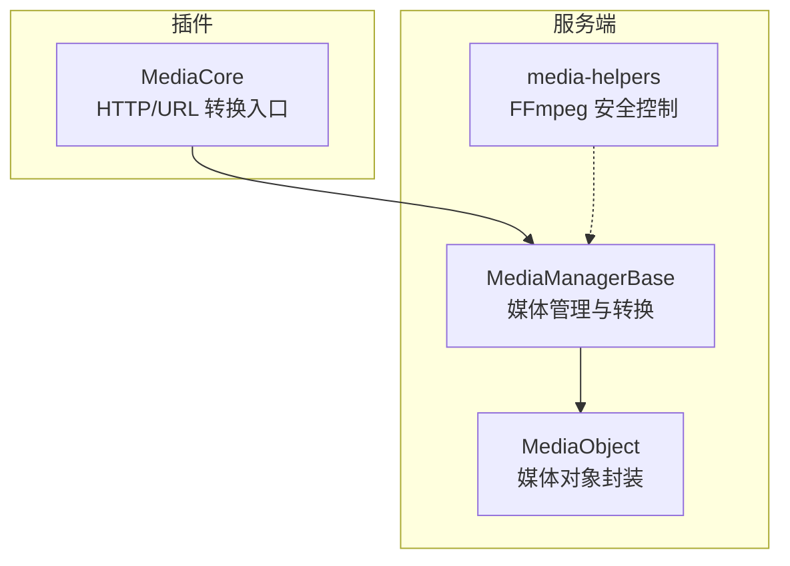
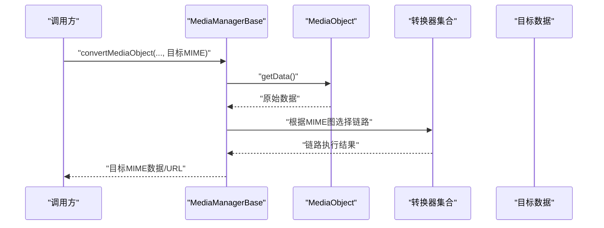
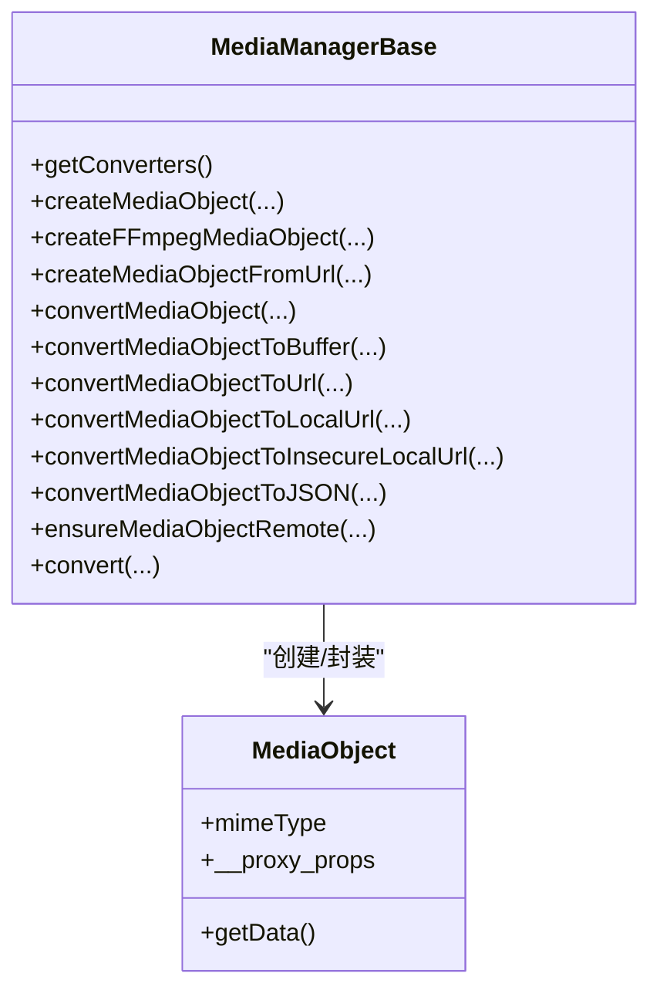
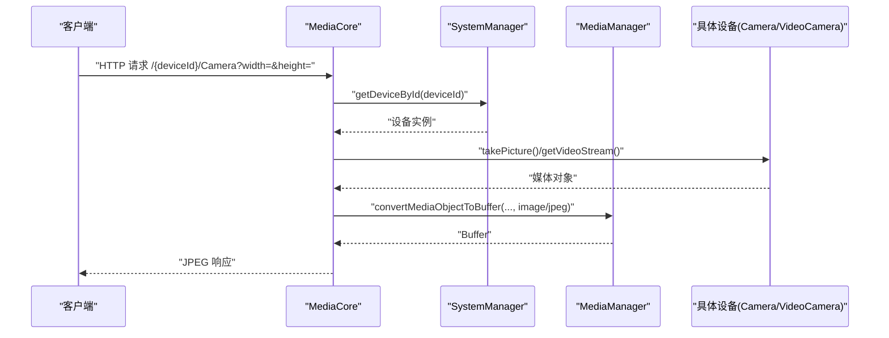
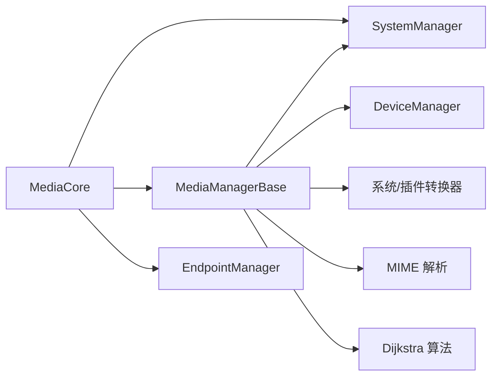

# 媒体处理 API

<cite>
**本文引用的文件**
- [server/src/plugin/mediaobject.ts](file://server/src/plugin/mediaobject.ts)
- [server/src/plugin/media.ts](file://server/src/plugin/media.ts)
- [server/src/media-helpers.ts](file://server/src/media-helpers.ts)
- [plugins/core/src/media-core.ts](file://plugins/core/src/media-core.ts)
- [common/src/media-helpers.ts](file://common/src/media-helpers.ts)
</cite>

## 目录
1. [简介](#简介)
2. [项目结构](#项目结构)
3. [核心组件](#核心组件)
4. [架构总览](#架构总览)
5. [详细组件分析](#详细组件分析)
6. [依赖关系分析](#依赖关系分析)
7. [性能考虑](#性能考虑)
8. [故障排查指南](#故障排查指南)
9. [结论](#结论)
10. [附录：常见用法与示例路径](#附录常见用法与示例路径)

## 简介
本文件为 Scrypted 媒体处理 API 的权威参考，聚焦以下目标：
- 全面说明 MediaObject 接口的方法与属性，覆盖媒体数据访问、元数据获取、格式转换等能力
- 解释 VideoFrame/AudioFrame 在当前代码库中的角色与使用方式（以现有实现为准）
- 记录媒体对象的创建与管理流程：从不同数据源创建、设置属性、获取数据
- 提供媒体格式转换 API 的说明：编解码器选择、参数配置、质量控制思路
- 定义媒体流处理接口：开始、停止、暂停、恢复等控制操作
- 给出可直接定位到源码的示例路径，便于快速上手
- 总结性能优化与内存管理建议

## 项目结构
围绕媒体处理的核心代码主要分布在以下位置：
- 服务端媒体管理与转换：server/src/plugin/media.ts
- 媒体对象封装：server/src/plugin/mediaobject.ts
- 媒体辅助工具（FFmpeg 安全控制）：server/src/media-helpers.ts
- 核心媒体设备与 HTTP 转换入口：plugins/core/src/media-core.ts
- 类型与公共导出：common/src/media-helpers.ts（导出 server/src/media-helpers）

图表来源
- [server/src/plugin/media.ts:40-472](file://server/src/plugin/media.ts#L40-L472)
- [server/src/plugin/mediaobject.ts:5-25](file://server/src/plugin/mediaobject.ts#L5-L25)
- [server/src/media-helpers.ts:11-97](file://server/src/media-helpers.ts#L11-L97)
- [plugins/core/src/media-core.ts:9-145](file://plugins/core/src/media-core.ts#L9-L145)

章节来源
- [server/src/plugin/media.ts:40-472](file://server/src/plugin/media.ts#L40-L472)
- [server/src/plugin/mediaobject.ts:5-25](file://server/src/plugin/mediaobject.ts#L5-L25)
- [server/src/media-helpers.ts:11-97](file://server/src/media-helpers.ts#L11-L97)
- [plugins/core/src/media-core.ts:9-145](file://plugins/core/src/media-core.ts#L9-L145)
- [common/src/media-helpers.ts:1-2](file://common/src/media-helpers.ts#L1-L2)

## 核心组件
- MediaManagerBase：统一的媒体对象创建、转换与路由选择逻辑，支持内置转换器、系统级转换器与插件扩展转换器
- MediaObject：对任意数据进行封装，暴露 getData 获取底层数据，并支持通过选项传递元数据与转换提示
- MediaCore：将 scrypted-media 协议映射为具体设备接口（如 Camera/VideoCamera），并生成本地/远程 URL 或请求式媒体对象
- media-helpers：提供 FFmpeg 进程安全退出、日志过滤与参数打印等辅助能力

章节来源
- [server/src/plugin/media.ts:40-472](file://server/src/plugin/media.ts#L40-L472)
- [server/src/plugin/mediaobject.ts:5-25](file://server/src/plugin/mediaobject.ts#L5-L25)
- [plugins/core/src/media-core.ts:9-145](file://plugins/core/src/media-core.ts#L9-L145)
- [server/src/media-helpers.ts:11-97](file://server/src/media-helpers.ts#L11-L97)

## 架构总览
媒体处理的整体流程如下：
- 输入媒体对象或 URL/文件路径等数据源
- 通过 MediaManagerBase 的转换器图算法选择最优链路
- 执行链路上的各转换器，最终输出目标 MIME 类型的数据
- 可选地生成本地/远程 URL 以便后续消费

图表来源
- [server/src/plugin/media.ts:313-471](file://server/src/plugin/media.ts#L313-L471)
- [server/src/plugin/mediaobject.ts:22-24](file://server/src/plugin/mediaobject.ts#L22-L24)

## 详细组件分析

### MediaObject 封装与属性
- 角色：对任意数据进行封装，暴露 getData 获取底层数据；构造时可传入选项，用于声明 toMimeTypes、convert 等元信息
- 关键点：
  - 支持在构造时将“可传输”的选项作为代理属性挂载，便于跨进程/网络传递
  - getData 返回 Buffer 或字符串，具体类型取决于底层数据
- 典型用途：作为转换链路的输入节点，或承载转换后的中间/最终数据

章节来源
- [server/src/plugin/mediaobject.ts:5-25](file://server/src/plugin/mediaobject.ts#L5-L25)

### MediaManagerBase：媒体对象创建与转换
- 媒体对象创建
  - createMediaObject：从任意数据与 MIME 创建 MediaObject
  - createFFmpegMediaObject：从 FFmpegInput 创建媒体对象
  - createMediaObjectFromUrl：从 URL 创建媒体对象（自动推断协议 MIME）
  - createMediaObjectRemote：通用封装，确保返回 MediaObjectRemote
- 转换链路
  - convertMediaObject：将媒体对象转换为目标 MIME
  - convertMediaObjectToBuffer/Url/LocalUrl/InsecureLocalUrl：转换为特定载体（Buffer/URL/本地URL/不安全本地URL）
  - convertMediaObjectToJSON：兼容旧版 JSON 输出
- 转换器来源
  - 内置转换器：HTTP/HTTPS 文件/URL 到媒体对象、FFmpegInput 互转、图像直通等
  - 系统转换器：扫描系统中具备 BufferConverter/MediaConverter 接口的设备
  - 插件扩展转换器：addConverter/clearConverters 动态注入
- 路由策略
  - 使用 Dijkstra 最短路径算法在 MIME 图中寻找最优链路
  - 支持 MIME 参数权重（converter-weight）影响路径选择
  - 支持媒体对象自身声明 toMimeTypes 作为内建目标

图表来源
- [server/src/plugin/media.ts:40-472](file://server/src/plugin/media.ts#L40-L472)
- [server/src/plugin/mediaobject.ts:5-25](file://server/src/plugin/mediaobject.ts#L5-L25)

章节来源
- [server/src/plugin/media.ts:40-472](file://server/src/plugin/media.ts#L40-L472)

### MediaCore：协议到设备接口的桥接
- 将 scrypted-media 协议解析为具体设备接口（Camera/VideoCamera）
- 支持生成本地快照 URL 或请求式媒体对象（RequestMediaObject）
- 提供 HTTP 请求处理器，按查询参数生成图片或视频流

图表来源
- [plugins/core/src/media-core.ts:68-128](file://plugins/core/src/media-core.ts#L68-L128)
- [server/src/plugin/media.ts:252-279](file://server/src/plugin/media.ts#L252-L279)

章节来源
- [plugins/core/src/media-core.ts:9-145](file://plugins/core/src/media-core.ts#L9-L145)

### FFmpeg 辅助工具：安全与日志
- safeKillFFmpeg：优雅关闭 FFmpeg 子进程，尝试写入退出指令后强制销毁
- ffmpegLogInitialOutput：过滤噪声日志，仅在检测到视频/音频帧时停止高频日志
- safePrintFFmpegArguments：打印 FFmpeg 参数并安全脱敏（如 -i 后的 URL 密码）

章节来源
- [server/src/media-helpers.ts:11-97](file://server/src/media-helpers.ts#L11-L97)
- [common/src/media-helpers.ts:1-2](file://common/src/media-helpers.ts#L1-L2)

## 依赖关系分析
- MediaManagerBase 依赖：
  - 系统状态与设备管理（SystemManager/DeviceManager）
  - 转换器来源（系统设备与插件扩展）
  - MIME 解析与图算法（node-dijkstra）
- MediaObject 依赖：
  - RpcPeer 的传输安全判定，决定哪些选项可被代理传输
- MediaCore 依赖：
  - SystemManager 获取设备实例
  - MediaManager 执行转换
  - EndpointManager 生成认证路径

图表来源
- [server/src/plugin/media.ts:190-242](file://server/src/plugin/media.ts#L190-L242)
- [plugins/core/src/media-core.ts:4-6](file://plugins/core/src/media-core.ts#L4-L6)

章节来源
- [server/src/plugin/media.ts:190-242](file://server/src/plugin/media.ts#L190-L242)
- [plugins/core/src/media-core.ts:4-6](file://plugins/core/src/media-core.ts#L4-L6)

## 性能考虑
- 转换链路优化
  - 使用 MIME 参数 converter-weight 控制路径权重，避免滥用通配转换器
  - 优先使用系统/插件提供的高效转换器，减少不必要的中间格式
- 数据传输
  - MediaObject 构造时仅将“可传输”的选项放入 __proxy_props，降低序列化开销
  - 对于大体积媒体，尽量使用 URL/流式数据而非直接传输大 Buffer
- FFmpeg 进程管理
  - 使用 safeKillFFmpeg 避免僵尸进程与资源泄漏
  - 结合 ffmpegLogInitialOutput 减少高频日志带来的 IO 压力
- 缓存与复用
  - 对重复请求的图片/缩略图，利用短 TTL 缓存（参考 MediaCore 中的缓存头设置）

章节来源
- [server/src/plugin/media.ts:372-401](file://server/src/plugin/media.ts#L372-L401)
- [server/src/plugin/mediaobject.ts:15-19](file://server/src/plugin/mediaobject.ts#L15-L19)
- [server/src/media-helpers.ts:11-71](file://server/src/media-helpers.ts#L11-L71)
- [plugins/core/src/media-core.ts:89-96](file://plugins/core/src/media-core.ts#L89-L96)

## 故障排查指南
- 无可用转换器
  - 现象：抛出“未找到转换器”错误
  - 排查：确认目标 MIME 是否可达，检查转换器权重与匹配规则
- FFmpeg 异常退出或卡死
  - 使用 safeKillFFmpeg 主动终止进程
  - 检查 ffmpegLogInitialOutput 是否已过滤噪声日志
  - 使用 safePrintFFmpegArguments 打印参数，定位问题
- 权限与证书
  - HTTPS 下可通过 https.Agent 配置忽略校验（谨慎使用）
- URL/路径问题
  - 确认 createMediaObjectFromUrl 的协议前缀与实际资源一致
  - 对于 file 协议，确认文件存在且可读

章节来源
- [server/src/plugin/media.ts:428-431](file://server/src/plugin/media.ts#L428-L431)
- [server/src/media-helpers.ts:23-38](file://server/src/media-helpers.ts#L23-L38)
- [server/src/plugin/media.ts:23-25](file://server/src/plugin/media.ts#L23-L25)
- [server/src/plugin/media.ts:301-307](file://server/src/plugin/media.ts#L301-L307)

## 结论
Scrypted 的媒体处理 API 通过 MediaManagerBase 提供了统一的媒体对象创建与转换框架，结合系统与插件转换器，实现了灵活高效的格式转换与分发。MediaCore 将协议层与设备层打通，使上层应用可便捷地获取图片/视频流。配合 media-helpers 的 FFmpeg 安全与日志能力，整体方案在易用性与稳定性之间取得良好平衡。

## 附录：常见用法与示例路径
- 从 URL 创建媒体对象并转换为 Buffer
  - [server/src/plugin/media.ts:301-311](file://server/src/plugin/media.ts#L301-L311)
  - [server/src/plugin/media.ts:264-267](file://server/src/plugin/media.ts#L264-L267)
- 从 FFmpegInput 创建媒体对象并生成本地 URL
  - [server/src/plugin/media.ts:297-299](file://server/src/plugin/media.ts#L297-L299)
  - [server/src/plugin/media.ts:268-273](file://server/src/plugin/media.ts#L268-L273)
- 生成本地快照 URL 并返回 JPEG
  - [plugins/core/src/media-core.ts:105-109](file://plugins/core/src/media-core.ts#L105-L109)
  - [plugins/core/src/media-core.ts:83-96](file://plugins/core/src/media-core.ts#L83-L96)
- 将 scrypted-media 协议映射为具体设备接口
  - [plugins/core/src/media-core.ts:111-128](file://plugins/core/src/media-core.ts#L111-L128)
- 安全终止 FFmpeg 进程
  - [server/src/media-helpers.ts:11-38](file://server/src/media-helpers.ts#L11-L38)
- 仅在检测到音视频帧时停止高频日志
  - [server/src/media-helpers.ts:40-71](file://server/src/media-helpers.ts#L40-L71)