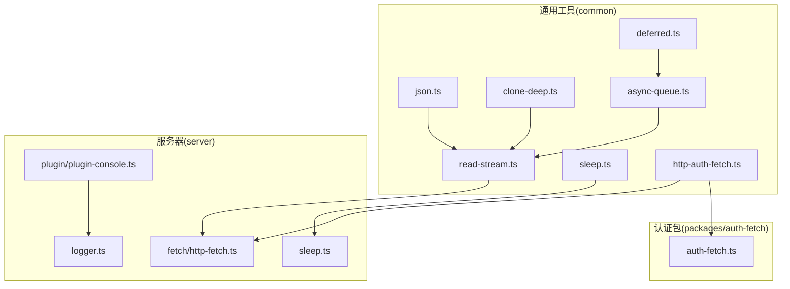
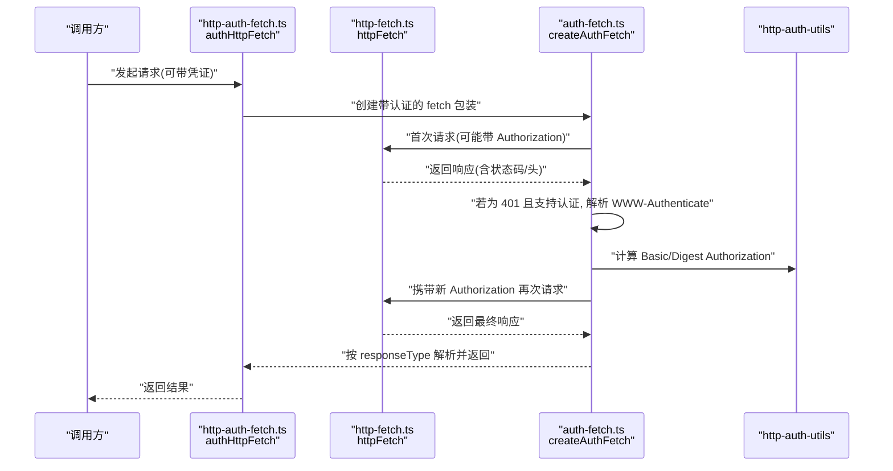
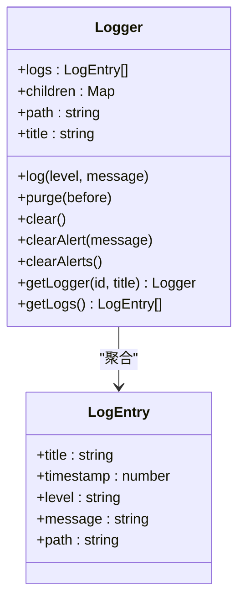
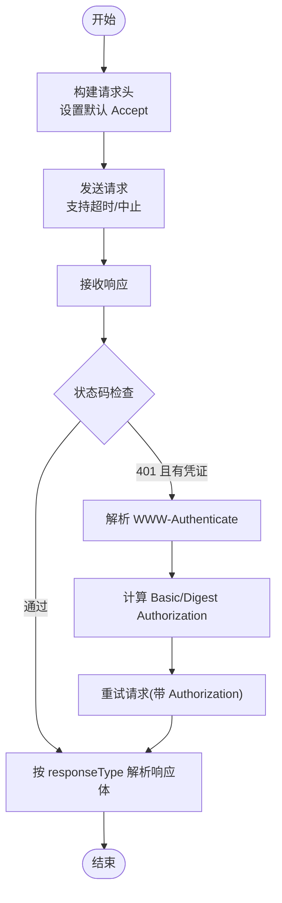
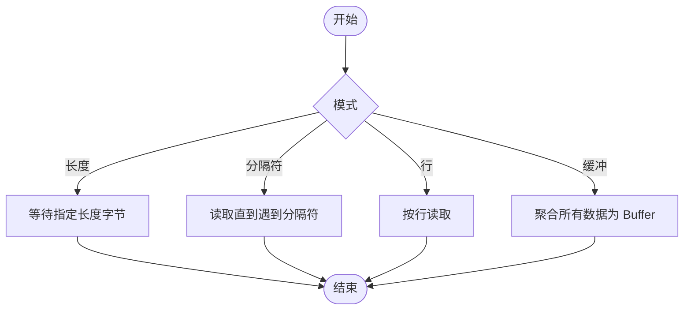
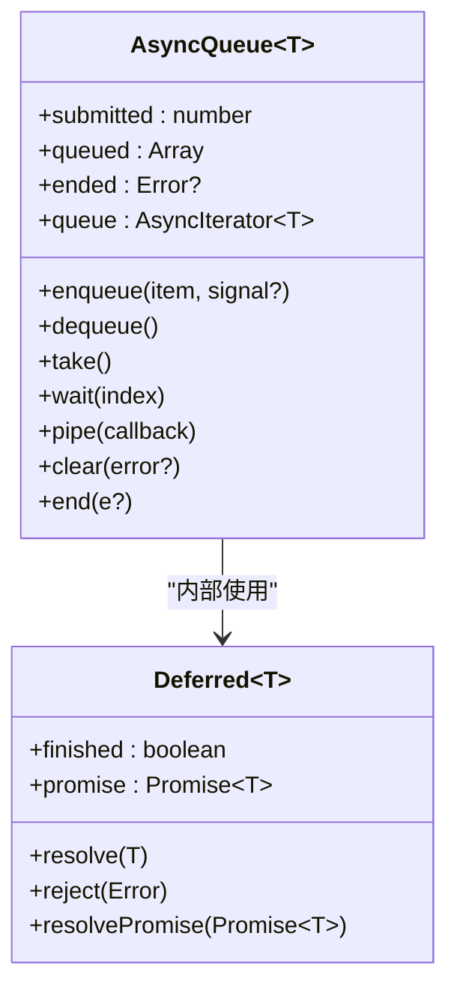
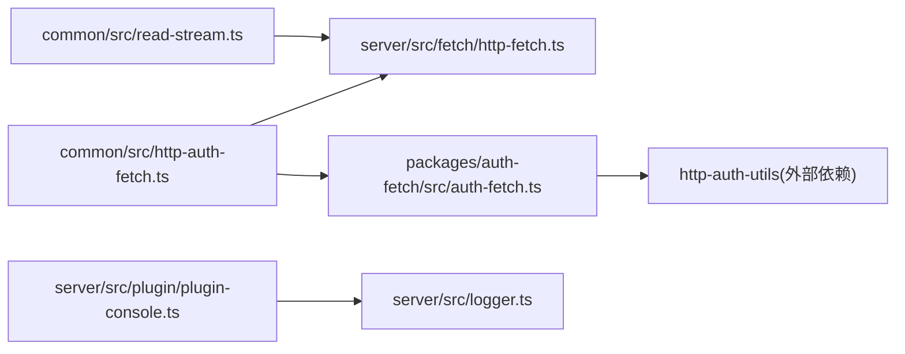

# 实用工具 API

<cite>
**本文引用的文件**
- [common/src/json.ts](file://common/src/json.ts)
- [common/src/clone-deep.ts](file://common/src/clone-deep.ts)
- [common/src/read-stream.ts](file://common/src/read-stream.ts)
- [common/src/async-queue.ts](file://common/src/async-queue.ts)
- [common/src/deferred.ts](file://common/src/deferred.ts)
- [common/src/sleep.ts](file://common/src/sleep.ts)
- [common/src/http-auth-fetch.ts](file://common/src/http-auth-fetch.ts)
- [server/src/fetch/http-fetch.ts](file://server/src/fetch/http-fetch.ts)
- [packages/auth-fetch/src/auth-fetch.ts](file://packages/auth-fetch/src/auth-fetch.ts)
- [server/src/logger.ts](file://server/src/logger.ts)
- [server/src/plugin/plugin-console.ts](file://server/src/plugin/plugin-console.ts)
- [common/src/devices.ts](file://common/src/devices.ts)
- [server/src/sleep.ts](file://server/src/sleep.ts)
</cite>

## 目录
1. [简介](#简介)
2. [项目结构](#项目结构)
3. [核心组件](#核心组件)
4. [架构总览](#架构总览)
5. [详细组件分析](#详细组件分析)
6. [依赖关系分析](#依赖关系分析)
7. [性能考量](#性能考量)
8. [故障排查指南](#故障排查指南)
9. [结论](#结论)
10. [附录](#附录)

## 简介
本文件为 Scrypted 实用工具 API 的参考文档，覆盖以下主题：
- 日志记录：日志级别、格式化输出、日志聚合与清理
- 网络请求：HTTP 客户端、认证（Basic/Digest）、响应解析、超时与中止
- 文件与流：读取缓冲区、按长度/行读取、字符串与流转换
- JSON 工具：安全解析、深拷贝
- 系统信息：设备枚举、系统状态访问
- 调试与开发：异步队列、延迟、延迟对象、流读取辅助
- 加密与安全：日志告警标识生成（哈希）

本指南以“可读性优先”为原则，尽量避免直接粘贴源码，而通过“路径+行号”的方式定位到具体实现。

## 项目结构
实用工具相关代码主要分布在以下位置：
- 通用工具（common）：JSON、深拷贝、流读取、异步队列、延迟、休眠、HTTP 认证封装
- 服务器层（server）：HTTP 原生请求、日志器、插件控制台桥接
- 认证包（packages/auth-fetch）：基于 http-auth-utils 的 Basic/Digest 自动协商与重试

图示来源
- [common/src/http-auth-fetch.ts:1-51](file://common/src/http-auth-fetch.ts#L1-L51)
- [server/src/fetch/http-fetch.ts:1-156](file://server/src/fetch/http-fetch.ts#L1-L156)
- [packages/auth-fetch/src/auth-fetch.ts:1-155](file://packages/auth-fetch/src/auth-fetch.ts#L1-L155)
- [server/src/logger.ts:1-93](file://server/src/logger.ts#L1-L93)
- [server/src/plugin/plugin-console.ts:44-74](file://server/src/plugin/plugin-console.ts#L44-L74)
- [common/src/read-stream.ts:1-153](file://common/src/read-stream.ts#L1-L153)
- [common/src/json.ts:1-9](file://common/src/json.ts#L1-L9)
- [common/src/clone-deep.ts:1-6](file://common/src/clone-deep.ts#L1-L6)
- [common/src/async-queue.ts:1-242](file://common/src/async-queue.ts#L1-L242)
- [common/src/deferred.ts:1-32](file://common/src/deferred.ts#L1-L32)
- [common/src/sleep.ts:1-2](file://common/src/sleep.ts#L1-L2)
- [server/src/sleep.ts:1-4](file://server/src/sleep.ts#L1-L4)

章节来源
- [common/src/http-auth-fetch.ts:1-51](file://common/src/http-auth-fetch.ts#L1-L51)
- [server/src/fetch/http-fetch.ts:1-156](file://server/src/fetch/http-fetch.ts#L1-L156)
- [packages/auth-fetch/src/auth-fetch.ts:1-155](file://packages/auth-fetch/src/auth-fetch.ts#L1-L155)
- [server/src/logger.ts:1-93](file://server/src/logger.ts#L1-L93)
- [server/src/plugin/plugin-console.ts:44-74](file://server/src/plugin/plugin-console.ts#L44-L74)
- [common/src/read-stream.ts:1-153](file://common/src/read-stream.ts#L1-L153)
- [common/src/json.ts:1-9](file://common/src/json.ts#L1-L9)
- [common/src/clone-deep.ts:1-6](file://common/src/clone-deep.ts#L1-L6)
- [common/src/async-queue.ts:1-242](file://common/src/async-queue.ts#L1-L242)
- [common/src/deferred.ts:1-32](file://common/src/deferred.ts#L1-L32)
- [common/src/sleep.ts:1-2](file://common/src/sleep.ts#L1-L2)
- [server/src/sleep.ts:1-4](file://server/src/sleep.ts#L1-L4)

## 核心组件
- 日志记录：提供结构化日志条目、树状子日志器、告警清理、日志轮询与排序
- HTTP 请求：原生 HTTP(S) 请求、响应体解析（Buffer/Text/JSON/Readable）、状态码检查、超时与中止
- 认证请求：自动 Basic/Digest 认证协商、401 后重试、类型安全响应体
- 流读取：按长度、按分隔符、按行、缓冲区聚合
- JSON 工具：安全解析、深拷贝
- 异步队列：生产者/消费者模型、AbortSignal 支持、清空与结束
- 延迟对象：可处置的 Promise 包装
- 休眠：毫秒级延时
- 设备枚举：从系统状态获取所有设备实例

章节来源
- [server/src/logger.ts:1-93](file://server/src/logger.ts#L1-L93)
- [server/src/fetch/http-fetch.ts:60-156](file://server/src/fetch/http-fetch.ts#L60-L156)
- [packages/auth-fetch/src/auth-fetch.ts:72-155](file://packages/auth-fetch/src/auth-fetch.ts#L72-L155)
- [common/src/read-stream.ts:1-153](file://common/src/read-stream.ts#L1-L153)
- [common/src/json.ts:1-9](file://common/src/json.ts#L1-L9)
- [common/src/clone-deep.ts:1-6](file://common/src/clone-deep.ts#L1-L6)
- [common/src/async-queue.ts:1-242](file://common/src/async-queue.ts#L1-L242)
- [common/src/deferred.ts:1-32](file://common/src/deferred.ts#L1-L32)
- [common/src/sleep.ts:1-2](file://common/src/sleep.ts#L1-L2)
- [common/src/devices.ts:1-6](file://common/src/devices.ts#L1-L6)

## 架构总览
下图展示“认证 HTTP 请求”如何在通用层与服务器层协作，并与认证包配合完成 Basic/Digest 自动协商。

图示来源
- [common/src/http-auth-fetch.ts:9-9](file://common/src/http-auth-fetch.ts#L9-L9)
- [server/src/fetch/http-fetch.ts:60-156](file://server/src/fetch/http-fetch.ts#L60-L156)
- [packages/auth-fetch/src/auth-fetch.ts:72-155](file://packages/auth-fetch/src/auth-fetch.ts#L72-L155)

## 详细组件分析

### 日志记录 API
- 结构
  - 日志条目包含标题、时间戳、级别、消息、路径
  - 支持子日志器（按路径层级），事件冒泡
  - 提供清理告警、清理全部告警、按时间清理、聚合排序
- 关键能力
  - 按级别写入日志并触发事件
  - 获取全量日志并按时间排序
  - 生成告警唯一 ID（基于路径与消息的哈希）
- 使用建议
  - 为每个模块/设备创建子日志器，便于聚合与过滤
  - 对于需要持久化告警的场景，结合唯一 ID 进行去重

图示来源
- [server/src/logger.ts:11-92](file://server/src/logger.ts#L11-L92)

章节来源
- [server/src/logger.ts:1-93](file://server/src/logger.ts#L1-L93)

### HTTP 客户端与认证
- HTTP 客户端
  - 支持 Buffer/Text/JSON/Readable 四种响应体类型
  - 默认 Accept 设置、自定义头部、超时与中止信号
  - 状态码校验钩子，可自定义检查逻辑
- 认证客户端
  - 自动识别 Basic/Digest 并计算 Authorization
  - 首次 401 后解析 WWW-Authenticate 并重试
  - 类型安全：根据 responseType 推导返回体类型
- 错误与重试
  - 401 触发认证流程；其他异常由状态码检查钩子处理
  - 中止信号会中断请求并抛出错误

图示来源
- [server/src/fetch/http-fetch.ts:60-156](file://server/src/fetch/http-fetch.ts#L60-L156)
- [packages/auth-fetch/src/auth-fetch.ts:72-155](file://packages/auth-fetch/src/auth-fetch.ts#L72-L155)
- [common/src/http-auth-fetch.ts:9-9](file://common/src/http-auth-fetch.ts#L9-L9)

章节来源
- [server/src/fetch/http-fetch.ts:1-156](file://server/src/fetch/http-fetch.ts#L1-L156)
- [packages/auth-fetch/src/auth-fetch.ts:1-155](file://packages/auth-fetch/src/auth-fetch.ts#L1-L155)
- [common/src/http-auth-fetch.ts:1-51](file://common/src/http-auth-fetch.ts#L1-L51)

### 流读取工具
- 按长度读取：等待指定长度字节后返回
- 按分隔符读取：读取直到遇到指定字符编码
- 按行读取：换行符作为分隔符
- 缓冲区聚合：将流中的所有数据拼接为 Buffer
- 特殊错误：流提前结束时抛出专用错误类型

图示来源
- [common/src/read-stream.ts:66-153](file://common/src/read-stream.ts#L66-L153)

章节来源
- [common/src/read-stream.ts:1-153](file://common/src/read-stream.ts#L1-L153)

### JSON 工具
- 安全解析：对字符串进行 JSON 解析，异常时返回空值
- 深拷贝：通过序列化/反序列化实现浅层深拷贝（适用于可序列化对象）

章节来源
- [common/src/json.ts:1-9](file://common/src/json.ts#L1-L9)
- [common/src/clone-deep.ts:1-6](file://common/src/clone-deep.ts#L1-L6)

### 异步队列与延迟
- 异步队列
  - 支持生产者/消费者、AbortSignal 中止、清空与结束
  - 提供迭代器形式消费
- 延迟对象
  - 可处置的 Promise 封装，未解决即释放时抛错
- 休眠
  - 基于 setTimeout 的毫秒级延时

图示来源
- [common/src/deferred.ts:1-32](file://common/src/deferred.ts#L1-L32)
- [common/src/async-queue.ts:1-242](file://common/src/async-queue.ts#L1-L242)

章节来源
- [common/src/async-queue.ts:1-242](file://common/src/async-queue.ts#L1-L242)
- [common/src/deferred.ts:1-32](file://common/src/deferred.ts#L1-L32)
- [common/src/sleep.ts:1-2](file://common/src/sleep.ts#L1-L2)
- [server/src/sleep.ts:1-4](file://server/src/sleep.ts#L1-L4)

### 系统信息查询
- 设备枚举：从系统状态中遍历设备 ID 并获取设备实例
- 插件控制台桥接：将日志方法重定向到默认控制台或设备控制台，并维护日志缓冲

章节来源
- [common/src/devices.ts:1-6](file://common/src/devices.ts#L1-L6)
- [server/src/plugin/plugin-console.ts:44-74](file://server/src/plugin/plugin-console.ts#L44-L74)

## 依赖关系分析
- http-auth-fetch 依赖 server 层 http-fetch 与 packages/auth-fetch 的 createAuthFetch
- packages/auth-fetch 依赖 http-auth-utils 完成 Basic/Digest 计算与解析
- 日志器依赖运行时环境与数据存储以实现告警清理
- 流读取工具独立于网络层，但常与 http-fetch 的可读流响应配合使用

图示来源
- [common/src/http-auth-fetch.ts:1-9](file://common/src/http-auth-fetch.ts#L1-L9)
- [server/src/fetch/http-fetch.ts:1-7](file://server/src/fetch/http-fetch.ts#L1-L7)
- [packages/auth-fetch/src/auth-fetch.ts:1-2](file://packages/auth-fetch/src/auth-fetch.ts#L1-L2)
- [server/src/logger.ts:1-9](file://server/src/logger.ts#L1-L9)
- [server/src/plugin/plugin-console.ts:44-74](file://server/src/plugin/plugin-console.ts#L44-L74)
- [common/src/read-stream.ts:1-4](file://common/src/read-stream.ts#L1-L4)

章节来源
- [common/src/http-auth-fetch.ts:1-51](file://common/src/http-auth-fetch.ts#L1-L51)
- [server/src/fetch/http-fetch.ts:1-156](file://server/src/fetch/http-fetch.ts#L1-L156)
- [packages/auth-fetch/src/auth-fetch.ts:1-155](file://packages/auth-fetch/src/auth-fetch.ts#L1-L155)
- [server/src/logger.ts:1-93](file://server/src/logger.ts#L1-L93)
- [server/src/plugin/plugin-console.ts:44-74](file://server/src/plugin/plugin-console.ts#L44-L74)
- [common/src/read-stream.ts:1-153](file://common/src/read-stream.ts#L1-L153)

## 性能考量
- 流式读取：优先使用可读流解析，避免一次性加载大体积响应
- 响应体类型选择：JSON/Text/Buffer/Readable 的选择影响内存占用与 CPU 开销
- 异步队列：合理设置生产/消费节奏，避免积压导致内存膨胀
- 日志轮转：定期清理过期日志，避免无限增长
- 超时与中止：为长耗时请求设置超时与中止信号，防止资源泄漏

## 故障排查指南
- HTTP 401 未认证
  - 确认是否提供了凭证，以及服务端是否返回了 WWW-Authenticate
  - 检查 Basic/Digest 是否被正确计算与设置
- 状态码检查失败
  - 自定义 checkStatusCode 钩子需明确允许哪些状态码
- 流提前结束
  - 使用专用错误类型区分“正常结束”与“异常结束”
- 日志不显示
  - 检查控制台桥接逻辑与日志级别
  - 确认日志缓冲是否被清理或轮转

章节来源
- [packages/auth-fetch/src/auth-fetch.ts:102-151](file://packages/auth-fetch/src/auth-fetch.ts#L102-L151)
- [server/src/fetch/http-fetch.ts:126-150](file://server/src/fetch/http-fetch.ts#L126-L150)
- [common/src/read-stream.ts:60-64](file://common/src/read-stream.ts#L60-L64)
- [server/src/plugin/plugin-console.ts:44-74](file://server/src/plugin/plugin-console.ts#L44-L74)

## 结论
Scrypted 的实用工具 API 在日志、网络、流处理、并发与系统信息等方面提供了完备的基础能力。通过类型安全的认证请求、灵活的流读取与异步队列，开发者可以快速构建稳定可靠的插件与应用。建议在生产环境中结合超时、中止与日志轮转策略，确保资源可控与可观测性。

## 附录
- 最佳实践
  - 使用子日志器组织日志，便于聚合与检索
  - 对外网请求统一走认证 HTTP 客户端，减少重复逻辑
  - 大数据读取优先采用流式 API，避免内存峰值
  - 使用异步队列解耦生产与消费，必要时启用 AbortSignal
  - 对不可信输入使用安全 JSON 解析，对可序列化对象使用深拷贝