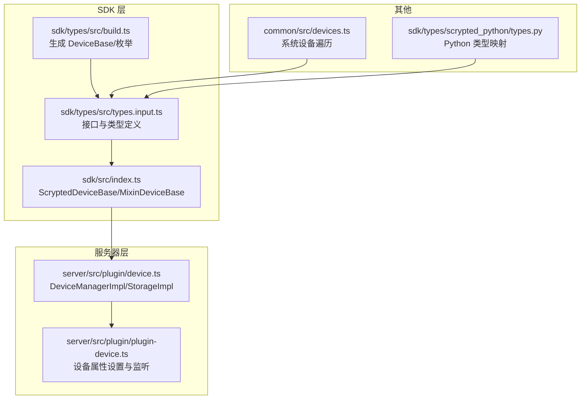
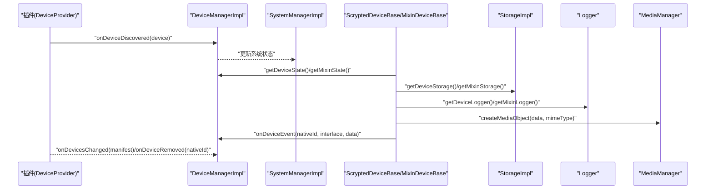
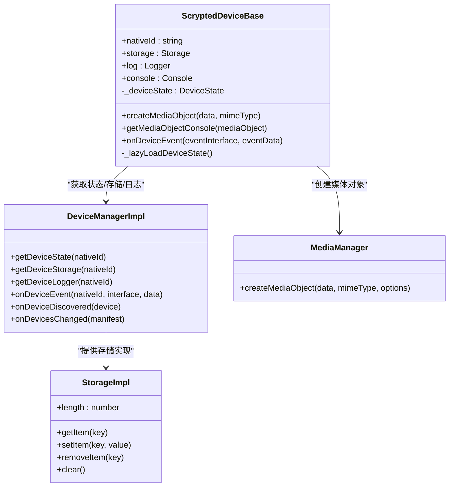
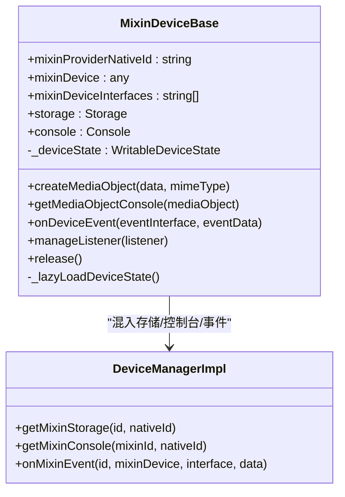
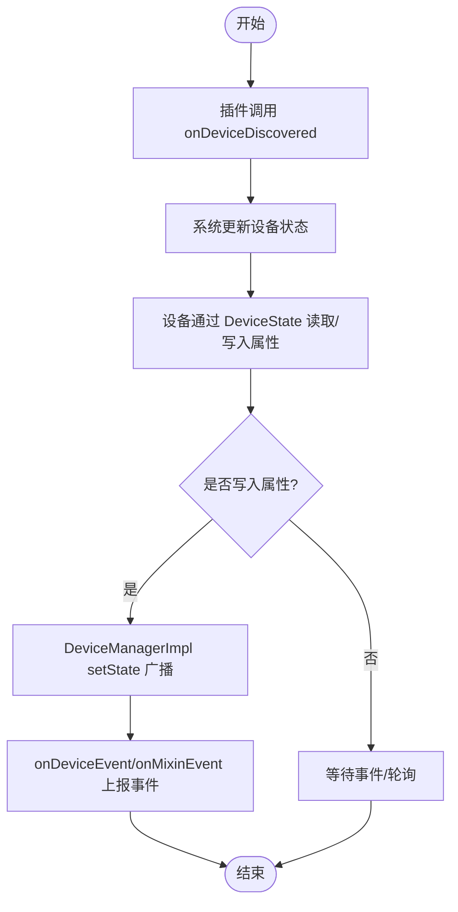
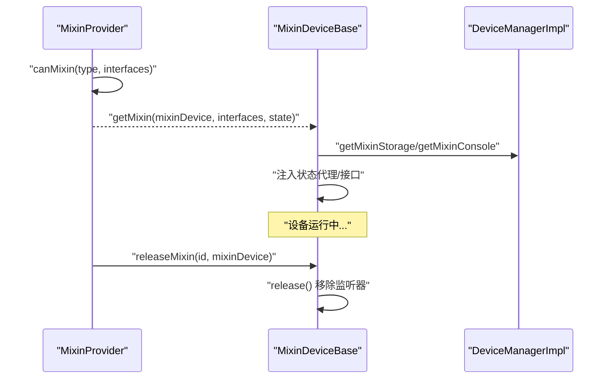
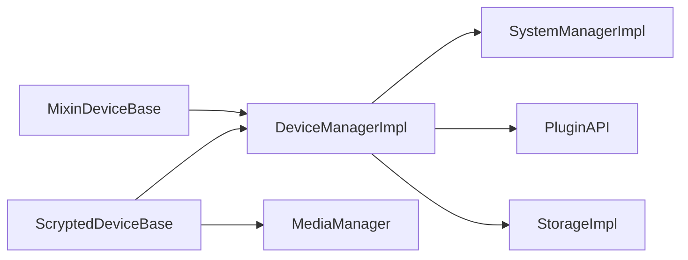

# 核心接口

<cite>
**本文引用的文件**   
- [sdk/src/index.ts](file://sdk/src/index.ts)
- [server/src/plugin/device.ts](file://server/src/plugin/device.ts)
- [server/src/plugin/plugin-device.ts](file://server/src/plugin/plugin-device.ts)
- [common/src/devices.ts](file://common/src/devices.ts)
- [sdk/types/src/types.input.ts](file://sdk/types/src/types.input.ts)
- [sdk/types/src/build.ts](file://sdk/types/src/build.ts)
- [sdk/types/scrypted_python/scrypted_sdk/types.py](file://sdk/types/scrypted_python/scrypted_sdk/types.py)
</cite>

## 目录
1. [简介](#简介)
2. [项目结构](#项目结构)
3. [核心组件](#核心组件)
4. [架构总览](#架构总览)
5. [详细组件分析](#详细组件分析)
6. [依赖关系分析](#依赖关系分析)
7. [性能考量](#性能考量)
8. [故障排查指南](#故障排查指南)
9. [结论](#结论)
10. [附录](#附录)

## 简介
本文件面向 Scrypted 插件开发者，系统化梳理 ScryptedDeviceBase 与 MixinDeviceBase 两大核心基类的完整接口定义与使用方式，覆盖设备状态管理、存储访问、日志记录、媒体对象创建、设备生命周期（发现、注册、状态更新、事件处理）以及混入模式（Mixin）的创建、配置与释放流程。文档同时提供面向不同技术背景读者的渐进式说明，并给出可直接定位到源码位置的“章节来源”与“图表来源”，便于进一步查阅。

## 项目结构
围绕核心接口，本次分析聚焦以下模块：
- SDK 层：提供 ScryptedDeviceBase、MixinDeviceBase 及其状态代理、SDK 初始化与类型描述
- 服务器层：实现 DeviceManager、Storage、Logger 等运行时服务
- 类型层：定义 Scrypted 接口、设备状态、事件与系统管理器接口
- 示例工具：辅助遍历系统设备

**图表来源**
- [sdk/src/index.ts:1-297](file://sdk/src/index.ts#L1-L297)
- [server/src/plugin/device.ts:1-262](file://server/src/plugin/device.ts#L1-L262)
- [sdk/types/src/types.input.ts:1-800](file://sdk/types/src/types.input.ts#L1-L800)
- [sdk/types/src/build.ts:1-370](file://sdk/types/src/build.ts#L1-L370)
- [common/src/devices.ts:1-6](file://common/src/devices.ts#L1-L6)
- [sdk/types/scrypted_python/scrypted_sdk/types.py:1906-1959](file://sdk/types/scrypted_python/scrypted_sdk/types.py#L1906-L1959)

**章节来源**
- [sdk/src/index.ts:1-297](file://sdk/src/index.ts#L1-L297)
- [server/src/plugin/device.ts:1-262](file://server/src/plugin/device.ts#L1-L262)
- [sdk/types/src/types.input.ts:1-800](file://sdk/types/src/types.input.ts#L1-L800)
- [sdk/types/src/build.ts:1-370](file://sdk/types/src/build.ts#L1-L370)
- [common/src/devices.ts:1-6](file://common/src/devices.ts#L1-L6)
- [sdk/types/scrypted_python/scrypted_sdk/types.py:1906-1959](file://sdk/types/scrypted_python/scrypted_sdk/types.py#L1906-L1959)

## 核心组件
本节概述 ScryptedDeviceBase 与 MixinDeviceBase 的职责边界、关键属性与方法，以及它们如何与系统管理器、设备管理器、媒体管理器协作。

- ScryptedDeviceBase
  - 职责：封装设备级能力，提供 storage、log、console、media 对象创建、事件上报、状态代理访问等
  - 关键点：通过懒加载获取 DeviceState；通过 DeviceManager 获取设备存储、日志、控制台；通过 MediaManager 创建媒体对象
- MixinDeviceBase
  - 职责：作为混入设备承载额外接口与行为，支持混入存储、混入控制台、事件上报与资源释放
  - 关键点：构造时注入 mixinDevice、mixinDeviceInterfaces、mixinDeviceState；提供 manageListener/release 生命周期管理

**章节来源**
- [sdk/src/index.ts:10-71](file://sdk/src/index.ts#L10-L71)
- [sdk/src/index.ts:87-167](file://sdk/src/index.ts#L87-L167)

## 架构总览
下图展示设备生命周期与核心交互：插件通过 DeviceManager 报告设备发现、移除、事件与状态变更；设备通过 SDK 访问存储、日志、媒体；混入设备在宿主设备上叠加接口与状态。

**图表来源**
- [server/src/plugin/device.ts:86-170](file://server/src/plugin/device.ts#L86-L170)
- [sdk/src/index.ts:10-71](file://sdk/src/index.ts#L10-L71)
- [sdk/src/index.ts:87-167](file://sdk/src/index.ts#L87-L167)

## 详细组件分析

### ScryptedDeviceBase 分析
- 设备状态代理
  - 通过懒加载获取 DeviceState；getter/setter 基于 ScryptedInterfaceProperty 动态注入，实现对 name、type、room、interfaces 等属性的读写
  - 当状态不可用时会输出警告提示，需先通过 DeviceManager.onDeviceDiscovered 或 onDevicesChanged 上报设备
- 存储与日志
  - storage：按 nativeId 提供持久化存储，内部以 Proxy 包装，写入即同步至系统存储
  - log/console：按 nativeId 获取设备专属日志与控制台
- 媒体对象
  - createMediaObject：创建带 sourceId 的媒体对象，便于溯源与权限控制
  - getMediaObjectConsole：根据媒体对象的 sourceId 返回对应混入或设备的控制台
- 事件上报
  - onDeviceEvent：向上抛出设备事件，由系统分发给订阅者

**图表来源**
- [sdk/src/index.ts:10-71](file://sdk/src/index.ts#L10-L71)
- [server/src/plugin/device.ts:86-170](file://server/src/plugin/device.ts#L86-L170)
- [server/src/plugin/device.ts:182-262](file://server/src/plugin/device.ts#L182-L262)

**章节来源**
- [sdk/src/index.ts:10-71](file://sdk/src/index.ts#L10-L71)
- [server/src/plugin/device.ts:86-170](file://server/src/plugin/device.ts#L86-L170)
- [server/src/plugin/device.ts:182-262](file://server/src/plugin/device.ts#L182-L262)

### MixinDeviceBase 分析
- 构造与注入
  - 接收 MixinDeviceOptions：包含 mixinDevice、mixinProviderNativeId、mixinDeviceInterfaces、mixinStorageSuffix、mixinDeviceState
  - 从系统管理器解析自身 nativeId；若状态来自远程节点则转换为本地可写状态代理
- 存储与日志
  - storage：基于 mixinId 与 suffix 维护混入专用存储空间
  - console：优先使用混入控制台，否则回退到混入提供者的设备控制台
- 事件与生命周期
  - onDeviceEvent：上报混入事件
  - manageListener/release：统一管理事件监听器并在释放时移除

**图表来源**
- [sdk/src/index.ts:87-167](file://sdk/src/index.ts#L87-L167)
- [server/src/plugin/device.ts:124-154](file://server/src/plugin/device.ts#L124-L154)

**章节来源**
- [sdk/src/index.ts:87-167](file://sdk/src/index.ts#L87-L167)
- [server/src/plugin/device.ts:124-154](file://server/src/plugin/device.ts#L124-L154)

### 设备生命周期与状态管理
- 设备发现与注册
  - 插件通过 DeviceManager.onDeviceDiscovered 报告新设备；系统更新状态并建立设备标识映射
- 状态更新
  - 通过 DeviceState 代理写入；DeviceManagerImpl 将变更转发给系统管理器并调用 setState 回调
- 事件处理
  - 设备可通过 onDeviceEvent/onMixinEvent 上报事件；系统分发给订阅者
- 属性设置与监听
  - 插件侧可通过 SystemManager.getDeviceById 获取设备实例；设备实例提供 listen 与属性 setter

**图表来源**
- [server/src/plugin/device.ts:158-169](file://server/src/plugin/device.ts#L158-L169)
- [server/src/plugin/device.ts:56-79](file://server/src/plugin/device.ts#L56-L79)
- [server/src/plugin/plugin-device.ts:337-367](file://server/src/plugin/plugin-device.ts#L337-L367)

**章节来源**
- [server/src/plugin/device.ts:158-169](file://server/src/plugin/device.ts#L158-L169)
- [server/src/plugin/device.ts:56-79](file://server/src/plugin/device.ts#L56-L79)
- [server/src/plugin/plugin-device.ts:337-367](file://server/src/plugin/plugin-device.ts#L337-L367)

### 混入模式（Mixin）实现
- 混入创建
  - MixinProvider.canMixin 决定是否可为某设备创建混入；getMixin 返回混入设备实例与新增接口列表
- 混入配置
  - MixinDeviceBase 在构造时接收 mixinDevice、mixinDeviceInterfaces、mixinDeviceState，动态注入状态代理
- 混入释放
  - MixinProvider.releaseMixin 用于释放混入设备资源；MixinDeviceBase 提供 release 移除监听器

**图表来源**
- [sdk/types/src/types.input.ts:2212-2227](file://sdk/types/src/types.input.ts#L2212-L2227)
- [sdk/src/index.ts:87-167](file://sdk/src/index.ts#L87-L167)
- [server/src/plugin/device.ts:124-154](file://server/src/plugin/device.ts#L124-L154)

**章节来源**
- [sdk/types/src/types.input.ts:2212-2227](file://sdk/types/src/types.input.ts#L2212-L2227)
- [sdk/src/index.ts:87-167](file://sdk/src/index.ts#L87-L167)
- [server/src/plugin/device.ts:124-154](file://server/src/plugin/device.ts#L124-L154)

### 设备状态属性的 Getter/Setter
- 动态注入机制
  - SDK 在初始化时为 ScryptedDeviceBase 与 MixinDeviceBase 注入所有 ScryptedInterfaceProperty 的 getter/setter
  - 未注入 nativeId，避免外部直接修改该只读字段
- 使用建议
  - 仅通过 setter 更新受支持的状态属性；如状态代理尚未可用，应先完成设备发现或设备变更上报

**章节来源**
- [sdk/src/index.ts:169-204](file://sdk/src/index.ts#L169-L204)
- [sdk/types/src/build.ts:47-61](file://sdk/types/src/build.ts#L47-L61)

### 日志记录与媒体对象
- 日志
  - 通过 DeviceManagerImpl.getDeviceLogger 返回设备专属 Logger 实现，支持多级别日志输出
- 媒体对象
  - 通过 MediaManager.createMediaObject 创建媒体对象并标注 sourceId，便于后续权限与溯源

**章节来源**
- [server/src/plugin/device.ts:7-54](file://server/src/plugin/device.ts#L7-L54)
- [sdk/src/index.ts:42-52](file://sdk/src/index.ts#L42-L52)

### 代码示例路径（不展示具体代码）
- 继承 ScryptedDeviceBase 实现自定义设备功能
  - 参考：[sdk/src/index.ts:10-71](file://sdk/src/index.ts#L10-L71)
- 继承 MixinDeviceBase 实现混入设备
  - 参考：[sdk/src/index.ts:87-167](file://sdk/src/index.ts#L87-L167)
- 通过 SystemManager 遍历系统设备
  - 参考：[common/src/devices.ts:3-6](file://common/src/devices.ts#L3-L6)
- Python 类型映射参考
  - 参考：[sdk/types/scrypted_python/scrypted_sdk/types.py:1906-1959](file://sdk/types/scrypted_python/scrypted_sdk/types.py#L1906-L1959)

## 依赖关系分析
- 组件耦合
  - ScryptedDeviceBase/MixinDeviceBase 依赖 DeviceManager、MediaManager、SystemManager
  - DeviceManagerImpl 依赖 PluginAPI 与 SystemManagerImpl，负责状态代理、存储与事件转发
- 外部依赖
  - 插件通过 RPC 与服务器通信；存储与日志通过插件 API 同步

**图表来源**
- [sdk/src/index.ts:10-71](file://sdk/src/index.ts#L10-L71)
- [sdk/src/index.ts:87-167](file://sdk/src/index.ts#L87-L167)
- [server/src/plugin/device.ts:86-170](file://server/src/plugin/device.ts#L86-L170)

**章节来源**
- [sdk/src/index.ts:10-71](file://sdk/src/index.ts#L10-L71)
- [sdk/src/index.ts:87-167](file://sdk/src/index.ts#L87-L167)
- [server/src/plugin/device.ts:86-170](file://server/src/plugin/device.ts#L86-L170)

## 性能考量
- 状态代理与懒加载
  - 通过懒加载减少不必要的状态查询；频繁写入时建议合并更新
- 存储写入
  - StorageImpl 采用 Proxy 包装，写入即同步；批量写入时注意避免抖动
- 事件广播
  - onDeviceEvent/onMixinEvent 由 DeviceManagerImpl 转发，订阅端应合理使用去噪选项

[本节为通用指导，无需“章节来源”]

## 故障排查指南
- 设备状态不可用
  - 现象：setter 输出“设备状态不可用”的警告
  - 处理：确保先调用 DeviceManager.onDeviceDiscovered 或 onDevicesChanged 完成设备上报
- 混入存储异常
  - 现象：混入存储无法持久化或被清理
  - 处理：确认 mixinId 与 suffix 正确；检查系统状态中是否存在对应设备
- 事件未到达
  - 现象：订阅不到事件
  - 处理：确认事件接口名称正确；检查 onDeviceEvent/onMixinEvent 是否被调用

**章节来源**
- [sdk/src/index.ts:178-189](file://sdk/src/index.ts#L178-L189)
- [server/src/plugin/device.ts:137-151](file://server/src/plugin/device.ts#L137-L151)

## 结论
ScryptedDeviceBase 与 MixinDeviceBase 为插件开发提供了统一且强大的设备抽象。前者聚焦设备级能力，后者扩展混入能力。二者配合 DeviceManager、SystemManager、MediaManager 与 Storage/Logger 实现了从设备发现、状态管理、事件处理到媒体与存储的全链路能力。遵循本文的接口使用规范与最佳实践，可显著提升插件的稳定性与可维护性。

[本节为总结，无需“章节来源”]

## 附录

### 接口版本兼容性与向后兼容
- 类型版本
  - TYPES_VERSION 由构建脚本注入，用于标识类型版本，便于客户端与服务器匹配
- 接口描述
  - 通过 ScryptedInterfaceDescriptors 动态生成接口属性与方法清单，保障接口一致性
- Python 映射
  - 生成 Python 类型映射，保持跨语言一致的接口语义

**章节来源**
- [sdk/types/src/build.ts:69-82](file://sdk/types/src/build.ts#L69-L82)
- [sdk/types/src/build.ts:273-286](file://sdk/types/src/build.ts#L273-L286)
- [sdk/types/scrypted_python/scrypted_sdk/types.py:1906-1959](file://sdk/types/scrypted_python/scrypted_sdk/types.py#L1906-L1959)