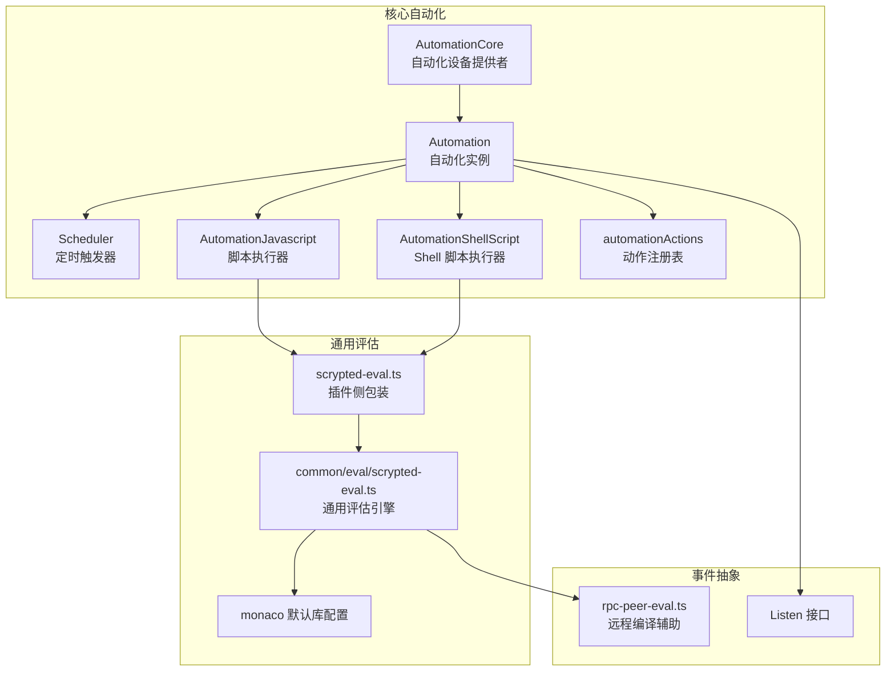
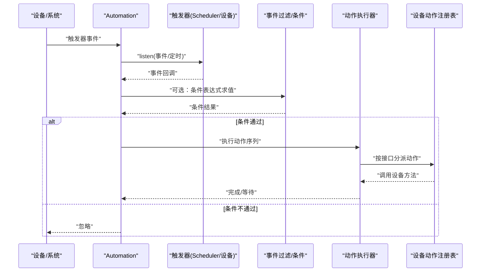
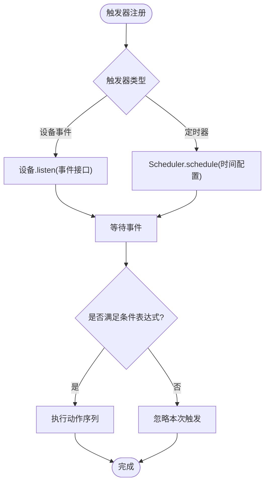
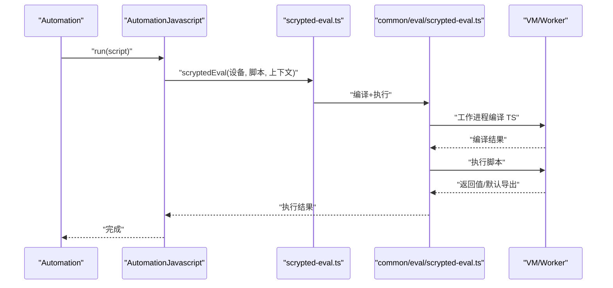
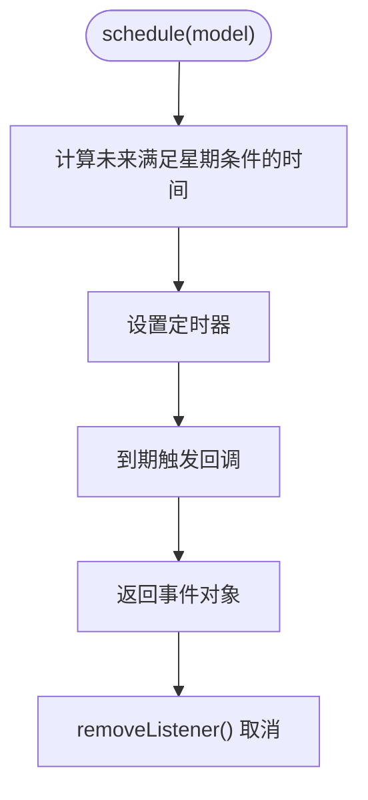
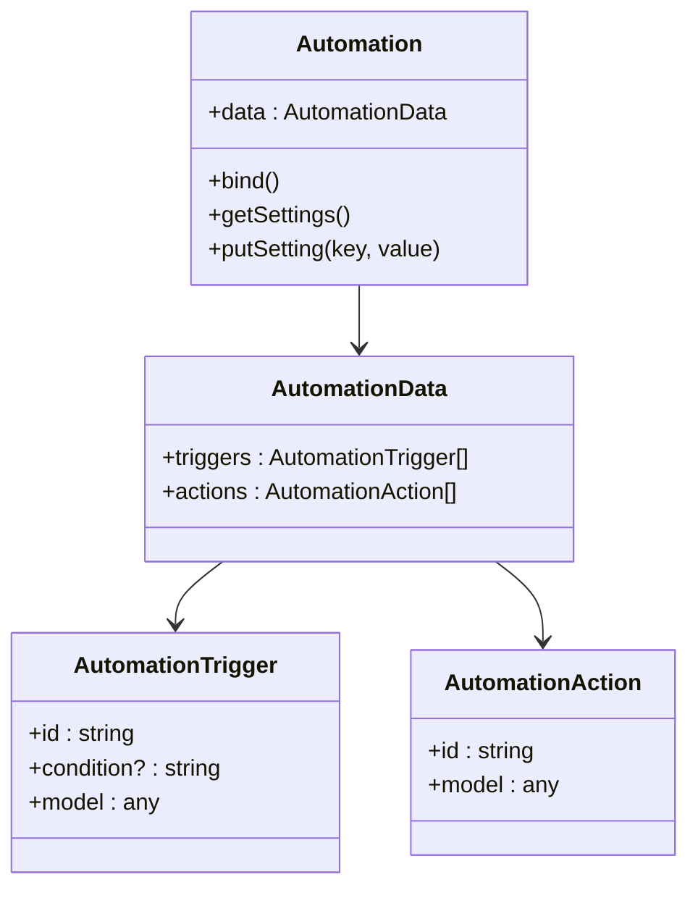
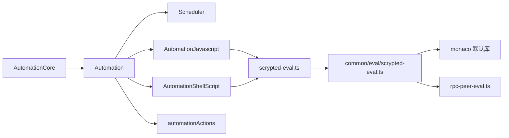

# 自动化 API

<cite>
**本文引用的文件**
- [plugins/core/src/automation.ts](file://plugins/core/src/automation.ts)
- [plugins/core/src/automations-core.ts](file://plugins/core/src/automations-core.ts)
- [plugins/core/src/automation-actions.ts](file://plugins/core/src/automation-actions.ts)
- [plugins/core/src/builtins/javascript.ts](file://plugins/core/src/builtins/javascript.ts)
- [plugins/core/src/builtins/scheduler.ts](file://plugins/core/src/builtins/scheduler.ts)
- [plugins/core/src/builtins/shellscript.ts](file://plugins/core/src/builtins/shellscript.ts)
- [plugins/core/src/scrypted-eval.ts](file://plugins/core/src/scrypted-eval.ts)
- [common/src/eval/scrypted-eval.ts](file://common/src/eval/scrypted-eval.ts)
- [plugins/core/src/monaco.ts](file://plugins/core/src/monaco.ts)
- [plugins/mqtt/src/monaco.ts](file://plugins/mqtt/src/monaco.ts)
- [server/src/rpc-peer-eval.ts](file://server/src/rpc-peer-eval.ts)
- [plugins/core/src/builtins/listen.ts](file://plugins/core/src/builtins/listen.ts)
- [plugins/core/src/api/util.ts](file://plugins/core/src/api/util.ts)
</cite>

## 目录
1. [简介](#简介)
2. [项目结构](#项目结构)
3. [核心组件](#核心组件)
4. [架构总览](#架构总览)
5. [详细组件分析](#详细组件分析)
6. [依赖关系分析](#依赖关系分析)
7. [性能考量](#性能考量)
8. [故障排查指南](#故障排查指南)
9. [结论](#结论)
10. [附录](#附录)

## 简介
本文件为 Scrypted 自动化 API 的权威参考，聚焦自动化引擎的核心接口与运行机制，涵盖以下主题：
- 触发器、动作、条件的定义与管理
- 事件处理接口：事件订阅、事件过滤、事件路由
- 脚本执行接口：脚本编译、执行、调试
- 定时任务管理：任务创建、调度、取消
- 自动化规则：条件、动作执行、优先级与并发控制
- 性能、错误处理与调试技巧
- 扩展点与自定义功能实现

## 项目结构
自动化能力主要由核心插件提供，并通过 SDK 接口与通用评估引擎协同工作：
- 核心自动化引擎与设备：automation.ts、automations-core.ts
- 内置触发器与动作：builtins/scheduler.ts、automation-actions.ts
- 脚本执行：builtins/javascript.ts、builtins/shellscript.ts、scrypted-eval.ts、common/eval/scrypted-eval.ts
- 事件抽象：builtins/listen.ts
- Monaco 类型与评估默认配置：plugins/*/monaco.ts
- 远程执行与函数编译辅助：server/src/rpc-peer-eval.ts



**图表来源**
- [plugins/core/src/automations-core.ts:9-82](file://plugins/core/src/automations-core.ts#L9-L82)
- [plugins/core/src/automation.ts:30-597](file://plugins/core/src/automation.ts#L30-L597)
- [plugins/core/src/builtins/scheduler.ts:16-101](file://plugins/core/src/builtins/scheduler.ts#L16-L101)
- [plugins/core/src/builtins/javascript.ts:5-25](file://plugins/core/src/builtins/javascript.ts#L5-L25)
- [plugins/core/src/builtins/shellscript.ts:5-30](file://plugins/core/src/builtins/shellscript.ts#L5-L30)
- [plugins/core/src/automation-actions.ts:10-104](file://plugins/core/src/automation-actions.ts#L10-L104)
- [plugins/core/src/scrypted-eval.ts:4-7](file://plugins/core/src/scrypted-eval.ts#L4-L7)
- [common/src/eval/scrypted-eval.ts:41-114](file://common/src/eval/scrypted-eval.ts#L41-L114)
- [plugins/core/src/builtins/listen.ts:3-6](file://plugins/core/src/builtins/listen.ts#L3-L6)
- [server/src/rpc-peer-eval.ts:22-31](file://server/src/rpc-peer-eval.ts#L22-L31)

**章节来源**
- [plugins/core/src/automation.ts:1-597](file://plugins/core/src/automation.ts#L1-L597)
- [plugins/core/src/automations-core.ts:1-83](file://plugins/core/src/automations-core.ts#L1-L83)

## 核心组件
- Automation（自动化实例）
  - 负责绑定触发器、执行动作、并发与去抖控制、事件过滤与路由。
  - 提供开关、设置项、事件评估与动作执行流程。
- AutomationCore（自动化核心设备）
  - 设备提供者与创建器，负责发现、创建与管理自动化设备。
- Scheduler（定时触发器）
  - 基于小时/分钟/星期配置生成未来触发时间，返回类似设备的监听接口。
- AutomationJavascript / AutomationShellScript（脚本执行器）
  - 将事件上下文注入到脚本执行环境，分别支持 TypeScript/JavaScript 与 Shell。
- automationActions（动作注册表）
  - 将设备接口映射为可配置的动作，如 OnOff、StartStop、Lock、Brightness、Program、Notifier 等。

**章节来源**
- [plugins/core/src/automation.ts:30-597](file://plugins/core/src/automation.ts#L30-L597)
- [plugins/core/src/automations-core.ts:9-82](file://plugins/core/src/automations-core.ts#L9-L82)
- [plugins/core/src/builtins/scheduler.ts:16-101](file://plugins/core/src/builtins/scheduler.ts#L16-L101)
- [plugins/core/src/builtins/javascript.ts:5-25](file://plugins/core/src/builtins/javascript.ts#L5-L25)
- [plugins/core/src/builtins/shellscript.ts:5-30](file://plugins/core/src/builtins/shellscript.ts#L5-L30)
- [plugins/core/src/automation-actions.ts:10-104](file://plugins/core/src/automation-actions.ts#L10-L104)

## 架构总览
自动化系统以“触发器 → 条件评估 → 动作执行”的流水线为核心，结合事件去抖、并发控制与定时调度，形成可扩展的自动化引擎。



**图表来源**
- [plugins/core/src/automation.ts:544-590](file://plugins/core/src/automation.ts#L544-L590)
- [plugins/core/src/builtins/scheduler.ts:34-99](file://plugins/core/src/builtins/scheduler.ts#L34-L99)
- [plugins/core/src/automation-actions.ts:12-20](file://plugins/core/src/automation-actions.ts#L12-L20)

## 详细组件分析

### 触发器与事件处理
- 触发器类型
  - 设备事件：从指定设备监听特定事件接口。
  - 定时器：基于小时/分钟/星期配置，计算下一次触发时间。
- 事件订阅与过滤
  - 使用 Listen 接口统一抽象事件订阅。
  - 支持去抖（连续相同事件抑制）、重置策略（对所有事件或同源事件重置）。
- 事件路由
  - 每个触发器独立注册，回调中先进行条件评估，再进入动作执行队列。



**图表来源**
- [plugins/core/src/automation.ts:544-590](file://plugins/core/src/automation.ts#L544-L590)
- [plugins/core/src/builtins/listen.ts:3-6](file://plugins/core/src/builtins/listen.ts#L3-L6)
- [plugins/core/src/builtins/scheduler.ts:16-101](file://plugins/core/src/builtins/scheduler.ts#L16-L101)

**章节来源**
- [plugins/core/src/automation.ts:136-590](file://plugins/core/src/automation.ts#L136-L590)
- [plugins/core/src/builtins/listen.ts:3-6](file://plugins/core/src/builtins/listen.ts#L3-L6)
- [plugins/core/src/builtins/scheduler.ts:16-101](file://plugins/core/src/builtins/scheduler.ts#L16-L101)

### 动作与条件
- 动作类型
  - 脚本：TypeScript/JavaScript 脚本执行。
  - Shell 脚本：在子进程中执行。
  - 等待：延时等待若干秒。
  - 更新插件：触发系统插件更新。
  - 设备动作：根据设备接口分派具体动作（OnOff、StartStop、Lock、Brightness、Program、Notifier 等）。
- 条件
  - 可为任意 JavaScript 表达式，使用事件上下文变量进行判断。
- 并发与中断
  - 支持“运行至完成”模式，避免重复触发；支持按事件源键取消未完成的执行。

```mermaid
classDiagram
class Automation {
+on : boolean
+bind()
+eval(script, variables)
+turnOn()
+turnOff()
+abort(id?)
}
class AutomationJavascript {
+run(script)
}
class AutomationShellScript {
+run(script)
}
class Scheduler {
+schedule(model) Listen
}
class automationActions {
+set(iface, {settings, invoke})
}
Automation --> Scheduler : "注册定时触发"
Automation --> AutomationJavascript : "执行脚本"
Automation --> AutomationShellScript : "执行Shell"
Automation --> automationActions : "分派设备动作"
```

**图表来源**
- [plugins/core/src/automation.ts:30-597](file://plugins/core/src/automation.ts#L30-L597)
- [plugins/core/src/builtins/javascript.ts:5-25](file://plugins/core/src/builtins/javascript.ts#L5-L25)
- [plugins/core/src/builtins/shellscript.ts:5-30](file://plugins/core/src/builtins/shellscript.ts#L5-L30)
- [plugins/core/src/builtins/scheduler.ts:16-101](file://plugins/core/src/builtins/scheduler.ts#L16-L101)
- [plugins/core/src/automation-actions.ts:10-104](file://plugins/core/src/automation-actions.ts#L10-L104)

**章节来源**
- [plugins/core/src/automation.ts:480-542](file://plugins/core/src/automation.ts#L480-L542)
- [plugins/core/src/automation-actions.ts:12-104](file://plugins/core/src/automation-actions.ts#L12-L104)

### 脚本执行接口
- TypeScript/JavaScript 执行
  - 通过 AutomationJavascript.run 注入事件上下文，使用通用评估引擎执行。
  - 评估引擎在专用工作进程内编译 TypeScript，随后在隔离上下文中执行。
- Shell 脚本执行
  - 通过 AutomationShellScript.run 在子进程中执行，标准输出/错误会回传到自动化日志。
- Monaco 类型与编辑体验
  - 插件侧提供 monaco 默认库配置，增强脚本开发体验。



**图表来源**
- [plugins/core/src/builtins/javascript.ts:17-23](file://plugins/core/src/builtins/javascript.ts#L17-L23)
- [plugins/core/src/scrypted-eval.ts:4-7](file://plugins/core/src/scrypted-eval.ts#L4-L7)
- [common/src/eval/scrypted-eval.ts:41-114](file://common/src/eval/scrypted-eval.ts#L41-L114)

**章节来源**
- [plugins/core/src/builtins/javascript.ts:5-25](file://plugins/core/src/builtins/javascript.ts#L5-L25)
- [plugins/core/src/builtins/shellscript.ts:5-30](file://plugins/core/src/builtins/shellscript.ts#L5-L30)
- [plugins/core/src/scrypted-eval.ts:4-7](file://plugins/core/src/scrypted-eval.ts#L4-L7)
- [common/src/eval/scrypted-eval.ts:12-26](file://common/src/eval/scrypted-eval.ts#L12-L26)
- [plugins/core/src/monaco.ts:1-8](file://plugins/core/src/monaco.ts#L1-L8)
- [plugins/mqtt/src/monaco.ts:1-9](file://plugins/mqtt/src/monaco.ts#L1-L9)

### 定时任务管理
- 配置项
  - 小时、分钟、星期多选（周日到周六）。
- 调度逻辑
  - 计算未来最近的满足星期条件的时间点，启动定时器。
  - 回调中返回一个“事件”对象，包含事件 ID、接口名与时间戳。
- 取消
  - 返回的注册对象提供移除监听方法，用于取消定时器。



**图表来源**
- [plugins/core/src/builtins/scheduler.ts:16-101](file://plugins/core/src/builtins/scheduler.ts#L16-L101)

**章节来源**
- [plugins/core/src/builtins/scheduler.ts:16-101](file://plugins/core/src/builtins/scheduler.ts#L16-L101)

### 自动化规则定义与管理
- 规则数据结构
  - triggers：触发器数组，每个包含 id、condition、model。
  - actions：动作数组，每个包含 id、model。
- 设置界面
  - 通过 StorageSettings 自动生成“添加触发器/动作”按钮与各字段。
  - 支持动态选择触发器/动作类型、设备接口筛选、条件表达式输入。
- 生命周期
  - 构造时初始化 data；bind() 时重新解析并绑定所有触发器。
  - 支持开关、去抖、运行至完成、静态事件等全局设置。



**图表来源**
- [plugins/core/src/automation.ts:15-28](file://plugins/core/src/automation.ts#L15-L28)
- [plugins/core/src/automation.ts:30-91](file://plugins/core/src/automation.ts#L30-L91)

**章节来源**
- [plugins/core/src/automation.ts:15-91](file://plugins/core/src/automation.ts#L15-L91)

### 扩展点与自定义
- 自定义动作
  - 通过 automationActions.register 注册新的设备接口动作，提供 UI 设置与执行逻辑。
- 自定义触发器
  - 实现 Listen 接口，返回可监听的对象，即可接入自动化触发器体系。
- 脚本类型库
  - 通过 monaco 默认库配置扩展脚本可用类型与提示。

**章节来源**
- [plugins/core/src/automation-actions.ts:12-20](file://plugins/core/src/automation-actions.ts#L12-L20)
- [plugins/core/src/builtins/listen.ts:3-6](file://plugins/core/src/builtins/listen.ts#L3-L6)
- [plugins/core/src/monaco.ts:1-8](file://plugins/core/src/monaco.ts#L1-L8)
- [plugins/mqtt/src/monaco.ts:1-9](file://plugins/mqtt/src/monaco.ts#L1-L9)

## 依赖关系分析
- 组件耦合
  - Automation 依赖 Scheduler、AutomationJavascript、AutomationShellScript、automationActions。
  - 脚本执行依赖通用评估引擎与 Monaco 类型库。
  - AutomationCore 负责自动化设备的发现与创建。
- 外部依赖
  - SDK 提供事件、设备、系统管理等基础能力。
  - 服务器侧提供远程编译辅助（rpc-peer-eval）。



**图表来源**
- [plugins/core/src/automation.ts:30-597](file://plugins/core/src/automation.ts#L30-L597)
- [plugins/core/src/automations-core.ts:9-82](file://plugins/core/src/automations-core.ts#L9-L82)
- [plugins/core/src/builtins/javascript.ts:5-25](file://plugins/core/src/builtins/javascript.ts#L5-L25)
- [plugins/core/src/builtins/shellscript.ts:5-30](file://plugins/core/src/builtins/shellscript.ts#L5-L30)
- [plugins/core/src/automation-actions.ts:10-104](file://plugins/core/src/automation-actions.ts#L10-L104)
- [plugins/core/src/scrypted-eval.ts:4-7](file://plugins/core/src/scrypted-eval.ts#L4-L7)
- [common/src/eval/scrypted-eval.ts:41-114](file://common/src/eval/scrypted-eval.ts#L41-L114)
- [server/src/rpc-peer-eval.ts:22-31](file://server/src/rpc-peer-eval.ts#L22-L31)

**章节来源**
- [plugins/core/src/automation.ts:1-10](file://plugins/core/src/automation.ts#L1-L10)
- [common/src/eval/scrypted-eval.ts:10-11](file://common/src/eval/scrypted-eval.ts#L10-L11)

## 性能考量
- 事件去抖与重置策略
  - 合理使用去抖与静态事件设置，避免高频事件导致的重复执行与资源浪费。
- 并发控制
  - “运行至完成”可防止重复触发，但需配合等待动作避免阻塞。
- 脚本执行
  - TypeScript 编译在工作进程中进行，避免主线程阻塞；注意脚本复杂度与日志输出。
- 定时器
  - Scheduler 仅计算最近一次触发时间，避免长期占用。

[本节为通用指导，无需列出章节来源]

## 故障排查指南
- 脚本编译失败
  - 查看通用评估引擎的编译错误日志与堆栈。
- 脚本执行异常
  - 检查脚本返回值与默认导出；查看运行时错误日志。
- 设备动作失败
  - 确认设备接口与动作参数；检查动作注册表是否正确映射。
- 触发器未生效
  - 检查触发器类型与条件表达式；确认事件源与事件接口匹配。
- 定时器不触发
  - 检查星期配置与当前时间；确认 Scheduler 返回的事件对象被正确消费。

**章节来源**
- [common/src/eval/scrypted-eval.ts:56-59](file://common/src/eval/scrypted-eval.ts#L56-L59)
- [common/src/eval/scrypted-eval.ts:95-99](file://common/src/eval/scrypted-eval.ts#L95-L99)
- [plugins/core/src/automation.ts:524-534](file://plugins/core/src/automation.ts#L524-L534)
- [plugins/core/src/builtins/scheduler.ts:50-54](file://plugins/core/src/builtins/scheduler.ts#L50-L54)

## 结论
Scrypted 的自动化 API 以清晰的触发器-条件-动作流水线为核心，结合事件去抖、并发控制与定时调度，提供了强大且易扩展的自动化能力。通过脚本执行与动作注册表，用户可以快速构建复杂的事件驱动控制逻辑，并借助 Monaco 类型库与远程编译辅助提升开发效率与安全性。

[本节为总结性内容，无需列出章节来源]

## 附录

### API 速查与最佳实践
- 触发器
  - 设备事件：选择设备与事件接口，必要时设置条件表达式。
  - 定时器：配置小时/分钟/星期，确保至少一天后有有效触发。
- 动作
  - 脚本：利用事件上下文变量；避免长时间阻塞。
  - 等待：用于串行化动作之间的时序。
  - 设备动作：通过接口映射自动填充参数。
- 条件
  - 使用事件上下文变量进行布尔表达式判断；表达式应尽量简洁。
- 并发与中断
  - 对于需要串行化的场景启用“运行至完成”；对高频事件启用去抖。
- 调试
  - 利用自动化日志与脚本日志定位问题；逐步缩小条件范围。

[本节为概念性内容，无需列出章节来源]