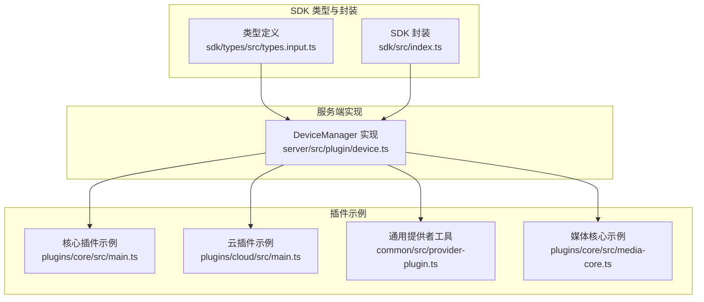
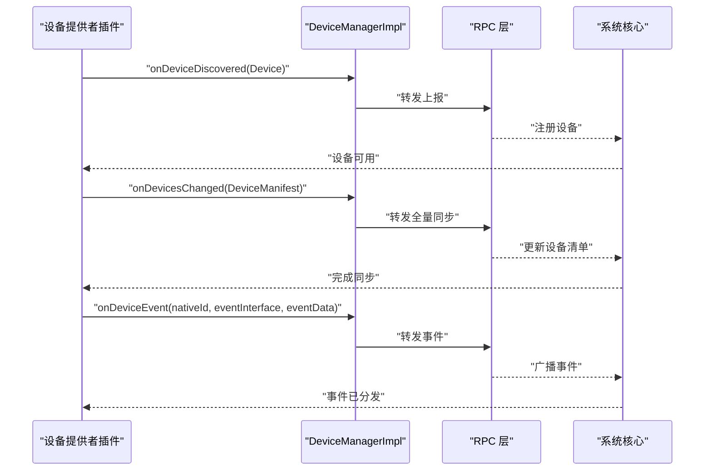
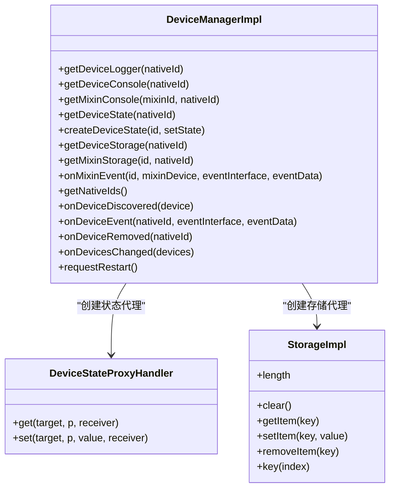
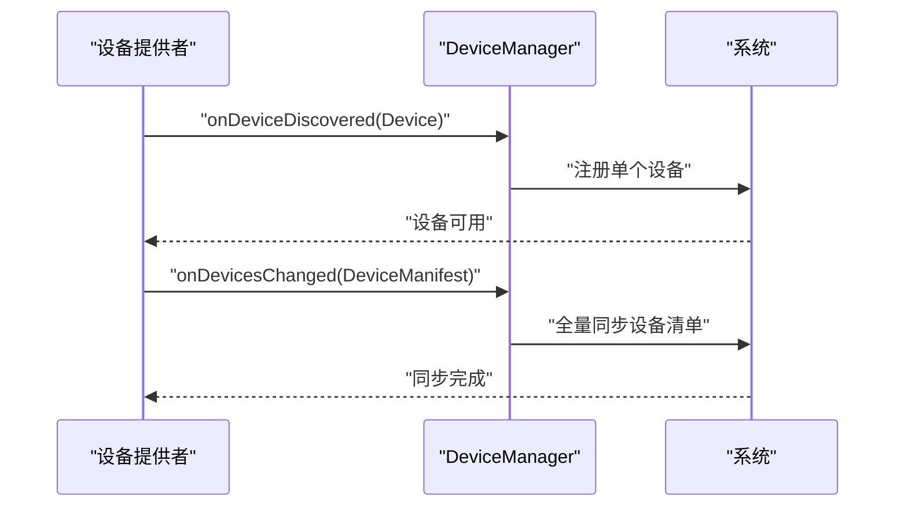
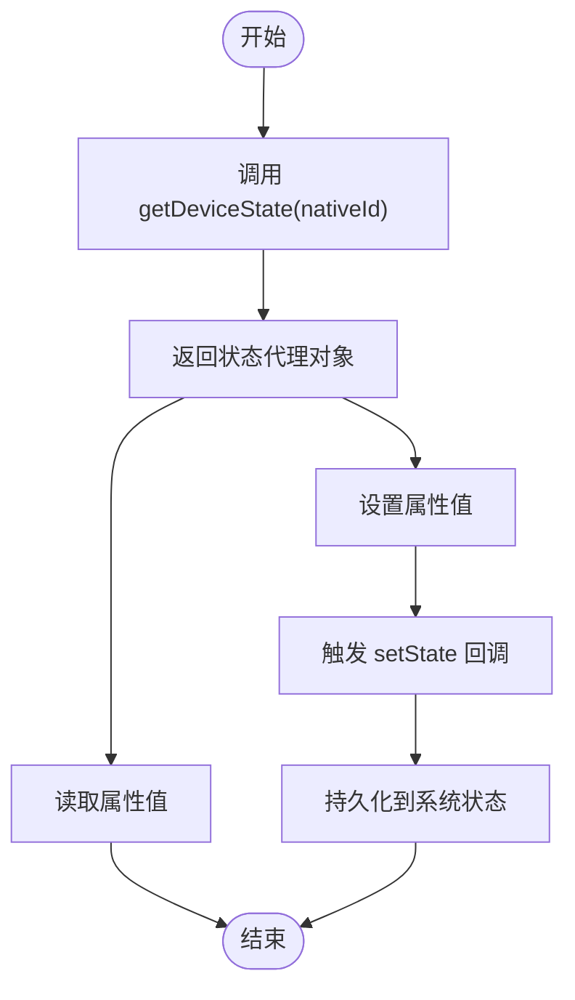
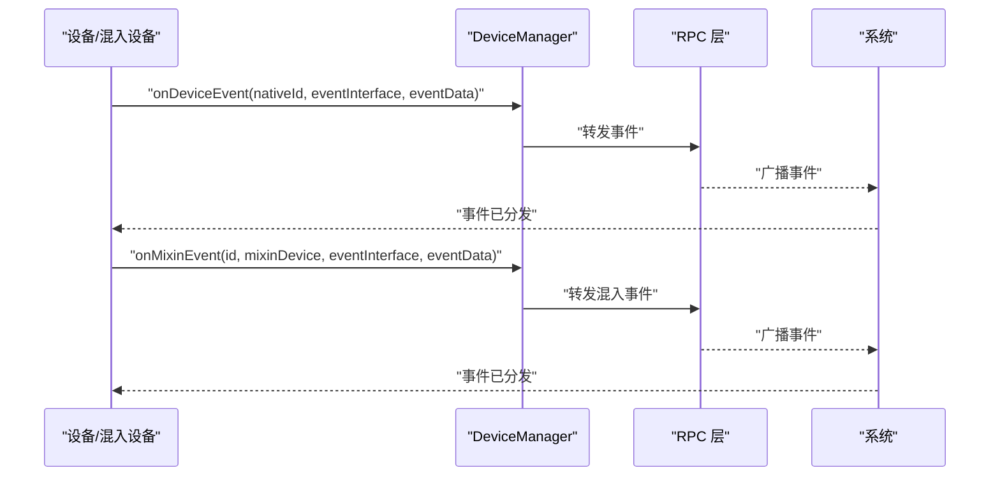
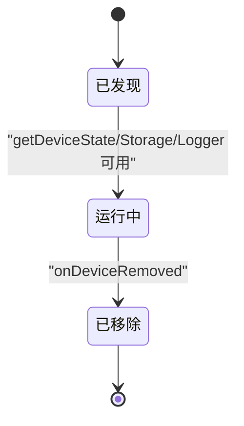
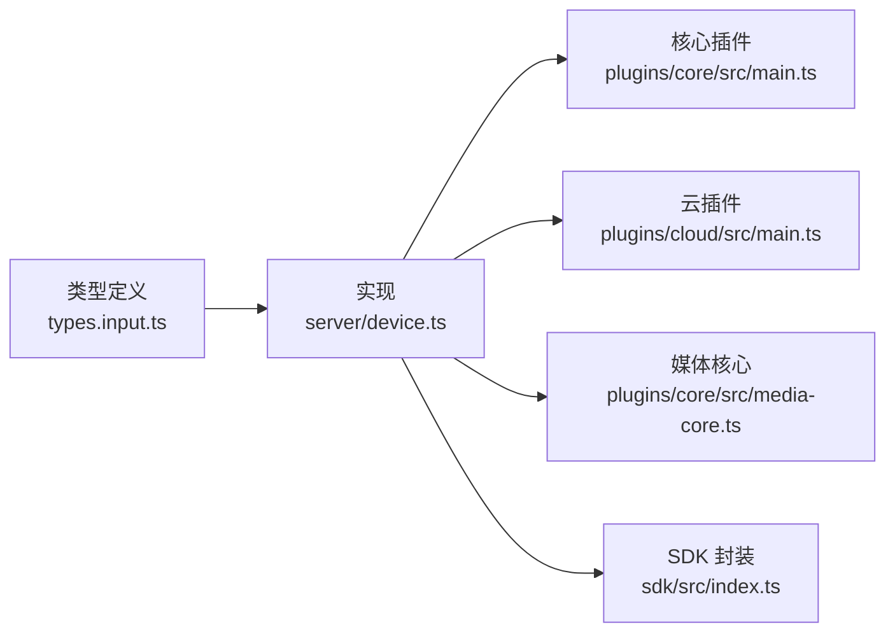

# DeviceManager 设备管理器 API

<cite>
**本文引用的文件**
- [sdk/types/src/types.input.ts](file://sdk/types/src/types.input.ts)
- [server/src/plugin/device.ts](file://server/src/plugin/device.ts)
- [plugins/core/src/main.ts](file://plugins/core/src/main.ts)
- [plugins/cloud/src/main.ts](file://plugins/cloud/src/main.ts)
- [sdk/src/index.ts](file://sdk/src/index.ts)
- [common/src/provider-plugin.ts](file://common/src/provider-plugin.ts)
- [plugins/core/src/media-core.ts](file://plugins/core/src/media-core.ts)
</cite>

## 目录
1. [简介](#简介)
2. [项目结构](#项目结构)
3. [核心组件](#核心组件)
4. [架构总览](#架构总览)
5. [详细组件分析](#详细组件分析)
6. [依赖关系分析](#依赖关系分析)
7. [性能考量](#性能考量)
8. [故障排查指南](#故障排查指南)
9. [结论](#结论)
10. [附录](#附录)

## 简介
本文件为 Scrypted 的 DeviceManager 设备管理器 API 参考文档，覆盖设备发现、设备注册、设备状态查询、设备事件处理与设备生命周期管理等核心能力。重点说明以下关键方法的行为、参数、返回值与使用场景：
- onDeviceDiscovered：用于上报新发现的单个设备（如通过网络广播）。
- onDevicesChanged：用于同步控制器/网关下的全部设备清单（如 Hue、SmartThings）。
- onDeviceRemoved：用于报告已发现设备的移除。
- onDeviceEvent：用于向系统广播设备事件。
- getDevice、getDeviceState、getDeviceStorage、getDeviceLogger：用于获取设备实例、状态、存储与日志。

同时，文档解释设备生命周期管理、状态监听与事件广播机制，并提供可直接定位到源码的示例路径，帮助开发者快速上手并正确使用。

## 项目结构
DeviceManager 的类型定义位于 SDK 类型声明中，其实现在服务端插件侧，典型调用方为各类设备提供者（DeviceProvider）插件。下图展示了与 DeviceManager 直接相关的模块关系：

**图表来源**
- [sdk/types/src/types.input.ts:1193-1270](file://sdk/types/src/types.input.ts#L1193-L1270)
- [server/src/plugin/device.ts:86-170](file://server/src/plugin/device.ts#L86-L170)
- [plugins/core/src/main.ts:112-204](file://plugins/core/src/main.ts#L112-L204)
- [plugins/cloud/src/main.ts:269-271](file://plugins/cloud/src/main.ts#L269-L271)
- [common/src/provider-plugin.ts:21](file://common/src/provider-plugin.ts#L21)
- [plugins/core/src/media-core.ts:22](file://plugins/core/src/media-core.ts#L22)

**章节来源**
- [sdk/types/src/types.input.ts:1193-1270](file://sdk/types/src/types.input.ts#L1193-L1270)
- [server/src/plugin/device.ts:86-170](file://server/src/plugin/device.ts#L86-L170)
- [plugins/core/src/main.ts:112-204](file://plugins/core/src/main.ts#L112-L204)
- [plugins/cloud/src/main.ts:269-271](file://plugins/cloud/src/main.ts#L269-L271)
- [common/src/provider-plugin.ts:21](file://common/src/provider-plugin.ts#L21)
- [plugins/core/src/media-core.ts:22](file://plugins/core/src/media-core.ts#L22)

## 核心组件
- DeviceManager 接口：定义设备管理所需的核心方法，包括设备发现、设备变更、设备事件、设备状态与存储访问、日志与控制台获取、以及重启请求等。
- DeviceManagerImpl 实现：将接口方法委托给 RPC 层，负责状态代理、存储代理、日志包装与事件转发。
- Device 类型：描述单个设备的基本信息（名称、类型、接口列表、提供商 nativeId 等），作为 onDeviceDiscovered 的输入。
- DeviceManifest 类型：描述一次全量同步的设备清单，作为 onDevicesChanged 的输入。
- SDK 封装：在 SDK 中对 DeviceManager 的常用方法进行便捷封装，便于插件开发时直接使用。

**章节来源**
- [sdk/types/src/types.input.ts:1193-1270](file://sdk/types/src/types.input.ts#L1193-L1270)
- [sdk/types/src/types.input.ts:2024-2043](file://sdk/types/src/types.input.ts#L2024-L2043)
- [sdk/types/src/types.input.ts:1294-1300](file://sdk/types/src/types.input.ts#L1294-L1300)
- [server/src/plugin/device.ts:86-170](file://server/src/plugin/device.ts#L86-L170)
- [sdk/src/index.ts:15-71](file://sdk/src/index.ts#L15-L71)

## 架构总览
DeviceManager 在系统中的职责是作为设备提供者与系统之间的桥梁，负责：
- 接收设备提供者上报的设备发现与变更；
- 维护设备状态与存储；
- 提供日志与控制台访问；
- 转发设备事件至系统层。

**图表来源**
- [sdk/types/src/types.input.ts:1247-1264](file://sdk/types/src/types.input.ts#L1247-L1264)
- [server/src/plugin/device.ts:158-169](file://server/src/plugin/device.ts#L158-L169)

## 详细组件分析

### DeviceManager 接口与方法详解
- getDeviceLogger(nativeId?)：获取设备日志器，用于记录设备运行日志。
- getDeviceConsole(nativeId?)：获取设备控制台对象，用于输出调试信息。
- getMixinConsole(mixinId, nativeId?)：获取混入设备的控制台。
- getDeviceState(nativeId?)：获取设备状态代理对象，设置属性会触发状态更新。
- createDeviceState(id, setState)：创建可拦截的状态对象，用于内部混入或派生场景。
- getMixinStorage(id, nativeId?)：获取混入设备的存储空间。
- onMixinEvent(id, mixinDevice, eventInterface, eventData)：向系统广播混入设备事件。
- getDeviceStorage(nativeId?)：获取设备存储对象。
- getNativeIds()：获取当前插件已上报的所有 nativeId 列表。
- onDeviceDiscovered(device)：上报单个新发现的设备。
- onDeviceEvent(nativeId, eventInterface, eventData)：上报设备事件。
- onDeviceRemoved(nativeId)：上报设备移除。
- onDevicesChanged(devices)：上报全量设备清单以同步。
- requestRestart()：请求重启插件（异步生效）。

以上方法的签名与注释均来自类型定义文件。

**章节来源**
- [sdk/types/src/types.input.ts:1193-1270](file://sdk/types/src/types.input.ts#L1193-L1270)

### DeviceManagerImpl 实现要点
- 状态代理：通过 Proxy 拦截 get/set，将写入转换为 setState 回调，再由 RPC 层持久化。
- 存储代理：StorageImpl 对象提供类似浏览器 Storage 的接口，自动持久化到系统存储。
- 日志包装：DeviceLogger 延迟获取后端日志器，统一日志级别与输出。
- 事件转发：onDeviceEvent/onMixinEvent/onDeviceRemoved 等方法直接委托给 RPC 层。

**图表来源**
- [server/src/plugin/device.ts:86-170](file://server/src/plugin/device.ts#L86-L170)
- [server/src/plugin/device.ts:56-79](file://server/src/plugin/device.ts#L56-L79)
- [server/src/plugin/device.ts:182-261](file://server/src/plugin/device.ts#L182-L261)

**章节来源**
- [server/src/plugin/device.ts:86-170](file://server/src/plugin/device.ts#L86-L170)
- [server/src/plugin/device.ts:56-79](file://server/src/plugin/device.ts#L56-L79)
- [server/src/plugin/device.ts:182-261](file://server/src/plugin/device.ts#L182-L261)

### 设备发现与注册流程
- 单设备发现：设备提供者在发现新设备后调用 onDeviceDiscovered，传入 Device 对象。
- 全量同步：设备提供者在初始化或轮询后调用 onDevicesChanged，传入 DeviceManifest，一次性同步所有设备。
- 移除设备：当设备不再可用时，调用 onDeviceRemoved 通知系统移除。

**图表来源**
- [sdk/types/src/types.input.ts:1247-1264](file://sdk/types/src/types.input.ts#L1247-L1264)
- [plugins/core/src/main.ts:112-204](file://plugins/core/src/main.ts#L112-L204)
- [plugins/cloud/src/main.ts:269-271](file://plugins/cloud/src/main.ts#L269-L271)

**章节来源**
- [sdk/types/src/types.input.ts:1247-1264](file://sdk/types/src/types.input.ts#L1247-L1264)
- [plugins/core/src/main.ts:112-204](file://plugins/core/src/main.ts#L112-L204)
- [plugins/cloud/src/main.ts:269-271](file://plugins/cloud/src/main.ts#L269-L271)

### 设备状态查询与监听
- 获取状态：通过 getDeviceState(nativeId?) 获取设备状态代理对象，读取属性即从系统状态中获取。
- 设置状态：通过代理对象设置属性，会触发 setState 回调，最终持久化到系统状态。
- SDK 封装：SDK 在 ScryptedDeviceBase/MixinDeviceBase 中为常见属性提供 getter/setter，自动懒加载设备状态。

**图表来源**
- [sdk/types/src/types.input.ts:1215-1222](file://sdk/types/src/types.input.ts#L1215-L1222)
- [server/src/plugin/device.ts:105-109](file://server/src/plugin/device.ts#L105-L109)
- [sdk/src/index.ts:54-63](file://sdk/src/index.ts#L54-L63)

**章节来源**
- [sdk/types/src/types.input.ts:1215-1222](file://sdk/types/src/types.input.ts#L1215-L1222)
- [server/src/plugin/device.ts:105-109](file://server/src/plugin/device.ts#L105-L109)
- [sdk/src/index.ts:54-63](file://sdk/src/index.ts#L54-L63)

### 设备事件处理与广播
- 设备事件：设备提供者通过 onDeviceEvent(nativeId, eventInterface, eventData) 上报事件。
- 混入事件：混入设备通过 onMixinEvent(id, mixinDevice, eventInterface, eventData) 上报事件。
- 系统接收：RPC 层将事件转发至系统，由系统进行广播与路由。

**图表来源**
- [sdk/types/src/types.input.ts:1252-1254](file://sdk/types/src/types.input.ts#L1252-L1254)
- [sdk/types/src/types.input.ts:1232-1234](file://sdk/types/src/types.input.ts#L1232-L1234)
- [server/src/plugin/device.ts:164-165](file://server/src/plugin/device.ts#L164-L165)
- [server/src/plugin/device.ts:152-154](file://server/src/plugin/device.ts#L152-L154)

**章节来源**
- [sdk/types/src/types.input.ts:1252-1254](file://sdk/types/src/types.input.ts#L1252-L1254)
- [sdk/types/src/types.input.ts:1232-1234](file://sdk/types/src/types.input.ts#L1232-L1234)
- [server/src/plugin/device.ts:164-165](file://server/src/plugin/device.ts#L164-L165)
- [server/src/plugin/device.ts:152-154](file://server/src/plugin/device.ts#L152-L154)

### 设备生命周期管理
- 发现阶段：onDeviceDiscovered 报告新设备；getDeviceState/getDeviceStorage/getDeviceLogger 可在此阶段使用。
- 运行阶段：通过状态代理设置属性，通过 onDeviceEvent/onMixinEvent 上报事件。
- 移除阶段：onDeviceRemoved 报告设备移除；系统随后清理设备实例与状态。

**图表来源**
- [sdk/types/src/types.input.ts:1247-1264](file://sdk/types/src/types.input.ts#L1247-L1264)
- [server/src/plugin/device.ts:158-169](file://server/src/plugin/device.ts#L158-L169)

**章节来源**
- [sdk/types/src/types.input.ts:1247-1264](file://sdk/types/src/types.input.ts#L1247-L1264)
- [server/src/plugin/device.ts:158-169](file://server/src/plugin/device.ts#L158-L169)

### 关键方法 API 参考

- onDeviceDiscovered(device)
  - 参数：device 为 Device 类型对象，包含名称、类型、接口列表、提供商 nativeId 等。
  - 返回：Promise<string>，返回设备 id。
  - 使用场景：设备提供者在发现新设备时调用，逐个上报。
  - 示例路径：[plugins/core/src/main.ts:112-204](file://plugins/core/src/main.ts#L112-L204)

- onDevicesChanged(devices)
  - 参数：devices 为 DeviceManifest，包含 providerNativeId 与 devices 数组。
  - 返回：Promise<void>。
  - 使用场景：设备提供者一次性同步全部设备，常用于网关/控制器场景。
  - 示例路径：[plugins/cloud/src/main.ts:269-271](file://plugins/cloud/src/main.ts#L269-L271)

- onDeviceRemoved(nativeId)
  - 参数：nativeId 为要移除的设备 nativeId。
  - 返回：Promise<void>。
  - 使用场景：设备不再可用时调用，通知系统移除该设备。
  - 示例路径：[server/src/plugin/device.ts:161-163](file://server/src/plugin/device.ts#L161-L163)

- onDeviceEvent(nativeId, eventInterface, eventData)
  - 参数：nativeId、eventInterface、eventData。
  - 返回：Promise<void>。
  - 使用场景：设备属性变化或特定事件发生时上报。
  - 示例路径：[server/src/plugin/device.ts:164-165](file://server/src/plugin/device.ts#L164-L165)

- getDevice(nativeId)
  - 定义位置：DeviceProvider 接口，用于按需获取设备实例。
  - 使用场景：系统或其它插件通过 DeviceManager 获取设备实例。
  - 示例路径：[sdk/types/src/types.input.ts:1276-1287](file://sdk/types/src/types.input.ts#L1276-L1287)

- getDeviceState(nativeId?)
  - 返回：DeviceState 或 WritableDeviceState 代理对象。
  - 使用场景：读取/设置设备状态属性。
  - 示例路径：[sdk/types/src/types.input.ts:1215-1222](file://sdk/types/src/types.input.ts#L1215-L1222)

- getDeviceStorage(nativeId?)
  - 返回：Storage 对象。
  - 使用场景：设备级持久化存储。
  - 示例路径：[sdk/types/src/types.input.ts:1237-1239](file://sdk/types/src/types.input.ts#L1237-L1239)

- getDeviceLogger(nativeId?)
  - 返回：Logger 对象。
  - 使用场景：记录设备运行日志。
  - 示例路径：[sdk/types/src/types.input.ts:1200-1202](file://sdk/types/src/types.input.ts#L1200-L1202)

**章节来源**
- [sdk/types/src/types.input.ts:1193-1270](file://sdk/types/src/types.input.ts#L1193-L1270)
- [sdk/types/src/types.input.ts:1276-1287](file://sdk/types/src/types.input.ts#L1276-L1287)
- [plugins/core/src/main.ts:112-204](file://plugins/core/src/main.ts#L112-L204)
- [plugins/cloud/src/main.ts:269-271](file://plugins/cloud/src/main.ts#L269-L271)
- [server/src/plugin/device.ts:161-165](file://server/src/plugin/device.ts#L161-L165)

## 依赖关系分析
- 类型定义依赖：DeviceManager 接口与 Device/DeviceManifest 等类型定义位于 sdk/types/src/types.input.ts。
- 实现依赖：server/src/plugin/device.ts 实现 DeviceManager 接口，并通过 RPC 层与系统交互。
- 调用依赖：多类插件（如 core、cloud、media-core 等）在启动或运行过程中调用 DeviceManager 方法。
- SDK 封装依赖：sdk/src/index.ts 对 DeviceManager 的常用方法进行封装，简化插件开发。

**图表来源**
- [sdk/types/src/types.input.ts:1193-1270](file://sdk/types/src/types.input.ts#L1193-L1270)
- [server/src/plugin/device.ts:86-170](file://server/src/plugin/device.ts#L86-L170)
- [plugins/core/src/main.ts:112-204](file://plugins/core/src/main.ts#L112-L204)
- [plugins/cloud/src/main.ts:269-271](file://plugins/cloud/src/main.ts#L269-L271)
- [plugins/core/src/media-core.ts:22](file://plugins/core/src/media-core.ts#L22)
- [sdk/src/index.ts:15-71](file://sdk/src/index.ts#L15-L71)

**章节来源**
- [sdk/types/src/types.input.ts:1193-1270](file://sdk/types/src/types.input.ts#L1193-L1270)
- [server/src/plugin/device.ts:86-170](file://server/src/plugin/device.ts#L86-L170)
- [plugins/core/src/main.ts:112-204](file://plugins/core/src/main.ts#L112-L204)
- [plugins/cloud/src/main.ts:269-271](file://plugins/cloud/src/main.ts#L269-L271)
- [plugins/core/src/media-core.ts:22](file://plugins/core/src/media-core.ts#L22)
- [sdk/src/index.ts:15-71](file://sdk/src/index.ts#L15-L71)

## 性能考量
- 批量同步优先：对于大量设备，优先使用 onDevicesChanged 进行全量同步，避免频繁 onDeviceDiscovered 导致的多次注册开销。
- 状态写入节流：通过状态代理写入属性会触发持久化，建议合并状态更新，减少不必要的 setState 调用。
- 事件粒度控制：仅在必要时上报事件，避免高频事件导致系统广播压力。
- 存储前缀隔离：混入设备存储使用前缀隔离，避免键冲突与无主挂载，提升存储效率与可维护性。

## 故障排查指南
- 设备状态不可用警告：当设备尚未被发现或未完成 onDeviceDiscovered/onDevicesChanged 同步时，直接设置状态可能触发“设备状态不可用”的警告提示。请确保先调用发现/同步方法后再设置状态。
- 事件未到达：若 onDeviceEvent/onMixinEvent 未被系统接收，请检查 nativeId 是否正确、eventInterface 是否有效、eventData 结构是否符合预期。
- 存储异常：StorageImpl 对象会自动持久化，若出现存储不一致，检查键名生成逻辑与前缀策略，确认未误删或覆盖关键键。

**章节来源**
- [sdk/src/index.ts:178-189](file://sdk/src/index.ts#L178-L189)
- [server/src/plugin/device.ts:152-154](file://server/src/plugin/device.ts#L152-L154)
- [server/src/plugin/device.ts:249-252](file://server/src/plugin/device.ts#L249-L252)

## 结论
DeviceManager 是 Scrypted 设备生态的核心枢纽，负责设备发现、状态与存储管理、事件广播与生命周期协调。通过类型定义与实现分离的设计，既保证了扩展性，又提供了 SDK 层的易用封装。遵循批量同步、状态写入节流与事件粒度控制等最佳实践，可显著提升系统稳定性与性能。

## 附录
- Device 类型字段：名称、nativeId、类型、接口列表、设备信息、提供商 nativeId、房间、刷新标记等。
- DeviceManifest 字段：providerNativeId、devices 数组。
- 常见调用示例路径：
  - 单设备发现：[plugins/core/src/main.ts:112-204](file://plugins/core/src/main.ts#L112-L204)
  - 全量同步：[plugins/cloud/src/main.ts:269-271](file://plugins/cloud/src/main.ts#L269-L271)
  - 事件上报：[server/src/plugin/device.ts:164-165](file://server/src/plugin/device.ts#L164-L165)
  - 状态代理与存储：[server/src/plugin/device.ts:105-109](file://server/src/plugin/device.ts#L105-L109), [server/src/plugin/device.ts:116-123](file://server/src/plugin/device.ts#L116-L123)

**章节来源**
- [sdk/types/src/types.input.ts:2024-2043](file://sdk/types/src/types.input.ts#L2024-L2043)
- [sdk/types/src/types.input.ts:1294-1300](file://sdk/types/src/types.input.ts#L1294-L1300)
- [plugins/core/src/main.ts:112-204](file://plugins/core/src/main.ts#L112-L204)
- [plugins/cloud/src/main.ts:269-271](file://plugins/cloud/src/main.ts#L269-L271)
- [server/src/plugin/device.ts:105-109](file://server/src/plugin/device.ts#L105-L109)
- [server/src/plugin/device.ts:116-123](file://server/src/plugin/device.ts#L116-L123)
- [server/src/plugin/device.ts:164-165](file://server/src/plugin/device.ts#L164-L165)