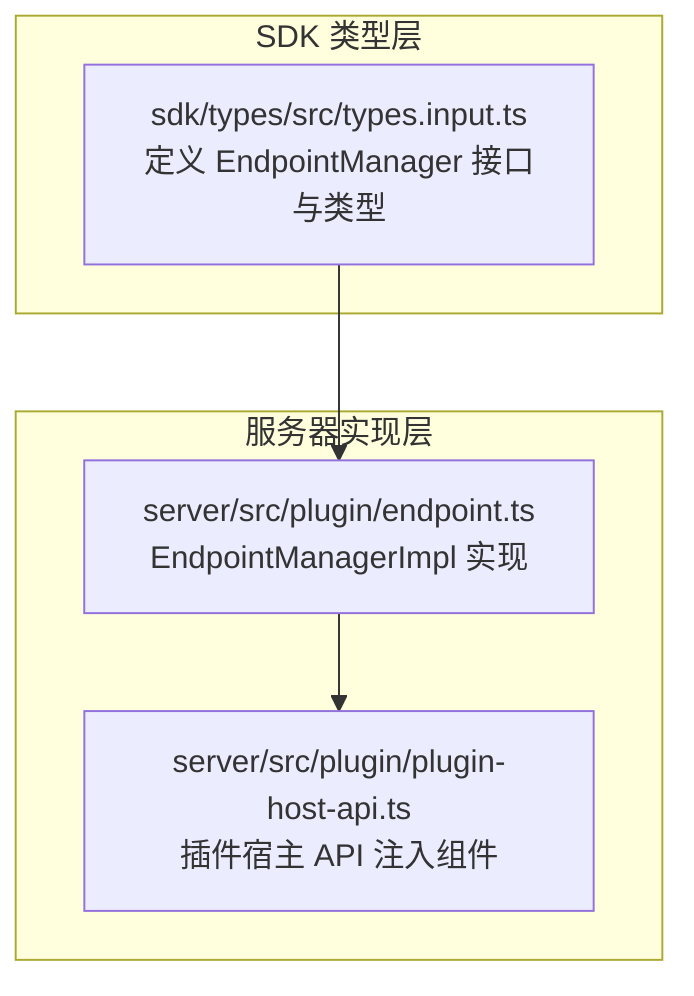
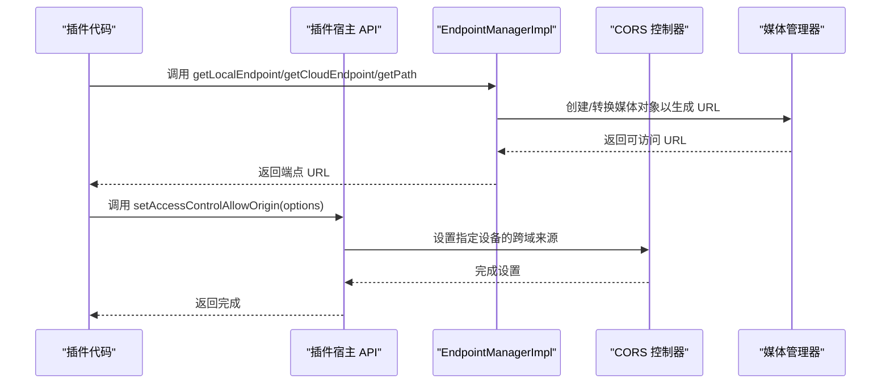
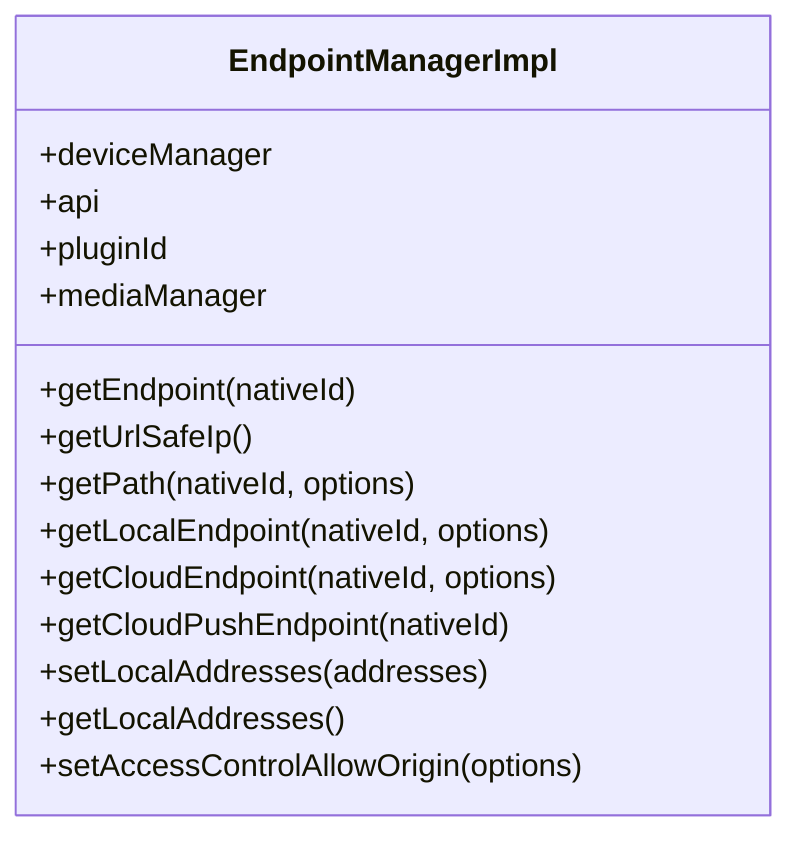
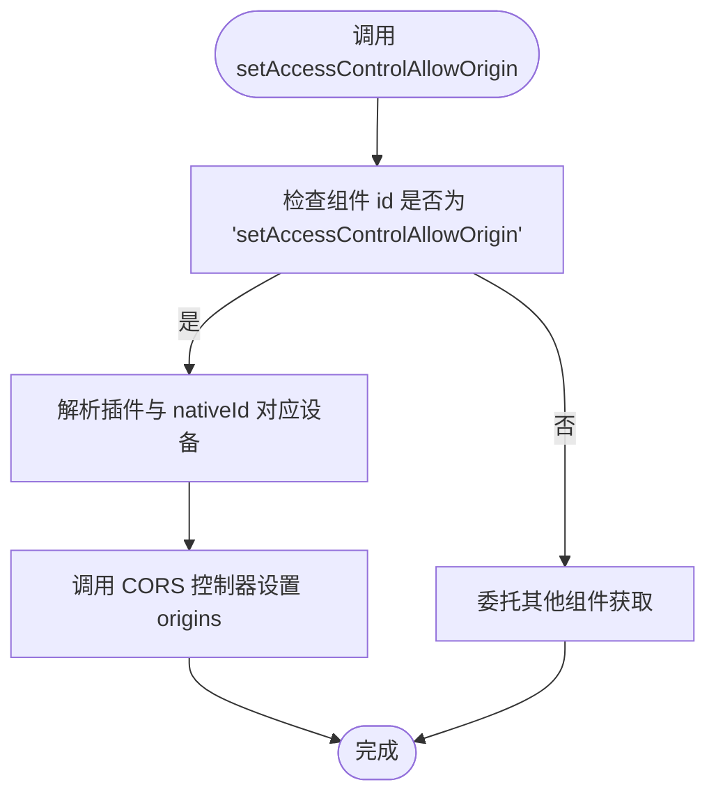
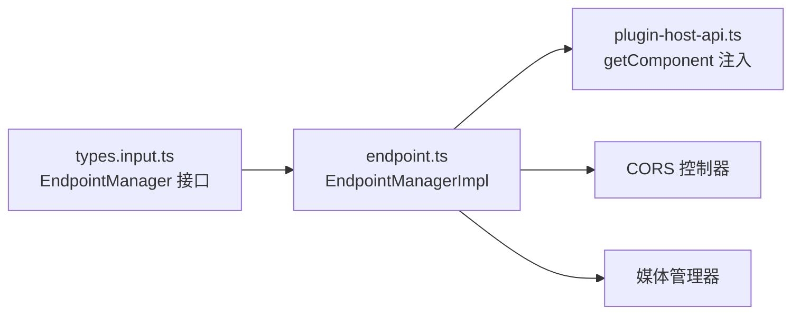

# EndpointManager 网络端点管理器 API

<cite>
**本文引用的文件**
- [types.input.ts](file://sdk/types/src/types.input.ts)
- [endpoint.ts](file://server/src/plugin/endpoint.ts)
- [plugin-host-api.ts](file://server/src/plugin/plugin-host-api.ts)
</cite>

## 目录
1. [简介](#简介)
2. [项目结构](#项目结构)
3. [核心组件](#核心组件)
4. [架构总览](#架构总览)
5. [详细组件分析](#详细组件分析)
6. [依赖关系分析](#依赖关系分析)
7. [性能考虑](#性能考虑)
8. [故障排除指南](#故障排除指南)
9. [结论](#结论)
10. [附录](#附录)

## 简介
EndpointManager 是 Scrypted 插件生态中用于生成和管理对外可访问网络端点的核心接口。它允许插件为设备或自身能力提供本地网络、云可达、公开或私有路径，支持 HTTP(S)、推送端点与跨域访问控制设置。该文档面向开发者，系统性说明端点创建、配置、销毁与安全策略，并给出 HTTP 服务、WebSocket 推送、媒体流传输等典型场景的实践建议。

## 项目结构
EndpointManager 的类型定义位于 SDK 类型声明中，其实现位于服务器侧插件运行时，通过插件宿主 API 暴露给插件进程。

图表来源
- [types.input.ts:2055-2144](file://sdk/types/src/types.input.ts#L2055-L2144)
- [endpoint.ts:5-109](file://server/src/plugin/endpoint.ts#L5-L109)
- [plugin-host-api.ts:93-104](file://server/src/plugin/plugin-host-api.ts#L93-L104)

章节来源
- [types.input.ts:2055-2144](file://sdk/types/src/types.input.ts#L2055-L2144)
- [endpoint.ts:5-109](file://server/src/plugin/endpoint.ts#L5-L109)
- [plugin-host-api.ts:93-104](file://server/src/plugin/plugin-host-api.ts#L93-L104)

## 核心组件
- EndpointManager 接口：提供获取相对路径、本地/云端点、推送端点、设置本地地址、设置跨域来源等能力。
- EndpointAccessControlAllowOrigin：跨域来源配置对象，包含设备 nativeId 与允许的 origins 列表。
- EndpointManagerImpl：服务器侧实现，负责拼装 URL、调用媒体转换、转发到系统 CORS 控制器。
- 插件宿主 API：在运行时注入组件（如 setCORS），供实现调用。

章节来源
- [types.input.ts:2044-2144](file://sdk/types/src/types.input.ts#L2044-L2144)
- [endpoint.ts:5-109](file://server/src/plugin/endpoint.ts#L5-L109)
- [plugin-host-api.ts:93-104](file://server/src/plugin/plugin-host-api.ts#L93-L104)

## 架构总览
EndpointManager 的工作流从插件调用开始，经由插件宿主 API 获取组件，最终落到服务器的 CORS 控制与媒体转换模块。

图表来源
- [endpoint.ts:71-108](file://server/src/plugin/endpoint.ts#L71-L108)
- [plugin-host-api.ts:94-102](file://server/src/plugin/plugin-host-api.ts#L94-L102)

## 详细组件分析

### 接口与类型定义
- EndpointAccessControlAllowOrigin
  - 字段：nativeId（可选）、origins（字符串数组）
  - 用途：为特定设备设置允许的跨域来源，仅在插件重启后有效，需每次启动后重新设置
- EndpointManager
  - 基本路径与端点
    - getPath：返回相对路径，支持 public 选项
    - getLocalEndpoint：返回本地网络可访问 URL，支持 public/insecure 选项
    - getCloudEndpoint：返回可通过云访问的 URL，内部基于本地端点并进行媒体转换
  - 推送与公开
    - getCloudPushEndpoint：返回推送端点 URL
  - 地址与跨域
    - setLocalAddresses/getLocalAddresses：推荐本地监听地址
    - setAccessControlAllowOrigin：设置跨域来源

章节来源
- [types.input.ts:2044-2144](file://sdk/types/src/types.input.ts#L2044-L2144)

### 实现类：EndpointManagerImpl
- 能力概览
  - getEndpoint：根据 nativeId 解析设备 ID 或插件 ID
  - getUrlSafeIp：对 IPv6 地址进行 URL 安全转义
  - 兼容旧接口：getAuthenticatedPath、getInsecurePublicLocalEndpoint、getPublicLocalEndpoint、getPublicCloudEndpoint、getPublicPushEndpoint
  - getPath/getLocalEndpoint/getCloudEndpoint：拼装 URL 并调用媒体管理器转换
  - getCloudPushEndpoint：生成推送端点 URL
  - setLocalAddresses/getLocalAddresses：委托系统地址设置组件
  - setAccessControlAllowOrigin：通过系统组件转发到 CORS 控制器

图表来源
- [endpoint.ts:5-109](file://server/src/plugin/endpoint.ts#L5-L109)

章节来源
- [endpoint.ts:5-109](file://server/src/plugin/endpoint.ts#L5-L109)

### 插件宿主 API 组件注入
- getComponent 对 id='setAccessControlAllowOrigin' 的特殊处理：
  - 根据插件 ID 与 nativeId 查找设备
  - 调用 CORS 控制器设置指定设备的跨域来源列表

图表来源
- [plugin-host-api.ts:94-102](file://server/src/plugin/plugin-host-api.ts#L94-L102)

章节来源
- [plugin-host-api.ts:93-104](file://server/src/plugin/plugin-host-api.ts#L93-L104)

### 方法使用指南与最佳实践

- 获取相对路径
  - 使用 getPath(nativeId, { public?: boolean }) 获取相对路径，用于浏览器会话或内部路由
  - 适用场景：需要在当前站点内访问设备资源，避免跨域问题
- 获取本地端点
  - 使用 getLocalEndpoint(nativeId, { public?: boolean, insecure?: boolean })
  - public=true：生成无需本地 Scrypted 认证的公开本地 URL
  - insecure=true：生成 http 非加密 URL（不推荐生产环境）
  - 适用场景：局域网内客户端直连、调试或内部集成
- 获取云端点
  - 使用 getCloudEndpoint(nativeId, { public?: boolean })
  - 内部基于本地端点并通过媒体管理器转换为可外网访问 URL
  - 适用场景：需要从公网访问本地服务（如摄像头直播、Webhook 回调）
- 获取推送端点
  - 使用 getCloudPushEndpoint(nativeId) 生成推送通道 URL
  - 适用场景：向客户端发送无响应的推送消息（如事件通知）
- 设置跨域来源
  - 使用 setAccessControlAllowOrigin({ nativeId?, origins: string[] })
  - 仅在本次插件生命周期有效，重启后需重新设置
  - 适用场景：前端应用部署在不同域名，需要允许跨域访问
- 设置本地监听地址
  - 使用 setLocalAddresses(addresses) 与 getLocalAddresses()
  - 适用场景：多网卡或多地址环境，明确推荐监听地址

章节来源
- [types.input.ts:2088-2144](file://sdk/types/src/types.input.ts#L2088-L2144)
- [endpoint.ts:71-108](file://server/src/plugin/endpoint.ts#L71-L108)

### 典型应用场景

- HTTP 服务
  - 在插件中注册一个 HttpRequestHandler，结合 getPath/getLocalEndpoint 提供受控的 HTTP 接口
  - 对于公开访问，启用 public 选项；对于外部访问，使用 getCloudEndpoint
- WebSocket 推送
  - 使用 getCloudPushEndpoint 作为推送入口，客户端通过推送通道接收事件
  - 若需双向通信，可在同一路由下扩展 WebSocket 支持（参考相关接口）
- 媒体流传输
  - 结合媒体管理器与端点路径，为视频/音频流提供可访问 URL
  - 注意区分本地与云端访问的协议与认证要求

章节来源
- [types.input.ts:2233-2295](file://sdk/types/src/types.input.ts#L2233-L2295)
- [endpoint.ts:71-108](file://server/src/plugin/endpoint.ts#L71-L108)

## 依赖关系分析
- 类型依赖：EndpointManager 接口定义于 SDK 类型声明
- 实现依赖：EndpointManagerImpl 依赖插件宿主 API 获取组件、媒体管理器进行 URL 转换、系统 CORS 控制器进行跨域设置
- 运行时依赖：插件宿主 API 在运行时注入组件，实现动态转发

图表来源
- [types.input.ts:2055-2144](file://sdk/types/src/types.input.ts#L2055-L2144)
- [endpoint.ts:5-109](file://server/src/plugin/endpoint.ts#L5-L109)
- [plugin-host-api.ts:93-104](file://server/src/plugin/plugin-host-api.ts#L93-L104)

章节来源
- [types.input.ts:2055-2144](file://sdk/types/src/types.input.ts#L2055-L2144)
- [endpoint.ts:5-109](file://server/src/plugin/endpoint.ts#L5-L109)
- [plugin-host-api.ts:93-104](file://server/src/plugin/plugin-host-api.ts#L93-L104)

## 性能考虑
- URL 生成与缓存
  - 本地端点 URL 可复用，避免重复创建媒体对象
  - 对频繁访问的端点，建议在插件内缓存结果并在设备属性变化时更新
- 协议选择
  - 局域网内优先使用 HTTPS，减少中间人攻击风险
  - 仅在开发调试场景使用 insecure=true
- 跨域设置
  - origins 列表尽量最小化，避免通配符导致的安全隐患
  - 仅在必要时设置跨域，避免不必要的 CORS 处理开销

## 故障排除指南
- 设备未找到
  - 现象：setAccessControlAllowOrigin 抛出“设备未找到”错误
  - 排查：确认 nativeId 与插件 ID 正确匹配，设备已注册
- IPv6 地址导致 URL 不可用
  - 现象：URL 中 IPv6 缺少方括号导致解析失败
  - 处理：实现内部已自动转义，确保使用 getUrlSafeIp
- 跨域请求被拒绝
  - 现象：浏览器报跨域错误
  - 处理：确认 setAccessControlAllowOrigin 已在插件启动后调用，且 origins 包含实际来源
- 本地端点无法访问
  - 现象：局域网内无法访问 getLocalEndpoint
  - 处理：检查防火墙、端口映射与 setLocalAddresses 推荐地址是否正确

章节来源
- [plugin-host-api.ts:97-101](file://server/src/plugin/plugin-host-api.ts#L97-L101)
- [endpoint.ts:22-26](file://server/src/plugin/endpoint.ts#L22-L26)

## 结论
EndpointManager 为 Scrypted 插件提供了统一、安全且灵活的网络端点管理能力。通过合理选择本地/云端点、正确配置跨域来源与认证策略，开发者可以在保证安全的前提下快速构建 HTTP、推送与媒体流等多样化网络服务。建议在生产环境中优先采用 HTTPS、最小权限的跨域配置与稳定的本地地址推荐机制。

## 附录

### API 速查表
- getPath(nativeId?, options?)
  - 用途：获取相对路径
  - 选项：public（是否免本地认证）
- getLocalEndpoint(nativeId?, options?)
  - 用途：获取本地网络可访问 URL
  - 选项：public、insecure
- getCloudEndpoint(nativeId?, options?)
  - 用途：获取云可达 URL
  - 选项：public
- getCloudPushEndpoint(nativeId?)
  - 用途：获取推送端点 URL
- setLocalAddresses(addresses)
  - 用途：设置推荐本地监听地址
- getLocalAddresses()
  - 用途：获取推荐本地监听地址
- setAccessControlAllowOrigin(options)
  - 用途：设置跨域来源
  - 参数：nativeId?、origins[]

章节来源
- [types.input.ts:2088-2144](file://sdk/types/src/types.input.ts#L2088-L2144)
- [endpoint.ts:71-108](file://server/src/plugin/endpoint.ts#L71-L108)