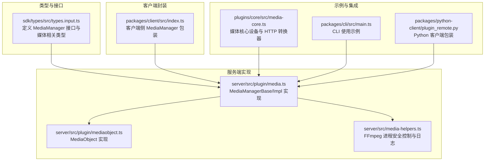
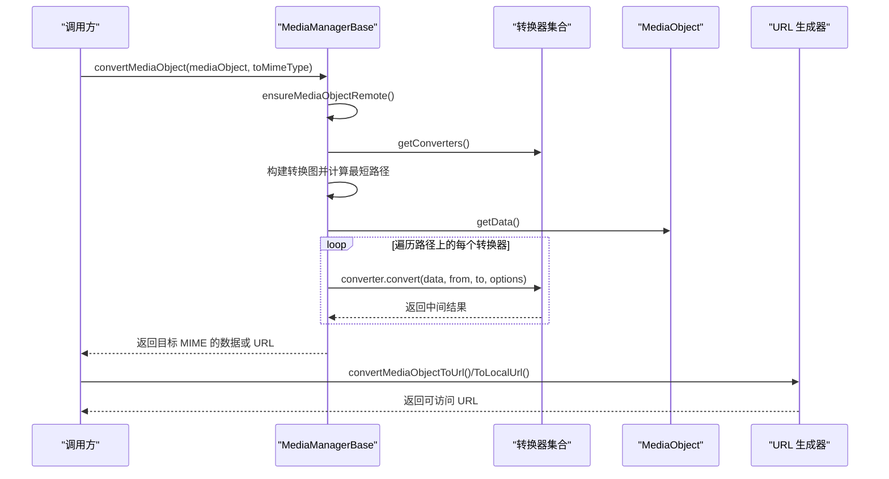
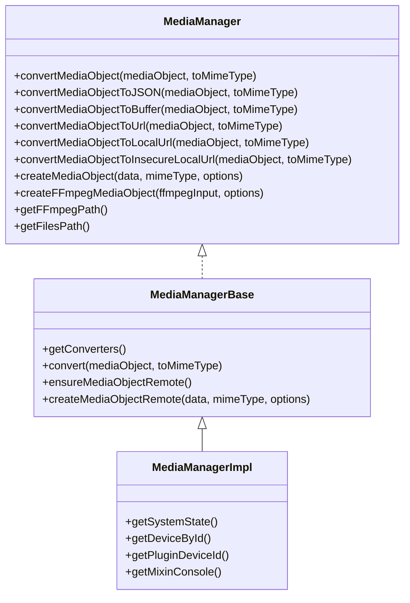
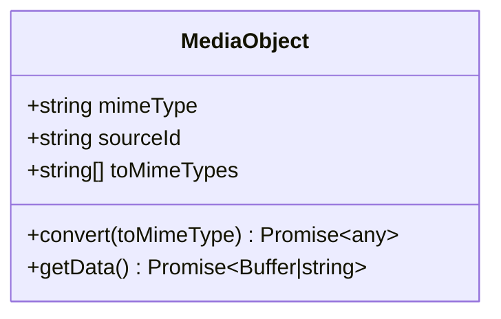
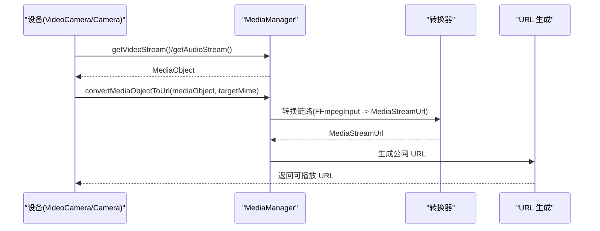
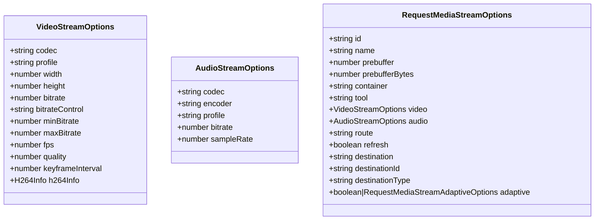
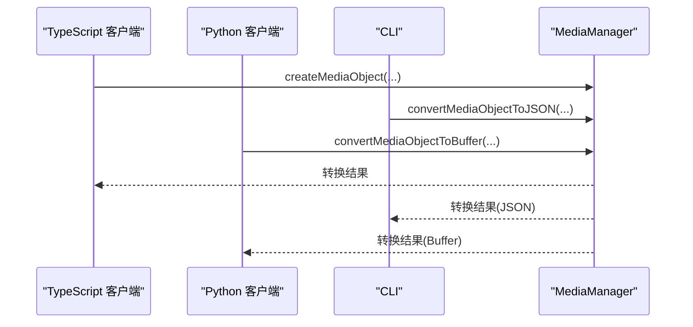
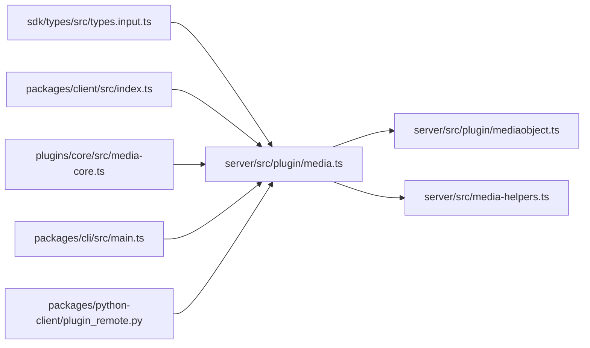

# MediaManager 媒体管理器 API

<cite>
**本文档引用的文件**
- [server/src/plugin/media.ts](file://server/src/plugin/media.ts)
- [server/src/plugin/mediaobject.ts](file://server/src/plugin/mediaobject.ts)
- [server/src/media-helpers.ts](file://server/src/media-helpers.ts)
- [common/src/media-helpers.ts](file://common/src/media-helpers.ts)
- [sdk/types/src/types.input.ts](file://sdk/types/src/types.input.ts)
- [plugins/core/src/media-core.ts](file://plugins/core/src/media-core.ts)
- [packages/client/src/index.ts](file://packages/client/src/index.ts)
- [packages/cli/src/main.ts](file://packages/cli/src/main.ts)
- [packages/python-client/plugin_remote.py](file://packages/python-client/plugin_remote.py)
</cite>

## 目录
1. [简介](#简介)
2. [项目结构](#项目结构)
3. [核心组件](#核心组件)
4. [架构总览](#架构总览)
5. [详细组件分析](#详细组件分析)
6. [依赖关系分析](#依赖关系分析)
7. [性能考虑](#性能考虑)
8. [故障排除指南](#故障排除指南)
9. [结论](#结论)
10. [附录](#附录)

## 简介
本文件为 Scrypted 的 MediaManager 媒体管理器 API 参考文档，聚焦于媒体对象的创建、转换与缓存机制，以及媒体格式转换、编码配置、流媒体处理等能力。重点覆盖以下方法与流程：
- createMediaObject：从任意数据源创建媒体对象
- convertMediaObject：在多种 MIME 类型之间进行转换
- getVideoStream / getAudioStream：请求视频/音频流（通过设备接口）
- getVideoStreamOptions / getAudioStreamOptions：查询可用的流参数与容器配置
- createFFmpegMediaObject：封装 FFmpeg 输入参数以生成可被转换器处理的媒体对象
- 转换链路与内置/系统/插件转换器的协作
- 流媒体处理、URL 生成、本地/内网/公网访问控制
- 性能优化、内存管理与错误处理建议

## 项目结构
围绕 MediaManager 的核心实现分布在以下模块：
- 类型与接口定义：sdk/types/src/types.input.ts
- 服务端实现：server/src/plugin/media.ts、server/src/plugin/mediaobject.ts、server/src/media-helpers.ts
- 客户端封装：packages/client/src/index.ts
- 示例与集成：plugins/core/src/media-core.ts、packages/cli/src/main.ts、packages/python-client/plugin_remote.py

**图表来源**
- [sdk/types/src/types.input.ts:1915-1972](file://sdk/types/src/types.input.ts#L1915-L1972)
- [server/src/plugin/media.ts:40-514](file://server/src/plugin/media.ts#L40-L514)
- [server/src/plugin/mediaobject.ts:5-26](file://server/src/plugin/mediaobject.ts#L5-L26)
- [server/src/media-helpers.ts:1-98](file://server/src/media-helpers.ts#L1-L98)
- [packages/client/src/index.ts:600-1022](file://packages/client/src/index.ts#L600-L1022)
- [plugins/core/src/media-core.ts:1-145](file://plugins/core/src/media-core.ts#L1-L145)
- [packages/cli/src/main.ts:150-170](file://packages/cli/src/main.ts#L150-L170)
- [packages/python-client/plugin_remote.py:385-466](file://packages/python-client/plugin_remote.py#L385-L466)

**章节来源**
- [sdk/types/src/types.input.ts:1915-1972](file://sdk/types/src/types.input.ts#L1915-L1972)
- [server/src/plugin/media.ts:40-514](file://server/src/plugin/media.ts#L40-L514)
- [server/src/plugin/mediaobject.ts:5-26](file://server/src/plugin/mediaobject.ts#L5-L26)
- [server/src/media-helpers.ts:1-98](file://server/src/media-helpers.ts#L1-L98)
- [packages/client/src/index.ts:600-1022](file://packages/client/src/index.ts#L600-L1022)
- [plugins/core/src/media-core.ts:1-145](file://plugins/core/src/media-core.ts#L1-L145)
- [packages/cli/src/main.ts:150-170](file://packages/cli/src/main.ts#L150-L170)
- [packages/python-client/plugin_remote.py:385-466](file://packages/python-client/plugin_remote.py#L385-L466)

## 核心组件
- MediaManager 接口：定义媒体对象创建、转换、URL 生成、FFmpeg 输入封装、文件路径获取等能力
- MediaManagerBase/Impl：实现转换器发现、图搜索最短路径、内置/系统/插件转换器组合、URL 生成策略
- MediaObject：媒体对象载体，支持属性代理、转换回调与数据获取
- MediaHelpers：FFmpeg 进程安全终止、首帧日志过滤、参数脱敏打印

关键职责与行为：
- createMediaObject/createFFmpegMediaObject：将输入数据封装为 MediaObject，供后续转换器处理
- convertMediaObject/convertMediaObjectToBuffer/convertMediaObjectToUrl：执行转换链路，返回目标 MIME 的数据或 URL
- getVideoStream/getAudioStream：通过设备接口获取流媒体对象（通常由转换器进一步处理为 URL 或 Buffer）
- getFFmpegPath/getFilesPath：提供 FFmpeg 可执行路径与插件文件存储目录

**章节来源**
- [sdk/types/src/types.input.ts:1915-1972](file://sdk/types/src/types.input.ts#L1915-L1972)
- [server/src/plugin/media.ts:40-514](file://server/src/plugin/media.ts#L40-L514)
- [server/src/plugin/mediaobject.ts:5-26](file://server/src/plugin/mediaobject.ts#L5-L26)
- [server/src/media-helpers.ts:1-98](file://server/src/media-helpers.ts#L1-L98)

## 架构总览
MediaManager 的核心是“转换器图”与“媒体对象”。系统通过扫描系统状态中的 BufferConverter/MediaConverter 设备，构建一个从输入媒体到目标 MIME 的加权有向图，使用 Dijkstra 最短路径算法选择最优转换链路。

**图表来源**
- [server/src/plugin/media.ts:313-471](file://server/src/plugin/media.ts#L313-L471)
- [server/src/plugin/media.ts:252-279](file://server/src/plugin/media.ts#L252-L279)
- [server/src/plugin/media.ts:281-295](file://server/src/plugin/media.ts#L281-L295)

**章节来源**
- [server/src/plugin/media.ts:313-471](file://server/src/plugin/media.ts#L313-L471)
- [server/src/plugin/media.ts:252-279](file://server/src/plugin/media.ts#L252-L279)
- [server/src/plugin/media.ts:281-295](file://server/src/plugin/media.ts#L281-L295)

## 详细组件分析

### MediaManager 接口与实现
- 接口能力
  - createMediaObject：从任意数据与 MIME 创建 MediaObject
  - createFFmpegMediaObject：封装 FFmpeg 输入参数
  - convertMediaObject/convertMediaObjectToBuffer/convertMediaObjectToJSON：在 MIME 间转换
  - convertMediaObjectToUrl/convertMediaObjectToLocalUrl/convertMediaObjectToInsecureLocalUrl：生成可访问 URL
  - getFFmpegPath/getFilesPath：获取工具路径与文件存储目录
- 实现要点
  - 内置转换器：HTTP/HTTPS 文件/URL 到 MediaObject、FFmpegInput 互转、RTSP 参数适配
  - 系统转换器：扫描系统中 BufferConverter/MediaConverter 设备
  - 插件转换器：addConverter/clearConverters 支持动态扩展
  - 路径选择：基于 MIME 参数权重与 Dijkstra 最短路径

**图表来源**
- [sdk/types/src/types.input.ts:1915-1972](file://sdk/types/src/types.input.ts#L1915-L1972)
- [server/src/plugin/media.ts:40-514](file://server/src/plugin/media.ts#L40-L514)

**章节来源**
- [sdk/types/src/types.input.ts:1915-1972](file://sdk/types/src/types.input.ts#L1915-L1972)
- [server/src/plugin/media.ts:40-514](file://server/src/plugin/media.ts#L40-L514)

### MediaObject 对象模型
- 属性
  - mimeType：媒体类型
  - sourceId：来源设备 ID
  - toMimeTypes：该对象可直接转换的目标 MIME 列表
  - convert：按目标 MIME 执行转换的回调
- 行为
  - getData：异步获取底层数据（Buffer/字符串/JSON）
  - __proxy_props：用于 RPC 传输的安全属性映射

**图表来源**
- [server/src/plugin/mediaobject.ts:5-26](file://server/src/plugin/mediaobject.ts#L5-L26)
- [sdk/types/src/types.input.ts:298-304](file://sdk/types/src/types.input.ts#L298-L304)

**章节来源**
- [server/src/plugin/mediaobject.ts:5-26](file://server/src/plugin/mediaobject.ts#L5-L26)
- [sdk/types/src/types.input.ts:298-304](file://sdk/types/src/types.input.ts#L298-L304)

### 转换器图与最短路径
- 节点
  - mediaObject：输入媒体节点
  - output：输出目标节点
  - 每个转换器对应一个中间节点
- 边权重
  - 来自 MIME 参数 converter-weight；通配符权重更高，避免滥用
- 路径选择
  - 使用 Dijkstra 算法在图上寻找从 mediaObject 到 output 的最短路径
  - 每一步调用具体转换器的 convert 方法，逐步逼近目标 MIME

**图表来源**
- [server/src/plugin/media.ts:313-471](file://server/src/plugin/media.ts#L313-L471)

**章节来源**
- [server/src/plugin/media.ts:313-471](file://server/src/plugin/media.ts#L313-L471)

### 流媒体处理与 URL 生成
- getVideoStream/getAudioStream：通过设备接口获取 MediaObject，随后可交由 MediaManager 转换为 URL 或 Buffer
- createFFmpegMediaObject：封装 FFmpegInput（包含 url/urls、inputArguments、env、ffmpegPath 等），便于转换器链路处理
- URL 生成策略
  - convertMediaObjectToLocalUrl/convertMediaObjectToInsecureLocalUrl：生成本地/内网可访问 URL
  - convertMediaObjectToUrl：生成公网可访问 URL
- RTSP 特殊处理：自动设置 -rtsp_transport tcp 并标记 container 为 rtsp

**图表来源**
- [sdk/types/src/types.input.ts:712-726](file://sdk/types/src/types.input.ts#L712-L726)
- [server/src/plugin/media.ts:297-307](file://server/src/plugin/media.ts#L297-L307)
- [server/src/plugin/media.ts:106-139](file://server/src/plugin/media.ts#L106-L139)
- [server/src/plugin/media.ts:274-279](file://server/src/plugin/media.ts#L274-L279)

**章节来源**
- [sdk/types/src/types.input.ts:712-726](file://sdk/types/src/types.input.ts#L712-L726)
- [server/src/plugin/media.ts:297-307](file://server/src/plugin/media.ts#L297-L307)
- [server/src/plugin/media.ts:106-139](file://server/src/plugin/media.ts#L106-L139)
- [server/src/plugin/media.ts:274-279](file://server/src/plugin/media.ts#L274-L279)

### 编码配置与流参数
- 视频流参数：codec/profile/width/height/bitrate/minBitrate/maxBitrate/fps/keyframeInterval/h264Info 等
- 音频流参数：codec/encoder/profile/bitrate/sampleRate
- 请求选项：container/tool/预缓冲/自适应比特率/目的地/SSRC 报告等
- 设备接口：VideoCamera.getVideoStreamOptions 与 Microphone.getAudioStream 提供能力声明

**图表来源**
- [sdk/types/src/types.input.ts:494-661](file://sdk/types/src/types.input.ts#L494-L661)

**章节来源**
- [sdk/types/src/types.input.ts:494-661](file://sdk/types/src/types.input.ts#L494-L661)

### 客户端与示例集成
- TypeScript 客户端：packages/client/src/index.ts 中对 MediaManager 的包装与方法注入
- CLI 示例：packages/cli/src/main.ts 展示 convertMediaObjectToJSON 的使用
- Python 客户端：packages/python-client/plugin_remote.py 提供 MediaManager 的 Python 封装

**图表来源**
- [packages/client/src/index.ts:600-1022](file://packages/client/src/index.ts#L600-L1022)
- [packages/cli/src/main.ts:150-170](file://packages/cli/src/main.ts#L150-L170)
- [packages/python-client/plugin_remote.py:385-466](file://packages/python-client/plugin_remote.py#L385-L466)

**章节来源**
- [packages/client/src/index.ts:600-1022](file://packages/client/src/index.ts#L600-L1022)
- [packages/cli/src/main.ts:150-170](file://packages/cli/src/main.ts#L150-L170)
- [packages/python-client/plugin_remote.py:385-466](file://packages/python-client/plugin_remote.py#L385-L466)

## 依赖关系分析
- 类型依赖：MediaManager 接口与媒体相关类型定义位于 sdk/types
- 实现依赖：MediaManagerBase 依赖系统状态、设备管理器、RPC 通道与 MIME 解析库
- 转换器依赖：系统 BufferConverter/MediaConverter 设备与插件转换器
- 工具依赖：FFmpeg 路径解析、进程安全控制与日志过滤

**图表来源**
- [sdk/types/src/types.input.ts:1915-1972](file://sdk/types/src/types.input.ts#L1915-L1972)
- [server/src/plugin/media.ts:40-514](file://server/src/plugin/media.ts#L40-L514)
- [server/src/plugin/mediaobject.ts:5-26](file://server/src/plugin/mediaobject.ts#L5-L26)
- [server/src/media-helpers.ts:1-98](file://server/src/media-helpers.ts#L1-L98)
- [packages/client/src/index.ts:600-1022](file://packages/client/src/index.ts#L600-L1022)
- [plugins/core/src/media-core.ts:1-145](file://plugins/core/src/media-core.ts#L1-L145)
- [packages/cli/src/main.ts:150-170](file://packages/cli/src/main.ts#L150-L170)
- [packages/python-client/plugin_remote.py:385-466](file://packages/python-client/plugin_remote.py#L385-L466)

**章节来源**
- [sdk/types/src/types.input.ts:1915-1972](file://sdk/types/src/types.input.ts#L1915-L1972)
- [server/src/plugin/media.ts:40-514](file://server/src/plugin/media.ts#L40-L514)
- [server/src/plugin/mediaobject.ts:5-26](file://server/src/plugin/mediaobject.ts#L5-L26)
- [server/src/media-helpers.ts:1-98](file://server/src/media-helpers.ts#L1-L98)
- [packages/client/src/index.ts:600-1022](file://packages/client/src/index.ts#L600-L1022)
- [plugins/core/src/media-core.ts:1-145](file://plugins/core/src/media-core.ts#L1-L145)
- [packages/cli/src/main.ts:150-170](file://packages/cli/src/main.ts#L150-L170)
- [packages/python-client/plugin_remote.py:385-466](file://packages/python-client/plugin_remote.py#L385-L466)

## 性能考虑
- 转换链路优化
  - 合理设置 MIME 参数 converter-weight，避免滥用通配符转换器
  - 优先使用系统/内置转换器，减少跨进程/网络开销
- FFmpeg 进程管理
  - 使用 safeKillFFmpeg 在异常时优雅终止进程，避免僵尸进程
  - 使用 ffmpegLogInitialOutput 控制日志量，仅在检测到音视频帧后停止高频日志
  - 使用 safePrintFFmpegArguments 对敏感参数（如密码）进行脱敏打印
- URL 生成与缓存
  - 优先使用 convertMediaObjectToLocalUrl/convertMediaObjectToInsecureLocalUrl 降低公网暴露风险
  - 对静态图片/缩略图设置合理的 Cache-Control
- 内存与资源
  - 避免在转换链路中重复序列化/反序列化大对象
  - 合理使用 Buffer/流式处理，避免一次性加载过大数据

**章节来源**
- [server/src/media-helpers.ts:11-98](file://server/src/media-helpers.ts#L11-L98)
- [server/src/plugin/media.ts:372-401](file://server/src/plugin/media.ts#L372-L401)

## 故障排除指南
- 无可用转换器
  - 现象：抛出“未找到转换器”的错误
  - 处理：检查系统中 BufferConverter/MediaConverter 设备是否正确注册，确认 MIME 匹配
- 转换失败或超时
  - 现象：转换链路中断或返回空数据
  - 处理：检查转换器权重与依赖，确保前置转换器输出 MIME 与后继转换器输入 MIME 匹配
- FFmpeg 异常退出
  - 现象：FFmpeg 进程提前退出或报错
  - 处理：使用 safeKillFFmpeg 终止进程，检查输入 URL/参数，开启 ffmpegLogInitialOutput 查看日志
- URL 访问失败
  - 现象：生成的 URL 无法访问
  - 处理：确认路由策略（external/internal/direct）、防火墙与证书配置；必要时改用本地 URL

**章节来源**
- [server/src/plugin/media.ts:428-431](file://server/src/plugin/media.ts#L428-L431)
- [server/src/media-helpers.ts:11-38](file://server/src/media-helpers.ts#L11-L38)

## 结论
MediaManager 通过统一的 MediaObject 与转换器图，实现了跨格式、跨来源的媒体处理能力。结合系统/内置/插件转换器与 URL 生成策略，能够灵活满足视频流、音频处理、图像转换等场景需求。配合 FFmpeg 进程安全控制与日志管理，可在保证稳定性的同时提升性能与安全性。

## 附录

### 常用方法速查
- 创建媒体对象
  - createMediaObject(data, mimeType, options)
  - createFFmpegMediaObject(ffmpegInput, options)
  - createMediaObjectFromUrl(url, options)
- 转换与导出
  - convertMediaObject(mediaObject, toMimeType)
  - convertMediaObjectToBuffer(mediaObject, toMimeType)
  - convertMediaObjectToJSON(mediaObject, toMimeType)
  - convertMediaObjectToUrl/mediaObjectToLocalUrl/mediaObjectToInsecureLocalUrl
- 设备流媒体
  - VideoCamera.getVideoStream/getVideoStreamOptions
  - Microphone.getAudioStream
- 工具与路径
  - getFFmpegPath/getFilesPath

**章节来源**
- [sdk/types/src/types.input.ts:1915-1972](file://sdk/types/src/types.input.ts#L1915-L1972)
- [server/src/plugin/media.ts:297-307](file://server/src/plugin/media.ts#L297-L307)
- [sdk/types/src/types.input.ts:712-726](file://sdk/types/src/types.input.ts#L712-L726)
- [sdk/types/src/types.input.ts:691-693](file://sdk/types/src/types.input.ts#L691-L693)