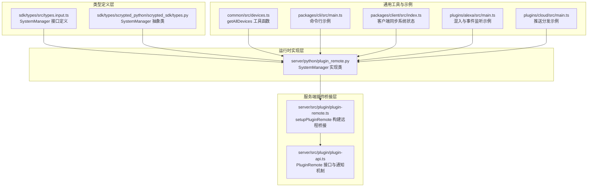
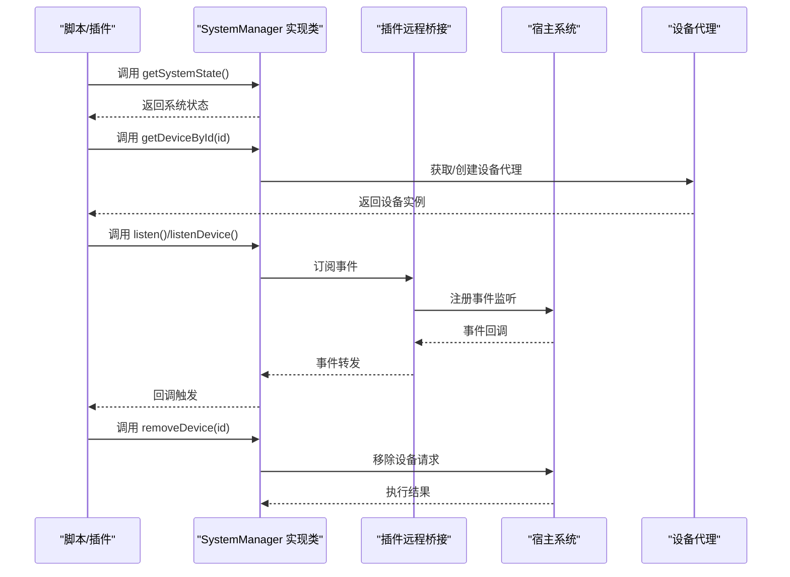
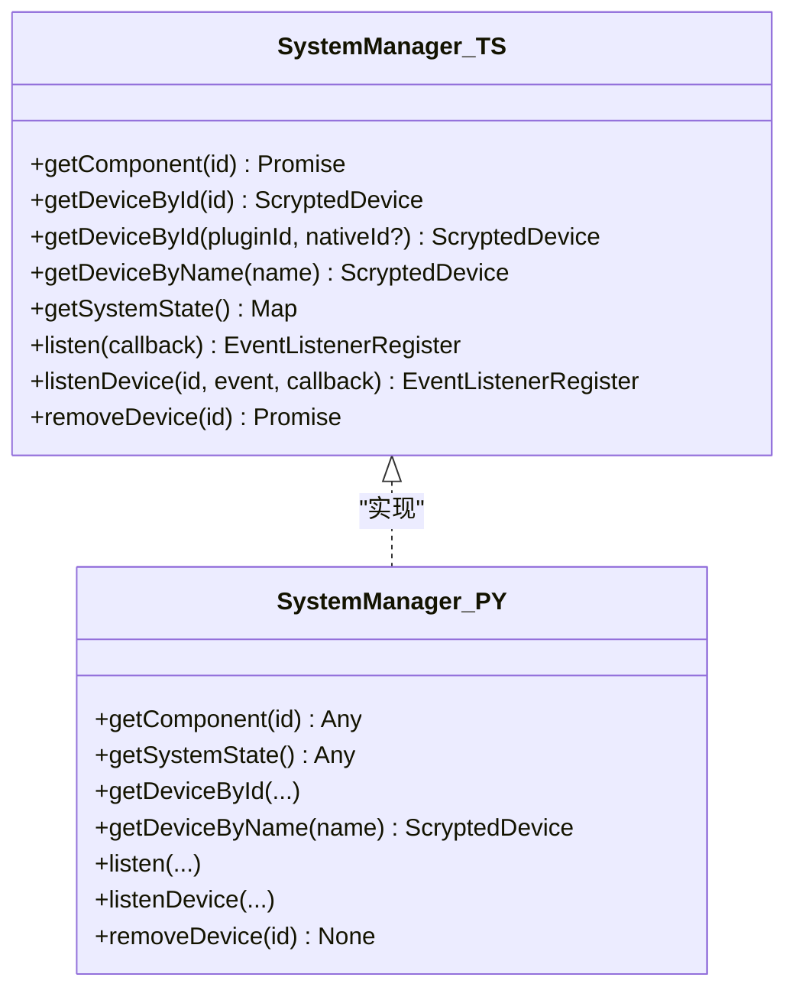
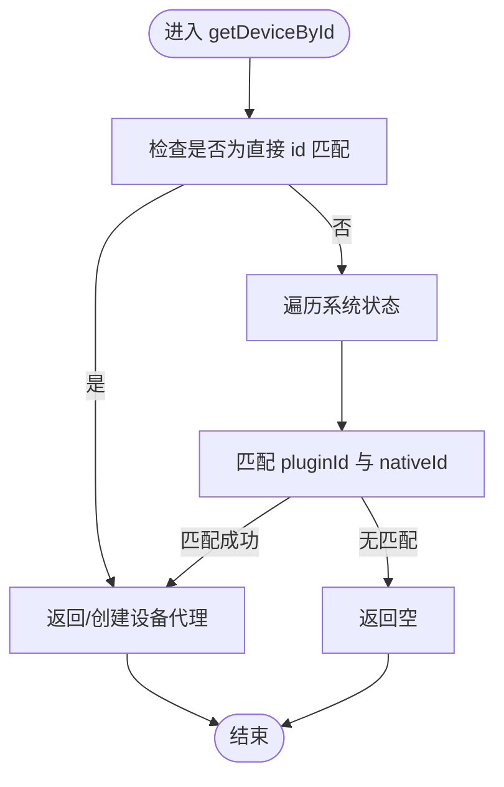
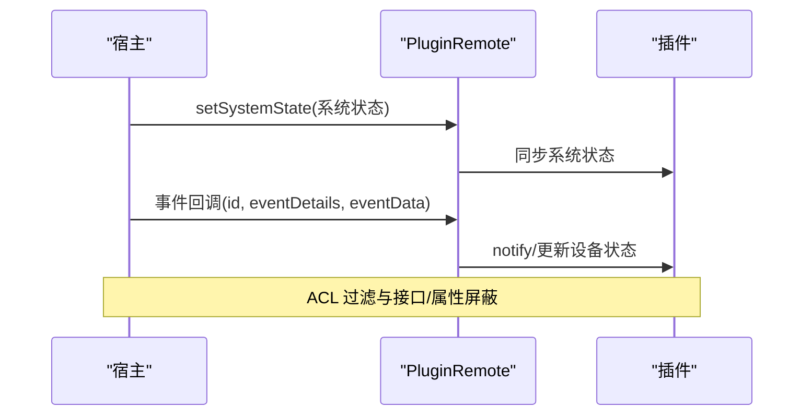
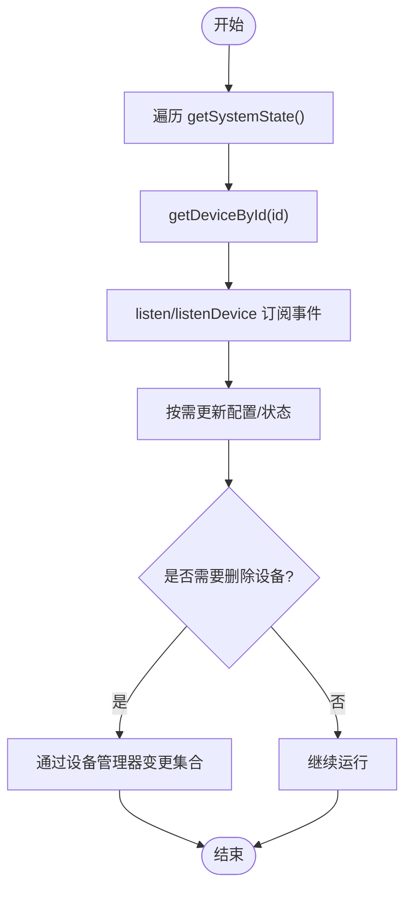
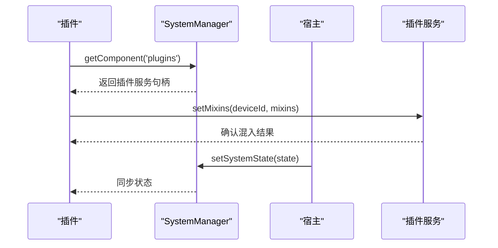
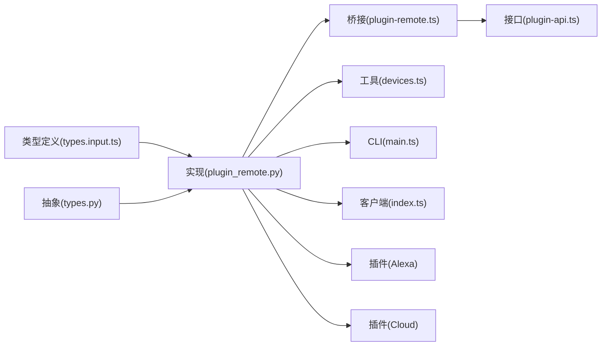

# SystemManager 系统管理器 API

<cite>
**本文引用的文件**
- [types.input.ts](file://sdk/types/src/types.input.ts)
- [types.py](file://sdk/types/scrypted_python/scrypted_sdk/types.py)
- [plugin_remote.py](file://server/python/plugin_remote.py)
- [plugin-remote.ts](file://server/src/plugin/plugin-remote.ts)
- [plugin-api.ts](file://server/src/plugin/plugin-api.ts)
- [devices.ts](file://common/src/devices.ts)
- [main.ts](file://packages/cli/src/main.ts)
- [index.ts](file://packages/client/src/index.ts)
- [main.ts](file://plugins/alexa/src/main.ts)
- [main.ts](file://plugins/cloud/src/main.ts)
</cite>

## 目录
1. [简介](#简介)
2. [项目结构](#项目结构)
3. [核心组件](#核心组件)
4. [架构总览](#架构总览)
5. [详细组件分析](#详细组件分析)
6. [依赖关系分析](#依赖关系分析)
7. [性能考量](#性能考量)
8. [故障排查指南](#故障排查指南)
9. [结论](#结论)
10. [附录](#附录)

## 简介
本文件为 Scrypted SystemManager 系统管理器 API 的权威参考文档。围绕设备生命周期管理（创建、删除、配置更新、系统状态查询）与高级功能（系统状态管理、设备配置管理、插件管理），系统性梳理接口定义、实现细节、调用流程与最佳实践，并提供异步处理、错误处理与性能优化建议。重点覆盖以下核心接口：
- getDeviceById：按设备 id 或（插件 id + 原生 id）查找设备
- getSystemState：获取全量设备状态
- setSystemState：设置系统状态（由宿主侧维护）
- removeDevice：移除设备（插件应通过设备管理器变更，而非直接调用）

## 项目结构
SystemManager API 的定义与实现横跨 TypeScript 类型层、Python 运行时桥接层以及服务端插件远程通信层，形成“类型定义 → 实现类 → 远程代理 → 插件交互”的完整链路。

**图表来源**
- [types.input.ts:2150-2206](file://sdk/types/src/types.input.ts#L2150-L2206)
- [types.py:1968-1990](file://sdk/types/scrypted_python/scrypted_sdk/types.py#L1968-L1990)
- [plugin_remote.py:252-364](file://server/python/plugin_remote.py#L252-L364)
- [plugin-remote.ts:12-92](file://server/src/plugin/plugin-remote.ts#L12-L92)
- [plugin-api.ts:178-194](file://server/src/plugin/plugin-api.ts#L178-L194)
- [devices.ts:1-6](file://common/src/devices.ts#L1-L6)
- [main.ts:110-125](file://packages/cli/src/main.ts#L110-L125)
- [index.ts:690-720](file://packages/client/src/index.ts#L690-L720)
- [main.ts:80-108](file://plugins/alexa/src/main.ts#L80-L108)
- [main.ts:770-785](file://plugins/cloud/src/main.ts#L770-L785)

**章节来源**
- [types.input.ts:2150-2206](file://sdk/types/src/types.input.ts#L2150-L2206)
- [plugin_remote.py:252-364](file://server/python/plugin_remote.py#L252-L364)
- [plugin-remote.ts:12-92](file://server/src/plugin/plugin-remote.ts#L12-L92)
- [plugin-api.ts:178-194](file://server/src/plugin/plugin-api.ts#L178-L194)

## 核心组件
- SystemManager 接口与抽象类
  - TypeScript 定义了 SystemManager 的方法签名与职责边界，包括设备查询、系统状态访问、事件订阅与设备移除。
  - Python 抽象类提供了与 TypeScript 对应的接口骨架，便于在不同运行时中实现。
- SystemManager 实现类
  - 在 Python 运行时中，SystemManager 实现负责将系统状态映射到设备代理对象，提供事件监听与设备移除能力。
- 插件远程桥接
  - 服务端通过 setupPluginRemote 将宿主系统状态与事件流桥接到插件侧，实现 setSystemState、updateDeviceState、notify 等关键能力。
- 工具与示例
  - getAllDevices 提供便捷遍历系统中所有设备的能力。
  - CLI、客户端与多个插件展示了 SystemManager 的典型使用场景。

**章节来源**
- [types.input.ts:2150-2206](file://sdk/types/src/types.input.ts#L2150-L2206)
- [types.py:1968-1990](file://sdk/types/scrypted_python/scrypted_sdk/types.py#L1968-L1990)
- [plugin_remote.py:252-364](file://server/python/plugin_remote.py#L252-L364)
- [plugin-remote.ts:12-92](file://server/src/plugin/plugin-remote.ts#L12-L92)
- [devices.ts:1-6](file://common/src/devices.ts#L1-L6)

## 架构总览
SystemManager 的调用路径从脚本或插件发起，经由运行时实现类，最终通过服务端插件桥接层与宿主系统进行交互。

**图表来源**
- [plugin_remote.py:265-364](file://server/python/plugin_remote.py#L265-L364)
- [plugin-remote.ts:60-85](file://server/src/plugin/plugin-remote.ts#L60-L85)
- [plugin-api.ts:178-194](file://server/src/plugin/plugin-api.ts#L178-L194)

## 详细组件分析

### SystemManager 接口与职责
- 设备查询
  - getDeviceById 支持按 id 或（插件 id + 原生 id）两种方式定位设备。
  - getDeviceByName 支持按名称或插件 id 定位设备。
- 系统状态
  - getSystemState 返回全量设备状态映射，键为设备 id，值为属性到 SystemDeviceState 的映射。
- 事件订阅
  - listen 提供被动监听系统级事件的能力。
  - listenDevice 提供对特定设备属性变化的订阅。
- 设备移除
  - removeDevice 异步移除指定设备，插件应通过设备管理器变更自身设备集合，避免直接调用此接口。

**图表来源**
- [types.input.ts:2150-2206](file://sdk/types/src/types.input.ts#L2150-L2206)
- [types.py:1968-1990](file://sdk/types/scrypted_python/scrypted_sdk/types.py#L1968-L1990)

**章节来源**
- [types.input.ts:2150-2206](file://sdk/types/src/types.input.ts#L2150-L2206)
- [types.py:1968-1990](file://sdk/types/scrypted_python/scrypted_sdk/types.py#L1968-L1990)

### SystemManager 实现类（Python）
- 状态缓存与设备代理
  - 维护 systemState 缓存与设备代理映射，避免重复创建设备代理。
  - getDeviceById 支持 idOrPluginId 与 nativeId 双重匹配逻辑。
- 事件监听
  - listen 与 listenDevice 将回调包装为非协程，必要时通过 API 层注册远端监听并返回可取消的注册器。
- 设备移除
  - removeDevice 直接委托给宿主 API 执行。

**图表来源**
- [plugin_remote.py:268-300](file://server/python/plugin_remote.py#L268-L300)

**章节来源**
- [plugin_remote.py:252-364](file://server/python/plugin_remote.py#L252-L364)

### 插件远程桥接（宿主 → 插件）
- 系统状态初始化
  - setupPluginRemote 在建立连接后，先向插件发送当前系统状态（含访问控制过滤）。
- 事件传播
  - 监听宿主事件，根据事件类型与 ACL 决定是否转发至插件；对设备 id 变化做特殊处理（视为删除）。
- 通知与更新
  - updateDeviceState 用于设备描述符或属性更新；notify 用于属性变化事件的单向通知。

**图表来源**
- [plugin-remote.ts:45-85](file://server/src/plugin/plugin-remote.ts#L45-L85)
- [plugin-api.ts:178-194](file://server/src/plugin/plugin-api.ts#L178-L194)

**章节来源**
- [plugin-remote.ts:12-92](file://server/src/plugin/plugin-remote.ts#L12-L92)
- [plugin-api.ts:178-194](file://server/src/plugin/plugin-api.ts#L178-L194)

### 设备生命周期管理最佳实践
- 查询与遍历
  - 使用 getSystemState 遍历设备 id，再通过 getDeviceById 获取设备实例，避免重复扫描。
  - 工具函数 getAllDevices 提供便捷遍历，适用于批量处理场景。
- 事件驱动
  - 使用 listen 或 listenDevice 订阅设备属性变化，避免轮询。
- 删除设备
  - 插件应通过设备管理器变更自身设备集合，而非直接调用 removeDevice；宿主会通过 updateDeviceState 通知插件设备已删除。

**图表来源**
- [devices.ts:1-6](file://common/src/devices.ts#L1-L6)
- [plugin-remote.ts:67-77](file://server/src/plugin/plugin-remote.ts#L67-L77)

**章节来源**
- [devices.ts:1-6](file://common/src/devices.ts#L1-L6)
- [plugin-remote.ts:60-85](file://server/src/plugin/plugin-remote.ts#L60-L85)

### 高级功能：系统状态管理、设备配置管理、插件管理
- 系统状态管理
  - 宿主通过 setSystemState 初始化插件侧状态；插件侧可通过 updateDeviceState 更新单个设备状态；notify 用于属性级事件通知。
- 设备配置管理
  - 插件通过设备管理器维护设备配置与原生 id 映射，SystemManager 仅提供只读访问与事件订阅。
- 插件管理
  - 通过 getComponent('plugins') 获取插件服务，实现混入启用/禁用等高级功能（如 Alexa 插件自动混入支持）。

**图表来源**
- [plugin_remote.py:262-263](file://server/python/plugin_remote.py#L262-L263)
- [plugin-remote.ts:142-150](file://server/src/plugin/plugin-remote.ts#L142-L150)
- [main.ts:131-132](file://plugins/alexa/src/main.ts#L131-L132)

**章节来源**
- [plugin_remote.py:262-263](file://server/python/plugin_remote.py#L262-L263)
- [plugin-remote.ts:142-150](file://server/src/plugin/plugin-remote.ts#L142-L150)
- [main.ts:110-138](file://plugins/alexa/src/main.ts#L110-L138)

## 依赖关系分析
- 类型层与实现层
  - TypeScript 接口定义与 Python 抽象类保持一致的方法签名，确保跨语言一致性。
- 实现层与桥接层
  - SystemManager 实现类与服务端插件桥接紧密耦合，通过 RPC 参数传递与事件回调完成双向通信。
- 工具与示例
  - getAllDevices、CLI、客户端与插件均依赖 SystemManager 的查询与事件能力。

**图表来源**
- [types.input.ts:2150-2206](file://sdk/types/src/types.input.ts#L2150-L2206)
- [types.py:1968-1990](file://sdk/types/scrypted_python/scrypted_sdk/types.py#L1968-L1990)
- [plugin_remote.py:252-364](file://server/python/plugin_remote.py#L252-L364)
- [plugin-remote.ts:12-92](file://server/src/plugin/plugin-remote.ts#L12-L92)
- [plugin-api.ts:178-194](file://server/src/plugin/plugin-api.ts#L178-L194)
- [devices.ts:1-6](file://common/src/devices.ts#L1-L6)
- [main.ts:110-125](file://packages/cli/src/main.ts#L110-L125)
- [index.ts:690-720](file://packages/client/src/index.ts#L690-L720)
- [main.ts:80-108](file://plugins/alexa/src/main.ts#L80-L108)
- [main.ts:770-785](file://plugins/cloud/src/main.ts#L770-L785)

**章节来源**
- [plugin_remote.py:252-364](file://server/python/plugin_remote.py#L252-L364)
- [plugin-remote.ts:12-92](file://server/src/plugin/plugin-remote.ts#L12-L92)
- [plugin-api.ts:178-194](file://server/src/plugin/plugin-api.ts#L178-L194)

## 性能考量
- 减少状态查询次数
  - 使用 getSystemState 一次性获取全量状态，避免多次远程调用。
- 合理使用事件订阅
  - 优先使用 listen/listenDevice，避免轮询导致的网络与 CPU 开销。
- 设备代理复用
  - SystemManager 实现内部缓存设备代理，避免重复创建带来的额外开销。
- ACL 与事件过滤
  - 宿主侧在桥接层进行 ACL 过滤与事件裁剪，减少不必要的数据传输。

[本节为通用指导，无需列出具体文件来源]

## 故障排查指南
- 设备未找到
  - 检查 getDeviceById 的参数组合（id 与（pluginId, nativeId)）是否正确。
  - 确认系统状态是否已同步（setSystemState）。
- 事件不触发
  - 确认 listen/listenDevice 的回调是否被正确注册，且未被提前注销。
  - 检查宿主事件是否被 ACL 屏蔽。
- 设备删除无效
  - 插件应通过设备管理器变更自身设备集合，而非直接调用 removeDevice。
  - 宿主会通过 updateDeviceState 通知插件设备已删除。

**章节来源**
- [plugin_remote.py:268-300](file://server/python/plugin_remote.py#L268-L300)
- [plugin-remote.ts:67-77](file://server/src/plugin/plugin-remote.ts#L67-L77)
- [plugin-api.ts:178-194](file://server/src/plugin/plugin-api.ts#L178-L194)

## 结论
SystemManager 作为 Scrypted 的系统管理中枢，统一了设备查询、系统状态访问、事件订阅与设备移除等核心能力。通过类型层与实现层的一致设计、服务端桥接层的事件与状态同步机制，以及丰富的工具与示例，开发者可以高效地构建设备生命周期管理与高级功能（如混入、推送分发等）。遵循本文的异步处理、错误处理与性能优化建议，可显著提升系统的稳定性与可维护性。

[本节为总结性内容，无需列出具体文件来源]

## 附录
- 关键接口速查
  - getDeviceById：按 id 或（插件 id + 原生 id）查找设备
  - getDeviceByName：按名称或插件 id 查找设备
  - getSystemState：获取全量设备状态
  - listen/listenDevice：订阅系统或设备事件
  - removeDevice：移除设备（插件应通过设备管理器变更）
- 典型使用场景
  - CLI：通过 systemManager.getDeviceById/getDeviceByName 定位设备
  - 客户端：同步系统状态并监听设备事件
  - 插件：启用混入、处理推送、批量遍历设备

**章节来源**
- [main.ts:110-125](file://packages/cli/src/main.ts#L110-L125)
- [index.ts:690-720](file://packages/client/src/index.ts#L690-L720)
- [main.ts:80-108](file://plugins/alexa/src/main.ts#L80-L108)
- [main.ts:770-785](file://plugins/cloud/src/main.ts#L770-L785)