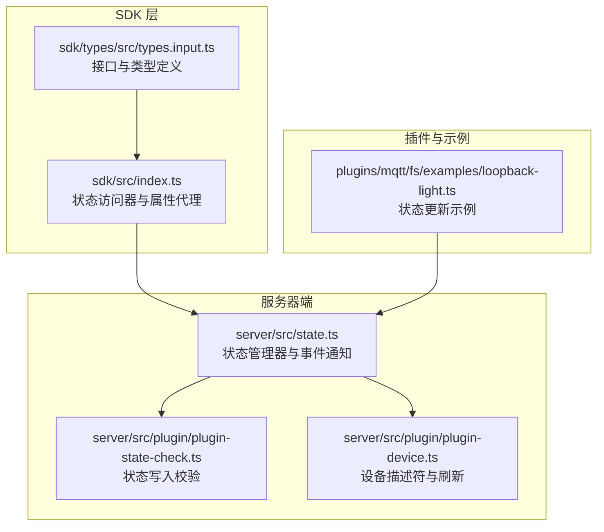
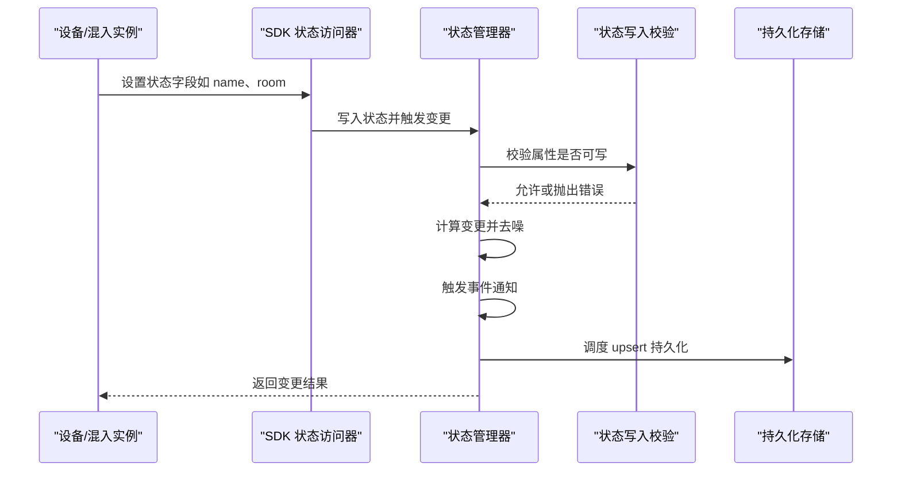
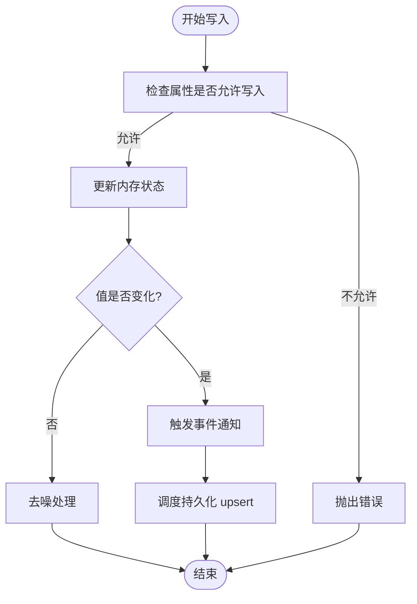
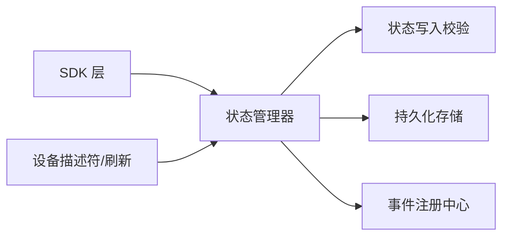

# 设备状态管理 API

<cite>
**本文引用的文件**
- [server/src/state.ts](file://server/src/state.ts)
- [server/src/plugin/plugin-state-check.ts](file://server/src/plugin/plugin-state-check.ts)
- [server/src/plugin/plugin-device.ts](file://server/src/plugin/plugin-device.ts)
- [sdk/types/src/types.input.ts](file://sdk/types/src/types.input.ts)
- [sdk/src/index.ts](file://sdk/src/index.ts)
- [plugins/mqtt/fs/examples/loopback-light.ts](file://plugins/mqtt/fs/examples/loopback-light.ts)
</cite>

## 目录
1. [简介](#简介)
2. [项目结构](#项目结构)
3. [核心组件](#核心组件)
4. [架构总览](#架构总览)
5. [详细组件分析](#详细组件分析)
6. [依赖关系分析](#依赖关系分析)
7. [性能考量](#性能考量)
8. [故障排查指南](#故障排查指南)
9. [结论](#结论)
10. [附录](#附录)

## 简介
本文件为 Scrypted 设备状态管理 API 的权威参考文档，聚焦以下主题：
- 设备状态的读取、写入与监听
- WritableDeviceState 接口的属性与方法语义
- 状态变更通知、状态持久化与状态同步机制
- 设备状态生命周期管理、状态校验与回滚策略
- 实际使用示例与最佳实践（含并发控制与性能优化）

## 项目结构
围绕设备状态管理的关键代码分布在以下模块：
- 服务器端状态管理：负责状态写入、事件通知、持久化与刷新节流
- 插件侧状态校验：限制不可写字段与禁止设置的属性值
- SDK 层状态访问器：为设备与混入提供统一的状态读写入口
- 示例脚本：演示状态更新与事件上报的完整流程

**图表来源**
- [sdk/src/index.ts:170-297](file://sdk/src/index.ts#L170-L297)
- [sdk/types/src/types.input.ts:1198-1270](file://sdk/types/src/types.input.ts#L1198-L1270)
- [server/src/state.ts:10-287](file://server/src/state.ts#L10-L287)
- [server/src/plugin/plugin-state-check.ts:1-24](file://server/src/plugin/plugin-state-check.ts#L1-L24)
- [server/src/plugin/plugin-device.ts:340-486](file://server/src/plugin/plugin-device.ts#L340-L486)
- [plugins/mqtt/fs/examples/loopback-light.ts](file://plugins/mqtt/fs/examples/loopback-light.ts)

**章节来源**
- [sdk/src/index.ts:170-297](file://sdk/src/index.ts#L170-L297)
- [sdk/types/src/types.input.ts:1198-1270](file://sdk/types/src/types.input.ts#L1198-L1270)
- [server/src/state.ts:10-287](file://server/src/state.ts#L10-L287)
- [server/src/plugin/plugin-state-check.ts:1-24](file://server/src/plugin/plugin-state-check.ts#L1-L24)
- [server/src/plugin/plugin-device.ts:340-486](file://server/src/plugin/plugin-device.ts#L340-L486)
- [plugins/mqtt/fs/examples/loopback-light.ts](file://plugins/mqtt/fs/examples/loopback-light.ts)

## 核心组件
- 状态管理器（ScryptedStateManager）
  - 负责状态写入、事件通知、去噪、刷新节流与持久化调度
  - 提供系统级状态查询与设备级监听能力
- 状态写入校验（checkProperty）
  - 限制只读字段与非法属性设置，确保状态一致性
- 设备状态访问器（SDK）
  - 通过属性代理暴露设备状态字段的读写
  - 支持混入场景下的状态拦截与转发
- 设备描述符与刷新（PluginDevice）
  - 更新设备描述符信息并触发状态同步
  - 统一管理 Refresh 接口的用户发起与周期性刷新

**章节来源**
- [server/src/state.ts:10-287](file://server/src/state.ts#L10-L287)
- [server/src/plugin/plugin-state-check.ts:5-23](file://server/src/plugin/plugin-state-check.ts#L5-L23)
- [sdk/src/index.ts:170-204](file://sdk/src/index.ts#L170-L204)
- [server/src/plugin/plugin-device.ts:340-486](file://server/src/plugin/plugin-device.ts#L340-L486)

## 架构总览
下图展示了从插件/脚本到服务器端状态管理的整体调用链路与职责分工。

**图表来源**
- [sdk/src/index.ts:170-204](file://sdk/src/index.ts#L170-L204)
- [server/src/state.ts:102-119](file://server/src/state.ts#L102-L119)
- [server/src/plugin/plugin-state-check.ts:5-23](file://server/src/plugin/plugin-state-check.ts#L5-L23)

## 详细组件分析

### WritableDeviceState 接口与属性
- 定义位置与职责
  - 在接口中声明了获取设备状态对象与创建可写状态对象的能力，用于在混入与派生场景中拦截状态写入
- 关键方法
  - getDeviceState(nativeId?): 获取由系统维护的设备状态对象，对其属性赋值会触发状态更新
  - createDeviceState(id, setState): 创建一个拦截器，所有写入都会通过回调进行处理，便于混入与分叉场景的状态隔离与转发
- 与 ScryptedInterfaceProperty 的关系
  - SDK 层通过属性代理将 ScryptedInterfaceProperty 的字段映射为可读写的属性，例如 name、room、type 等

**章节来源**
- [sdk/types/src/types.input.ts:1214-1222](file://sdk/types/src/types.input.ts#L1214-L1222)
- [sdk/src/index.ts:170-204](file://sdk/src/index.ts#L170-L204)

### 状态写入与变更通知
- 写入路径
  - 插件/脚本通过 SDK 的属性代理写入状态
  - SDK 将写入委托给状态管理器
  - 状态管理器执行校验、计算变更、去噪与事件通知
- 变更判定
  - 使用值相等性判断（支持深拷贝后的 JSON 字符串比较），仅当值发生变化时才标记 changed 并触发通知
- 去噪机制
  - 监听器支持 denoise 选项，避免重复数据导致的无效回调

**图表来源**
- [server/src/state.ts:269-286](file://server/src/state.ts#L269-L286)
- [server/src/state.ts:176-191](file://server/src/state.ts#L176-L191)

**章节来源**
- [server/src/state.ts:102-119](file://server/src/state.ts#L102-L119)
- [server/src/state.ts:176-191](file://server/src/state.ts#L176-L191)
- [server/src/state.ts:269-286](file://server/src/state.ts#L269-L286)

### 状态持久化与同步
- 持久化策略
  - 状态变更后加入 upsert 队列，使用节流器批量写入数据库，降低频繁 IO
- 同步机制
  - 当设备描述符（如 name、room、type）发生变更时，通过更新描述符触发全量状态同步
- 系统状态查询
  - 提供系统级状态快照接口，返回所有设备的状态映射

**章节来源**
- [server/src/state.ts:12-30](file://server/src/state.ts#L12-L30)
- [server/src/state.ts:121-123](file://server/src/state.ts#L121-L123)
- [server/src/state.ts:144-150](file://server/src/state.ts#L144-L150)

### 设备状态生命周期管理
- 生命周期阶段
  - 发现与注册：通过 onDeviceDiscovered 或 onDevicesChanged 报告设备
  - 运行期状态变更：通过 WritableDeviceState 写入并触发通知
  - 刷新与轮询：实现 Refresh 接口，由状态管理器统一调度
  - 移除与清理：通过 onDeviceRemoved 报告移除并清理相关资源
- 刷新节流
  - 用户主动刷新与周期性刷新合并，避免并发冲突
  - 支持根据设备刷新频率动态调整轮询间隔

**章节来源**
- [sdk/types/src/types.input.ts:1246-1264](file://sdk/types/src/types.input.ts#L1246-L1264)
- [server/src/state.ts:193-255](file://server/src/state.ts#L193-L255)

### 状态验证与回滚
- 状态验证
  - 禁止写入只读字段（如 id、nativeId、mixins、interfaces）
  - 禁止直接修改设备描述符中的非 info 字段，需通过设备管理器接口进行
  - 禁止写入 RPC 代理对象
- 回滚策略
  - 当前实现未提供显式回滚 API；建议在业务层对状态变更进行幂等与可逆设计，必要时在写入前缓存旧值并在失败时恢复

**章节来源**
- [server/src/plugin/plugin-state-check.ts:5-23](file://server/src/plugin/plugin-state-check.ts#L5-L23)

### 监听与事件模型
- 监听器注册
  - 支持按事件类型、去噪与轮询模式注册监听
  - 对实现 Refresh 接口的设备，自动进行周期性轮询
- 事件细节
  - 事件携带时间戳、接口标识、属性名与 mixinId 等上下文信息
  - 支持混入事件的掩蔽与透传逻辑

**章节来源**
- [server/src/state.ts:152-191](file://server/src/state.ts#L152-L191)
- [server/src/state.ts:49-76](file://server/src/state.ts#L49-L76)

### 实际示例：状态更新与事件上报
- 示例脚本
  - 通过设置设备状态字段触发状态更新
  - 状态更新会被上报至系统并更新设备状态
- 使用要点
  - 确保设备已通过发现流程被系统识别
  - 使用 WritableDeviceState 或 SDK 属性代理进行状态写入
  - 如涉及刷新类属性，实现 Refresh 接口并合理设置刷新频率

**章节来源**
- [plugins/mqtt/fs/examples/loopback-light.ts](file://plugins/mqtt/fs/examples/loopback-light.ts)

## 依赖关系分析
- 组件耦合
  - SDK 层通过接口定义与状态访问器与服务器端解耦
  - 服务器端状态管理器依赖事件注册中心与设备描述符映射
- 外部依赖
  - 使用节流工具对 upsert 操作进行批处理
  - 通过设备日志器输出状态变更日志

**图表来源**
- [sdk/src/index.ts:170-204](file://sdk/src/index.ts#L170-L204)
- [server/src/state.ts:10-35](file://server/src/state.ts#L10-L35)
- [server/src/plugin/plugin-device.ts:340-354](file://server/src/plugin/plugin-device.ts#L340-L354)

**章节来源**
- [sdk/src/index.ts:170-204](file://sdk/src/index.ts#L170-L204)
- [server/src/state.ts:10-35](file://server/src/state.ts#L10-L35)
- [server/src/plugin/plugin-device.ts:340-354](file://server/src/plugin/plugin-device.ts#L340-L354)

## 性能考量
- 批处理与节流
  - upsert 操作采用 30 秒节流窗口，减少数据库写入压力
- 去噪与事件过滤
  - 监听器支持去噪，避免重复事件导致的无效处理
- 刷新调度
  - 合并用户主动刷新与周期性刷新，避免并发冲突
  - 根据设备刷新频率动态调整轮询间隔

**章节来源**
- [server/src/state.ts:12-30](file://server/src/state.ts#L12-L30)
- [server/src/state.ts:176-191](file://server/src/state.ts#L176-L191)
- [server/src/state.ts:193-255](file://server/src/state.ts#L193-L255)

## 故障排查指南
- 现象：写入状态时报错“设备状态不可用”
  - 原因：设备尚未通过发现流程被系统识别
  - 处理：先调用设备管理器的发现接口，再进行状态写入
- 现象：写入某些字段报错“只读”
  - 原因：尝试修改只读或受保护字段
  - 处理：通过设备管理器提供的接口更新描述符信息
- 现象：状态未持久化或未同步
  - 原因：upsert 节流窗口未触发或设备已被删除
  - 处理：等待节流窗口到期或确认设备存在；必要时手动触发持久化
- 现象：刷新不生效或过于频繁
  - 原因：刷新频率设置不当或用户主动刷新与周期刷新冲突
  - 处理：调整设备刷新频率；避免同时发起多次刷新请求

**章节来源**
- [sdk/src/index.ts:182-188](file://sdk/src/index.ts#L182-L188)
- [server/src/plugin/plugin-state-check.ts:5-23](file://server/src/plugin/plugin-state-check.ts#L5-L23)
- [server/src/state.ts:12-30](file://server/src/state.ts#L12-L30)
- [server/src/state.ts:193-255](file://server/src/state.ts#L193-L255)

## 结论
Scrypted 的设备状态管理 API 通过清晰的接口边界与严格的写入校验，提供了可靠的状态读写、事件通知与持久化能力。配合去噪、节流与刷新调度机制，可在保证一致性的同时兼顾性能与用户体验。实际开发中应遵循只读字段限制、使用 WritableDeviceState 或 SDK 属性代理进行状态写入，并在需要时实现 Refresh 接口以支持周期性同步。

## 附录
- 最佳实践
  - 使用 WritableDeviceState 或 SDK 属性代理进行状态写入
  - 对可能引发大量变更的场景启用去噪与节流
  - 对刷新类属性实现 Refresh 接口并合理设置刷新频率
  - 在业务层对关键状态变更进行幂等与可逆设计，必要时缓存旧值以便回滚