# 设备管理 API

<cite>
**本文引用的文件**
- [types.input.ts](file://sdk/types/src/types.input.ts)
- [device.ts](file://server/src/plugin/device.ts)
- [system.ts](file://server/src/plugin/system.ts)
- [endpoint.ts](file://server/src/plugin/endpoint.ts)
- [media.ts](file://server/src/plugin/media.ts)
- [plugin_remote.py](file://server/python/plugin_remote.py)
- [devices.ts](file://common/src/devices.ts)
- [types.py](file://sdk/types/scrypted_python/scrypted_sdk/types.py)
</cite>

## 目录
1. [简介](#简介)
2. [项目结构](#项目结构)
3. [核心组件](#核心组件)
4. [架构总览](#架构总览)
5. [详细组件分析](#详细组件分析)
6. [依赖关系分析](#依赖关系分析)
7. [性能考量](#性能考量)
8. [故障排查指南](#故障排查指南)
9. [结论](#结论)
10. [附录](#附录)

## 简介
本文件为 Scrypted 设备管理 API 的权威参考文档，覆盖以下关键能力：
- 设备发现与注册：DeviceManager 提供 onDeviceDiscovered、onDevicesChanged、onDeviceRemoved 等方法，支持按需发现与全量同步。
- 设备状态管理：DeviceManager 提供 getDeviceState/createDeviceState，SystemManager 提供 getSystemState/getDeviceById，支持状态读取、写入与监听。
- 设备事件处理：DeviceManager 提供 onDeviceEvent/onMixinEvent，SystemManager 提供 listen/listenDevice，支持被动监听与事件订阅。
- 生命周期管理：SystemManager 提供 removeDevice；DeviceManager 提供 requestRestart。
- 网络端点管理：EndpointManager 提供 getPath/getLocalEndpoint/getCloudEndpoint 等，用于生成本地/云端/推送端点 URL，并支持跨域配置。
- 媒体对象管理：MediaManager 提供 createMediaObject/createFFmpegMediaObject/convertMediaObject* 等，统一媒体对象创建、转换与 URL 化。

## 项目结构
围绕设备管理 API 的核心实现分布在以下模块：
- 类型定义：sdk/types/src/types.input.ts 定义了 DeviceManager、SystemManager、EndpointManager、MediaManager 等接口契约。
- 服务端实现：server/src/plugin 下的 device.ts、system.ts、endpoint.ts、media.ts 提供具体实现。
- Python SDK 适配：server/python/plugin_remote.py 与 sdk/types/scrypted_python/scrypted_sdk/types.py 提供 Python 环境下的适配层。

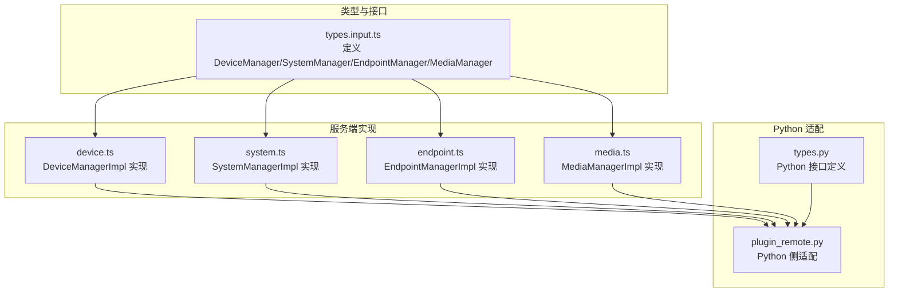

**图表来源**
- [types.input.ts](file://sdk/types/src/types.input.ts)
- [device.ts](file://server/src/plugin/device.ts)
- [system.ts](file://server/src/plugin/system.ts)
- [endpoint.ts](file://server/src/plugin/endpoint.ts)
- [media.ts](file://server/src/plugin/media.ts)
- [plugin_remote.py](file://server/python/plugin_remote.py)
- [types.py](file://sdk/types/scrypted_python/scrypted_sdk/types.py)

**章节来源**
- [types.input.ts](file://sdk/types/src/types.input.ts)
- [device.ts](file://server/src/plugin/device.ts)
- [system.ts](file://server/src/plugin/system.ts)
- [endpoint.ts](file://server/src/plugin/endpoint.ts)
- [media.ts](file://server/src/plugin/media.ts)
- [plugin_remote.py](file://server/python/plugin_remote.py)
- [types.py](file://sdk/types/scrypted_python/scrypted_sdk/types.py)

## 核心组件
本节对四大核心接口进行要点梳理与使用指引。

- DeviceManager（设备管理）
  - 职责：上报新设备、设备变更、设备移除；维护设备状态代理；提供存储与日志；触发重启。
  - 关键方法：onDeviceDiscovered、onDevicesChanged、onDeviceRemoved、onDeviceEvent、onMixinEvent、getDeviceState、createDeviceState、getDeviceStorage、requestRestart。
  - 使用场景：设备发现（按需）、Hub 同步（全量）、事件上报、状态读写代理。

- SystemManager（系统管理）
  - 职责：查询系统状态、按 id/name 查找设备、被动监听事件、移除设备。
  - 关键方法：getSystemState、getDeviceById、getDeviceByName、listen、listenDevice、removeDevice、getComponent。
  - 使用场景：脚本/插件侧查询设备状态、订阅事件、动态移除设备。

- EndpointManager（端点管理）
  - 职责：生成本地/云端/推送端点 URL；设置本地地址白名单；配置跨域。
  - 关键方法：getPath、getLocalEndpoint、getCloudEndpoint、getCloudPushEndpoint、setLocalAddresses、getLocalAddresses、setAccessControlAllowOrigin。
  - 使用场景：对外暴露 Webhook/Push/本地访问端点。

- MediaManager（媒体管理）
  - 职责：创建媒体对象、转换媒体格式、生成本地/公网 URL。
  - 关键方法：createMediaObject、createFFmpegMediaObject、convertMediaObject、convertMediaObjectToUrl、convertMediaObjectToLocalUrl、convertMediaObjectToBuffer、getFFmpegPath、getFilesPath。
  - 使用场景：图片/视频/流媒体的统一抽象与跨格式转换。

**章节来源**
- [types.input.ts](file://sdk/types/src/types.input.ts)
- [device.ts](file://server/src/plugin/device.ts)
- [system.ts](file://server/src/plugin/system.ts)
- [endpoint.ts](file://server/src/plugin/endpoint.ts)
- [media.ts](file://server/src/plugin/media.ts)

## 架构总览
下图展示了设备管理 API 在服务端的调用链路与职责划分：

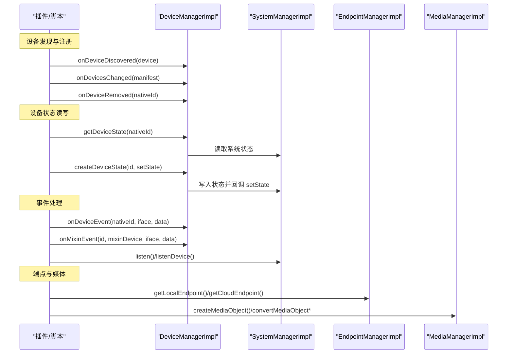

**图表来源**
- [device.ts](file://server/src/plugin/device.ts)
- [system.ts](file://server/src/plugin/system.ts)
- [endpoint.ts](file://server/src/plugin/endpoint.ts)
- [media.ts](file://server/src/plugin/media.ts)

## 详细组件分析

### DeviceManager 组件分析
- 设计要点
  - 通过 Proxy 将设备状态读写映射到系统状态，保证一致性与可观测性。
  - 提供设备存储与 mixin 存储，支持命名空间隔离。
  - 事件上报采用异步 RPC 调用，避免阻塞。
- 关键流程
  - 状态代理：getDeviceState 返回可写代理，赋值时写入系统状态并调用 setState 回调。
  - 设备上报：onDeviceDiscovered/onDevicesChanged/onDeviceRemoved 由插件调用，最终通过 RPC 同步至系统。
  - 事件上报：onDeviceEvent/onMixinEvent 将事件广播给系统与监听者。

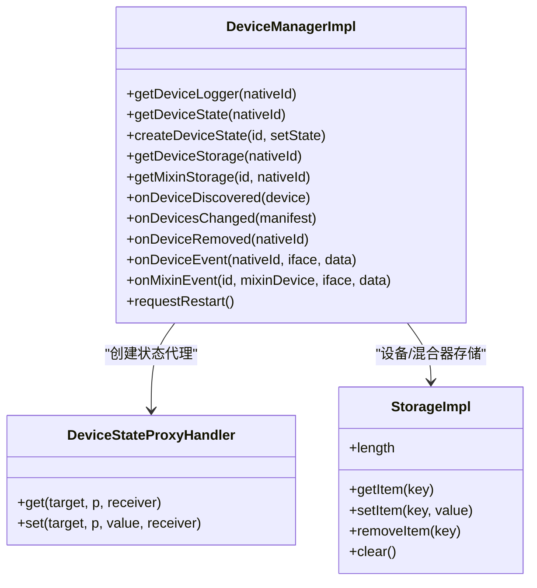

**图表来源**
- [device.ts](file://server/src/plugin/device.ts)

**章节来源**
- [device.ts](file://server/src/plugin/device.ts)
- [types.input.ts](file://sdk/types/src/types.input.ts)

### SystemManager 组件分析
- 设计要点
  - 通过接口描述符与属性映射，动态代理设备实例，屏蔽底层 RPC 细节。
  - 支持被动监听（watch）与主动监听（RPC），降低轮询开销。
- 关键流程
  - 设备代理：getDeviceById 返回可直接调用接口方法的代理对象。
  - 事件监听：listen/listenDevice 注册回调，系统事件通过回调分发。

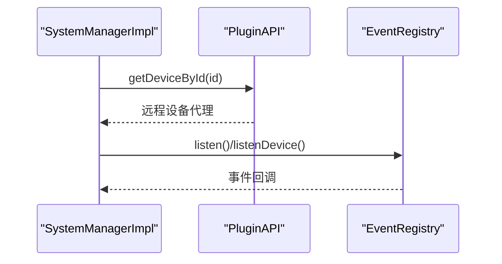

**图表来源**
- [system.ts](file://server/src/plugin/system.ts)

**章节来源**
- [system.ts](file://server/src/plugin/system.ts)
- [types.input.ts](file://sdk/types/src/types.input.ts)

### EndpointManager 组件分析
- 设计要点
  - 以插件或设备 nativeId 为路径段，统一生成相对路径，再拼接协议/IP/端口形成完整 URL。
  - 云端端点通过 MediaManager 将本地 URL 转换为公网可访问 URL。
  - 支持设置本地地址白名单与跨域头。
- 关键流程
  - getLocalEndpoint：根据 insecure/public 选项选择 http/https 与端口。
  - getCloudEndpoint：先生成本地 URL，再经 MediaManager 转换为公网 URL。
  - getCloudPushEndpoint：将端点标识转换为 PushEndpoint URL。

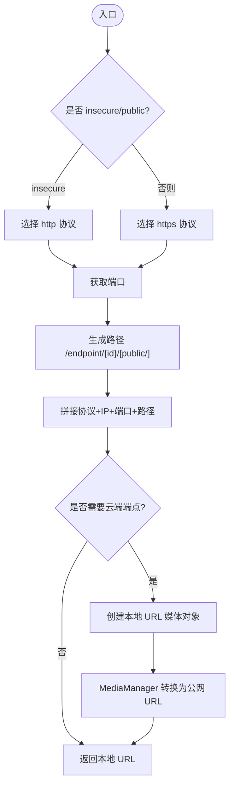

**图表来源**
- [endpoint.ts](file://server/src/plugin/endpoint.ts)
- [media.ts](file://server/src/plugin/media.ts)

**章节来源**
- [endpoint.ts](file://server/src/plugin/endpoint.ts)
- [media.ts](file://server/src/plugin/media.ts)
- [types.input.ts](file://sdk/types/src/types.input.ts)

### MediaManager 组件分析
- 设计要点
  - 通过内置与系统/插件提供的转换器构建有向加权图，使用 Dijkstra 最短路算法寻找最优转换链。
  - 支持从 URL、文件、FFmpeg 输入等多源创建 MediaObject，并统一转换为 Buffer/URL/JSON。
- 关键流程
  - createMediaObject/createFFmpegMediaObject：封装数据与 MIME 类型，生成 MediaObject。
  - convertMediaObject*：解析目标 MIME，查找转换链，执行转换并返回结果。
  - getFFmpegPath/getFilesPath：提供工具路径与文件目录。

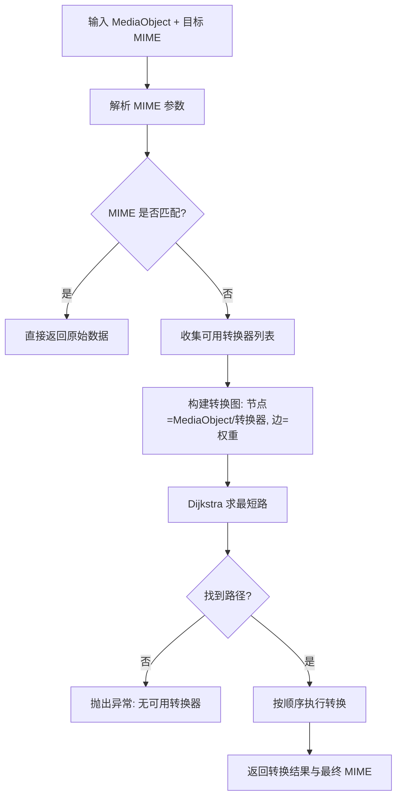

**图表来源**
- [media.ts](file://server/src/plugin/media.ts)

**章节来源**
- [media.ts](file://server/src/plugin/media.ts)
- [types.input.ts](file://sdk/types/src/types.input.ts)

### 设备状态管理 API
- 状态读取
  - SystemManager.getSystemState：获取所有设备的状态快照。
  - DeviceManager.getDeviceState：获取指定设备的状态代理，支持读取属性值。
- 状态写入
  - 通过状态代理赋值触发写入，内部写入系统状态并回调 setState。
  - DeviceManager.createDeviceState：创建仅捕获写入的代理，用于 mixin/fork 场景。
- 状态监听
  - SystemManager.listen/listenDevice：被动监听属性变化与事件。
  - 设备代理 ownKeys/getOwnPropertyDescriptor：基于接口描述符动态暴露属性与方法。

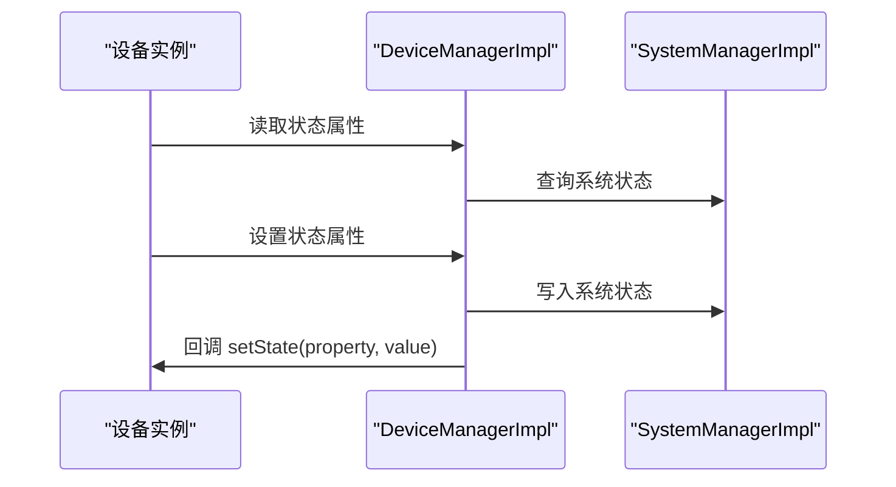

**图表来源**
- [device.ts](file://server/src/plugin/device.ts)
- [system.ts](file://server/src/plugin/system.ts)

**章节来源**
- [device.ts](file://server/src/plugin/device.ts)
- [system.ts](file://server/src/plugin/system.ts)
- [types.input.ts](file://sdk/types/src/types.input.ts)

### 设备生命周期管理 API
- 设备创建与注册
  - DeviceDiscovery.discoverDevices/adoptDevice：发现与领养设备。
  - DeviceManager.onDeviceDiscovered/onDevicesChanged：上报新设备或全量同步。
- 设备删除
  - DeviceManager.onDeviceRemoved：上报移除。
  - SystemManager.removeDevice：脚本侧请求移除（插件建议使用 onDevicesChanged/onDeviceRemoved）。
- 插件重启
  - DeviceManager.requestRestart：请求重启插件进程。

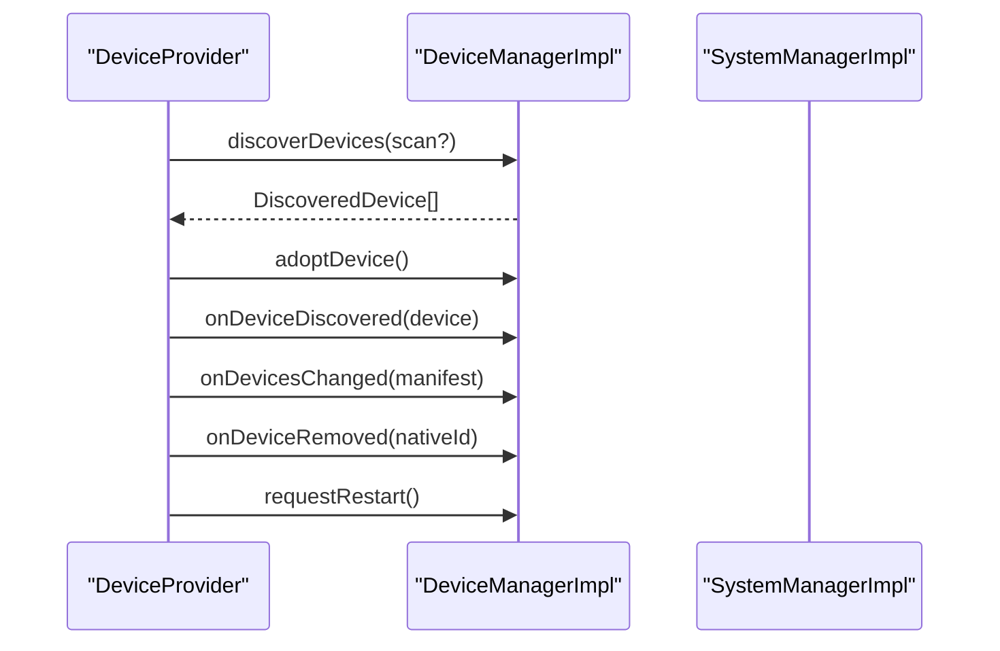

**图表来源**
- [types.input.ts](file://sdk/types/src/types.input.ts)
- [device.ts](file://server/src/plugin/device.ts)

**章节来源**
- [types.input.ts](file://sdk/types/src/types.input.ts)
- [device.ts](file://server/src/plugin/device.ts)

### 网络端点管理 API
- 端点生成
  - getPath：生成相对路径。
  - getLocalEndpoint：生成本地 HTTPS/HTTP URL。
  - getCloudEndpoint：生成公网可访问 URL。
  - getCloudPushEndpoint：生成推送端点 URL。
- 配置管理
  - setLocalAddresses/getLocalAddresses：设置/获取本地地址白名单。
  - setAccessControlAllowOrigin：设置跨域允许来源。

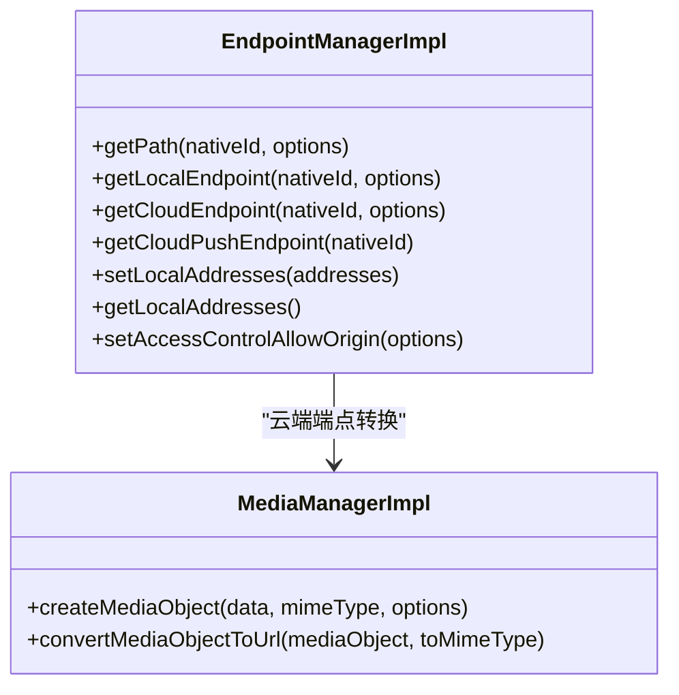

**图表来源**
- [endpoint.ts](file://server/src/plugin/endpoint.ts)
- [media.ts](file://server/src/plugin/media.ts)

**章节来源**
- [endpoint.ts](file://server/src/plugin/endpoint.ts)
- [media.ts](file://server/src/plugin/media.ts)
- [types.input.ts](file://sdk/types/src/types.input.ts)

### 媒体对象管理 API
- 对象创建
  - createMediaObject：从任意数据创建媒体对象。
  - createFFmpegMediaObject：从 FFmpeg 输入参数创建媒体对象。
  - createMediaObjectFromUrl：从 URL 动态推断 MIME 并创建媒体对象。
- 对象转换
  - convertMediaObject：转换为任意类型（Buffer/JSON/RPC 对象）。
  - convertMediaObjectToBuffer/convertMediaObjectToUrl/convertMediaObjectToLocalUrl：输出特定用途的二进制或 URL。
- 工具与路径
  - getFFmpegPath：获取系统 FFmpeg 路径。
  - getFilesPath：获取插件文件存储目录。

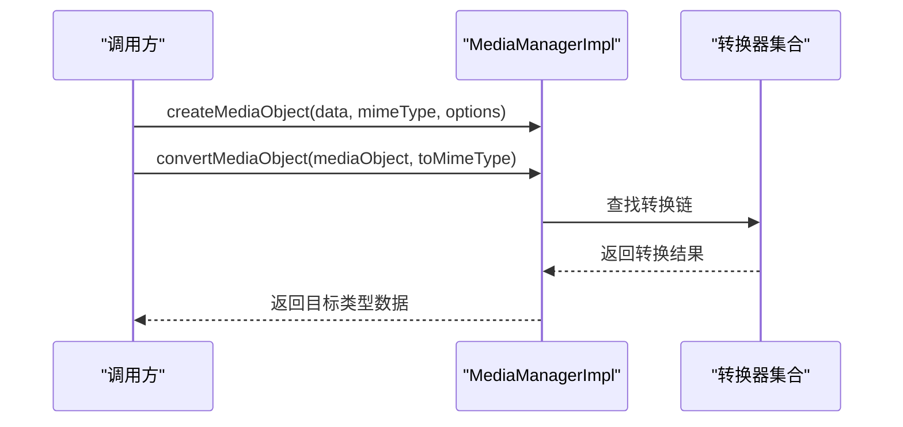

**图表来源**
- [media.ts](file://server/src/plugin/media.ts)

**章节来源**
- [media.ts](file://server/src/plugin/media.ts)
- [types.input.ts](file://sdk/types/src/types.input.ts)

## 依赖关系分析
- 接口耦合
  - DeviceManagerImpl 依赖 SystemManagerImpl 读写系统状态；依赖 PluginAPI 发起 RPC 调用。
  - EndpointManagerImpl 依赖 MediaManagerImpl 进行 URL 转换；依赖系统组件获取端口/IP。
  - MediaManagerImpl 依赖系统状态枚举 BufferConverter/MediaConverter 设备，动态构建转换图。
- 外部依赖
  - Python 适配层通过 RPC 对象桥接 Node 与 Python 环境，保持接口一致。
  - 媒体转换依赖 Dijkstra 算法与 MIME 解析库，确保路径最优与类型安全。

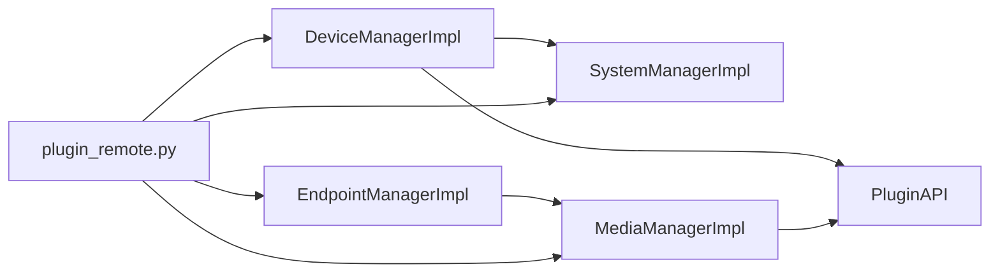

**图表来源**
- [device.ts](file://server/src/plugin/device.ts)
- [system.ts](file://server/src/plugin/system.ts)
- [endpoint.ts](file://server/src/plugin/endpoint.ts)
- [media.ts](file://server/src/plugin/media.ts)
- [plugin_remote.py](file://server/python/plugin_remote.py)

**章节来源**
- [device.ts](file://server/src/plugin/device.ts)
- [system.ts](file://server/src/plugin/system.ts)
- [endpoint.ts](file://server/src/plugin/endpoint.ts)
- [media.ts](file://server/src/plugin/media.ts)
- [plugin_remote.py](file://server/python/plugin_remote.py)

## 性能考量
- 异步与事件驱动
  - 所有状态写入与事件上报均为异步，避免阻塞主线程。
  - listen/watch 模式减少轮询，降低系统负载。
- 转换链优化
  - MediaManager 使用带权重的转换图，优先选择轻量/高效转换器，避免不必要的中间格式。
  - 内置转换器优先，系统/插件转换器次之，额外转换器最后，防止不稳定插件影响系统稳定性。
- 存储与清理
  - StorageImpl 采用惰性持久化策略，仅在值变化时写回；Mixin 存储定期清理不可达键。
- 端点生成
  - 本地端点直接拼接协议/IP/端口；云端端点通过 MediaManager 缓存转换结果，减少重复计算。

[本节为通用指导，无需列出具体文件来源]

## 故障排查指南
- 设备未显示或状态不更新
  - 检查是否正确调用 onDeviceDiscovered/onDevicesChanged/onDeviceRemoved。
  - 使用 SystemManager.getSystemState 校验状态是否写入成功。
  - 通过 SystemManager.listen/listenDevice 验证事件是否到达。
- 端点无法访问
  - 确认 getLocalEndpoint/getCloudEndpoint 的 insecure/public 选项与网络环境匹配。
  - 检查 setLocalAddresses/setAccessControlAllowOrigin 配置是否正确。
  - 若为 IPv6，请确认 URL 中已使用方括号包裹。
- 媒体转换失败
  - 检查 toMimeType 是否存在对应转换器；查看 getConverters 输出。
  - 确认 FFmpeg 可用（getFFmpegPath）与文件路径（getFilesPath）权限。
- 日志与调试
  - 使用 DeviceManager.getDeviceLogger 获取设备级日志器，或通过 getDeviceConsole/getMixinConsole 获取控制台。
  - Python 环境可通过 plugin_remote.py 中的 SDK 初始化与日志钩子定位问题。

**章节来源**
- [device.ts](file://server/src/plugin/device.ts)
- [system.ts](file://server/src/plugin/system.ts)
- [endpoint.ts](file://server/src/plugin/endpoint.ts)
- [media.ts](file://server/src/plugin/media.ts)
- [plugin_remote.py](file://server/python/plugin_remote.py)

## 结论
Scrypted 的设备管理 API 通过清晰的接口边界与强大的服务端实现，提供了从设备发现、状态管理、事件处理到端点与媒体管理的完整能力。其异步与事件驱动的设计兼顾了易用性与性能，适合在复杂生态中稳定扩展。建议在插件开发中遵循：
- 使用 onDevicesChanged 进行 Hub 全量同步，onDeviceDiscovered 进行按需发现。
- 通过状态代理与监听机制实现低耦合的状态管理。
- 利用 MediaManager 的转换链与 EndpointManager 的端点生成，快速构建对外服务。

[本节为总结性内容，无需列出具体文件来源]

## 附录

### 实际使用示例（路径索引）
- 设备发现与同步
  - [discoverDevices 示例:256-318](file://plugins/remote/src/main.ts#L256-L318)
- 状态读取与写入
  - [getDeviceState 代理读取:105-109](file://server/src/plugin/device.ts#L105-L109)
  - [状态写入回调 setState:71-78](file://server/src/plugin/device.ts#L71-L78)
- 事件监听
  - [SystemManager.listen/listenDevice:216-227](file://server/src/plugin/system.ts#L216-L227)
- 端点生成
  - [getLocalEndpoint/getCloudEndpoint:75-87](file://server/src/plugin/endpoint.ts#L75-L87)
- 媒体对象转换
  - [convertMediaObjectToUrl:274-279](file://server/src/plugin/media.ts#L274-L279)

**章节来源**
- [device.ts](file://server/src/plugin/device.ts)
- [system.ts](file://server/src/plugin/system.ts)
- [endpoint.ts](file://server/src/plugin/endpoint.ts)
- [media.ts](file://server/src/plugin/media.ts)
- [plugin_remote.py](file://server/python/plugin_remote.py)
- [devices.ts](file://common/src/devices.ts)