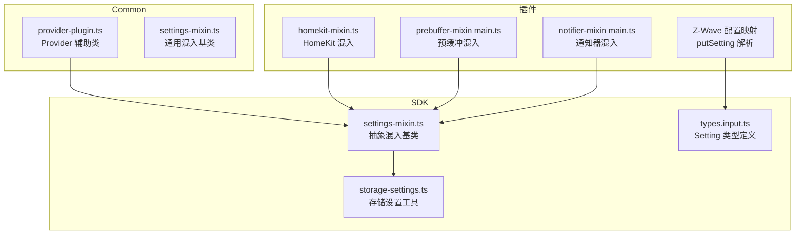
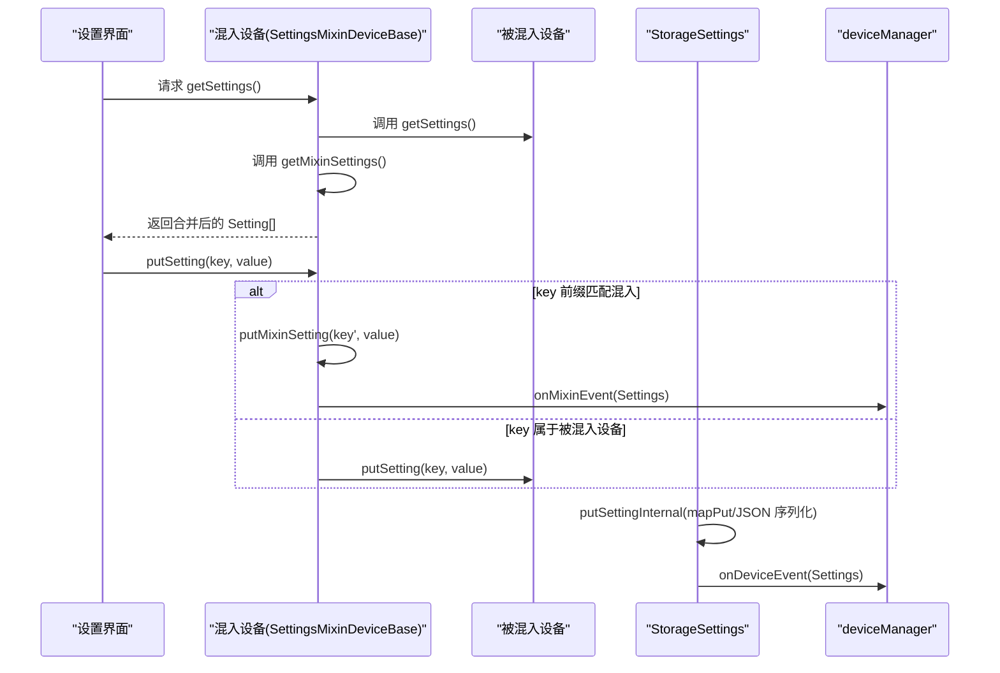
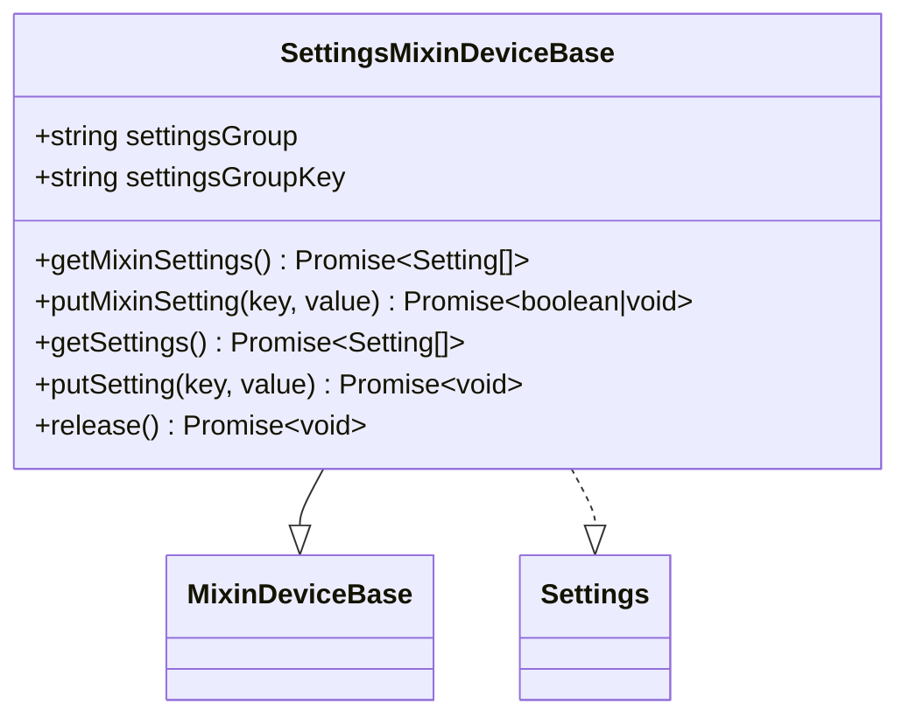
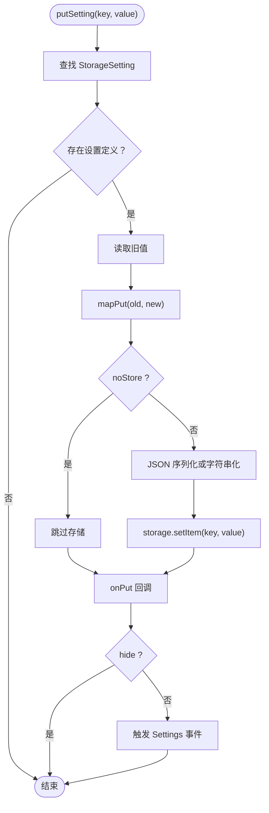
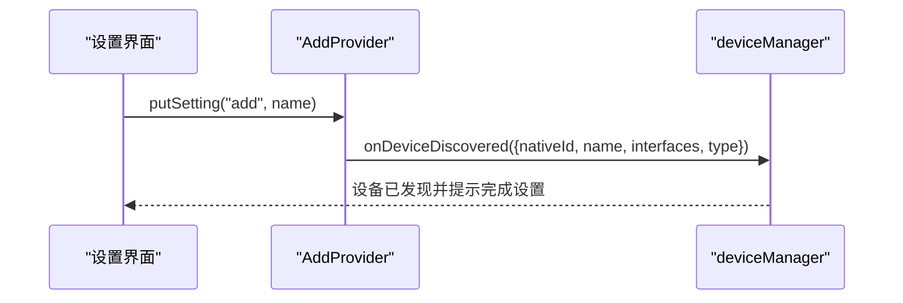
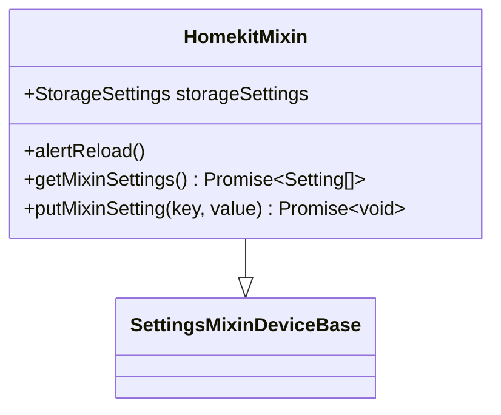
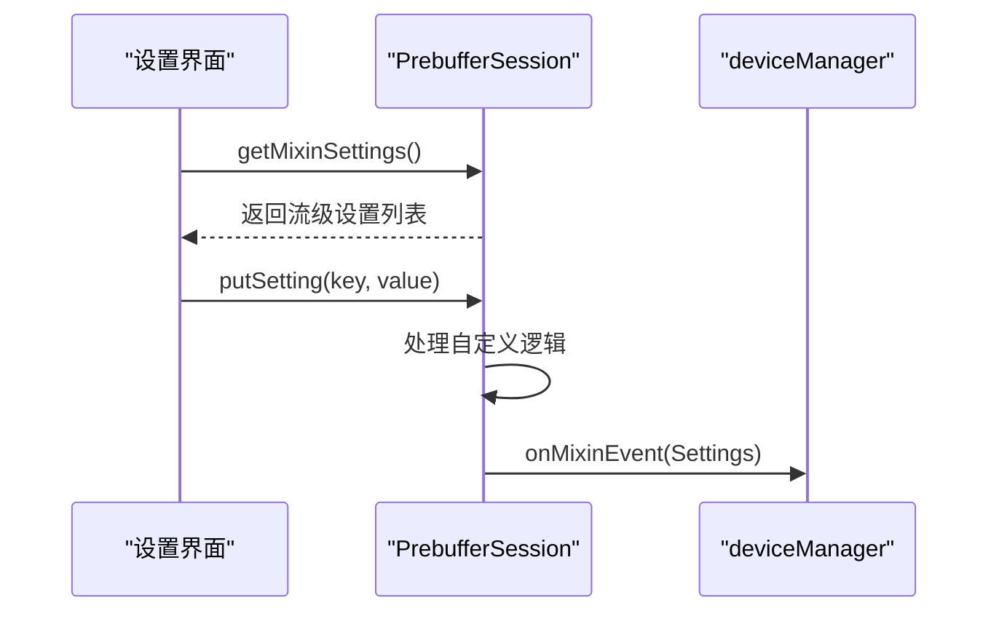
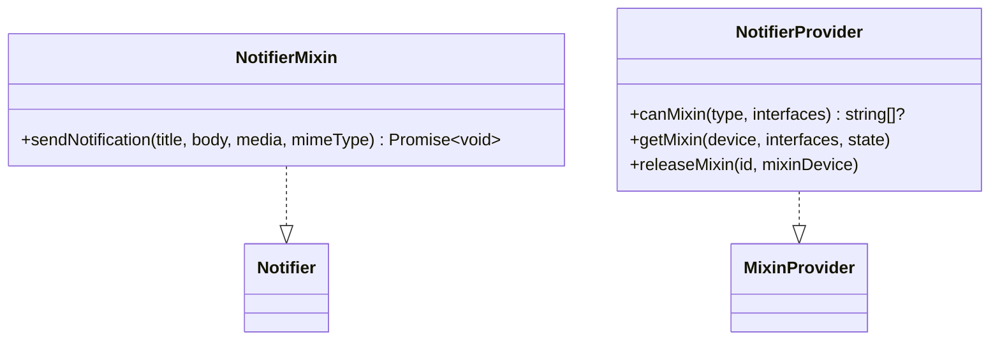
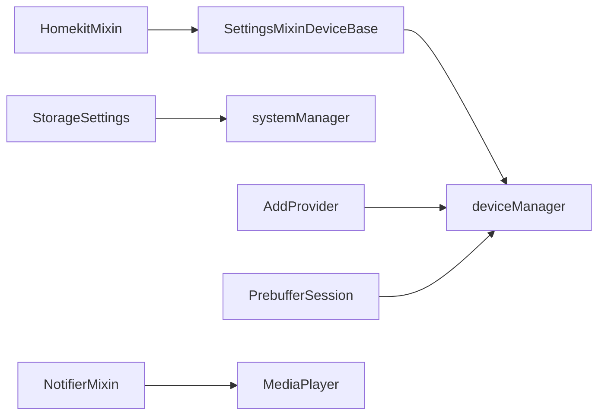

# 设置与混入 API

<cite>
**本文引用的文件**
- [settings-mixin.ts（SDK）](file://sdk/src/settings-mixin.ts)
- [settings-mixin.ts（Common）](file://common/src/settings-mixin.ts)
- [storage-settings.ts（SDK）](file://sdk/src/storage-settings.ts)
- [provider-plugin.ts（Common）](file://common/src/provider-plugin.ts)
- [homekit-mixin.ts（HomeKit 插件）](file://plugins/homekit/src/homekit-mixin.ts)
- [prebuffer-mixin main.ts（预缓冲混入）](file://plugins/prebuffer-mixin/src/main.ts)
- [notifier-mixin main.ts（通知器混入）](file://plugins/notifier-mixin/src/main.ts)
- [Z-Wave 配置映射（Z-Wave 插件）](file://plugins/zwave/src/CommandClasses/SettingsToConfiguration.ts)
- [SDK 类型定义 types.input.ts](file://sdk/types/src/types.input.ts)
</cite>

## 目录
1. [简介](#简介)
2. [项目结构](#项目结构)
3. [核心组件](#核心组件)
4. [架构总览](#架构总览)
5. [详细组件分析](#详细组件分析)
6. [依赖关系分析](#依赖关系分析)
7. [性能考量](#性能考量)
8. [故障排查指南](#故障排查指南)
9. [结论](#结论)
10. [附录：配置示例与最佳实践](#附录配置示例与最佳实践)

## 简介
本文件为 Scrypted 的“设置与混入 API”提供权威参考，覆盖以下主题：
- SettingsMixin 接口与混入设备的完整实现要点：配置项定义、验证规则、UI 显示分组、事件通知等
- 设置项类型系统：字符串、数字、布尔值、选择框、密码、设备、数组、日期时间范围、脚本等
- 混入模式：混入设备的创建、配置、状态管理与 UI 同步
- ProviderPlugin 使用：插件发现、设备创建、实例化模式、生命周期管理
- 设置数据持久化：默认值处理、类型解析、变更通知
- 实战示例与最佳实践：复杂设置表单、验证逻辑、UI 行为控制

## 项目结构
围绕设置与混入 API 的关键代码分布在 SDK、Common 工具库与若干插件中：
- SDK 层提供 SettingsMixinDeviceBase 抽象类与 StorageSettings 持久化工具
- Common 层提供 Provider 辅助类与通用混入基类
- 插件层通过继承与组合实现具体混入与 Provider 功能

**图表来源**
- [settings-mixin.ts（SDK）:1-87](file://sdk/src/settings-mixin.ts#L1-L87)
- [storage-settings.ts（SDK）:1-197](file://sdk/src/storage-settings.ts#L1-L197)
- [provider-plugin.ts（Common）:1-99](file://common/src/provider-plugin.ts#L1-L99)
- [homekit-mixin.ts（HomeKit 插件）:1-53](file://plugins/homekit/src/homekit-mixin.ts#L1-L53)
- [prebuffer-mixin main.ts（预缓冲混入）:1-800](file://plugins/prebuffer-mixin/src/main.ts#L1-L800)
- [notifier-mixin main.ts（通知器混入）:1-64](file://plugins/notifier-mixin/src/main.ts#L1-L64)
- [Z-Wave 配置映射（Z-Wave 插件）:18-50](file://plugins/zwave/src/CommandClasses/SettingsToConfiguration.ts#L18-L50)
- [SDK 类型定义 types.input.ts:2315-2365](file://sdk/types/src/types.input.ts#L2315-L2365)

**章节来源**
- [settings-mixin.ts（SDK）:1-87](file://sdk/src/settings-mixin.ts#L1-L87)
- [storage-settings.ts（SDK）:1-197](file://sdk/src/storage-settings.ts#L1-L197)
- [provider-plugin.ts（Common）:1-99](file://common/src/provider-plugin.ts#L1-L99)
- [homekit-mixin.ts（HomeKit 插件）:1-53](file://plugins/homekit/src/homekit-mixin.ts#L1-L53)
- [prebuffer-mixin main.ts（预缓冲混入）:1-800](file://plugins/prebuffer-mixin/src/main.ts#L1-L800)
- [notifier-mixin main.ts（通知器混入）:1-64](file://plugins/notifier-mixin/src/main.ts#L1-L64)
- [Z-Wave 配置映射（Z-Wave 插件）:18-50](file://plugins/zwave/src/CommandClasses/SettingsToConfiguration.ts#L18-L50)
- [SDK 类型定义 types.input.ts:2315-2365](file://sdk/types/src/types.input.ts#L2315-L2365)

## 核心组件
- SettingsMixinDeviceBase：混入设备实现 Settings 接口，聚合来自被混入设备与混入自身设置，并负责设置变更后的事件通知
- StorageSettings：基于 Storage 的设置持久化工具，支持类型解析、默认值、隐藏、过滤器、映射与回调
- ProviderPlugin（AddProvider/InstancedProvider）：提供“添加新设备”的设置入口与实例化模式切换

**章节来源**
- [settings-mixin.ts（SDK）:10-86](file://sdk/src/settings-mixin.ts#L10-L86)
- [storage-settings.ts（SDK）:81-196](file://sdk/src/storage-settings.ts#L81-L196)
- [provider-plugin.ts（Common）:6-98](file://common/src/provider-plugin.ts#L6-L98)

## 架构总览
设置与混入在运行时的交互流程如下：

**图表来源**
- [settings-mixin.ts（SDK）:25-81](file://sdk/src/settings-mixin.ts#L25-L81)
- [storage-settings.ts（SDK）:154-177](file://sdk/src/storage-settings.ts#L154-L177)

**章节来源**
- [settings-mixin.ts（SDK）:25-81](file://sdk/src/settings-mixin.ts#L25-L81)
- [storage-settings.ts（SDK）:154-177](file://sdk/src/storage-settings.ts#L154-L177)

## 详细组件分析

### SettingsMixinDeviceBase 抽象类
- 组合被混入设备与混入自身设置，统一对外暴露 getSettings
- putSetting 根据 groupKey 前缀区分调用路径：混入或被混入设备
- release 时发出 Settings 事件，触发 UI 刷新

**图表来源**
- [settings-mixin.ts（SDK）:10-23](file://sdk/src/settings-mixin.ts#L10-L23)

**章节来源**
- [settings-mixin.ts（SDK）:10-86](file://sdk/src/settings-mixin.ts#L10-L86)
- [settings-mixin.ts（Common）:11-87](file://common/src/settings-mixin.ts#L11-L87)

### StorageSettings 持久化与类型系统
- 支持类型：string、password、number、integer、boolean、device、array、button、clippath、interface、html、textarea、date/time/datetime/day、timerange/daterange/datetimerange、radiobutton/radiopanel、script
- 默认值与持久化默认值：未找到存储值时回退策略
- JSON 解析与映射：mapGet/mapPut、onGet/onPut 回调、deviceFilter 函数序列化
- 隐藏字段：hide 或 options.hide 动态控制显示
- 变更通知：非 hide 字段写入后触发 Settings 事件

**图表来源**
- [storage-settings.ts（SDK）:154-177](file://sdk/src/storage-settings.ts#L154-L177)

**章节来源**
- [storage-settings.ts（SDK）:5-196](file://sdk/src/storage-settings.ts#L5-L196)
- [SDK 类型定义 types.input.ts:2315-2365](file://sdk/types/src/types.input.ts#L2315-L2365)

### ProviderPlugin 与实例化模式
- AddProvider：提供“添加新设备”的设置项，点击后通过 deviceManager.onDeviceDiscovered 发现新设备
- InstancedProvider：实例化 Provider 的包装，支持实例化模式切换
- enableInstanceableProviderMode：迁移现有设备到新的 Provider 下，清空本地存储并标记实例化模式
- createInstanceableProviderPlugin：根据实例化模式返回普通或实例化 Provider

**图表来源**
- [provider-plugin.ts（Common）:17-33](file://common/src/provider-plugin.ts#L17-L33)

**章节来源**
- [provider-plugin.ts（Common）:6-98](file://common/src/provider-plugin.ts#L6-L98)

### 混入设备实现示例

#### HomeKit 混入（HomekitMixin）
- 继承 SettingsMixinDeviceBase，使用 StorageSettings 定义设置字典
- 通过 onPut 在启用独立配件模式时请求重启以应用更改
- 根据 standalone 的开关动态隐藏/显示二维码、配对码等设置

**图表来源**
- [homekit-mixin.ts（HomeKit 插件）:8-52](file://plugins/homekit/src/homekit-mixin.ts#L8-L52)

**章节来源**
- [homekit-mixin.ts（HomeKit 插件）:1-53](file://plugins/homekit/src/homekit-mixin.ts#L1-L53)

#### 预缓冲混入（PrebufferMixin）
- 自定义 getMixinSettings：按流维度生成设置，包含解析器选择、FFmpeg 参数、检测到的编解码信息、URL 等
- putMixinSetting：处理合成流源、区域配置、存储写入等
- 运行时通过 deviceManager.onMixinEvent 触发设置 UI 刷新

**图表来源**
- [prebuffer-mixin main.ts（预缓冲混入）:282-458](file://plugins/prebuffer-mixin/src/main.ts#L282-L458)

**章节来源**
- [prebuffer-mixin main.ts（预缓冲混入）:282-458](file://plugins/prebuffer-mixin/src/main.ts#L282-L458)

#### 通知器混入（NotifierMixin）
- 作为 MixinDeviceBase 实现 Notifier 接口，将文本转音频并播放
- MixinProvider：声明可混入 MediaPlayer 并返回 NotifierMixin

**图表来源**
- [notifier-mixin main.ts（通知器混入）:19-61](file://plugins/notifier-mixin/src/main.ts#L19-L61)

**章节来源**
- [notifier-mixin main.ts（通知器混入）:1-64](file://plugins/notifier-mixin/src/main.ts#L1-L64)

#### Z-Wave 配置映射
- 将 Z-Wave 节点的 Configuration 值 ID 映射为 Setting，支持 choices、combobox、数值转换等

**章节来源**
- [Z-Wave 配置映射（Z-Wave 插件）:18-50](file://plugins/zwave/src/CommandClasses/SettingsToConfiguration.ts#L18-L50)

## 依赖关系分析
- SettingsMixinDeviceBase 依赖 deviceManager 的 onMixinEvent/onDeviceEvent 用于 UI 刷新
- StorageSettings 依赖 systemManager 获取设备引用（type: device）
- ProviderPlugin 依赖 deviceManager.onDeviceDiscovered 与日志输出

**图表来源**
- [settings-mixin.ts（SDK）:3-3](file://sdk/src/settings-mixin.ts#L3-L3)
- [storage-settings.ts（SDK）:3-3](file://sdk/src/storage-settings.ts#L3-L3)
- [provider-plugin.ts（Common）:4-4](file://common/src/provider-plugin.ts#L4-L4)
- [homekit-mixin.ts（HomeKit 插件）:1-1](file://plugins/homekit/src/homekit-mixin.ts#L1-L1)
- [prebuffer-mixin main.ts（预缓冲混入）:27-27](file://plugins/prebuffer-mixin/src/main.ts#L27-L27)
- [notifier-mixin main.ts（通知器混入）:2-2](file://plugins/notifier-mixin/src/main.ts#L2-L2)

**章节来源**
- [settings-mixin.ts（SDK）:3-3](file://sdk/src/settings-mixin.ts#L3-L3)
- [storage-settings.ts（SDK）:3-3](file://sdk/src/storage-settings.ts#L3-L3)
- [provider-plugin.ts（Common）:4-4](file://common/src/provider-plugin.ts#L4-L4)
- [homekit-mixin.ts（HomeKit 插件）:1-1](file://plugins/homekit/src/homekit-mixin.ts#L1-L1)
- [prebuffer-mixin main.ts（预缓冲混入）:27-27](file://plugins/prebuffer-mixin/src/main.ts#L27-L27)
- [notifier-mixin main.ts（通知器混入）:2-2](file://plugins/notifier-mixin/src/main.ts#L2-L2)

## 性能考量
- 设置 UI 刷新：避免频繁触发 onMixinEvent/onDeviceEvent；仅在必要时刷新
- 存储写入：优先使用 mapPut/mapGet 与 JSON 序列化，减少无效写入
- 解析成本：deviceFilter 与 onGet 可能带来额外开销，建议缓存或延迟计算
- 流式解析：预缓冲混入在高分辨率/高码率场景下会占用内存，需合理设置预缓冲窗口

[本节为通用指导，无需特定文件来源]

## 故障排查指南
- 设置加载失败：混入或被混入设备的 getSettings 抛错时，会注入一条错误项到 UI 的“Errors”分组，便于定位问题
- 设置变更不生效：确认 key 前缀是否匹配 settingsGroupKey；若不匹配则走被混入设备的 putSetting
- 设备类型设置无效：当 type 为 device 且存储值为空时，会回退到持久化默认值或 defaultValue
- 实例化模式迁移：迁移后需重新加载插件以应用实例化 Provider

**章节来源**
- [settings-mixin.ts（SDK）:34-46](file://sdk/src/settings-mixin.ts#L34-L46)
- [settings-mixin.ts（SDK）:56-68](file://sdk/src/settings-mixin.ts#L56-L68)
- [storage-settings.ts（SDK）:182-188](file://sdk/src/storage-settings.ts#L182-L188)
- [provider-plugin.ts（Common）:52-86](file://common/src/provider-plugin.ts#L52-L86)

## 结论
Scrypted 的设置与混入 API 提供了统一、可扩展的配置体验。通过 SettingsMixinDeviceBase 与 StorageSettings，开发者可以快速构建复杂设置表单，结合 ProviderPlugin 实现灵活的设备发现与实例化。遵循本文的最佳实践，可在保证性能的同时提升用户体验。

[本节为总结性内容，无需特定文件来源]

## 附录：配置示例与最佳实践

### 设置项类型系统速查
- 基础类型：string、password、number、integer、boolean
- 选择与输入：choices + combobox、multiple（数组）、range（数值/时间范围）
- 设备与对象：device（系统设备引用）、array（JSON 数组）、clippath（路径点集合）
- UI 控件：button、html、textarea、date/time/datetime/day、timerange/daterange/datetimerange、radiobutton/radiopanel、script
- 元数据：group/subgroup、title/description、placeholder、icon/icons、radioGroups、readonly、immediate、console

**章节来源**
- [SDK 类型定义 types.input.ts:2315-2365](file://sdk/types/src/types.input.ts#L2315-L2365)

### 设置项定义与验证最佳实践
- 分组与前缀：为混入设置指定 group 与 groupKey，确保 key 不冲突
- 默认值与持久化默认值：未找到存储值时自动回退，避免空值导致异常
- 类型解析：使用 JSON.parse 与 parseInt/parseFloat，注意 NaN 回退
- 选择框与手动输入：choices + combobox 组合，允许用户自填
- 设备过滤：deviceFilter 支持函数或字符串形式（内部序列化），用于限制可选设备
- 即时应用与控制台：immediate 与 console 用于即时反馈与调试

**章节来源**
- [storage-settings.ts（SDK）:5-58](file://sdk/src/storage-settings.ts#L5-L58)
- [storage-settings.ts（SDK）:129-151](file://sdk/src/storage-settings.ts#L129-L151)

### 混入设备实现范式
- 继承 SettingsMixinDeviceBase，实现 getMixinSettings 与 putMixinSetting
- 使用 StorageSettings 管理可持久化的设置属性，利用 onPut/onGet 控制 UI 行为
- 在 release 中清理资源并触发 Settings 事件，确保 UI 清理

**章节来源**
- [settings-mixin.ts（SDK）:22-23](file://sdk/src/settings-mixin.ts#L22-L23)
- [settings-mixin.ts（SDK）:79-81](file://sdk/src/settings-mixin.ts#L79-L81)
- [homekit-mixin.ts（HomeKit 插件）:8-52](file://plugins/homekit/src/homekit-mixin.ts#L8-L52)

### ProviderPlugin 使用范式
- AddProvider：提供“添加新设备”的设置项，点击后通过 deviceManager.onDeviceDiscovered 发现设备
- InstancedProvider：封装实例化 Provider，配合 enableInstanceableProviderMode 迁移设备
- createInstanceableProviderPlugin：根据实例化模式返回不同 Provider 实例

**章节来源**
- [provider-plugin.ts（Common）:6-44](file://common/src/provider-plugin.ts#L6-L44)
- [provider-plugin.ts（Common）:52-98](file://common/src/provider-plugin.ts#L52-L98)

### 复杂设置表单示例思路
- 预缓冲混入：按流维度生成设置，包含解析器选择、FFmpeg 参数、检测到的编解码信息、URL 等
- HomeKit 混入：根据 standalone 开关动态隐藏/显示配对相关设置
- Z-Wave：将节点配置映射为 Setting，支持 choices、combobox、数值转换

**章节来源**
- [prebuffer-mixin main.ts（预缓冲混入）:282-458](file://plugins/prebuffer-mixin/src/main.ts#L282-L458)
- [homekit-mixin.ts（HomeKit 插件）:8-52](file://plugins/homekit/src/homekit-mixin.ts#L8-L52)
- [Z-Wave 配置映射（Z-Wave 插件）:18-50](file://plugins/zwave/src/CommandClasses/SettingsToConfiguration.ts#L18-L50)