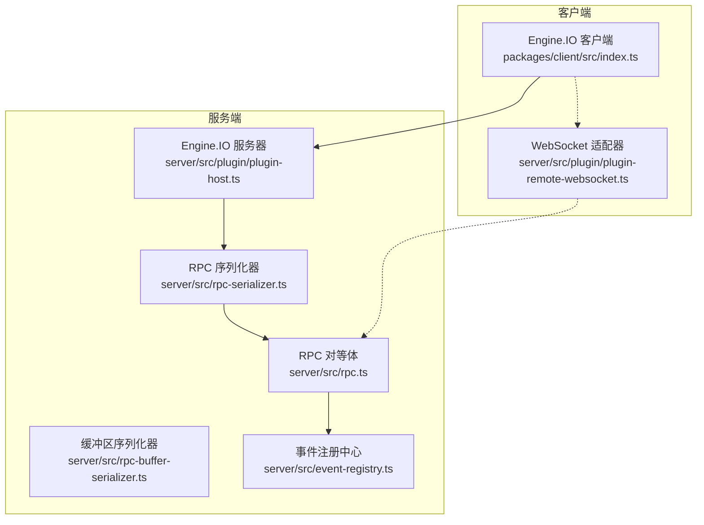
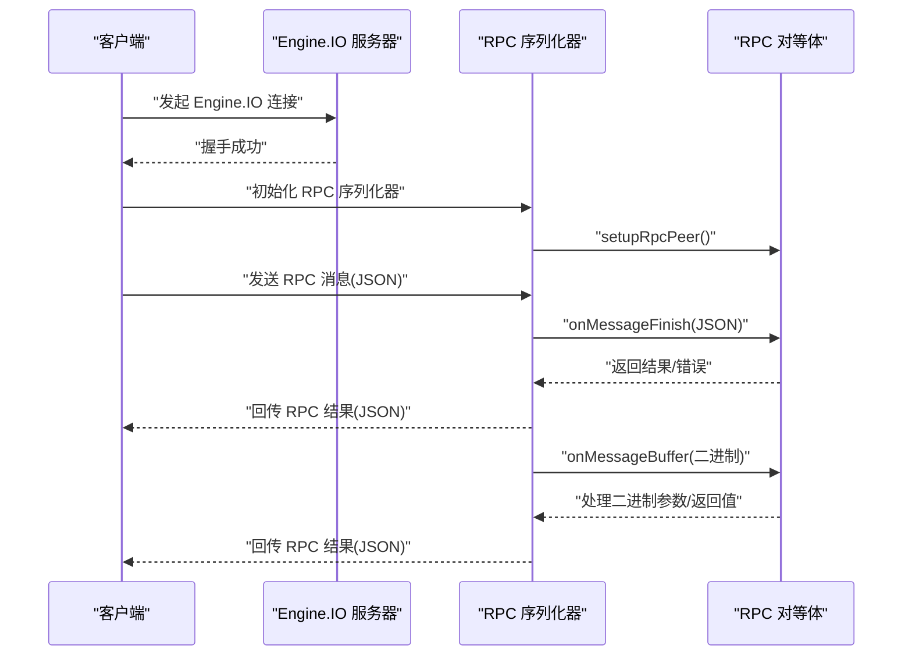
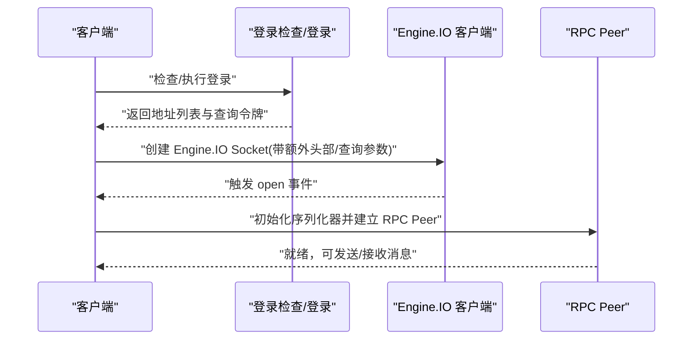
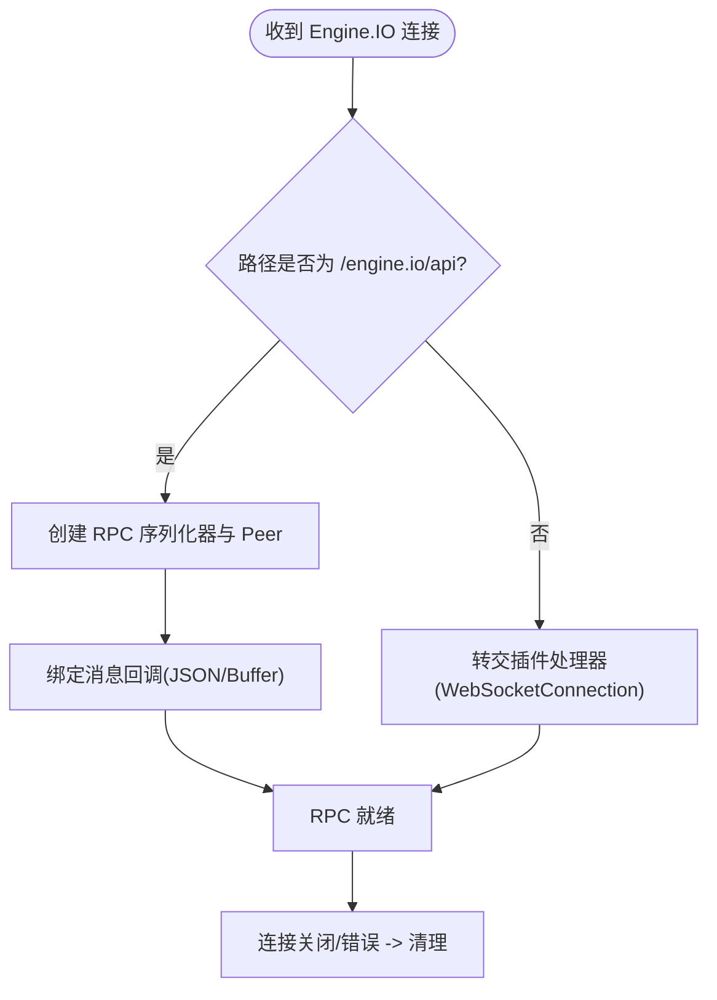
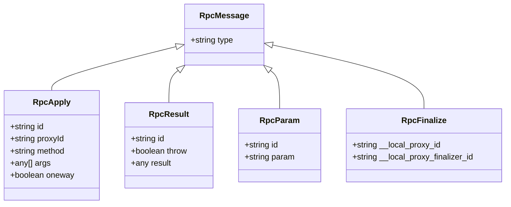
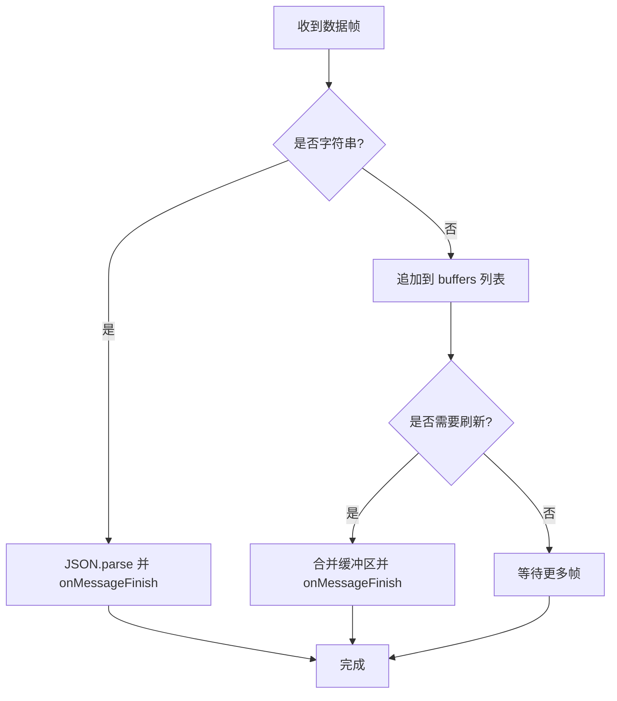
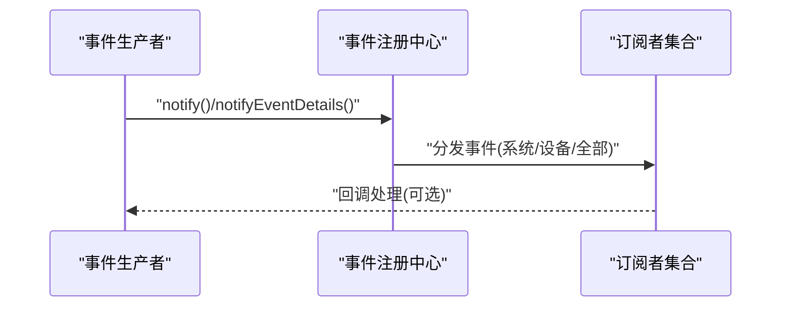
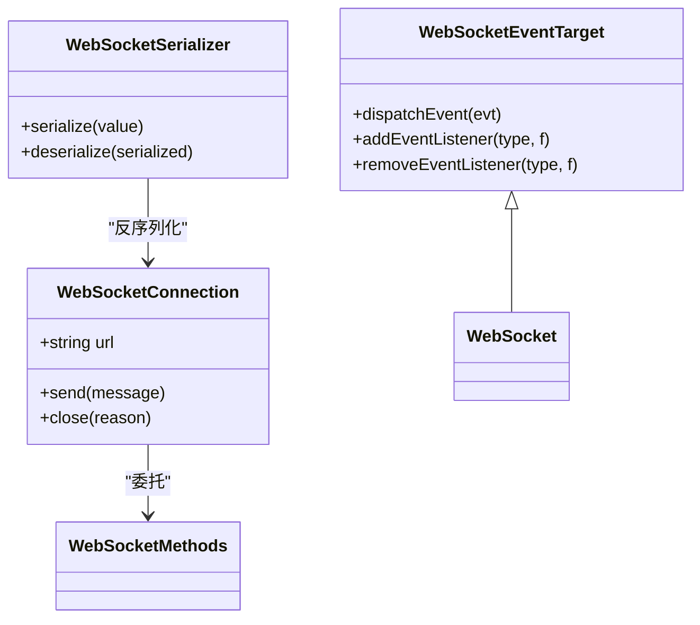
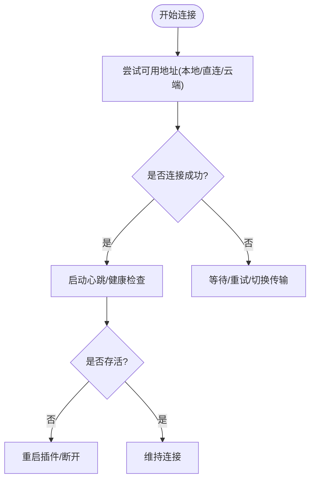
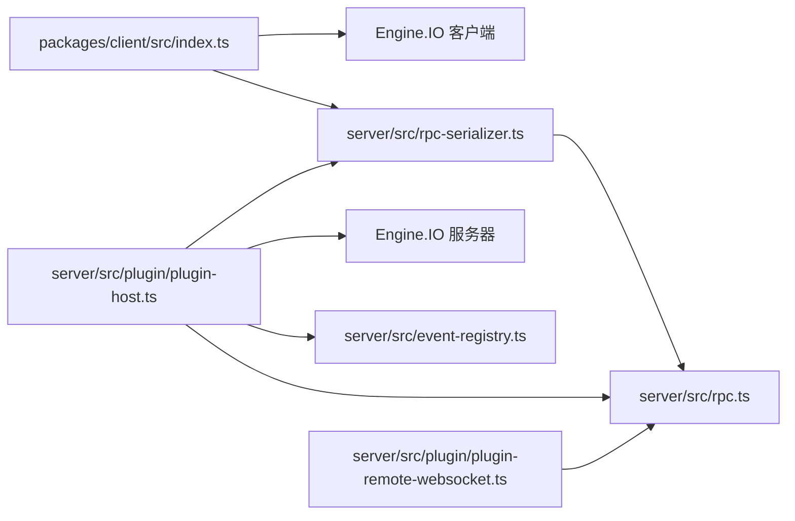

# WebSocket 接口

<cite>
**本文引用的文件**
- [packages/client/src/index.ts](file://packages/client/src/index.ts)
- [server/src/plugin/plugin-remote-websocket.ts](file://server/src/plugin/plugin-remote-websocket.ts)
- [server/src/rpc-serializer.ts](file://server/src/rpc-serializer.ts)
- [server/src/rpc.ts](file://server/src/rpc.ts)
- [server/src/plugin/plugin-host.ts](file://server/src/plugin/plugin-host.ts)
- [server/src/rpc-buffer-serializer.ts](file://server/src/rpc-buffer-serializer.ts)
- [server/src/event-registry.ts](file://server/src/event-registry.ts)
- [common/src/promise-utils.ts](file://common/src/promise-utils.ts)
- [common/src/activity-timeout.ts](file://common/src/activity-timeout.ts)
- [server/src/listen-zero.ts](file://server/src/listen-zero.ts)
- [plugins/prebuffer-mixin/src/main.ts](file://plugins/prebuffer-mixin/src/main.ts)
- [plugins/hikvision-doorbell/src/doorbell-api.ts](file://plugins/hikvision-doorbell/src/doorbell-api.ts)
- [plugins/tapo/src/digest-auth.ts](file://plugins/tapo/src/digest-auth.ts)
- [common/src/rtsp-server.ts](file://common/src/rtsp-server.ts)
</cite>

## 目录
1. [简介](#简介)
2. [项目结构](#项目结构)
3. [核心组件](#核心组件)
4. [架构总览](#架构总览)
5. [详细组件分析](#详细组件分析)
6. [依赖关系分析](#依赖关系分析)
7. [性能考虑](#性能考虑)
8. [故障排查指南](#故障排查指南)
9. [结论](#结论)
10. [附录](#附录)

## 简介
本文件面向 Scrypted 的 WebSocket/Engine.IO 实时通信接口，系统性阐述以下主题：
- 连接建立流程与握手协议（Engine.IO 协议族）
- 认证与会话保持（登录结果、查询令牌、跨域与 Cookie 传递）
- 实时事件推送机制（设备状态变更、报警事件、系统通知）
- 消息格式规范（JSON/RPC 消息结构、字段定义、数据类型）
- 事件订阅机制（按设备与事件类型订阅）
- 连接管理策略（心跳、断线重连、连接池与传输选择）
- 消息序列化与反序列化（含二进制缓冲区传输）
- 错误处理与超时控制
- 客户端使用示例（连接、收发消息、事件监听）
- 性能优化与内存防护

## 项目结构
Scrypted 的 WebSocket/Engine.IO 能力由服务端与客户端共同实现：
- 客户端通过 Engine.IO 客户端库发起连接，建立 RPC 通道并进行消息编解码
- 服务端通过 Engine.IO 服务器承载 RPC 通道，并将事件分发给订阅者
- WebSocket 适配层用于桥接 WebSocket 语义到 RPC 层

图示来源
- [packages/client/src/index.ts:436-544](file://packages/client/src/index.ts#L436-L544)
- [server/src/plugin/plugin-host.ts:151-201](file://server/src/plugin/plugin-host.ts#L151-L201)
- [server/src/rpc-serializer.ts:87-182](file://server/src/rpc-serializer.ts#L87-L182)
- [server/src/rpc.ts:285-400](file://server/src/rpc.ts#L285-L400)
- [server/src/rpc-buffer-serializer.ts:14-31](file://server/src/rpc-buffer-serializer.ts#L14-L31)
- [server/src/event-registry.ts:26-104](file://server/src/event-registry.ts#L26-L104)
- [server/src/plugin/plugin-remote-websocket.ts:73-152](file://server/src/plugin/plugin-remote-websocket.ts#L73-L152)

章节来源
- [packages/client/src/index.ts:436-544](file://packages/client/src/index.ts#L436-L544)
- [server/src/plugin/plugin-host.ts:151-201](file://server/src/plugin/plugin-host.ts#L151-L201)

## 核心组件
- 客户端 Engine.IO 连接与 RPC 初始化：负责登录、地址探测、Engine.IO 连接、RPC Peer 建立与消息编解码
- 服务端 Engine.IO 与 RPC 承载：负责接入控制、Engine.IO 事件转发、RPC Peer 生命周期管理
- RPC 序列化器：统一 JSON/RPC 消息与二进制缓冲区的发送/接收与解析
- WebSocket 适配器：将 WebSocket 语义映射到 RPC 层，支持事件派发与方法调用
- 事件注册中心：集中管理系统级与设备级事件订阅与分发

章节来源
- [packages/client/src/index.ts:562-586](file://packages/client/src/index.ts#L562-L586)
- [server/src/plugin/plugin-host.ts:465-504](file://server/src/plugin/plugin-host.ts#L465-L504)
- [server/src/rpc-serializer.ts:25-85](file://server/src/rpc-serializer.ts#L25-L85)
- [server/src/plugin/plugin-remote-websocket.ts:154-189](file://server/src/plugin/plugin-remote-websocket.ts#L154-L189)
- [server/src/event-registry.ts:26-104](file://server/src/event-registry.ts#L26-L104)

## 架构总览
下图展示从客户端发起连接到服务端建立 RPC 通道的关键步骤，以及消息在序列化器与 RPC 对等体之间的流转。

图示来源
- [packages/client/src/index.ts:562-586](file://packages/client/src/index.ts#L562-L586)
- [server/src/rpc-serializer.ts:25-85](file://server/src/rpc-serializer.ts#L25-L85)
- [server/src/rpc.ts:697-800](file://server/src/rpc.ts#L697-L800)

## 详细组件分析

### 客户端连接与握手
- 地址探测与传输选择：客户端根据登录结果与网络环境选择本地直连、直接地址或云端地址，并通过 Engine.IO 选项设置额外头部与传输列表
- 登录与会话：登录后生成授权头与查询令牌，用于后续请求与跨域场景下的 Cookie 传递
- Engine.IO 连接：构造 Engine.IO Socket，等待 open 事件；同时准备 RPC Peer 并绑定消息回调

图示来源
- [packages/client/src/index.ts:318-544](file://packages/client/src/index.ts#L318-L544)
- [packages/client/src/index.ts:562-586](file://packages/client/src/index.ts#L562-L586)

章节来源
- [packages/client/src/index.ts:318-544](file://packages/client/src/index.ts#L318-L544)
- [packages/client/src/index.ts:562-586](file://packages/client/src/index.ts#L562-L586)

### 服务端 Engine.IO 与 RPC 承载
- Engine.IO 服务器配置：启用 CORS、消息压缩、心跳与缓冲区上限
- 连接接入：区分 /engine.io/api 与插件自定义端点，分别交由 RPC Peer 或插件处理器处理
- RPC Peer 生命周期：绑定 ACL、处理消息、断开清理

图示来源
- [server/src/plugin/plugin-host.ts:45-58](file://server/src/plugin/plugin-host.ts#L45-L58)
- [server/src/plugin/plugin-host.ts:151-201](file://server/src/plugin/plugin-host.ts#L151-L201)
- [server/src/plugin/plugin-host.ts:465-504](file://server/src/plugin/plugin-host.ts#L465-L504)

章节来源
- [server/src/plugin/plugin-host.ts:45-58](file://server/src/plugin/plugin-host.ts#L45-L58)
- [server/src/plugin/plugin-host.ts:151-201](file://server/src/plugin/plugin-host.ts#L151-L201)
- [server/src/plugin/plugin-host.ts:465-504](file://server/src/plugin/plugin-host.ts#L465-L504)

### 消息格式与 RPC 协议
- 消息类型：apply（调用）、result（结果）、param（参数）、finalize（终结）
- 参数与返回值：支持 JSON 可传输类型与代理对象；错误以特殊构造名标识
- 二进制传输：通过 SidebandBufferSerializer 在同一流中携带多个二进制片段

图示来源
- [server/src/rpc.ts:29-79](file://server/src/rpc.ts#L29-L79)
- [server/src/rpc.ts:515-546](file://server/src/rpc.ts#L515-L546)

章节来源
- [server/src/rpc.ts:29-79](file://server/src/rpc.ts#L29-L79)
- [server/src/rpc.ts:515-546](file://server/src/rpc.ts#L515-L546)

### 序列化与反序列化规则
- JSON 消息：字符串帧，解析后进入 onMessageFinish
- 二进制消息：字节帧，累积到 serializationContext.buffers 后在 onMessageFinish 中合并
- 缓冲区传输：SidebandBufferSerializer 将 Buffer 作为侧带数组索引传输，减少 Base64 开销
- 错误序列化：RPCResultError 以特殊构造名标识并在对端重建

图示来源
- [server/src/rpc-serializer.ts:117-182](file://server/src/rpc-serializer.ts#L117-L182)
- [server/src/rpc-buffer-serializer.ts:14-31](file://server/src/rpc-buffer-serializer.ts#L14-L31)
- [server/src/rpc.ts:548-568](file://server/src/rpc.ts#L548-L568)

章节来源
- [server/src/rpc-serializer.ts:117-182](file://server/src/rpc-serializer.ts#L117-L182)
- [server/src/rpc-buffer-serializer.ts:14-31](file://server/src/rpc-buffer-serializer.ts#L14-L31)
- [server/src/rpc.ts:548-568](file://server/src/rpc.ts#L548-L568)

### 事件订阅与推送
- 事件注册：支持系统级与设备级订阅，允许按 mixinId 区分事件
- 事件过滤：仅对状态变更与允许的接口类型广播，避免噪声
- 推送路径：事件到达后由 EventRegistry 分发至系统监听器与设备监听器

图示来源
- [server/src/event-registry.ts:55-103](file://server/src/event-registry.ts#L55-L103)

章节来源
- [server/src/event-registry.ts:26-104](file://server/src/event-registry.ts#L26-L104)

### WebSocket 适配器
- 事件模型：支持 open/close/error/message 事件派发
- 方法代理：send/close 映射到底层 WebSocketMethods
- 序列化器：WebSocketSerializer 仅用于反序列化，将远端 WebSocketConnection 还原为本地 WebSocket 类实例

图示来源
- [server/src/plugin/plugin-remote-websocket.ts:15-44](file://server/src/plugin/plugin-remote-websocket.ts#L15-L44)
- [server/src/plugin/plugin-remote-websocket.ts:154-189](file://server/src/plugin/plugin-remote-websocket.ts#L154-L189)

章节来源
- [server/src/plugin/plugin-remote-websocket.ts:73-152](file://server/src/plugin/plugin-remote-websocket.ts#L73-L152)
- [server/src/plugin/plugin-remote-websocket.ts:154-189](file://server/src/plugin/plugin-remote-websocket.ts#L154-L189)

### 连接管理与心跳/断线重连
- 心跳与健康检查：服务端定期 ping 插件，超时则重启插件
- 断线重连：客户端在 Engine.IO 层自动尝试不同地址与传输，结合超时与清理逻辑
- 超时工具：提供通用超时 Promise 与函数包装，便于控制 RPC 调用与连接等待

图示来源
- [server/src/plugin/plugin-host.ts:289-325](file://server/src/plugin/plugin-host.ts#L289-L325)
- [packages/client/src/index.ts:518-544](file://packages/client/src/index.ts#L518-L544)
- [common/src/promise-utils.ts:30-44](file://common/src/promise-utils.ts#L30-L44)

章节来源
- [server/src/plugin/plugin-host.ts:289-325](file://server/src/plugin/plugin-host.ts#L289-L325)
- [packages/client/src/index.ts:518-544](file://packages/client/src/index.ts#L518-L544)
- [common/src/promise-utils.ts:30-44](file://common/src/promise-utils.ts#L30-L44)

## 依赖关系分析
- 客户端依赖 Engine.IO 客户端库与 RPC 序列化器，负责连接与消息编解码
- 服务端依赖 Engine.IO 服务器与 RPC 对等体，负责接入控制与事件分发
- WebSocket 适配器独立于 Engine.IO，但可与 RPC 对等体配合使用

图示来源
- [packages/client/src/index.ts:1-16](file://packages/client/src/index.ts#L1-L16)
- [server/src/plugin/plugin-host.ts:1-28](file://server/src/plugin/plugin-host.ts#L1-L28)
- [server/src/rpc-serializer.ts:1-3](file://server/src/rpc-serializer.ts#L1-L3)
- [server/src/rpc.ts:1-13](file://server/src/rpc.ts#L1-L13)
- [server/src/event-registry.ts:1-9](file://server/src/event-registry.ts#L1-L9)
- [server/src/plugin/plugin-remote-websocket.ts:1-10](file://server/src/plugin/plugin-remote-websocket.ts#L1-L10)

章节来源
- [packages/client/src/index.ts:1-16](file://packages/client/src/index.ts#L1-L16)
- [server/src/plugin/plugin-host.ts:1-28](file://server/src/plugin/plugin-host.ts#L1-L28)
- [server/src/rpc-serializer.ts:1-3](file://server/src/rpc-serializer.ts#L1-L3)
- [server/src/rpc.ts:1-13](file://server/src/rpc.ts#L1-L13)
- [server/src/event-registry.ts:1-9](file://server/src/event-registry.ts#L1-L9)
- [server/src/plugin/plugin-remote-websocket.ts:1-10](file://server/src/plugin/plugin-remote-websocket.ts#L1-L10)

## 性能考虑
- 二进制传输优化：优先使用 SidebandBufferSerializer 与分片发送，降低 Base64 编码成本
- 数据通道分片：针对数据通道实现 16KB 分片与去抖动批量发送
- 心跳与保活：服务端定时刷新会话，避免超时导致的连接中断
- 连接池与传输选择：客户端在多地址与多传输间择优，缩短首包延迟

章节来源
- [server/src/rpc-buffer-serializer.ts:14-31](file://server/src/rpc-buffer-serializer.ts#L14-L31)
- [server/src/rpc-serializer.ts:184-239](file://server/src/rpc-serializer.ts#L184-L239)
- [common/src/rtsp-server.ts:840-847](file://common/src/rtsp-server.ts#L840-L847)

## 故障排查指南
- 登录失败/重定向：检查登录响应中的错误信息与重定向字段
- 跨域与 Cookie：确保 Engine.IO 请求携带 Authorization 头或通过轮询建立会话后再升级
- 连接超时：使用超时工具包装关键操作，结合断线重连策略
- 插件无响应：服务端心跳超时会触发插件重启，检查日志与健康检查间隔
- 客户端连接超时：listen-zero 单客户端等待超时需检查网络与端口占用

章节来源
- [packages/client/src/index.ts:272-290](file://packages/client/src/index.ts#L272-L290)
- [packages/client/src/index.ts:487-491](file://packages/client/src/index.ts#L487-L491)
- [common/src/promise-utils.ts:30-44](file://common/src/promise-utils.ts#L30-L44)
- [server/src/plugin/plugin-host.ts:289-325](file://server/src/plugin/plugin-host.ts#L289-L325)
- [server/src/listen-zero.ts:17-35](file://server/src/listen-zero.ts#L17-L35)

## 结论
Scrypted 的 WebSocket/Engine.IO 接口通过 Engine.IO 提供可靠的长连接承载，结合 RPC 序列化器实现 JSON 与二进制混合消息的高效传输。客户端与服务端均具备完善的连接管理、事件分发与错误处理能力，适合构建高并发、低延迟的实时控制与监控场景。

## 附录

### 认证与握手要点
- 登录阶段：生成 Authorization 头与查询令牌，用于后续请求
- 跨域场景：通过额外头部或轮询建立会话，再进行 Engine.IO 升级
- 握手路径：/endpoint/{pluginId}/engine.io/api

章节来源
- [packages/client/src/index.ts:344-358](file://packages/client/src/index.ts#L344-L358)
- [packages/client/src/index.ts:436-448](file://packages/client/src/index.ts#L436-L448)

### 事件推送示例（概念）
- 设备状态变更：系统监听器与设备监听器均可接收状态变化事件
- 报警事件：通过事件注册中心按接口与 mixinId 过滤后分发
- 系统通知：允许的接口类型（如 Logger）将被广播到系统监听器

章节来源
- [server/src/event-registry.ts:75-103](file://server/src/event-registry.ts#L75-L103)

### 客户端使用示例（步骤）
- 连接：调用连接函数，传入 baseUrl、用户名/密码或先前登录结果
- 发送消息：通过已建立的 RPC Peer 发送 apply/result
- 接收消息：绑定消息回调，区分字符串(JSON)与二进制(Buffer)
- 事件监听：订阅系统或设备事件，处理事件详情与数据

章节来源
- [packages/client/src/index.ts:562-586](file://packages/client/src/index.ts#L562-L586)
- [server/src/rpc-serializer.ts:117-182](file://server/src/rpc-serializer.ts#L117-L182)

### 二进制数据处理
- 侧带传输：将 Buffer 作为数组索引发送，接收端按索引还原
- 分片发送：数据通道采用 16KB 分片与批量发送，提升吞吐

章节来源
- [server/src/rpc-buffer-serializer.ts:14-31](file://server/src/rpc-buffer-serializer.ts#L14-L31)
- [server/src/rpc-serializer.ts:184-239](file://server/src/rpc-serializer.ts#L184-L239)

### 其他安全与协议参考
- Digest 认证：部分插件使用 Digest 认证头生成与解析
- RTSP 保活：通过周期性刷新维持会话

章节来源
- [plugins/tapo/src/digest-auth.ts:10-54](file://plugins/tapo/src/digest-auth.ts#L10-L54)
- [common/src/rtsp-server.ts:840-847](file://common/src/rtsp-server.ts#L840-L847)