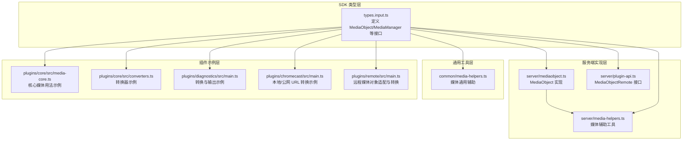
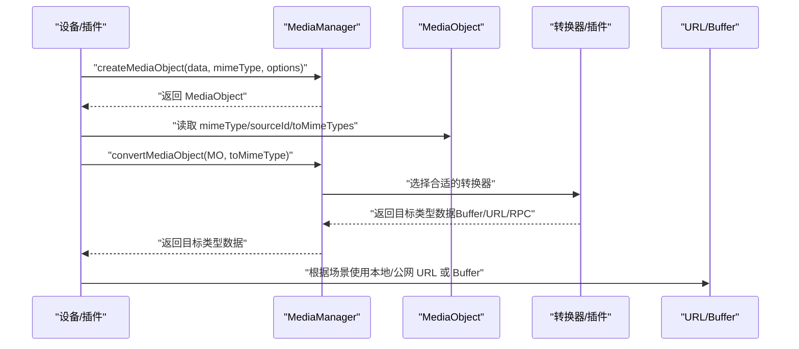
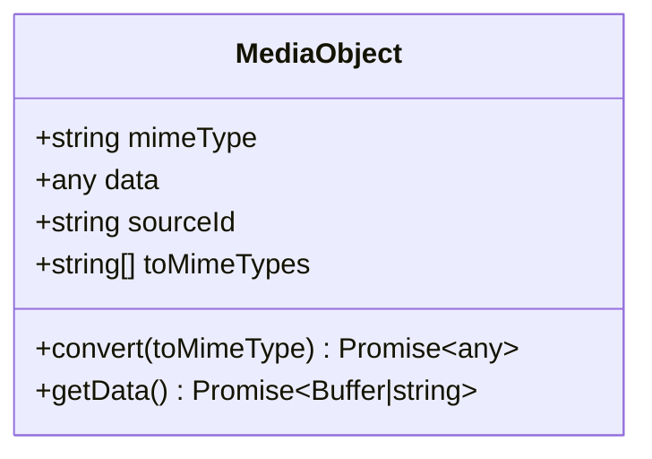
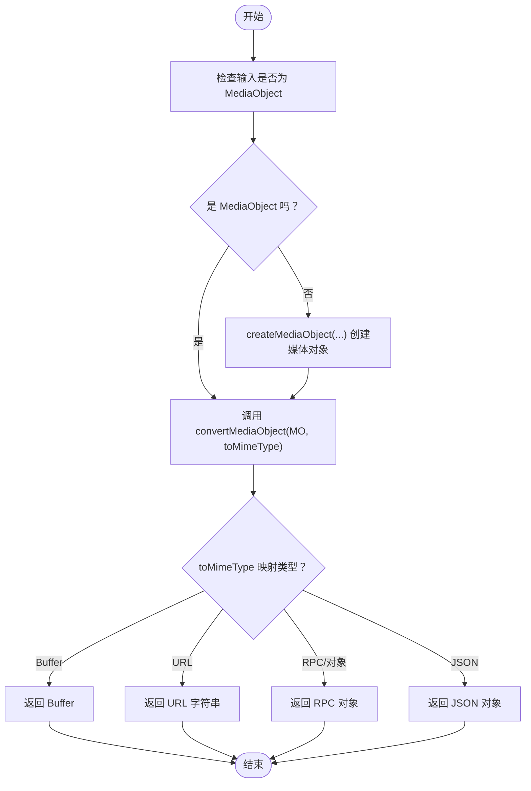
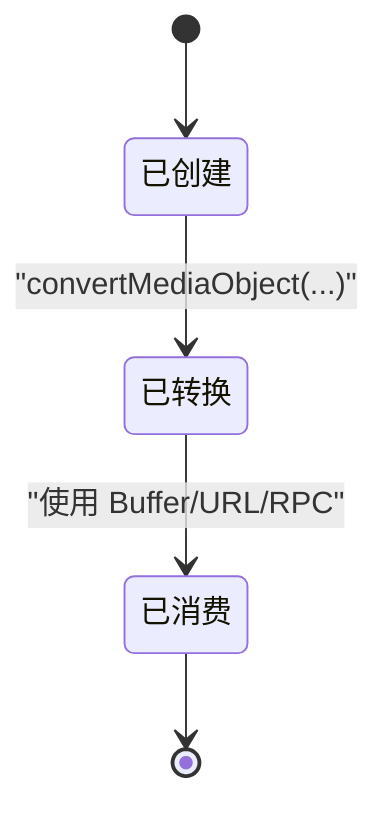
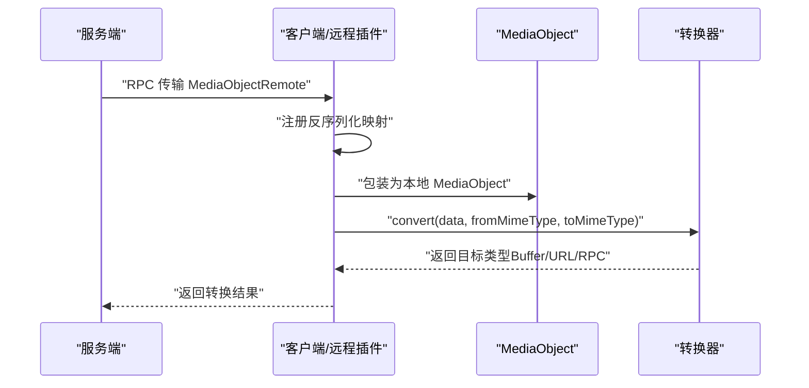
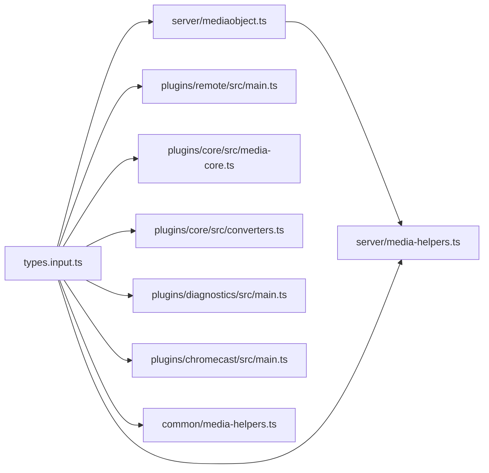

# 媒体对象模型

<cite>
**本文引用的文件**
- [sdk/types/src/types.input.ts](file://sdk/types/src/types.input.ts)
- [server/src/plugin/mediaobject.ts](file://server/src/plugin/mediaobject.ts)
- [plugins/remote/src/main.ts](file://plugins/remote/src/main.ts)
- [server/src/plugin/plugin-api.ts](file://server/src/plugin/plugin-api.ts)
- [common/src/media-helpers.ts](file://common/src/media-helpers.ts)
- [server/src/media-helpers.ts](file://server/src/media-helpers.ts)
- [plugins/core/src/media-core.ts](file://plugins/core/src/media-core.ts)
- [plugins/core/src/converters.ts](file://plugins/core/src/converters.ts)
- [plugins/diagnostics/src/main.ts](file://plugins/diagnostics/src/main.ts)
- [plugins/chromecast/src/main.ts](file://plugins/chromecast/src/main.ts)
</cite>

## 目录
1. [引言](#引言)
2. [项目结构](#项目结构)
3. [核心组件](#核心组件)
4. [架构总览](#架构总览)
5. [详细组件分析](#详细组件分析)
6. [依赖关系分析](#依赖关系分析)
7. [性能考量](#性能考量)
8. [故障排查指南](#故障排查指南)
9. [结论](#结论)
10. [附录](#附录)

## 引言
本文件系统性阐述 Scrypted 的媒体对象模型，围绕 MediaObject 接口的核心字段与行为展开，重点覆盖：
- mimeType 字段的 MIME 类型定义规范
- sourceId 源设备标识的作用
- toMimeTypes 转换能力声明机制
- MediaObject.convert() 方法的使用方式（参数 toMimeType 格式要求、返回值类型推断、异步转换流程）
- 媒体对象的生命周期管理（创建、转换、销毁）
- 具体使用示例（摄像头快照、音频流、视频流）
- 插件间传递机制（序列化、反序列化、跨进程传输）

## 项目结构
Scrypted 的媒体对象模型由 SDK 类型定义、服务端实现、客户端/远程插件适配以及若干插件中的媒体转换器共同组成。下图给出与媒体对象模型直接相关的模块关系。

图表来源
- [sdk/types/src/types.input.ts](file://sdk/types/src/types.input.ts)
- [server/src/plugin/mediaobject.ts](file://server/src/plugin/mediaobject.ts)
- [server/src/plugin/plugin-api.ts](file://server/src/plugin/plugin-api.ts)
- [server/src/media-helpers.ts](file://server/src/media-helpers.ts)
- [common/src/media-helpers.ts](file://common/src/media-helpers.ts)
- [plugins/core/src/media-core.ts](file://plugins/core/src/media-core.ts)
- [plugins/core/src/converters.ts](file://plugins/core/src/converters.ts)
- [plugins/diagnostics/src/main.ts](file://plugins/diagnostics/src/main.ts)
- [plugins/chromecast/src/main.ts](file://plugins/chromecast/src/main.ts)
- [plugins/remote/src/main.ts](file://plugins/remote/src/main.ts)

章节来源
- [sdk/types/src/types.input.ts](file://sdk/types/src/types.input.ts)
- [server/src/plugin/mediaobject.ts](file://server/src/plugin/mediaobject.ts)
- [server/src/plugin/plugin-api.ts](file://server/src/plugin/plugin-api.ts)
- [server/src/media-helpers.ts](file://server/src/media-helpers.ts)
- [common/src/media-helpers.ts](file://common/src/media-helpers.ts)
- [plugins/core/src/media-core.ts](file://plugins/core/src/media-core.ts)
- [plugins/core/src/converters.ts](file://plugins/core/src/converters.ts)
- [plugins/diagnostics/src/main.ts](file://plugins/diagnostics/src/main.ts)
- [plugins/chromecast/src/main.ts](file://plugins/chromecast/src/main.ts)
- [plugins/remote/src/main.ts](file://plugins/remote/src/main.ts)

## 核心组件
- MediaObject 接口：用于承载任意媒体数据及其元信息（如 MIME 类型、源设备标识、可转换目标 MIME 列表），并提供 convert 能力以异步转换为目标类型。
- MediaObjectCreateOptions/MediaObjectOptions：用于创建 MediaObject 时携带附加选项，如 sourceId、toMimeTypes、自定义 convert 实现等。
- MediaManager：统一的媒体转换入口，负责将 MediaObject 转换为 Buffer、URL、RPC 对象或解析为 JSON。
- MediaObjectRemote：服务端对客户端侧 MediaObject 的远程代理接口，提供 getData 以拉取底层数据。
- MediaObject 实现：服务端/客户端分别提供具体实现，负责属性代理、数据访问与序列化安全控制。

章节来源
- [sdk/types/src/types.input.ts](file://sdk/types/src/types.input.ts)
- [server/src/plugin/mediaobject.ts](file://server/src/plugin/mediaobject.ts)
- [server/src/plugin/plugin-api.ts](file://server/src/plugin/plugin-api.ts)

## 架构总览
下图展示了从设备产生媒体对象到最终消费（URL/Buffer/RPC）的典型流程，以及远程插件对媒体对象的适配与转换。

图表来源
- [sdk/types/src/types.input.ts](file://sdk/types/src/types.input.ts)
- [server/src/plugin/mediaobject.ts](file://server/src/plugin/mediaobject.ts)
- [plugins/core/src/converters.ts](file://plugins/core/src/converters.ts)
- [plugins/diagnostics/src/main.ts](file://plugins/diagnostics/src/main.ts)
- [plugins/chromecast/src/main.ts](file://plugins/chromecast/src/main.ts)

## 详细组件分析

### MediaObject 接口与字段语义
- mimeType：媒体对象的 MIME 类型，用于标识内容类型与编码格式。应遵循标准 MIME 规范，例如 image/jpeg、video/mp4、audio/aac、application/octet-stream 等。
- sourceId：可选字段，用于标识该媒体对象的源设备 ID，便于追踪来源与关联事件。
- toMimeTypes：可选字段，声明该媒体对象支持的转换目标 MIME 类型集合，帮助上层快速判断可用转换路径。
- convert(toMimeType)：可选方法，异步将当前媒体对象转换为指定 MIME 类型的目标对象；返回值类型由 toMimeType 决定，通常为 Buffer、字符串 URL 或 RPC 对象。

章节来源
- [sdk/types/src/types.input.ts](file://sdk/types/src/types.input.ts)

### MediaObject 实现（服务端）
- 属性代理：通过 __proxy_props 仅暴露可安全传输的属性，确保跨进程/跨网络传输的安全性。
- 数据访问：getData 提供统一的数据访问入口，返回 Buffer 或字符串形式的底层数据。
- 选项处理：构造函数接收 MediaObjectCreateOptions，设置 mimeType、convert、toMimeTypes 等，并进行属性注入。

图表来源
- [server/src/plugin/mediaobject.ts](file://server/src/plugin/mediaobject.ts)

章节来源
- [server/src/plugin/mediaobject.ts](file://server/src/plugin/mediaobject.ts)

### MediaObjectRemote（远程代理）
- 作用：在客户端侧对服务端 MediaObject 进行远程代理，提供 getData 以拉取实际数据。
- 使用场景：当媒体对象跨越进程边界（如远程插件）时，通过该接口进行透明访问。

章节来源
- [server/src/plugin/plugin-api.ts](file://server/src/plugin/plugin-api.ts)

### MediaManager 转换能力
- convertMediaObject：将 MediaObject 转换为指定 MIME 的 Buffer/JSON/RPC 对象。
- convertMediaObjectToBuffer/convertMediaObjectToJSON：分别返回 Buffer 或解析后的 JSON。
- convertMediaObjectToLocalUrl/convertMediaObjectToInsecureLocalUrl/convertMediaObjectToUrl：返回本地/不加密本地/公网可访问 URL。
- createMediaObject/createFFmpegMediaObject/createMediaObjectFromUrl：创建 MediaObject 的工厂方法。
- getFFmpegPath/getFilesPath：提供运行时环境信息（FFmpeg 路径、文件存储目录）。

章节来源
- [sdk/types/src/types.input.ts](file://sdk/types/src/types.input.ts)

### 转换流程与返回值类型推断
- 参数 toMimeType：应为标准 MIME 类型字符串，表示期望的目标类型。
- 返回值类型：由 toMimeType 决定，常见包括 Buffer、字符串 URL、RPC 对象或 JSON 解析结果。
- 异步转换：convertMediaObject 为异步操作，内部可能调用转换器链路完成格式转换、封装或 URL 生成。

图表来源
- [sdk/types/src/types.input.ts](file://sdk/types/src/types.input.ts)

章节来源
- [sdk/types/src/types.input.ts](file://sdk/types/src/types.input.ts)

### 生命周期管理
- 创建：通过 MediaManager.createMediaObject/createFFmpegMediaObject/createMediaObjectFromUrl 创建 MediaObject。
- 转换：通过 MediaManager.convertMediaObject 及其变体进行格式转换、URL 生成或 JSON 解析。
- 销毁：MediaObject 作为轻量中间对象，通常无显式销毁逻辑；在 RPC 场景中，代理对象随连接/上下文释放而失效。

图表来源
- [sdk/types/src/types.input.ts](file://sdk/types/src/types.input.ts)

章节来源
- [sdk/types/src/types.input.ts](file://sdk/types/src/types.input.ts)

### 具体使用示例

- 获取摄像头快照
  - 设备接口：takePicture 返回 MediaObject。
  - 转换为 JPEG：convertMediaObjectToBuffer(mo, 'image/jpeg')。
  - 示例参考：[plugins/diagnostics/src/main.ts](file://plugins/diagnostics/src/main.ts)

- 获取音频流
  - 设备接口：Microphone.getAudioStream 返回 MediaObject。
  - 转换为 FFmpeg 输入：convertMediaObjectToJSON(mo, ScryptedMimeTypes.FFmpegInput)。
  - 示例参考：[plugins/diagnostics/src/main.ts](file://plugins/diagnostics/src/main.ts)

- 获取视频流
  - 设备接口：VideoCamera.getVideoStream 返回 MediaObject。
  - 转换为本地 URL：convertMediaObjectToLocalUrl(mo, options?.mimeType)。
  - 示例参考：[plugins/chromecast/src/main.ts](file://plugins/chromecast/src/main.ts)

章节来源
- [sdk/types/src/types.input.ts](file://sdk/types/src/types.input.ts)
- [plugins/diagnostics/src/main.ts](file://plugins/diagnostics/src/main.ts)
- [plugins/chromecast/src/main.ts](file://plugins/chromecast/src/main.ts)

### 插件间传递机制（序列化、反序列化、跨进程传输）
- 序列化安全：MediaObject 实现通过 __proxy_props 仅暴露可安全传输的属性，避免敏感或不可序列化字段泄露。
- 远程代理：MediaObjectRemote 在客户端侧代理服务端对象，getData 用于拉取真实数据。
- 跨进程传输：远程插件示例中，将远端 MediaObject 包装成本地 MediaObject 并通过转换器进一步转为 FFmpegInput/本地 URL 等目标类型。
- 反序列化映射：远程插件示例中展示了如何在 RPC 层注册反序列化映射，将远端对象还原为本地 MediaObject。

图表来源
- [plugins/remote/src/main.ts](file://plugins/remote/src/main.ts)
- [server/src/plugin/mediaobject.ts](file://server/src/plugin/mediaobject.ts)
- [server/src/plugin/plugin-api.ts](file://server/src/plugin/plugin-api.ts)

章节来源
- [plugins/remote/src/main.ts](file://plugins/remote/src/main.ts)
- [server/src/plugin/mediaobject.ts](file://server/src/plugin/mediaobject.ts)
- [server/src/plugin/plugin-api.ts](file://server/src/plugin/plugin-api.ts)

## 依赖关系分析
- SDK 类型层为所有实现提供契约约束，确保跨模块一致性。
- 服务端实现层提供 MediaObject 的具体实现与远程代理接口。
- 插件示例层展示 MediaManager 的典型用法与转换器实现，验证转换链路的正确性。
- 通用工具层提供媒体辅助函数，支撑媒体对象的通用处理。

图表来源
- [sdk/types/src/types.input.ts](file://sdk/types/src/types.input.ts)
- [server/src/plugin/mediaobject.ts](file://server/src/plugin/mediaobject.ts)
- [plugins/remote/src/main.ts](file://plugins/remote/src/main.ts)
- [plugins/core/src/media-core.ts](file://plugins/core/src/media-core.ts)
- [plugins/core/src/converters.ts](file://plugins/core/src/converters.ts)
- [plugins/diagnostics/src/main.ts](file://plugins/diagnostics/src/main.ts)
- [plugins/chromecast/src/main.ts](file://plugins/chromecast/src/main.ts)
- [server/src/media-helpers.ts](file://server/src/media-helpers.ts)
- [common/src/media-helpers.ts](file://common/src/media-helpers.ts)

章节来源
- [sdk/types/src/types.input.ts](file://sdk/types/src/types.input.ts)
- [server/src/plugin/mediaobject.ts](file://server/src/plugin/mediaobject.ts)
- [plugins/remote/src/main.ts](file://plugins/remote/src/main.ts)
- [plugins/core/src/media-core.ts](file://plugins/core/src/media-core.ts)
- [plugins/core/src/converters.ts](file://plugins/core/src/converters.ts)
- [plugins/diagnostics/src/main.ts](file://plugins/diagnostics/src/main.ts)
- [plugins/chromecast/src/main.ts](file://plugins/chromecast/src/main.ts)
- [server/src/media-helpers.ts](file://server/src/media-helpers.ts)
- [common/src/media-helpers.ts](file://common/src/media-helpers.ts)

## 性能考量
- 转换开销：不同 MIME 类型之间的转换可能涉及编解码与封装，建议优先复用已有的 MediaObject，避免重复转换。
- URL 生成：本地/公网 URL 的生成可能触发额外的网络或文件系统操作，建议缓存短生命周期 URL。
- 序列化安全：仅暴露必要字段，减少跨进程传输的数据体积与安全风险。
- 批量请求：在批量获取摄像头快照等场景，合理利用设备提供的批量/预取能力以降低延迟。

## 故障排查指南
- MIME 类型不匹配：确认 toMimeType 与设备/转换器支持范围一致，必要时先查询 toMimeTypes 列表。
- 转换失败：检查转换器链路与 FFmpeg 环境配置，确保 getFFmpegPath 可用且权限正确。
- 远程对象异常：确认 RPC 反序列化映射已注册，且 MediaObjectRemote 的 getData 能正常拉取数据。
- URL 访问受限：区分本地/公网 URL 的访问范围与鉴权策略，必要时使用本地不加密 URL 以排除网络问题。

章节来源
- [sdk/types/src/types.input.ts](file://sdk/types/src/types.input.ts)
- [plugins/remote/src/main.ts](file://plugins/remote/src/main.ts)
- [plugins/diagnostics/src/main.ts](file://plugins/diagnostics/src/main.ts)

## 结论
Scrypted 的媒体对象模型以 MediaObject 为核心，结合 MediaManager 的统一转换能力与插件生态中的转换器实现，实现了从设备到消费端的灵活媒体流转。通过明确的 MIME 类型约定、源设备标识与转换能力声明，开发者可以高效地在多插件、多进程环境中传递与转换媒体对象，并根据场景选择最优的输出形态（Buffer/URL/RPC）。

## 附录
- 常见 MIME 类型建议
  - 图片：image/jpeg、image/png
  - 视频：video/mp4、video/quicktime、video/x-m4v
  - 音频：audio/aac、audio/mpeg、audio/wav
  - 流媒体：application/vnd.apple.mpegurl、video/MP2T
  - 通用：application/octet-stream
- 相关接口与方法路径
  - [MediaObject 接口定义](file://sdk/types/src/types.input.ts)
  - [MediaObject 实现（服务端）](file://server/src/plugin/mediaobject.ts)
  - [MediaObjectRemote 接口](file://server/src/plugin/plugin-api.ts)
  - [MediaManager 转换方法](file://sdk/types/src/types.input.ts)
  - [远程插件适配与转换](file://plugins/remote/src/main.ts)
  - [核心媒体用法示例](file://plugins/core/src/media-core.ts)
  - [转换器示例](file://plugins/core/src/converters.ts)
  - [诊断插件示例](file://plugins/diagnostics/src/main.ts)
  - [Chromecast 插件示例](file://plugins/chromecast/src/main.ts)