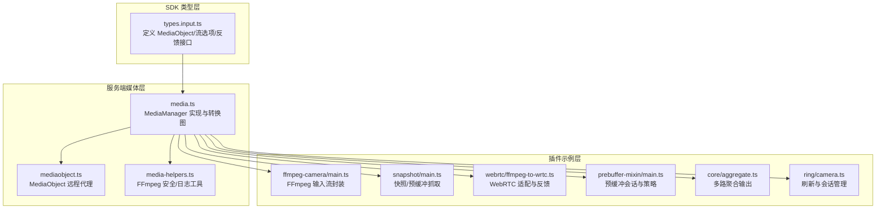
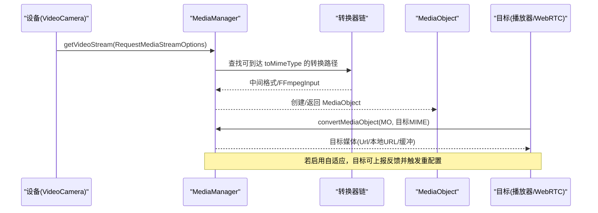
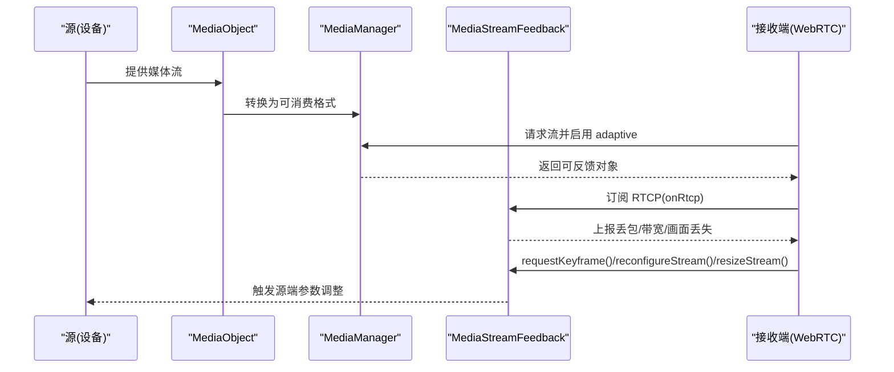
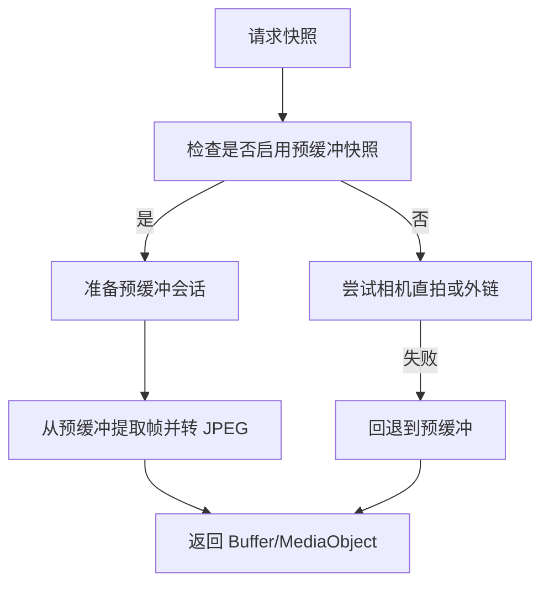
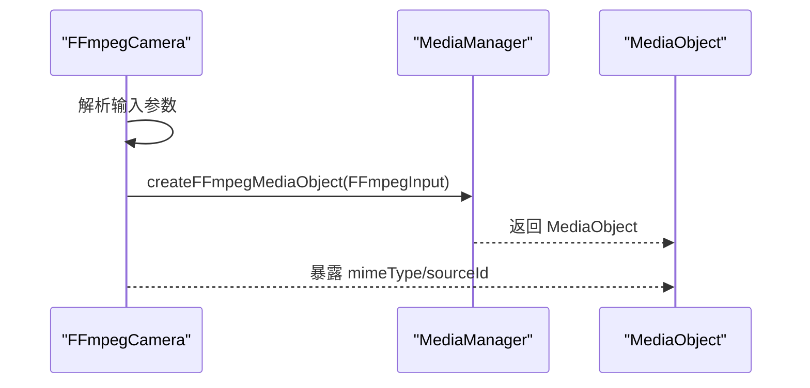
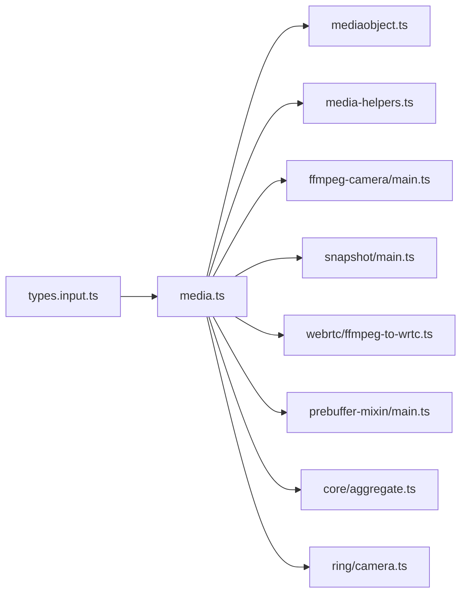

# 媒体数据模型

<cite>
**本文引用的文件**
- [sdk/types/src/types.input.ts](file://sdk/types/src/types.input.ts)
- [server/src/plugin/media.ts](file://server/src/plugin/media.ts)
- [server/src/plugin/mediaobject.ts](file://server/src/plugin/mediaobject.ts)
- [server/src/media-helpers.ts](file://server/src/media-helpers.ts)
- [plugins/ffmpeg-camera/src/main.ts](file://plugins/ffmpeg-camera/src/main.ts)
- [plugins/snapshot/src/main.ts](file://plugins/snapshot/src/main.ts)
- [plugins/webrtc/src/ffmpeg-to-wrtc.ts](file://plugins/webrtc/src/ffmpeg-to-wrtc.ts)
- [plugins/prebuffer-mixin/src/main.ts](file://plugins/prebuffer-mixin/src/main.ts)
- [plugins/prebuffer-mixin/src/stream-settings.ts](file://plugins/prebuffer-mixin/src/stream-settings.ts)
- [plugins/core/src/aggregate.ts](file://plugins/core/src/aggregate.ts)
- [plugins/ring/src/camera.ts](file://plugins/ring/src/camera.ts)
</cite>

## 目录
1. [简介](#简介)
2. [项目结构](#项目结构)
3. [核心组件](#核心组件)
4. [架构总览](#架构总览)
5. [详细组件分析](#详细组件分析)
6. [依赖关系分析](#依赖关系分析)
7. [性能考量](#性能考量)
8. [故障排查指南](#故障排查指南)
9. [结论](#结论)
10. [附录](#附录)

## 简介
本文件系统化梳理 Scrypted 的媒体数据模型，围绕以下主题展开：
- MediaObject 媒体对象的核心结构：MIME 类型、源设备标识、转换能力声明等
- 媒体流选项模型：VideoStreamOptions、AudioStreamOptions 及其参数语义
- 媒体流目的地枚举 MediaStreamDestination 的取值与使用场景
- 媒体流反馈机制：MediaStreamFeedback 接口、自适应比特率、丢包/关键帧控制
- 媒体转换数据模型：转换目标 MIME、转换参数、转换状态
- 媒体录制相关数据结构：录制配置、存储路径、元数据
- 媒体缓存与预缓冲：预缓冲大小/时长、缓存策略
- 典型媒体处理示例：视频流获取、音频流处理、图片拍摄

## 项目结构
与媒体数据模型直接相关的关键位置：
- SDK 类型定义：sdk/types/src/types.input.ts
- 服务端媒体管理：server/src/plugin/media.ts、server/src/plugin/mediaobject.ts
- 媒体工具辅助：server/src/media-helpers.ts
- 插件示例：ffmpeg-camera、snapshot、webrtc、prebuffer-mixin、core 聚合、ring

图表来源
- [sdk/types/src/types.input.ts:298-304](file://sdk/types/src/types.input.ts#L298-L304)
- [server/src/plugin/media.ts:40-200](file://server/src/plugin/media.ts#L40-L200)
- [server/src/plugin/mediaobject.ts:5-25](file://server/src/plugin/mediaobject.ts#L5-L25)
- [server/src/media-helpers.ts:1-98](file://server/src/media-helpers.ts#L1-L98)
- [plugins/ffmpeg-camera/src/main.ts:110-125](file://plugins/ffmpeg-camera/src/main.ts#L110-L125)
- [plugins/snapshot/src/main.ts:200-242](file://plugins/snapshot/src/main.ts#L200-L242)
- [plugins/webrtc/src/ffmpeg-to-wrtc.ts:69-111](file://plugins/webrtc/src/ffmpeg-to-wrtc.ts#L69-L111)
- [plugins/prebuffer-mixin/src/main.ts:1308-1339](file://plugins/prebuffer-mixin/src/main.ts#L1308-L1339)
- [plugins/core/src/aggregate.ts:41-75](file://plugins/core/src/aggregate.ts#L41-L75)
- [plugins/ring/src/camera.ts:250-272](file://plugins/ring/src/camera.ts#L250-L272)

章节来源
- [sdk/types/src/types.input.ts:298-304](file://sdk/types/src/types.input.ts#L298-L304)
- [server/src/plugin/media.ts:40-200](file://server/src/plugin/media.ts#L40-L200)

## 核心组件
- MediaObject：统一的媒体载体，包含 mimeType、sourceId、toMimeTypes、convert 等能力
- 媒体流选项：VideoStreamOptions、AudioStreamOptions、MediaStreamOptions、RequestMediaStreamOptions
- 媒体流目的地：MediaStreamDestination 枚举
- 媒体流反馈：MediaStreamFeedback 接口（RTCP 回调、重配置、关键帧请求、丢包/带宽上报）
- 媒体管理器：MediaManager 负责转换链路、URL/FFmpegInput 包装、内置转换器注册

章节来源
- [sdk/types/src/types.input.ts:298-304](file://sdk/types/src/types.input.ts#L298-L304)
- [sdk/types/src/types.input.ts:494-531](file://sdk/types/src/types.input.ts#L494-L531)
- [sdk/types/src/types.input.ts:544-601](file://sdk/types/src/types.input.ts#L544-L601)
- [sdk/types/src/types.input.ts:603-603](file://sdk/types/src/types.input.ts#L603-L603)
- [sdk/types/src/types.input.ts:669-686](file://sdk/types/src/types.input.ts#L669-L686)
- [server/src/plugin/media.ts:40-151](file://server/src/plugin/media.ts#L40-L151)

## 架构总览
媒体从设备到消费端的典型路径：
- 设备提供 getVideoStream/getAudioStream 返回 MediaObject
- 消费端通过 MediaManager.convert 将 MediaObject 转换为所需 MIME（如 Url、LocalUrl、FFmpegInput）
- WebRTC/FFmpeg 等根据反馈接口进行自适应调整（丢包、关键帧、带宽）

图表来源
- [server/src/plugin/media.ts:206-242](file://server/src/plugin/media.ts#L206-L242)
- [server/src/plugin/media.ts:313-436](file://server/src/plugin/media.ts#L313-L436)
- [sdk/types/src/types.input.ts:669-686](file://sdk/types/src/types.input.ts#L669-L686)

## 详细组件分析

### MediaObject 媒体对象
- 结构要点
  - mimeType：媒体类型标识
  - sourceId：来源设备 ID，用于日志/追踪/回放
  - toMimeTypes/convert：声明可转换的目标类型及转换入口
- 实现要点
  - 服务端 MediaObjectRemote 代理将数据安全传输，并暴露 getData
  - 支持字符串/Buffer 等多种数据形态

章节来源
- [sdk/types/src/types.input.ts:298-304](file://sdk/types/src/types.input.ts#L298-L304)
- [server/src/plugin/mediaobject.ts:5-25](file://server/src/plugin/mediaobject.ts#L5-L25)

### 媒体流选项模型
- VideoStreamOptions
  - 编解码器/配置：codec、profile、h264Info
  - 分辨率：width、height
  - 码率：bitrate、minBitrate、maxBitrate、bitrateControl
  - 帧率：fps
  - 质量：quality
  - 关键帧间隔：keyframeInterval
- AudioStreamOptions
  - 编解码器/编码器：codec、encoder、profile
  - 码率/采样率：bitrate、sampleRate
- MediaStreamOptions
  - id/name、容器：container
  - 预缓冲：prebuffer(毫秒)、prebufferBytes(字节)
  - 工具：tool('ffmpeg' | 'scrypted' | 'gstreamer')
  - 视频/音频子项：video/audio
  - 元数据：metadata
  - 源类型/SDP/出带参数：source、sdp、oobCodecParameters
  - 目的地集合：destinations
  - 允许电池预缓冲：allowBatteryPrebuffer
- RequestMediaStreamOptions
  - route('external' | 'direct' | 'internal')
  - refresh 默认 true
  - destination、destinationId、destinationType
  - adaptive 开启自适应并指定能力开关
  - video/audio 子项

章节来源
- [sdk/types/src/types.input.ts:494-531](file://sdk/types/src/types.input.ts#L494-L531)
- [sdk/types/src/types.input.ts:544-601](file://sdk/types/src/types.input.ts#L544-L601)
- [sdk/types/src/types.input.ts:614-661](file://sdk/types/src/types.input.ts#L614-L661)

### 媒体流目的地枚举
- local：本地直连
- remote：远端/外部网络
- medium-resolution：中等分辨率
- low-resolution：低分辨率
- local-recorder：本地录制器
- remote-recorder：远端录制器

用途建议
- 本地播放优先选择 local；远端播放选择 remote
- 录制场景选择对应 recorder 目的地以启用录制专用参数
- 低带宽或移动端场景选择 low-resolution 或 medium-resolution

章节来源
- [sdk/types/src/types.input.ts:603-603](file://sdk/types/src/types.input.ts#L603-L603)

### 媒体流反馈机制
- 接口方法
  - onRtcp(buffer)：接收 RTCP 报文
  - reconfigureStream({ video: { bitrate?, width?, height? } })：请求重配置
  - requestKeyframe()：请求关键帧
  - reportPacketLoss(report)：报告 RTP 丢包
  - reportPictureLoss()：报告画面丢失
  - reportEstimatedMaxBitrate(bitrate)：上报估计最大可用码率
  - resizeStream({ width, height })：请求调整分辨率
- 自适应比特率
  - 通过 adaptive 参数开启，结合 feedback 上报进行动态调整
  - 可选能力：packetLoss、pictureLoss、keyframe、reconfigure、resize、codecSwitch
- WebRTC 适配
  - 从 MediaObject 获取反馈接口，订阅 RTCP 并转发到 feedback

图表来源
- [sdk/types/src/types.input.ts:669-686](file://sdk/types/src/types.input.ts#L669-L686)
- [plugins/webrtc/src/ffmpeg-to-wrtc.ts:69-111](file://plugins/webrtc/src/ffmpeg-to-wrtc.ts#L69-L111)

章节来源
- [sdk/types/src/types.input.ts:605-612](file://sdk/types/src/types.input.ts#L605-L612)
- [sdk/types/src/types.input.ts:669-686](file://sdk/types/src/types.input.ts#L669-L686)
- [plugins/webrtc/src/ffmpeg-to-wrtc.ts:69-111](file://plugins/webrtc/src/ffmpeg-to-wrtc.ts#L69-L111)

### 媒体转换数据模型
- 转换目标 MIME
  - Url、LocalUrl、InsecureLocalUrl、FFmpegInput、MediaStreamUrl 等
- 转换参数
  - 由具体转换器决定，MediaManager 维护内置转换器并构建转换图
- 转换状态
  - 通过 convertMediaObject* 系列方法返回中间/最终结果
- 内置转换器
  - HTTP/HTTPS、file、Url→FFmpegInput、MediaStreamUrl↔FFmpegInput、图像转换等

图表来源
- [server/src/plugin/media.ts:190-200](file://server/src/plugin/media.ts#L190-L200)
- [server/src/plugin/media.ts:313-436](file://server/src/plugin/media.ts#L313-L436)

章节来源
- [server/src/plugin/media.ts:40-151](file://server/src/plugin/media.ts#L40-L151)
- [server/src/plugin/media.ts:190-200](file://server/src/plugin/media.ts#L190-L200)
- [server/src/plugin/media.ts:313-436](file://server/src/plugin/media.ts#L313-L436)

### 媒体录制相关数据结构
- 录制请求
  - RequestRecordingStreamOptions：startTime、duration、loop、playbackRate
- 删除录制
  - DeleteRecordingStreamOptions：destination、startTime、duration
- 录制目的地
  - 使用 MediaStreamDestination 的 recorder 变体（local-recorder、remote-recorder）

章节来源
- [sdk/types/src/types.input.ts:878-889](file://sdk/types/src/types.input.ts#L878-L889)
- [sdk/types/src/types.input.ts:603-603](file://sdk/types/src/types.input.ts#L603-L603)

### 媒体缓存与预缓冲
- 预缓冲配置
  - MediaStreamOptions.prebuffer(毫秒)、prebufferBytes(字节)
  - ResponseMediaStreamOptions.destinations、allowBatteryPrebuffer
- 预缓冲策略
  - 预缓冲会话在 prebuffer-mixin 中维护，支持按目的地/分辨率选择
  - 对于云/合成流，默认不启用，需手动开启
- 快照与预缓冲
  - Snapshot 插件可从预缓冲中抽取 JPEG 快照，减少相机压力

图表来源
- [plugins/snapshot/src/main.ts:200-242](file://plugins/snapshot/src/main.ts#L200-L242)
- [plugins/prebuffer-mixin/src/main.ts:1308-1339](file://plugins/prebuffer-mixin/src/main.ts#L1308-L1339)
- [plugins/prebuffer-mixin/src/stream-settings.ts:252-267](file://plugins/prebuffer-mixin/src/stream-settings.ts#L252-L267)

章节来源
- [sdk/types/src/types.input.ts:544-601](file://sdk/types/src/types.input.ts#L544-L601)
- [plugins/prebuffer-mixin/src/main.ts:768-787](file://plugins/prebuffer-mixin/src/main.ts#L768-L787)
- [plugins/prebuffer-mixin/src/main.ts:1308-1339](file://plugins/prebuffer-mixin/src/main.ts#L1308-L1339)
- [plugins/snapshot/src/main.ts:200-242](file://plugins/snapshot/src/main.ts#L200-L242)

### 媒体处理示例

#### 示例一：视频流获取（FFmpeg 输入）
- 设备侧：ffmpeg-camera 将输入参数封装为 FFmpegInput 并创建 MediaObject
- 消费侧：通过 MediaManager 转换为 Url/LocalUrl 或 FFmpegInput

图表来源
- [plugins/ffmpeg-camera/src/main.ts:110-125](file://plugins/ffmpeg-camera/src/main.ts#L110-L125)
- [server/src/plugin/media.ts:104-139](file://server/src/plugin/media.ts#L104-L139)

章节来源
- [plugins/ffmpeg-camera/src/main.ts:110-125](file://plugins/ffmpeg-camera/src/main.ts#L110-L125)
- [server/src/plugin/media.ts:104-139](file://server/src/plugin/media.ts#L104-L139)

#### 示例二：音频流处理（WebRTC）
- 通过 requestMediaStream 指定音频编解码器（如 opus），并启用自适应
- 订阅 RTCP，将反馈转发至 MediaStreamFeedback，实现丢包/码率自适应

章节来源
- [plugins/webrtc/src/ffmpeg-to-wrtc.ts:69-111](file://plugins/webrtc/src/ffmpeg-to-wrtc.ts#L69-L111)
- [sdk/types/src/types.input.ts:657-657](file://sdk/types/src/types.input.ts#L657-L657)

#### 示例三：图片拍摄（快照）
- 优先从预缓冲抽取 JPEG；若不可用则尝试相机直拍或外链
- 支持裁剪、缩放、模糊等后处理

章节来源
- [plugins/snapshot/src/main.ts:164-318](file://plugins/snapshot/src/main.ts#L164-L318)
- [plugins/snapshot/src/main.ts:420-497](file://plugins/snapshot/src/main.ts#L420-L497)

#### 示例四：多路聚合输出
- core 聚合插件组合多个视频源，生成网格布局的原始视频流

章节来源
- [plugins/core/src/aggregate.ts:41-75](file://plugins/core/src/aggregate.ts#L41-L75)

#### 示例五：流刷新与会话管理
- ring 插件在 metadata.refreshAt 到期时刷新当前媒体会话

章节来源
- [plugins/ring/src/camera.ts:250-272](file://plugins/ring/src/camera.ts#L250-L272)

## 依赖关系分析
- 类型层依赖
  - types.input.ts 定义所有媒体相关接口与选项
- 服务端依赖
  - media.ts 依赖 types.input.ts 的接口，实现转换图与内置转换器
  - mediaobject.ts 提供 MediaObjectRemote 代理
  - media-helpers.ts 提供 FFmpeg 安全退出与日志过滤
- 插件依赖
  - 各插件通过 MediaManager 获取/转换 MediaObject
  - WebRTC/预缓冲/快照等插件基于反馈接口实现自适应

图表来源
- [sdk/types/src/types.input.ts:298-304](file://sdk/types/src/types.input.ts#L298-L304)
- [server/src/plugin/media.ts:40-151](file://server/src/plugin/media.ts#L40-L151)
- [server/src/plugin/mediaobject.ts:5-25](file://server/src/plugin/mediaobject.ts#L5-L25)
- [server/src/media-helpers.ts:1-98](file://server/src/media-helpers.ts#L1-L98)

章节来源
- [server/src/plugin/media.ts:40-151](file://server/src/plugin/media.ts#L40-L151)

## 性能考量
- 预缓冲策略
  - 合理设置 prebuffer 与 prebufferBytes，避免过长阻塞首帧
  - 对云/合成流默认禁用，防止持续占用带宽
- 自适应比特率
  - 在弱网环境启用 adaptive 并上报丢包/带宽，降低卡顿
- 编解码器选择
  - 优先选择目标端支持度高的编解码器（如 h264/h265、opus）
- 转换链优化
  - MediaManager 基于图搜索最短转换路径，尽量减少中间格式

## 故障排查指南
- FFmpeg 日志噪声过滤
  - 使用 ffmpegLogInitialOutput 仅输出关键帧/尺寸信息，避免噪声干扰
- 安全退出
  - 使用 safeKillFFmpeg 优雅关闭 FFmpeg 子进程，避免残留连接
- 调试参数
  - safePrintFFmpegArguments 对敏感 URL 参数脱敏打印，便于日志审计

章节来源
- [server/src/media-helpers.ts:40-71](file://server/src/media-helpers.ts#L40-L71)
- [server/src/media-helpers.ts:11-38](file://server/src/media-helpers.ts#L11-L38)
- [server/src/media-helpers.ts:73-97](file://server/src/media-helpers.ts#L73-L97)

## 结论
Scrypted 的媒体数据模型以 MediaObject 为核心，配合完善的流选项、反馈接口与转换体系，实现了从设备到消费端的灵活适配。通过合理配置预缓冲、目的地与自适应参数，可在不同网络与设备条件下获得稳定流畅的媒体体验。

## 附录
- 常用 MIME 与转换
  - Url、LocalUrl、InsecureLocalUrl、FFmpegInput、MediaStreamUrl、image/* 等
- 关键流程参考
  - MediaObject 创建与转换：[server/src/plugin/media.ts:309-311](file://server/src/plugin/media.ts#L309-L311)
  - 转换链构建与执行：[server/src/plugin/media.ts:313-436](file://server/src/plugin/media.ts#L313-L436)
  - WebRTC 反馈接入：[plugins/webrtc/src/ffmpeg-to-wrtc.ts:69-111](file://plugins/webrtc/src/ffmpeg-to-wrtc.ts#L69-L111)