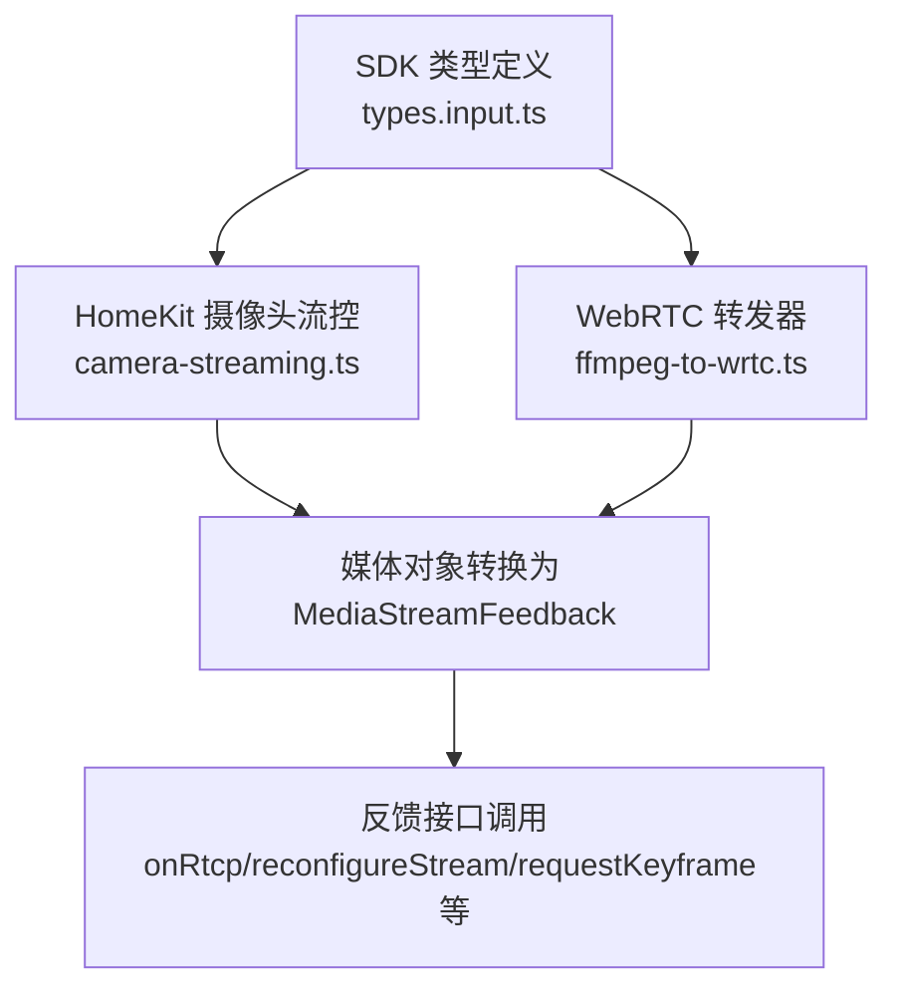
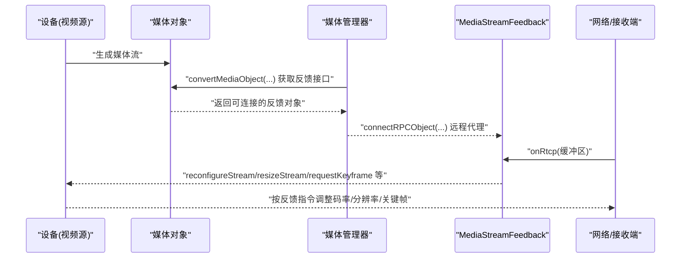
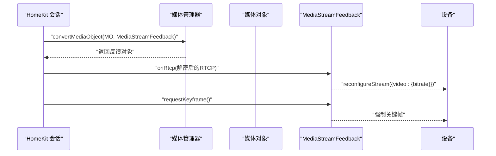
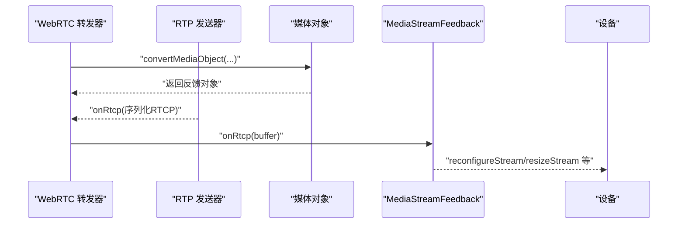
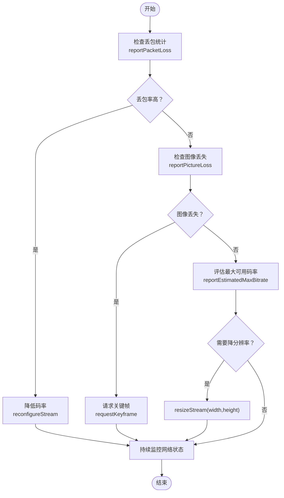

# 媒体流反馈模型

<cite>
**本文引用的文件**
- [sdk/types/src/types.input.ts](file://sdk/types/src/types.input.ts)
- [plugins/homekit/src/types/camera/camera-streaming.ts](file://plugins/homekit/src/types/camera/camera-streaming.ts)
- [plugins/webrtc/src/ffmpeg-to-wrtc.ts](file://plugins/webrtc/src/ffmpeg-to-wrtc.ts)
</cite>

## 目录
1. [引言](#引言)
2. [项目结构](#项目结构)
3. [核心组件](#核心组件)
4. [架构总览](#架构总览)
5. [详细组件分析](#详细组件分析)
6. [依赖关系分析](#依赖关系分析)
7. [性能考量](#性能考量)
8. [故障排查指南](#故障排查指南)
9. [结论](#结论)
10. [附录](#附录)

## 引言
本文件系统性阐述 Scrypted 的媒体流反馈模型，聚焦 MediaStreamFeedback 接口及其在实际场景中的应用。内容覆盖以下要点：
- MediaStreamFeedback 回调方法：onRtcp、reconfigureStream、requestKeyframe、reportPacketLoss、reportPictureLoss、reportEstimatedMaxBitrate、resizeStream 等。
- MediaStreamPacketLoss 数据结构：ssrc、highestSequence、packetsLost 字段语义与用途。
- 自适应码率控制机制：基于丢包率、图像丢失、估计最大码率、分辨率调整等反馈信号的闭环控制。
- 实际应用场景：动态码率调整、网络状况监测、流质量优化。
- 性能影响与最佳实践。

## 项目结构
围绕媒体流反馈模型的关键位置如下：
- 类型与接口定义位于 SDK 类型文件中，包含 MediaStreamFeedback 接口、MediaStreamPacketLoss 结构以及相关常量。
- HomeKit 插件在摄像头流启动时尝试获取 MediaStreamFeedback，并在收到 RTCP 报文时回传给反馈接口；同时根据反馈能力决定是否进行码率重配置。
- WebRTC 插件在 RTP 发送路径上订阅 RTCP，将 RTCP 缓冲区转发到反馈接口；当存在反馈能力时，可减少转封装以降低开销。

图表来源
- [sdk/types/src/types.input.ts:663-686](file://sdk/types/src/types.input.ts#L663-L686)
- [plugins/homekit/src/types/camera/camera-streaming.ts:304-344](file://plugins/homekit/src/types/camera/camera-streaming.ts#L304-L344)
- [plugins/webrtc/src/ffmpeg-to-wrtc.ts:95-111](file://plugins/webrtc/src/ffmpeg-to-wrtc.ts#L95-L111)

章节来源
- [sdk/types/src/types.input.ts:663-686](file://sdk/types/src/types.input.ts#L663-L686)
- [plugins/homekit/src/types/camera/camera-streaming.ts:304-344](file://plugins/homekit/src/types/camera/camera-streaming.ts#L304-L344)
- [plugins/webrtc/src/ffmpeg-to-wrtc.ts:95-111](file://plugins/webrtc/src/ffmpeg-to-wrtc.ts#L95-L111)

## 核心组件
- MediaStreamFeedback 接口：提供 RTCP 反馈上报、流参数重配置、关键帧请求、丢包/图像丢失/估计最大码率/分辨率调整等回调方法。
- MediaStreamPacketLoss 结构：用于上报丢包统计信息，包含同步源标识、最高序列号、累计丢包数等字段。
- 反馈常量：ScryptedMimeTypes.MediaStreamFeedback 表示媒体对象可转换为反馈接口的类型标识。

章节来源
- [sdk/types/src/types.input.ts:663-686](file://sdk/types/src/types.input.ts#L663-L686)
- [sdk/types/src/types.input.ts:2669-2670](file://sdk/types/src/types.input.ts#L2669-L2670)

## 架构总览
媒体流反馈在不同传输通道（如 HomeKit、WebRTC）中的交互流程如下：

图表来源
- [plugins/homekit/src/types/camera/camera-streaming.ts:304-344](file://plugins/homekit/src/types/camera/camera-streaming.ts#L304-L344)
- [plugins/webrtc/src/ffmpeg-to-wrtc.ts:95-111](file://plugins/webrtc/src/ffmpeg-to-wrtc.ts#L95-L111)
- [sdk/types/src/types.input.ts:669-686](file://sdk/types/src/types.input.ts#L669-L686)

## 详细组件分析

### MediaStreamFeedback 接口与回调方法
MediaStreamFeedback 定义了媒体流运行期的反馈与控制接口，典型回调包括：
- onRtcp：接收 RTCP 缓冲区，用于统计丢包、接收者报告等。
- reconfigureStream：请求对视频流参数进行重配置（如码率）。
- requestKeyframe：请求发送关键帧以加速解码重建。
- reportPacketLoss：上报丢包统计（包含 ssrc、最高序列号、累计丢包数）。
- reportPictureLoss：上报图像丢失事件。
- reportEstimatedMaxBitrate：上报估计的最大可用带宽。
- resizeStream：请求调整分辨率（宽、高）。

这些方法构成自适应码率控制的基础输入，驱动设备侧做出实时调整。

章节来源
- [sdk/types/src/types.input.ts:669-686](file://sdk/types/src/types.input.ts#L669-L686)

### MediaStreamPacketLoss 数据结构
- ssrc：同步源标识，用于区分多路流或多播组内的不同发送端。
- highestSequence：最高接收序列号，用于计算丢包率与序列回绕场景下的统计。
- packetsLost：累计丢包数，结合 RTCP RR/NACK 等报文解析得到。

该结构是丢包反馈的核心载体，用于估计链路质量并触发降级策略。

章节来源
- [sdk/types/src/types.input.ts:663-667](file://sdk/types/src/types.input.ts#L663-L667)

### HomeKit 摄像头流中的反馈集成
- 在摄像头会话建立阶段，尝试从媒体对象转换出 MediaStreamFeedback。
- 当存在反馈能力时，通过 onRtcp 将解密后的 RTCP 缓冲区回传给设备侧，以便其进行 reconfigureStream 等操作。
- 若无反馈能力，则本地解析 RTCP 并打印丢包日志，作为降级路径。

图表来源
- [plugins/homekit/src/types/camera/camera-streaming.ts:304-344](file://plugins/homekit/src/types/camera/camera-streaming.ts#L304-L344)

章节来源
- [plugins/homekit/src/types/camera/camera-streaming.ts:304-344](file://plugins/homekit/src/types/camera/camera-streaming.ts#L304-L344)

### WebRTC 转发器中的反馈集成
- 在 RTP 发送前订阅 RTCP，将 RTCP 序列化后转发至反馈接口，确保设备侧能够感知网络状况。
- 当具备反馈能力时，可禁用额外的转封装步骤以降低 CPU 开销。
- 通过 onRtcp 与设备侧形成闭环，实现动态码率与分辨率调整。

图表来源
- [plugins/webrtc/src/ffmpeg-to-wrtc.ts:95-111](file://plugins/webrtc/src/ffmpeg-to-wrtc.ts#L95-L111)

章节来源
- [plugins/webrtc/src/ffmpeg-to-wrtc.ts:95-111](file://plugins/webrtc/src/ffmpeg-to-wrtc.ts#L95-L111)

### 自适应码率控制机制
- 丢包率上报：通过 reportPacketLoss 提供 ssrc、highestSequence、packetsLost，设备据此估算丢包率并触发降速或 FEC。
- 图像丢失上报：reportPictureLoss 用于指示画面丢失，设备可请求关键帧或切换更低分辨率。
- 估计最大码率：reportEstimatedMaxBitrate 提供链路估计上限，避免过度配置导致拥塞。
- 流尺寸调整：resizeStream 请求降低分辨率以缓解带宽压力。
- 关键帧请求：requestKeyframe 用于快速恢复画面质量，尤其在网络波动后。

图表来源
- [sdk/types/src/types.input.ts:669-686](file://sdk/types/src/types.input.ts#L669-L686)

章节来源
- [sdk/types/src/types.input.ts:669-686](file://sdk/types/src/types.input.ts#L669-L686)

### 实际应用场景
- 动态码率调整：在弱网环境下自动降低码率，避免缓冲溢出与卡顿。
- 网络状况监测：结合 RTCP RR/NACK 统计，持续评估丢包与抖动，指导 QoS 策略。
- 流质量优化：在高延迟网络中优先保证关键帧与分辨率，提升主观体验。
- 适配不同终端：针对 HomeKit、WebRTC 等不同传输协议与 MTU 约束，动态选择合适的码率与分辨率。

章节来源
- [plugins/homekit/src/types/camera/camera-streaming.ts:304-344](file://plugins/homekit/src/types/camera/camera-streaming.ts#L304-L344)
- [plugins/webrtc/src/ffmpeg-to-wrtc.ts:95-111](file://plugins/webrtc/src/ffmpeg-to-wrtc.ts#L95-L111)

## 依赖关系分析
- 类型依赖：MediaStreamFeedback 与 MediaStreamPacketLoss 定义于 SDK 类型文件，被各插件通过媒体对象转换与 RPC 连接使用。
- 插件依赖：HomeKit 与 WebRTC 插件均依赖媒体管理器将媒体对象转换为反馈接口，并在运行期通过 onRtcp 与设备侧交互。
- 运行时耦合：反馈接口通过 RPC 对象连接，避免直接耦合具体设备实现，增强可扩展性。

图表来源
- [sdk/types/src/types.input.ts:663-686](file://sdk/types/src/types.input.ts#L663-L686)
- [plugins/homekit/src/types/camera/camera-streaming.ts:304-344](file://plugins/homekit/src/types/camera/camera-streaming.ts#L304-L344)
- [plugins/webrtc/src/ffmpeg-to-wrtc.ts:95-111](file://plugins/webrtc/src/ffmpeg-to-wrtc.ts#L95-L111)

章节来源
- [sdk/types/src/types.input.ts:663-686](file://sdk/types/src/types.input.ts#L663-L686)
- [plugins/homekit/src/types/camera/camera-streaming.ts:304-344](file://plugins/homekit/src/types/camera/camera-streaming.ts#L304-L344)
- [plugins/webrtc/src/ffmpeg-to-wrtc.ts:95-111](file://plugins/webrtc/src/ffmpeg-to-wrtc.ts#L95-L111)

## 性能考量
- RTCP 处理成本：频繁的 RTCP 解析与转发会带来 CPU 压力，建议在具备反馈能力时减少不必要的转封装。
- 码率与分辨率调整频率：过于频繁的 reconfigureStream/resizeStream 会导致编码器状态抖动，应引入节流与阈值判断。
- 关键帧请求策略：过多的关键帧会增加突发带宽需求，应在网络稳定后再请求。
- MTU 与分包：不同网络环境下的 MTU 差异会影响 RTP 分片与重打包开销，需结合反馈结果动态优化。

## 故障排查指南
- 无法获取反馈接口：检查媒体对象是否支持转换为 MediaStreamFeedback；若失败，插件应回退到本地解析 RTCP 并记录丢包。
- RTCP 不生效：确认 onRtcp 是否被正确订阅与转发；验证媒体对象转换与 RPC 连接过程。
- 码率不下降：检查丢包统计是否准确上报；确认设备侧对 reconfigureStream 的响应逻辑。
- 分辨率调整无效：核对 resizeStream 参数与设备支持范围；确认设备实现是否接受该指令。

章节来源
- [plugins/homekit/src/types/camera/camera-streaming.ts:304-344](file://plugins/homekit/src/types/camera/camera-streaming.ts#L304-L344)
- [plugins/webrtc/src/ffmpeg-to-wrtc.ts:95-111](file://plugins/webrtc/src/ffmpeg-to-wrtc.ts#L95-L111)

## 结论
MediaStreamFeedback 为 Scrypted 的媒体流提供了闭环反馈与控制能力，结合 RTCP 统计与设备侧自适应算法，可在复杂网络环境中实现动态码率、分辨率与关键帧的智能调节。通过 HomeKit 与 WebRTC 插件的实践可见，反馈接口的正确集成与合理的策略设计，是保障流媒体质量与稳定性的关键。

## 附录
- 反馈接口常量：ScryptedMimeTypes.MediaStreamFeedback 用于标识媒体对象可转换为反馈接口。
- 相关类型：MediaStreamPacketLoss、RequestMediaStreamAdaptiveOptions 等，支撑自适应流的配置与统计。

章节来源
- [sdk/types/src/types.input.ts:2669-2670](file://sdk/types/src/types.input.ts#L2669-L2670)
- [sdk/types/src/types.input.ts:605-612](file://sdk/types/src/types.input.ts#L605-L612)