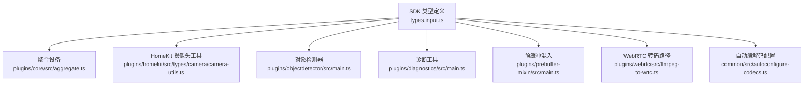
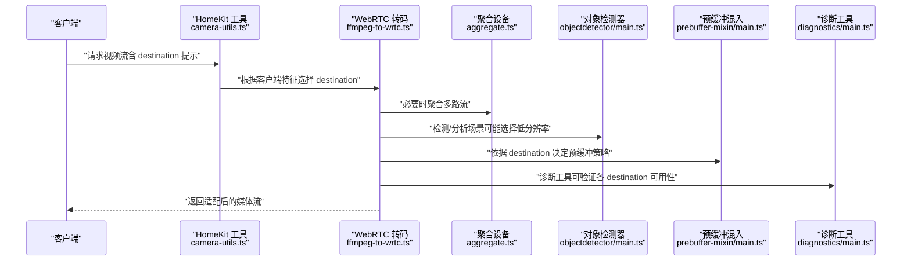
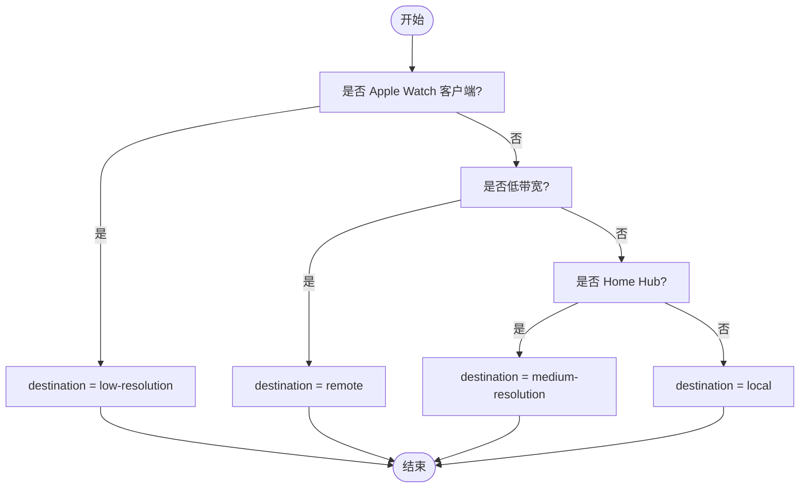
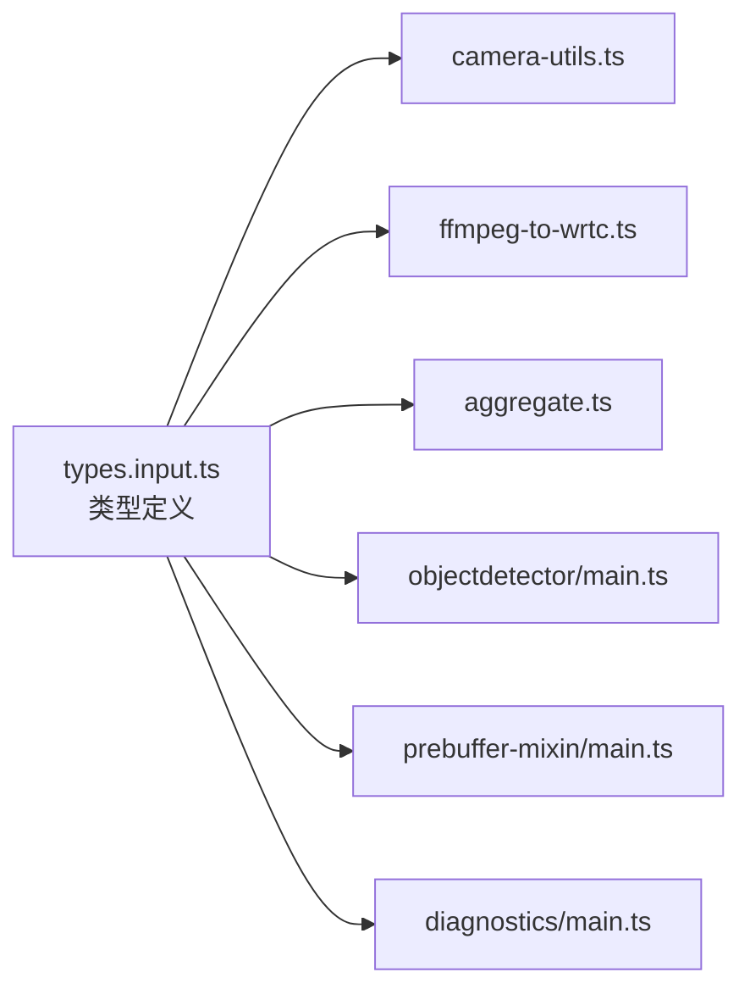

# 媒体流目的地枚举

<cite>
**本文引用的文件**
- [types.input.ts](file://sdk/types/src/types.input.ts)
- [aggregate.ts](file://plugins/core/src/aggregate.ts)
- [camera-utils.ts](file://plugins/homekit/src/types/camera/camera-utils.ts)
- [objectdetector/main.ts](file://plugins/objectdetector/src/main.ts)
- [diagnostics/main.ts](file://plugins/diagnostics/src/main.ts)
- [prebuffer-mixin/main.ts](file://plugins/prebuffer-mixin/src/main.ts)
- [webrtc/ffmpeg-to-wrtc.ts](file://plugins/webrtc/src/ffmpeg-to-wrtc.ts)
- [autoconfigure-codecs.ts](file://common/src/autoconfigure-codecs.ts)
</cite>

## 目录
1. [简介](#简介)
2. [项目结构](#项目结构)
3. [核心组件](#核心组件)
4. [架构总览](#架构总览)
5. [详细组件分析](#详细组件分析)
6. [依赖关系分析](#依赖关系分析)
7. [性能考量](#性能考量)
8. [故障排查指南](#故障排查指南)
9. [结论](#结论)
10. [附录](#附录)

## 简介
本文件系统性梳理 Scrypted 媒体流目的地枚举（MediaStreamDestination）的语义、使用场景与选择策略，覆盖本地流、远程流、中等分辨率流、低分辨率流、本地录制器、远程录制器等目标类型，并结合各插件中的实际用法，给出自动选择与手动指定的决策逻辑、优先级排序以及配置示例，帮助在不同网络带宽、设备性能与用户体验需求下，实现最优的媒体传输效果。

## 项目结构
MediaStreamDestination 类型定义位于 SDK 类型声明中，具体使用贯穿多个插件与混入模块：
- 类型定义：sdk/types/src/types.input.ts
- 使用示例：plugins/*、common/* 等目录下的实现文件

图表来源
- [types.input.ts:602-603](file://sdk/types/src/types.input.ts#L602-L603)
- [aggregate.ts:42-43](file://plugins/core/src/aggregate.ts#L42-L43)
- [camera-utils.ts:80-86](file://plugins/homekit/src/types/camera/camera-utils.ts#L80-L86)
- [objectdetector/main.ts:349-350](file://plugins/objectdetector/src/main.ts#L349-L350)
- [diagnostics/main.ts:305-357](file://plugins/diagnostics/src/main.ts#L305-L357)
- [prebuffer-mixin/main.ts:926-930](file://plugins/prebuffer-mixin/src/main.ts#L926-L930)
- [webrtc/ffmpeg-to-wrtc.ts:61-95](file://plugins/webrtc/src/ffmpeg-to-wrtc.ts#L61-L95)
- [autoconfigure-codecs.ts:64-83](file://common/src/autoconfigure-codecs.ts#L64-L83)

章节来源
- [types.input.ts:602-603](file://sdk/types/src/types.input.ts#L602-L603)
- [aggregate.ts:42-43](file://plugins/core/src/aggregate.ts#L42-L43)
- [camera-utils.ts:80-86](file://plugins/homekit/src/types/camera/camera-utils.ts#L80-L86)
- [objectdetector/main.ts:349-350](file://plugins/objectdetector/src/main.ts#L349-L350)
- [diagnostics/main.ts:305-357](file://plugins/diagnostics/src/main.ts#L305-L357)
- [prebuffer-mixin/main.ts:926-930](file://plugins/prebuffer-mixin/src/main.ts#L926-L930)
- [webrtc/ffmpeg-to-wrtc.ts:61-95](file://plugins/webrtc/src/ffmpeg-to-wrtc.ts#L61-L95)
- [autoconfigure-codecs.ts:64-83](file://common/src/autoconfigure-codecs.ts#L64-L83)

## 核心组件
- MediaStreamDestination 枚举定义：用于指示请求媒体流时的目标用途或路由意图，常见取值包括 local、remote、medium-resolution、low-resolution、local-recorder、remote-recorder。
- 请求参数中的 destination 字段：作为对底层实现的“提示”，帮助选择主/子流、编码参数、转码策略与预缓冲行为。
- 插件与混入中的使用：根据设备能力、网络环境、客户端类型与性能约束，动态选择合适的 destination。

章节来源
- [types.input.ts:602-603](file://sdk/types/src/types.input.ts#L602-L603)
- [types.input.ts:637-637](file://sdk/types/src/types.input.ts#L637-L637)

## 架构总览
从客户端发起请求到媒体流返回的关键流程如下：

图表来源
- [camera-utils.ts:80-86](file://plugins/homekit/src/types/camera/camera-utils.ts#L80-L86)
- [webrtc/ffmpeg-to-wrtc.ts:61-95](file://plugins/webrtc/src/ffmpeg-to-wrtc.ts#L61-L95)
- [aggregate.ts:42-43](file://plugins/core/src/aggregate.ts#L42-L43)
- [objectdetector/main.ts:349-350](file://plugins/objectdetector/src/main.ts#L349-L350)
- [prebuffer-mixin/main.ts:926-930](file://plugins/prebuffer-mixin/src/main.ts#L926-L930)
- [diagnostics/main.ts:305-357](file://plugins/diagnostics/src/main.ts#L305-L357)

## 详细组件分析

### MediaStreamDestination 各取值语义与使用场景
- local
  - 含义：面向本地播放或处理，通常要求低延迟与高画质。
  - 典型场景：桌面端应用、本地回放、实时控制台。
  - 实现要点：避免不必要的转码；优先直通高分辨率主码流。
- remote
  - 含义：面向公网或不稳定网络的远端播放，强调稳定性与兼容性。
  - 典型场景：移动 App、跨网段观看。
  - 实现要点：可能启用兼容模式、降低分辨率或采用更稳健的编解码。
- medium-resolution
  - 含义：中等分辨率，平衡画质与带宽。
  - 典型场景：家庭局域网内多屏观看、中等性能设备。
  - 实现要点：在 WebRTC 等场景中作为默认目标之一。
- low-resolution
  - 含义：低分辨率，优先保证流畅度与低带宽占用。
  - 典型场景：移动端弱网、监控告警帧率、后台分析。
  - 实现要点：对象检测器在运动检测时倾向选择该目标以降低负载。
- local-recorder
  - 含义：本地录制器专用流，偏向稳定录制参数与关键帧策略。
  - 典型场景：本地存储、离线回看。
  - 实现要点：预缓冲与关键帧间隔需满足录制一致性。
- remote-recorder
  - 含义：远程录制器专用流，兼顾远端录制的稳定性与兼容性。
  - 典型场景：云端存储、跨网段录制。
  - 实现要点：与 remote 类似，但可能针对云侧特性做优化。

章节来源
- [types.input.ts:602-603](file://sdk/types/src/types.input.ts#L602-L603)
- [diagnostics/main.ts:349-357](file://plugins/diagnostics/src/main.ts#L349-L357)

### 自动选择算法与决策逻辑
- HomeKit 场景
  - 基于客户端分辨率与是否低带宽/Home Hub 等特征，自动选择 destination：
    - Apple Watch：低分辨率
    - 低带宽：remote
    - Home Hub：medium-resolution
    - 其他：local
  - 参考路径：[camera-utils.ts:80-86](file://plugins/homekit/src/types/camera/camera-utils.ts#L80-L86)

- WebRTC 场景
  - 综合客户端能力、网络环境与兼容性开关，决定是否走兼容模式与目标分辨率：
    - 兼容模式或非本地网络：remote
    - 否则：medium-resolution
  - 参考路径：[webrtc/ffmpeg-to-wrtc.ts:61-67](file://plugins/webrtc/src/ffmpeg-to-wrtc.ts#L61-L67)

- 聚合场景
  - 当设备数量较多时，自动选择 low-resolution 以降低总带宽与 CPU 压力：
    - devices.length > 4 → low-resolution；否则 medium-resolution
  - 参考路径：[aggregate.ts:42-43](file://plugins/core/src/aggregate.ts#L42-L43)

- 对象检测场景
  - 若存在运动类型，倾向于 low-resolution；否则选择 local-recorder 以提升稳定性：
    - hasMotionType ? 'low-resolution' : 'local-recorder'
  - 参考路径：[objectdetector/main.ts:349-350](file://plugins/objectdetector/src/main.ts#L349-L350)

- 预缓冲策略
  - 不同 destination 下的默认预缓冲时长不同，remote 更保守：
    - options.destination === 'remote' → 默认 2000ms；否则 4000ms
  - 参考路径：[prebuffer-mixin/main.ts:926-930](file://plugins/prebuffer-mixin/src/main.ts#L926-L930)

图表来源
- [camera-utils.ts:80-86](file://plugins/homekit/src/types/camera/camera-utils.ts#L80-L86)

章节来源
- [camera-utils.ts:80-86](file://plugins/homekit/src/types/camera/camera-utils.ts#L80-L86)
- [webrtc/ffmpeg-to-wrtc.ts:61-67](file://plugins/webrtc/src/ffmpeg-to-wrtc.ts#L61-L67)
- [aggregate.ts:42-43](file://plugins/core/src/aggregate.ts#L42-L43)
- [objectdetector/main.ts:349-350](file://plugins/objectdetector/src/main.ts#L349-L350)
- [prebuffer-mixin/main.ts:926-930](file://plugins/prebuffer-mixin/src/main.ts#L926-L930)

### 手动指定与优先级排序
- 手动指定
  - 在请求参数中显式设置 destination 字段，作为对底层实现的“提示”。
  - 参考路径：[types.input.ts:637-637](file://sdk/types/src/types.input.ts#L637-L637)
- 优先级排序
  - 客户端特征（如设备类型、网络状况）优先于手动指定；
  - 若客户端特征无法判定，则回退到手动指定；
  - 若两者均未提供，则按实现默认策略（例如 WebRTC 的兼容模式判断）。

章节来源
- [types.input.ts:637-637](file://sdk/types/src/types.input.ts#L637-L637)
- [camera-utils.ts:80-86](file://plugins/homekit/src/types/camera/camera-utils.ts#L80-L86)
- [webrtc/ffmpeg-to-wrtc.ts:61-67](file://plugins/webrtc/src/ffmpeg-to-wrtc.ts#L61-L67)

### 目的地配置的实际示例
以下示例展示如何根据不同客户端需求选择合适的流目的地，实现最优的媒体传输效果（仅列出调用路径，不包含具体代码内容）：
- HomeKit 移动端（弱网）
  - 目标：remote
  - 路径参考：[camera-utils.ts:80-86](file://plugins/homekit/src/types/camera/camera-utils.ts#L80-L86)
- HomeKit Apple Watch
  - 目标：low-resolution
  - 路径参考：[camera-utils.ts:80-86](file://plugins/homekit/src/types/camera/camera-utils.ts#L80-L86)
- WebRTC 非本地网络
  - 目标：remote
  - 路径参考：[webrtc/ffmpeg-to-wrtc.ts:61-67](file://plugins/webrtc/src/ffmpeg-to-wrtc.ts#L61-L67)
- 多摄像头聚合（设备数较多）
  - 目标：low-resolution
  - 路径参考：[aggregate.ts:42-43](file://plugins/core/src/aggregate.ts#L42-L43)
- 对象检测（运动检测）
  - 目标：low-resolution
  - 路径参考：[objectdetector/main.ts:349-350](file://plugins/objectdetector/src/main.ts#L349-L350)
- 诊断验证（逐项验证各 destination）
  - 目标：local、local-recorder、remote-recorder、remote、low-resolution
  - 路径参考：[diagnostics/main.ts:349-357](file://plugins/diagnostics/src/main.ts#L349-L357)

章节来源
- [camera-utils.ts:80-86](file://plugins/homekit/src/types/camera/camera-utils.ts#L80-L86)
- [webrtc/ffmpeg-to-wrtc.ts:61-67](file://plugins/webrtc/src/ffmpeg-to-wrtc.ts#L61-L67)
- [aggregate.ts:42-43](file://plugins/core/src/aggregate.ts#L42-L43)
- [objectdetector/main.ts:349-350](file://plugins/objectdetector/src/main.ts#L349-L350)
- [diagnostics/main.ts:349-357](file://plugins/diagnostics/src/main.ts#L349-L357)

### 与预缓冲、录制的关系
- 预缓冲时长与 destination 关联
  - remote：更保守的默认预缓冲（约 2000ms）
  - 其他：默认预缓冲（约 4000ms）
  - 参考路径：[prebuffer-mixin/main.ts:926-930](file://plugins/prebuffer-mixin/src/main.ts#L926-L930)
- 录制器映射
  - local-recorder ↔ 本地录制流
  - remote-recorder ↔ 远程录制流
  - 参考路径：[prebuffer-mixin/main.ts:1495-1496](file://plugins/prebuffer-mixin/src/main.ts#L1495-L1496)

章节来源
- [prebuffer-mixin/main.ts:926-930](file://plugins/prebuffer-mixin/src/main.ts#L926-L930)
- [prebuffer-mixin/main.ts:1495-1496](file://plugins/prebuffer-mixin/src/main.ts#L1495-L1496)

### 自动编解码配置与目的地的关系
- 自动配置会为 local、remote、low-resolution 分别寻找最高可用分辨率并进行配置，确保不同目的地的可用性与质量。
- 参考路径：[autoconfigure-codecs.ts:64-83](file://common/src/autoconfigure-codecs.ts#L64-L83)

章节来源
- [autoconfigure-codecs.ts:64-83](file://common/src/autoconfigure-codecs.ts#L64-L83)

## 依赖关系分析
- 类型依赖
  - 所有使用 destination 的模块均依赖 SDK 中的类型定义。
- 插件耦合
  - HomeKit、WebRTC、聚合、对象检测、预缓冲混入等模块在各自场景下对 destination 有明确偏好。
- 循环依赖
  - 未发现直接循环依赖；destination 仅作为请求提示，不参与设备间直接耦合。

图表来源
- [types.input.ts:602-603](file://sdk/types/src/types.input.ts#L602-L603)
- [camera-utils.ts:80-86](file://plugins/homekit/src/types/camera/camera-utils.ts#L80-L86)
- [webrtc/ffmpeg-to-wrtc.ts:61-67](file://plugins/webrtc/src/ffmpeg-to-wrtc.ts#L61-L67)
- [aggregate.ts:42-43](file://plugins/core/src/aggregate.ts#L42-L43)
- [objectdetector/main.ts:349-350](file://plugins/objectdetector/src/main.ts#L349-L350)
- [prebuffer-mixin/main.ts:926-930](file://plugins/prebuffer-mixin/src/main.ts#L926-L930)
- [diagnostics/main.ts:305-357](file://plugins/diagnostics/src/main.ts#L305-L357)

章节来源
- [types.input.ts:602-603](file://sdk/types/src/types.input.ts#L602-L603)
- [camera-utils.ts:80-86](file://plugins/homekit/src/types/camera/camera-utils.ts#L80-L86)
- [webrtc/ffmpeg-to-wrtc.ts:61-67](file://plugins/webrtc/src/ffmpeg-to-wrtc.ts#L61-L67)
- [aggregate.ts:42-43](file://plugins/core/src/aggregate.ts#L42-L43)
- [objectdetector/main.ts:349-350](file://plugins/objectdetector/src/main.ts#L349-L350)
- [prebuffer-mixin/main.ts:926-930](file://plugins/prebuffer-mixin/src/main.ts#L926-L930)
- [diagnostics/main.ts:305-357](file://plugins/diagnostics/src/main.ts#L305-L357)

## 性能考量
- 带宽与稳定性
  - remote 与 low-resolution 有助于在弱网或高延迟环境下保持稳定播放。
- 设备性能
  - medium-resolution 适合中等性能设备；low-resolution 适合低端设备或后台任务。
- 预缓冲与时延
  - 预缓冲越长，首帧时间越长，但更利于关键帧同步与稳定性；remote 默认更保守。
- 编解码与转码
  - 优先直通 H.264/H.265；在不兼容或性能受限时启用转码并调整分辨率与码率。

## 故障排查指南
- 诊断工具可验证各 destination 的可用性与关键帧间隔，辅助定位问题。
  - 参考路径：[diagnostics/main.ts:305-357](file://plugins/diagnostics/src/main.ts#L305-L357)
- 预缓冲不足导致首帧缺失
  - 检查 destination 是否为 remote，必要时增大预缓冲或等待关键帧。
  - 参考路径：[prebuffer-mixin/main.ts:926-930](file://plugins/prebuffer-mixin/src/main.ts#L926-L930)
- 编解码不匹配
  - 确认设备输出是否为 H.264/H.265，必要时通过混入或转码插件适配。
  - 参考路径：[webrtc/ffmpeg-to-wrtc.ts:164-179](file://plugins/webrtc/src/ffmpeg-to-wrtc.ts#L164-L179)

章节来源
- [diagnostics/main.ts:305-357](file://plugins/diagnostics/src/main.ts#L305-L357)
- [prebuffer-mixin/main.ts:926-930](file://plugins/prebuffer-mixin/src/main.ts#L926-L930)
- [webrtc/ffmpeg-to-wrtc.ts:164-179](file://plugins/webrtc/src/ffmpeg-to-wrtc.ts#L164-L179)

## 结论
MediaStreamDestination 为不同场景提供了明确的目的地语义与选择策略。通过结合客户端特征、网络状况与设备能力，系统可在自动与手动之间灵活切换，实现最佳的媒体传输效果。建议在生产环境中：
- 明确各客户端的带宽与性能边界，优先使用 remote/low-resolution 保障稳定性；
- 在需要高质量与低延迟的场景使用 local；
- 使用诊断工具定期验证各 destination 的可用性与关键帧间隔；
- 通过预缓冲与转码策略平衡首帧时延与播放流畅度。

## 附录
- 类型定义位置：[types.input.ts:602-603](file://sdk/types/src/types.input.ts#L602-L603)
- 请求参数字段：[types.input.ts:637-637](file://sdk/types/src/types.input.ts#L637-L637)
- 自动配置示例：[autoconfigure-codecs.ts:64-83](file://common/src/autoconfigure-codecs.ts#L64-L83)