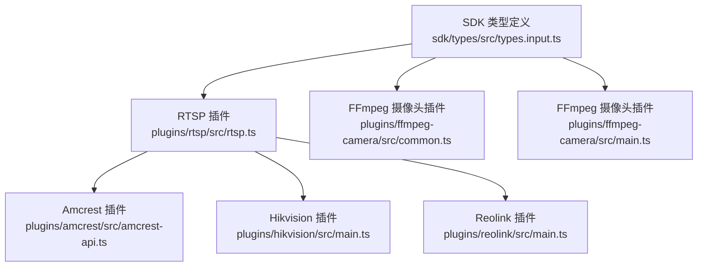
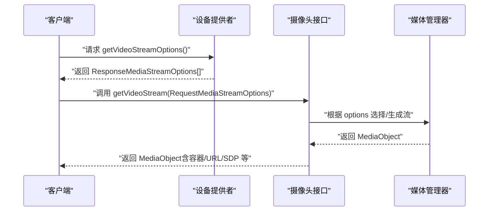
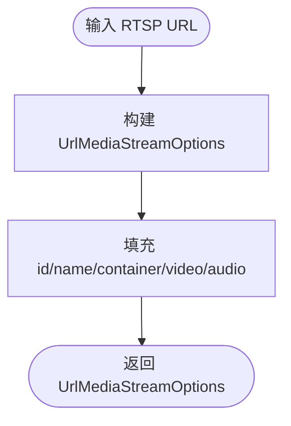
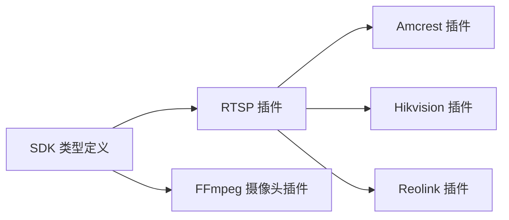

# 媒体流选项模型

<cite>
**本文引用的文件**
- [sdk/types/src/types.input.ts](file://sdk/types/src/types.input.ts)
- [plugins/rtsp/src/rtsp.ts](file://plugins/rtsp/src/rtsp.ts)
- [plugins/ffmpeg-camera/src/common.ts](file://plugins/ffmpeg-camera/src/common.ts)
- [plugins/ffmpeg-camera/src/main.ts](file://plugins/ffmpeg-camera/src/main.ts)
- [plugins/amcrest/src/amcrest-api.ts](file://plugins/amcrest/src/amcrest-api.ts)
- [plugins/hikvision/src/main.ts](file://plugins/hikvision/src/main.ts)
- [plugins/reolink/src/main.ts](file://plugins/reolink/src/main.ts)
</cite>

## 目录
1. [简介](#简介)
2. [项目结构](#项目结构)
3. [核心组件](#核心组件)
4. [架构总览](#架构总览)
5. [详细组件分析](#详细组件分析)
6. [依赖关系分析](#依赖关系分析)
7. [性能考量](#性能考量)
8. [故障排查指南](#故障排查指南)
9. [结论](#结论)
10. [附录](#附录)

## 简介
本文件系统化梳理 Scrypted 媒体流选项模型，围绕以下目标展开：
- 全面解析 MediaStreamOptions 接口的结构与语义，包括 id、name、prebuffer、container 等核心字段
- 深入说明 VideoStreamOptions 与 AudioStreamOptions 的参数定义（分辨率、比特率、帧率、编解码器、质量等）
- 解释 RequestMediaStreamOptions 的请求参数（route、destination、adaptive 等高级选项）
- 记录 ResponseMediaStreamOptions 的响应结构（refreshAt、sdp、destinations 等）
- 提供典型场景下的配置示例与优化策略，帮助开发者在不同设备与网络条件下做出合理选择

## 项目结构
Scrypted 的媒体流选项模型主要定义于 SDK 类型文件中，并在多个插件中被广泛使用与扩展。核心位置如下：
- SDK 类型定义：sdk/types/src/types.input.ts
- RTSP 插件：plugins/rtsp/src/rtsp.ts（提供 createRtspMediaStreamOptions 工具函数）
- FFmpeg 摄像头插件：plugins/ffmpeg-camera/src/common.ts 与 main.ts（基于 URL 的流选项与 FFmpeg 输入封装）
- ONVIF/Amcrest/Hikvision/Reolink 等插件通过 RTSP 工具函数生成多路流选项

**图表来源**
- [sdk/types/src/types.input.ts](file://sdk/types/src/types.input.ts)
- [plugins/rtsp/src/rtsp.ts](file://plugins/rtsp/src/rtsp.ts)
- [plugins/ffmpeg-camera/src/common.ts](file://plugins/ffmpeg-camera/src/common.ts)
- [plugins/ffmpeg-camera/src/main.ts](file://plugins/ffmpeg-camera/src/main.ts)
- [plugins/amcrest/src/amcrest-api.ts](file://plugins/amcrest/src/amcrest-api.ts)
- [plugins/hikvision/src/main.ts](file://plugins/hikvision/src/main.ts)
- [plugins/reolink/src/main.ts](file://plugins/reolink/src/main.ts)

**章节来源**
- [sdk/types/src/types.input.ts](file://sdk/types/src/types.input.ts)
- [plugins/rtsp/src/rtsp.ts](file://plugins/rtsp/src/rtsp.ts)
- [plugins/ffmpeg-camera/src/common.ts](file://plugins/ffmpeg-camera/src/common.ts)
- [plugins/ffmpeg-camera/src/main.ts](file://plugins/ffmpeg-camera/src/main.ts)
- [plugins/amcrest/src/amcrest-api.ts](file://plugins/amcrest/src/amcrest-api.ts)
- [plugins/hikvision/src/main.ts](file://plugins/hikvision/src/main.ts)
- [plugins/reolink/src/main.ts](file://plugins/reolink/src/main.ts)

## 核心组件
本节对媒体流选项模型的关键接口进行逐项说明，结合 SDK 类型定义与插件实现，给出字段含义、可选范围与典型用法。

- MediaStreamOptions（媒体流通用选项）
  - id：流标识符，用于精确选择某一路码流
  - name：流名称，便于用户识别
  - prebuffer：预缓冲时长（毫秒）与 prebufferBytes：预缓冲字节数，用于降低首开延迟
  - container：容器类型（如 mp4、mpegts、rtsp），决定封装格式
  - metadata：流特定元数据
  - tool：写入/读取容器所用工具（如 ffmpeg、scrypted、gstreamer）
  - video/audio：分别嵌套视频/音频参数对象
- ResponseMediaStreamOptions（响应式流选项）
  - 在 MediaStreamOptions 基础上强制要求 id；新增 refreshAt（刷新时间）、source（本地/云端/合成）、userConfigurable、sdp（会话描述协议）、oobCodecParameters（带外编解码参数）、destinations（目的地集合）、allowBatteryPrebuffer（允许电池设备预缓冲）
- RequestMediaStreamOptions（请求式流选项）
  - 在 MediaStreamOptions 基础上新增 route（external/direct/internal）、refresh（是否周期性刷新快照）、destination（目标类型提示）、destinationId（目标 IP）、destinationType（调用方包名）、adaptive（自适应比特率开关或细化选项）、以及嵌套的 RequestVideoStreamOptions/RequestAudioStreamOptions
- VideoStreamOptions（视频参数）
  - codec/profile：编码器与配置档
  - width/height：分辨率
  - bitrate/bitrateControl/minBitrate/maxBitrate：码率与控制模式
  - fps：帧率
  - quality：质量等级（数值越高通常画质越好但码率更高）
  - keyframeInterval：关键帧间隔（帧）
  - h264Info：H264 特定能力位（SEI、STAP-A/B、MTAP、FU-A/B 等）
- AudioStreamOptions（音频参数）
  - codec/encoder/profile：编码器、编码器实现与配置档
  - bitrate：码率
  - sampleRate：采样率
- RequestVideoStreamOptions/RequestAudioStreamOptions
  - 继承对应请求参数并可扩展（如客户端分辨率提示等）

上述字段均来自 SDK 类型定义文件，确保跨插件一致性与可移植性。

**章节来源**
- [sdk/types/src/types.input.ts](file://sdk/types/src/types.input.ts)

## 架构总览
下图展示了从请求到响应的媒体流选项流转过程，涵盖请求参数、响应结构与典型目的地类型。

**图表来源**
- [sdk/types/src/types.input.ts](file://sdk/types/src/types.input.ts)

**章节来源**
- [sdk/types/src/types.input.ts](file://sdk/types/src/types.input.ts)

## 详细组件分析

### MediaStreamOptions 结构详解
- 字段与语义
  - id：唯一标识某一路码流，用于精确选择
  - name：显示名称，便于用户界面呈现
  - prebuffer/prebufferBytes：预缓冲策略，减少首开与抖动
  - container：封装格式（如 rtsp、mpegts、mp4），影响兼容性与传输方式
  - metadata/tool：元数据与工具链提示
  - video/audio：嵌套参数对象，分别承载视频/音频配置
- 典型用途
  - 多路码流场景（主子码流、不同分辨率）
  - 设备能力与网络条件适配（容器选择、预缓冲策略）

**章节来源**
- [sdk/types/src/types.input.ts](file://sdk/types/src/types.input.ts)

### ResponseMediaStreamOptions 响应结构
- 关键字段
  - id：强制要求，确保客户端能稳定定位流
  - refreshAt：建议刷新时间（毫秒），避免过期
  - source：流来源（local/remote/cloud/synthetic）
  - userConfigurable：是否允许用户调整
  - sdp：会话描述协议（当编解码参数为带外提供时）
  - oobCodecParameters：带外编解码参数标志
  - destinations：可用目的地集合（local/remote/低/中/高分辨率/录制器等）
  - allowBatteryPrebuffer：允许电池设备进行预缓冲
- 使用场景
  - 客户端据此决定拉流策略、刷新时机与目的地路由

**章节来源**
- [sdk/types/src/types.input.ts](file://sdk/types/src/types.input.ts)

### RequestMediaStreamOptions 请求参数
- 关键字段
  - route：external（对外暴露）、direct（直连源）、internal（内部路由）
  - refresh：是否周期性刷新快照
  - destination：目标类型提示（主/子码流选择依据）
  - destinationId/destinationType：目标 IP 与调用方包名，用于日志与自适应指纹
  - adaptive：自适应比特率开关或细化选项（丢包/关键帧/重配置/尺寸切换/编解码器切换）
  - video/audio：嵌套请求参数，携带客户端偏好（如分辨率、帧率、码率）
- 作用机制
  - 服务端据此选择最优码流、协商 SDP、启用反馈回调以动态调整

**章节来源**
- [sdk/types/src/types.input.ts](file://sdk/types/src/types.input.ts)

### VideoStreamOptions 与 AudioStreamOptions 参数
- 视频参数
  - 编解码器与配置档：codec/profile
  - 分辨率：width/height
  - 码率：bitrate/bitrateControl/minBitrate/maxBitrate
  - 帧率：fps
  - 质量：quality
  - 关键帧间隔：keyframeInterval
  - H264 能力位：h264Info（SEI、STAP-A/B、MTAP、FU-A/B 等）
- 音频参数
  - 编解码器与编码器实现：codec/encoder
  - 配置档：profile
  - 码率与采样率：bitrate/sampleRate
- 实践要点
  - 高分辨率高帧率高码率带来更好画质但也增加带宽与处理压力
  - 合理设置 keyframeInterval 有助于快速定位与低延迟播放
  - quality 作为抽象质量等级，具体映射由实现决定

**章节来源**
- [sdk/types/src/types.input.ts](file://sdk/types/src/types.input.ts)

### RequestVideoStreamOptions 与 RequestAudioStreamOptions
- 扩展点
  - RequestVideoStreamOptions 可携带客户端分辨率提示（clientWidth/clientHeight）
  - RequestAudioStreamOptions 支持指定音频编码偏好
- 用途
  - 服务端据此进行自适应选择与回退策略

**章节来源**
- [sdk/types/src/types.input.ts](file://sdk/types/src/types.input.ts)

### RTSP 工具函数与插件集成
- createRtspMediaStreamOptions
  - 作用：将 RTSP URL 封装为 UrlMediaStreamOptions，自动填充 id/name/container/video/audio 等基础字段
  - 返回值：UrlMediaStreamOptions（继承 ResponseMediaStreamOptions 并增加 url）
- 插件使用
  - Amcrest/Hikvision/Reolink 等插件通过该函数批量生成多路流选项
  - FFmpeg 摄像头插件也采用类似的 UrlMediaStreamOptions 模式，统一了流选项结构

**图表来源**
- [plugins/rtsp/src/rtsp.ts](file://plugins/rtsp/src/rtsp.ts)
- [plugins/ffmpeg-camera/src/common.ts](file://plugins/ffmpeg-camera/src/common.ts)

**章节来源**
- [plugins/rtsp/src/rtsp.ts](file://plugins/rtsp/src/rtsp.ts)
- [plugins/ffmpeg-camera/src/common.ts](file://plugins/ffmpeg-camera/src/common.ts)
- [plugins/ffmpeg-camera/src/main.ts](file://plugins/ffmpeg-camera/src/main.ts)
- [plugins/amcrest/src/amcrest-api.ts](file://plugins/amcrest/src/amcrest-api.ts)
- [plugins/hikvision/src/main.ts](file://plugins/hikvision/src/main.ts)
- [plugins/reolink/src/main.ts](file://plugins/reolink/src/main.ts)

## 依赖关系分析
- SDK 类型定义是所有插件的契约层，确保 MediaStreamOptions/ResponseMediaStreamOptions/RequestMediaStreamOptions 的一致性
- RTSP 插件提供 createRtspMediaStreamOptions 工具函数，被 Amcrest/Hikvision/Reolink 等 ONVIF 设备插件广泛复用
- FFmpeg 摄像头插件采用 UrlMediaStreamOptions 作为统一的流选项载体，便于与媒体管理器对接

**图表来源**
- [sdk/types/src/types.input.ts](file://sdk/types/src/types.input.ts)
- [plugins/rtsp/src/rtsp.ts](file://plugins/rtsp/src/rtsp.ts)
- [plugins/ffmpeg-camera/src/common.ts](file://plugins/ffmpeg-camera/src/common.ts)
- [plugins/amcrest/src/amcrest-api.ts](file://plugins/amcrest/src/amcrest-api.ts)
- [plugins/hikvision/src/main.ts](file://plugins/hikvision/src/main.ts)
- [plugins/reolink/src/main.ts](file://plugins/reolink/src/main.ts)

**章节来源**
- [sdk/types/src/types.input.ts](file://sdk/types/src/types.input.ts)
- [plugins/rtsp/src/rtsp.ts](file://plugins/rtsp/src/rtsp.ts)
- [plugins/ffmpeg-camera/src/common.ts](file://plugins/ffmpeg-camera/src/common.ts)
- [plugins/amcrest/src/amcrest-api.ts](file://plugins/amcrest/src/amcrest-api.ts)
- [plugins/hikvision/src/main.ts](file://plugins/hikvision/src/main.ts)
- [plugins/reolink/src/main.ts](file://plugins/reolink/src/main.ts)

## 性能考量
- 预缓冲策略
  - 合理设置 prebuffer/prebufferBytes，可在弱网或高延迟环境下显著降低首开与卡顿
  - 对电池供电设备，可通过 allowBatteryPrebuffer 强制允许预缓冲，平衡续航与体验
- 容器与编解码
  - 优先选择兼容性好且硬件支持的容器与编解码器（如 H.264/H.265、AAC）
  - 带外编解码参数（oobCodecParameters/sdp）可减少内联参数开销，提升握手效率
- 自适应比特率
  - 启用 adaptive 并配合反馈接口（报告丢包、估计最大比特率、请求关键帧、重配置等）实现动态优化
- 目的地与路由
  - route=direct 可绕过中间节点，降低延迟；route=external 适合对外暴露；route=internal 适合局域网内部
  - destination/destinationType 有助于服务端进行目的地感知与历史动态比特率跟踪

[本节为通用指导，不直接分析具体文件]

## 故障排查指南
- 常见问题与定位
  - 流不可用：检查 id 是否正确、container 是否匹配、sdp 是否缺失（若带外参数）
  - 卡顿/延迟高：增大 prebuffer/prebufferBytes 或切换更优的 route
  - 画质异常：核对 video/audio 的分辨率、帧率、码率与编解码器配置
  - 无法自适应：确认 adaptive 开关与反馈接口（reportPacketLoss/reportEstimatedMaxBitrate/requestKeyframe 等）是否启用
- 日志与诊断
  - destinationType 与 destinationId 有助于定位目标应用与网络路径
  - refreshAt 过期导致频繁刷新，需调整刷新策略或服务端配置

**章节来源**
- [sdk/types/src/types.input.ts](file://sdk/types/src/types.input.ts)

## 结论
Scrypted 的媒体流选项模型通过 SDK 类型定义实现了跨插件的一致性与可扩展性。借助 MediaStreamOptions/ResponseMediaStreamOptions/RequestMediaStreamOptions 三类接口，开发者可以在不同设备与网络条件下灵活配置与优化媒体流。结合 RTSP 工具函数与插件实践，可以快速生成多路码流并实现自适应与高质量播放体验。

[本节为总结性内容，不直接分析具体文件]

## 附录

### 示例：多场景下的流参数设置与优化策略
- 高清监控场景（低延迟、高画质）
  - container：mpegts 或 rtsp
  - video：较高分辨率与帧率，适当提高码率与质量等级
  - audio：开启 AAC，设置合适采样率
  - route：direct
  - adaptive：开启并上报丢包与最大估计比特率
- 移动端观看场景（带宽受限）
  - container：mp4 或 rtsp
  - video：中等分辨率与帧率，启用自适应比特率
  - audio：AAC，适度降低码率
  - route：external（便于边缘缓存）
  - adaptive：启用 resize 与 reconfigure
- 电池供电设备（续航优先）
  - 设置 allowBatteryPrebuffer 为 true
  - 降低初始码率与分辨率
  - 增大 refreshAt，减少频繁刷新

[本节为概念性示例，不直接分析具体文件]