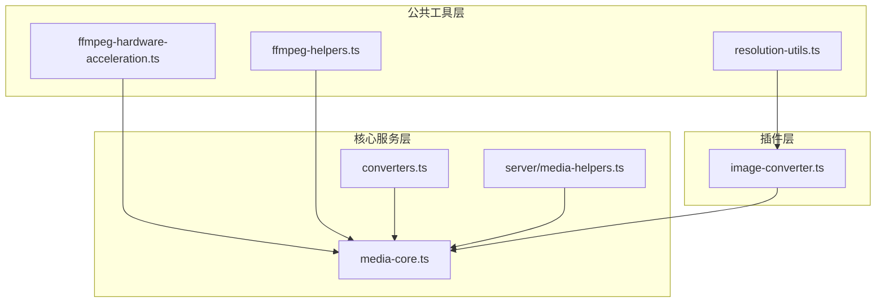
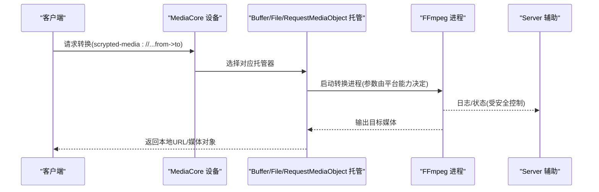
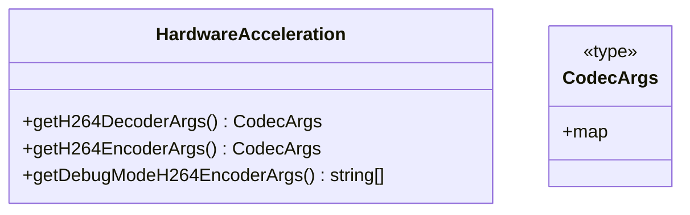
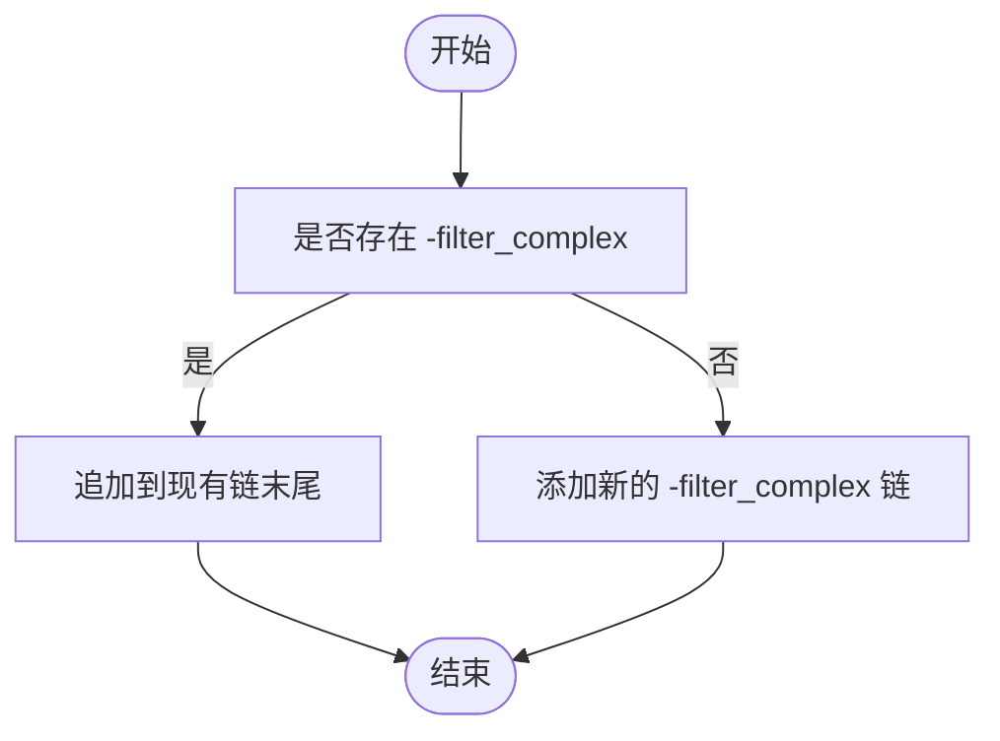
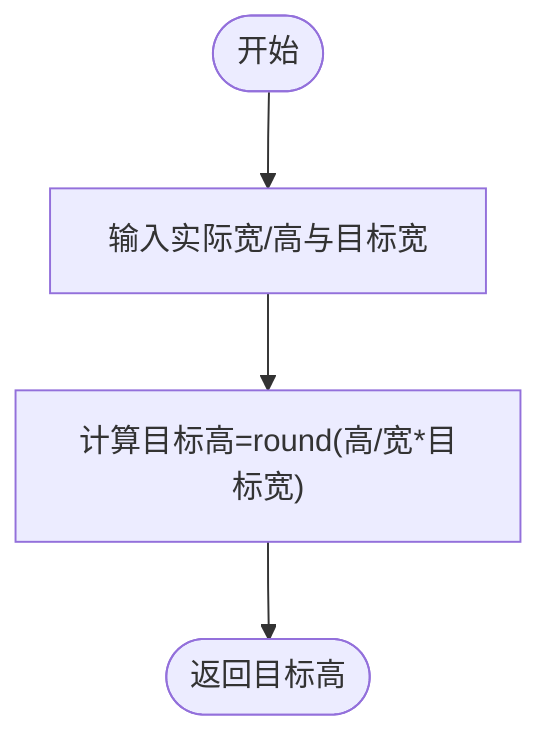
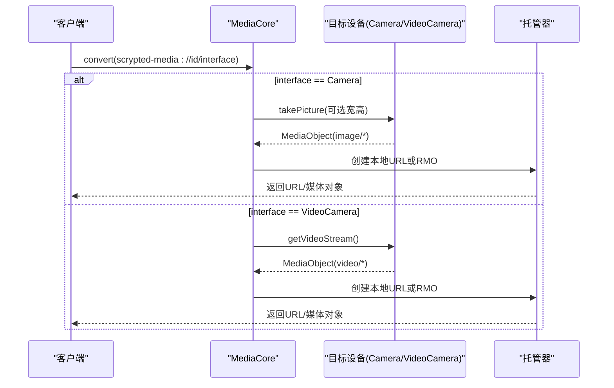
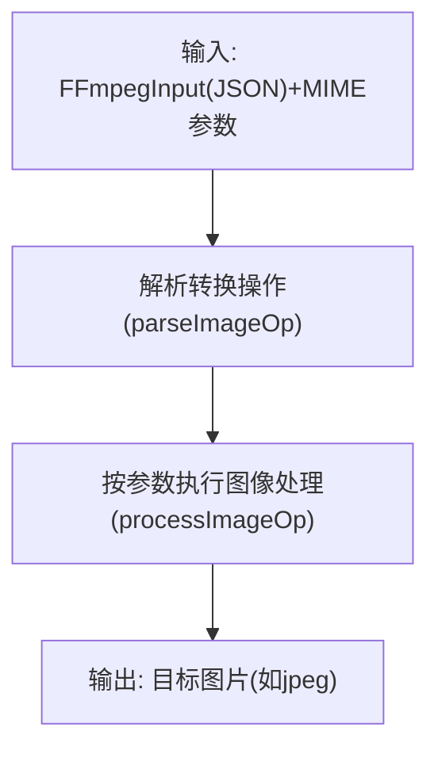
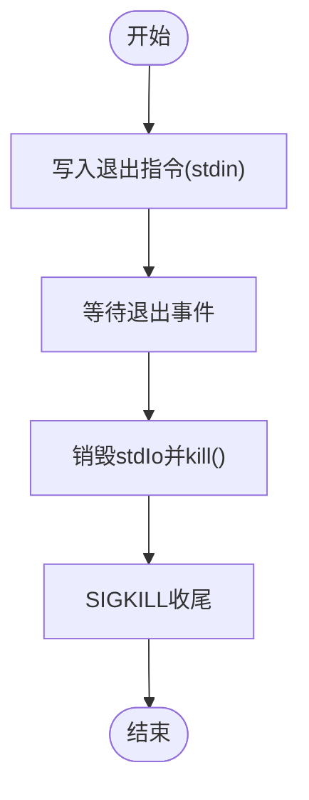
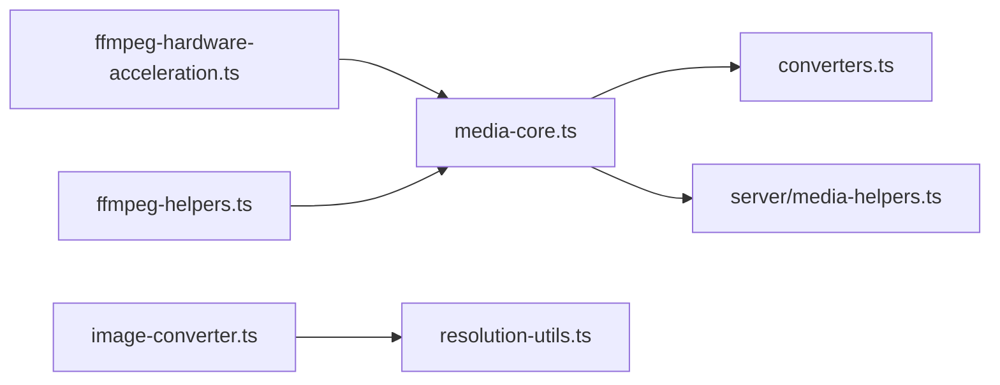

# 媒体转换模型

<cite>
**本文引用的文件**
- [common/src/ffmpeg-hardware-acceleration.ts](file://common/src/ffmpeg-hardware-acceleration.ts)
- [common/src/ffmpeg-helpers.ts](file://common/src/ffmpeg-helpers.ts)
- [common/src/resolution-utils.ts](file://common/src/resolution-utils.ts)
- [plugins/core/src/converters.ts](file://plugins/core/src/converters.ts)
- [plugins/core/src/media-core.ts](file://plugins/core/src/media-core.ts)
- [plugins/snapshot/src/image-converter.ts](file://plugins/snapshot/src/image-converter.ts)
- [server/src/media-helpers.ts](file://server/src/media-helpers.ts)
</cite>

## 目录
1. [简介](#简介)
2. [项目结构](#项目结构)
3. [核心组件](#核心组件)
4. [架构总览](#架构总览)
5. [详细组件分析](#详细组件分析)
6. [依赖关系分析](#依赖关系分析)
7. [性能考虑](#性能考虑)
8. [故障排查指南](#故障排查指南)
9. [结论](#结论)
10. [附录](#附录)

## 简介
本文件系统性梳理 Scrypted 的媒体转换模型，聚焦以下方面：
- 目标 MIME 类型与转换范围：视频（mp4、webm、hls）、音频（aac、mp3、opus）、图片（jpg、png、webp）等目标格式的定义与适配路径
- 转换参数配置：分辨率、比特率、编码器、质量等关键参数的来源与使用方式
- 转换状态管理：进度跟踪、错误处理、超时控制、重试策略
- 性能优化：硬件加速、并行转换、缓存机制
- 实际应用示例：设备间格式兼容、客户端适配、存储优化

## 项目结构
围绕媒体转换的关键模块主要分布在以下位置：
- 公共工具层：FFmpeg 硬件加速、过滤器拼接、分辨率计算等
- 核心服务层：媒体核心设备、缓冲区与文件托管、请求式媒体对象托管
- 插件层：图片转换器、媒体核心插件
- 服务器辅助：FFmpeg 进程安全控制、日志输出与参数脱敏

**图表来源**
- [common/src/ffmpeg-hardware-acceleration.ts](file://common/src/ffmpeg-hardware-acceleration.ts)
- [common/src/ffmpeg-helpers.ts](file://common/src/ffmpeg-helpers.ts)
- [common/src/resolution-utils.ts](file://common/src/resolution-utils.ts)
- [plugins/core/src/media-core.ts](file://plugins/core/src/media-core.ts)
- [plugins/core/src/converters.ts](file://plugins/core/src/converters.ts)
- [plugins/snapshot/src/image-converter.ts](file://plugins/snapshot/src/image-converter.ts)
- [server/src/media-helpers.ts](file://server/src/media-helpers.ts)

**章节来源**
- [plugins/core/src/media-core.ts](file://plugins/core/src/media-core.ts)
- [plugins/core/src/converters.ts](file://plugins/core/src/converters.ts)
- [plugins/snapshot/src/image-converter.ts](file://plugins/snapshot/src/image-converter.ts)
- [common/src/ffmpeg-hardware-acceleration.ts](file://common/src/ffmpeg-hardware-acceleration.ts)
- [common/src/ffmpeg-helpers.ts](file://common/src/ffmpeg-helpers.ts)
- [common/src/resolution-utils.ts](file://common/src/resolution-utils.ts)
- [server/src/media-helpers.ts](file://server/src/media-helpers.ts)

## 核心组件
- 硬件加速与编码器选择：根据平台自动选择最优解码/编码器，并提供调试模式下的软编参数
- FFmpeg 参数拼接：统一追加滤镜链路，避免重复覆盖
- 分辨率计算：按宽高比适配目标宽度
- 缓冲区与文件托管：将二进制或本地文件暴露为可访问的本地 URL，支持安全/非安全端点
- 请求式媒体对象托管：将异步获取的媒体流或图片以可下载的媒体对象形式返回
- 图片转换器：基于 MIME 参数解析与 FFmpeg 处理流程生成目标图片
- FFmpeg 进程安全控制：优雅停止、日志过滤与参数脱敏

**章节来源**
- [common/src/ffmpeg-hardware-acceleration.ts](file://common/src/ffmpeg-hardware-acceleration.ts)
- [common/src/ffmpeg-helpers.ts](file://common/src/ffmpeg-helpers.ts)
- [common/src/resolution-utils.ts](file://common/src/resolution-utils.ts)
- [plugins/core/src/converters.ts](file://plugins/core/src/converters.ts)
- [plugins/core/src/media-core.ts](file://plugins/core/src/media-core.ts)
- [plugins/snapshot/src/image-converter.ts](file://plugins/snapshot/src/image-converter.ts)
- [server/src/media-helpers.ts](file://server/src/media-helpers.ts)

## 架构总览
媒体转换在 Scrypted 中通过“设备 + 转换器 + 托管服务”的组合实现：
- 设备侧提供原始媒体输入（相机截图、视频流）
- 转换器负责将输入转换为目标 MIME 类型
- 托管服务将转换结果以本地 URL 或媒体对象形式对外提供
- 平台根据平台能力选择硬件加速或软件编码器

**图表来源**
- [plugins/core/src/media-core.ts](file://plugins/core/src/media-core.ts)
- [plugins/core/src/converters.ts](file://plugins/core/src/converters.ts)
- [server/src/media-helpers.ts](file://server/src/media-helpers.ts)

## 详细组件分析

### 硬件加速与编码器选择
- 解码器选择：针对不同平台（Linux/macOS/Windows/Raspberry Pi）提供多种解码方案；Linux 下包含 V4L2、VAAPI、CUDA/CUVID 等；macOS 使用 VideoToolbox；Windows 提供 QuickSync/AMF/NVENC 等
- 编码器选择：同平台下优先硬件编码，否则回退到 libx264（软件）；调试模式提供低延迟参数组合
- 参数组织：以键值对映射的形式返回编码器参数，便于上层按需拼接

**图表来源**
- [common/src/ffmpeg-hardware-acceleration.ts](file://common/src/ffmpeg-hardware-acceleration.ts)

**章节来源**
- [common/src/ffmpeg-hardware-acceleration.ts](file://common/src/ffmpeg-hardware-acceleration.ts)

### FFmpeg 参数拼接与滤镜链
- 统一追加滤镜：当存在复合滤镜时，新滤镜会拼接到现有链末尾，避免覆盖
- 参数安全打印：对包含输入地址的参数进行脱敏，保护敏感信息

**图表来源**
- [common/src/ffmpeg-helpers.ts](file://common/src/ffmpeg-helpers.ts)

**章节来源**
- [common/src/ffmpeg-helpers.ts](file://common/src/ffmpeg-helpers.ts)

### 分辨率适配
- 按宽高比计算目标高度，保证画面比例不变形
- 可用于图片缩放、视频转码前的尺寸预处理

**图表来源**
- [common/src/resolution-utils.ts](file://common/src/resolution-utils.ts)

**章节来源**
- [common/src/resolution-utils.ts](file://common/src/resolution-utils.ts)

### 缓冲区与文件托管
- BufferHost：将内存中的二进制数据以本地 URL 形式暴露，支持安全/非安全端点
- FileHost：将本地文件以带缓存友好哈希的路径暴露，支持安全/非安全端点
- RequestMediaObjectHost：将异步获取的媒体对象转换为可下载的媒体对象或本地 URL

**图表来源**
- [plugins/core/src/converters.ts](file://plugins/core/src/converters.ts)

**章节来源**
- [plugins/core/src/converters.ts](file://plugins/core/src/converters.ts)

### 媒体核心设备
- 提供统一入口，将 scrypted-media 协议转换为具体设备操作（如拍照、取流）
- 支持本地快照 URL 生成与请求式媒体对象封装
- 注册多个子设备（HTTP/HTTPS Buffer Host、File Host、RequestMediaObject Host）

**图表来源**
- [plugins/core/src/media-core.ts](file://plugins/core/src/media-core.ts)

**章节来源**
- [plugins/core/src/media-core.ts](file://plugins/core/src/media-core.ts)

### 图片转换器
- 输入：FFmpegInput JSON 与目标 MIME 参数（含时间戳、尺寸等）
- 处理：解析转换操作，调用 FFmpeg 流程生成目标图片（如 jpeg）

**图表来源**
- [plugins/snapshot/src/image-converter.ts](file://plugins/snapshot/src/image-converter.ts)

**章节来源**
- [plugins/snapshot/src/image-converter.ts](file://plugins/snapshot/src/image-converter.ts)

### FFmpeg 进程安全控制
- 安全停止：向 stdin 写入退出指令，等待退出后强制销毁 stdio 并发送 SIGKILL
- 初始输出日志：过滤无关噪声，仅在检测到帧/大小信息后减少日志量
- 参数脱敏：对包含输入地址的参数进行脱敏显示，保护凭据

**图表来源**
- [server/src/media-helpers.ts](file://server/src/media-helpers.ts)

**章节来源**
- [server/src/media-helpers.ts](file://server/src/media-helpers.ts)

## 依赖关系分析
- MediaCore 依赖 converters 提供的托管器，以及 server 的媒体辅助能力
- ImageConverter 依赖解析与处理函数，结合 FFmpegInput 执行转换
- ffmpeg-hardware-acceleration 为上层提供编码/解码器参数，贯穿转换链路
- ffmpeg-helpers 提供滤镜拼接与参数脱敏，保障转换参数一致性与安全性
- resolution-utils 为图片/视频尺寸适配提供基础算法

**图表来源**
- [plugins/core/src/media-core.ts](file://plugins/core/src/media-core.ts)
- [plugins/core/src/converters.ts](file://plugins/core/src/converters.ts)
- [plugins/snapshot/src/image-converter.ts](file://plugins/snapshot/src/image-converter.ts)
- [common/src/resolution-utils.ts](file://common/src/resolution-utils.ts)
- [common/src/ffmpeg-hardware-acceleration.ts](file://common/src/ffmpeg-hardware-acceleration.ts)
- [common/src/ffmpeg-helpers.ts](file://common/src/ffmpeg-helpers.ts)
- [server/src/media-helpers.ts](file://server/src/media-helpers.ts)

**章节来源**
- [plugins/core/src/media-core.ts](file://plugins/core/src/media-core.ts)
- [plugins/core/src/converters.ts](file://plugins/core/src/converters.ts)
- [plugins/snapshot/src/image-converter.ts](file://plugins/snapshot/src/image-converter.ts)
- [common/src/resolution-utils.ts](file://common/src/resolution-utils.ts)
- [common/src/ffmpeg-hardware-acceleration.ts](file://common/src/ffmpeg-hardware-acceleration.ts)
- [common/src/ffmpeg-helpers.ts](file://common/src/ffmpeg-helpers.ts)
- [server/src/media-helpers.ts](file://server/src/media-helpers.ts)

## 性能考虑
- 硬件加速：根据平台自动选择最优解码/编码器，显著降低 CPU 占用
- 并行转换：通过多实例托管器与独立 FFmpeg 进程实现并发处理
- 缓存机制：托管器对资源设置定时清理，避免内存泄漏；图片托管采用哈希命名提升浏览器缓存命中
- 日志与参数控制：初始日志节流与参数脱敏，减少噪音与潜在风险

**章节来源**
- [common/src/ffmpeg-hardware-acceleration.ts](file://common/src/ffmpeg-hardware-acceleration.ts)
- [plugins/core/src/converters.ts](file://plugins/core/src/converters.ts)
- [server/src/media-helpers.ts](file://server/src/media-helpers.ts)

## 故障排查指南
- FFmpeg 进程无法正常退出：检查是否正确触发退出指令，必要时启用安全停止流程
- 日志噪声过多：可通过环境变量或存储项开启/关闭详细日志；注意初始日志节流逻辑
- 参数泄露风险：确认已启用参数脱敏，避免在日志中暴露敏感地址
- 转换失败或黑屏：核对硬件加速参数与平台兼容性；必要时切换为软件编码器

**章节来源**
- [server/src/media-helpers.ts](file://server/src/media-helpers.ts)

## 结论
Scrypted 的媒体转换模型以“平台感知的硬件加速 + 统一的参数拼接 + 多种托管策略”为核心，既保证了跨平台兼容性，又提供了灵活的扩展空间。通过合理的参数配置、状态管理与性能优化，能够满足设备间格式兼容、客户端适配与存储优化等常见需求。

## 附录

### 目标 MIME 类型与转换范围
- 视频：mp4、webm、hls（由上层协议与容器能力决定）
- 音频：aac、mp3、opus（由容器与编码器能力决定）
- 图片：jpg、png、webp（由转换器与容器能力决定）
- 说明：具体可用目标取决于平台 FFmpeg 能力与托管器配置

**章节来源**
- [plugins/core/src/media-core.ts](file://plugins/core/src/media-core.ts)
- [plugins/snapshot/src/image-converter.ts](file://plugins/snapshot/src/image-converter.ts)

### 关键参数配置要点
- 分辨率：使用宽高比适配计算目标高度，确保画面比例一致
- 编码器：优先硬件编码，回退至软件编码；调试模式使用低延迟参数
- 滤镜链：统一追加，避免覆盖已有复杂滤镜
- 质量/比特率：由上层媒体对象选项与容器能力共同决定

**章节来源**
- [common/src/resolution-utils.ts](file://common/src/resolution-utils.ts)
- [common/src/ffmpeg-hardware-acceleration.ts](file://common/src/ffmpeg-hardware-acceleration.ts)
- [common/src/ffmpeg-helpers.ts](file://common/src/ffmpeg-helpers.ts)

### 状态管理与错误处理
- 进度跟踪：通过日志节流与帧/大小检测实现轻量进度提示
- 错误处理：托管器捕获异常并清理资源，避免悬挂连接
- 超时控制：托管器对资源设置定时清理，防止长期占用
- 重试策略：建议在上层业务侧进行幂等重试，避免重复触发转换

**章节来源**
- [plugins/core/src/converters.ts](file://plugins/core/src/converters.ts)
- [server/src/media-helpers.ts](file://server/src/media-helpers.ts)

### 实际应用示例
- 设备间媒体格式兼容：通过 MediaCore 将不同设备的输出统一转换为目标容器与编码
- 客户端适配：根据客户端能力选择合适的目标格式（如 mp4/webm），并通过托管器提供本地 URL
- 存储优化：利用托管器的缓存友好命名与定时清理，减少重复转换与资源浪费

**章节来源**
- [plugins/core/src/media-core.ts](file://plugins/core/src/media-core.ts)
- [plugins/core/src/converters.ts](file://plugins/core/src/converters.ts)