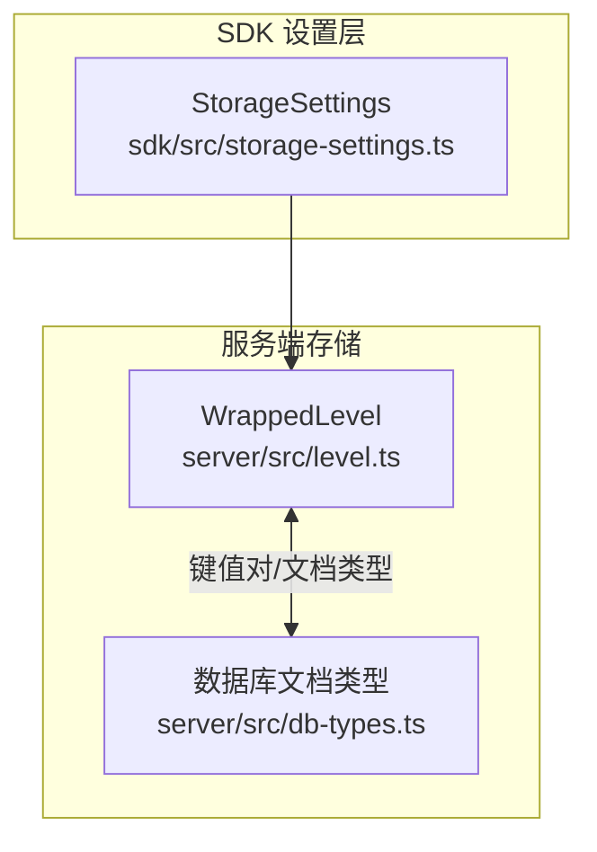
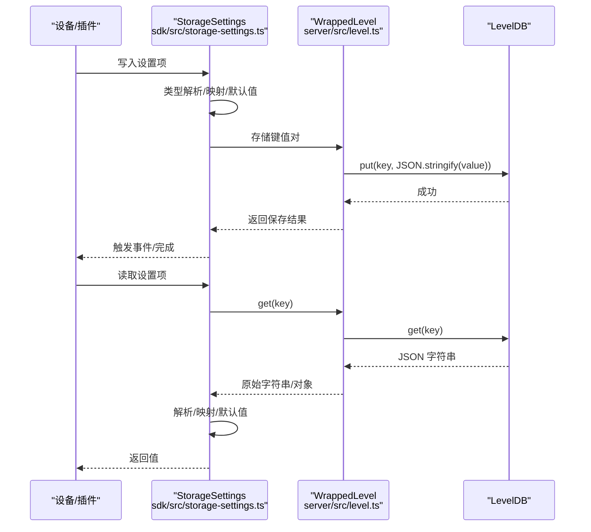
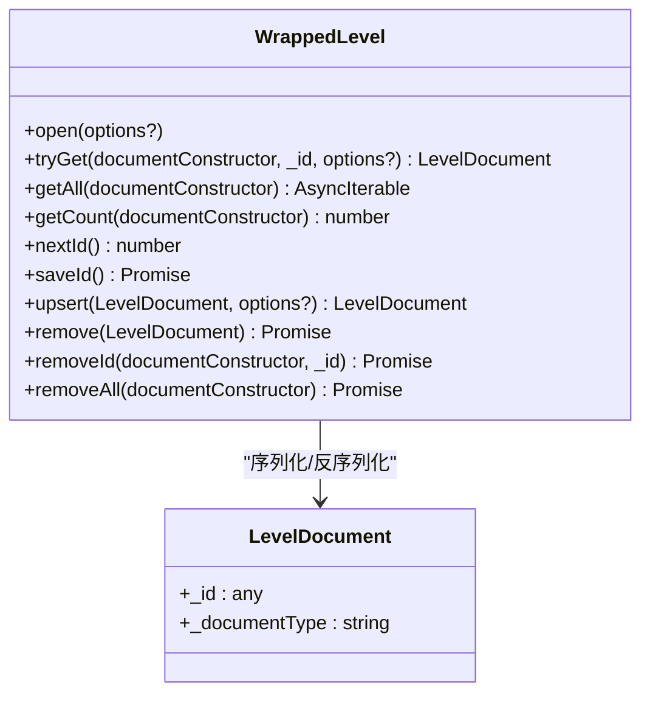
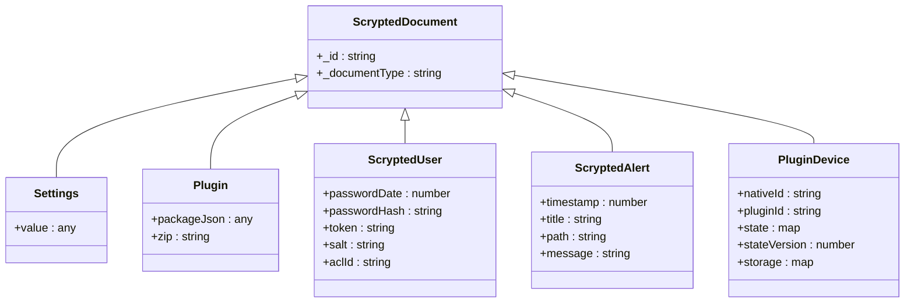
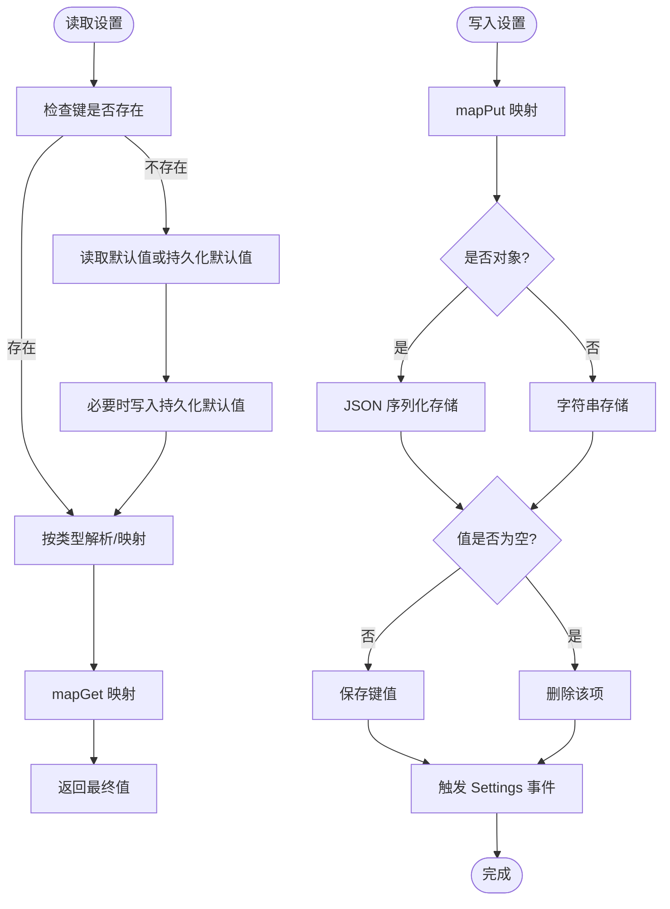
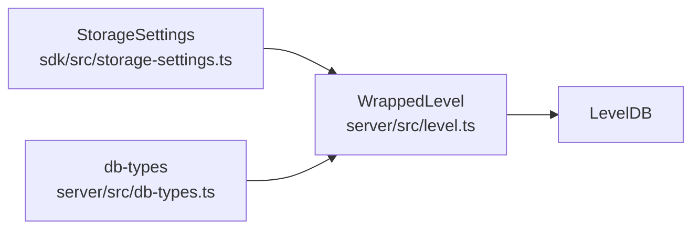

# 存储数据模型

<cite>
**本文引用的文件**
- [server/src/level.ts](file://server/src/level.ts)
- [server/src/db-types.ts](file://server/src/db-types.ts)
- [sdk/src/storage-settings.ts](file://sdk/src/storage-settings.ts)
</cite>

## 目录
1. [简介](#简介)
2. [项目结构](#项目结构)
3. [核心组件](#核心组件)
4. [架构总览](#架构总览)
5. [详细组件分析](#详细组件分析)
6. [依赖关系分析](#依赖关系分析)
7. [性能考量](#性能考量)
8. [故障排查指南](#故障排查指南)
9. [结论](#结论)
10. [附录](#附录)

## 简介
本文件面向 Scrypted 的存储系统数据模型，聚焦于基于 LevelDB 的键值存储方案，涵盖以下主题：
- 键值对格式与命名空间划分
- 文档类型与序列化策略（JSON）
- 状态持久化模型（设备状态、系统状态、用户与插件元数据等）
- 缓存与持久化边界（内存缓存、磁盘缓存、一致性与失效）
- 查询与索引模型（前缀扫描、迭代器使用）
- 数据迁移与版本演进
- 备份与恢复、清理与归档
- 大数据量与性能优化实践

## 项目结构
围绕存储系统的相关代码主要分布在以下模块：
- server/src/level.ts：封装 LevelDB 操作，提供统一的文档型存取接口与自增 ID 管理
- server/src/db-types.ts：定义系统级文档类型（Settings、Plugin、ScryptedUser、ScryptedAlert、PluginDevice 等）
- sdk/src/storage-settings.ts：设备侧设置与持久化抽象，提供类型安全的读写与映射

**图表来源**
- [server/src/level.ts:1-117](file://server/src/level.ts#L1-L117)
- [server/src/db-types.ts:1-44](file://server/src/db-types.ts#L1-L44)
- [sdk/src/storage-settings.ts:1-197](file://sdk/src/storage-settings.ts#L1-L197)

**章节来源**
- [server/src/level.ts:1-117](file://server/src/level.ts#L1-L117)
- [server/src/db-types.ts:1-44](file://server/src/db-types.ts#L1-L44)
- [sdk/src/storage-settings.ts:1-197](file://sdk/src/storage-settings.ts#L1-L197)

## 核心组件
- WrappedLevel：对 level 库的封装，提供文档型存取、自增 ID、批量删除、计数与迭代能力
- ScryptedDocument 及其子类：系统级文档类型，承载 Settings、Plugin、ScryptedUser、ScryptedAlert、PluginDevice 等
- StorageSettings：设备侧设置持久化抽象，负责类型解析、默认值、映射与事件通知

**章节来源**
- [server/src/level.ts:18-114](file://server/src/level.ts#L18-L114)
- [server/src/db-types.ts:4-43](file://server/src/db-types.ts#L4-L43)
- [sdk/src/storage-settings.ts:81-196](file://sdk/src/storage-settings.ts#L81-L196)

## 架构总览
下图展示了从 SDK 设置到服务端文档存储的整体链路，以及键空间划分与序列化路径。

**图表来源**
- [sdk/src/storage-settings.ts:154-177](file://sdk/src/storage-settings.ts#L154-L177)
- [server/src/level.ts:34-87](file://server/src/level.ts#L34-L87)

## 详细组件分析

### WrappedLevel：键空间与文档模型
- 键空间划分
  - 文档键格式：`${_documentType}/${_id}`，其中 _documentType 来源于构造函数名称，_id 由自增器维护
  - 前缀扫描：通过迭代器遍历并以 _documentType 前缀过滤，实现按类型批量读取
- 文档序列化
  - 写入：将对象 JSON 序列化为字符串
  - 读取：根据构造函数反序列化为实例，并校验 _documentType 一致性
- 自增 ID
  - 启动时从特殊键 "_id" 读取当前游标；若不存在则初始化为 0
  - 每次 upsert 且未指定 _id 时分配下一个整数 ID，并持久化游标
- 批量操作
  - getAll：按类型前缀迭代并返回实例
  - getCount：统计某类型文档数量
  - removeAll：按类型前缀删除全部文档
  - remove/removeId：按键删除单个文档

**图表来源**
- [server/src/level.ts:18-114](file://server/src/level.ts#L18-L114)
- [server/src/level.ts:3-10](file://server/src/level.ts#L3-L10)

**章节来源**
- [server/src/level.ts:18-114](file://server/src/level.ts#L18-L114)

### 系统文档类型：Settings、Plugin、ScryptedUser、ScryptedAlert、PluginDevice
- ScryptedDocument：所有系统文档的基类，具备 _id 与 _documentType
- Settings：键值设置文档，value 为任意 JSON 兼容结构
- Plugin：插件元数据，包含 packageJson 与 zip 等字段
- ScryptedUser：用户认证与权限文档，包含密码哈希、盐、令牌与 ACL 标识
- ScryptedAlert：告警信息，包含时间戳、标题、路径与消息
- PluginDevice：设备元数据与状态，包含 nativeId、pluginId、state、stateVersion、storage

**图表来源**
- [server/src/db-types.ts:4-43](file://server/src/db-types.ts#L4-L43)

**章节来源**
- [server/src/db-types.ts:4-43](file://server/src/db-types.ts#L4-L43)

### 设备设置持久化：StorageSettings
- 类型解析与映射
  - 支持 boolean、number、integer、array、device、json 字符串等类型
  - 对 array/json 类型进行安全解析，失败回退到默认值
  - 支持 mapPut/mapGet 在存取时进行转换
- 默认值与持久化默认值
  - 若未配置 persistedDefaultValue，则使用 defaultValue
  - 首次读取缺失值时，自动写入持久化默认值并返回
- 存储行为
  - 对象值 JSON 序列化存储；null/undefined 删除该项
  - 写入后触发 Settings 事件（若未隐藏）
- 与 WrappedLevel 的协作
  - 通过设备 storage 接口进行键值存取
  - 与服务端文档模型解耦，适用于设备侧独立持久化

**图表来源**
- [sdk/src/storage-settings.ts:5-58](file://sdk/src/storage-settings.ts#L5-L58)
- [sdk/src/storage-settings.ts:162-177](file://sdk/src/storage-settings.ts#L162-L177)
- [sdk/src/storage-settings.ts:179-191](file://sdk/src/storage-settings.ts#L179-L191)

**章节来源**
- [sdk/src/storage-settings.ts:5-58](file://sdk/src/storage-settings.ts#L5-L58)
- [sdk/src/storage-settings.ts:162-177](file://sdk/src/storage-settings.ts#L162-L177)
- [sdk/src/storage-settings.ts:179-191](file://sdk/src/storage-settings.ts#L179-L191)

### 查询与索引模型
- 前缀扫描
  - 通过迭代器遍历并以 _documentType 前缀过滤，实现按类型范围查询
- 复合索引
  - 当前实现未提供二级索引；可通过在 _id 或业务键中嵌入复合信息来模拟复合索引
- 排序与分页
  - LevelDB 键有序，可利用迭代器顺序遍历；分页可通过限制迭代次数与起始键实现
- 查询条件
  - 基于键前缀与键名匹配；复杂条件建议在上层应用层进行过滤

**章节来源**
- [server/src/level.ts:45-56](file://server/src/level.ts#L45-L56)
- [server/src/level.ts:102-113](file://server/src/level.ts#L102-L113)

### 缓存与一致性
- 内存缓存
  - StorageSettings 在进程内维护 values/hasValue，提供快速读取与默认值缓存
- 磁盘缓存
  - WrappedLevel 将文档序列化为字符串存储于 LevelDB
- 一致性与失效
  - 写入成功后触发 Settings 事件，通知订阅者刷新本地缓存
  - 批量删除与 removeAll 会立即生效，需确保上层缓存同步

**章节来源**
- [sdk/src/storage-settings.ts:81-119](file://sdk/src/storage-settings.ts#L81-L119)
- [sdk/src/storage-settings.ts:174-177](file://sdk/src/storage-settings.ts#L174-L177)
- [server/src/level.ts:102-113](file://server/src/level.ts#L102-L113)

### 数据迁移与版本演进
- 版本标识
  - 可通过 _documentType 或在文档内容中引入版本字段进行区分
- 结构变更
  - 迁移时读取旧结构，转换为新结构并重新 upsert
- 向后兼容
  - 读取时对缺失字段提供默认值；写入时仅保留兼容字段
- 迁移策略
  - 使用 getAll 遍历并逐条迁移；结合计数与事务性写入保障一致性

**章节来源**
- [server/src/level.ts:45-64](file://server/src/level.ts#L45-L64)
- [server/src/db-types.ts:4-43](file://server/src/db-types.ts#L4-L43)

### 备份与恢复
- 备份策略
  - 基于键空间导出：遍历 _documentType 前缀，导出 JSON 文档集合
- 增量备份
  - 可通过时间戳或版本号字段识别增量变更
- 完整性校验
  - 导出/导入前后对比文档数量与关键字段
- 恢复流程
  - 导入时按 _documentType 分类写入；若冲突采用覆盖或合并策略

**章节来源**
- [server/src/level.ts:45-56](file://server/src/level.ts#L45-L56)
- [server/src/level.ts:102-113](file://server/src/level.ts#L102-L113)

### 清理与归档
- 日志轮转与历史数据
  - 通过时间戳字段筛选过期数据；批量删除过期文档
- 存储空间管理
  - 使用 removeAll 清理无用类型；定期执行碎片整理（LevelDB 后台压缩）

**章节来源**
- [server/src/level.ts:102-113](file://server/src/level.ts#L102-L113)

## 依赖关系分析
- WrappedLevel 依赖 level 库提供的迭代器与键值操作
- ScryptedDocument 及其子类用于统一系统级文档的结构
- StorageSettings 依赖设备 storage 接口与系统管理器（用于 device 类型解析）

**图表来源**
- [sdk/src/storage-settings.ts:1-197](file://sdk/src/storage-settings.ts#L1-L197)
- [server/src/level.ts:1-117](file://server/src/level.ts#L1-L117)
- [server/src/db-types.ts:1-44](file://server/src/db-types.ts#L1-L44)

**章节来源**
- [sdk/src/storage-settings.ts:1-197](file://sdk/src/storage-settings.ts#L1-L197)
- [server/src/level.ts:1-117](file://server/src/level.ts#L1-L117)
- [server/src/db-types.ts:1-44](file://server/src/db-types.ts#L1-L44)

## 性能考量
- 键设计
  - 使用 `${_documentType}/${_id}` 作为键，便于按类型前缀扫描与删除
- 序列化开销
  - 文档统一 JSON 序列化，建议避免过大对象；必要时拆分为多个小文档
- 迭代与分页
  - 利用迭代器顺序遍历；分页通过限制迭代次数与起始键实现
- 压缩与吞吐
  - LevelDB 自带压缩；批量写入时减少随机写以提升吞吐

[本节为通用指导，无需列出具体文件来源]

## 故障排查指南
- 读取异常
  - tryGet 在键不存在或解析失败时返回空；检查 _documentType 与 JSON 格式
- 写入失败
  - upsert 会在序列化失败或键冲突时报错；确认对象可 JSON 化
- 计数与删除
  - getCount/getAll 依赖前缀匹配；确保 _documentType 与键格式一致
  - removeAll 会删除同类型全部文档，注意备份

**章节来源**
- [server/src/level.ts:34-43](file://server/src/level.ts#L34-L43)
- [server/src/level.ts:76-87](file://server/src/level.ts#L76-L87)
- [server/src/level.ts:58-64](file://server/src/level.ts#L58-L64)
- [server/src/level.ts:102-113](file://server/src/level.ts#L102-L113)

## 结论
Scrypted 的存储系统以 WrappedLevel 为核心，结合系统级文档类型与设备侧 StorageSettings，形成了清晰的键空间划分、文档序列化与持久化模型。通过前缀扫描与迭代器，系统实现了高效的范围查询与批量操作；配合默认值、映射与事件通知，保证了易用性与一致性。在扩展与运维方面，建议遵循键设计规范、合理拆分大文档、制定迁移与备份策略，并结合大数据量场景进行容量与性能规划。

[本节为总结性内容，无需列出具体文件来源]

## 附录
- 键空间示例
  - 用户文档：`ScryptedUser/123`
  - 插件文档：`Plugin/abc`
  - 设置文档：`Settings/xyz`
- 建议的扩展点
  - 引入二级索引（如需要复杂查询）
  - 增加文档版本字段与迁移工具
  - 提供批量导入/导出工具与校验机制

[本节为概念性内容，无需列出具体文件来源]