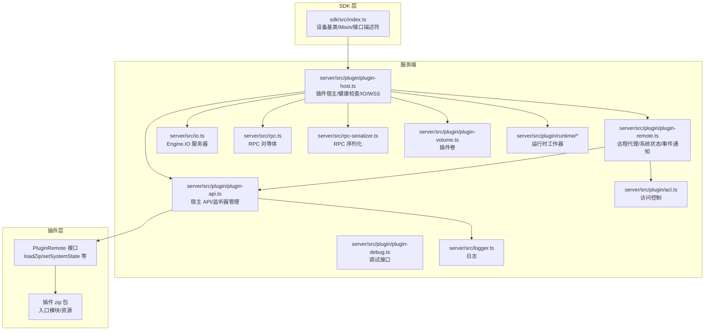
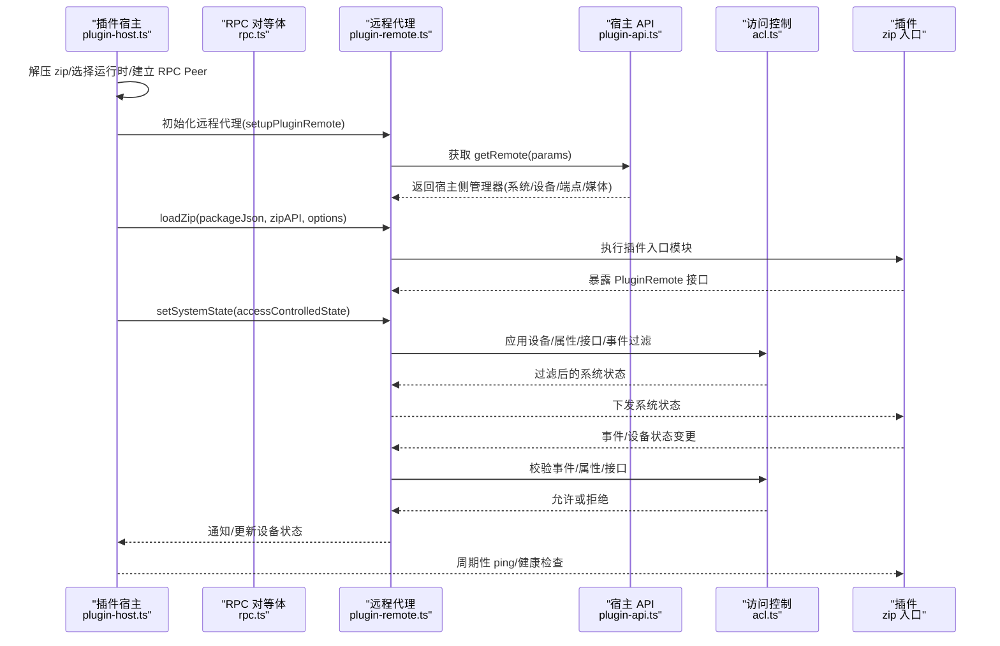
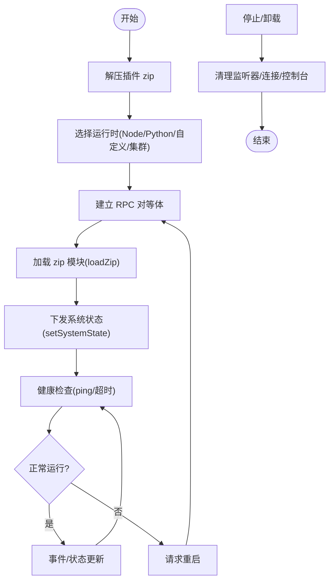
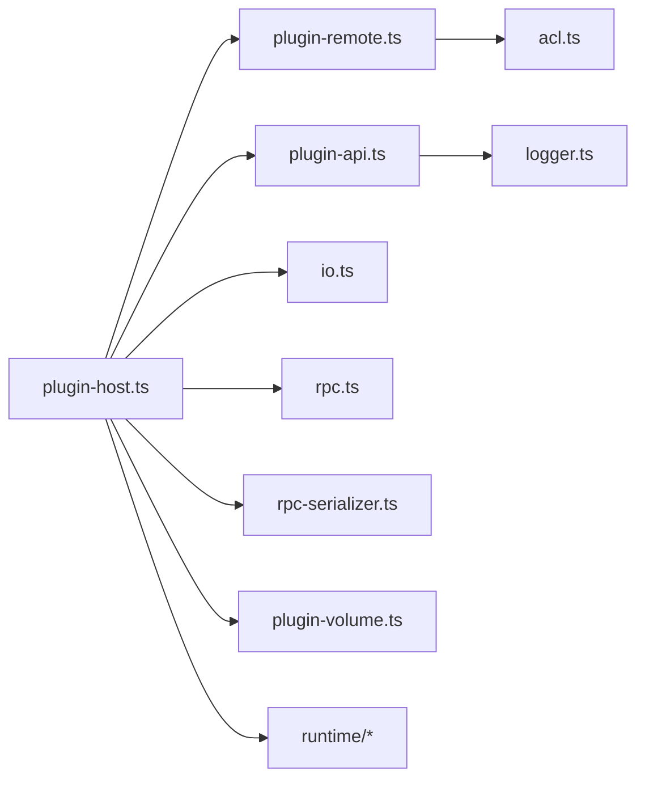

# 插件数据模型

<cite>
**本文引用的文件**   
- [sdk/src/index.ts](file://sdk/src/index.ts)
- [server/src/plugin/plugin-host.ts](file://server/src/plugin/plugin-host.ts)
- [server/src/plugin/plugin-remote.ts](file://server/src/plugin/plugin-remote.ts)
- [server/src/plugin/plugin-api.ts](file://server/src/plugin/plugin-api.ts)
- [server/src/plugin/acl.ts](file://server/src/plugin/acl.ts)
- [server/src/plugin/plugin-debug.ts](file://server/src/plugin/plugin-debug.ts)
- [plugins/core/src/plugin-socket-service.ts](file://plugins/core/src/plugin-socket-service.ts)
- [server/src/services/plugin.ts](file://server/src/services/plugin.ts)
- [server/src/db-types.ts](file://server/src/db-types.ts)
- [server/src/rpc.ts](file://server/src/rpc.ts)
- [server/src/rpc-serializer.ts](file://server/src/rpc-serializer.ts)
- [server/src/logger.ts](file://server/src/logger.ts)
- [server/src/io.ts](file://server/src/io.ts)
- [server/src/plugin/plugin-console.ts](file://server/src/plugin/plugin-console.ts)
- [server/src/plugin/plugin-volume.ts](file://server/src/plugin/plugin-volume.ts)
- [server/src/plugin/runtime/runtime-worker.ts](file://server/src/plugin/runtime/runtime-worker.ts)
- [server/src/plugin/runtime/node-worker-common.ts](file://server/src/plugin/runtime/node-worker-common.ts)
- [server/src/plugin/runtime/cluster-fork-worker.ts](file://server/src/plugin/runtime/cluster-fork-worker.ts)
- [server/src/plugin/runtime/python-worker.ts](file://server/src/plugin/runtime/python-worker.ts)
- [server/src/plugin/runtime/custom-worker.ts](file://server/src/plugin/runtime/custom-worker.ts)
- [server/src/plugin/plugin-error.ts](file://server/src/plugin/plugin-error.ts)
- [server/src/plugin/plugin-state-check.ts](file://server/src/plugin/plugin-state-check.ts)
- [server/src/plugin/plugin-lazy-remote.ts](file://server/src/plugin/plugin-lazy-remote.ts)
- [server/src/plugin/plugin-remote-websocket.ts](file://server/src/plugin/plugin-remote-websocket.ts)
- [server/src/plugin/plugin-remote-worker.ts](file://server/src/plugin/plugin-remote-worker.ts)
- [server/src/plugin/plugin-http.ts](file://server/src/plugin/plugin-http.ts)
- [server/src/plugin/plugin-device.ts](file://server/src/plugin/plugin-device.ts)
- [server/src/plugin/device.ts](file://server/src/plugin/device.ts)
- [server/src/plugin/system.ts](file://server/src/plugin/system.ts)
- [server/src/plugin/media.ts](file://server/src/plugin/media.ts)
- [server/src/plugin/mediaobject.ts](file://server/src/plugin/mediaobject.ts)
- [server/src/plugin/socket-serializer.ts](file://server/src/plugin/socket-serializer.ts)
- [server/src/plugin/endpoint.ts](file://server/src/plugin/endpoint.ts)
- [server/src/plugin/cluster.ts](file://server/src/plugin/cluster.ts)
- [server/src/plugin/descriptor.ts](file://server/src/plugin/descriptor.ts)
- [server/src/plugin/ffmpeg-path.ts](file://server/src/plugin/ffmpeg-path.ts)
- [server/src/plugin/plugin-npm-dependencies.ts](file://server/src/plugin/plugin-npm-dependencies.ts)
- [server/src/plugin/plugin-repl.ts](file://server/src/plugin/plugin-repl.ts)
- [server/src/plugin/plugin-state-check.ts](file://server/src/plugin/plugin-state-check.ts)
- [server/src/plugin/plugin-volume.ts](file://server/src/plugin/plugin-volume.ts)
- [server/src/plugin/plugin-socket-service.ts](file://server/src/plugin/plugin-socket-service.ts)
- [server/src/plugin/plugin-remote.ts](file://server/src/plugin/plugin-remote.ts)
- [server/src/plugin/plugin-api.ts](file://server/src/plugin/plugin-api.ts)
- [server/src/plugin/acl.ts](file://server/src/plugin/acl.ts)
- [server/src/plugin/plugin-debug.ts](file://server/src/plugin/plugin-debug.ts)
</cite>

## 目录
1. [引言](#引言)
2. [项目结构](#项目结构)
3. [核心组件](#核心组件)
4. [架构总览](#架构总览)
5. [详细组件分析](#详细组件分析)
6. [依赖分析](#依赖分析)
7. [性能考虑](#性能考虑)
8. [故障排查指南](#故障排查指南)
9. [结论](#结论)
10. [附录](#附录)

## 引言
本文件面向 Scrypted 插件系统的数据模型与生命周期，系统性梳理插件描述符、生命周期状态、插件间通信（RPC）、配置与设置、权限与安全、发现与注册、调试与诊断，并给出设备插件、协议插件、AI 插件等类型在数据模型上的差异与使用模式。内容基于仓库中 SDK、服务端插件宿主、远程代理、访问控制、运行时与序列化等实现进行归纳总结。

## 项目结构
Scrypted 的插件系统由三部分协同构成：
- SDK 层：提供插件开发所需的设备基类、Mixin 设备基类、接口描述符、媒体对象创建等能力。
- 服务端插件宿主层：负责插件进程启动、运行时选择、RPC 连接、健康检查、设备状态同步、事件通知、媒体管理、访问控制等。
- 插件层：以 zip 包形式分发，包含入口模块与资源，通过远程代理暴露 API 并接收宿主下发的状态与事件。

图表来源
- [sdk/src/index.ts:1-297](file://sdk/src/index.ts#L1-L297)
- [server/src/plugin/plugin-host.ts:1-506](file://server/src/plugin/plugin-host.ts#L1-L506)
- [server/src/plugin/plugin-remote.ts:1-319](file://server/src/plugin/plugin-remote.ts#L1-L319)
- [server/src/plugin/plugin-api.ts:1-199](file://server/src/plugin/plugin-api.ts#L1-L199)
- [server/src/plugin/acl.ts:1-104](file://server/src/plugin/acl.ts#L1-L104)
- [server/src/plugin/plugin-debug.ts:1-5](file://server/src/plugin/plugin-debug.ts#L1-L5)
- [server/src/io.ts:1-200](file://server/src/io.ts#L1-L200)
- [server/src/rpc.ts:1-200](file://server/src/rpc.ts#L1-L200)
- [server/src/rpc-serializer.ts:1-200](file://server/src/rpc-serializer.ts#L1-L200)
- [server/src/logger.ts:1-200](file://server/src/logger.ts#L1-L200)
- [server/src/plugin/plugin-volume.ts:1-200](file://server/src/plugin/plugin-volume.ts#L1-L200)
- [server/src/plugin/runtime/runtime-worker.ts:1-200](file://server/src/plugin/runtime/runtime-worker.ts#L1-L200)

章节来源
- [sdk/src/index.ts:1-297](file://sdk/src/index.ts#L1-L297)
- [server/src/plugin/plugin-host.ts:1-506](file://server/src/plugin/plugin-host.ts#L1-L506)

## 核心组件
- 插件描述符与接口声明
  - 描述符来源于 SDK 类型生成物，包含接口枚举、属性键、类型版本等，用于统一跨插件与宿主的契约。
  - SDK 在初始化时尝试加载自定义接口描述符并注入到系统管理器。
- 插件宿主（PluginHost）
  - 负责解压插件 zip、选择运行时（Node/Python/自定义/集群 fork）、建立 RPC 对等体、健康检查、Engine.IO 连接、媒体管理桥接、设备状态同步与事件通知。
- 远程代理（PluginRemote）
  - 将宿主侧的系统状态、设备状态、事件通过 RPC 下发给插件；同时处理插件调用宿主 API 的请求与权限过滤。
- 宿主 API（PluginAPI）
  - 提供设备变更、事件上报、存储更新、组件获取、重启请求、接口描述符注册等能力。
- 访问控制（AccessControls）
  - 基于用户级设备访问控制策略，对属性读取、事件订阅、接口可见性、方法调用进行细粒度拒绝。
- 运行时与序列化
  - 支持 Node、Python、自定义运行时与集群 fork 工作器；统一 Buffer 序列化与 WebSocket 序列化。
- 日志与控制台
  - 宿主侧日志、插件控制台服务、Engine.IO 控制台通道。

章节来源
- [sdk/src/index.ts:270-290](file://sdk/src/index.ts#L270-L290)
- [server/src/plugin/plugin-host.ts:122-224](file://server/src/plugin/plugin-host.ts#L122-L224)
- [server/src/plugin/plugin-remote.ts:13-92](file://server/src/plugin/plugin-remote.ts#L13-L92)
- [server/src/plugin/plugin-api.ts:15-39](file://server/src/plugin/plugin-api.ts#L15-L39)
- [server/src/plugin/acl.ts:8-104](file://server/src/plugin/acl.ts#L8-L104)
- [server/src/plugin/plugin-debug.ts:1-5](file://server/src/plugin/plugin-debug.ts#L1-L5)
- [server/src/plugin/plugin-volume.ts:1-200](file://server/src/plugin/plugin-volume.ts#L1-L200)
- [server/src/plugin/runtime/runtime-worker.ts:1-200](file://server/src/plugin/runtime/runtime-worker.ts#L1-L200)

## 架构总览
下图展示了从插件加载到运行、事件传播与访问控制的整体流程。

图表来源
- [server/src/plugin/plugin-host.ts:226-274](file://server/src/plugin/plugin-host.ts#L226-L274)
- [server/src/plugin/plugin-remote.ts:13-92](file://server/src/plugin/plugin-remote.ts#L13-L92)
- [server/src/plugin/plugin-api.ts:15-39](file://server/src/plugin/plugin-api.ts#L15-L39)
- [server/src/plugin/acl.ts:8-104](file://server/src/plugin/acl.ts#L8-L104)
- [server/src/rpc.ts:1-200](file://server/src/rpc.ts#L1-L200)

## 详细组件分析

### 插件描述符与接口声明
- 数据结构要点
  - 接口枚举与属性键：统一的接口与属性键集合，确保跨语言与跨插件一致性。
  - 类型版本：用于接口描述符的版本管理与兼容性校验。
  - 自定义描述符：SDK 初始化时可合并自定义接口描述符并注入系统管理器。
- 复杂度与性能
  - 描述符注入为一次性操作，对运行时影响极小。
- 错误处理
  - 加载自定义描述符失败会记录警告但不影响系统运行。

章节来源
- [sdk/src/index.ts:270-290](file://sdk/src/index.ts#L270-L290)

### 插件生命周期管理
- 生命周期阶段
  - 启动：解压 zip、选择运行时、建立 RPC Peer、准备控制台与 Engine.IO。
  - 运行：加载 zip 模块、设置系统状态、周期性健康检查（ping/超时重启）。
  - 停止/卸载：清理监听器、关闭连接、销毁控制台、失效混入设备。
- 状态变化与持久化
  - 设备状态通过系统状态映射与设备状态对象进行同步与持久化。
  - 存储后端由设备管理器与存储实现提供。
- 关键流程图

图表来源
- [server/src/plugin/plugin-host.ts:122-224](file://server/src/plugin/plugin-host.ts#L122-L224)
- [server/src/plugin/plugin-host.ts:226-274](file://server/src/plugin/plugin-host.ts#L226-L274)
- [server/src/plugin/plugin-remote.ts:275-319](file://server/src/plugin/plugin-remote.ts#L275-L319)

章节来源
- [server/src/plugin/plugin-host.ts:122-224](file://server/src/plugin/plugin-host.ts#L122-L224)
- [server/src/plugin/plugin-host.ts:226-274](file://server/src/plugin/plugin-host.ts#L226-L274)
- [server/src/plugin/plugin-remote.ts:275-319](file://server/src/plugin/plugin-remote.ts#L275-L319)

### 插件间通信（RPC）数据模型
- 参数与返回值
  - loadZip：接收 package.json、zipAPI、加载选项（调试、zip 哈希、集群参数），返回插件入口模块。
  - setSystemState：接收系统状态映射，触发设备状态更新与事件通知。
  - notify/updateDeviceState：事件与设备状态变更通知。
  - ioEvent：Engine.IO 连接事件（消息/关闭）。
  - createDeviceState：按设备 ID 创建可写设备状态。
- 错误码与异常
  - RPCResultError：远程获取 PluginRemote 或加载 zip 失败时抛出。
  - 健康检查失败触发重启。
- 超时与重连
  - 定期 ping，超过阈值触发重启；Engine.IO 连接断开时清理回调。
- 序列化
  - 统一 Buffer 序列化；WebSocket 序列化支持特定连接类型。

章节来源
- [server/src/plugin/plugin-remote.ts:178-194](file://server/src/plugin/plugin-remote.ts#L178-L194)
- [server/src/plugin/plugin-remote.ts:275-319](file://server/src/plugin/plugin-remote.ts#L275-L319)
- [server/src/plugin/plugin-api.ts:160-194](file://server/src/plugin/plugin-api.ts#L160-L194)
- [server/src/plugin/plugin-host.ts:289-325](file://server/src/plugin/plugin-host.ts#L289-L325)
- [server/src/rpc.ts:1-200](file://server/src/rpc.ts#L1-L200)
- [server/src/rpc-serializer.ts:1-200](file://server/src/rpc-serializer.ts#L1-L200)

### 插件配置与设置
- 配置项定义
  - 通过系统状态与设备状态属性键进行声明与读取。
  - Mixin 设备可通过存储后缀区分不同混入实例的配置。
- 默认值与验证
  - 默认值通常在插件内部初始化；验证逻辑在插件入口与设备管理器中执行。
- 用户界面描述
  - 接口描述符可用于生成 UI 表单与帮助文本。
- 存储与持久化
  - 设备存储与混入存储通过设备管理器与存储实现提供。

章节来源
- [sdk/src/index.ts:76-167](file://sdk/src/index.ts#L76-L167)
- [server/src/plugin/plugin-remote.ts:212-225](file://server/src/plugin/plugin-remote.ts#L212-L225)

### 权限与安全
- 访问控制模型
  - 基于用户级设备访问控制策略，逐条过滤设备、属性、接口与事件。
  - 对方法调用与设备查询进行拒绝保护。
- 安全边界与沙箱
  - 通过运行时选择与集群 fork 实现隔离；Engine.IO 通道附加 ACL 标签。
- 沙箱隔离
  - 不同运行时（Node/Python/自定义）与 fork 工作器提供进程/线程隔离。

章节来源
- [server/src/plugin/acl.ts:8-104](file://server/src/plugin/acl.ts#L8-L104)
- [server/src/plugin/plugin-host.ts:465-504](file://server/src/plugin/plugin-host.ts#L465-L504)
- [server/src/plugin/plugin-api.ts:71-158](file://server/src/plugin/plugin-api.ts#L71-L158)

### 插件发现与注册
- 设备发现协议
  - 通过 onDeviceDiscovered/onDevicesChanged/onDeviceRemoved 等 API 上报设备生命周期。
  - 插件可动态增删设备并持久化存储。
- 自动配置
  - 通过系统状态与设备状态同步，避免不必要的设备与混入重建。
- 兼容性检查与版本匹配
  - 类型版本与接口描述符用于兼容性校验；运行时不支持时抛出错误。
- 版本匹配
  - 服务端与插件版本信息在控制台输出中显示，便于诊断。

章节来源
- [server/src/plugin/plugin-api.ts:15-39](file://server/src/plugin/plugin-api.ts#L15-L39)
- [server/src/plugin/plugin-host.ts:90-120](file://server/src/plugin/plugin-host.ts#L90-L120)
- [server/src/plugin/plugin-host.ts:330-463](file://server/src/plugin/plugin-host.ts#L330-L463)

### 调试与诊断
- 日志格式
  - 宿主日志与插件日志统一通过 Logger 输出；控制台服务将 stdout/stderr 转发至客户端。
- 性能指标
  - 健康检查（ping/超时）与 Engine.IO 缓冲区大小限制用于保障稳定性。
- 错误堆栈
  - 加载 zip 失败、远程获取失败等场景抛出异常并记录堆栈。
- 内存使用
  - 通过缓冲区上限与暂停/恢复机制控制内存峰值。

章节来源
- [server/src/logger.ts:1-200](file://server/src/logger.ts#L1-L200)
- [server/src/plugin/plugin-host.ts:436-461](file://server/src/plugin/plugin-host.ts#L436-L461)
- [server/src/plugin/plugin-host.ts:465-504](file://server/src/plugin/plugin-host.ts#L465-L504)
- [server/src/plugin/plugin-debug.ts:1-5](file://server/src/plugin/plugin-debug.ts#L1-L5)

### 插件开发示例（设备/协议/AI）
- 设备插件
  - 使用 SDK 设备基类，声明接口与属性，通过系统状态与设备状态进行读写。
- 协议插件
  - 通过 Engine.IO 或 WebSocket 与设备通信，使用 StreamService 进行流式传输。
- AI 插件
  - 通过媒体管理器与媒体对象进行推理数据的输入输出，结合系统状态进行结果回传。

章节来源
- [sdk/src/index.ts:10-71](file://sdk/src/index.ts#L10-L71)
- [plugins/core/src/plugin-socket-service.ts:9-86](file://plugins/core/src/plugin-socket-service.ts#L9-L86)
- [server/src/plugin/media.ts:1-200](file://server/src/plugin/media.ts#L1-L200)

## 依赖分析
- 组件耦合与内聚
  - PluginHost 与 PluginRemote 通过 RPC 对等体高内聚；API 层负责对外暴露能力。
  - ACL 作为横切关注点被注入到远程代理与宿主 API 中。
- 直接与间接依赖
  - 运行时工作器（Node/Python/自定义/集群 fork）为插件执行提供环境。
  - 序列化器与 Engine.IO 为通信提供基础。
- 循环依赖
  - 通过参数注入与延迟初始化避免循环依赖。
- 外部依赖与集成点
  - 插件卷、日志、IO、RPC、类型系统等。

图表来源
- [server/src/plugin/plugin-host.ts:1-506](file://server/src/plugin/plugin-host.ts#L1-L506)
- [server/src/plugin/plugin-remote.ts:1-319](file://server/src/plugin/plugin-remote.ts#L1-L319)
- [server/src/plugin/plugin-api.ts:1-199](file://server/src/plugin/plugin-api.ts#L1-L199)
- [server/src/plugin/acl.ts:1-104](file://server/src/plugin/acl.ts#L1-L104)
- [server/src/io.ts:1-200](file://server/src/io.ts#L1-L200)
- [server/src/rpc.ts:1-200](file://server/src/rpc.ts#L1-L200)
- [server/src/rpc-serializer.ts:1-200](file://server/src/rpc-serializer.ts#L1-L200)
- [server/src/logger.ts:1-200](file://server/src/logger.ts#L1-L200)
- [server/src/plugin/plugin-volume.ts:1-200](file://server/src/plugin/plugin-volume.ts#L1-L200)
- [server/src/plugin/runtime/runtime-worker.ts:1-200](file://server/src/plugin/runtime/runtime-worker.ts#L1-L200)

## 性能考虑
- 通信优化
  - Engine.IO 启用压缩与缓冲区上限，避免大包导致内存压力。
  - WebSocket 序列化与缓冲队列控制背压。
- 运行时选择
  - Python/自定义运行时适合 CPU 密集型任务；Node 适合通用场景。
- 健康检查
  - 定期 ping 与超时重启保障长时间运行稳定性。
- 存储与状态
  - 按需更新系统状态，避免频繁广播。

## 故障排查指南
- 插件无法加载
  - 检查 zip 解压与哈希；查看加载错误日志与 alert。
- 插件无响应
  - 观察 ping 超时与健康检查日志，确认是否触发重启。
- 权限问题
  - 检查 ACL 策略是否拒绝设备/属性/接口/事件。
- 控制台与日志
  - 通过 Engine.IO 控制台与宿主日志定位问题。
- 运行时不支持
  - 确认 package.json 中 runtime 配置与可用运行时匹配。

章节来源
- [server/src/plugin/plugin-host.ts:216-221](file://server/src/plugin/plugin-host.ts#L216-L221)
- [server/src/plugin/plugin-host.ts:307-325](file://server/src/plugin/plugin-host.ts#L307-L325)
- [server/src/plugin/acl.ts:12-14](file://server/src/plugin/acl.ts#L12-L14)
- [server/src/plugin/plugin-console.ts:1-200](file://server/src/plugin/plugin-console.ts#L1-L200)

## 结论
Scrypted 的插件数据模型围绕“统一接口描述符 + 宿主 RPC 代理 + 访问控制 + 多运行时支持”构建，既保证了跨插件一致性，又提供了灵活的扩展与安全边界。通过系统状态与设备状态的双向同步、事件过滤与健康检查机制，实现了稳定可靠的插件生态。

## 附录
- 运行时与工作器
  - Node/Fork/Thread/Python/自定义/集群 Fork 工作器分别适用于不同场景与隔离需求。
- 插件卷与资源
  - 插件 zip 解压到插件卷，提供稳定的资源访问路径。
- 端点与媒体
  - 端点管理器与媒体管理器为插件提供网络与媒体处理能力。

章节来源
- [server/src/plugin/runtime/node-worker-common.ts:1-200](file://server/src/plugin/runtime/node-worker-common.ts#L1-L200)
- [server/src/plugin/runtime/cluster-fork-worker.ts:1-200](file://server/src/plugin/runtime/cluster-fork-worker.ts#L1-L200)
- [server/src/plugin/runtime/python-worker.ts:1-200](file://server/src/plugin/runtime/python-worker.ts#L1-L200)
- [server/src/plugin/runtime/custom-worker.ts:1-200](file://server/src/plugin/runtime/custom-worker.ts#L1-L200)
- [server/src/plugin/plugin-volume.ts:1-200](file://server/src/plugin/plugin-volume.ts#L1-L200)
- [server/src/plugin/plugin-remote.ts:142-151](file://server/src/plugin/plugin-remote.ts#L142-L151)