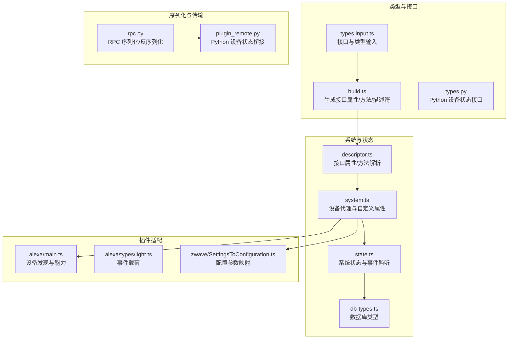
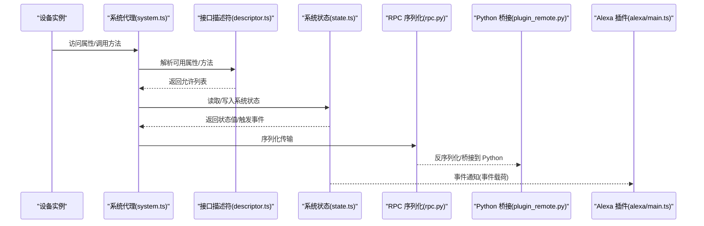
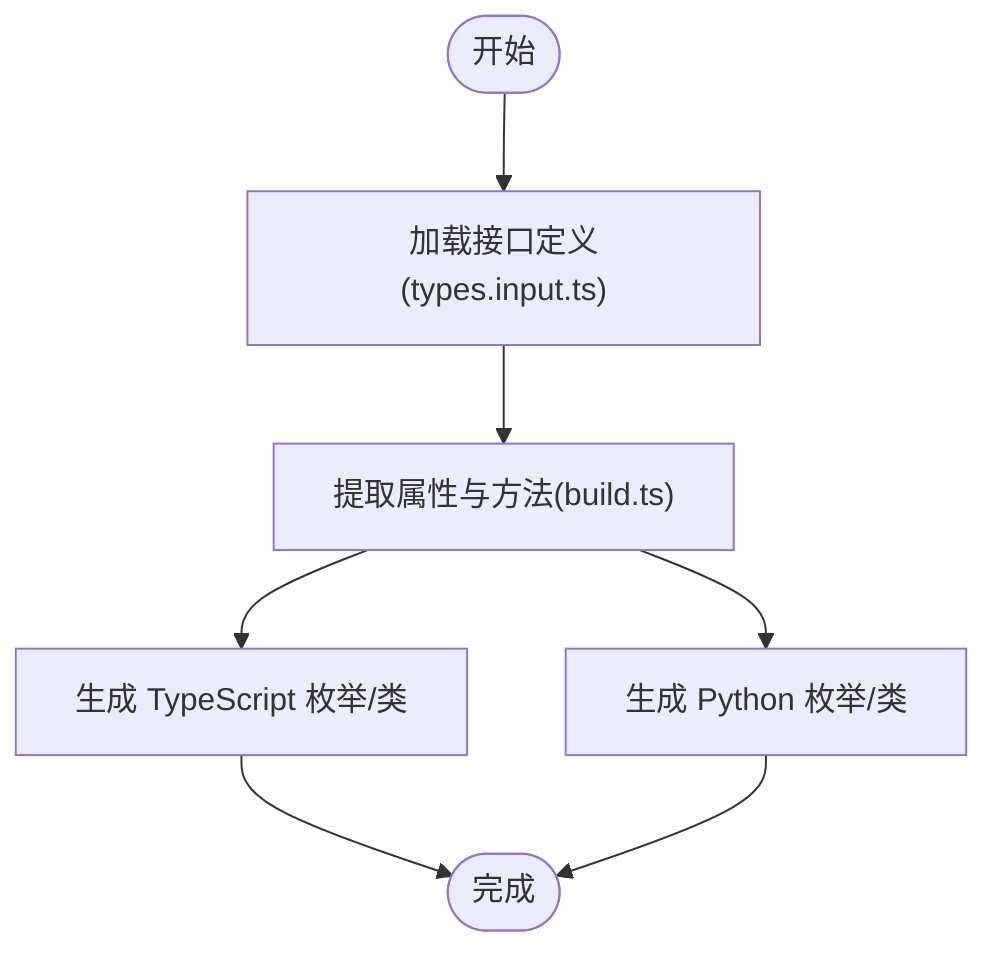
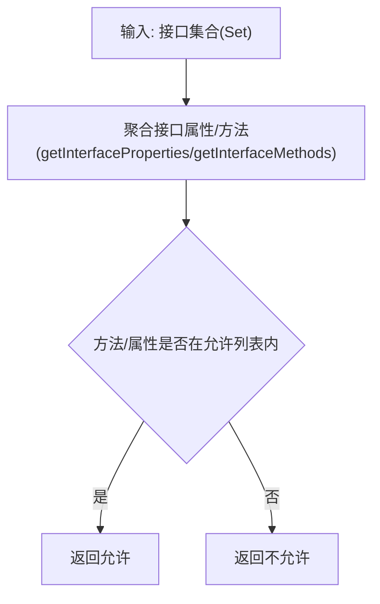
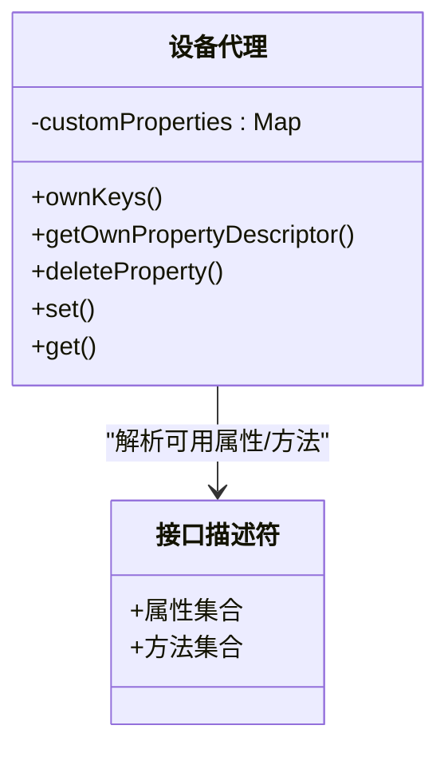
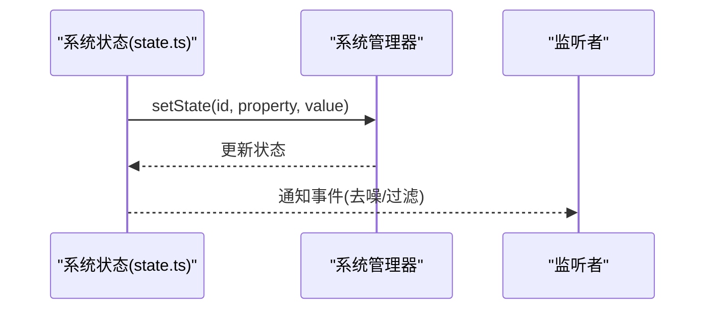
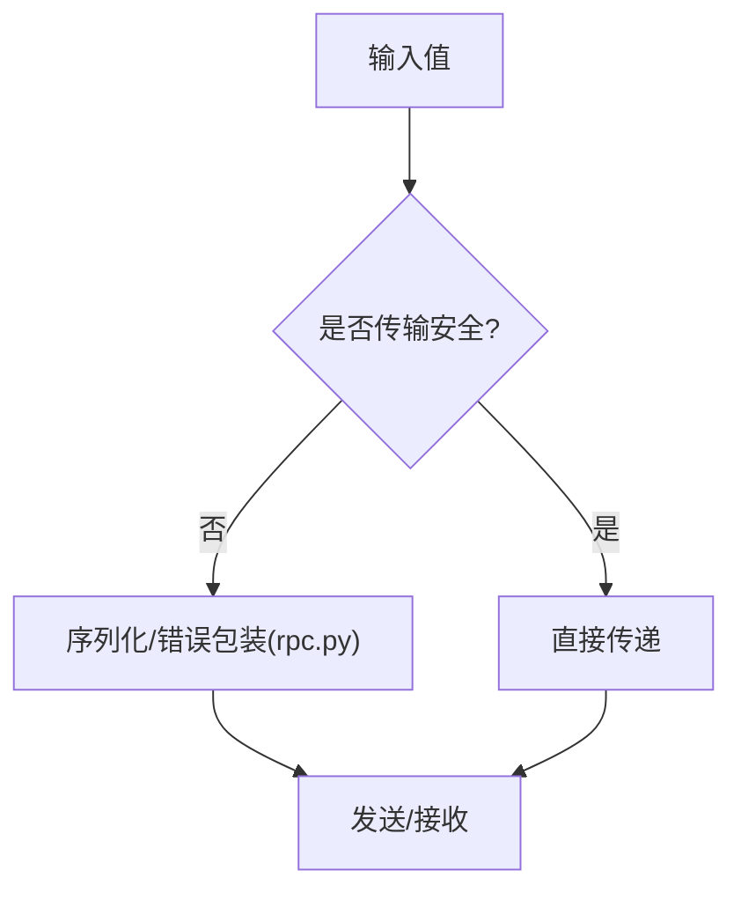
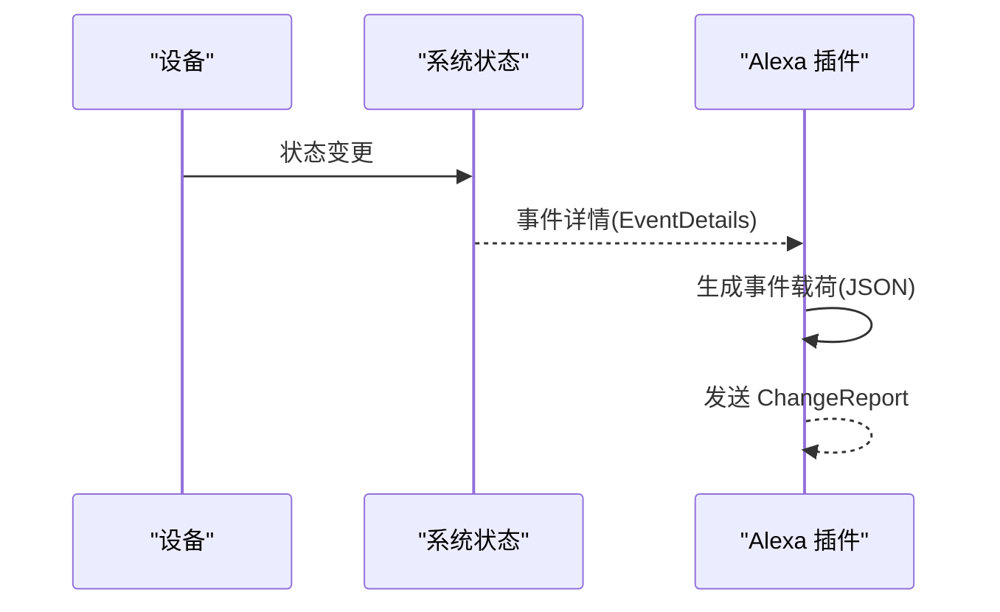
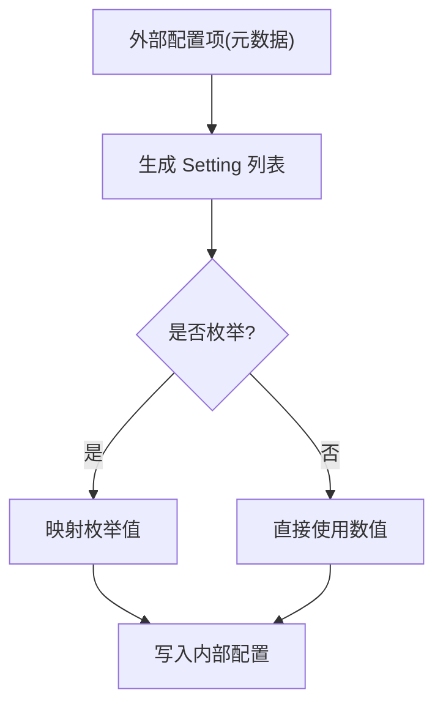
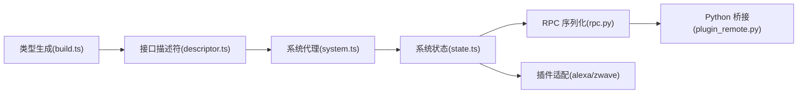

# 数据模型规范

<cite>
**本文档引用的文件**
- [build.ts](file://sdk/types/src/build.ts)
- [types.input.ts](file://sdk/types/src/types.input.ts)
- [descriptor.ts](file://server/src/plugin/descriptor.ts)
- [system.ts](file://server/src/plugin/system.ts)
- [db-types.ts](file://server/src/db-types.ts)
- [state.ts](file://server/src/state.ts)
- [rpc.py](file://server/python/rpc.py)
- [plugin_remote.py](file://server/python/plugin_remote.py)
- [light.ts](file://plugins/alexa/src/types/light.ts)
- [main.ts](file://plugins/alexa/src/main.ts)
- [SettingsToConfiguration.ts](file://plugins/zwave/src/CommandClasses/SettingsToConfiguration.ts)
- [devices.ts](file://common/src/devices.ts)
- [types.py](file://sdk/types/scrypted_python/scrypted_sdk/types.py)
</cite>

## 目录
1. [简介](#简介)
2. [项目结构](#项目结构)
3. [核心组件](#核心组件)
4. [架构总览](#架构总览)
5. [详细组件分析](#详细组件分析)
6. [依赖分析](#依赖分析)
7. [性能考虑](#性能考虑)
8. [故障排查指南](#故障排查指南)
9. [结论](#结论)
10. [附录](#附录)

## 简介
本规范系统性地定义 Scrypted 的数据模型，覆盖设备实体模型、状态数据、配置参数、接口描述符、序列化与反序列化、验证规则、迁移与版本策略、使用示例、安全与隐私、存储与索引策略等。目标是帮助开发者在不同语言（TypeScript、Python）与运行时（Node、RPC）中一致地理解与实现数据模型。

## 项目结构
Scrypted 的数据模型由“类型生成器”“接口描述符”“系统状态管理”“序列化层”“插件适配层”等模块协同构成。核心文件分布如下：
- 类型与接口：sdk/types/src 下的构建脚本与输入类型定义
- 接口描述符：server/src/plugin 下的描述符与系统代理
- 系统状态：server/src 下的状态与数据库类型
- 序列化：server/python 下的 RPC 序列化
- 插件适配：plugins/* 下的外部服务对接（如 Alexa、Z-Wave）
- 公共工具：common/src 下的设备与通用工具

图表来源
- [build.ts:28-90](file://sdk/types/src/build.ts#L28-L90)
- [descriptor.ts:1-35](file://server/src/plugin/descriptor.ts#L1-L35)
- [system.ts:18-89](file://server/src/plugin/system.ts#L18-L89)
- [state.ts:136-158](file://server/src/state.ts#L136-L158)
- [rpc.py:284-318](file://server/python/rpc.py#L284-L318)
- [plugin_remote.py:518-554](file://server/python/plugin_remote.py#L518-L554)
- [main.ts:533-570](file://plugins/alexa/src/main.ts#L533-L570)
- [light.ts:128-151](file://plugins/alexa/src/types/light.ts#L128-L151)
- [SettingsToConfiguration.ts:1-73](file://plugins/zwave/src/CommandClasses/SettingsToConfiguration.ts#L1-L73)

章节来源
- [build.ts:28-90](file://sdk/types/src/build.ts#L28-L90)
- [descriptor.ts:1-35](file://server/src/plugin/descriptor.ts#L1-L35)
- [system.ts:18-89](file://server/src/plugin/system.ts#L18-L89)
- [state.ts:136-158](file://server/src/state.ts#L136-L158)
- [rpc.py:284-318](file://server/python/rpc.py#L284-L318)
- [plugin_remote.py:518-554](file://server/python/plugin_remote.py#L518-L554)
- [main.ts:533-570](file://plugins/alexa/src/main.ts#L533-L570)
- [light.ts:128-151](file://plugins/alexa/src/types/light.ts#L128-L151)
- [SettingsToConfiguration.ts:1-73](file://plugins/zwave/src/CommandClasses/SettingsToConfiguration.ts#L1-L73)

## 核心组件
- 接口与属性枚举：通过构建脚本从接口定义中提取属性与方法，生成 TypeScript 与 Python 的枚举与设备状态类。
- 接口描述符：维护每个 Scrypted 接口的属性与方法集合，用于运行时校验与代理。
- 设备代理与自定义属性：系统代理根据设备接口动态暴露属性与方法，并支持自定义属性写入。
- 系统状态：统一管理设备状态、事件与监听，提供查询与变更入口。
- 序列化与传输：RPC 层对传输安全类型进行原样传递，对复杂对象进行序列化或错误包装。
- 插件适配：将内部状态转换为外部平台（如 Alexa）所需的事件与发现格式；将外部配置映射到内部设置。

章节来源
- [build.ts:28-90](file://sdk/types/src/build.ts#L28-L90)
- [descriptor.ts:1-35](file://server/src/plugin/descriptor.ts#L1-L35)
- [system.ts:18-89](file://server/src/plugin/system.ts#L18-L89)
- [state.ts:136-158](file://server/src/state.ts#L136-L158)
- [rpc.py:284-318](file://server/python/rpc.py#L284-L318)
- [plugin_remote.py:518-554](file://server/python/plugin_remote.py#L518-L554)

## 架构总览
下图展示了从接口定义到系统状态、序列化与插件适配的整体流程。

图表来源
- [system.ts:18-89](file://server/src/plugin/system.ts#L18-L89)
- [descriptor.ts:1-35](file://server/src/plugin/descriptor.ts#L1-L35)
- [state.ts:136-158](file://server/src/state.ts#L136-L158)
- [rpc.py:284-318](file://server/python/rpc.py#L284-L318)
- [plugin_remote.py:518-554](file://server/python/plugin_remote.py#L518-L554)
- [main.ts:533-570](file://plugins/alexa/src/main.ts#L533-L570)

## 详细组件分析

### 组件一：接口与属性枚举（类型生成）
- 作用：从接口定义中抽取属性与方法，生成 TypeScript 与 Python 的枚举及设备状态类，确保跨语言一致性。
- 关键点：
  - 构建脚本遍历接口，收集属性与方法，生成枚举与设备状态类。
  - 输出包含接口描述符映射，便于运行时校验。
- 复杂度：线性于接口数量与属性/方法总数。
- 优化：缓存生成结果，避免重复构建。

图表来源
- [build.ts:28-90](file://sdk/types/src/build.ts#L28-L90)
- [types.input.ts](file://sdk/types/src/types.input.ts)

章节来源
- [build.ts:28-90](file://sdk/types/src/build.ts#L28-L90)
- [types.input.ts](file://sdk/types/src/types.input.ts)

### 组件二：接口描述符与有效性校验
- 作用：维护每个接口的属性/方法集合，提供有效性判断，确保只暴露设备实际具备的能力。
- 关键点：
  - 提供获取接口属性/方法集合的函数。
  - 校验方法与属性是否属于当前设备接口集。
- 复杂度：查询为 O(n)，n 为接口数量。

图表来源
- [descriptor.ts:1-35](file://server/src/plugin/descriptor.ts#L1-L35)

章节来源
- [descriptor.ts:1-35](file://server/src/plugin/descriptor.ts#L1-L35)

### 组件三：设备代理与自定义属性
- 作用：根据设备接口动态暴露属性与方法；支持自定义属性写入；拦截非法写入（如只读属性）。
- 关键点：
  - 通过代理拦截 get/set/delete，区分接口属性与自定义属性。
  - 自定义属性写入保存在内存映射中，不直接修改只读接口属性。
- 复杂度：读写为 O(1)，属性解析为 O(n)。

图表来源
- [system.ts:18-89](file://server/src/plugin/system.ts#L18-L89)
- [descriptor.ts:1-35](file://server/src/plugin/descriptor.ts#L1-L35)

章节来源
- [system.ts:18-89](file://server/src/plugin/system.ts#L18-L89)
- [descriptor.ts:1-35](file://server/src/plugin/descriptor.ts#L1-L35)

### 组件四：系统状态与事件
- 作用：统一管理设备状态、事件与监听；提供查询与变更入口。
- 关键点：
  - 状态结构包含 lastEventTime、stateTime、value 等字段。
  - 支持事件去噪、事件过滤与轮询策略。
- 复杂度：查询为 O(1)，事件通知为 O(k)，k 为监听者数量。

图表来源
- [state.ts:136-158](file://server/src/state.ts#L136-L158)

章节来源
- [state.ts:136-158](file://server/src/state.ts#L136-L158)

### 组件五：序列化与传输（RPC）
- 作用：在传输层对值进行序列化/反序列化，保证跨进程/跨语言一致性。
- 关键点：
  - 传输安全类型直接传递；复杂对象序列化；异常对象转为可传输错误。
  - Python 端通过桥接类实现设备状态的读写与只读约束。
- 复杂度：按值类型决定，对象序列化为 O(n)（n 为子节点数）。

图表来源
- [rpc.py:284-318](file://server/python/rpc.py#L284-L318)
- [plugin_remote.py:518-554](file://server/python/plugin_remote.py#L518-L554)

章节来源
- [rpc.py:284-318](file://server/python/rpc.py#L284-L318)
- [plugin_remote.py:518-554](file://server/python/plugin_remote.py#L518-L554)

### 组件六：插件适配（以 Alexa 为例）
- 作用：将内部设备状态转换为 Alexa 平台的事件与发现格式。
- 关键点：
  - 设备发现：根据设备类型生成端点与能力。
  - 事件载荷：包含时间戳、不确定性、属性变化原因等。
- 复杂度：与设备数量与事件频率相关。

图表来源
- [main.ts:533-570](file://plugins/alexa/src/main.ts#L533-L570)
- [light.ts:128-151](file://plugins/alexa/src/types/light.ts#L128-L151)

章节来源
- [main.ts:533-570](file://plugins/alexa/src/main.ts#L533-L570)
- [light.ts:128-151](file://plugins/alexa/src/types/light.ts#L128-L151)

### 组件七：配置参数映射（以 Z-Wave 为例）
- 作用：将外部设备的配置项映射到 Scrypted 的设置接口，支持枚举、手动输入等。
- 关键点：
  - 从命令类元数据提取配置项标题、描述、可选项。
  - 将外部枚举值映射为内部值，或直接写入数值。
- 复杂度：线性于配置项数量。

图表来源
- [SettingsToConfiguration.ts:1-73](file://plugins/zwave/src/CommandClasses/SettingsToConfiguration.ts#L1-L73)

章节来源
- [SettingsToConfiguration.ts:1-73](file://plugins/zwave/src/CommandClasses/SettingsToConfiguration.ts#L1-L73)

## 依赖分析
- 类型生成依赖接口输入；接口描述符依赖类型生成输出；系统代理依赖描述符；状态依赖代理；序列化依赖状态与代理；插件适配依赖状态与序列化。
- 耦合关系：类型生成器与接口描述符耦合；系统代理与描述符耦合；状态与代理耦合；RPC 与状态耦合；插件适配与状态耦合。

图表来源
- [build.ts:28-90](file://sdk/types/src/build.ts#L28-L90)
- [descriptor.ts:1-35](file://server/src/plugin/descriptor.ts#L1-L35)
- [system.ts:18-89](file://server/src/plugin/system.ts#L18-L89)
- [state.ts:136-158](file://server/src/state.ts#L136-L158)
- [rpc.py:284-318](file://server/python/rpc.py#L284-L318)
- [plugin_remote.py:518-554](file://server/python/plugin_remote.py#L518-L554)

章节来源
- [build.ts:28-90](file://sdk/types/src/build.ts#L28-L90)
- [descriptor.ts:1-35](file://server/src/plugin/descriptor.ts#L1-L35)
- [system.ts:18-89](file://server/src/plugin/system.ts#L18-L89)
- [state.ts:136-158](file://server/src/state.ts#L136-L158)
- [rpc.py:284-318](file://server/python/rpc.py#L284-L318)
- [plugin_remote.py:518-554](file://server/python/plugin_remote.py#L518-L554)

## 性能考虑
- 接口解析：缓存接口属性/方法集合，避免重复计算。
- 状态更新：批量更新时合并事件，减少通知次数。
- 序列化：仅对非传输安全类型进行序列化，降低开销。
- 查询优化：为常用查询建立索引（如按设备 ID、接口类型），并在状态层实现快速查找。
- 监听策略：启用去噪与轮询策略，平衡实时性与资源消耗。

## 故障排查指南
- 自定义属性写入失败：确认属性是否为只读接口属性；自定义属性应通过代理写入。
- 事件未到达：检查事件去噪与过滤配置；确认监听者注册与事件接口匹配。
- 序列化异常：确认值类型是否为传输安全；异常对象会被包装为可传输错误。
- 插件适配问题：核对设备发现与能力映射；检查事件载荷中的时间戳格式与时区处理。

章节来源
- [system.ts:18-89](file://server/src/plugin/system.ts#L18-L89)
- [state.ts:136-158](file://server/src/state.ts#L136-L158)
- [rpc.py:284-318](file://server/python/rpc.py#L284-L318)
- [plugin_remote.py:518-554](file://server/python/plugin_remote.py#L518-L554)

## 结论
Scrypted 的数据模型通过“类型生成—接口描述—系统代理—状态管理—序列化—插件适配”的链路，实现了跨语言、跨运行时的一致性与扩展性。遵循本规范可确保设备状态、配置参数与事件流在各组件间稳定流转，并为后续版本演进与兼容性提供清晰路径。

## 附录

### 数据模型与 JSON Schema 定义
- 设备实体模型
  - 字段：id、name、type、interfaces、provided*、info、pluginId、providerId、room、mixins、nativeId、scryptedRuntimeArguments 等。
  - 类型：字符串、数组、对象、布尔、数值等。
  - 约束：部分字段为只读；某些字段需满足枚举或格式要求。
- 状态数据
  - 字段：value、lastEventTime、stateTime。
  - 时间戳：毫秒级时间戳，统一使用系统时间。
- 配置参数
  - 字段：key、title、description、choices、combobox、value。
  - 约束：choices 与 value 映射；数值类型需转换；允许手动输入。
- 接口描述符
  - 字段：name、methods、properties。
  - 约束：运行时校验方法与属性的有效性。

章节来源
- [types.py:2084-2130](file://sdk/types/scrypted_python/scrypted_sdk/types.py#L2084-L2130)
- [types.py:2271-2326](file://sdk/types/scrypted_python/scrypted_sdk/types.py#L2271-L2326)
- [descriptor.ts:1-35](file://server/src/plugin/descriptor.ts#L1-L35)
- [state.ts:136-158](file://server/src/state.ts#L136-L158)
- [SettingsToConfiguration.ts:1-73](file://plugins/zwave/src/CommandClasses/SettingsToConfiguration.ts#L1-L73)

### 数据关系与继承
- 继承关系：设备基类与接口描述符共同定义设备状态；Python 设备状态类继承基础类。
- 组合关系：设备由多个接口组合而成；接口描述符聚合属性与方法。
- 引用关系：设备通过 pluginId/providerId 引用插件与父设备；状态通过 id 引用设备。

章节来源
- [build.ts:28-90](file://sdk/types/src/build.ts#L28-L90)
- [types.py:2271-2326](file://sdk/types/scrypted_python/scrypted_sdk/types.py#L2271-L2326)
- [descriptor.ts:1-35](file://server/src/plugin/descriptor.ts#L1-L35)

### 序列化与反序列化规范
- 传输安全类型：直接传递。
- 复杂对象：序列化为字典或数组；异常对象包装为可传输错误。
- Python 桥接：通过 getScryptedProperty/setScryptedProperty 实现读写；禁止修改只读属性。

章节来源
- [rpc.py:284-318](file://server/python/rpc.py#L284-L318)
- [plugin_remote.py:518-554](file://server/python/plugin_remote.py#L518-L554)

### 数据验证规则
- 必填字段：id、interfaces、provided* 等。
- 可选范围：choices 与 value 的映射；数值范围与类型转换。
- 格式检查：时间戳格式（ISO 字符串）、枚举值、布尔值、数组与对象结构。

章节来源
- [SettingsToConfiguration.ts:1-73](file://plugins/zwave/src/CommandClasses/SettingsToConfiguration.ts#L1-L73)
- [light.ts:128-151](file://plugins/alexa/src/types/light.ts#L128-L151)

### 数据迁移与版本升级策略
- 版本标记：类型生成包含版本号，便于追踪与回滚。
- 向后兼容：新增字段默认可选；只读字段保持不变；接口描述符扩展不影响旧实现。
- 迁移步骤：在插件启动时检测旧版本状态，进行字段补齐与类型转换；通过事件重放恢复状态。

章节来源
- [build.ts:69-82](file://sdk/types/src/build.ts#L69-L82)

### 使用示例与最佳实践
- 常见操作模式
  - 读取设备状态：通过系统代理访问属性；若不存在则从状态层读取。
  - 写入自定义属性：通过代理写入；避免直接修改只读接口属性。
  - 发布事件：使用系统状态通知；确保事件载荷包含时间戳与不确定性。
- 最佳实践
  - 批量更新：合并事件，减少通知次数。
  - 错误处理：捕获异常并包装为可传输错误。
  - 插件适配：严格遵守外部平台的事件格式与时序。

章节来源
- [system.ts:18-89](file://server/src/plugin/system.ts#L18-L89)
- [state.ts:136-158](file://server/src/state.ts#L136-L158)
- [light.ts:128-151](file://plugins/alexa/src/types/light.ts#L128-L151)

### 数据安全与隐私保护
- 敏感信息处理：不在事件载荷中传输敏感字段；必要时进行脱敏或加密。
- 访问控制：通过接口描述符限制可访问属性与方法；禁止写入只读字段。
- 传输安全：仅传输安全类型；复杂对象需序列化；异常统一包装。

章节来源
- [descriptor.ts:1-35](file://server/src/plugin/descriptor.ts#L1-L35)
- [system.ts:18-89](file://server/src/plugin/system.ts#L18-L89)
- [rpc.py:284-318](file://server/python/rpc.py#L284-L318)

### 存储与索引策略、性能优化
- 存储策略：设备状态以键值对形式存储；事件与状态分离存储。
- 索引策略：按设备 ID、接口类型、属性名建立索引；支持快速查询与更新。
- 性能优化：启用事件去噪与轮询策略；批量更新与事件合并；序列化缓存。

章节来源
- [state.ts:136-158](file://server/src/state.ts#L136-L158)
- [db-types.ts](file://server/src/db-types.ts)