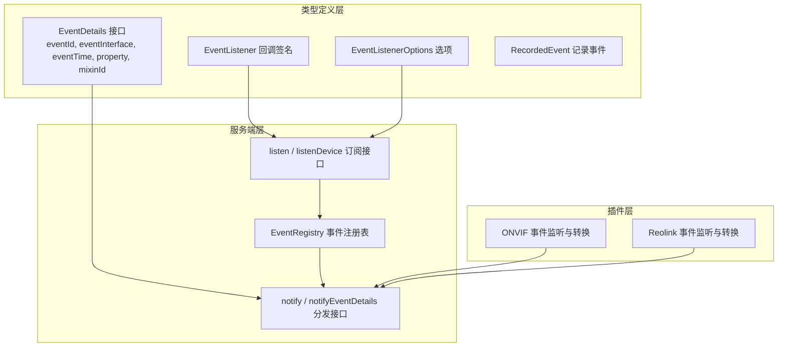
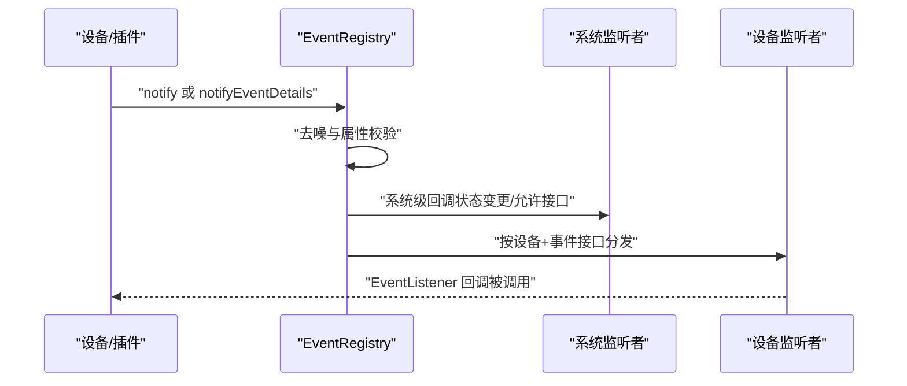
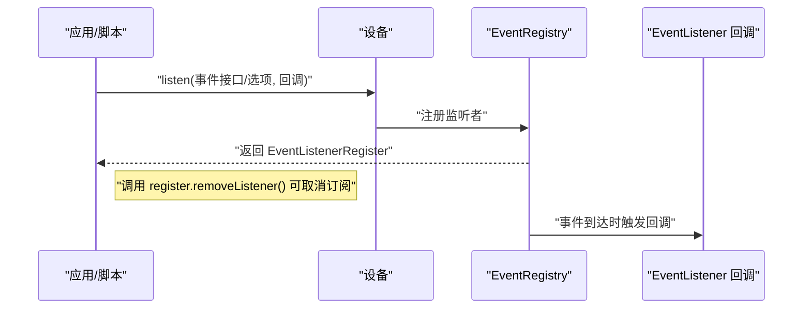
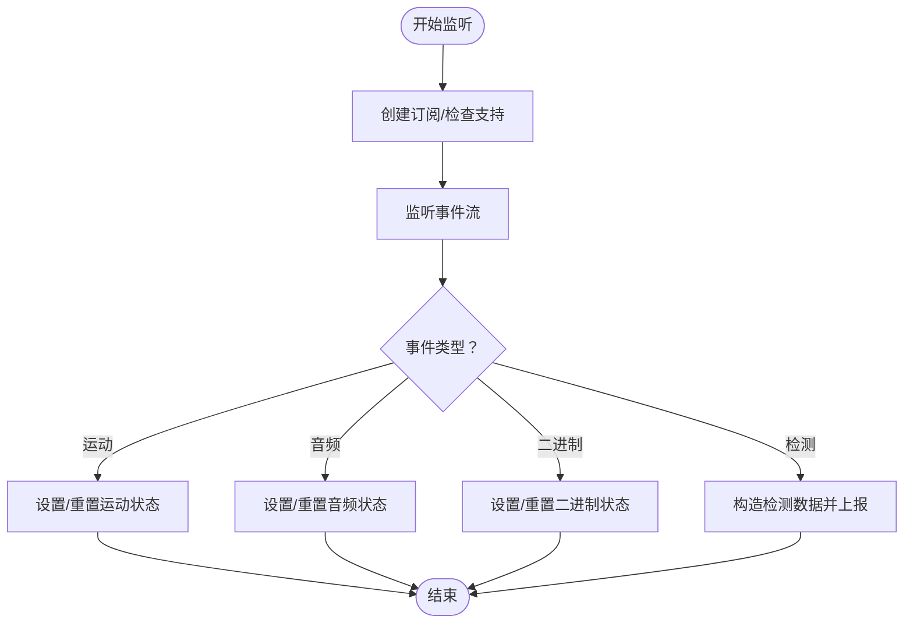
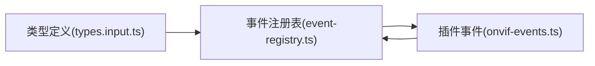

# 事件系统模型

<cite>
**本文引用的文件**
- [sdk/types/src/types.input.ts](file://sdk/types/src/types.input.ts)
- [sdk/types/scrypted_python/scrypted_sdk/types.py](file://sdk/types/scrypted_python/scrypted_sdk/types.py)
- [server/src/event-registry.ts](file://server/src/event-registry.ts)
- [plugins/onvif/src/onvif-events.ts](file://plugins/onvif/src/onvif-events.ts)
- [plugins/reolink/src/onvif-events.ts](file://plugins/reolink/src/onvif-events.ts)
- [packages/client/examples/detection.ts](file://packages/client/examples/detection.ts)
</cite>

## 目录
1. [简介](#简介)
2. [项目结构](#项目结构)
3. [核心组件](#核心组件)
4. [架构总览](#架构总览)
5. [详细组件分析](#详细组件分析)
6. [依赖关系分析](#依赖关系分析)
7. [性能考虑](#性能考虑)
8. [故障排查指南](#故障排查指南)
9. [结论](#结论)
10. [附录](#附录)

## 简介
本文件为 Scrypted 事件系统模型的权威规范文档，聚焦于事件数据结构与回调契约，涵盖以下要点：
- EventDetails 结构的完整定义：eventId 事件标识符、eventInterface 事件接口、eventTime 时间戳、property 属性名、mixinId 混入设备标识。
- EventListener 回调函数的参数结构：eventSource 设备源、eventDetails 事件详情、eventData 事件数据。
- EventListenerOptions 监听器选项：denoise 去噪、event 事件接口过滤、watch 被动监听、mixinId 混入设备标识。
- 事件类型系统：设备状态变更事件、传感器数据事件、用户交互事件等。
- 事件订阅与取消订阅的完整流程。
- 事件处理最佳实践与性能优化建议。

## 项目结构
Scrypted 的事件系统由类型定义、服务端事件注册表以及插件事件监听实现三部分组成：
- 类型定义层：在 SDK 中定义事件相关的接口与类型（如 EventDetails、EventListener、EventListenerOptions）。
- 服务端层：事件注册表负责维护系统级与设备级监听者集合，并在事件发生时进行分发。
- 插件层：具体设备或协议插件（如 ONVIF）实现事件监听与转换，触发 Scrypted 事件。

图表来源
- [sdk/types/src/types.input.ts:85-91](file://sdk/types/src/types.input.ts#L85-L91)
- [sdk/types/src/types.input.ts](file://sdk/types/src/types.input.ts#L83)
- [sdk/types/src/types.input.ts:61-78](file://sdk/types/src/types.input.ts#L61-L78)
- [sdk/types/src/types.input.ts:930-933](file://sdk/types/src/types.input.ts#L930-L933)
- [server/src/event-registry.ts:26-53](file://server/src/event-registry.ts#L26-L53)
- [server/src/event-registry.ts:55-103](file://server/src/event-registry.ts#L55-L103)
- [plugins/onvif/src/onvif-events.ts:1-96](file://plugins/onvif/src/onvif-events.ts#L1-L96)
- [plugins/reolink/src/onvif-events.ts:1-96](file://plugins/reolink/src/onvif-events.ts#L1-L96)

章节来源
- [sdk/types/src/types.input.ts:85-91](file://sdk/types/src/types.input.ts#L85-L91)
- [sdk/types/src/types.input.ts:61-78](file://sdk/types/src/types.input.ts#L61-L78)
- [server/src/event-registry.ts:26-53](file://server/src/event-registry.ts#L26-L53)
- [server/src/event-registry.ts:55-103](file://server/src/event-registry.ts#L55-L103)
- [plugins/onvif/src/onvif-events.ts:1-96](file://plugins/onvif/src/onvif-events.ts#L1-L96)
- [plugins/reolink/src/onvif-events.ts:1-96](file://plugins/reolink/src/onvif-events.ts#L1-L96)

## 核心组件
- EventDetails：事件的元数据载体，包含事件唯一标识、事件接口、时间戳、属性名与混入标识。
- EventListener：事件回调签名，接收事件源、事件详情与事件数据。
- EventListenerOptions：监听器配置项，支持去噪、事件接口过滤、被动监听与混入设备标识。
- EventRegistry：事件注册与分发中心，维护系统级与设备级监听者集合，并根据事件接口与属性进行定向分发。
- RecordedEvent：事件记录结构，用于历史事件查询与回放。

章节来源
- [sdk/types/src/types.input.ts:85-91](file://sdk/types/src/types.input.ts#L85-L91)
- [sdk/types/src/types.input.ts](file://sdk/types/src/types.input.ts#L83)
- [sdk/types/src/types.input.ts:61-78](file://sdk/types/src/types.input.ts#L61-L78)
- [sdk/types/src/types.input.ts:930-933](file://sdk/types/src/types.input.ts#L930-L933)
- [server/src/event-registry.ts:26-53](file://server/src/event-registry.ts#L26-L53)
- [server/src/event-registry.ts:55-103](file://server/src/event-registry.ts#L55-L103)

## 架构总览
事件从设备或插件产生，经由事件注册表进行去噪与路由，最终投递给匹配的监听器。

图表来源
- [server/src/event-registry.ts:55-103](file://server/src/event-registry.ts#L55-L103)

章节来源
- [server/src/event-registry.ts:55-103](file://server/src/event-registry.ts#L55-L103)

## 详细组件分析

### EventDetails 定义与语义
- eventId：事件唯一标识符，若未显式提供则由注册表生成随机字符串。
- eventInterface：事件所属的接口名称（如 ScryptedInterface 对应的枚举值），用于区分事件类型。
- eventTime：事件发生的时间戳（毫秒）。
- property：可选属性名，表示该事件是否针对某个具体属性的变化。
- mixinId：可选混入标识，当事件来自被混入的设备或其属性变化时携带。

章节来源
- [sdk/types/src/types.input.ts:85-91](file://sdk/types/src/types.input.ts#L85-L91)
- [server/src/event-registry.ts:64-70](file://server/src/event-registry.ts#L64-L70)
- [server/src/event-registry.ts:75-77](file://server/src/event-registry.ts#L75-L77)

### EventListener 回调参数
- eventSource：事件源设备对象；在系统级事件中可能为 undefined。
- eventDetails：事件详情对象，包含事件元数据。
- eventData：事件数据，通常为当前状态值或结构化数据（如检测结果）。

章节来源
- [sdk/types/src/types.input.ts](file://sdk/types/src/types.input.ts#L83)
- [server/src/event-registry.ts](file://server/src/event-registry.ts#L27)
- [server/src/event-registry.ts](file://server/src/event-registry.ts#L39)

### EventListenerOptions 选项
- denoise：启用后仅在状态发生变化时触发回调，避免重复通知。
- event：指定监听的事件接口名称，用于过滤事件类型。
- watch：被动监听模式，不主动轮询，仅接收推送或外部事件。
- mixinId：监听来自混入设备的事件与属性变化。

章节来源
- [sdk/types/src/types.input.ts:61-78](file://sdk/types/src/types.input.ts#L61-L78)
- [sdk/types/scrypted_python/scrypted_sdk/types.py:702-707](file://sdk/types/scrypted_python/scrypted_sdk/types.py#L702-L707)
- [server/src/event-registry.ts:11-21](file://server/src/event-registry.ts#L11-L21)

### 事件类型系统
- 设备状态变更事件：如 OnOff 开关、Brightness 亮度、ColorSetting 温度/HSV 等状态变化。
- 传感器数据事件：如 Thermometer 温度、EntrySensor 门磁、MotionSensor 运动等。
- 用户交互事件：如 BinarySensor 二进制状态、按钮事件等。
- ONVIF 事件：运动、音频、二进制输入、物体检测等，插件会将其标准化并触发相应接口事件。

章节来源
- [plugins/onvif/src/onvif-events.ts:37-71](file://plugins/onvif/src/onvif-events.ts#L37-L71)
- [plugins/reolink/src/onvif-events.ts:37-71](file://plugins/reolink/src/onvif-events.ts#L37-L71)

### 订阅与取消订阅流程
- 订阅：通过设备的 listen 方法传入事件接口或 EventListenerOptions 与回调，返回 EventListenerRegister。
- 取消订阅：调用返回对象的 removeListener 方法，解除绑定。

图表来源
- [sdk/types/src/types.input.ts](file://sdk/types/src/types.input.ts#L21)
- [server/src/event-registry.ts:30-53](file://server/src/event-registry.ts#L30-L53)

章节来源
- [sdk/types/src/types.input.ts](file://sdk/types/src/types.input.ts#L21)
- [server/src/event-registry.ts:30-53](file://server/src/event-registry.ts#L30-L53)

### ONVIF 事件监听与转换示例
- 插件通过 API 订阅设备事件，对运动、音频、二进制输入、检测等事件进行归一化处理，并调用设备的 onDeviceEvent 或直接设置状态，从而触发 Scrypted 事件。

图表来源
- [plugins/onvif/src/onvif-events.ts:15-72](file://plugins/onvif/src/onvif-events.ts#L15-L72)
- [plugins/reolink/src/onvif-events.ts:15-72](file://plugins/reolink/src/onvif-events.ts#L15-L72)

章节来源
- [plugins/onvif/src/onvif-events.ts:1-96](file://plugins/onvif/src/onvif-events.ts#L1-L96)
- [plugins/reolink/src/onvif-events.ts:1-96](file://plugins/reolink/src/onvif-events.ts#L1-L96)

## 依赖关系分析
- 类型定义依赖：EventDetails、EventListener、EventListenerOptions、RecordedEvent 等均在类型定义文件中声明，供服务端与客户端共享。
- 服务端依赖：EventRegistry 依赖 ScryptedInterface 常量与事件去噪策略，负责监听者集合管理与事件分发。
- 插件依赖：ONVIF 插件依赖设备接口与事件常量，将底层协议事件映射到 Scrypted 事件模型。

图表来源
- [sdk/types/src/types.input.ts:85-91](file://sdk/types/src/types.input.ts#L85-L91)
- [server/src/event-registry.ts:26-53](file://server/src/event-registry.ts#L26-L53)
- [plugins/onvif/src/onvif-events.ts:1-96](file://plugins/onvif/src/onvif-events.ts#L1-L96)

章节来源
- [sdk/types/src/types.input.ts:85-91](file://sdk/types/src/types.input.ts#L85-L91)
- [server/src/event-registry.ts:26-53](file://server/src/event-registry.ts#L26-L53)
- [plugins/onvif/src/onvif-events.ts:1-96](file://plugins/onvif/src/onvif-events.ts#L1-L96)

## 性能考虑
- 去噪策略：通过 EventListenerOptions.denoise 仅在状态变化时触发回调，减少无效事件带来的处理开销。
- 属性级事件：仅在明确提供 property 且 changed 标记为真时才视为有效事件，避免无意义的噪声事件传播。
- 接口级过滤：使用 EventListenerOptions.event 指定事件接口，缩小回调范围，降低不必要的处理。
- 被动监听：watch 模式避免主动轮询，降低网络与计算压力。
- 混入事件：通过 mixinId 区分混入设备的事件，避免跨设备事件干扰。

章节来源
- [server/src/event-registry.ts:61-62](file://server/src/event-registry.ts#L61-L62)
- [server/src/event-registry.ts:82-86](file://server/src/event-registry.ts#L82-L86)
- [sdk/types/src/types.input.ts:61-78](file://sdk/types/src/types.input.ts#L61-L78)

## 故障排查指南
- 未收到事件回调
  - 检查是否正确传入 EventListenerOptions.event 以匹配目标接口。
  - 确认未开启 denoise 但状态未变化导致回调被去噪过滤。
  - 验证设备是否支持所监听的事件接口。
- 事件重复或噪声过多
  - 启用 denoise 选项，确保仅在状态变化时触发。
  - 检查插件侧是否对短时事件进行了去抖处理（例如运动事件）。
- 无法取消订阅
  - 确保保存并调用了 EventListenerRegister.removeListener。
- 混入设备事件未触发
  - 使用 EventListenerOptions.mixinId 明确指定混入标识，避免事件被忽略。

章节来源
- [server/src/event-registry.ts:30-53](file://server/src/event-registry.ts#L30-L53)
- [server/src/event-registry.ts:55-103](file://server/src/event-registry.ts#L55-L103)
- [plugins/onvif/src/onvif-events.ts:37-51](file://plugins/onvif/src/onvif-events.ts#L37-L51)

## 结论
Scrypted 的事件系统通过清晰的类型定义与服务端注册表实现了高内聚、低耦合的事件模型。EventDetails 提供了完整的事件元数据，EventListenerOptions 支持灵活的过滤与去噪策略，EventRegistry 则承担了事件的统一分发职责。结合插件层的事件监听与转换，系统能够稳定地处理设备状态、传感器与用户交互等多类事件，并提供良好的性能与可扩展性。

## 附录

### EventDetails 字段说明
- eventId：事件唯一标识符（未提供时由注册表生成）
- eventInterface：事件接口名称
- eventTime：事件发生时间戳（毫秒）
- property：事件关联的属性名（可选）
- mixinId：混入设备标识（可选）

章节来源
- [sdk/types/src/types.input.ts:85-91](file://sdk/types/src/types.input.ts#L85-L91)
- [server/src/event-registry.ts:64-70](file://server/src/event-registry.ts#L64-L70)
- [server/src/event-registry.ts:75-77](file://server/src/event-registry.ts#L75-L77)

### EventListener 参数说明
- eventSource：事件源设备对象（系统级可能为 undefined）
- eventDetails：事件详情对象
- eventData：事件数据

章节来源
- [sdk/types/src/types.input.ts](file://sdk/types/src/types.input.ts#L83)
- [server/src/event-registry.ts](file://server/src/event-registry.ts#L27)
- [server/src/event-registry.ts](file://server/src/event-registry.ts#L39)

### EventListenerOptions 选项说明
- denoise：启用后仅在状态变化时触发
- event：监听的事件接口名称
- watch：被动监听模式
- mixinId：混入设备标识

章节来源
- [sdk/types/src/types.input.ts:61-78](file://sdk/types/src/types.input.ts#L61-L78)
- [sdk/types/scrypted_python/scrypted_sdk/types.py:702-707](file://sdk/types/scrypted_python/scrypted_sdk/types.py#L702-L707)
- [server/src/event-registry.ts:11-21](file://server/src/event-registry.ts#L11-L21)

### 事件订阅与取消订阅示例路径
- 订阅示例：packages/client/examples/detection.ts
- 取消订阅：调用 EventListenerRegister.removeListener

章节来源
- [packages/client/examples/detection.ts](file://packages/client/examples/detection.ts#L16)
- [sdk/types/src/types.input.ts](file://sdk/types/src/types.input.ts#L21)