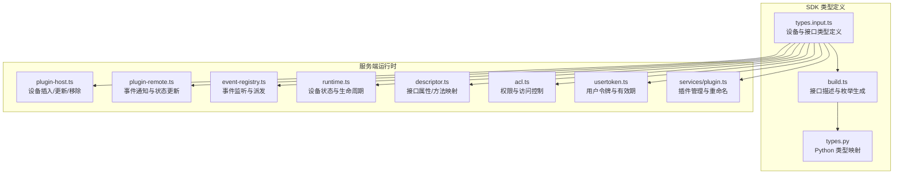
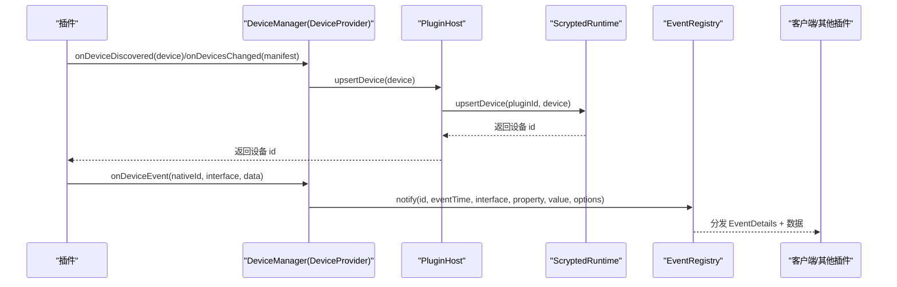
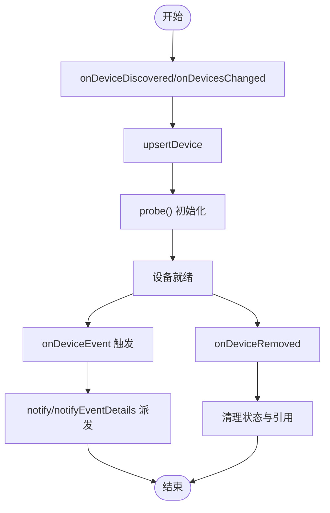
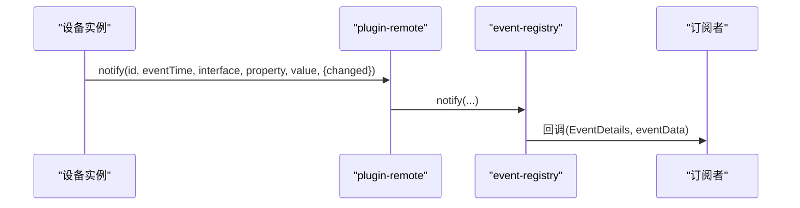
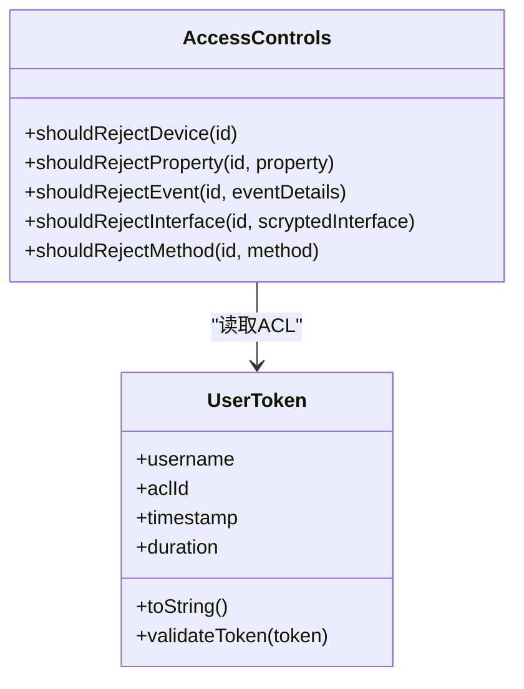
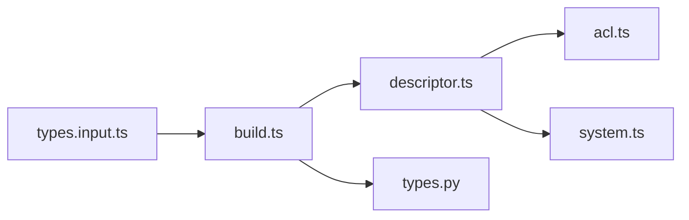

# 核心数据模型

<cite>
**本文引用的文件**
- [types.input.ts](file://sdk/types/src/types.input.ts)
- [build.ts](file://sdk/types/src/build.ts)
- [plugin-host.ts](file://server/src/plugin/plugin-host.ts)
- [plugin-remote.ts](file://server/src/plugin/plugin-remote.ts)
- [event-registry.ts](file://server/src/event-registry.ts)
- [runtime.ts](file://server/src/runtime.ts)
- [descriptor.ts](file://server/src/plugin/descriptor.ts)
- [acl.ts](file://sdk/src/acl.ts)
- [usertoken.ts](file://server/src/usertoken.ts)
- [plugin.ts](file://server/src/services/plugin.ts)
- [main.ts](file://plugins/core/src/main.ts)
- [rtsp.ts](file://plugins/rtsp/src/rtsp.ts)
- [probe.ts](file://plugins/hikvision-doorbell/src/probe.ts)
- [reolink-api.ts](file://plugins/reolink/src/reolink-api.ts)
- [types.py](file://sdk/types/scrypted_python/scrypted_sdk/types.py)
</cite>

## 目录
1. [简介](#简介)
2. [项目结构](#项目结构)
3. [核心组件](#核心组件)
4. [架构总览](#架构总览)
5. [详细组件分析](#详细组件分析)
6. [依赖关系分析](#依赖关系分析)
7. [性能考量](#性能考量)
8. [故障排查指南](#故障排查指南)
9. [结论](#结论)
10. [附录](#附录)

## 简介
本文件面向 Scrypted 的核心数据模型，系统性梳理 ScryptedDevice 设备实体模型、设备生命周期管理、设备接口模型（如 OnOff、Brightness、Camera、VideoCamera）、事件系统（EventDetails、事件类型、时间戳格式、属性变更跟踪）、设备配置参数（Settings 接口、配置项定义、默认值处理）、设备信息模型（DeviceInformation）以及权限与访问控制（ACL 权限定义、用户角色、访问级别）。同时提供 JSON 示例与数据验证规则，帮助开发者快速理解并正确实现设备接入与扩展。

## 项目结构
Scrypted 的核心数据模型由 SDK 类型定义与服务端运行时共同构成：
- SDK 层：定义 ScryptedDevice、接口集合、事件与配置等核心类型，并通过构建脚本生成接口描述与枚举。
- 服务端层：负责设备注册、状态更新、事件分发、权限校验与插件交互。

图表来源
- [types.input.ts](file://sdk/types/src/types.input.ts)
- [build.ts](file://sdk/types/src/build.ts)
- [plugin-host.ts](file://server/src/plugin/plugin-host.ts)
- [plugin-remote.ts](file://server/src/plugin/plugin-remote.ts)
- [event-registry.ts](file://server/src/event-registry.ts)
- [runtime.ts](file://server/src/runtime.ts)
- [descriptor.ts](file://server/src/plugin/descriptor.ts)
- [acl.ts](file://sdk/src/acl.ts)
- [usertoken.ts](file://server/src/usertoken.ts)
- [plugin.ts](file://server/src/services/plugin.ts)

章节来源
- [types.input.ts](file://sdk/types/src/types.input.ts)
- [build.ts](file://sdk/types/src/build.ts)

## 核心组件
本节聚焦 ScryptedDevice 实体模型与关键子模型的字段定义与语义约束。

- ScryptedDevice
  - 标识与归属：id、nativeId、pluginId、providerId
  - 命名与位置：name、room、providedName、providedRoom
  - 类型与接口：type、providedType、interfaces、providedInterfaces、mixins
  - 信息与状态：info（DeviceInformation）、状态属性（如 on、brightness、temperature 等）
  - 能力操作：setName、setRoom、setType、setMixins、probe、listen

- DeviceInformation
  - 字段：model、manufacturer、version、firmware、serialNumber、ip、mac、metadata、managementUrl、deeplink、description
  - 用途：承载设备硬件/固件/网络等静态信息，用于 UI 展示与第三方集成

- EventDetails
  - 字段：eventId（事件唯一标识）、eventInterface（事件所属接口）、eventTime（毫秒级时间戳）、property（属性名，可选）、mixinId（混入设备标识，可选）
  - 用途：统一事件载体，支持属性级事件去噪与混入事件透传

- Settings 接口与配置项
  - 接口：getSettings、putSetting
  - 配置项结构：key、title、type、group/subgroup、placeholder、value、hide、multiple、json、defaultValue 等
  - 默认值处理：defaultValue 作为回退值，未设置时使用

- 设备生命周期
  - 创建：DeviceManager.onDeviceDiscovered/onDevicesChanged 报告设备
  - 注册：DeviceManager.onDeviceDiscovered 返回 id；onDevicesChanged 同步全量设备
  - 状态更新：DeviceManager.onDeviceEvent 触发事件；plugin-remote 更新状态并派发
  - 销毁：DeviceManager.onDeviceRemoved 移除设备

章节来源
- [types.input.ts](file://sdk/types/src/types.input.ts)
- [plugin-host.ts](file://server/src/plugin/plugin-host.ts)
- [plugin-remote.ts](file://server/src/plugin/plugin-remote.ts)
- [event-registry.ts](file://server/src/event-registry.ts)
- [runtime.ts](file://server/src/runtime.ts)

## 架构总览
下图展示从插件上报设备到事件派发与权限校验的关键流程：

图表来源
- [plugin-host.ts](file://server/src/plugin/plugin-host.ts)
- [plugin-remote.ts](file://server/src/plugin/plugin-remote.ts)
- [event-registry.ts](file://server/src/event-registry.ts)

## 详细组件分析

### ScryptedDevice 实体模型
- 关键字段
  - 标识：id（全局唯一）、nativeId（插件内设备标识）、pluginId（插件标识）、providerId（Hub 插件标识）
  - 名称与房间：name、room、providedName、providedRoom
  - 类型与接口：type、providedType、interfaces、providedInterfaces、mixins
  - 信息：info（DeviceInformation）
  - 能力：listen、setName、setRoom、setType、setMixins、probe
- 设计要点
  - provided* 字段允许插件覆盖显示名/房间/类型，便于 UI 自定义
  - mixins 支持动态叠加能力，运行时通过 mixinTable 组合

章节来源
- [types.input.ts](file://sdk/types/src/types.input.ts)

### 设备生命周期管理
- 设备创建
  - onDeviceDiscovered：单个设备发现
  - onDevicesChanged：批量同步设备清单
- 设备注册
  - upsertDevice：插入或更新设备状态，维护 nativeId、interfaces、provided* 等
- 状态更新
  - plugin-remote.notify：兼容旧式事件与新式 EventDetails
  - event-registry.notify/notifyEventDetails：去噪与混入事件派发
- 设备销毁
  - onDeviceRemoved：移除设备并清理状态

图表来源
- [plugin-host.ts](file://server/src/plugin/plugin-host.ts)
- [plugin-remote.ts](file://server/src/plugin/plugin-remote.ts)
- [event-registry.ts](file://server/src/event-registry.ts)
- [runtime.ts](file://server/src/runtime.ts)

章节来源
- [plugin-host.ts](file://server/src/plugin/plugin-host.ts)
- [plugin-remote.ts](file://server/src/plugin/plugin-remote.ts)
- [event-registry.ts](file://server/src/event-registry.ts)
- [runtime.ts](file://server/src/runtime.ts)

### 设备接口模型
以下为核心接口与其状态字段的概览（字段名与类型来源于 SDK 类型定义）：
- OnOff：on（布尔）
- Brightness：brightness（0-100 数值）
- ColorSettingTemperature：colorTemperature（数值，单位 K）
- ColorSettingRgb：rgb（r,g,b 数值）
- ColorSettingHsv：hsv（h:0-360,s:0-1, v:0-1）
- Camera：takePicture、getPictureOptions
- VideoCamera：getVideoStream、getVideoStreamOptions
- StartStop：running（布尔）
- Pause：paused（布尔）
- Dock：docked（布尔）
- TemperatureSetting：temperatureSetting（含 availableModes、mode、setpoint 等）
- HumiditySetting：humiditySetting（含 mode、setpoint 等）
- Fan：fan（含 speed、mode、swing 等）
- Thermometer：temperature（摄氏度）、temperatureUnit
- Notifier：sendNotification（含多种选项）
- Microphone：getAudioStream
- AudioVolumeControl：audioVolumes、setAudioVolumes
- Lock：lockState（Locked/Unlocked/Jammed）
- SecuritySystem：securitySystemState（含 mode、triggered、supportedModes、obstruction）

这些接口的属性与方法均在 SDK 类型定义中声明，构建脚本会提取接口属性/方法并生成枚举与描述，供服务端进行权限与事件路由判断。

章节来源
- [types.input.ts](file://sdk/types/src/types.input.ts)
- [build.ts](file://sdk/types/src/build.ts)

### 事件系统
- EventDetails
  - eventId：事件唯一标识（首次派发时生成）
  - eventInterface：事件所属接口（如 OnOff、Brightness）
  - eventTime：毫秒级时间戳
  - property：触发事件的属性名（属性级事件）
  - mixinId：混入设备标识（混入场景）
- 事件去噪
  - 当 property 存在且 changed=false 时，event-registry 会抑制噪声
- 事件派发
  - notify/notifyEventDetails 将事件广播给监听者

图表来源
- [plugin-remote.ts](file://server/src/plugin/plugin-remote.ts)
- [event-registry.ts](file://server/src/event-registry.ts)

章节来源
- [types.input.ts](file://sdk/types/src/types.input.ts)
- [plugin-remote.ts](file://server/src/plugin/plugin-remote.ts)
- [event-registry.ts](file://server/src/event-registry.ts)

### 设备配置参数（Settings）
- 接口
  - getSettings：返回配置项数组
  - putSetting：写入配置项
- 配置项结构
  - key、title、type、group/subgroup、placeholder、value、hide、multiple、json、defaultValue
- 默认值处理
  - defaultValue 作为回退值，未设置时使用
- 典型用法
  - 插件通过 getSettings 返回 UI 可编辑的配置项
  - 用户修改后通过 putSetting 写入存储

章节来源
- [types.input.ts](file://sdk/types/src/types.input.ts)
- [main.ts](file://plugins/core/src/main.ts)
- [rtsp.ts](file://plugins/rtsp/src/rtsp.ts)

### 设备信息模型（DeviceInformation）
- 字段
  - model、manufacturer、version、firmware、serialNumber、ip、mac、metadata、managementUrl、deeplink、description
- 用途
  - 提供设备硬件/固件/网络等静态信息，用于 UI 展示与第三方集成（如 Alexa、Google Home）

章节来源
- [types.input.ts](file://sdk/types/src/types.input.ts)
- [probe.ts](file://plugins/hikvision-doorbell/src/probe.ts)
- [reolink-api.ts](file://plugins/reolink/src/reolink-api.ts)

### 权限与访问控制（ACL）
- 设备级权限
  - addAccessControlsForInterface：基于接口聚合方法/属性/接口
  - mergeDeviceAccessControls：合并用户设备权限
- 访问控制判定
  - shouldRejectDevice/Property/Event/Interface/Method：根据用户 ACL 与设备权限决定是否拒绝
- 用户令牌
  - UserToken：包含用户名、ACL 标识、时间戳、持续时间，支持解析与有效期校验

图表来源
- [acl.ts](file://sdk/src/acl.ts)
- [usertoken.ts](file://server/src/usertoken.ts)

章节来源
- [acl.ts](file://sdk/src/acl.ts)
- [usertoken.ts](file://server/src/usertoken.ts)

## 依赖关系分析
- 接口描述与枚举
  - build.ts 从类型定义中提取接口的属性与方法，生成 ScryptedInterfaceDescriptors、ScryptedInterfaceProperty、ScryptedInterfaceMethod 等
- 运行时接口映射
  - descriptor.ts 将属性映射到接口，用于权限与事件路由判断
- Python 类型映射
  - build.ts 同步生成 Python 版本的类型与枚举，确保跨语言一致性

图表来源
- [build.ts](file://sdk/types/src/build.ts)
- [descriptor.ts](file://server/src/plugin/descriptor.ts)
- [types.py](file://sdk/types/scrypted_python/scrypted_sdk/types.py)

章节来源
- [build.ts](file://sdk/types/src/build.ts)
- [descriptor.ts](file://server/src/plugin/descriptor.ts)
- [types.py](file://sdk/types/scrypted_python/scrypted_sdk/types.py)

## 性能考量
- 事件去噪：仅当属性变更且 changed=true 时才派发，降低噪声事件对客户端的影响
- 混入失效与重建：当混入表变更时，按需失效并重建，避免设备与混入频繁切换
- 插件重启与状态迁移：renameDeviceId 时保留状态并重新加载插件，减少停机时间
- 适配器与缓存：设备信息（如固件版本、序列号）可通过探测接口获取，避免重复请求

章节来源
- [event-registry.ts](file://server/src/event-registry.ts)
- [runtime.ts](file://server/src/runtime.ts)
- [plugin.ts](file://server/src/services/plugin.ts)

## 故障排查指南
- 设备未显示或接口缺失
  - 检查 Device.providedInterfaces 与 Device.interfaces 是否正确设置
  - 确认插件已调用 onDeviceDiscovered/onDevicesChanged
- 事件不触发或重复
  - 检查 EventDetails.property 与 changed 参数
  - 确认混入设备的 mixinId 设置
- 权限被拒绝
  - 校验用户 ACL 中 devicesAccessControls 的 id、interfaces、properties、methods
  - 使用 AccessControls.shouldReject* 方法定位拒绝原因
- 令牌过期或格式错误
  - 使用 UserToken.validateToken 校验格式、时间戳与有效期

章节来源
- [plugin-host.ts](file://server/src/plugin/plugin-host.ts)
- [plugin-remote.ts](file://server/src/plugin/plugin-remote.ts)
- [event-registry.ts](file://server/src/event-registry.ts)
- [acl.ts](file://sdk/src/acl.ts)
- [usertoken.ts](file://server/src/usertoken.ts)

## 结论
Scrypted 的核心数据模型以 SDK 类型定义为基础，结合服务端运行时完成设备生命周期管理、事件系统与权限控制。通过接口描述与枚举生成，实现了跨语言一致性的能力边界；通过事件去噪与混入机制，提升了系统的稳定性与可扩展性。遵循本文档的字段定义与使用模式，可确保设备接入与配置的一致性与可靠性。

## 附录

### JSON 示例与数据验证规则
- 设备实体（Device/ScryptedDevice）
  - 必填字段：name、type、interfaces
  - 可选字段：nativeId、room、info、mixins、provided* 等
  - 验证规则：type 应为 ScryptedDeviceType 枚举值之一；interfaces 应为 ScryptedInterface 枚举值集合
- EventDetails
  - 必填字段：eventInterface、eventTime
  - 可选字段：eventId、property、mixinId
  - 验证规则：eventTime 为毫秒级时间戳；property 与 mixinId 仅在属性级事件中出现
- DeviceInformation
  - 字段：model、manufacturer、version、firmware、serialNumber、ip、mac、metadata、managementUrl、deeplink、description
  - 验证规则：各字段为字符串或对象，deeplink 为包含苹果/安卓链接的对象
- Settings 配置项
  - 必填字段：key、title
  - 可选字段：type、group/subgroup、placeholder、value、hide、multiple、json、defaultValue
  - 验证规则：type 与 defaultValue 类型匹配；multiple/json 与 value 类型一致

章节来源
- [types.input.ts](file://sdk/types/src/types.input.ts)
- [build.ts](file://sdk/types/src/build.ts)
- [types.py](file://sdk/types/scrypted_python/scrypted_sdk/types.py)