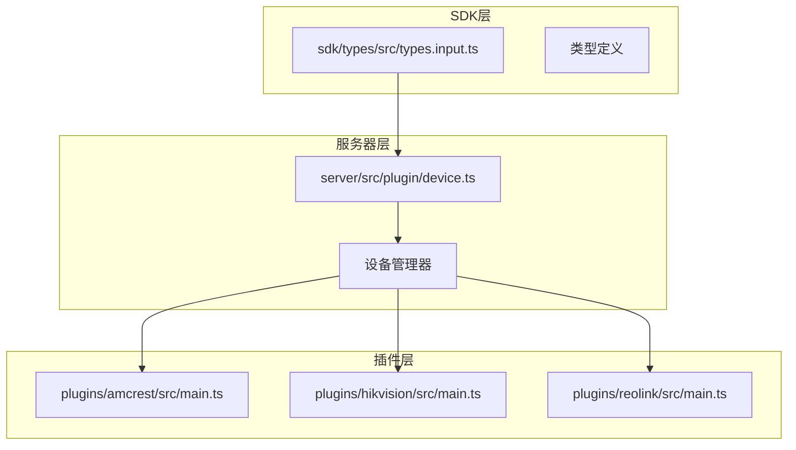
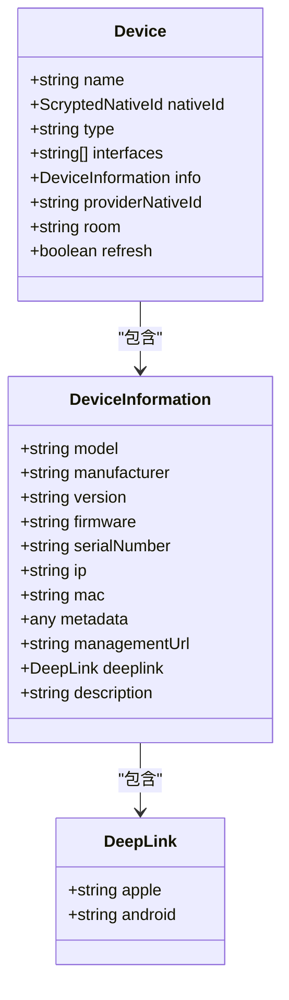
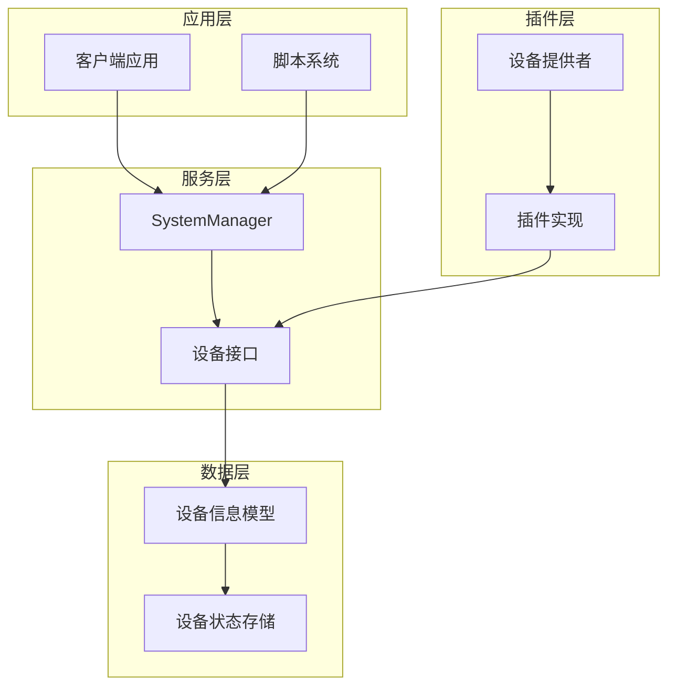
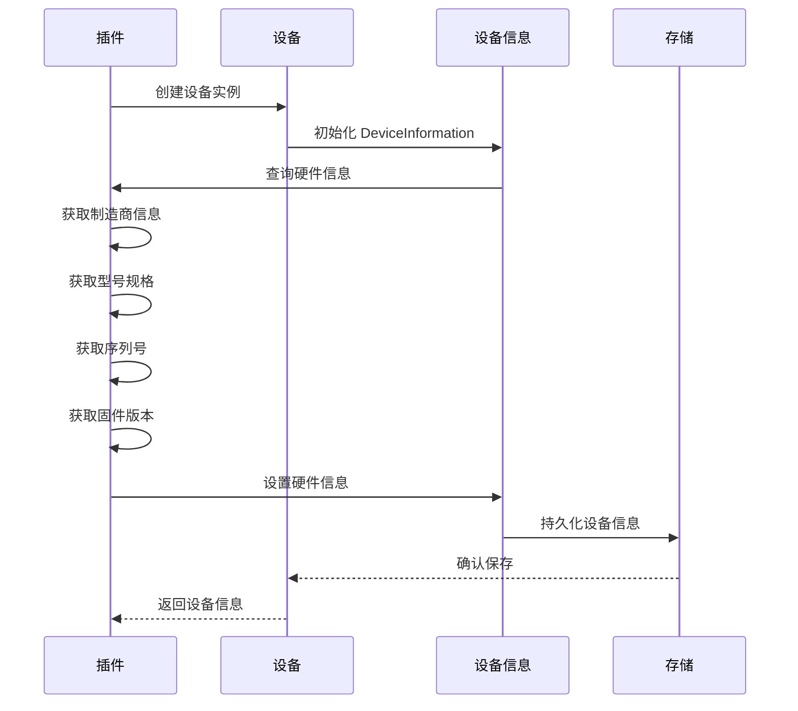
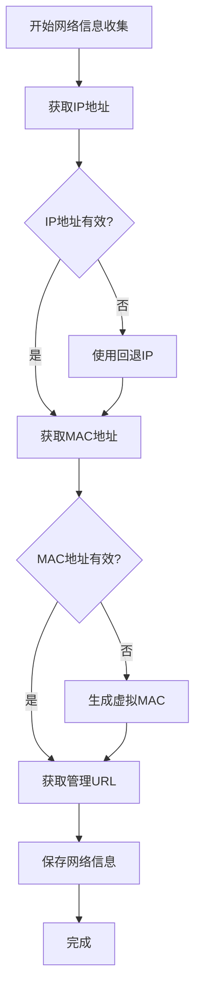
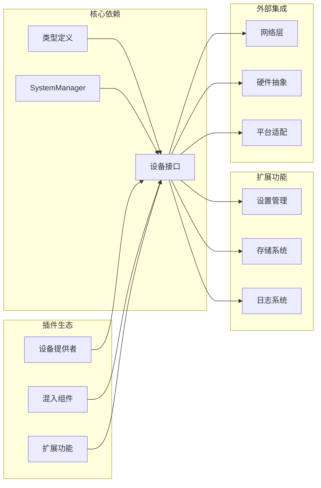

# 设备信息模型

<cite>
**本文档引用的文件**
- [types.input.ts](file://sdk/types/src/types.input.ts)
- [device.ts](file://server/src/plugin/device.ts)
- [amcrest/main.ts](file://plugins/amcrest/src/main.ts)
- [hikvision/main.ts](file://plugins/hikvision/src/main.ts)
- [reolink/main.ts](file://plugins/reolink/src/main.ts)
</cite>

## 目录
1. [简介](#简介)
2. [项目结构](#项目结构)
3. [核心组件](#核心组件)
4. [架构概览](#架构概览)
5. [详细组件分析](#详细组件分析)
6. [依赖关系分析](#依赖关系分析)
7. [性能考虑](#性能考虑)
8. [故障排除指南](#故障排除指南)
9. [结论](#结论)

## 简介

Scrypted 设备信息模型是整个智能家居自动化平台的核心数据结构之一，用于描述和管理所有连接到系统的设备的元数据信息。该模型提供了统一的接口来访问设备的硬件信息、网络配置、地理位置和功能特性等关键属性。

本文档将深入分析 DeviceInformation 接口的完整字段定义，包括硬件信息（制造商、型号、序列号、固件版本）、网络信息（IP地址、MAC地址）以及设备能力信息，并提供实际的JSON示例数据和最佳实践指导。

## 项目结构

Scrypted 项目采用模块化架构设计，设备信息模型主要分布在以下关键目录中：



**图表来源**
- [types.input.ts:2003-2018](file://sdk/types/src/types.input.ts#L2003-L2018)
- [device.ts:86-170](file://server/src/plugin/device.ts#L86-L170)

**章节来源**
- [types.input.ts:2003-2018](file://sdk/types/src/types.input.ts#L2003-L2018)
- [device.ts:86-170](file://server/src/plugin/device.ts#L86-L170)

## 核心组件

### DeviceInformation 接口定义

DeviceInformation 接口是 Scrypted 设备信息模型的核心，定义了设备的所有元数据信息。该接口包含以下主要字段类别：

#### 硬件信息字段
- `manufacturer`: 设备制造商名称
- `model`: 设备型号规格
- `serialNumber`: 设备序列号
- `version`: 设备版本信息

#### 软件信息字段
- `firmware`: 固件版本信息
- `hardwareVersion`: 硬件版本标识
- `pluginVersion`: 插件版本信息

#### 网络信息字段
- `ip`: 设备IP地址
- `mac`: 设备MAC地址
- `managementUrl`: 设备管理URL

#### 扩展信息字段
- `metadata`: 自定义元数据对象
- `deeplink`: 平台深链配置
- `description`: 设备描述信息

**章节来源**
- [types.input.ts:2003-2018](file://sdk/types/src/types.input.ts#L2003-L2018)

### 设备接口集成

Device 接口通过 `info` 属性集成了 DeviceInformation 模型，实现了设备信息的统一管理和访问：



**图表来源**
- [types.input.ts:2024-2043](file://sdk/types/src/types.input.ts#L2024-L2043)
- [types.input.ts:2003-2018](file://sdk/types/src/types.input.ts#L2003-L2018)

**章节来源**
- [types.input.ts:2024-2043](file://sdk/types/src/types.input.ts#L2024-L2043)

## 架构概览

Scrypted 的设备信息模型采用分层架构设计，确保了数据的一致性和可扩展性：



**图表来源**
- [types.input.ts:2150-2199](file://sdk/types/src/types.input.ts#L2150-L2199)
- [device.ts:86-170](file://server/src/plugin/device.ts#L86-L170)

## 详细组件分析

### 硬件信息处理流程

设备硬件信息的获取和更新遵循以下流程：



**图表来源**
- [amcrest/main.ts:746-747](file://plugins/amcrest/src/main.ts#L746-L747)
- [hikvision/main.ts:111-114](file://plugins/hikvision/src/main.ts#L111-L114)

### 网络信息管理

网络信息的收集和维护是设备信息模型的重要组成部分：



**图表来源**
- [reolink/main.ts:560-563](file://plugins/reolink/src/main.ts#L560-L563)

### 实际使用示例

以下展示了不同插件中 DeviceInformation 的实际使用模式：

#### 海康威视插件示例
```typescript
// 设备信息初始化
info.model = deviceInfo.deviceModel;
info.mac = deviceInfo.macAddress;
info.firmware = deviceInfo.firmwareVersion;
info.serialNumber = deviceInfo.serialNumber;
```

#### 安讯士插件示例
```typescript
// 设备信息初始化
info.model = deviceInfo.deviceType;
info.serialNumber = deviceInfo.serialNumber;
```

#### 罗克韦尔插件示例
```typescript
// 设备信息初始化
info.ip = ip;
info.serialNumber = this.storageSettings.values.deviceInfo?.serial;
info.firmware = this.storageSettings.values.deviceInfo?.firmVer;
info.version = this.storageSettings.values.deviceInfo?.hardVer;
```

**章节来源**
- [hikvision/main.ts:111-114](file://plugins/hikvision/src/main.ts#L111-L114)
- [amcrest/main.ts:746-747](file://plugins/amcrest/src/main.ts#L746-L747)
- [reolink/main.ts:560-563](file://plugins/reolink/src/main.ts#L560-L563)

## 依赖关系分析

设备信息模型在系统中的依赖关系如下：



**图表来源**
- [types.input.ts:17-50](file://sdk/types/src/types.input.ts#L17-L50)
- [device.ts:86-170](file://server/src/plugin/device.ts#L86-L170)

**章节来源**
- [types.input.ts:17-50](file://sdk/types/src/types.input.ts#L17-L50)
- [device.ts:86-170](file://server/src/plugin/device.ts#L86-L170)

## 性能考虑

### 内存优化策略

设备信息模型在内存使用方面采用了多项优化措施：

1. **延迟加载**: 设备信息仅在需要时才进行查询和解析
2. **缓存机制**: 频繁访问的信息会被缓存以减少重复查询
3. **增量更新**: 只更新发生变化的信息字段，避免全量重写

### 网络传输优化

为了提高网络传输效率，设备信息模型实现了以下优化：

1. **压缩传输**: 对大型设备信息进行压缩后再传输
2. **批量更新**: 将多个设备信息更新合并为批量操作
3. **差分同步**: 只传输发生变化的数据部分

## 故障排除指南

### 常见问题诊断

#### 设备信息缺失问题
当遇到设备信息不完整的情况时，可以按照以下步骤进行排查：

1. **检查插件实现**: 确认设备插件正确实现了信息收集逻辑
2. **验证网络连接**: 确保设备能够正常响应网络请求
3. **检查权限设置**: 验证插件具有访问设备信息所需的权限

#### 数据格式错误
如果出现设备信息格式错误的问题：

1. **验证字段类型**: 确保每个字段都符合预期的数据类型
2. **检查编码格式**: 确认字符串编码符合UTF-8标准
3. **验证数值范围**: 确保数值字段在合理的范围内

**章节来源**
- [types.input.ts:2003-2018](file://sdk/types/src/types.input.ts#L2003-L2018)

## 结论

Scrypted 的设备信息模型通过标准化的 DeviceInformation 接口，为整个智能家居生态系统提供了统一的设备元数据管理方案。该模型不仅涵盖了设备的基本硬件信息，还包括了网络配置、地理位置和功能特性等关键属性，为设备的发现、配置和管理提供了坚实的基础。

通过插件化的架构设计，Scrypted 能够支持各种不同类型的设备，同时保持了系统的可扩展性和维护性。随着智能家居生态的不断发展，设备信息模型将继续演进，以满足更多样化的设备管理和控制需求。

该模型的成功实施证明了在复杂的分布式系统中，标准化的数据结构和清晰的接口定义对于构建可靠、可维护的系统的重要性。通过提供一致的设备信息访问方式，Scrypted 为用户和开发者创造了一个更加友好和高效的智能家居开发环境。