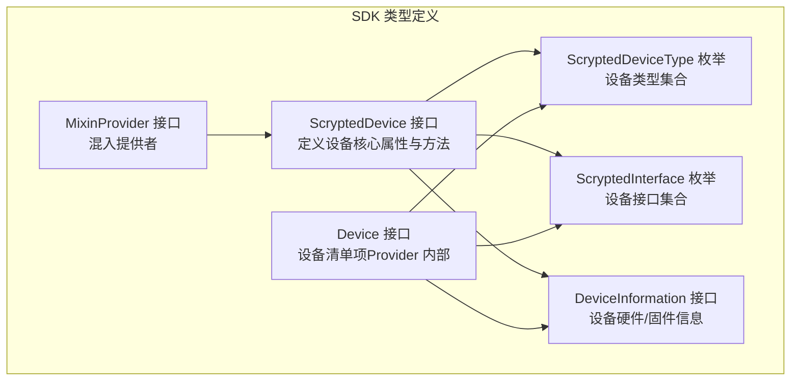
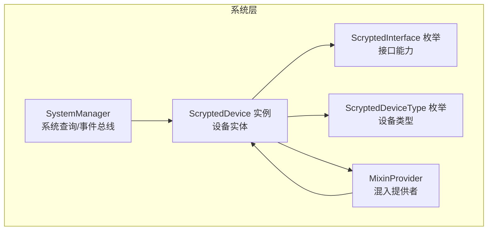
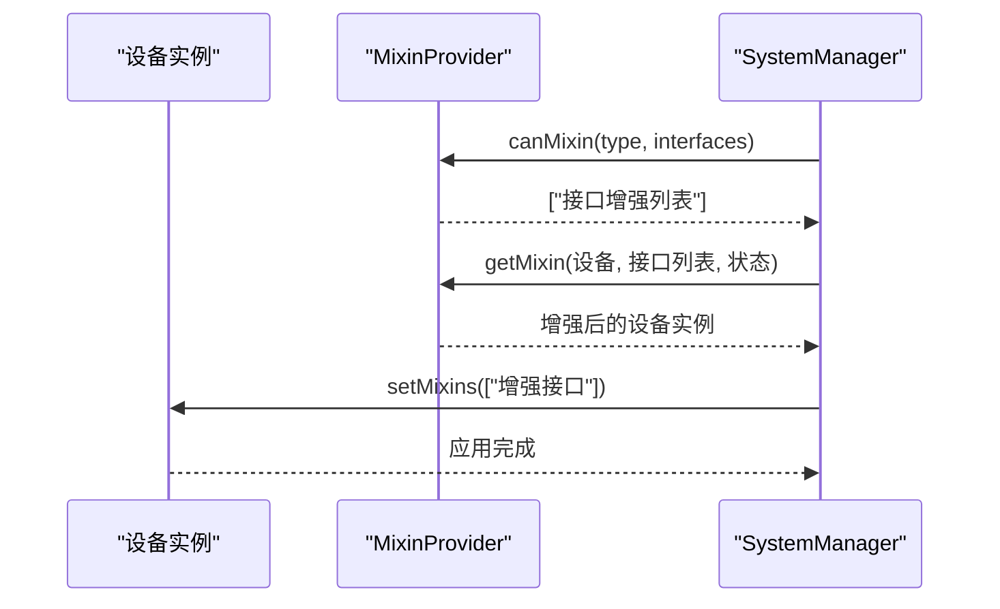
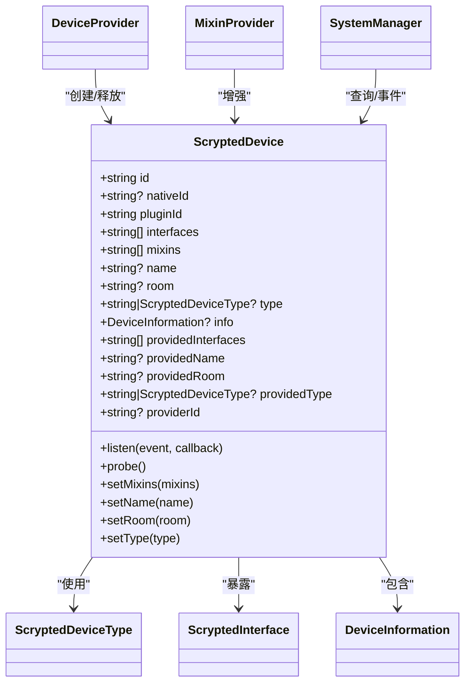

# 设备实体模型

<cite>
**本文引用的文件**
- [types.input.ts](file://sdk/types/src/types.input.ts)
- [types.py](file://sdk/types/scrypted_python/scrypted_sdk/types.py)
</cite>

## 目录
1. [简介](#简介)
2. [项目结构](#项目结构)
3. [核心组件](#核心组件)
4. [架构总览](#架构总览)
5. [详细组件分析](#详细组件分析)
6. [依赖关系分析](#依赖关系分析)
7. [性能考量](#性能考量)
8. [故障排查指南](#故障排查指南)
9. [结论](#结论)
10. [附录](#附录)

## 简介
本文件为 Scrypted 设备实体模型的权威规范文档，聚焦于 ScryptedDevice 接口的完整定义与使用约束，涵盖设备标识符、名称、房间、类型、接口集合、混入机制、生命周期属性以及常见设备类型的实体结构示例。本文同时阐明 providedInterfaces 与 interfaces 的差异、mixins 的作用与工作原理，并给出 JSON 结构示例以帮助实现与集成。

## 项目结构
Scrypted 的设备模型主要由 SDK 类型定义提供，核心位于 TypeScript 类型文件中，Python 版本类型用于兼容 Python 生态。以下图展示了与设备实体模型直接相关的类型与接口：

**图表来源**
- [types.input.ts:17-50](file://sdk/types/src/types.input.ts#L17-L50)
- [types.input.ts:105-162](file://sdk/types/src/types.input.ts#L105-L162)
- [types.input.ts:2382-2486](file://sdk/types/src/types.input.ts#L2382-L2486)
- [types.input.ts:2003-2018](file://sdk/types/src/types.input.ts#L2003-L2018)
- [types.input.ts:2024-2043](file://sdk/types/src/types.input.ts#L2024-L2043)
- [types.input.ts:2212-2227](file://sdk/types/src/types.input.ts#L2212-L2227)

**章节来源**
- [types.input.ts:17-50](file://sdk/types/src/types.input.ts#L17-L50)
- [types.input.ts:105-162](file://sdk/types/src/types.input.ts#L105-L162)
- [types.input.ts:2382-2486](file://sdk/types/src/types.input.ts#L2382-L2486)
- [types.input.ts:2003-2018](file://sdk/types/src/types.input.ts#L2003-L2018)
- [types.input.ts:2024-2043](file://sdk/types/src/types.input.ts#L2024-L2043)
- [types.input.ts:2212-2227](file://sdk/types/src/types.input.ts#L2212-L2227)

## 核心组件
本节对 ScryptedDevice 的关键字段进行逐项说明，并给出约束与语义。

- 标识与归属
  - id：设备在系统中的唯一标识符，字符串类型。用于跨组件引用与事件路由。
  - nativeId：设备在提供者内部使用的本地标识，可为空或字符串。
  - pluginId：提供该设备的插件标识，字符串类型。
  - providerId：提供者（Hub/DeviceProvider）的标识，可选。
  - mixins：当前应用到该设备的混入列表，字符串数组。

- 基本属性
  - name：设备显示名称，可选。
  - room：设备所在房间，可选。
  - type：设备类型，来自 ScryptedDeviceType 或字符串，可选。
  - info：设备硬件/固件信息，DeviceInformation 可选。

- 接口与混入
  - interfaces：设备当前暴露的接口集合（字符串或枚举值），用于声明能力。
  - providedInterfaces：设备“实际提供”的接口集合，通常与 interfaces 一致，但可能被混入增强。
  - providedName/providedRoom/providedType：混入可能覆盖的显示名、房间与类型，便于统一 UI 展示。

- 生命周期与管理
  - probe()：探测设备并确保其与所需混入已创建。
  - setMixins(mixins)：动态设置混入列表。
  - setName/setRoom/setType：动态修改显示名、房间与类型。

- 事件与监听
  - listen(event, callback)：订阅特定接口或属性变化事件；支持 EventListenerOptions 进行去噪、被动监听、指定 mixinId 等。

- 其他
  - setMixins、setName、setRoom、setType 方法均为异步，返回 Promise<void>。

**章节来源**
- [types.input.ts:17-50](file://sdk/types/src/types.input.ts#L17-L50)
- [types.input.ts:61-91](file://sdk/types/src/types.input.ts#L61-L91)
- [types.input.ts:31-34](file://sdk/types/src/types.input.ts#L31-L34)
- [types.input.ts:29](file://sdk/types/src/types.input.ts#L29)

## 架构总览
下图展示了设备实体在系统中的角色与交互关系：

**图表来源**
- [types.input.ts:2150-2206](file://sdk/types/src/types.input.ts#L2150-L2206)
- [types.input.ts:2212-2227](file://sdk/types/src/types.input.ts#L2212-L2227)
- [types.input.ts:2382-2486](file://sdk/types/src/types.input.ts#L2382-L2486)
- [types.input.ts:105-162](file://sdk/types/src/types.input.ts#L105-L162)

## 详细组件分析

### ScryptedDevice 接口与字段详解
- 字段与类型
  - id: string
  - nativeId: ScryptedNativeId（可选）
  - pluginId: string
  - interfaces: (ScryptedInterface | string)[]
  - mixins: string[]
  - name: string（可选）
  - room: string（可选）
  - type: ScryptedDeviceType | string（可选）
  - info: DeviceInformation（可选）
  - providedInterfaces: (ScryptedInterface | string)[]
  - providedName: string（可选）
  - providedRoom: string（可选）
  - providedType: ScryptedDeviceType | string（可选）
  - providerId: string（可选）

- 方法
  - listen(event, callback): 订阅事件或属性变更
  - probe(): Promise<boolean>
  - setMixins(mixins): Promise<void>
  - setName(name): Promise<void>
  - setRoom(room): Promise<void>
  - setType(type): Promise<void>

- 语义与约束
  - id 必须全局唯一；nativeId 在同一插件内唯一即可。
  - pluginId 与 providerId 用于区分来源与归属。
  - interfaces 与 providedInterfaces 的差异：
    - interfaces 表示设备当前可见的接口集合。
    - providedInterfaces 表示设备“真正提供”的接口集合，混入可能改变此集合。
  - mixins 数组用于声明需要应用到该设备的混入，混入会增强或覆盖设备行为与属性（如 providedName/Room/Type）。

**章节来源**
- [types.input.ts:17-50](file://sdk/types/src/types.input.ts#L17-L50)
- [types.input.ts:2382-2486](file://sdk/types/src/types.input.ts#L2382-L2486)
- [types.input.ts:105-162](file://sdk/types/src/types.input.ts#L105-L162)

### 设备类型与接口枚举
- 设备类型（部分）
  - Camera、Switch、Light、Outlet、Sensor、Thermostat、Lock、Speaker、SmartSpeaker、Doorbell、Vacuum、Notifier、SecuritySystem、WindowCovering、AirPurifier、Internet、Network、Bridge、LLM、Unknown 等。
- 接口类型（部分）
  - OnOff、Brightness、ColorSettingTemperature、ColorSettingRgb、ColorSettingHsv、Camera、VideoCamera、VideoRecorder、VideoClips、Lock、PasswordStore、Scene、Entry、EntrySensor、Battery、Charger、Reboot、Refresh、MediaPlayer、Online、BufferConverter、MediaConverter、Settings、BinarySensor、TamperSensor、Sleep、PowerSensor、AudioSensor、MotionSensor、AmbientLightSensor、OccupancySensor、FloodSensor、UltravioletSensor、LuminanceSensor、PositionSensor、SecuritySystem、PM10Sensor、PM25Sensor、VOCSensor、NOXSensor、CO2Sensor、AirQualitySensor、AirPurifier、FilterMaintenance、Readme、OauthClient、MixinProvider、HttpRequestHandler、EngineIOHandler、PushHandler、Program、Scriptable、ClusterForkInterface、ObjectDetector、ObjectDetection、ObjectDetectionPreview、ObjectDetectionGenerator、HumiditySetting、Fan、RTCSignalingChannel、RTCSignalingClient、LauncherApplication、ScryptedUser、VideoFrameGenerator、StreamService、TTY、TTYSettings、ChatCompletion、TextEmbedding、ImageEmbedding、LLMTools、ScryptedSystemDevice、ScryptedDeviceCreator、ScryptedSettings。

**章节来源**
- [types.input.ts:105-162](file://sdk/types/src/types.input.ts#L105-L162)
- [types.input.ts:2382-2486](file://sdk/types/src/types.input.ts#L2382-L2486)

### 混入机制与增强原理
- MixinProvider 能力
  - canMixin(type, interfaces)：判断是否可为某类型设备创建混入。
  - getMixin(mixinDevice, mixinDeviceInterfaces, mixinDeviceState)：返回增强后的设备实例。
  - releaseMixin(id, mixinDevice)：释放混入设备。
- 混入对设备的影响
  - 通过 setMixins 动态应用混入，混入可添加新接口、覆盖属性（如 providedName、providedRoom、providedType）。
  - 混入增强后，设备的 providedInterfaces 与显示元信息可能发生变化，但原始 id、pluginId、providerId 不变。

**图表来源**
- [types.input.ts:2212-2227](file://sdk/types/src/types.input.ts#L2212-L2227)
- [types.input.ts:29](file://sdk/types/src/types.input.ts#L29)

**章节来源**
- [types.input.ts:2212-2227](file://sdk/types/src/types.input.ts#L2212-L2227)
- [types.input.ts:29](file://sdk/types/src/types.input.ts#L29)

### 设备生命周期与事件
- 生命周期关键点
  - 创建：DeviceProvider 通过 DeviceManager 报告设备（Device 清单项）。
  - 增强：系统根据混入策略调用 MixinProvider，增强设备接口与属性。
  - 运行：设备对外暴露 providedInterfaces，SystemManager 与客户端通过 ScryptedDevice 访问。
  - 更新：probe() 确保设备与混入状态一致；setMixins/setName/setRoom/setType 支持运行时调整。
  - 移除：DeviceManager.onDevicesChanged 或 onDeviceRemoved 触发移除。
- 事件订阅
  - 使用 listen() 订阅接口事件或属性变化；支持去噪、被动监听、指定 mixinId 等选项。

**章节来源**
- [types.input.ts:1198-1270](file://sdk/types/src/types.input.ts#L1198-L1270)
- [types.input.ts:61-91](file://sdk/types/src/types.input.ts#L61-L91)
- [types.input.ts:21-34](file://sdk/types/src/types.input.ts#L21-L34)

### 设备清单 Device 与系统查询
- Device（Provider 内部使用）
  - name/nativeId/type/interfaces/info/providerNativeId/room/refresh 等字段。
  - 用于 DeviceManager.onDevicesChanged 同步全量设备。
- SystemManager 查询
  - getDeviceById/getDeviceByName 支持按 id 或名称检索设备实例（ScryptedDevice）。

**章节来源**
- [types.input.ts:2024-2043](file://sdk/types/src/types.input.ts#L2024-L2043)
- [types.input.ts:2150-2206](file://sdk/types/src/types.input.ts#L2150-L2206)

## 依赖关系分析
- ScryptedDevice 依赖
  - ScryptedDeviceType：限定设备类型范围。
  - ScryptedInterface：限定设备能力接口集合。
  - DeviceInformation：设备硬件/固件信息。
- 与 Provider/Mixin 的关系
  - DeviceProvider：创建/释放设备实例。
  - MixinProvider：增强设备接口与属性。
- 与 SystemManager 的关系
  - SystemManager 提供查询、事件订阅与设备访问入口。

**图表来源**
- [types.input.ts:17-50](file://sdk/types/src/types.input.ts#L17-L50)
- [types.input.ts:105-162](file://sdk/types/src/types.input.ts#L105-L162)
- [types.input.ts:2382-2486](file://sdk/types/src/types.input.ts#L2382-L2486)
- [types.input.ts:2003-2018](file://sdk/types/src/types.input.ts#L2003-L2018)
- [types.input.ts:1276-1288](file://sdk/types/src/types.input.ts#L1276-L1288)
- [types.input.ts:2212-2227](file://sdk/types/src/types.input.ts#L2212-L2227)
- [types.input.ts:2150-2206](file://sdk/types/src/types.input.ts#L2150-L2206)

**章节来源**
- [types.input.ts:17-50](file://sdk/types/src/types.input.ts#L17-L50)
- [types.input.ts:105-162](file://sdk/types/src/types.input.ts#L105-L162)
- [types.input.ts:2382-2486](file://sdk/types/src/types.input.ts#L2382-L2486)
- [types.input.ts:2003-2018](file://sdk/types/src/types.input.ts#L2003-L2018)
- [types.input.ts:1276-1288](file://sdk/types/src/types.input.ts#L1276-L1288)
- [types.input.ts:2212-2227](file://sdk/types/src/types.input.ts#L2212-L2227)
- [types.input.ts:2150-2206](file://sdk/types/src/types.input.ts#L2150-L2206)

## 性能考量
- 接口选择与事件订阅
  - 仅订阅必要的接口与事件，避免过度监听导致的资源消耗。
  - 使用 EventListenerOptions 的 denoise/watch/mixinId 等选项优化事件处理。
- 混入策略
  - 合理设置 mixins，避免不必要的接口增强造成额外开销。
- 探测与刷新
  - 使用 probe() 确保设备状态一致性；对于需要轮询的设备，实现 Refresh 接口交由系统统一调度。

[本节为通用指导，无需具体文件分析]

## 故障排查指南
- 设备无法被发现
  - 检查 DeviceManager.onDevicesChanged 是否正确上报设备清单（Device）。
  - 确认 Device.nativeId 与 providerNativeId 设置正确。
- 设备接口缺失或异常
  - 检查 interfaces 与 providedInterfaces 是否符合预期。
  - 验证 MixinProvider.canMixin 与 getMixin 返回值。
- 事件不触发或重复触发
  - 检查 listen() 的 EventListenerOptions 配置（denoise/watch/mixinId）。
  - 确认设备状态更新路径（DeviceState）是否正确写入。
- 运行时修改无效
  - 确认 setName/setRoom/setType/setMixins 的调用时机与参数。
  - 对于需要重新创建的变更，考虑调用 probe() 以确保一致性。

**章节来源**
- [types.input.ts:1198-1270](file://sdk/types/src/types.input.ts#L1198-L1270)
- [types.input.ts:61-91](file://sdk/types/src/types.input.ts#L61-L91)
- [types.input.ts:21-34](file://sdk/types/src/types.input.ts#L21-L34)

## 结论
ScryptedDevice 是设备实体的核心抽象，通过明确的标识、类型、接口与混入机制，实现了设备能力的标准化与可扩展性。理解 interfaces 与 providedInterfaces 的差异、mixins 的增强原理，以及生命周期与事件模型，是构建稳定设备插件与集成的关键。建议在实现中严格遵循本文档的字段语义与约束，并结合示例 JSON 结构进行验证。

[本节为总结，无需具体文件分析]

## 附录

### JSON 示例：不同设备类型的实体结构
以下为常见设备类型的实体结构示意（字段与取值仅为示例，非真实数据）：
- 摄像头（Camera）
  - 关键字段：id、pluginId、providerId、nativeId、type=Camera、interfaces 包含 Camera/VideoCamera 等、providedInterfaces、name、room、info。
- 开关（Switch）
  - 关键字段：id、pluginId、providerId、nativeId、type=Switch、interfaces 包含 OnOff、Brightness 等、providedInterfaces、name、room。
- 传感器（Sensor）
  - 关键字段：id、pluginId、providerId、nativeId、type=Sensor、interfaces 包含温度/湿度/光照/占卜等传感器接口、providedInterfaces、name、room。
- 空调（Thermostat）
  - 关键字段：id、pluginId、providerId、nativeId、type=Thermostat、interfaces 包含 TemperatureSetting、HumiditySetting、Fan 等、providedInterfaces、name、room。
- 门锁（Lock）
  - 关键字段：id、pluginId、providerId、nativeId、type=Lock、interfaces 包含 Lock、PasswordStore 等、providedInterfaces、name、room。
- 安防主机（SecuritySystem）
  - 关键字段：id、pluginId、providerId、nativeId、type=SecuritySystem、interfaces 包含 SecuritySystem、EntrySensor 等、providedInterfaces、name、room。

[本节为概念性示例，无需具体文件分析]