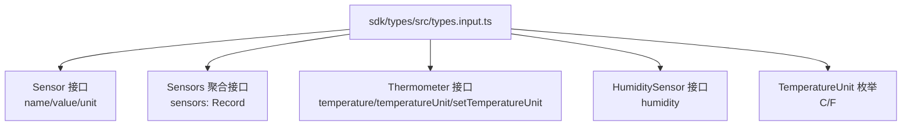
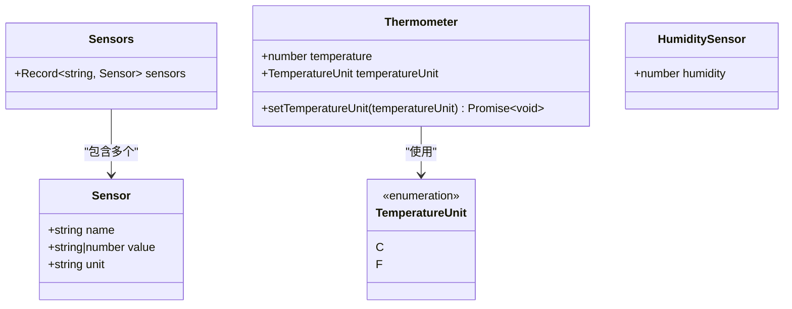
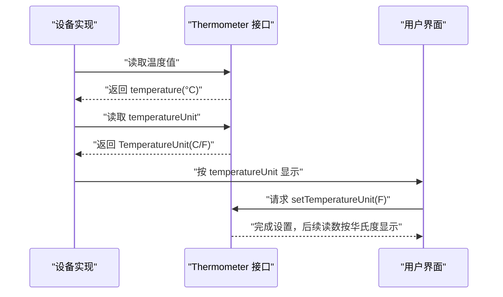
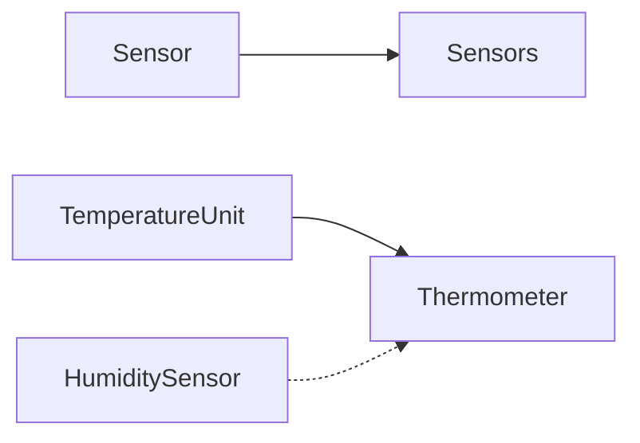

# 传感器接口

<cite>
**本文档引用的文件**
- [types.input.ts](file://sdk/types/src/types.input.ts)
</cite>

## 目录
1. [简介](#简介)
2. [项目结构](#项目结构)
3. [核心组件](#核心组件)
4. [架构总览](#架构总览)
5. [详细组件分析](#详细组件分析)
6. [依赖关系分析](#依赖关系分析)
7. [性能考虑](#性能考虑)
8. [故障排除指南](#故障排除指南)
9. [结论](#结论)
10. [附录](#附录)

## 简介
本规范文档聚焦于 Scrypted SDK 中的传感器相关接口，系统性地定义并说明以下能力：
- 基础传感器数据结构 Sensor 的字段：name、value、unit
- 温度测量接口 Thermometer 的属性与方法：temperature、temperatureUnit 及设置方法
- 湿度测量接口 HumiditySensor 的属性：humidity
- 温度单位枚举 TemperatureUnit 支持的单位类型
- 多传感器聚合接口 Sensors 的结构与使用方式
- 传感器数据读取与单位处理的实际使用示例（通过接口定义与调用流程说明）

本规范旨在帮助开发者正确理解与实现传感器设备在 Scrypted 生态中的统一数据模型与交互方式。

## 项目结构
传感器接口定义位于 SDK 类型声明文件中，采用 TypeScript 接口与枚举的形式进行描述，便于在所有插件与客户端之间保持一致的数据契约。

图表来源
- [types.input.ts:239-247](file://sdk/types/src/types.input.ts#L239-L247)
- [types.input.ts:400-417](file://sdk/types/src/types.input.ts#L400-L417)
- [types.input.ts:411-414](file://sdk/types/src/types.input.ts#L411-L414)

章节来源
- [types.input.ts:239-247](file://sdk/types/src/types.input.ts#L239-L247)
- [types.input.ts:400-417](file://sdk/types/src/types.input.ts#L400-L417)
- [types.input.ts:411-414](file://sdk/types/src/types.input.ts#L411-L414)

## 核心组件
本节对每个传感器相关接口进行逐项说明，明确其职责、字段含义与典型用法。

- Sensor 接口
  - 字段
    - name: 字符串，表示传感器名称或标识
    - value: 数值或字符串，表示当前读数；可为空
    - unit: 字符串，表示数值单位；可为空
  - 用途
    - 作为单个传感器的最小数据单元，用于上报或聚合展示

- Sensors 聚合接口
  - 字段
    - sensors: 键值映射，键为传感器标识字符串，值为 Sensor 对象
  - 用途
    - 将多个 Sensor 聚合在一个对象内，便于批量读取与展示

- Thermometer 接口
  - 字段
    - temperature: 数值，表示环境温度（摄氏度）
    - temperatureUnit: 温度单位枚举，表示用户可见的单位类型
  - 方法
    - setTemperatureUnit(temperatureUnit: TemperatureUnit): 设置显示单位
  - 说明
    - temperature 字段始终以摄氏度返回，temperatureUnit 决定用户界面显示的单位

- HumiditySensor 接口
  - 字段
    - humidity: 数值，表示相对湿度百分比
  - 用途
    - 提供单一湿度测量值

- TemperatureUnit 枚举
  - C: 摄氏度
  - F: 华氏度
  - 用途
    - 与 Thermometer 配合，控制温度显示单位

章节来源
- [types.input.ts:239-247](file://sdk/types/src/types.input.ts#L239-L247)
- [types.input.ts:400-417](file://sdk/types/src/types.input.ts#L400-L417)
- [types.input.ts:411-414](file://sdk/types/src/types.input.ts#L411-L414)

## 架构总览
下图展示了传感器接口之间的关系与典型交互路径：

图表来源
- [types.input.ts:239-247](file://sdk/types/src/types.input.ts#L239-L247)
- [types.input.ts:400-417](file://sdk/types/src/types.input.ts#L400-L417)
- [types.input.ts:411-414](file://sdk/types/src/types.input.ts#L411-L414)

## 详细组件分析

### Sensor 接口
- 设计要点
  - 统一的最小传感器数据单元，支持字符串与数值两种读数类型，便于兼容不同传感器输出格式
  - unit 字段允许自定义单位字符串，便于跨语言与本地化展示
- 典型场景
  - 单点温度、湿度、光照强度等单一指标上报
  - 作为 Sensors 聚合对象中的元素被复用

章节来源
- [types.input.ts:239-247](file://sdk/types/src/types.input.ts#L239-L247)

### Sensors 聚合接口
- 设计要点
  - 使用 Record<string, Sensor> 结构，键为传感器标识，值为 Sensor 实例
  - 适合多通道或多区域传感器设备的统一聚合
- 典型场景
  - 室内多房间温度/湿度监测
  - 多通道环境监测设备的数据汇总

章节来源
- [types.input.ts:245-247](file://sdk/types/src/types.input.ts#L245-L247)

### Thermometer 接口
- 设计要点
  - temperature 固定以摄氏度返回，确保内部一致性与计算准确性
  - temperatureUnit 控制用户界面显示单位，避免混淆
  - 提供 setTemperatureUnit 方法，允许运行时切换显示单位
- 数据流示意

图表来源
- [types.input.ts:400-417](file://sdk/types/src/types.input.ts#L400-L417)
- [types.input.ts:411-414](file://sdk/types/src/types.input.ts#L411-L414)

章节来源
- [types.input.ts:400-417](file://sdk/types/src/types.input.ts#L400-L417)
- [types.input.ts:411-414](file://sdk/types/src/types.input.ts#L411-L414)

### HumiditySensor 接口
- 设计要点
  - humidity 字段直接提供相对湿度数值
  - 适用于无需单位切换的湿度读数场景
- 典型场景
  - 空气湿度监测
  - 与温度数据结合用于体感评估

章节来源
- [types.input.ts:415-417](file://sdk/types/src/types.input.ts#L415-L417)

### TemperatureUnit 枚举
- 设计要点
  - 仅包含 C 与 F 两种单位
  - 与 Thermometer 的 temperatureUnit 字段配合使用
- 典型场景
  - 用户偏好设置
  - 区域性单位习惯适配

章节来源
- [types.input.ts:411-414](file://sdk/types/src/types.input.ts#L411-L414)

## 依赖关系分析
- Sensor 与 Sensors
  - Sensors 通过 Record<string, Sensor> 聚合多个 Sensor
  - 无循环依赖，耦合度低，便于扩展
- Thermometer 与 TemperatureUnit
  - Thermometer 依赖 TemperatureUnit 进行单位控制
  - 无外部副作用，纯数据契约
- HumiditySensor 独立存在，不依赖其他传感器接口
- 整体关系清晰，职责单一，易于测试与替换

图表来源
- [types.input.ts:239-247](file://sdk/types/src/types.input.ts#L239-L247)
- [types.input.ts:400-417](file://sdk/types/src/types.input.ts#L400-L417)
- [types.input.ts:411-414](file://sdk/types/src/types.input.ts#L411-L414)
- [types.input.ts:415-417](file://sdk/types/src/types.input.ts#L415-L417)

## 性能考虑
- Sensor.value 支持字符串与数值类型，建议在设备端尽量使用数值以减少解析开销
- Sensors 聚合对象应避免频繁重建，优先在内存中维护并增量更新
- Thermometer.temperature 固定摄氏度，避免重复换算带来的误差与性能损耗
- TemperatureUnit 切换仅影响显示层，不涉及底层数据存储，操作成本低

## 故障排除指南
- 读取到的 temperature 与 temperatureUnit 不一致
  - 确认 temperature 字段始终为摄氏度，temperatureUnit 仅控制显示
  - 如需转换，请在应用层进行单位换算，而非修改底层数据
- humidity 读数异常
  - 检查设备是否正确实现 HumiditySensor 接口
  - 确认数值范围符合预期（通常为 0–100）
- Sensors 聚合读数缺失
  - 检查 sensors 映射中对应键是否存在
  - 确保每个 Sensor 的 name 与 unit 字段有效

## 结论
本规范明确了 Scrypted 传感器接口的数据结构与交互方式，强调了：
- Sensor/Sensors 提供统一且灵活的单点与聚合读数模型
- Thermometer 以摄氏度为核心数据，通过 TemperatureUnit 控制显示单位
- HumiditySensor 提供简洁的湿度读数接口
- 通过清晰的接口边界与枚举约束，降低集成复杂度并提升互操作性

## 附录
- 实际使用示例（基于接口定义的流程说明）
  - 读取温度
    - 获取 Thermometer 接口实例
    - 读取 temperature（单位为摄氏度）
    - 读取 temperatureUnit 并按需显示
  - 切换单位
    - 调用 setTemperatureUnit(TemperatureUnit.F) 切换为华氏度
    - 后续读取仍返回摄氏度数值，但 UI 层以华氏度展示
  - 读取湿度
    - 获取 HumiditySensor 接口实例
    - 读取 humidity 百分比
  - 聚合多传感器
    - 获取 Sensors 接口实例
    - 遍历 sensors 映射，逐个读取 Sensor.name/value/unit
  - 注意
    - 所有数值字段均为可选，需在消费端做好空值与类型判断
    - 若需要字符串形式的读数，请在设备端或应用层进行格式化