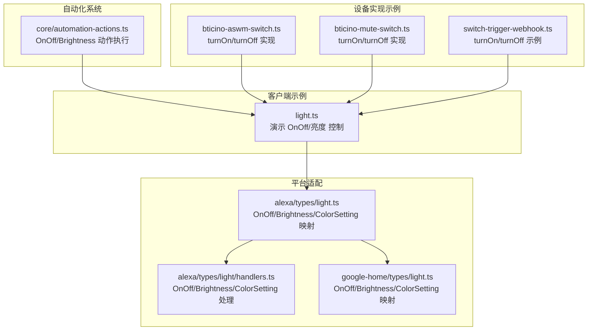
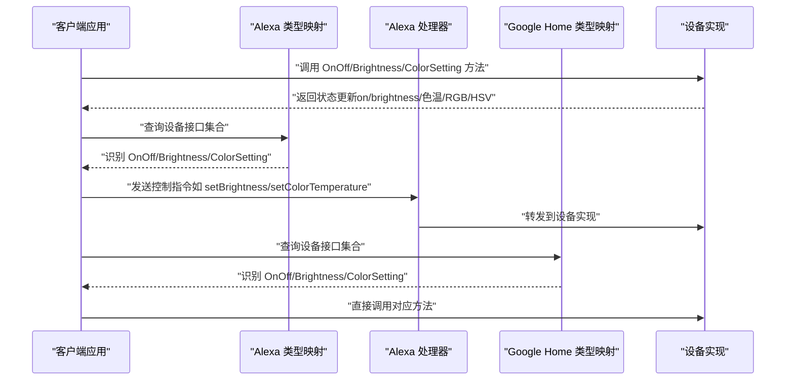
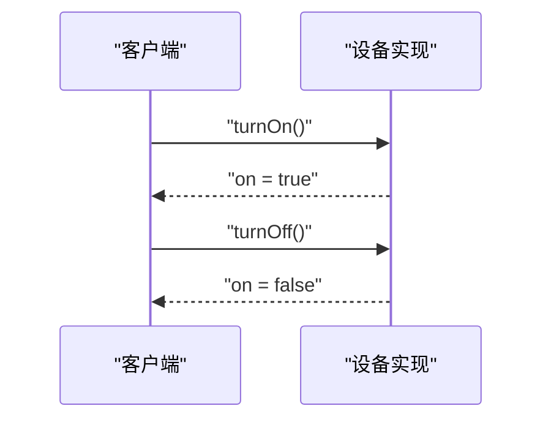
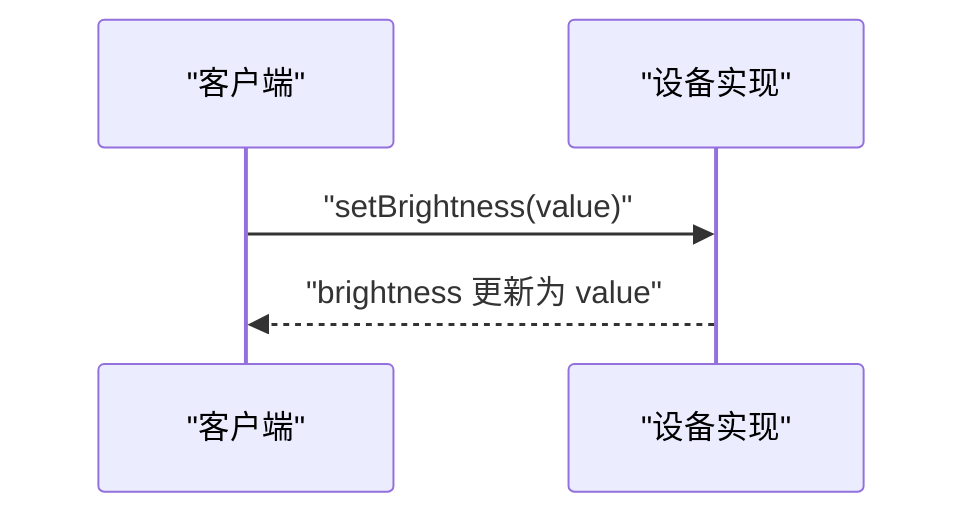
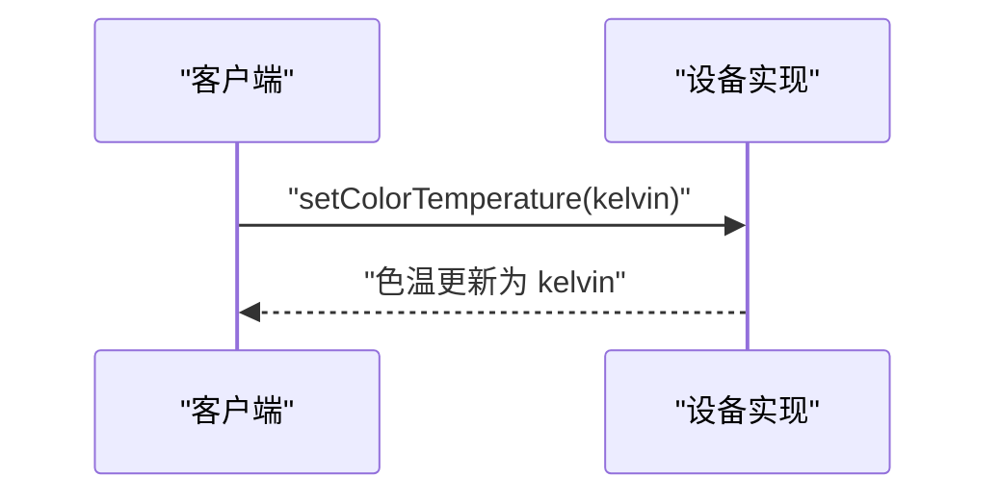
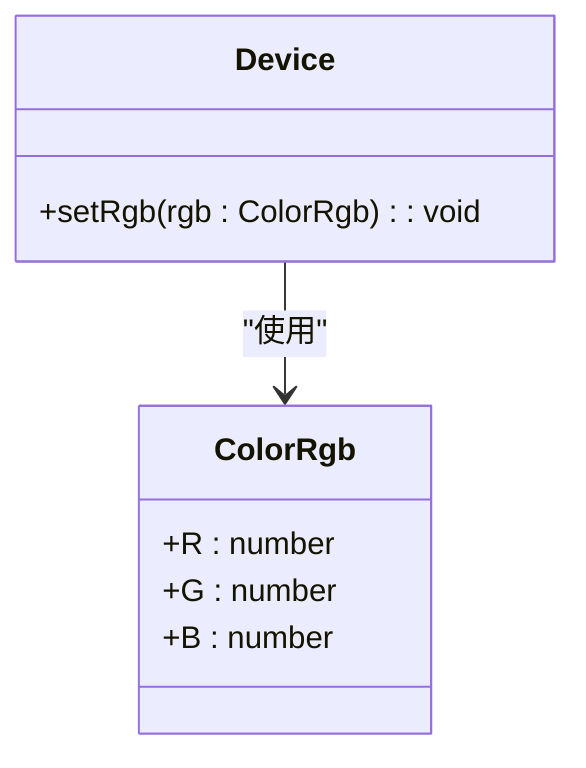
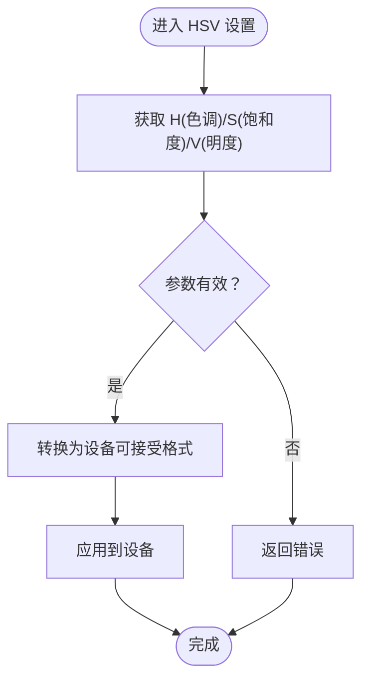
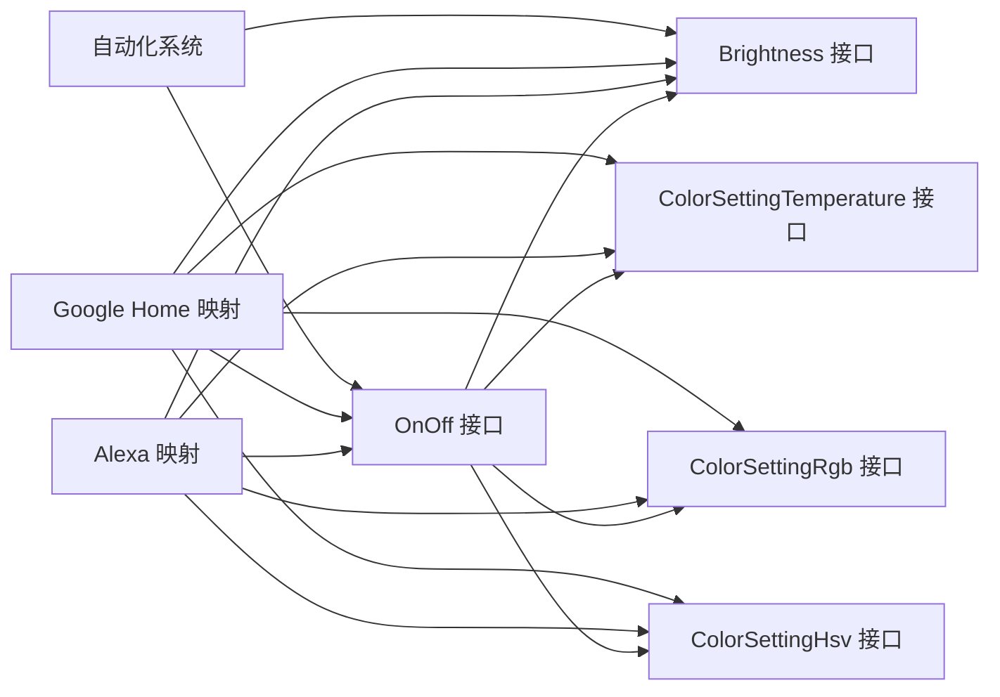

# 基础控制接口

<cite>
**本文引用的文件**
- [packages/client/examples/light.ts](file://packages/client/examples/light.ts)
- [plugins/alexa/src/types/light.ts](file://plugins/alexa/src/types/light.ts)
- [plugins/alexa/src/types/light/handlers.ts](file://plugins/alexa/src/types/light/handlers.ts)
- [plugins/google-home/src/types/light.ts](file://plugins/google-home/src/types/light.ts)
- [plugins/core/src/automation-actions.ts](file://plugins/core/src/automation-actions.ts)
- [plugins/bticino/src/bticino-aswm-switch.ts](file://plugins/bticino/src/bticino-aswm-switch.ts)
- [plugins/bticino/src/bticino-mute-switch.ts](file://plugins/bticino/src/bticino-mute-switch.ts)
- [plugins/core/fs/examples/switch-trigger-webhook.ts](file://plugins/core/fs/examples/switch-trigger-webhook.ts)
</cite>

## 目录
1. [简介](#简介)
2. [项目结构](#项目结构)
3. [核心组件](#核心组件)
4. [架构总览](#架构总览)
5. [详细组件分析](#详细组件分析)
6. [依赖分析](#依赖分析)
7. [性能考虑](#性能考虑)
8. [故障排查指南](#故障排查指南)
9. [结论](#结论)
10. [附录](#附录)

## 简介
本规范文档聚焦于基础控制接口，涵盖以下能力：
- OnOff 接口：设备的开关控制（turnOn、turnOff）与状态属性 on
- Brightness 接口：亮度调节（setBrightness）与属性 brightness 的取值范围
- ColorSettingTemperature 接口：色温控制（setColorTemperature）与色温范围
- ColorSettingRgb 接口：RGB 颜色设置（setRgb）与 ColorRgb 数据结构
- ColorSettingHsv 接口：HSV 颜色模式支持

文档提供各接口的使用示例与最佳实践，帮助开发者在不同生态（如 Alexa、Google Home、自动化系统等）中正确集成与调用。

## 项目结构
与基础控制接口相关的关键位置：
- 客户端示例：展示 OnOff 与亮度控制的基本用法
- 插件适配层：在 Alexa、Google Home 等平台中对 OnOff/Brightness/ColorSetting 的识别与映射
- 自动化系统：基于 OnOff/Brightness 的动作执行
- 设备实现示例：部分设备插件对 OnOff 的具体实现

**图表来源**
- [packages/client/examples/light.ts:15-17](file://packages/client/examples/light.ts#L15-L17)
- [plugins/alexa/src/types/light.ts:6-130](file://plugins/alexa/src/types/light.ts#L6-L130)
- [plugins/alexa/src/types/light/handlers.ts:41-162](file://plugins/alexa/src/types/light/handlers.ts#L41-L162)
- [plugins/google-home/src/types/light.ts:6-25](file://plugins/google-home/src/types/light.ts#L6-L25)
- [plugins/core/src/automation-actions.ts:21-61](file://plugins/core/src/automation-actions.ts#L21-L61)
- [plugins/bticino/src/bticino-aswm-switch.ts:15-22](file://plugins/bticino/src/bticino-aswm-switch.ts#L15-L22)
- [plugins/bticino/src/bticino-mute-switch.ts:12-17](file://plugins/bticino/src/bticino-mute-switch.ts#L12-L17)
- [plugins/core/fs/examples/switch-trigger-webhook.ts:8-11](file://plugins/core/fs/examples/switch-trigger-webhook.ts#L8-L11)

**章节来源**
- [packages/client/examples/light.ts:15-17](file://packages/client/examples/light.ts#L15-L17)
- [plugins/alexa/src/types/light.ts:6-130](file://plugins/alexa/src/types/light.ts#L6-L130)
- [plugins/alexa/src/types/light/handlers.ts:41-162](file://plugins/alexa/src/types/light/handlers.ts#L41-L162)
- [plugins/google-home/src/types/light.ts:6-25](file://plugins/google-home/src/types/light.ts#L6-L25)
- [plugins/core/src/automation-actions.ts:21-61](file://plugins/core/src/automation-actions.ts#L21-L61)
- [plugins/bticino/src/bticino-aswm-switch.ts:15-22](file://plugins/bticino/src/bticino-aswm-switch.ts#L15-L22)
- [plugins/bticino/src/bticino-mute-switch.ts:12-17](file://plugins/bticino/src/bticino-mute-switch.ts#L12-L17)
- [plugins/core/fs/examples/switch-trigger-webhook.ts:8-11](file://plugins/core/fs/examples/switch-trigger-webhook.ts#L8-L11)

## 核心组件
- OnOff 接口
  - 能力：控制设备的开启/关闭
  - 方法：turnOn()、turnOff()
  - 状态属性：on（布尔）
  - 使用场景：开关类设备（如灯、插座、摄像头辅助光等）
  - 参考示例：客户端示例中的 OnOff 演示；设备实现示例中的 turnOn/turnOff 实现

- Brightness 接口
  - 能力：调节设备亮度
  - 方法：setBrightness(value)
  - 状态属性：brightness（数值）
  - 取值范围：通常为 0 到 100 的整数或浮点数，具体以设备能力为准
  - 使用场景：可调光设备（如灯泡、显示器背光）

- ColorSettingTemperature 接口
  - 能力：调节色温
  - 方法：setColorTemperature(kelvin)
  - 范围：常见范围为 2000K 到 8000K 或更广，具体以设备能力为准
  - 使用场景：可变色温灯具

- ColorSettingRgb 接口
  - 能力：设置 RGB 颜色
  - 方法：setRgb(ColorRgb)
  - 数据结构：ColorRgb（包含 R、G、B 三通道值，通常为 0-255 的整数）

- ColorSettingHsv 接口
  - 能力：通过 HSV 模式设置颜色
  - 使用场景：需要按色调、饱和度、明度进行颜色控制的设备

**章节来源**
- [packages/client/examples/light.ts:15-17](file://packages/client/examples/light.ts#L15-L17)
- [plugins/alexa/src/types/light.ts:25-55](file://plugins/alexa/src/types/light.ts#L25-L55)
- [plugins/alexa/src/types/light/handlers.ts:41-162](file://plugins/alexa/src/types/light/handlers.ts#L41-L162)
- [plugins/google-home/src/types/light.ts:12-20](file://plugins/google-home/src/types/light.ts#L12-L20)
- [plugins/core/src/automation-actions.ts:21-61](file://plugins/core/src/automation-actions.ts#L21-L61)

## 架构总览
下图展示了从客户端到平台适配再到设备实现的整体流程，以及 OnOff/Brightness/ColorSetting 在不同层的处理方式。

**图表来源**
- [plugins/alexa/src/types/light.ts:6-130](file://plugins/alexa/src/types/light.ts#L6-L130)
- [plugins/alexa/src/types/light/handlers.ts:41-162](file://plugins/alexa/src/types/light/handlers.ts#L41-L162)
- [plugins/google-home/src/types/light.ts:6-25](file://plugins/google-home/src/types/light.ts#L6-L25)
- [packages/client/examples/light.ts:15-17](file://packages/client/examples/light.ts#L15-L17)

## 详细组件分析

### OnOff 接口
- 职责
  - 提供设备的开关控制能力
  - 维护状态属性 on，表示当前是否开启
- 关键方法
  - turnOn()：开启设备
  - turnOff()：关闭设备
- 典型使用
  - 客户端示例中演示了先开启再关闭的操作序列
  - 设备实现示例中展示了具体的 turnOn/turnOff 实现
  - 平台适配层通过接口集合判断是否支持 OnOff，并据此生成事件与映射
- 最佳实践
  - 在调用 turnOn/turnOff 前检查设备是否具备 OnOff 接口
  - 对于摄像头辅助光等设备，建议在 turnOn 后延迟确认状态
  - 在自动化系统中，结合 on 状态进行条件判断

**图表来源**
- [packages/client/examples/light.ts:15-17](file://packages/client/examples/light.ts#L15-L17)
- [plugins/bticino/src/bticino-aswm-switch.ts:15-22](file://plugins/bticino/src/bticino-aswm-switch.ts#L15-L22)
- [plugins/bticino/src/bticino-mute-switch.ts:12-17](file://plugins/bticino/src/bticino-mute-switch.ts#L12-L17)
- [plugins/core/fs/examples/switch-trigger-webhook.ts:8-11](file://plugins/core/fs/examples/switch-trigger-webhook.ts#L8-L11)

**章节来源**
- [packages/client/examples/light.ts:15-17](file://packages/client/examples/light.ts#L15-L17)
- [plugins/alexa/src/types/light.ts:6-130](file://plugins/alexa/src/types/light.ts#L6-L130)
- [plugins/bticino/src/bticino-aswm-switch.ts:15-22](file://plugins/bticino/src/bticino-aswm-switch.ts#L15-L22)
- [plugins/bticino/src/bticino-mute-switch.ts:12-17](file://plugins/bticino/src/bticino-mute-switch.ts#L12-L17)
- [plugins/core/fs/examples/switch-trigger-webhook.ts:8-11](file://plugins/core/fs/examples/switch-trigger-webhook.ts#L8-L11)

### Brightness 接口
- 职责
  - 控制设备亮度
  - 提供当前亮度属性 brightness
- 关键方法
  - setBrightness(value)：设置亮度值
- 取值范围
  - 常见范围为 0 到 100（整数或浮点），具体以设备能力为准
- 典型使用
  - 平台适配层根据设备是否包含 Brightness 接口生成相应控制器
  - 自动化系统可读取 brightness 并据此执行动作
- 最佳实践
  - 设置亮度前检查设备是否支持 Brightness 接口
  - 对于不支持精确步进的设备，建议采用平滑过渡策略
  - 在 UI 中以百分比形式呈现，便于用户理解

**图表来源**
- [plugins/alexa/src/types/light.ts:25-40](file://plugins/alexa/src/types/light.ts#L25-L40)
- [plugins/alexa/src/types/light/handlers.ts:41-52](file://plugins/alexa/src/types/light/handlers.ts#L41-L52)
- [plugins/google-home/src/types/light.ts:12-15](file://plugins/google-home/src/types/light.ts#L12-L15)
- [plugins/core/src/automation-actions.ts:61](file://plugins/core/src/automation-actions.ts#L61)

**章节来源**
- [plugins/alexa/src/types/light.ts:25-40](file://plugins/alexa/src/types/light.ts#L25-L40)
- [plugins/alexa/src/types/light/handlers.ts:41-52](file://plugins/alexa/src/types/light/handlers.ts#L41-L52)
- [plugins/google-home/src/types/light.ts:12-15](file://plugins/google-home/src/types/light.ts#L12-L15)
- [plugins/core/src/automation-actions.ts:61](file://plugins/core/src/automation-actions.ts#L61)

### ColorSettingTemperature 接口
- 职责
  - 控制设备色温
  - 提供当前色温属性（单位：开尔文）
- 关键方法
  - setColorTemperature(kelvin)：设置色温
- 范围
  - 常见范围为 2000K 到 8000K 或更广，具体以设备能力为准
- 典型使用
  - 平台适配层检测设备是否包含该接口并生成相应控制器
  - 处理器接收色温变更请求并转发给设备实现
- 最佳实践
  - 在 UI 中以“冷白/中性/暖白”等语义化标签辅助用户选择
  - 对于支持连续调节的设备，建议提供增量调节（+/- 500K）的快捷操作

**图表来源**
- [plugins/alexa/src/types/light.ts:40-55](file://plugins/alexa/src/types/light.ts#L40-L55)
- [plugins/alexa/src/types/light/handlers.ts:140-162](file://plugins/alexa/src/types/light/handlers.ts#L140-L162)

**章节来源**
- [plugins/alexa/src/types/light.ts:40-55](file://plugins/alexa/src/types/light.ts#L40-L55)
- [plugins/alexa/src/types/light/handlers.ts:140-162](file://plugins/alexa/src/types/light/handlers.ts#L140-L162)

### ColorSettingRgb 接口
- 职责
  - 通过 RGB 通道设置颜色
- 关键方法
  - setRgb(ColorRgb)
- 数据结构
  - ColorRgb：包含 R、G、B 三通道值，通常为 0-255 的整数
- 典型使用
  - 平台适配层在识别到该接口时，会生成相应的颜色控制器
- 最佳实践
  - 对于非全彩 LED 设备，建议在 UI 中提供常用颜色预设
  - 注意不同设备对 RGB 的混合效果差异，避免过度饱和导致失真

**图表来源**
- [plugins/alexa/src/types/light.ts:16-17](file://plugins/alexa/src/types/light.ts#L16-L17)
- [plugins/google-home/src/types/light.ts:15-17](file://plugins/google-home/src/types/light.ts#L15-L17)

**章节来源**
- [plugins/alexa/src/types/light.ts:16-17](file://plugins/alexa/src/types/light.ts#L16-L17)
- [plugins/google-home/src/types/light.ts:15-17](file://plugins/google-home/src/types/light.ts#L15-L17)

### ColorSettingHsv 接口
- 职责
  - 通过 HSV 模式设置颜色（色调、饱和度、明度）
- 典型使用
  - 平台适配层在识别到该接口时，会生成相应的颜色控制器
- 最佳实践
  - 在 UI 中以直观的色轮与滑杆形式呈现，提升交互体验
  - 对于低预算设备，建议优先保证色调与饱和度的准确性

**图表来源**
- [plugins/alexa/src/types/light.ts:55-60](file://plugins/alexa/src/types/light.ts#L55-L60)
- [plugins/google-home/src/types/light.ts:20-25](file://plugins/google-home/src/types/light.ts#L20-L25)

**章节来源**
- [plugins/alexa/src/types/light.ts:55-60](file://plugins/alexa/src/types/light.ts#L55-L60)
- [plugins/google-home/src/types/light.ts:20-25](file://plugins/google-home/src/types/light.ts#L20-L25)

## 依赖分析
- 接口依赖关系
  - OnOff 是最基础的能力，多数设备都会实现
  - Brightness、ColorSettingTemperature、ColorSettingRgb、ColorSettingHsv 为可选扩展
- 平台适配依赖
  - Alexa 与 Google Home 通过接口集合判断是否启用对应控制器
- 自动化系统依赖
  - 自动化动作会读取 on/brightness 等状态并执行 turnOn/turnOff 或 setBrightness

**图表来源**
- [plugins/alexa/src/types/light.ts:6-130](file://plugins/alexa/src/types/light.ts#L6-L130)
- [plugins/google-home/src/types/light.ts:6-25](file://plugins/google-home/src/types/light.ts#L6-L25)
- [plugins/core/src/automation-actions.ts:21-61](file://plugins/core/src/automation-actions.ts#L21-L61)

**章节来源**
- [plugins/alexa/src/types/light.ts:6-130](file://plugins/alexa/src/types/light.ts#L6-L130)
- [plugins/google-home/src/types/light.ts:6-25](file://plugins/google-home/src/types/light.ts#L6-L25)
- [plugins/core/src/automation-actions.ts:21-61](file://plugins/core/src/automation-actions.ts#L21-L61)

## 性能考虑
- 批量控制
  - 在一次交互中尽量减少多次往返调用，合并亮度与色温调整
- 状态同步
  - 对高频状态读取（如 on/brightness）进行本地缓存，降低网络压力
- 平台适配
  - 平台层应避免重复查询接口集合，建议在设备初始化时缓存结果
- 设备实现
  - 对于不支持瞬时响应的设备，建议在 UI 中显示加载态并延迟刷新状态

## 故障排查指南
- OnOff 无效
  - 确认设备已声明 OnOff 接口
  - 检查设备电源与连接状态
  - 查看平台日志中是否存在接口缺失或权限问题
- Brightness 不生效
  - 确认设备支持 Brightness 接口
  - 检查传入值是否在 0-100 范围内
  - 对于不支持百分比的设备，确认其内部映射逻辑
- ColorSettingTemperature 异常
  - 确认 kelvin 值在设备支持范围内（常见 2000K-8000K）
  - 尝试增量调节（+/- 500K）以验证设备是否支持连续调节
- ColorSettingRgb/HSV 失败
  - 确认设备支持对应接口
  - 检查 ColorRgb/HSV 参数是否符合设备期望的数据格式

**章节来源**
- [plugins/alexa/src/types/light.ts:6-130](file://plugins/alexa/src/types/light.ts#L6-L130)
- [plugins/alexa/src/types/light/handlers.ts:41-162](file://plugins/alexa/src/types/light/handlers.ts#L41-L162)
- [plugins/google-home/src/types/light.ts:6-25](file://plugins/google-home/src/types/light.ts#L6-L25)

## 结论
基础控制接口是智能家居设备通用能力的核心抽象。通过 OnOff、Brightness、ColorSettingTemperature、ColorSettingRgb、ColorSettingHsv 的协同，可以覆盖大多数照明与氛围控制场景。建议在设备实现中明确声明接口能力，在平台适配中正确识别并在自动化系统中合理使用，以获得稳定一致的用户体验。

## 附录
- 使用示例参考路径
  - OnOff 开关控制：[packages/client/examples/light.ts:15-17](file://packages/client/examples/light.ts#L15-L17)
  - Brightness 亮度调节：[plugins/alexa/src/types/light/handlers.ts:41-52](file://plugins/alexa/src/types/light/handlers.ts#L41-L52)
  - ColorSettingTemperature 色温调节：[plugins/alexa/src/types/light/handlers.ts:140-162](file://plugins/alexa/src/types/light/handlers.ts#L140-L162)
  - ColorSettingRgb 颜色设置：[plugins/alexa/src/types/light.ts:16-17](file://plugins/alexa/src/types/light.ts#L16-L17)
  - ColorSettingHsv 颜色模式：[plugins/alexa/src/types/light.ts:55-60](file://plugins/alexa/src/types/light.ts#L55-L60)
- 平台适配参考路径
  - Alexa 映射与事件：[plugins/alexa/src/types/light.ts:6-130](file://plugins/alexa/src/types/light.ts#L6-L130)
  - Google Home 映射：[plugins/google-home/src/types/light.ts:6-25](file://plugins/google-home/src/types/light.ts#L6-L25)
- 自动化系统参考路径
  - OnOff/Brightness 动作执行：[plugins/core/src/automation-actions.ts:21-61](file://plugins/core/src/automation-actions.ts#L21-L61)