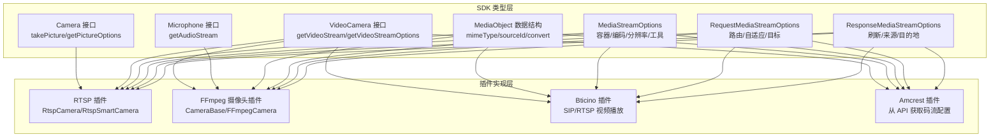
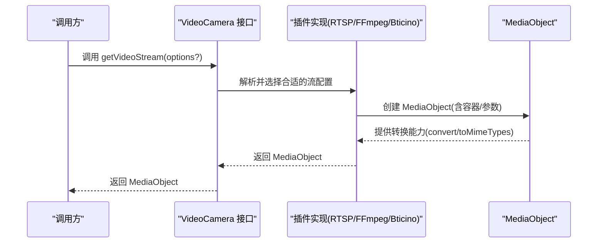
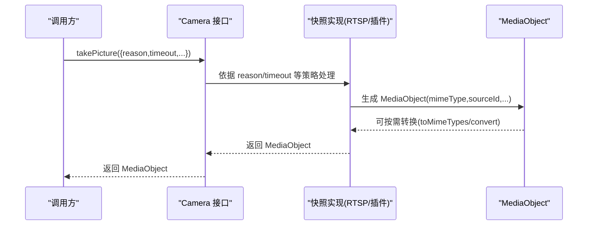
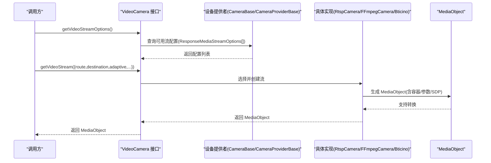
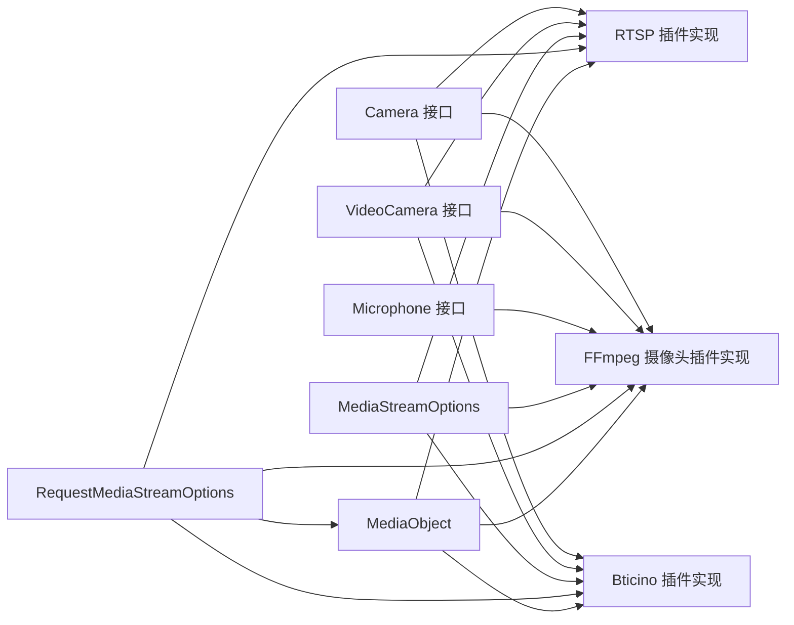

# 媒体设备接口

<cite>
**本文引用的文件**
- [sdk/types/src/types.input.ts](file://sdk/types/src/types.input.ts)
- [plugins/rtsp/src/rtsp.ts](file://plugins/rtsp/src/rtsp.ts)
- [plugins/ffmpeg-camera/src/common.ts](file://plugins/ffmpeg-camera/src/common.ts)
- [plugins/ffmpeg-camera/src/main.ts](file://plugins/ffmpeg-camera/src/main.ts)
- [plugins/bticino/src/bticino-camera.ts](file://plugins/bticino/src/bticino-camera.ts)
- [plugins/amcrest/src/main.ts](file://plugins/amcrest/src/main.ts)
</cite>

## 目录
1. [简介](#简介)
2. [项目结构](#项目结构)
3. [核心组件](#核心组件)
4. [架构总览](#架构总览)
5. [详细组件分析](#详细组件分析)
6. [依赖关系分析](#依赖关系分析)
7. [性能考虑](#性能考虑)
8. [故障排查指南](#故障排查指南)
9. [结论](#结论)
10. [附录](#附录)

## 简介
本规范文档面向媒体设备接口，聚焦以下能力：
- 摄像头拍照：Camera 接口的 takePicture() 方法与 RequestPictureOptions、ResponsePictureOptions 参数结构
- 视频流获取：VideoCamera 接口的 getVideoStream() 与 getVideoStreamOptions() 方法
- 流媒体选项：MediaStreamOptions 的完整配置（容器类型、编码参数、分辨率等）
- 请求与响应：RequestMediaStreamOptions 的请求参数与 ResponseMediaStreamOptions 的响应结构
- 媒体对象：MediaObject 的数据结构与转换机制
- 音频设备：Microphone 接口的音频流获取
- 实际示例与性能优化建议

## 项目结构
媒体设备接口的核心类型定义位于 SDK 类型文件中，具体实现分布在多个插件中：
- SDK 类型定义：Camera、VideoCamera、Microphone、MediaObject、MediaStreamOptions 等
- RTSP 插件：提供基于 RTSP 的视频流封装与快照策略
- FFmpeg 摄像头插件：通过 FFmpeg 输入参数生成流媒体选项并创建 MediaObject
- Bticino 插件：基于 SIP/RTSP 的双向对讲与视频播放
- Amcrest 插件：从设备 API 获取可用码流配置并构造流选项

图表来源
- [sdk/types/src/types.input.ts](file://sdk/types/src/types.input.ts)
- [plugins/rtsp/src/rtsp.ts](file://plugins/rtsp/src/rtsp.ts)
- [plugins/ffmpeg-camera/src/common.ts](file://plugins/ffmpeg-camera/src/common.ts)
- [plugins/ffmpeg-camera/src/main.ts](file://plugins/ffmpeg-camera/src/main.ts)
- [plugins/bticino/src/bticino-camera.ts](file://plugins/bticino/src/bticino-camera.ts)
- [plugins/amcrest/src/main.ts](file://plugins/amcrest/src/main.ts)

章节来源
- [sdk/types/src/types.input.ts](file://sdk/types/src/types.input.ts)
- [plugins/rtsp/src/rtsp.ts](file://plugins/rtsp/src/rtsp.ts)
- [plugins/ffmpeg-camera/src/common.ts](file://plugins/ffmpeg-camera/src/common.ts)
- [plugins/ffmpeg-camera/src/main.ts](file://plugins/ffmpeg-camera/src/main.ts)
- [plugins/bticino/src/bticino-camera.ts](file://plugins/bticino/src/bticino-camera.ts)
- [plugins/amcrest/src/main.ts](file://plugins/amcrest/src/main.ts)

## 核心组件
- Camera 接口：提供 takePicture(options?) 与 getPictureOptions()，用于拍照与图片参数查询
- VideoCamera 接口：提供 getVideoStream(options?) 与 getVideoStreamOptions()，用于获取视频流与可选配置
- Microphone 接口：提供 getAudioStream()，用于获取音频流
- MediaObject：统一的媒体对象抽象，包含 mimeType、sourceId、toMimeTypes、convert 等字段
- MediaStreamOptions：流媒体选项，包含容器、编码、分辨率、预缓冲、工具等
- RequestMediaStreamOptions：请求参数，包含路由、刷新、目标、自适应等
- ResponseMediaStreamOptions：响应结构，包含刷新时间、来源、目的地、SDP 等

章节来源
- [sdk/types/src/types.input.ts](file://sdk/types/src/types.input.ts)

## 架构总览
下图展示了从设备接口到插件实现的关键交互路径，以及 MediaObject 在不同实现之间的转换。

图表来源
- [sdk/types/src/types.input.ts](file://sdk/types/src/types.input.ts)
- [plugins/rtsp/src/rtsp.ts](file://plugins/rtsp/src/rtsp.ts)
- [plugins/ffmpeg-camera/src/common.ts](file://plugins/ffmpeg-camera/src/common.ts)
- [plugins/ffmpeg-camera/src/main.ts](file://plugins/ffmpeg-camera/src/main.ts)
- [plugins/bticino/src/bticino-camera.ts](file://plugins/bticino/src/bticino-camera.ts)

## 详细组件分析

### Camera 接口与拍照流程
- 方法
  - takePicture(options?: RequestPictureOptions): Promise<MediaObject>
  - getPictureOptions(): Promise<ResponsePictureOptions[]>
- RequestPictureOptions 关键字段
  - reason: 'periodic' | 'event'
  - periodicRequest: 是否周期性刷新
  - bulkRequest: 是否批量相机刷新
  - timeout: 最大等待时间
  - 其他通用 PictureOptions 字段（如 id、picture）
- ResponsePictureOptions 关键字段
  - name: 图片名称
  - canResize: 是否支持自定义尺寸重采样
  - staleDuration: 缓存过期时长
  - 其他通用 PictureOptions 字段

图表来源
- [sdk/types/src/types.input.ts](file://sdk/types/src/types.input.ts)
- [plugins/rtsp/src/rtsp.ts](file://plugins/rtsp/src/rtsp.ts)

章节来源
- [sdk/types/src/types.input.ts](file://sdk/types/src/types.input.ts)
- [plugins/rtsp/src/rtsp.ts](file://plugins/rtsp/src/rtsp.ts)

### VideoCamera 接口与视频流获取
- 方法
  - getVideoStream(options?: RequestMediaStreamOptions): Promise<MediaObject>
  - getVideoStreamOptions(): Promise<ResponseMediaStreamOptions[]>
- RequestMediaStreamOptions 关键字段
  - route: 'external' | 'direct' | 'internal'
  - refresh: 是否刷新
  - destination: 目的地类型
  - destinationId/destinationType: 目标标识与类型
  - adaptive: 自适应比特率开关或细化选项
  - video/audio: 子项扩展（如 clientWidth/clientHeight、请求编码等）
- ResponseMediaStreamOptions 关键字段
  - id: 必填，唯一标识
  - refreshAt: 刷新时间点
  - source: 来源(local/cloud/synthetic)
  - userConfigurable: 是否允许用户配置
  - sdp/oobCodecParameters: SDP 或带外编解码参数
  - destinations: 目的地集合
  - allowBatteryPrebuffer: 电池设备是否允许预缓冲

图表来源
- [sdk/types/src/types.input.ts](file://sdk/types/src/types.input.ts)
- [plugins/ffmpeg-camera/src/common.ts](file://plugins/ffmpeg-camera/src/common.ts)
- [plugins/rtsp/src/rtsp.ts](file://plugins/rtsp/src/rtsp.ts)
- [plugins/bticino/src/bticino-camera.ts](file://plugins/bticino/src/bticino-camera.ts)

章节来源
- [sdk/types/src/types.input.ts](file://sdk/types/src/types.input.ts)
- [plugins/ffmpeg-camera/src/common.ts](file://plugins/ffmpeg-camera/src/common.ts)
- [plugins/rtsp/src/rtsp.ts](file://plugins/rtsp/src/rtsp.ts)
- [plugins/bticino/src/bticino-camera.ts](file://plugins/bticino/src/bticino-camera.ts)

### MediaStreamOptions 与相关类型
- MediaStreamOptions
  - id/name: 标识与名称
  - prebuffer/prebufferBytes: 预缓冲毫秒与字节
  - container: 容器类型(mp4/mpegts/rtsp 等)
  - metadata/tool: 元数据与写入/读取工具
  - video/audio: 编码参数（见下文）
- RequestMediaStreamOptions 扩展
  - route/refresh/destination/destinationId/destinationType/adaptive
  - video/audio 子项扩展
- ResponseMediaStreamOptions 扩展
  - refreshAt/source/userConfigurable/sdp/oobCodecParameters
  - destinations/allowBatteryPrebuffer

- VideoStreamOptions
  - codec/profile/width/height/bitrate/bitrateControl/min/max/fps
  - quality/keyframeInterval/H264Info
- AudioStreamOptions
  - codec/encoder/profile/bitrate/sampleRate

章节来源
- [sdk/types/src/types.input.ts](file://sdk/types/src/types.input.ts)

### MediaObject 数据结构与转换机制
- 结构
  - mimeType: 媒体类型
  - sourceId: 来源标识
  - toMimeTypes: 可转换的类型列表
  - convert(toMimeType): 转换为指定类型的 Promise
- 转换机制
  - 不同插件通过 MediaObject 封装底层容器与参数
  - 调用方可通过 convert 指定目标 MIME 类型进行转换

章节来源
- [sdk/types/src/types.input.ts](file://sdk/types/src/types.input.ts)

### Microphone 接口与音频流
- 方法
  - getAudioStream(): Promise<MediaObject>
- 典型用途
  - 与 Intercom 协作实现双向对讲
  - 与 VideoCamera 协同提供音视频流

章节来源
- [sdk/types/src/types.input.ts](file://sdk/types/src/types.input.ts)

### 插件实现要点

#### RTSP 插件（RtspCamera/RtspSmartCamera）
- 特点
  - 通过 createRtspMediaStreamOptions 构造流选项
  - 支持用户名/密码注入与 URL 设置
  - 拍照默认抛出不支持错误，建议配合快照插件
- 关键实现
  - createMediaStreamUrl：将容器与 URL 封装为 MediaObject
  - getRawVideoStreamOptions：解析存储中的 URL 列表
  - getVideoStreamOptions：延迟构造并缓存结果

章节来源
- [plugins/rtsp/src/rtsp.ts](file://plugins/rtsp/src/rtsp.ts)

#### FFmpeg 摄像头插件（CameraBase/FFmpegCamera）
- 特点
  - 通过 FFmpeg 输入参数生成多路流
  - 支持禁用音频、动态选择输入参数
  - createVideoStream：将 FFmpegInput 封装为 MediaObject
- 关键实现
  - getRawVideoStreamOptions：解析存储中的输入参数
  - createVideoStream：调用 mediaManager.createFFmpegMediaObject

章节来源
- [plugins/ffmpeg-camera/src/common.ts](file://plugins/ffmpeg-camera/src/common.ts)
- [plugins/ffmpeg-camera/src/main.ts](file://plugins/ffmpeg-camera/src/main.ts)

#### Bticino 插件（SIP/RTSP 视频播放）
- 特点
  - 基于 SIP 建立双向通话，同时通过 RTSP 播放视频
  - 通过监听端口与 RTP 分发器转发音视频数据
  - 支持预缓冲 mixin 与清理逻辑
- 关键实现
  - getVideoStream：建立会话、创建本地回放端口、组装 SDP 并返回 MediaObject
  - takePicture：在会话建立后触发一次拍照以更新缓存

章节来源
- [plugins/bticino/src/bticino-camera.ts](file://plugins/bticino/src/bticino-camera.ts)

#### Amcrest 插件（从 API 获取码流配置）
- 特点
  - 通过设备 API 获取可用码流配置并构造 URL
  - 支持工具标记(tool='scrypted')与 URL 注入
- 关键实现
  - getConstructedVideoStreamOptions：优先从 API 获取，失败时回退默认构造
  - createRtspMediaStreamOptions：设置工具与 URL

章节来源
- [plugins/amcrest/src/main.ts](file://plugins/amcrest/src/main.ts)

## 依赖关系分析
- 接口到实现
  - Camera/VideoCamera/Microphone 由各插件实现
  - MediaObject 作为统一抽象贯穿所有实现
- 配置到运行
  - MediaStreamOptions/RequestMediaStreamOptions 决定容器、编码、分辨率与路由
  - ResponseMediaStreamOptions 决定刷新与目的地
- 工具链
  - FFmpeg 工具链用于输入参数封装与转码
  - RTSP/SDP 用于流分发与控制

图表来源
- [sdk/types/src/types.input.ts](file://sdk/types/src/types.input.ts)
- [plugins/rtsp/src/rtsp.ts](file://plugins/rtsp/src/rtsp.ts)
- [plugins/ffmpeg-camera/src/common.ts](file://plugins/ffmpeg-camera/src/common.ts)
- [plugins/ffmpeg-camera/src/main.ts](file://plugins/ffmpeg-camera/src/main.ts)
- [plugins/bticino/src/bticino-camera.ts](file://plugins/bticino/src/bticino-camera.ts)

章节来源
- [sdk/types/src/types.input.ts](file://sdk/types/src/types.input.ts)
- [plugins/rtsp/src/rtsp.ts](file://plugins/rtsp/src/rtsp.ts)
- [plugins/ffmpeg-camera/src/common.ts](file://plugins/ffmpeg-camera/src/common.ts)
- [plugins/ffmpeg-camera/src/main.ts](file://plugins/ffmpeg-camera/src/main.ts)
- [plugins/bticino/src/bticino-camera.ts](file://plugins/bticino/src/bticino-camera.ts)

## 性能考虑
- 预缓冲策略
  - 使用 MediaStreamOptions.prebuffer/prebufferBytes 控制预缓冲大小与时长
  - 对电池供电设备可结合 allowBatteryPrebuffer 强制允许预缓冲
- 自适应比特率
  - RequestMediaStreamOptions.adaptive 开启后，可根据网络状况调整分辨率/码率
  - 使用 feedback 回调上报丢包/估计最大码率/请求关键帧/重配置
- 容器与工具
  - 合理选择容器类型（如 rtsp/mp4/mpegts）与工具（ffmpeg/scrypted/gstreamer）
  - SDP 带外参数(oobCodecParameters)可减少带内开销
- 路由与刷新
  - route='direct' 可绕过中间节点，降低延迟
  - refresh=false 可避免不必要的刷新，节省带宽
- 编码参数
  - 合理设置分辨率、fps、keyframeInterval，平衡清晰度与带宽
  - bitrateControl 选择 variable/constant 以适配网络波动

## 故障排查指南
- 快照不可用
  - 现象：调用 takePicture 抛出“不支持快照”
  - 处理：安装快照插件或切换到支持快照的设备/协议
- RTSP 认证失败
  - 现象：无法连接 RTSP 流
  - 处理：检查用户名/密码设置；确保 URL 中包含认证信息
- FFmpeg 输入参数无效
  - 现象：创建流失败或无输出
  - 处理：校验输入参数格式；确认工具链可用
- SIP/RTSP 会话异常
  - 现象：视频播放卡顿或中断
  - 处理：检查网络连通性；确认 SDP 与端口映射；验证 RTP 分发器状态
- 设备接口缺失
  - 现象：某些能力（如 Intercom、VideoRecorder）未出现
  - 处理：确认设备类型与接口动态更新逻辑；检查存储中的配置项

章节来源
- [plugins/rtsp/src/rtsp.ts](file://plugins/rtsp/src/rtsp.ts)
- [plugins/ffmpeg-camera/src/main.ts](file://plugins/ffmpeg-camera/src/main.ts)
- [plugins/bticino/src/bticino-camera.ts](file://plugins/bticino/src/bticino-camera.ts)
- [plugins/amcrest/src/main.ts](file://plugins/amcrest/src/main.ts)

## 结论
本文档系统梳理了媒体设备接口的拍照、视频流、音频流、媒体对象与流配置等核心要素，并结合 RTSP、FFmpeg、Bticino、Amcrest 等插件实现给出架构视图与实践建议。遵循本文规范可帮助开发者在多协议、多工具链环境下稳定地集成与优化媒体能力。

## 附录

### 参数与结构速查
- Camera
  - takePicture(options?): Promise<MediaObject>
  - getPictureOptions(): Promise<ResponsePictureOptions[]>
- VideoCamera
  - getVideoStream(options?): Promise<MediaObject>
  - getVideoStreamOptions(): Promise<ResponseMediaStreamOptions[]>
- Microphone
  - getAudioStream(): Promise<MediaObject>
- MediaObject
  - mimeType/sourceId/toMimeTypes/convert(toMimeType)
- MediaStreamOptions
  - id/name/prebuffer/prebufferBytes/container/metadata/tool/video/audio
- RequestMediaStreamOptions
  - route/refresh/destination/destinationId/destinationType/adaptive/video/audio
- ResponseMediaStreamOptions
  - id/refreshAt/source/userConfigurable/sdp/oobCodecParameters/destinations/allowBatteryPrebuffer

章节来源
- [sdk/types/src/types.input.ts](file://sdk/types/src/types.input.ts)