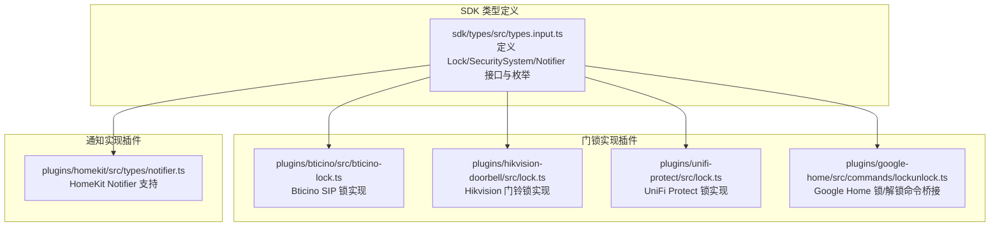
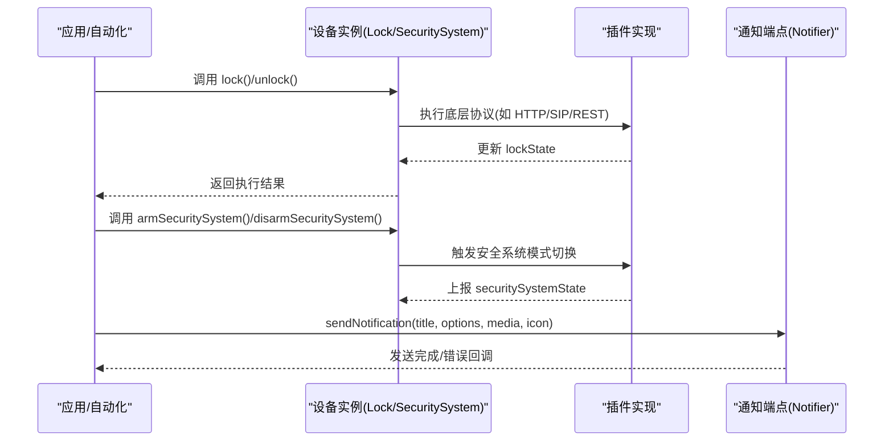
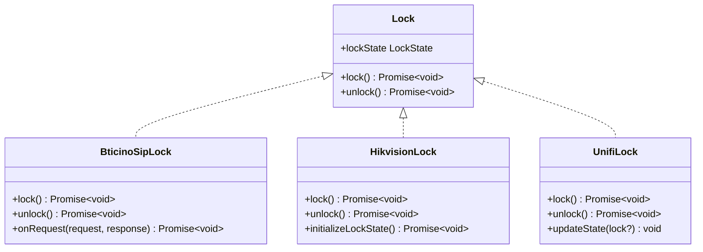
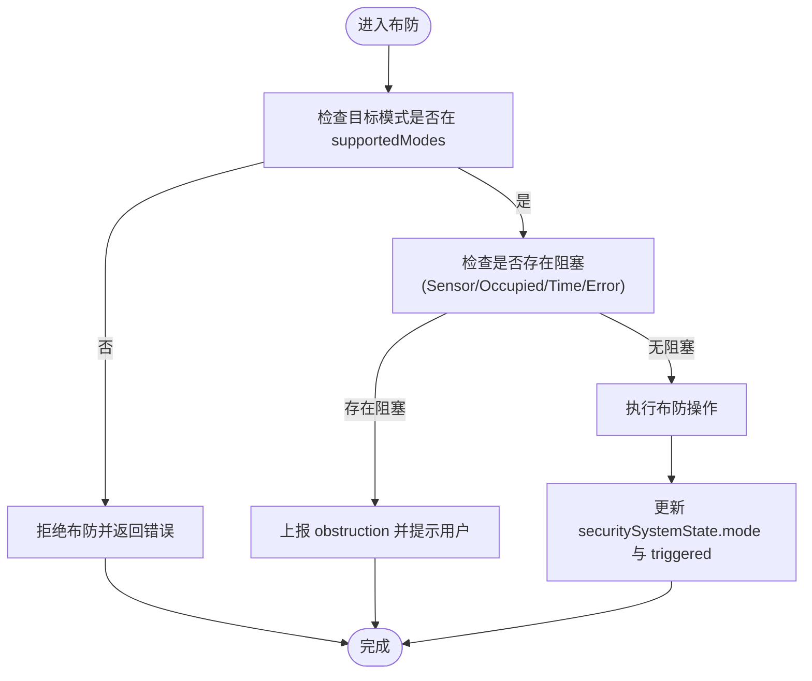
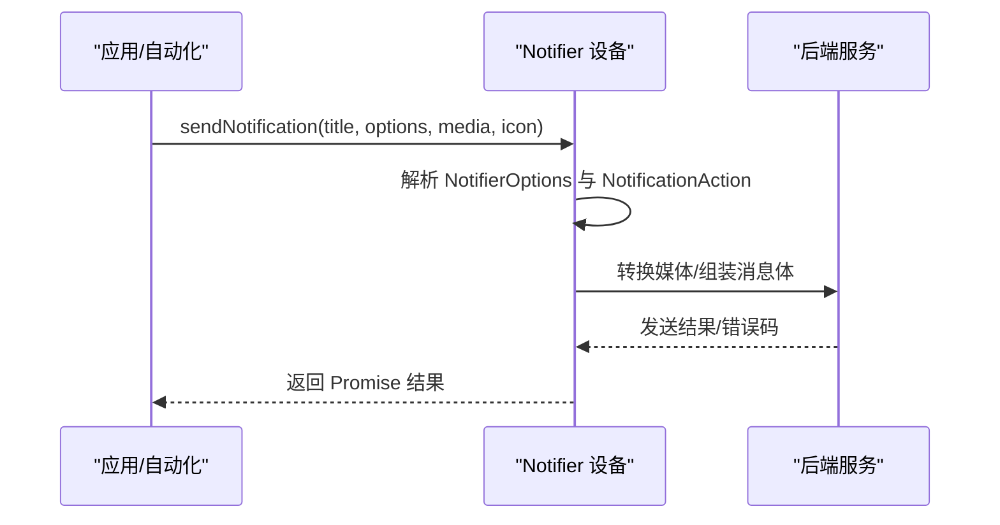
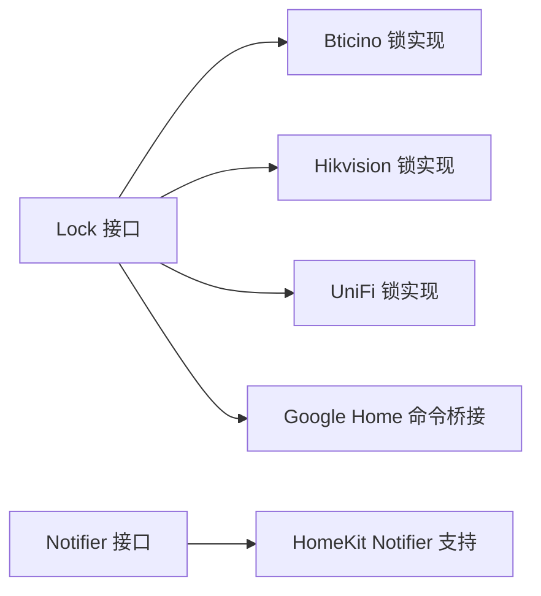

# 安全设备接口

<cite>
**本文引用的文件**
- [sdk/types/src/types.input.ts](file://sdk/types/src/types.input.ts)
- [plugins/bticino/src/bticino-lock.ts](file://plugins/bticino/src/bticino-lock.ts)
- [plugins/hikvision-doorbell/src/lock.ts](file://plugins/hikvision-doorbell/src/lock.ts)
- [plugins/unifi-protect/src/lock.ts](file://plugins/unifi-protect/src/lock.ts)
- [plugins/google-home/src/commands/lockunlock.ts](file://plugins/google-home/src/commands/lockunlock.ts)
- [plugins/homekit/src/types/notifier.ts](file://plugins/homekit/src/types/notifier.ts)
</cite>

## 目录
1. [简介](#简介)
2. [项目结构](#项目结构)
3. [核心组件](#核心组件)
4. [架构总览](#架构总览)
5. [详细组件分析](#详细组件分析)
6. [依赖关系分析](#依赖关系分析)
7. [性能考虑](#性能考虑)
8. [故障排查指南](#故障排查指南)
9. [结论](#结论)
10. [附录](#附录)

## 简介
本规范文档聚焦于安全设备接口，围绕以下三类接口进行系统化说明：
- Lock 接口：门锁控制能力，包括 lock()、unlock() 方法与 lockState 状态属性
- SecuritySystem 接口：安全系统状态管理，包括 ArmState（枚举）与相关模式
- Notifier 接口：通知发送能力，包括 sendNotification() 方法与 NotifierOptions 参数结构，以及 NotificationAction 动作配置

文档同时提供安全事件处理与通知配置的实际使用示例，帮助开发者在不同插件中正确实现与集成。

## 项目结构
本仓库为多插件架构，安全设备接口定义位于 SDK 类型定义中，具体实现散布于各设备插件中。下图展示与本文相关的核心文件与模块关系：

**图表来源**
- [sdk/types/src/types.input.ts](file://sdk/types/src/types.input.ts)
- [plugins/bticino/src/bticino-lock.ts](file://plugins/bticino/src/bticino-lock.ts)
- [plugins/hikvision-doorbell/src/lock.ts](file://plugins/hikvision-doorbell/src/lock.ts)
- [plugins/unifi-protect/src/lock.ts](file://plugins/unifi-protect/src/lock.ts)
- [plugins/google-home/src/commands/lockunlock.ts](file://plugins/google-home/src/commands/lockunlock.ts)
- [plugins/homekit/src/types/notifier.ts](file://plugins/homekit/src/types/notifier.ts)

**章节来源**
- [sdk/types/src/types.input.ts](file://sdk/types/src/types.input.ts)
- [plugins/bticino/src/bticino-lock.ts](file://plugins/bticino/src/bticino-lock.ts)
- [plugins/hikvision-doorbell/src/lock.ts](file://plugins/hikvision-doorbell/src/lock.ts)
- [plugins/unifi-protect/src/lock.ts](file://plugins/unifi-protect/src/lock.ts)
- [plugins/google-home/src/commands/lockunlock.ts](file://plugins/google-home/src/commands/lockunlock.ts)
- [plugins/homekit/src/types/notifier.ts](file://plugins/homekit/src/types/notifier.ts)

## 核心组件
本节对三大接口进行要点梳理与规范说明。

- Lock 接口
  - 方法：lock()、unlock()
  - 属性：lockState（枚举值：Locked、Unlocked、Jammed）
  - 作用：统一门锁控制与状态上报，便于上层自动化与第三方平台调用

- SecuritySystem 接口
  - 方法：armSecuritySystem(mode)、disarmSecuritySystem()
  - 状态对象：securitySystemState（包含 mode、triggered、supportedModes、obstruction）
  - 模式枚举：Disarmed、HomeArmed、AwayArmed、NightArmed
  - 阻塞类型：Sensor、Occupied、Time、Error

- Notifier 接口
  - 方法：sendNotification(title, options?, media?, icon?)
  - 参数结构：NotifierOptions（支持 subtitle、badge、body、android.channel、data、dir、lang、renotify、requireInteraction、silent、critical、tag、timestamp、vibrate、recordedEvent、actions、image 等）
  - 动作配置：NotificationAction（包含 action、icon、title）

**章节来源**
- [sdk/types/src/types.input.ts](file://sdk/types/src/types.input.ts)

## 架构总览
下图展示从上层调用到具体设备实现的交互路径，涵盖门锁控制与通知发送的关键流程。

**图表来源**
- [sdk/types/src/types.input.ts](file://sdk/types/src/types.input.ts)
- [plugins/bticino/src/bticino-lock.ts](file://plugins/bticino/src/bticino-lock.ts)
- [plugins/hikvision-doorbell/src/lock.ts](file://plugins/hikvision-doorbell/src/lock.ts)
- [plugins/unifi-protect/src/lock.ts](file://plugins/unifi-protect/src/lock.ts)
- [plugins/google-home/src/commands/lockunlock.ts](file://plugins/google-home/src/commands/lockunlock.ts)
- [plugins/homekit/src/types/notifier.ts](file://plugins/homekit/src/types/notifier.ts)

## 详细组件分析

### Lock 接口与实现
- 接口定义要点
  - lock()：请求锁定
  - unlock()：请求解锁
  - lockState：当前锁状态（Locked/Unlocked/Jammed）
- 典型实现差异
  - Bticino SIP 锁：通过定时器模拟锁定过程，并在 HTTP 请求处理器中响应外部状态变更
  - Hikvision 门铃锁：依据设备能力选择关闭或恢复命令，初始化时尝试将门锁置为 Locked
  - UniFi Protect 锁：基于 API 调用 open/close，同步更新 lockState

**图表来源**
- [sdk/types/src/types.input.ts](file://sdk/types/src/types.input.ts)
- [plugins/bticino/src/bticino-lock.ts](file://plugins/bticino/src/bticino-lock.ts)
- [plugins/hikvision-doorbell/src/lock.ts](file://plugins/hikvision-doorbell/src/lock.ts)
- [plugins/unifi-protect/src/lock.ts](file://plugins/unifi-protect/src/lock.ts)

**章节来源**
- [sdk/types/src/types.input.ts](file://sdk/types/src/types.input.ts)
- [plugins/bticino/src/bticino-lock.ts](file://plugins/bticino/src/bticino-lock.ts)
- [plugins/hikvision-doorbell/src/lock.ts](file://plugins/hikvision-doorbell/src/lock.ts)
- [plugins/unifi-protect/src/lock.ts](file://plugins/unifi-protect/src/lock.ts)

### SecuritySystem 接口与模式
- 接口定义要点
  - armSecuritySystem(mode)：按模式布防
  - disarmSecuritySystem()：撤防
  - securitySystemState：包含 mode、triggered、supportedModes、obstruction
  - 枚举：SecuritySystemMode（Disarmed/HomeArmed/AwayArmed/NightArmed）、SecuritySystemObstruction（Sensor/Occupied/Time/Error）
- 使用建议
  - 在设备初始化时查询并缓存 supportedModes
  - 对外暴露 securitySystemState，供自动化与 UI 订阅
  - 处理阻塞场景（如传感器占用、时间窗口等），及时更新 obstruction

**图表来源**
- [sdk/types/src/types.input.ts](file://sdk/types/src/types.input.ts)

**章节来源**
- [sdk/types/src/types.input.ts](file://sdk/types/src/types.input.ts)

### Notifier 接口与通知配置
- 接口定义要点
  - sendNotification(title, options?, media?, icon?)：发送通知
  - NotifierOptions：支持 subtitle、badge、body、android.channel、data、dir、lang、renotify、requireInteraction、silent、critical、tag、timestamp、vibrate、recordedEvent、actions、image 等
  - NotificationAction：包含 action、icon、title
- 实现建议
  - 将 Notifier 作为可插拔通知端点，支持多种后端（如 HomeKit 开关、邮件、短信等）
  - 对 actions 字段进行严格校验，确保 action 唯一且符合平台要求
  - 对媒体资源进行转换与预处理，保证跨平台兼容性

**图表来源**
- [sdk/types/src/types.input.ts](file://sdk/types/src/types.input.ts)
- [plugins/homekit/src/types/notifier.ts](file://plugins/homekit/src/types/notifier.ts)

**章节来源**
- [sdk/types/src/types.input.ts](file://sdk/types/src/types.input.ts)
- [plugins/homekit/src/types/notifier.ts](file://plugins/homekit/src/types/notifier.ts)

## 依赖关系分析
- Lock 接口被多个插件实现：Bticino、Hikvision、UniFi Protect
- Google Home 插件通过命令桥接调用 Lock 接口，实现语音控制
- Notifier 接口在 HomeKit 插件中以开关形式呈现，体现其作为通用通知端点的能力

**图表来源**
- [sdk/types/src/types.input.ts](file://sdk/types/src/types.input.ts)
- [plugins/bticino/src/bticino-lock.ts](file://plugins/bticino/src/bticino-lock.ts)
- [plugins/hikvision-doorbell/src/lock.ts](file://plugins/hikvision-doorbell/src/lock.ts)
- [plugins/unifi-protect/src/lock.ts](file://plugins/unifi-protect/src/lock.ts)
- [plugins/google-home/src/commands/lockunlock.ts](file://plugins/google-home/src/commands/lockunlock.ts)
- [plugins/homekit/src/types/notifier.ts](file://plugins/homekit/src/types/notifier.ts)

**章节来源**
- [sdk/types/src/types.input.ts](file://sdk/types/src/types.input.ts)
- [plugins/google-home/src/commands/lockunlock.ts](file://plugins/google-home/src/commands/lockunlock.ts)
- [plugins/homekit/src/types/notifier.ts](file://plugins/homekit/src/types/notifier.ts)

## 性能考虑
- 锁操作的异步与幂等
  - lock()/unlock() 应为异步方法，避免阻塞主线程
  - 对重复请求应具备去抖或队列机制，防止并发冲突
- 状态同步与事件订阅
  - lockState 与 securitySystemState 变更应通过事件机制通知订阅者，减少轮询
- 通知发送的批量化与降噪
  - 对高频通知进行合并与去噪，降低网络与设备负载
  - 对 actions 与媒体资源进行缓存与复用

## 故障排查指南
- Lock 状态不一致
  - 检查设备实现是否正确更新 lockState
  - 确认外部状态变更（如 HTTP 回调）是否触发状态刷新
- 布防失败或阻塞
  - 核对 supportedModes 与目标模式一致性
  - 检查 obstruction 是否为 Sensor/Occupied/Time/Error，必要时提示用户处理
- 通知未送达
  - 校验 NotifierOptions 中的字段（如 android.channel、actions）是否符合平台要求
  - 检查媒体资源转换与网络连通性

**章节来源**
- [plugins/bticino/src/bticino-lock.ts](file://plugins/bticino/src/bticino-lock.ts)
- [plugins/hikvision-doorbell/src/lock.ts](file://plugins/hikvision-doorbell/src/lock.ts)
- [plugins/unifi-protect/src/lock.ts](file://plugins/unifi-protect/src/lock.ts)
- [sdk/types/src/types.input.ts](file://sdk/types/src/types.input.ts)

## 结论
本文系统梳理了 Lock、SecuritySystem、Notifier 三大安全设备接口的规范与实现要点，并结合实际插件示例展示了典型用法。遵循本文规范有助于在多插件环境中保持一致的接口行为与良好的用户体验。

## 附录
- 示例：Google Home 锁/解锁命令桥接
  - 通过命令处理器根据参数决定调用 lock() 或 unlock()，并返回标准执行响应
- 示例：HomeKit Notifier 支持
  - 将 Notifier 注册为可发现设备类型，以便在 HomeKit 中以开关形式控制

**章节来源**
- [plugins/google-home/src/commands/lockunlock.ts](file://plugins/google-home/src/commands/lockunlock.ts)
- [plugins/homekit/src/types/notifier.ts](file://plugins/homekit/src/types/notifier.ts)