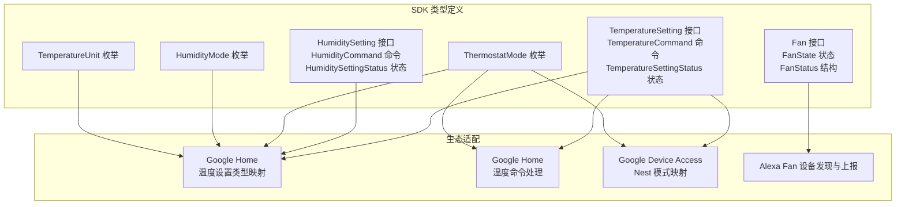
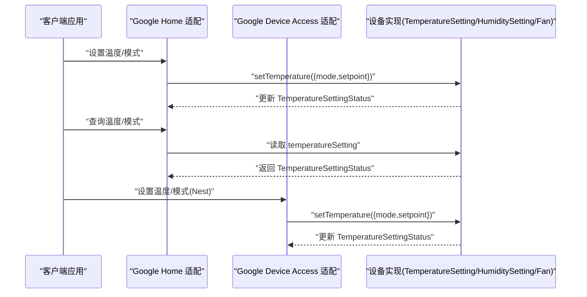
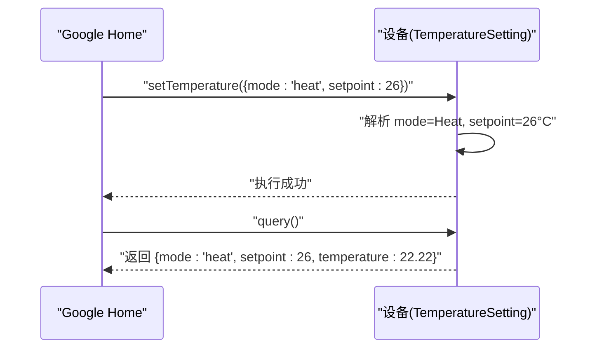
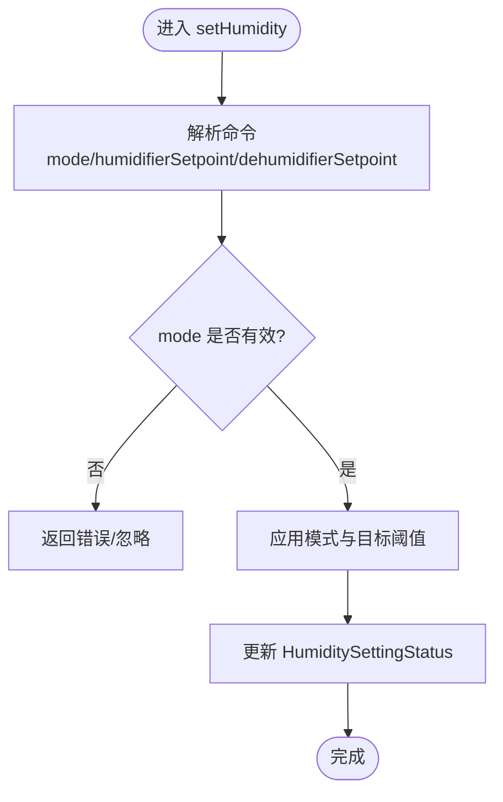
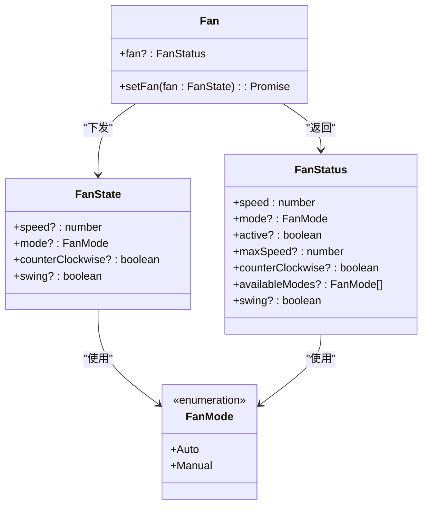
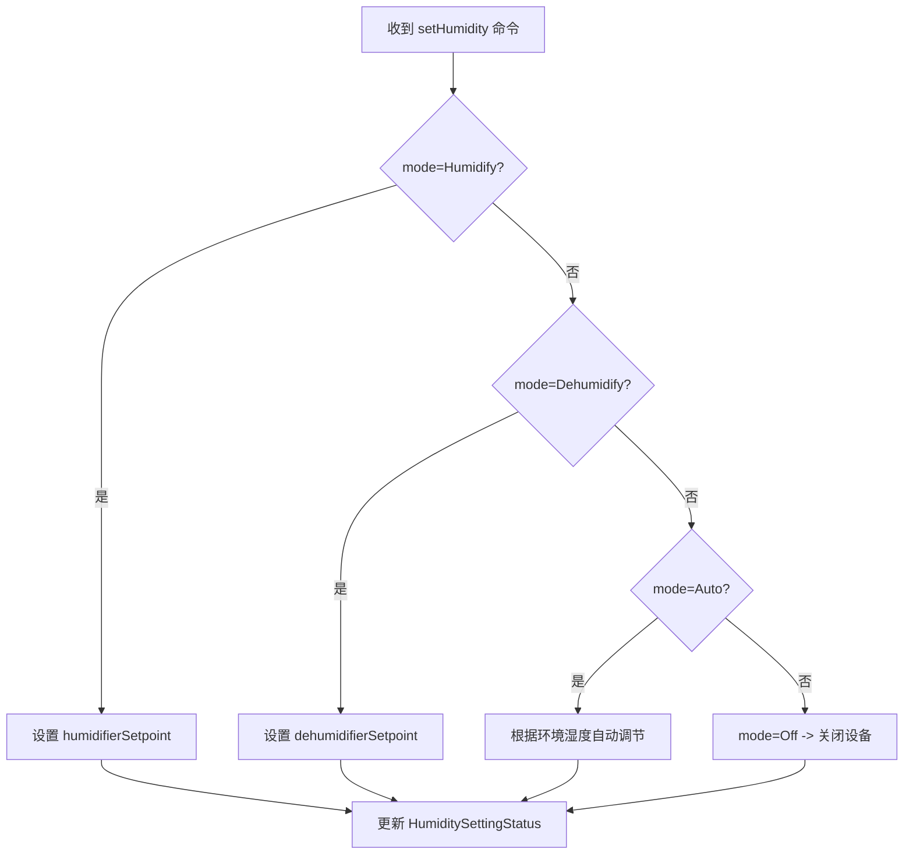
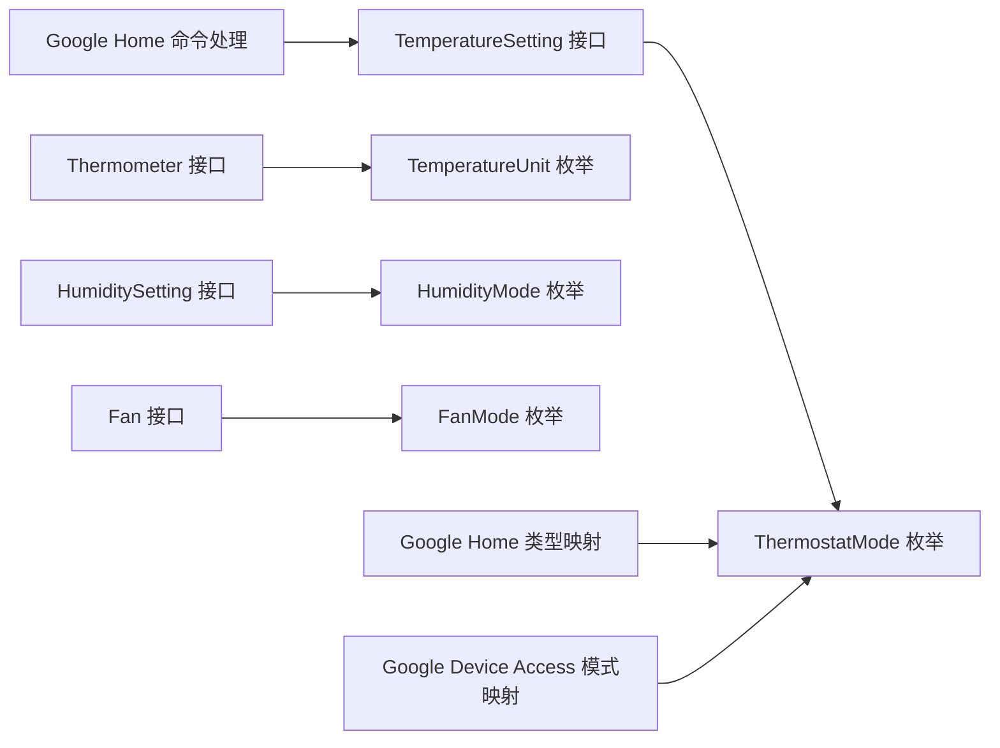

# 气候控制接口

<cite>
**本文引用的文件**
- [sdk/types/src/types.input.ts](file://sdk/types/src/types.input.ts)
- [plugins/google-home/src/types/thermostat.ts](file://plugins/google-home/src/types/thermostat.ts)
- [plugins/google-home/src/commands/temperaturesetting.ts](file://plugins/google-home/src/commands/temperaturesetting.ts)
- [plugins/google-device-access/src/main.ts](file://plugins/google-device-access/src/main.ts)
- [plugins/alexa/src/types/fan.ts](file://plugins/alexa/src/types/fan.ts)
</cite>

## 目录
1. [简介](#简介)
2. [项目结构](#项目结构)
3. [核心组件](#核心组件)
4. [架构总览](#架构总览)
5. [详细组件分析](#详细组件分析)
6. [依赖关系分析](#依赖关系分析)
7. [性能考虑](#性能考虑)
8. [故障排查指南](#故障排查指南)
9. [结论](#结论)
10. [附录](#附录)

## 简介
本规范文档面向气候控制接口，聚焦以下能力：
- 温度控制：TemperatureSetting 接口、TemperatureCommand 命令结构、TemperatureSettingStatus 状态结构、ThermostatMode 枚举（含 Off、Cool、Heat、HeatCool、Auto、FanOnly、Purifier、Eco、Dry、On）。
- 湿度控制：HumiditySetting 接口、HumidityCommand 命令结构、HumiditySettingStatus 状态结构、HumidityMode 枚举（含 Humidify、Dehumidify、Auto、Off）。
- 风扇控制：Fan 接口、FanState 状态、FanStatus 结构。
- 温度单位转换与湿度控制的实际使用示例。

文档以 SDK 类型定义为核心来源，并结合 Google Home、Google Device Access、Alexa 等生态适配实现，帮助开发者在不同平台间统一理解与集成气候控制接口。

## 项目结构
围绕气候控制接口的核心代码分布于 SDK 类型定义与多生态适配插件中：
- SDK 类型定义：集中定义了 TemperatureSetting、HumiditySetting、Fan 等接口及枚举。
- 生态适配层：如 Google Home、Google Device Access、Alexa 插件，展示如何将设备能力映射到具体平台协议。

**图表来源**
- [sdk/types/src/types.input.ts:332-429](file://sdk/types/src/types.input.ts#L332-L429)
- [plugins/google-home/src/types/thermostat.ts:1-56](file://plugins/google-home/src/types/thermostat.ts#L1-L56)
- [plugins/google-home/src/commands/temperaturesetting.ts:1-46](file://plugins/google-home/src/commands/temperaturesetting.ts#L1-L46)
- [plugins/google-device-access/src/main.ts:62-95](file://plugins/google-device-access/src/main.ts#L62-L95)
- [plugins/alexa/src/types/fan.ts:1-72](file://plugins/alexa/src/types/fan.ts#L1-L72)

**章节来源**
- [sdk/types/src/types.input.ts:332-429](file://sdk/types/src/types.input.ts#L332-L429)

## 核心组件
本节对关键接口与数据结构进行系统性梳理，明确字段含义、可选性与典型取值范围。

- TemperatureSetting 接口
  - 能力：提供温度设定状态查询与温度命令下发。
  - 关键成员：
    - temperatureSetting?: TemperatureSettingStatus
    - setTemperature(command: TemperatureCommand): Promise<void>

- TemperatureCommand 命令结构
  - 字段：
    - mode?: ThermostatMode
    - setpoint?: number | [number, number]
  - 说明：
    - mode 可选，用于切换运行模式。
    - setpoint 支持单点或区间（双温度点），用于目标温度设定。

- TemperatureSettingStatus 状态结构
  - 字段：
    - availableModes?: ThermostatMode[]
    - mode?: ThermostatMode
    - activeMode?: ThermostatMode
    - setpoint?: number | [number, number]
  - 说明：
    - availableModes 表示设备支持的模式集合。
    - mode 为当前设定模式；activeMode 为实际运行模式（可能与 mode 不同）。
    - setpoint 与命令一致，支持单点或区间。

- ThermostatMode 枚举
  - 取值：Off、Cool、Heat、HeatCool、Auto、FanOnly、Purifier、Eco、Dry、On
  - 说明：覆盖常见空调/恒温器运行模式，部分生态（如 Google Home）会做平台特定映射。

- HumiditySetting 接口
  - 能力：提供湿度设定状态查询与湿度命令下发。
  - 关键成员：
    - humiditySetting?: HumiditySettingStatus
    - setHumidity(humidity: HumidityCommand): Promise<void>

- HumidityCommand 命令结构
  - 字段：
    - mode?: HumidityMode
    - humidifierSetpoint?: number
    - dehumidifierSetpoint?: number
  - 说明：
    - mode 指定湿度控制模式。
    - humidifierSetpoint 与 dehumidifierSetpoint 分别对应加湿/除湿的目标阈值。

- HumiditySettingStatus 状态结构
  - 字段：
    - mode: HumidityMode
    - activeMode?: HumidityMode
    - availableModes: HumidityMode[]
    - humidifierSetpoint?: number
    - dehumidifierSetpoint?: number
  - 说明：
    - mode 为当前设定模式；activeMode 为实际运行模式。
    - availableModes 为设备支持的模式集合。

- HumidityMode 枚举
  - 取值：Humidify、Dehumidify、Auto、Off
  - 说明：通用除湿/加湿/自动/关闭模式。

- Fan 接口
  - 能力：提供风扇状态查询与风扇命令下发。
  - 关键成员：
    - fan?: FanStatus
    - setFan(fan: FanState): Promise<void>

- FanState 状态
  - 字段：
    - speed?: number
    - mode?: FanMode
    - counterClockwise?: boolean
    - swing?: boolean
  - 说明：
    - speed 为当前风速（若可用）。
    - mode 为风扇模式（Auto/Manual）。
    - counterClockwise/swing 为旋转方向与摆风状态（若可用）。

- FanStatus 结构
  - 字段：
    - speed: number
    - mode?: FanMode
    - active?: boolean
    - maxSpeed?: number
    - counterClockwise?: boolean
    - availableModes?: FanMode[]
    - swing?: boolean
  - 说明：
    - speed 为当前风速；maxSpeed 为最大风速（若可用）。
    - active 表示风扇是否处于活动状态（若可用）。

- FanMode 枚举
  - 取值：Auto、Manual
  - 说明：自动/手动模式。

- TemperatureUnit 枚举
  - 取值：C（摄氏度）、F（华氏度）
  - 说明：用户界面显示温度单位，但内部温度值统一以摄氏度存储与计算。

**章节来源**
- [sdk/types/src/types.input.ts:332-429](file://sdk/types/src/types.input.ts#L332-L429)

## 架构总览
下图展示了从设备到生态平台的调用链路与数据流，涵盖温度与湿度控制、风扇控制以及模式映射。

**图表来源**
- [plugins/google-home/src/commands/temperaturesetting.ts:5-45](file://plugins/google-home/src/commands/temperaturesetting.ts#L5-L45)
- [plugins/google-home/src/types/thermostat.ts:41-54](file://plugins/google-home/src/types/thermostat.ts#L41-L54)
- [plugins/google-device-access/src/main.ts:338-416](file://plugins/google-device-access/src/main.ts#L338-L416)
- [sdk/types/src/types.input.ts:332-348](file://sdk/types/src/types.input.ts#L332-L348)

## 详细组件分析

### 温度控制接口（TemperatureSetting）
- 命令下发流程
  - 客户端通过 setTemperature 发送 TemperatureCommand。
  - 设备实现解析 mode 与 setpoint，更新内部状态并持久化。
  - 设备对外暴露 TemperatureSettingStatus，供查询与同步。

- 模式映射（以 Google Home 为例）
  - 平台侧将 ThermostatMode 映射为字符串，如 Off→off、Cool→cool、Heat→heat、HeatCool→heatcool、Auto→auto、FanOnly→fan-only、Purifier→purifier、Eco→eco、Dry→dry、On→on。
  - 设备侧接收平台命令后，再映射回 ThermostatMode 执行。

- 温度单位转换
  - Thermometer 提供 temperatureUnit 属性与 setTemperatureUnit 方法。
  - Google Home 在同步时会携带温度单位，设备应确保内部温度值以摄氏度存储，UI 单位由 temperatureUnit 决定。

**图表来源**
- [plugins/google-home/src/commands/temperaturesetting.ts:5-45](file://plugins/google-home/src/commands/temperaturesetting.ts#L5-L45)
- [plugins/google-home/src/types/thermostat.ts:41-54](file://plugins/google-home/src/types/thermostat.ts#L41-L54)
- [sdk/types/src/types.input.ts:400-414](file://sdk/types/src/types.input.ts#L400-L414)

**章节来源**
- [plugins/google-home/src/commands/temperaturesetting.ts:1-46](file://plugins/google-home/src/commands/temperaturesetting.ts#L1-L46)
- [plugins/google-home/src/types/thermostat.ts:1-56](file://plugins/google-home/src/types/thermostat.ts#L1-L56)
- [sdk/types/src/types.input.ts:332-414](file://sdk/types/src/types.input.ts#L332-L414)

### 湿度控制接口（HumiditySetting）
- 命令下发流程
  - 客户端通过 setHumidity 发送 HumidityCommand。
  - 设备实现解析 mode、humidifierSetpoint、dehumidifierSetpoint，更新内部状态。
  - 设备对外暴露 HumiditySettingStatus，供查询与同步。

- 模式映射
  - HumidityMode 枚举包含 Humidify、Dehumidify、Auto、Off 四种模式。
  - 设备需维护 availableModes 与 activeMode，确保与平台一致。

**图表来源**
- [sdk/types/src/types.input.ts:355-370](file://sdk/types/src/types.input.ts#L355-L370)

**章节来源**
- [sdk/types/src/types.input.ts:355-370](file://sdk/types/src/types.input.ts#L355-L370)

### 风扇控制接口（Fan）
- Fan 接口与 FanState/FanStatus
  - setFan 接收 FanState，支持 speed、mode、counterClockwise、swing 等字段。
  - 设备返回 FanStatus，包含 speed、mode、active、maxSpeed、availableModes、swing 等。

- Alexa 生态适配
  - Alexa 插件对 Fan 设备进行发现与上报，映射 PowerController 能力，用于基础开关控制。
  - 若设备具备更多风扇特性（如风速、摆风），可在其他适配中扩展。

**图表来源**
- [sdk/types/src/types.input.ts:371-399](file://sdk/types/src/types.input.ts#L371-L399)
- [plugins/alexa/src/types/fan.ts:1-72](file://plugins/alexa/src/types/fan.ts#L1-L72)

**章节来源**
- [sdk/types/src/types.input.ts:371-399](file://sdk/types/src/types.input.ts#L371-L399)
- [plugins/alexa/src/types/fan.ts:1-72](file://plugins/alexa/src/types/fan.ts#L1-L72)

### 温度单位转换与湿度控制示例
- 温度单位转换
  - Thermometer 提供 temperatureUnit 与 setTemperatureUnit，用于切换显示单位。
  - 设备内部统一以摄氏度存储与计算，避免跨平台差异导致的逻辑混乱。

- 湿度控制示例（概念性）
  - 设备支持 Humidify/Dehumidify/Auto/Off 模式。
  - 当 mode=Humidify 时，设置 humidifierSetpoint；当 mode=Dehumidify 时，设置 dehumidifierSetpoint。
  - 设备应根据当前环境湿度与目标阈值，动态调整运行模式与风速。

**图表来源**
- [sdk/types/src/types.input.ts:355-370](file://sdk/types/src/types.input.ts#L355-L370)

**章节来源**
- [sdk/types/src/types.input.ts:400-417](file://sdk/types/src/types.input.ts#L400-L417)
- [sdk/types/src/types.input.ts:355-370](file://sdk/types/src/types.input.ts#L355-L370)

## 依赖关系分析
- TemperatureSetting 与 Thermometer 的组合
  - 设备通常同时实现 TemperatureSetting 与 Thermometer，以提供温度读取与设定能力。
  - Google Home 类型适配通过接口探测确认设备支持 TemperatureSetting 与 Thermometer。

- 模式枚举与平台映射
  - ThermostatMode 与 HumidityMode 作为统一语义，各生态通过映射函数转换为平台协议字符串或枚举值。
  - Google Device Access 对 Nest 设备的模式进行双向映射，确保与第三方服务一致。

**图表来源**
- [sdk/types/src/types.input.ts:332-429](file://sdk/types/src/types.input.ts#L332-L429)
- [plugins/google-home/src/types/thermostat.ts:1-56](file://plugins/google-home/src/types/thermostat.ts#L1-L56)
- [plugins/google-home/src/commands/temperaturesetting.ts:1-46](file://plugins/google-home/src/commands/temperaturesetting.ts#L1-L46)
- [plugins/google-device-access/src/main.ts:62-95](file://plugins/google-device-access/src/main.ts#L62-L95)

**章节来源**
- [plugins/google-home/src/types/thermostat.ts:19-31](file://plugins/google-home/src/types/thermostat.ts#L19-L31)
- [plugins/google-device-access/src/main.ts:62-95](file://plugins/google-device-access/src/main.ts#L62-L95)

## 性能考虑
- 状态同步
  - TemperatureSettingStatus 与 HumiditySettingStatus 应尽量减少不必要的频繁更新，采用去噪策略降低事件风暴。
- 模式切换
  - 切换 ThermostatMode 或 HumidityMode 时，建议合并命令与状态更新，避免多次往返。
- 温度单位
  - 统一以摄氏度存储，仅在 UI 层转换，减少重复计算与精度损失。

## 故障排查指南
- 温度设置无效
  - 检查设备是否正确实现 TemperatureSetting 接口，setTemperature 是否被调用。
  - 确认命令中的 mode 与 setpoint 是否在 availableModes 与有效范围内。
- 模式不一致
  - 对比 temperatureSetting.mode 与 activeMode，确认设备是否正确反映当前运行状态。
- 单位显示异常
  - 检查 Thermometer.temperatureUnit 设置是否正确，以及 setTemperatureUnit 是否被调用。
- 湿度控制无响应
  - 确认 HumiditySettingStatus 中 availableModes 包含目标 mode。
  - 检查 humidifierSetpoint/dehumidifierSetpoint 是否在设备允许范围内。
- 风扇控制失败
  - 确认 FanState 字段（speed、mode、swing 等）是否符合设备能力；检查 FanStatus 的 availableModes 与 maxSpeed。

**章节来源**
- [sdk/types/src/types.input.ts:332-429](file://sdk/types/src/types.input.ts#L332-L429)

## 结论
本文基于 SDK 类型定义与生态适配实现，系统梳理了温度、湿度与风扇控制接口的结构与行为。通过统一的命令与状态模型，配合平台特定的模式映射，可实现跨生态的一致体验。建议在设备实现中严格遵循接口契约，确保状态一致性与用户体验稳定。

## 附录
- 关键接口与枚举定义可参考 SDK 类型输入文件，其中包含 TemperatureSetting、HumiditySetting、Fan、ThermostatMode、HumidityMode、FanMode、TemperatureUnit 等核心类型。
- 生态适配示例展示了如何在 Google Home、Google Device Access、Alexa 等平台上进行模式映射与命令处理。

**章节来源**
- [sdk/types/src/types.input.ts:332-429](file://sdk/types/src/types.input.ts#L332-L429)
- [plugins/google-home/src/types/thermostat.ts:1-56](file://plugins/google-home/src/types/thermostat.ts#L1-L56)
- [plugins/google-home/src/commands/temperaturesetting.ts:1-46](file://plugins/google-home/src/commands/temperaturesetting.ts#L1-L46)
- [plugins/google-device-access/src/main.ts:62-95](file://plugins/google-device-access/src/main.ts#L62-L95)
- [plugins/alexa/src/types/fan.ts:1-72](file://plugins/alexa/src/types/fan.ts#L1-L72)