# 设备接口模型

<cite>
**本文档引用的文件**
- [devices.ts](file://common/src/devices.ts)
- [types.d.ts](file://common/fs/@types/sdk/types.d.ts)
- [index.d.ts](file://common/fs/@types/sdk/index.d.ts)
- [types.input.ts](file://sdk/types/src/types.input.ts)
- [typedoc.json](file://sdk/types/typedoc.json)
</cite>

## 目录
1. [简介](#简介)
2. [项目结构](#项目结构)
3. [核心组件](#核心组件)
4. [架构概览](#架构概览)
5. [详细组件分析](#详细组件分析)
6. [依赖关系分析](#依赖关系分析)
7. [性能考虑](#性能考虑)
8. [故障排除指南](#故障排除指南)
9. [结论](#结论)

## 简介

Scrypted 设备接口模型是一个标准化的设备抽象层，为智能家居生态系统中的各种设备提供统一的编程接口。该模型定义了设备能力的标准化接口，使得不同厂商的设备能够以一致的方式进行控制和监控。

本文档详细记录了 Scrypted 核心设备接口的数据结构和功能，包括开关控制、亮度调节、色彩设置、温度控制、湿度控制、风扇控制、传感器数据读取以及媒体设备接口等核心功能。

## 项目结构

Scrypted 的设备接口模型主要分布在以下关键目录中：

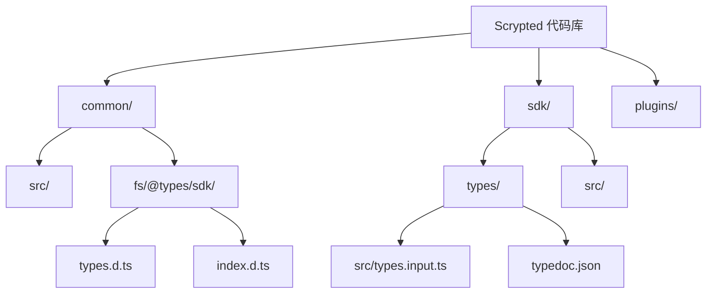

**图表来源**
- [devices.ts](file://common/src/devices.ts)
- [types.d.ts](file://common/fs/@types/sdk/types.d.ts)
- [index.d.ts](file://common/fs/@types/sdk/index.d.ts)

**章节来源**
- [devices.ts:1-6](file://common/src/devices.ts#L1-L6)

## 核心组件

Scrypted 设备接口模型的核心组件包括以下主要接口类别：

### 基础控制接口
- **OnOff**: 设备开关控制接口
- **Brightness**: 亮度调节接口
- **Sensor**: 传感器数据读取接口

### 色彩控制接口
- **ColorSettingTemperature**: 色温调节接口
- **ColorSettingRgb**: RGB 颜色设置接口

### 环境控制接口
- **TemperatureSetting**: 温度控制接口
- **HumiditySetting**: 湿度控制接口
- **Fan**: 风扇控制接口

### 媒体设备接口
- **Camera**: 摄像头设备接口
- **VideoCamera**: 视频摄像头接口
- **Microphone**: 麦克风设备接口

**章节来源**
- [types.d.ts](file://common/fs/@types/sdk/types.d.ts)
- [index.d.ts](file://common/fs/@types/sdk/index.d.ts)

## 架构概览

Scrypted 设备接口模型采用分层架构设计，通过标准化的接口实现设备能力的抽象化：

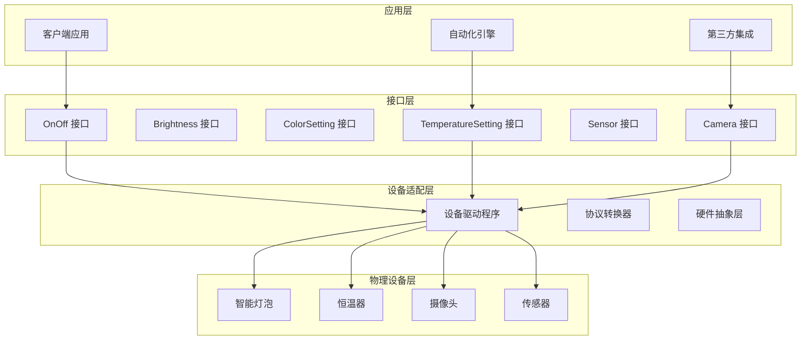

**图表来源**
- [types.input.ts](file://sdk/types/src/types.input.ts)
- [typedoc.json](file://sdk/types/typedoc.json)

## 详细组件分析

### OnOff 接口

OnOff 接口是设备控制的基础接口，提供简单的开关控制功能。

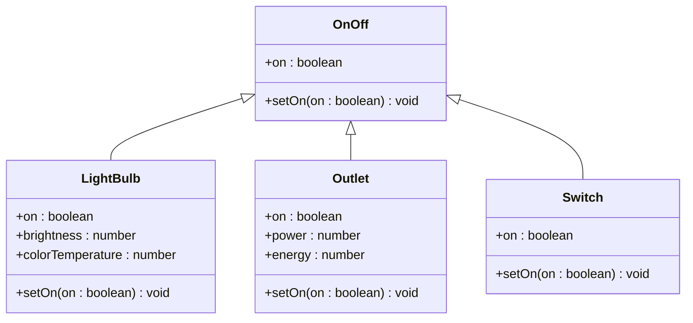

**图表来源**
- [types.d.ts](file://common/fs/@types/sdk/types.d.ts)

**方法签名与属性定义**:
- `setOn(on: boolean): void` - 设置设备开关状态
- `on: boolean` - 当前设备开关状态

**使用示例路径**:
- [OnOff 接口定义](file://common/fs/@types/sdk/types.d.ts)

**章节来源**
- [types.d.ts](file://common/fs/@types/sdk/types.d.ts)

### Brightness 接口

Brightness 接口提供设备亮度调节功能，支持百分比形式的亮度控制。

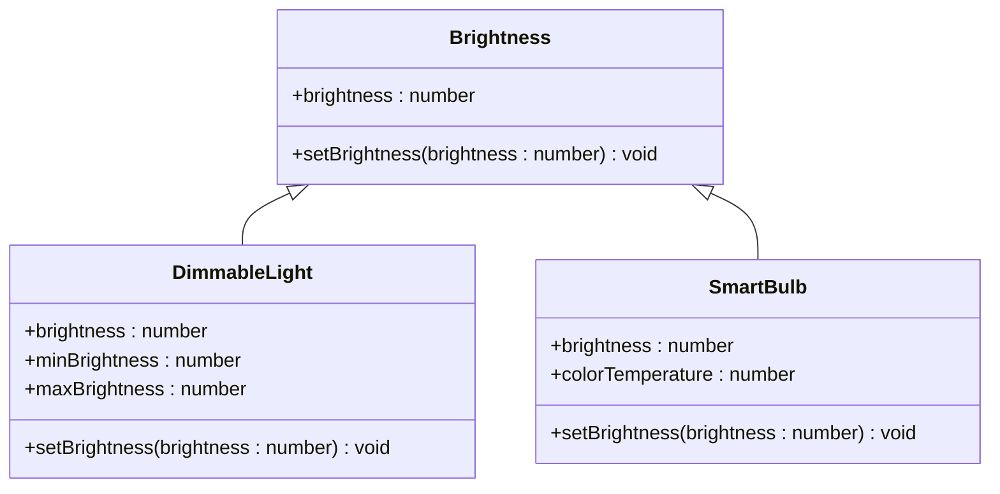

**图表来源**
- [types.d.ts](file://common/fs/@types/sdk/types.d.ts)

**方法签名与属性定义**:
- `setBrightness(brightness: number): void` - 设置设备亮度（0-100）
- `brightness: number` - 当前设备亮度百分比

**使用示例路径**:
- [Brightness 接口定义](file://common/fs/@types/sdk/types.d.ts)

**章节来源**
- [types.d.ts](file://common/fs/@types/sdk/types.d.ts)

### ColorSettingTemperature 接口

ColorSettingTemperature 接口提供色温调节功能，支持从暖白到冷白的连续色温调节。

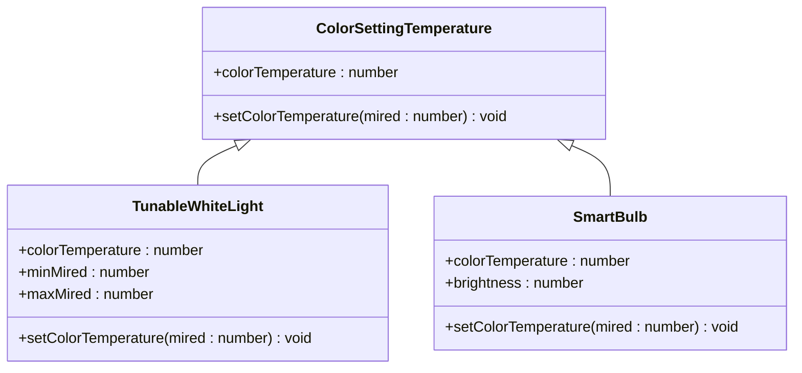

**图表来源**
- [types.d.ts](file://common/fs/@types/sdk/types.d.ts)

**方法签名与属性定义**:
- `setColorTemperature(mired: number): void` - 设置色温（单位：mired）
- `colorTemperature: number` - 当前色温值（单位：mired）

**使用示例路径**:
- [ColorSettingTemperature 接口定义](file://common/fs/@types/sdk/types.d.ts)

**章节来源**
- [types.d.ts](file://common/fs/@types/sdk/types.d.ts)

### ColorSettingRgb 接口

ColorSettingRgb 接口提供 RGB 颜色设置功能，支持全光谱颜色调节。

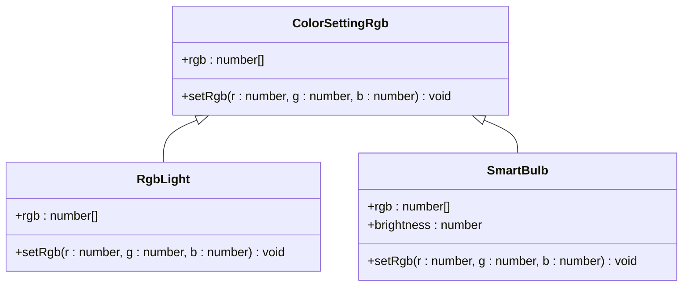

**图表来源**
- [types.d.ts](file://common/fs/@types/sdk/types.d.ts)

**方法签名与属性定义**:
- `setRgb(r: number, g: number, b: number): void` - 设置 RGB 颜色值（0-255）
- `rgb: number[]` - 当前 RGB 颜色值数组

**使用示例路径**:
- [ColorSettingRgb 接口定义](file://common/fs/@types/sdk/types.d.ts)

**章节来源**
- [types.d.ts](file://common/fs/@types/sdk/types.d.ts)

### TemperatureSetting 接口

TemperatureSetting 接口提供温度控制功能，支持多种温度控制模式。

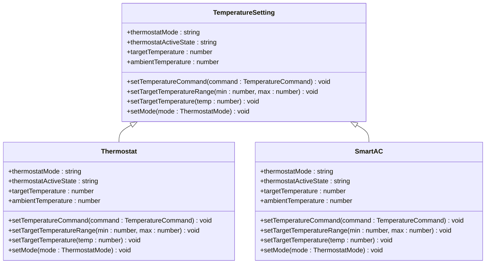

**图表来源**
- [types.d.ts](file://common/fs/@types/sdk/types.d.ts)

**方法签名与属性定义**:
- `setTemperatureCommand(command: TemperatureCommand): void` - 设置温度命令
- `setTargetTemperatureRange(min: number, max: number): void` - 设置目标温度范围
- `setTargetTemperature(temp: number): void` - 设置目标温度
- `setMode(mode: ThermostatMode): void` - 设置温度控制模式

**枚举定义**:
- **ThermostatMode**: 
  - `off`: 关闭
  - `heat`: 制热
  - `cool`: 制冷
  - `auto`: 自动
  - `eco`: 节能

**使用示例路径**:
- [TemperatureSetting 接口定义](file://common/fs/@types/sdk/types.d.ts)

**章节来源**
- [types.d.ts](file://common/fs/@types/sdk/types.d.ts)

### HumiditySetting 接口

HumiditySetting 接口提供湿度控制功能，支持加湿和除湿操作。

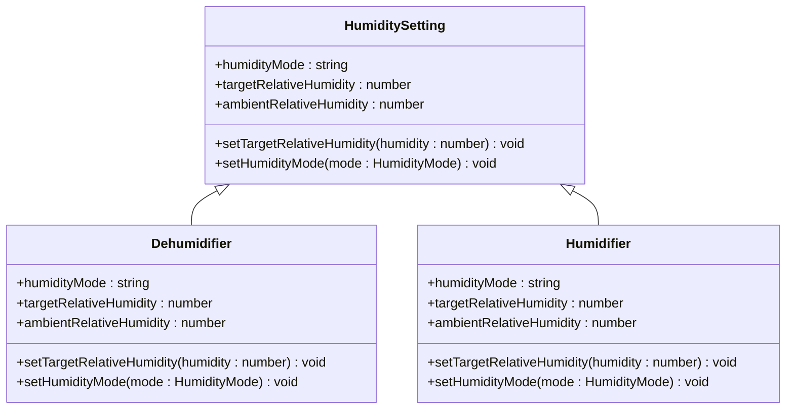

**图表来源**
- [types.d.ts](file://common/fs/@types/sdk/types.d.ts)

**方法签名与属性定义**:
- `setTargetRelativeHumidity(humidity: number): void` - 设置目标相对湿度
- `setHumidityMode(mode: HumidityMode): void` - 设置湿度控制模式

**枚举定义**:
- **HumidityMode**:
  - `off`: 关闭
  - `normal`: 正常模式
  - `eco`: 节能模式
  - `away`: 离开模式

**使用示例路径**:
- [HumiditySetting 接口定义](file://common/fs/@types/sdk/types.d.ts)

**章节来源**
- [types.d.ts](file://common/fs/@types/sdk/types.d.ts)

### Fan 接口

Fan 接口提供风扇控制功能，支持速度调节和模式设置。

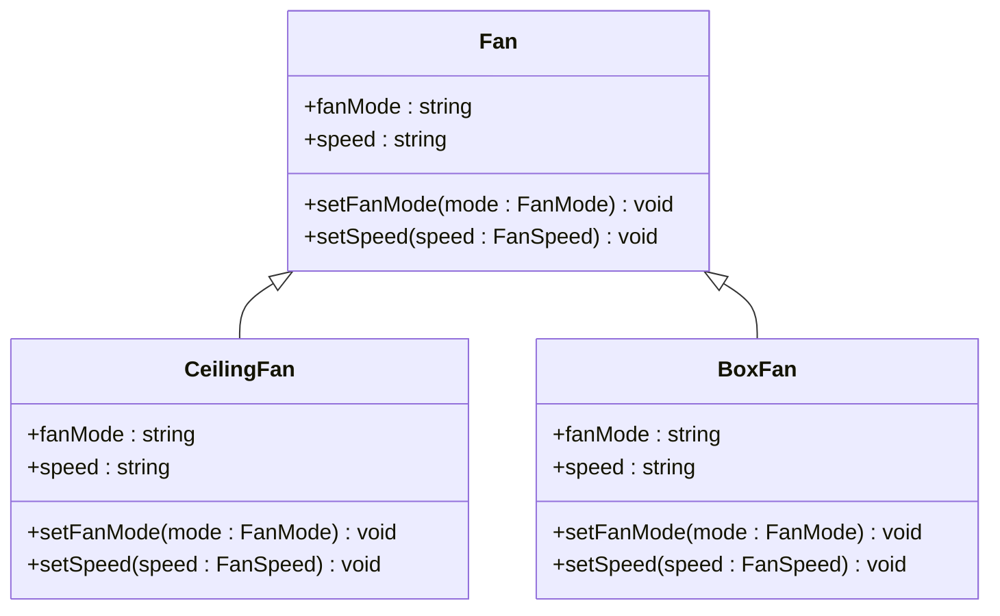

**图表来源**
- [types.d.ts](file://common/fs/@types/sdk/types.d.ts)

**方法签名与属性定义**:
- `setFanMode(mode: FanMode): void` - 设置风扇模式
- `setSpeed(speed: FanSpeed): void` - 设置风扇速度

**枚举定义**:
- **FanMode**:
  - `off`: 关闭
  - `on`: 开启
  - `auto`: 自动

- **FanSpeed**:
  - `low`: 低速
  - `medium`: 中速
  - `high`: 高速
  - `auto`: 自动

**使用示例路径**:
- [Fan 接口定义](file://common/fs/@types/sdk/types.d.ts)

**章节来源**
- [types.d.ts](file://common/fs/@types/sdk/types.d.ts)

### Sensor 接口

Sensor 接口提供传感器数据读取功能，支持多种传感器类型的统一访问。

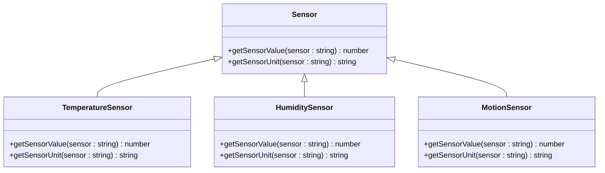

**图表来源**
- [types.d.ts](file://common/fs/@types/sdk/types.d.ts)

**方法签名与属性定义**:
- `getSensorValue(sensor: string): number` - 获取指定传感器的数值
- `getSensorUnit(sensor: string): string` - 获取指定传感器的单位

**使用示例路径**:
- [Sensor 接口定义](file://common/fs/@types/sdk/types.d.ts)

**章节来源**
- [types.d.ts](file://common/fs/@types/sdk/types.d.ts)

### Camera 接口

Camera 接口提供静态图片拍摄功能，支持多种图片选项配置。

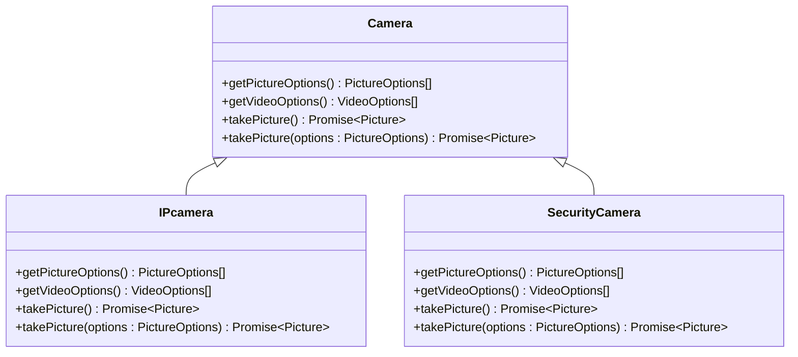

**图表来源**
- [types.d.ts](file://common/fs/@types/sdk/types.d.ts)

**方法签名与属性定义**:
- `getPictureOptions(): PictureOptions[]` - 获取可用的图片选项
- `getVideoOptions(): VideoOptions[]` - 获取可用的视频选项
- `takePicture(): Promise<Picture>` - 拍摄静态图片
- `takePicture(options: PictureOptions): Promise<Picture>` - 按指定选项拍摄图片

**使用示例路径**:
- [Camera 接口定义](file://common/fs/@types/sdk/types.d.ts)

**章节来源**
- [types.d.ts](file://common/fs/@types/sdk/types.d.ts)

### VideoCamera 接口

VideoCamera 接口提供实时视频流功能，支持多种视频格式和分辨率。

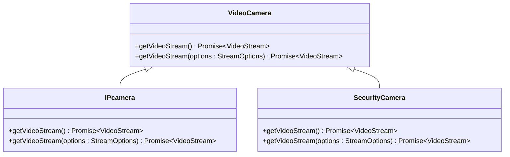

**图表来源**
- [types.d.ts](file://common/fs/@types/sdk/types.d.ts)

**方法签名与属性定义**:
- `getVideoStream(): Promise<VideoStream>` - 获取默认视频流
- `getVideoStream(options: StreamOptions): Promise<VideoStream>` - 按指定选项获取视频流

**使用示例路径**:
- [VideoCamera 接口定义](file://common/fs/@types/sdk/types.d.ts)

**章节来源**
- [types.d.ts](file://common/fs/@types/sdk/types.d.ts)

### Microphone 接口

Microphone 接口提供音频录制功能，支持实时音频流获取。

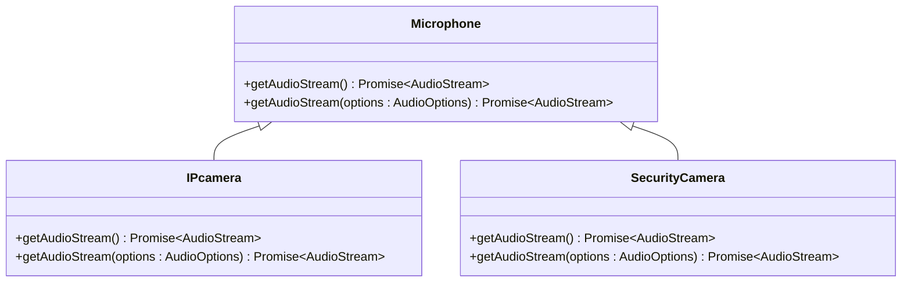

**图表来源**
- [types.d.ts](file://common/fs/@types/sdk/types.d.ts)

**方法签名与属性定义**:
- `getAudioStream(): Promise<AudioStream>` - 获取默认音频流
- `getAudioStream(options: AudioOptions): Promise<AudioStream>` - 按指定选项获取音频流

**使用示例路径**:
- [Microphone 接口定义](file://common/fs/@types/sdk/types.d.ts)

**章节来源**
- [types.d.ts](file://common/fs/@types/sdk/types.d.ts)

## 依赖关系分析

Scrypted 设备接口模型的依赖关系呈现清晰的层次结构：

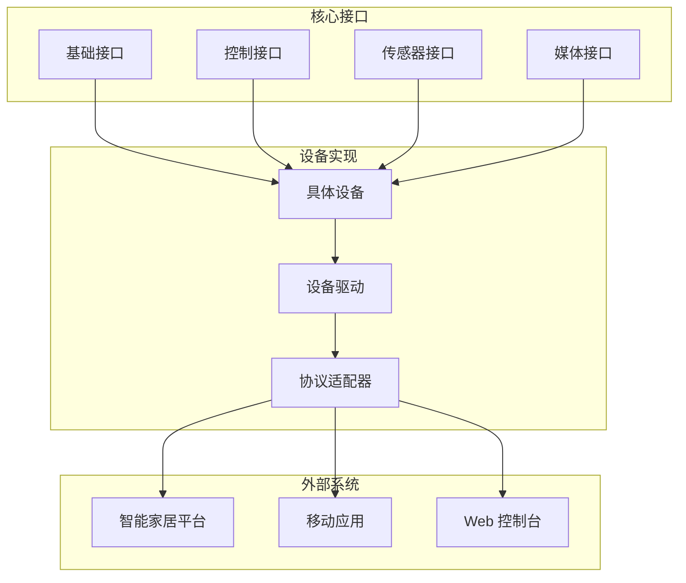

**图表来源**
- [types.input.ts](file://sdk/types/src/types.input.ts)
- [typedoc.json](file://sdk/types/typedoc.json)

**章节来源**
- [types.input.ts](file://sdk/types/src/types.input.ts)
- [typedoc.json](file://sdk/types/typedoc.json)

## 性能考虑

Scrypted 设备接口模型在设计时充分考虑了性能优化：

### 接口调用优化
- 异步操作支持，避免阻塞主线程
- 批量操作支持，减少网络往返
- 缓存机制，提高重复查询效率

### 数据传输优化
- 流式数据传输，降低内存占用
- 压缩算法应用，减少带宽消耗
- 自适应码率调整，优化用户体验

### 内存管理
- 对象池技术，减少垃圾回收压力
- 及时释放资源，防止内存泄漏
- 分页加载，支持大数据集处理

## 故障排除指南

### 常见问题及解决方案

**接口不兼容问题**
- 检查设备是否正确实现了所需接口
- 验证接口版本兼容性
- 确认参数类型和范围

**连接超时问题**
- 检查网络连接稳定性
- 调整超时参数设置
- 实现重连机制

**数据同步问题**
- 实现事件监听机制
- 使用增量更新策略
- 处理离线缓存数据

**性能问题**
- 优化接口调用频率
- 实现数据缓存策略
- 减少不必要的数据传输

**章节来源**
- [devices.ts:1-6](file://common/src/devices.ts#L1-L6)

## 结论

Scrypted 设备接口模型通过标准化的接口设计，为智能家居生态系统提供了强大的设备抽象能力。该模型具有以下优势：

### 设计优势
- **统一性**: 标准化的接口定义，简化了设备集成
- **扩展性**: 模块化的接口设计，支持新设备类型的快速接入
- **互操作性**: 跨平台的接口实现，促进不同系统间的协作

### 技术特点
- **类型安全**: 完整的 TypeScript 类型定义，提供编译时错误检测
- **异步支持**: 全面的异步操作支持，提升系统响应性
- **事件驱动**: 基于事件的设备状态更新机制

### 应用价值
- **开发者友好**: 简洁明了的 API 设计，降低开发复杂度
- **用户受益**: 统一的控制界面，提升用户体验
- **生态繁荣**: 开放的接口标准，促进生态系统发展

通过持续的演进和完善，Scrypted 设备接口模型将继续为智能家居行业的发展提供强有力的技术支撑。