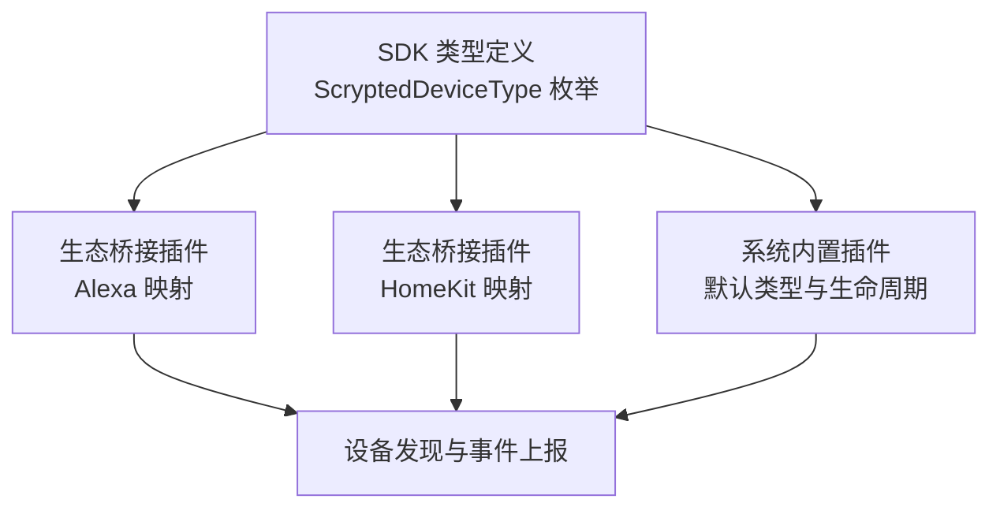
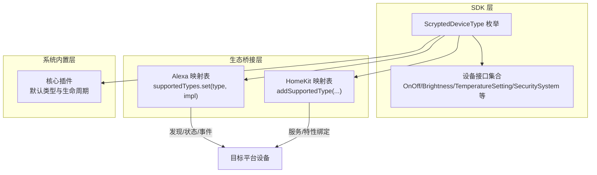
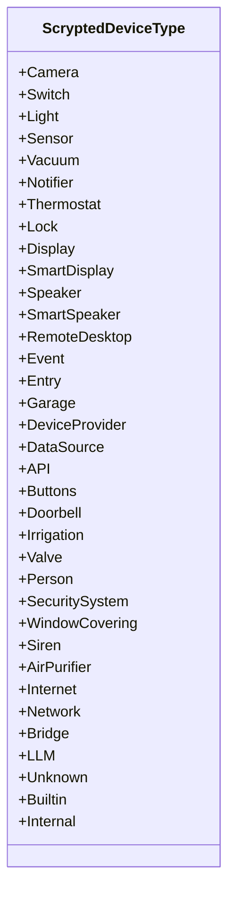
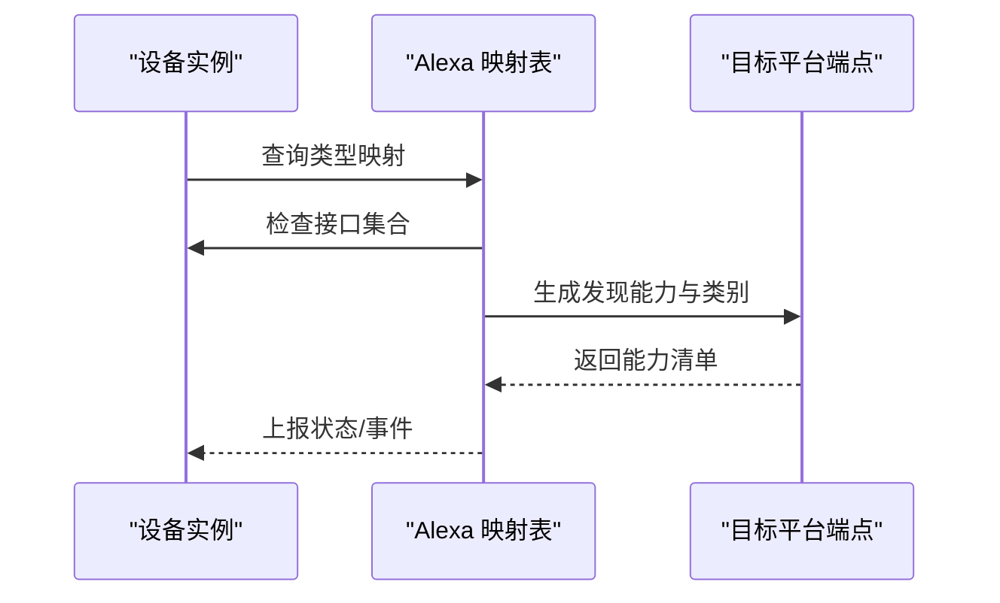
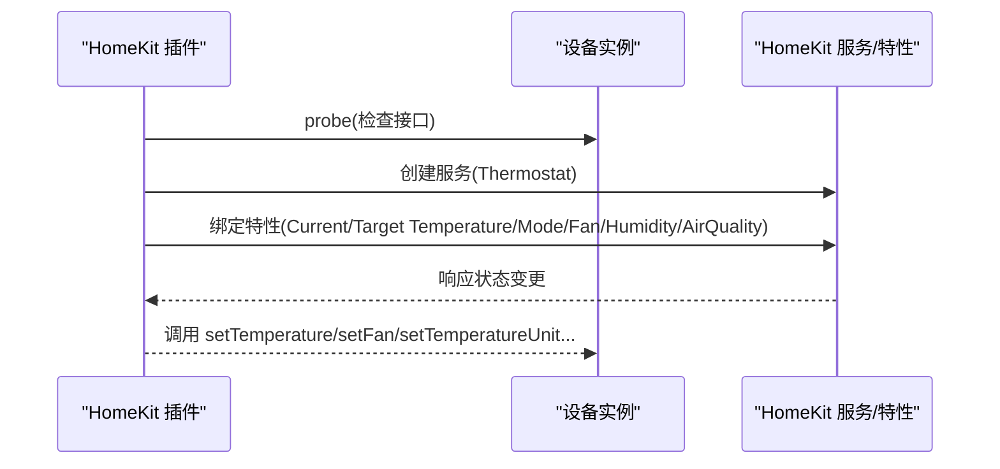
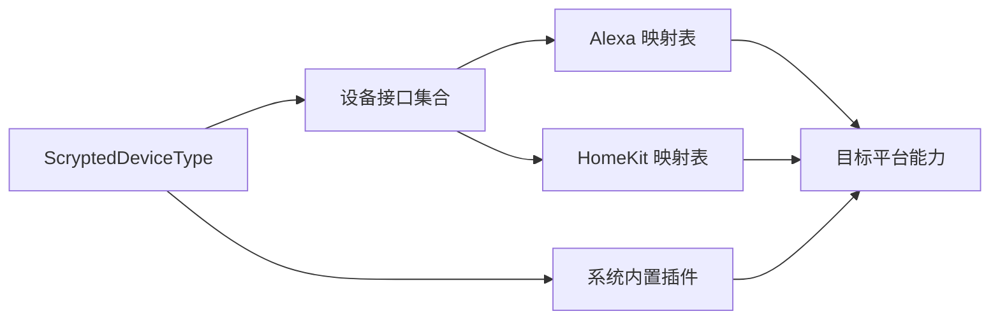

# 设备类型枚举

<cite>
**本文引用的文件**
- [sdk/types/src/types.input.ts](file://sdk/types/src/types.input.ts)
- [plugins/alexa/src/types/index.ts](file://plugins/alexa/src/types/index.ts)
- [plugins/alexa/src/types/camera.ts](file://plugins/alexa/src/types/camera.ts)
- [plugins/alexa/src/types/light.ts](file://plugins/alexa/src/types/light.ts)
- [plugins/alexa/src/types/securitysystem.ts](file://plugins/alexa/src/types/securitysystem.ts)
- [plugins/homekit/src/types/index.ts](file://plugins/homekit/src/types/index.ts)
- [plugins/homekit/src/types/thermostat.ts](file://plugins/homekit/src/types/thermostat.ts)
- [plugins/core/src/main.ts](file://plugins/core/src/main.ts)
- [plugins/core/src/automations-core.ts](file://plugins/core/src/automations-core.ts)
- [plugins/core/src/aggregate-core.ts](file://plugins/core/src/aggregate-core.ts)
- [plugins/chromecast/src/main.ts](file://plugins/chromecast/src/main.ts)
- [plugins/bticino/src/main.ts](file://plugins/bticino/src/main.ts)
- [plugins/amcrest/src/main.ts](file://plugins/amcrest/src/main.ts)
</cite>

## 目录
1. [简介](#简介)
2. [项目结构](#项目结构)
3. [核心组件](#核心组件)
4. [架构总览](#架构总览)
5. [详细组件分析](#详细组件分析)
6. [依赖关系分析](#依赖关系分析)
7. [性能考量](#性能考量)
8. [故障排查指南](#故障排查指南)
9. [结论](#结论)
10. [附录](#附录)

## 简介
本规范文档聚焦于 Scrypted 的设备类型枚举 ScryptedDeviceType，系统性梳理核心设备类型（如 Camera、Switch、Light、Sensor、Lock 等）与专业设备类型（如 Thermostat、Vacuum、Notifier、SecuritySystem 等），并阐明其在设备发现、界面呈现、功能限制与生态集成中的作用。文档同时给出设备类型与接口的映射关系、层次结构与最佳实践，帮助开发者在插件开发与设备接入中正确选择与使用设备类型。

## 项目结构
围绕设备类型的核心定义位于 SDK 类型声明文件中；各生态桥接插件（如 Alexa、HomeKit）通过映射表将 ScryptedDeviceType 与目标平台能力进行对接；系统内置插件在设备生命周期与默认类型设定中体现设备类型的作用。

**图表来源**
- [sdk/types/src/types.input.ts](file://sdk/types/src/types.input.ts)
- [plugins/alexa/src/types/index.ts](file://plugins/alexa/src/types/index.ts)
- [plugins/homekit/src/types/index.ts](file://plugins/homekit/src/types/index.ts)
- [plugins/core/src/main.ts](file://plugins/core/src/main.ts)

**章节来源**
- [sdk/types/src/types.input.ts](file://sdk/types/src/types.input.ts)
- [plugins/alexa/src/types/index.ts](file://plugins/alexa/src/types/index.ts)
- [plugins/homekit/src/types/index.ts](file://plugins/homekit/src/types/index.ts)
- [plugins/core/src/main.ts](file://plugins/core/src/main.ts)

## 核心组件
- ScryptedDeviceType 枚举：定义所有设备类型，覆盖消费级与专业级设备，包括摄像头、开关、灯具、传感器、恒温器、门锁、安防系统、真空清洁器、通知器、显示设备、扬声器、门铃、灌溉、阀门、人员、窗饰、警报器、空气净化器、网络设备、桥接设备、未知设备等。
- 设备类型与接口映射：不同设备类型通常具备一组推荐或必需的接口集合（例如 OnOff、Brightness、ColorSettingTemperature、ColorSettingHsv、TemperatureSetting、SecuritySystem 等），生态桥接插件据此生成目标平台的设备能力描述。
- 生态桥接映射表：Alexa 与 HomeKit 插件均维护一个 Map<ScryptedDeviceType | string, SupportedType>，用于将设备类型映射到发现、状态上报与事件处理逻辑。

**章节来源**
- [sdk/types/src/types.input.ts](file://sdk/types/src/types.input.ts)
- [plugins/alexa/src/types/index.ts](file://plugins/alexa/src/types/index.ts)
- [plugins/homekit/src/types/index.ts](file://plugins/homekit/src/types/index.ts)

## 架构总览
下图展示设备类型在系统中的角色：由 SDK 提供统一枚举与接口契约，生态桥接插件基于映射表将设备类型转换为目标平台能力，系统内置插件在设备创建、发现与生命周期管理中使用设备类型作为默认值与约束条件。

**图表来源**
- [sdk/types/src/types.input.ts](file://sdk/types/src/types.input.ts)
- [plugins/alexa/src/types/index.ts](file://plugins/alexa/src/types/index.ts)
- [plugins/homekit/src/types/index.ts](file://plugins/homekit/src/types/index.ts)
- [plugins/core/src/main.ts](file://plugins/core/src/main.ts)

## 详细组件分析

### ScryptedDeviceType 枚举与层次结构
- 主要设备类型包括：Camera、Switch、Light、Sensor、Vacuum、Notifier、Thermostat、Lock、Display、SmartDisplay、Speaker、SmartSpeaker、RemoteDesktop、Event、Entry、Garage、DeviceProvider、DataSource、API、Buttons、Doorbell、Irrigation、Valve、Person、SecuritySystem、WindowCovering、Siren、AirPurifier、Internet、Network、Bridge、LLM、Unknown。
- 特殊/内部类型：Builtin（已弃用）、Internal（仅内部可见）。
- 子类/扩展：部分类型可作为“容器”或“聚合”，例如 DeviceProvider、API、Scene、Program、Automation 等，用于承载或编排其他设备。

**图表来源**
- [sdk/types/src/types.input.ts](file://sdk/types/src/types.input.ts)

**章节来源**
- [sdk/types/src/types.input.ts](file://sdk/types/src/types.input.ts)

### 设备类型与接口映射（以 Alexa 为例）
- Alexa 插件通过 supportedTypes 映射表将 ScryptedDeviceType 与目标平台能力进行绑定，依据设备是否具备特定接口决定能力项（如 PowerController、BrightnessController、ColorTemperatureController、ColorController、SecurityPanelController 等）。
- 示例：
  - Camera：当设备具备 RTCSignalingChannel 接口时，映射为 CAMERA 类别。
  - Light：根据 OnOff、Brightness、ColorSettingTemperature、ColorSettingHsv 接口动态生成能力。
  - SecuritySystem：根据 SecuritySystem 接口与支持模式生成 armState 与报警状态。

**图表来源**
- [plugins/alexa/src/types/index.ts](file://plugins/alexa/src/types/index.ts)
- [plugins/alexa/src/types/camera.ts](file://plugins/alexa/src/types/camera.ts)
- [plugins/alexa/src/types/light.ts](file://plugins/alexa/src/types/light.ts)
- [plugins/alexa/src/types/securitysystem.ts](file://plugins/alexa/src/types/securitysystem.ts)

**章节来源**
- [plugins/alexa/src/types/index.ts](file://plugins/alexa/src/types/index.ts)
- [plugins/alexa/src/types/camera.ts](file://plugins/alexa/src/types/camera.ts)
- [plugins/alexa/src/types/light.ts](file://plugins/alexa/src/types/light.ts)
- [plugins/alexa/src/types/securitysystem.ts](file://plugins/alexa/src/types/securitysystem.ts)

### 设备类型与生态桥接（以 HomeKit 为例）
- HomeKit 插件通过 addSupportedType 注册类型到服务的映射，结合 bindCharacteristic 将 Scrypted 接口属性绑定到 HomeKit 特性（如 CurrentTemperature、TargetTemperature、CurrentHeatingCoolingState、TargetHeatingCoolingState 等）。
- 以 Thermostat 为例，插件会根据设备支持的接口（TemperatureSetting、Thermometer、HumiditySensor、OnOff、Fan、HumiditySetting、AirQualitySensor、PM25Sensor、VOCSensor、NOXSensor、CO2Sensor）动态配置服务与特性。

**图表来源**
- [plugins/homekit/src/types/thermostat.ts](file://plugins/homekit/src/types/thermostat.ts)

**章节来源**
- [plugins/homekit/src/types/index.ts](file://plugins/homekit/src/types/index.ts)
- [plugins/homekit/src/types/thermostat.ts](file://plugins/homekit/src/types/thermostat.ts)

### 设备类型在系统内置插件中的使用
- 默认类型与生命周期：系统内置插件在创建设备或处理生命周期时，会根据场景设置默认设备类型（如 Unknown、Automation、Builtin、Internal 等），并在 UI 或功能上进行差异化处理。
- 典型位置：
  - Unknown 类型用于兜底或未知设备。
  - Automation 类型用于自动化脚本与场景。
  - Builtin/Internal 用于系统内部设备，不对外展示或仅在特定场景下可见。

**章节来源**
- [plugins/core/src/main.ts](file://plugins/core/src/main.ts)
- [plugins/core/src/automations-core.ts](file://plugins/core/src/automations-core.ts)
- [plugins/core/src/aggregate-core.ts](file://plugins/core/src/aggregate-core.ts)

### 设备类型在设备发现与集成中的应用
- 设备发现阶段：插件通过 DeviceDiscovery 接口返回 DiscoveredDevice，其中包含 type、interfaces、settings 等信息，生态桥接插件据此生成目标平台端点。
- 设备类型影响：
  - 界面显示：不同类型对应不同的图标、分组与控制面板布局。
  - 功能限制：某些类型仅支持特定接口组合，生态桥接会据此裁剪能力。
  - 事件路由：类型决定事件的命名空间与属性映射。

**章节来源**
- [sdk/types/src/types.input.ts](file://sdk/types/src/types.input.ts)

### 设备类型选择与最佳实践
- 优先选择最贴近真实设备形态的类型，避免过度泛化。例如：
  - 摄像头设备优先使用 Camera；若具备双向音视频能力，可考虑 SmartDisplay/SmartSpeaker。
  - 恒温器设备使用 Thermostat，并确保具备 TemperatureSetting 与 Thermometer 接口。
  - 门锁设备使用 Lock，并结合 PasswordStore 进行密码管理。
  - 安防系统使用 SecuritySystem，并暴露受支持模式与触发状态。
- 类型与接口匹配：
  - Light 应尽量提供 OnOff、Brightness、ColorSettingTemperature、ColorSettingHsv 中的可用能力。
  - Vacuum 应提供 StartStop、Pause、Dock 等接口以完整表达清扫行为。
  - Notifier 应提供发送通知的能力，并支持媒体对象。
- 用户体验影响：
  - 正确的设备类型能提升第三方平台的识别度与交互体验（如 Alexa 的显示类别、HomeKit 的服务/特性）。
  - 避免将多种设备类型混用为同一设备，以免造成控制混乱与功能缺失。
- 常见应用场景：
  - 摄像头 + 传感器：在 Alexa 中映射为 CAMERA 类别，启用运动检测与物体检测事件上报。
  - 灯具 + 色温/颜色：在 Alexa 中启用亮度与色温/颜色控制器，实现精细调光与彩光效果。
  - 恒温器 + 湿度/空气质量：在 HomeKit 中绑定温度、湿度、风速与空气质量特性，提供全面环境感知。

**章节来源**
- [plugins/alexa/src/types/camera.ts](file://plugins/alexa/src/types/camera.ts)
- [plugins/alexa/src/types/light.ts](file://plugins/alexa/src/types/light.ts)
- [plugins/alexa/src/types/securitysystem.ts](file://plugins/alexa/src/types/securitysystem.ts)
- [plugins/homekit/src/types/thermostat.ts](file://plugins/homekit/src/types/thermostat.ts)

## 依赖关系分析
- 设备类型依赖接口：生态桥接插件通过检查设备接口集合来决定能力生成，接口缺失会导致能力被忽略。
- 类型到平台映射：Alexa 与 HomeKit 插件各自维护映射表，彼此独立但遵循相同输入（ScryptedDeviceType + 接口集合）。
- 系统内置插件：负责设备生命周期与默认类型设定，间接影响设备在生态中的呈现。

**图表来源**
- [sdk/types/src/types.input.ts](file://sdk/types/src/types.input.ts)
- [plugins/alexa/src/types/index.ts](file://plugins/alexa/src/types/index.ts)
- [plugins/homekit/src/types/index.ts](file://plugins/homekit/src/types/index.ts)
- [plugins/core/src/main.ts](file://plugins/core/src/main.ts)

**章节来源**
- [sdk/types/src/types.input.ts](file://sdk/types/src/types.input.ts)
- [plugins/alexa/src/types/index.ts](file://plugins/alexa/src/types/index.ts)
- [plugins/homekit/src/types/index.ts](file://plugins/homekit/src/types/index.ts)
- [plugins/core/src/main.ts](file://plugins/core/src/main.ts)

## 性能考量
- 设备类型与接口的匹配应尽量精简，避免不必要的能力上报，减少生态平台的解析与渲染开销。
- 对于高频率事件（如传感器状态变化），建议使用去噪与被动监听策略，降低事件风暴。
- 在设备发现阶段，优先提供最小可行的接口集，后续按需扩展，以缩短首次连接与适配时间。

## 故障排查指南
- 设备未出现在目标平台：
  - 检查设备类型是否在生态映射表中注册，以及是否满足必需接口。
  - 确认设备接口集合是否包含目标平台所需能力（如 Alexa 的 PowerController/BrightnessController 等）。
- 设备状态不同步：
  - 确认设备实现了必要的接口与属性（如 OnOff、Brightness、TemperatureSetting、SecuritySystem 等）。
  - 检查事件上报路径与属性命名空间是否一致。
- 设备类型错误导致功能缺失：
  - 核对设备类型与接口的匹配关系，必要时调整类型或补充接口。
  - 参考系统内置插件的默认类型策略，确保类型符合预期。

**章节来源**
- [plugins/alexa/src/types/light.ts](file://plugins/alexa/src/types/light.ts)
- [plugins/alexa/src/types/securitysystem.ts](file://plugins/alexa/src/types/securitysystem.ts)
- [plugins/homekit/src/types/thermostat.ts](file://plugins/homekit/src/types/thermostat.ts)

## 结论
ScryptedDeviceType 枚举是设备生态集成的基石。正确选择与使用设备类型，能够显著提升第三方平台的识别度与交互体验，同时简化接口设计与事件处理。建议在插件开发中严格遵循“类型即契约”的原则，确保设备类型与接口集合的一致性，并参考本文的最佳实践与示例，构建稳定、可维护的设备接入方案。

## 附录

### 设备类型与典型接口对照（示例）
- Camera：VideoCamera、Camera、MotionSensor、ObjectDetector（可选）
- Light：OnOff、Brightness、ColorSettingTemperature、ColorSettingHsv
- Switch/Outlet：OnOff
- Sensor：BinarySensor、MotionSensor、OccupancySensor、Temperature、Humidity、AirQuality、PM25、PM10、VOC、NOX、CO2 等
- Thermostat：TemperatureSetting、Thermometer、HumiditySensor、HumiditySetting、Fan、AirQualitySensor、PM25Sensor、VOCSensor、NOXSensor、CO2Sensor
- Lock：Lock、PasswordStore
- SecuritySystem：SecuritySystem
- Vacuum：StartStop、Pause、Dock
- Notifier：Notifier
- Display/SmartDisplay：Display、VideoCamera、Camera（可选）
- Speaker/SmartSpeaker：Speaker、Microphone、Intercom（可选）

**章节来源**
- [sdk/types/src/types.input.ts](file://sdk/types/src/types.input.ts)

### 设备类型在具体插件中的使用示例
- Chromecast：根据设备能力选择 Speaker 或 Display。
- Bticino：门锁、开关、门铃等设备类型映射。
- Amcrest：门铃设备类型设置。

**章节来源**
- [plugins/chromecast/src/main.ts](file://plugins/chromecast/src/main.ts)
- [plugins/bticino/src/main.ts](file://plugins/bticino/src/main.ts)
- [plugins/amcrest/src/main.ts](file://plugins/amcrest/src/main.ts)