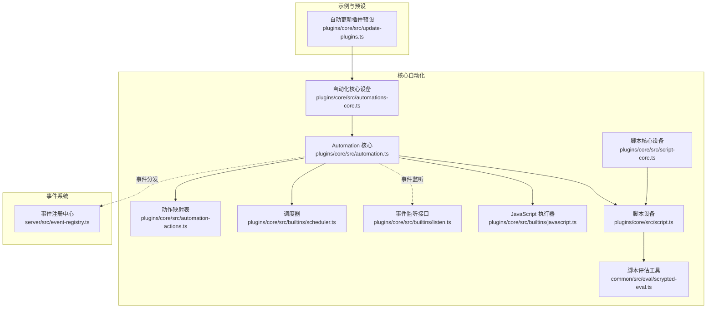
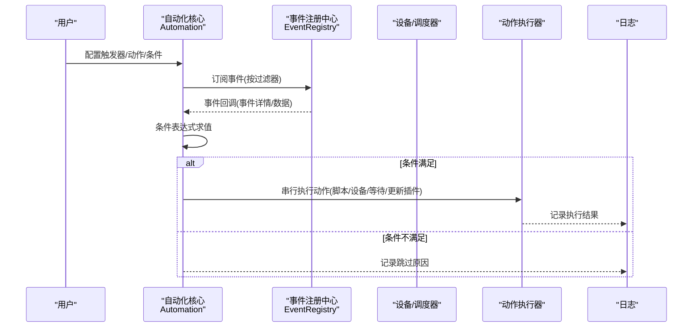
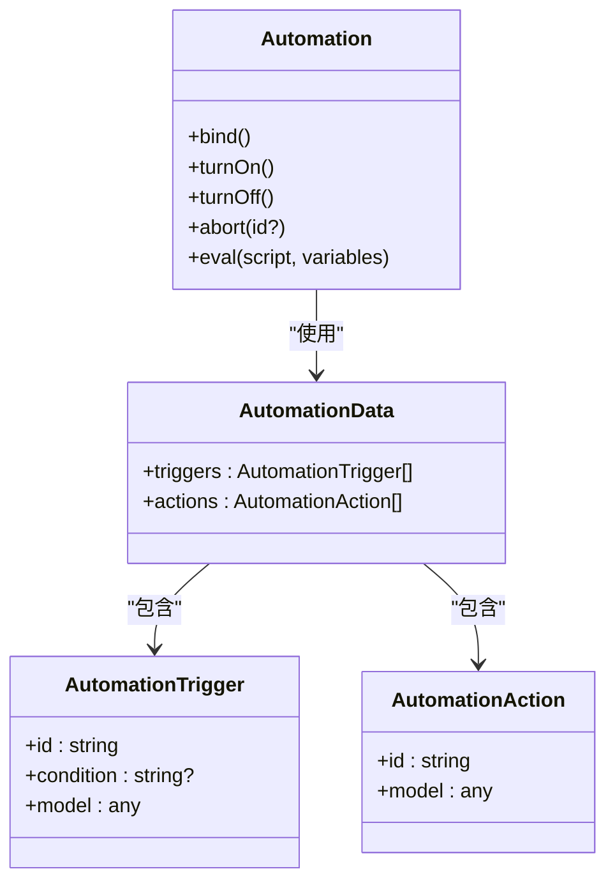
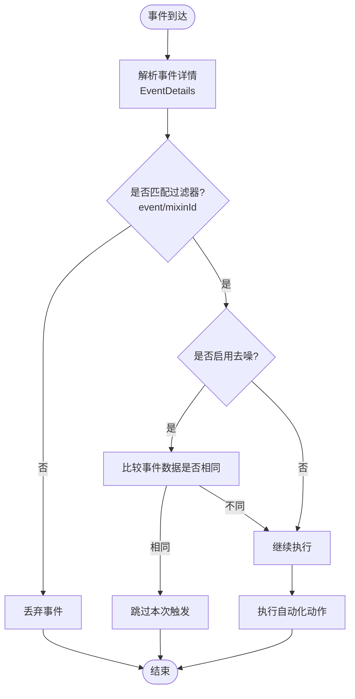
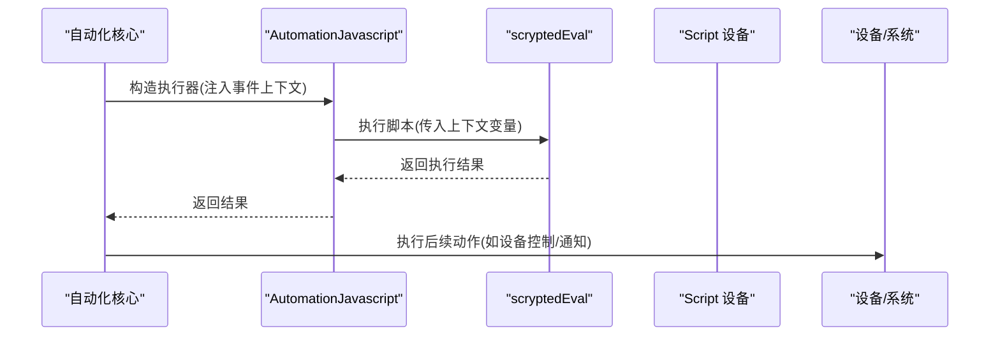
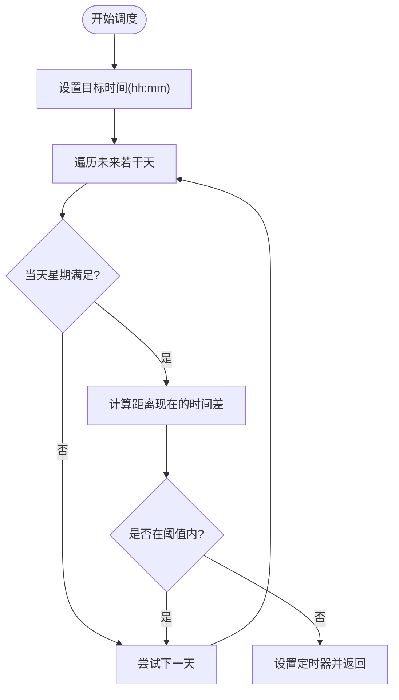
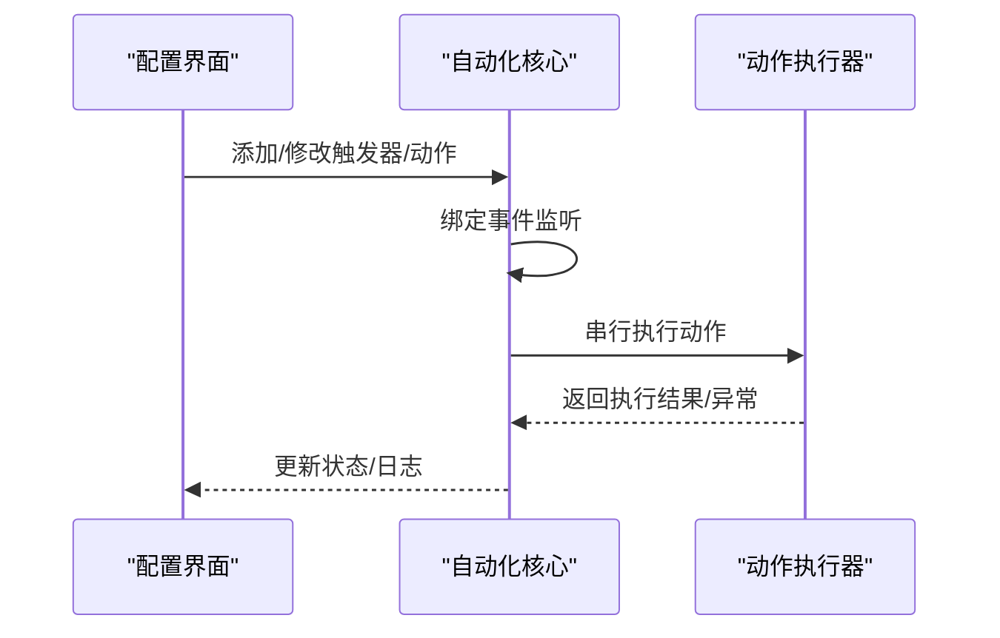
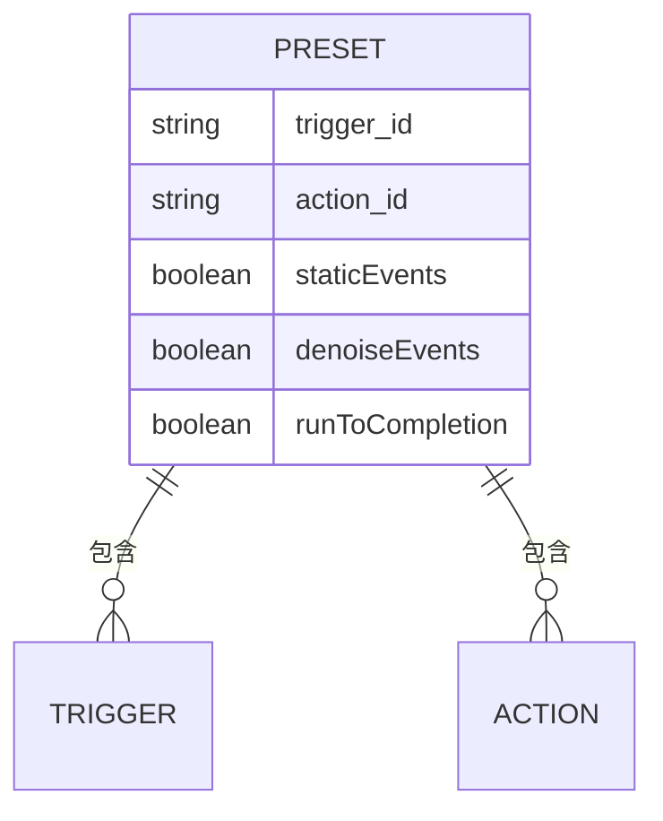
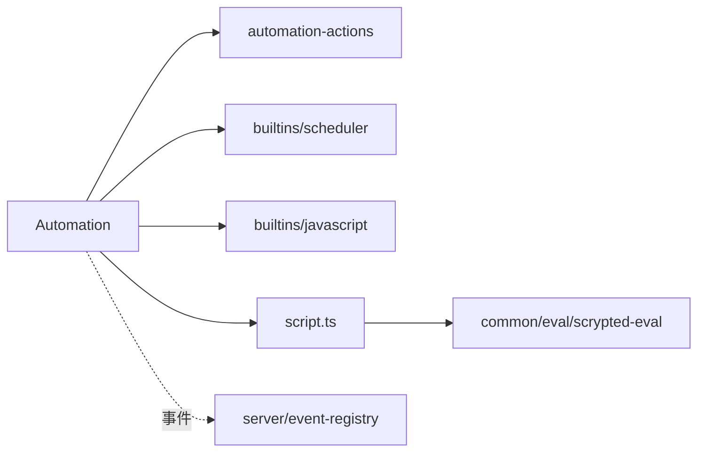

# 自动化数据模型

<cite>
**本文引用的文件**
- [plugins/core/src/automation.ts](file://plugins/core/src/automation.ts)
- [plugins/core/src/automations-core.ts](file://plugins/core/src/automations-core.ts)
- [plugins/core/src/automation-actions.ts](file://plugins/core/src/automation-actions.ts)
- [plugins/core/src/builtins/scheduler.ts](file://plugins/core/src/builtins/scheduler.ts)
- [plugins/core/src/builtins/listen.ts](file://plugins/core/src/builtins/listen.ts)
- [plugins/core/src/builtins/javascript.ts](file://plugins/core/src/builtins/javascript.ts)
- [plugins/core/src/script.ts](file://plugins/core/src/script.ts)
- [plugins/core/src/script-core.ts](file://plugins/core/src/script-core.ts)
- [common/src/eval/scrypted-eval.ts](file://common/src/eval/scrypted-eval.ts)
- [server/src/event-registry.ts](file://server/src/event-registry.ts)
- [plugins/core/src/update-plugins.ts](file://plugins/core/src/update-plugins.ts)
</cite>

## 目录
1. [简介](#简介)
2. [项目结构](#项目结构)
3. [核心组件](#核心组件)
4. [架构总览](#架构总览)
5. [详细组件分析](#详细组件分析)
6. [依赖分析](#依赖分析)
7. [性能考虑](#性能考虑)
8. [故障排查指南](#故障排查指南)
9. [结论](#结论)
10. [附录](#附录)

## 简介
本文件为 Scrypted 自动化系统的数据模型规范文档，聚焦以下方面：
- 自动化规则的数据结构：触发条件、动作执行、规则状态与运行控制
- 事件驱动机制的数据模型：事件详情、事件过滤器、事件处理器配置
- 脚本执行系统：脚本内容、执行上下文、变量存储、错误处理
- 时间调度功能：定时任务、重复模式、时区处理、调度状态
- 自动化配置：规则优先级、执行顺序、依赖关系、冲突检测
- 自动化日志与审计：执行历史、状态变更、错误记录、性能指标
- 模板与预设：常用触发器、标准动作、推荐配置
- 实际自动化示例：场景联动、条件判断、循环执行等常见模式的数据处理流程

## 项目结构
围绕自动化系统的核心文件位于 plugins/core 目录，涵盖自动化规则、动作映射、调度器、脚本执行与核心设备管理；事件注册与监听在 server 层实现；通用脚本评估能力在 common 层提供。

**图表来源**
- [plugins/core/src/automation.ts:1-597](file://plugins/core/src/automation.ts#L1-L597)
- [plugins/core/src/automations-core.ts:1-83](file://plugins/core/src/automations-core.ts#L1-L83)
- [plugins/core/src/automation-actions.ts:1-104](file://plugins/core/src/automation-actions.ts#L1-L104)
- [plugins/core/src/builtins/scheduler.ts:1-101](file://plugins/core/src/builtins/scheduler.ts#L1-L101)
- [plugins/core/src/builtins/listen.ts:1-6](file://plugins/core/src/builtins/listen.ts#L1-L6)
- [plugins/core/src/builtins/javascript.ts:1-25](file://plugins/core/src/builtins/javascript.ts#L1-L25)
- [plugins/core/src/script.ts:1-100](file://plugins/core/src/script.ts#L1-L100)
- [plugins/core/src/script-core.ts:1-156](file://plugins/core/src/script-core.ts#L1-L156)
- [common/src/eval/scrypted-eval.ts:116-145](file://common/src/eval/scrypted-eval.ts#L116-L145)
- [server/src/event-registry.ts:1-37](file://server/src/event-registry.ts#L1-L37)
- [plugins/core/src/update-plugins.ts:1-48](file://plugins/core/src/update-plugins.ts#L1-L48)

**章节来源**
- [plugins/core/src/automation.ts:1-597](file://plugins/core/src/automation.ts#L1-L597)
- [plugins/core/src/automations-core.ts:1-83](file://plugins/core/src/automations-core.ts#L1-L83)
- [plugins/core/src/automation-actions.ts:1-104](file://plugins/core/src/automation-actions.ts#L1-L104)
- [plugins/core/src/builtins/scheduler.ts:1-101](file://plugins/core/src/builtins/scheduler.ts#L1-L101)
- [plugins/core/src/builtins/listen.ts:1-6](file://plugins/core/src/builtins/listen.ts#L1-L6)
- [plugins/core/src/builtins/javascript.ts:1-25](file://plugins/core/src/builtins/javascript.ts#L1-L25)
- [plugins/core/src/script.ts:1-100](file://plugins/core/src/script.ts#L1-L100)
- [plugins/core/src/script-core.ts:1-156](file://plugins/core/src/script-core.ts#L1-L156)
- [common/src/eval/scrypted-eval.ts:116-145](file://common/src/eval/scrypted-eval.ts#L116-L145)
- [server/src/event-registry.ts:1-37](file://server/src/event-registry.ts#L1-L37)
- [plugins/core/src/update-plugins.ts:1-48](file://plugins/core/src/update-plugins.ts#L1-L48)

## 核心组件
- 自动化规则数据结构
  - 触发器数组：每个触发器包含 id、可选 condition、以及 model（用于存储触发器特定参数）
  - 动作数组：每个动作包含 id（目标设备或动作类型标识）与 model（动作参数）
  - 规则状态与运行控制：通过 OnOff 开关、运行到完成、静默事件、重置策略等设置控制执行行为
- 事件驱动机制
  - 事件详情 EventDetails：包含事件标识、事件接口、事件时间等
  - 事件过滤器：通过 EventListenerOptions 的 event、mixinId 等进行过滤
  - 事件处理器：Listen 接口统一抽象事件订阅，Scheduler 提供基于时间的事件源
- 脚本执行系统
  - Script 设备：保存脚本内容，运行时注入执行上下文变量
  - AutomationJavascript：向脚本注入 eventDetails、eventData、eventSource
  - scryptedEval：提供安全的脚本评估环境与标准库
- 时间调度
  - Schedule 接口：包含小时、分钟、周内各天布尔开关
  - Scheduler：计算下次触发时间并回调，支持一次性或周期性事件
- 自动化配置
  - StorageSettings：动态生成触发器与动作的 UI 配置项，支持条件表达式、设备选择、数值输入等
  - 冲突与并发：runToCompletion、staticEvents、denoiseEvents 控制执行并发与事件去噪
- 日志与审计
  - 运行日志：自动化触发、条件检查、动作执行、异常等日志输出
  - 性能指标：事件到执行的延迟、超时重试、重入保护等

**章节来源**
- [plugins/core/src/automation.ts:15-56](file://plugins/core/src/automation.ts#L15-L56)
- [plugins/core/src/builtins/listen.ts:1-6](file://plugins/core/src/builtins/listen.ts#L1-L6)
- [plugins/core/src/builtins/scheduler.ts:4-14](file://plugins/core/src/builtins/scheduler.ts#L4-L14)
- [plugins/core/src/builtins/javascript.ts:5-24](file://plugins/core/src/builtins/javascript.ts#L5-L24)
- [plugins/core/src/script.ts:71-100](file://plugins/core/src/script.ts#L71-L100)
- [common/src/eval/scrypted-eval.ts:116-145](file://common/src/eval/scrypted-eval.ts#L116-L145)
- [server/src/event-registry.ts:1-37](file://server/src/event-registry.ts#L1-L37)

## 架构总览
自动化系统采用“规则引擎 + 事件驱动 + 脚本执行 + 动作映射”的分层架构。自动化核心负责解析规则、绑定事件、执行动作；调度器提供时间事件源；脚本执行器提供灵活的逻辑扩展；动作映射表将动作标准化为具体设备操作。

**图表来源**
- [plugins/core/src/automation.ts:482-595](file://plugins/core/src/automation.ts#L482-L595)
- [server/src/event-registry.ts:30-37](file://server/src/event-registry.ts#L30-L37)

**章节来源**
- [plugins/core/src/automation.ts:482-595](file://plugins/core/src/automation.ts#L482-L595)
- [server/src/event-registry.ts:30-37](file://server/src/event-registry.ts#L30-L37)

## 详细组件分析

### 自动化规则数据模型
- 数据结构
  - AutomationData：包含 triggers、actions 字段
  - AutomationTrigger：id（设备事件或“scheduler”）、condition（可选条件表达式）、model（触发器参数）
  - AutomationAction：id（设备或动作类型标识）、model（动作参数）
- 规则状态与运行控制
  - denoiseEvents：事件去噪，抑制连续相同事件
  - runToCompletion：运行到完成，避免并发执行
  - staticEvents：是否对所有事件重置计时器
  - data：持久化存储的完整规则对象
- 触发器与动作的 UI 映射
  - 通过 StorageSettings 动态生成配置项，支持多选天、时间、脚本、Shell 脚本、等待秒数、设备选择、设备动作参数等

**图表来源**
- [plugins/core/src/automation.ts:15-56](file://plugins/core/src/automation.ts#L15-L56)

**章节来源**
- [plugins/core/src/automation.ts:15-56](file://plugins/core/src/automation.ts#L15-L56)
- [plugins/core/src/automation.ts:70-91](file://plugins/core/src/automation.ts#L70-L91)

### 事件驱动机制数据模型
- 事件详情 EventDetails
  - eventId、eventInterface、eventTime 等字段用于描述事件来源与元数据
- 事件过滤器
  - EventListenerOptions 支持 event 与 mixinId 过滤
  - getMixinEventName 可组合事件名以区分混入设备
- 事件处理器
  - Listen 接口统一 listen 方法，返回 EventListenerRegister 以便移除监听
  - Scheduler.listen 返回固定事件接口“Scheduler”，并周期性触发

**图表来源**
- [server/src/event-registry.ts:11-21](file://server/src/event-registry.ts#L11-L21)
- [plugins/core/src/builtins/listen.ts:3-5](file://plugins/core/src/builtins/listen.ts#L3-L5)
- [plugins/core/src/builtins/scheduler.ts:34-90](file://plugins/core/src/builtins/scheduler.ts#L34-L90)

**章节来源**
- [server/src/event-registry.ts:1-37](file://server/src/event-registry.ts#L1-L37)
- [plugins/core/src/builtins/listen.ts:1-6](file://plugins/core/src/builtins/listen.ts#L1-L6)
- [plugins/core/src/builtins/scheduler.ts:34-90](file://plugins/core/src/builtins/scheduler.ts#L34-L90)

### 脚本执行系统数据模型
- 脚本内容与上下文
  - Script 设备保存脚本内容于存储中，运行时注入执行上下文变量（eventDetails、eventData、eventSource）
  - AutomationJavascript.run 将上下文传入 scryptedEval 执行
- 执行上下文
  - 变量：eventDetails、eventData、eventSource
  - 错误处理：捕获异常并抛出，便于上层日志记录
- 脚本评估
  - createScriptDevice 创建具备 Scriptable/Program 接口的设备代理
  - createMonacoEvalDefaults 提供标准库与额外库的默认配置

**图表来源**
- [plugins/core/src/builtins/javascript.ts:17-23](file://plugins/core/src/builtins/javascript.ts#L17-L23)
- [plugins/core/src/script.ts:78-100](file://plugins/core/src/script.ts#L78-L100)
- [common/src/eval/scrypted-eval.ts:143-145](file://common/src/eval/scrypted-eval.ts#L143-L145)

**章节来源**
- [plugins/core/src/builtins/javascript.ts:1-25](file://plugins/core/src/builtins/javascript.ts#L1-L25)
- [plugins/core/src/script.ts:71-100](file://plugins/core/src/script.ts#L71-L100)
- [common/src/eval/scrypted-eval.ts:116-145](file://common/src/eval/scrypted-eval.ts#L116-L145)

### 时间调度数据模型
- Schedule 接口
  - hour、minute：整点与分钟
  - 周内布尔开关：sunday 到 saturday
- Scheduler 行为
  - 计算未来最近一次满足星期条件的时间点
  - 设置定时器并在到期时回调，事件接口固定为“Scheduler”
  - 若无可用触发时间，记录警告

**图表来源**
- [plugins/core/src/builtins/scheduler.ts:16-77](file://plugins/core/src/builtins/scheduler.ts#L16-L77)

**章节来源**
- [plugins/core/src/builtins/scheduler.ts:4-14](file://plugins/core/src/builtins/scheduler.ts#L4-L14)
- [plugins/core/src/builtins/scheduler.ts:16-77](file://plugins/core/src/builtins/scheduler.ts#L16-L77)

### 自动化配置与执行顺序
- 配置项生成
  - StorageSettings 动态生成触发器与动作的 UI 配置，支持按钮添加、类型切换、条件表达式、设备筛选等
- 执行顺序
  - 动作为串行执行，逐个动作按顺序执行
  - 支持等待动作（timer），支持脚本与 Shell 脚本动作
  - 支持更新插件动作
- 并发与重入控制
  - runToCompletion：若正在执行则忽略新触发
  - staticEvents：对所有事件重置计时器
  - denoiseEvents：对连续相同事件进行去噪

**图表来源**
- [plugins/core/src/automation.ts:436-472](file://plugins/core/src/automation.ts#L436-L472)
- [plugins/core/src/automation.ts:482-542](file://plugins/core/src/automation.ts#L482-L542)

**章节来源**
- [plugins/core/src/automation.ts:436-472](file://plugins/core/src/automation.ts#L436-L472)
- [plugins/core/src/automation.ts:482-542](file://plugins/core/src/automation.ts#L482-L542)

### 自动化日志与审计
- 日志记录
  - 触发键、条件检查、动作执行、异常、超时等均有日志输出
- 审计要点
  - 触发来源设备名称、事件接口、事件时间
  - 动作执行结果与失败原因
  - 并发控制与去噪行为的影响

**章节来源**
- [plugins/core/src/automation.ts:482-595](file://plugins/core/src/automation.ts#L482-L595)

### 自动化模板与预设
- 自动更新插件预设
  - 包含一个调度器触发器（每日固定时间）与一个更新插件动作
  - 适用于定期自动更新插件的场景

**图表来源**
- [plugins/core/src/update-plugins.ts:1-48](file://plugins/core/src/update-plugins.ts#L1-L48)

**章节来源**
- [plugins/core/src/update-plugins.ts:1-48](file://plugins/core/src/update-plugins.ts#L1-L48)

## 依赖分析
- 组件耦合
  - Automation 依赖 AutomationActions 的动作映射、Scheduler 的时间事件、AutomationJavascript 的脚本执行
  - ScriptCore 与 Script 协同提供脚本生命周期与设备发现
  - EventRegistry 提供系统级事件监听注册
- 外部依赖
  - SDK 接口与类型（EventDetails、EventListenerOptions、ScryptedDevice 等）
  - 系统管理器 systemManager 用于获取设备与组件

**图表来源**
- [plugins/core/src/automation.ts:1-9](file://plugins/core/src/automation.ts#L1-L9)
- [plugins/core/src/automation-actions.ts:1-104](file://plugins/core/src/automation-actions.ts#L1-L104)
- [plugins/core/src/builtins/scheduler.ts:1-101](file://plugins/core/src/builtins/scheduler.ts#L1-L101)
- [plugins/core/src/builtins/javascript.ts:1-25](file://plugins/core/src/builtins/javascript.ts#L1-L25)
- [plugins/core/src/script.ts:1-100](file://plugins/core/src/script.ts#L1-L100)
- [common/src/eval/scrypted-eval.ts:116-145](file://common/src/eval/scrypted-eval.ts#L116-L145)
- [server/src/event-registry.ts:1-37](file://server/src/event-registry.ts#L1-L37)

**章节来源**
- [plugins/core/src/automation.ts:1-9](file://plugins/core/src/automation.ts#L1-L9)
- [plugins/core/src/automation-actions.ts:1-104](file://plugins/core/src/automation-actions.ts#L1-L104)
- [plugins/core/src/builtins/scheduler.ts:1-101](file://plugins/core/src/builtins/scheduler.ts#L1-L101)
- [plugins/core/src/builtins/javascript.ts:1-25](file://plugins/core/src/builtins/javascript.ts#L1-L25)
- [plugins/core/src/script.ts:1-100](file://plugins/core/src/script.ts#L1-L100)
- [common/src/eval/scrypted-eval.ts:116-145](file://common/src/eval/scrypted-eval.ts#L116-L145)
- [server/src/event-registry.ts:1-37](file://server/src/event-registry.ts#L1-L37)

## 性能考虑
- 事件去噪与并发控制
  - 合理开启 denoiseEvents 与 runToCompletion 可减少重复执行与资源浪费
- 调度精度与时钟类型
  - 使用整点与分钟配置，避免过于频繁的调度
- 脚本执行
  - 避免长时间阻塞脚本，必要时拆分为多个短脚本或使用等待动作
- 动作执行
  - 对设备动作进行批量合并与去抖，减少设备交互次数

## 故障排查指南
- 触发未生效
  - 检查触发器类型与条件表达式是否正确
  - 确认事件过滤器与 mixinId 是否匹配
- 并发冲突
  - 若出现重复执行，检查 runToCompletion 与 staticEvents 设置
- 脚本错误
  - 查看脚本执行日志，定位异常位置并修正上下文变量
- 调度不触发
  - 检查星期开关与时间配置，确认目标时间在未来且满足条件

**章节来源**
- [plugins/core/src/automation.ts:482-595](file://plugins/core/src/automation.ts#L482-L595)

## 结论
Scrypted 的自动化系统通过清晰的数据模型与事件驱动机制，提供了灵活、可扩展的自动化能力。规则结构简单明确，动作映射标准化，脚本执行与调度器完善，配合完善的日志与配置项，能够满足从基础场景到复杂联动的多种需求。建议在生产环境中合理配置去噪、并发与调度策略，并充分利用模板与预设提升开发效率。

## 附录
- 示例场景
  - 场景联动：多个触发器（设备事件+调度器）共同触发一组动作（设备控制、通知）
  - 条件判断：在动作前加入条件表达式，仅在满足条件时执行
  - 循环执行：通过等待动作与调度器组合实现周期性任务
- 推荐实践
  - 将复杂逻辑拆分为多个短脚本，便于维护与调试
  - 使用模板快速搭建常见自动化，再根据需要定制
  - 对关键自动化启用运行到完成与去噪，确保稳定性