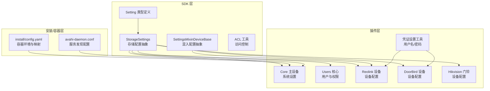
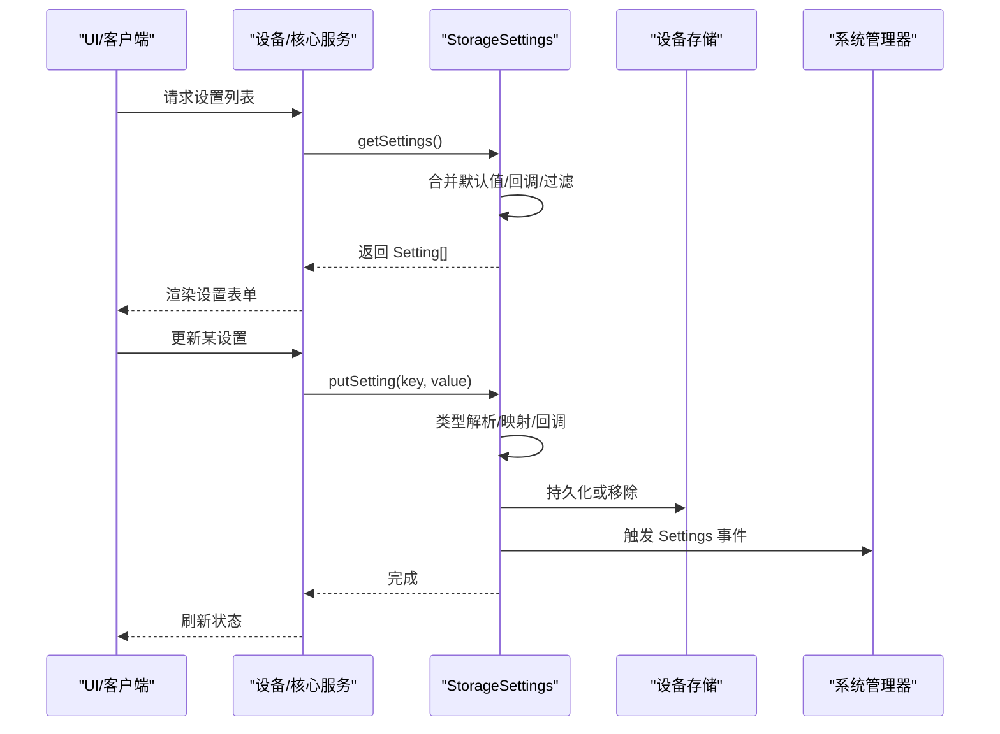
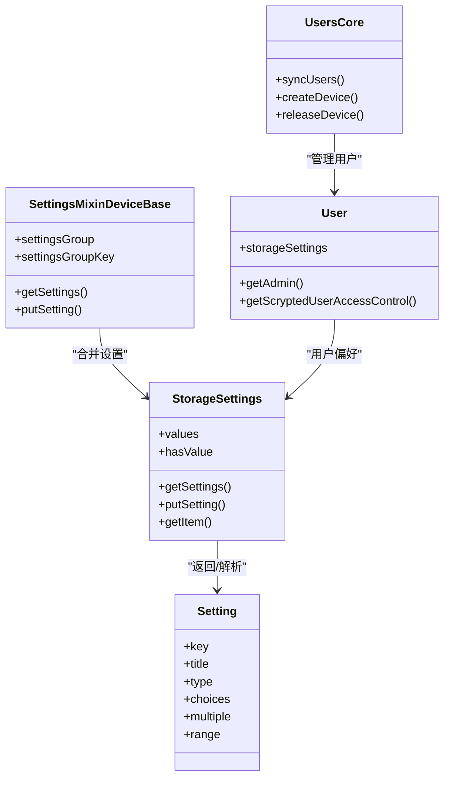

# 配置数据模型

<cite>
**本文引用的文件**
- [install/config.yaml](file://install/config.yaml)
- [plugins/core/src/main.ts](file://plugins/core/src/main.ts)
- [plugins/core/src/user.ts](file://plugins/core/src/user.ts)
- [sdk/src/storage-settings.ts](file://sdk/src/storage-settings.ts)
- [sdk/src/settings-mixin.ts](file://sdk/src/settings-mixin.ts)
- [common/src/credentials-settings.ts](file://common/src/credentials-settings.ts)
- [sdk/types/src/types.input.ts](file://sdk/types/src/types.input.ts)
- [sdk/src/acl.ts](file://sdk/src/acl.ts)
- [plugins/reolink/src/main.ts](file://plugins/reolink/src/main.ts)
- [plugins/doorbird/src/main.ts](file://plugins/doorbird/src/main.ts)
- [plugins/hikvision-doorbell/src/main.ts](file://plugins/hikvision-doorbell/src/main.ts)
- [install/docker/fs/etc/avahi/avahi-daemon.conf](file://install/docker/fs/etc/avahi/avahi-daemon.conf)
</cite>

## 目录
1. [简介](#简介)
2. [项目结构](#项目结构)
3. [核心组件](#核心组件)
4. [架构总览](#架构总览)
5. [详细组件分析](#详细组件分析)
6. [依赖分析](#依赖分析)
7. [性能考虑](#性能考虑)
8. [故障排查指南](#故障排查指南)
9. [结论](#结论)
10. [附录](#附录)

## 简介
本文件为 Scrypted 配置系统的数据模型规范文档，聚焦以下方面：
- 系统配置：服务器设置、网络配置、存储配置、安全配置等核心参数的数据结构与约束。
- 设备配置：设备特定设置、连接参数、认证信息、功能开关等数据模型。
- 用户配置：用户偏好、界面设置、通知配置、权限分配等数据模型。
- 验证与约束：字段类型检查、范围验证、依赖关系、冲突检测等。
- 导入导出：JSON 结构、备份方案、迁移策略、版本兼容性。
- 缓存与同步：配置更新传播、分布式一致性、冲突解决、回滚机制。
- 模板与预设：设备模板、场景配置、自动化预设等。
- 实际示例：系统初始化、设备添加、用户管理等场景下的配置数据处理流程与最佳实践。

## 项目结构
Scrypted 的配置系统由 SDK 层（通用能力）、插件层（具体设备/服务实现）与安装/容器层（环境与部署）共同组成。SDK 提供统一的配置抽象与持久化工具；插件通过这些抽象暴露设备或系统级配置；安装层提供运行时环境变量与容器配置。

**图表来源**
- [sdk/src/storage-settings.ts:81-196](file://sdk/src/storage-settings.ts#L81-L196)
- [sdk/src/settings-mixin.ts:10-86](file://sdk/src/settings-mixin.ts#L10-L86)
- [plugins/core/src/main.ts:27-95](file://plugins/core/src/main.ts#L27-L95)
- [plugins/core/src/user.ts:8-29](file://plugins/core/src/user.ts#L8-L29)
- [plugins/reolink/src/main.ts:966-994](file://plugins/reolink/src/main.ts#L966-L994)
- [plugins/doorbird/src/main.ts:710-739](file://plugins/doorbird/src/main.ts#L710-L739)
- [plugins/hikvision-doorbell/src/main.ts:848-872](file://plugins/hikvision-doorbell/src/main.ts#L848-L872)
- [common/src/credentials-settings.ts:11-36](file://common/src/credentials-settings.ts#L11-L36)
- [install/config.yaml:23-49](file://install/config.yaml#L23-L49)
- [install/docker/fs/etc/avahi/avahi-daemon.conf:1-17](file://install/docker/fs/etc/avahi/avahi-daemon.conf#L1-L17)

**章节来源**
- [install/config.yaml:1-49](file://install/config.yaml#L1-L49)
- [plugins/core/src/main.ts:27-95](file://plugins/core/src/main.ts#L27-L95)
- [plugins/core/src/user.ts:8-29](file://plugins/core/src/user.ts#L8-L29)
- [sdk/src/storage-settings.ts:1-197](file://sdk/src/storage-settings.ts#L1-L197)
- [sdk/src/settings-mixin.ts:1-87](file://sdk/src/settings-mixin.ts#L1-L87)
- [common/src/credentials-settings.ts:1-36](file://common/src/credentials-settings.ts#L1-L36)
- [install/docker/fs/etc/avahi/avahi-daemon.conf:1-17](file://install/docker/fs/etc/avahi/avahi-daemon.conf#L1-L17)

## 核心组件
- 存储配置抽象（StorageSettings）
  - 提供键值配置的持久化、类型解析、默认值与回调钩子。
  - 支持布尔、数字、整数、数组、设备引用、JSON 字符串等类型。
  - 支持 onGet/onPut/mapPut/mapGet 等扩展点，以及 hide/noStore 等行为控制。
- 混入配置抽象（SettingsMixinDeviceBase）
  - 将主设备与混入设备的设置合并，支持分组与前缀路由。
  - 统一错误兜底与事件通知。
- 设置类型定义（Setting）
  - 定义 key、title、group、subgroup、description、placeholder、type、range、choices、multiple、immediate、console 等字段。
  - 支持多种输入控件类型与 UI 行为标记。
- 凭证设置工具（getCredentialsSettings/getCredentials）
  - 为设备提供标准的用户名/密码配置项与读取方法。
- 用户与权限（UsersCore/User）
  - 用户偏好（默认访问、接口访问列表）与管理员标识。
  - 基于 ACL 的访问控制生成与校验。

**章节来源**
- [sdk/src/storage-settings.ts:60-196](file://sdk/src/storage-settings.ts#L60-L196)
- [sdk/src/settings-mixin.ts:5-86](file://sdk/src/settings-mixin.ts#L5-L86)
- [sdk/types/src/types.input.ts:2312-2365](file://sdk/types/src/types.input.ts#L2312-L2365)
- [common/src/credentials-settings.ts:11-36](file://common/src/credentials-settings.ts#L11-L36)
- [plugins/core/src/user.ts:8-125](file://plugins/core/src/user.ts#L8-L125)

## 架构总览
配置系统围绕“设置声明 + 存储持久化 + 类型解析 + 回调钩子 + 权限控制”展开。系统设置（如服务器地址、发布通道）与用户设置（如默认访问、接口访问）通过 StorageSettings 声明并持久化到设备存储中；设备设置（如 RTSP 端口、凭证）通过混入或直接声明；权限通过 ACL 工具在运行时动态计算。

**图表来源**
- [sdk/src/storage-settings.ts:129-177](file://sdk/src/storage-settings.ts#L129-L177)
- [plugins/core/src/main.ts:282-294](file://plugins/core/src/main.ts#L282-L294)

## 详细组件分析

### 系统配置（服务器设置、网络配置、存储配置、安全配置）
- 服务器地址（localAddresses）
  - 类型：字符串数组（多选组合框）
  - 行为：加载可用网络地址作为可选项；写入后通过系统组件更新本地地址集合
  - 示例路径：[plugins/core/src/main.ts:40-57](file://plugins/core/src/main.ts#L40-L57)
- 发布通道（releaseChannel）
  - 类型：字符串（下拉选择）
  - 行为：映射 docker-compose 中镜像标签；写入时触发镜像更新逻辑
  - 示例路径：[plugins/core/src/main.ts:58-88](file://plugins/core/src/main.ts#L58-L88)
- 拉取镜像（pullImage）
  - 行为：隐藏项，写入时触发镜像拉取
  - 示例路径：[plugins/core/src/main.ts:89-94](file://plugins/core/src/main.ts#L89-L94)
- 容器环境与映射（install/config.yaml）
  - 包含环境变量（如 SCRYPTED_VOLUME、SCRYPTED_ADMIN_ADDRESS）、设备映射、卷映射、备份排除等
  - 示例路径：[install/config.yaml:23-49](file://install/config.yaml#L23-L49)
- 服务发现配置（avahi-daemon.conf）
  - 控制 mDNS/DNS-SD 行为，影响设备在网络中的可见性
  - 示例路径：[install/docker/fs/etc/avahi/avahi-daemon.conf:1-17](file://install/docker/fs/etc/avahi/avahi-daemon.conf#L1-L17)

**章节来源**
- [plugins/core/src/main.ts:40-95](file://plugins/core/src/main.ts#L40-L95)
- [install/config.yaml:23-49](file://install/config.yaml#L23-L49)
- [install/docker/fs/etc/avahi/avahi-daemon.conf:1-17](file://install/docker/fs/etc/avahi/avahi-daemon.conf#L1-L17)

### 设备配置（设备特定设置、连接参数、认证信息、功能开关）
- Reolink 设备
  - 设置合并：优先使用设备自身存储设置，否则委托父类
  - 其他设置：合并 StorageSettings 与父类设置
  - 示例路径：
    - [plugins/reolink/src/main.ts:966-976](file://plugins/reolink/src/main.ts#L966-L976)
    - [plugins/reolink/src/main.ts:988-994](file://plugins/reolink/src/main.ts#L988-L994)
- DoorBird 设备
  - 创建设备时的设置项：用户名、密码、IP 地址、HTTP 端口、跳过验证
  - 示例路径：[plugins/doorbird/src/main.ts:710-739](file://plugins/doorbird/src/main.ts#L710-L739)
- Hikvision 门铃
  - 动态调整设置：移除特定条目、在顶部插入“提供的设备”多选设置
  - 示例路径：[plugins/hikvision-doorbell/src/main.ts:832-872](file://plugins/hikvision-doorbell/src/main.ts#L832-L872)
- 凭证设置工具
  - 为设备提供标准的用户名/密码配置项与读取方法
  - 示例路径：[common/src/credentials-settings.ts:11-36](file://common/src/credentials-settings.ts#L11-L36)

**章节来源**
- [plugins/reolink/src/main.ts:966-994](file://plugins/reolink/src/main.ts#L966-L994)
- [plugins/doorbird/src/main.ts:710-739](file://plugins/doorbird/src/main.ts#L710-L739)
- [plugins/hikvision-doorbell/src/main.ts:832-872](file://plugins/hikvision-doorbell/src/main.ts#L832-L872)
- [common/src/credentials-settings.ts:11-36](file://common/src/credentials-settings.ts#L11-L36)

### 用户配置（用户偏好、界面设置、通知配置、权限分配）
- 用户偏好与权限
  - defaultAccess：默认访问开关
  - interfaces：允许访问的接口列表（多选）
  - admin：管理员标识（隐藏显示）
  - 示例路径：[plugins/core/src/user.ts:9-29](file://plugins/core/src/user.ts#L9-L29)
- 访问控制生成
  - 基于 defaultAccess 与 interfaces 生成设备访问控制列表
  - 管理员用户不应用限制
  - 示例路径：[plugins/core/src/user.ts:53-77](file://plugins/core/src/user.ts#L53-L77)
- ACL 校验
  - 运行时对用户访问目标设备进行 ACL 校验
  - 示例路径：[sdk/src/acl.ts:126-152](file://sdk/src/acl.ts#L126-L152)

**章节来源**
- [plugins/core/src/user.ts:9-77](file://plugins/core/src/user.ts#L9-L77)
- [sdk/src/acl.ts:126-152](file://sdk/src/acl.ts#L126-L152)

### 配置验证与约束（字段类型检查、范围验证、依赖关系、冲突检测）
- 类型解析与默认值
  - 支持 boolean/number/integer/array/device/json/string 等类型
  - 默认值与持久化默认值回填
  - 示例路径：[sdk/src/storage-settings.ts:5-58](file://sdk/src/storage-settings.ts#L5-L58)
- 范围与选择
  - Setting.range 用于数值/时间范围约束
  - choices/multiple 用于枚举与多选
  - 示例路径：[sdk/types/src/types.input.ts:2347-2355](file://sdk/types/src/types.input.ts#L2347-L2355)
- 依赖关系与动态设置
  - onGet/onPut/mapGet/mapPut 提供动态设置与副作用
  - 示例路径：[sdk/src/storage-settings.ts:129-177](file://sdk/src/storage-settings.ts#L129-L177)
- 冲突检测
  - 通过 ACL 工具在运行时检测访问冲突
  - 示例路径：[sdk/src/acl.ts:126-152](file://sdk/src/acl.ts#L126-L152)

**章节来源**
- [sdk/src/storage-settings.ts:5-58](file://sdk/src/storage-settings.ts#L5-L58)
- [sdk/types/src/types.input.ts:2347-2355](file://sdk/types/src/types.input.ts#L2347-L2355)
- [sdk/src/acl.ts:126-152](file://sdk/src/acl.ts#L126-L152)

### 配置导入导出（JSON 结构、备份方案、迁移策略、版本兼容性）
- JSON 结构
  - StorageSettings 在持久化对象类型时使用 JSON 序列化
  - 示例路径：[sdk/src/storage-settings.ts:169-172](file://sdk/src/storage-settings.ts#L169-L172)
- 备份方案
  - 容器层提供备份排除规则（如 server、NVR、插件目录），建议结合存储卷快照
  - 示例路径：[install/config.yaml:30-33](file://install/config.yaml#L30-L33)
- 迁移策略
  - 通过 persistedDefaultValue 在升级时自动回填默认值
  - 示例路径：[sdk/src/storage-settings.ts:182-187](file://sdk/src/storage-settings.ts#L182-L187)
- 版本兼容性
  - releaseChannel 映射镜像标签，避免无效值导致启动失败
  - 示例路径：[plugins/core/src/main.ts:76-87](file://plugins/core/src/main.ts#L76-L87)

**章节来源**
- [sdk/src/storage-settings.ts:169-187](file://sdk/src/storage-settings.ts#L169-L187)
- [install/config.yaml:30-33](file://install/config.yaml#L30-L33)
- [plugins/core/src/main.ts:76-87](file://plugins/core/src/main.ts#L76-L87)

### 配置缓存与同步（更新传播、分布式一致性、冲突解决、回滚机制）
- 更新传播
  - StorageSettings 在写入后触发 Settings 事件，通知 UI/其他监听者刷新
  - 示例路径：[sdk/src/storage-settings.ts:175-177](file://sdk/src/storage-settings.ts#L175-L177)
- 分布式一致性
  - 通过系统组件（如 addresses）协调跨节点的网络地址一致性
  - 示例路径：[plugins/core/src/main.ts:52-56](file://plugins/core/src/main.ts#L52-L56)
- 冲突解决
  - ACL 工具在运行时拒绝不符合访问控制的请求
  - 示例路径：[sdk/src/acl.ts:142-144](file://sdk/src/acl.ts#L142-L144)
- 回滚机制
  - 通过持久化默认值与历史值回退（需在具体实现中配合 onPut 回调）

**章节来源**
- [sdk/src/storage-settings.ts:175-177](file://sdk/src/storage-settings.ts#L175-L177)
- [plugins/core/src/main.ts:52-56](file://plugins/core/src/main.ts#L52-L56)
- [sdk/src/acl.ts:142-144](file://sdk/src/acl.ts#L142-L144)

### 配置模板与预设（设备模板、场景配置、自动化预设）
- 设备模板
  - 通过 DeviceCreatorSettings 定义创建设备所需的预设项（如用户名、密码、IP、端口等）
  - 示例路径：
    - [plugins/doorbird/src/main.ts:710-739](file://plugins/doorbird/src/main.ts#L710-L739)
    - [plugins/hikvision-doorbell/src/main.ts:848-872](file://plugins/hikvision-doorbell/src/main.ts#L848-L872)
- 场景与自动化预设
  - 通过系统设备（如 Automations）提供自动化与场景入口（具体预设由相应插件实现）
  - 示例路径：[plugins/core/src/main.ts:176-182](file://plugins/core/src/main.ts#L176-L182)

**章节来源**
- [plugins/doorbird/src/main.ts:710-739](file://plugins/doorbird/src/main.ts#L710-L739)
- [plugins/hikvision-doorbell/src/main.ts:848-872](file://plugins/hikvision-doorbell/src/main.ts#L848-L872)
- [plugins/core/src/main.ts:176-182](file://plugins/core/src/main.ts#L176-L182)

### 配置管理实际示例（系统初始化、设备添加、用户管理）
- 系统初始化
  - 初始化本地地址、发布通道、内部系统设备（集群、媒体、脚本、终端、REPL、控制台、自动化、聚合、用户）
  - 示例路径：[plugins/core/src/main.ts:98-226](file://plugins/core/src/main.ts#L98-L226)
- 设备添加（以 DoorBird 为例）
  - 通过 createDeviceSettings 获取创建表单，提交后创建设备并同步到设备清单
  - 示例路径：[plugins/doorbird/src/main.ts:710-739](file://plugins/doorbird/src/main.ts#L710-L739)
- 用户管理
  - UsersCore 同步用户列表，User 提供用户设置与权限生成
  - 示例路径：
    - [plugins/core/src/user.ts:127-224](file://plugins/core/src/user.ts#L127-L224)
    - [plugins/core/src/user.ts:53-77](file://plugins/core/src/user.ts#L53-L77)

**章节来源**
- [plugins/core/src/main.ts:98-226](file://plugins/core/src/main.ts#L98-L226)
- [plugins/doorbird/src/main.ts:710-739](file://plugins/doorbird/src/main.ts#L710-L739)
- [plugins/core/src/user.ts:127-224](file://plugins/core/src/user.ts#L127-L224)

## 依赖分析
- 组件耦合
  - StorageSettings 依赖 Setting 类型定义与系统管理器（用于设备引用解析）
  - SettingsMixinDeviceBase 依赖设备管理器与混入设备接口
  - 用户权限依赖 ACL 工具与系统用户服务
- 外部依赖
  - 容器环境变量与卷映射由安装层提供
  - 服务发现依赖 avahi 配置

**图表来源**
- [sdk/src/storage-settings.ts:81-196](file://sdk/src/storage-settings.ts#L81-L196)
- [sdk/src/settings-mixin.ts:10-86](file://sdk/src/settings-mixin.ts#L10-L86)
- [plugins/core/src/user.ts:8-125](file://plugins/core/src/user.ts#L8-L125)
- [sdk/types/src/types.input.ts:2315-2365](file://sdk/types/src/types.input.ts#L2315-L2365)

**章节来源**
- [sdk/src/storage-settings.ts:81-196](file://sdk/src/storage-settings.ts#L81-L196)
- [sdk/src/settings-mixin.ts:10-86](file://sdk/src/settings-mixin.ts#L10-L86)
- [plugins/core/src/user.ts:8-125](file://plugins/core/src/user.ts#L8-L125)
- [sdk/types/src/types.input.ts:2315-2365](file://sdk/types/src/types.input.ts#L2315-L2365)

## 性能考虑
- 类型解析与序列化
  - 对象类型采用 JSON 序列化，注意大对象带来的 I/O 成本
- 事件通知
  - 写入后触发 Settings 事件，避免过度频繁更新导致 UI 抖动
- ACL 校验
  - 使用带缓存的 ACL 工具，降低重复校验开销

## 故障排查指南
- 设置无法保存
  - 检查类型是否匹配（如 number/integer），确认 JSON 解析是否成功
  - 参考路径：[sdk/src/storage-settings.ts:19-58](file://sdk/src/storage-settings.ts#L19-L58)
- 设置未生效
  - 确认 onPut 回调是否正确执行（如更新本地地址、镜像标签）
  - 参考路径：[plugins/core/src/main.ts:52-56](file://plugins/core/src/main.ts#L52-L56)
- 用户访问被拒绝
  - 检查 ACL 生成与校验逻辑，确认用户权限与接口绑定
  - 参考路径：[sdk/src/acl.ts:136-152](file://sdk/src/acl.ts#L136-L152)
- 设备设置冲突
  - 检查混入设置前缀与主设备设置的覆盖关系
  - 参考路径：[sdk/src/settings-mixin.ts:73-81](file://sdk/src/settings-mixin.ts#L73-L81)

**章节来源**
- [sdk/src/storage-settings.ts:19-58](file://sdk/src/storage-settings.ts#L19-L58)
- [plugins/core/src/main.ts:52-56](file://plugins/core/src/main.ts#L52-L56)
- [sdk/src/acl.ts:136-152](file://sdk/src/acl.ts#L136-L152)
- [sdk/src/settings-mixin.ts:73-81](file://sdk/src/settings-mixin.ts#L73-L81)

## 结论
Scrypted 的配置系统以 StorageSettings 为核心，结合 Setting 类型定义与混入配置抽象，实现了从系统到设备再到用户的全链路配置管理。通过明确的类型解析、默认值回填、回调钩子与 ACL 校验，系统在保证灵活性的同时提供了良好的一致性与安全性。安装层的容器配置与服务发现进一步增强了部署与网络层面的可控性。

## 附录
- 关键实现路径速览
  - 存储配置抽象：[sdk/src/storage-settings.ts:81-196](file://sdk/src/storage-settings.ts#L81-L196)
  - 混入配置抽象：[sdk/src/settings-mixin.ts:10-86](file://sdk/src/settings-mixin.ts#L10-L86)
  - 设置类型定义：[sdk/types/src/types.input.ts:2312-2365](file://sdk/types/src/types.input.ts#L2312-L2365)
  - 用户与权限：[plugins/core/src/user.ts:8-125](file://plugins/core/src/user.ts#L8-L125)
  - 系统设置示例：[plugins/core/src/main.ts:40-95](file://plugins/core/src/main.ts#L40-L95)
  - 设备设置示例：[plugins/reolink/src/main.ts:966-994](file://plugins/reolink/src/main.ts#L966-L994)
  - 凭证设置工具：[common/src/credentials-settings.ts:11-36](file://common/src/credentials-settings.ts#L11-L36)
  - 容器配置：[install/config.yaml:23-49](file://install/config.yaml#L23-L49)
  - 服务发现配置：[install/docker/fs/etc/avahi/avahi-daemon.conf:1-17](file://install/docker/fs/etc/avahi/avahi-daemon.conf#L1-L17)