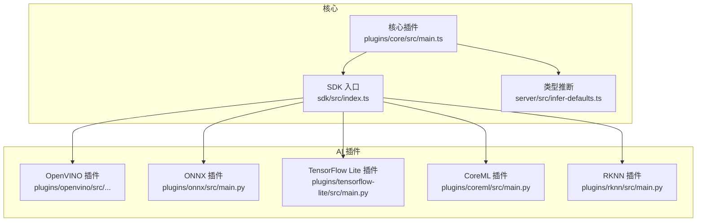
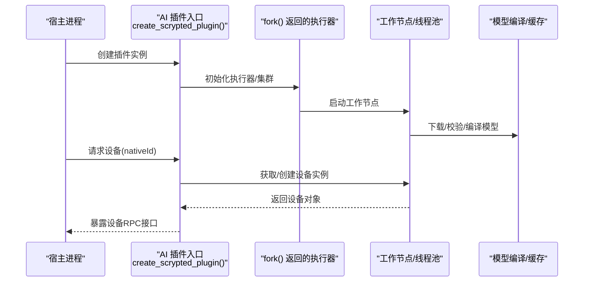
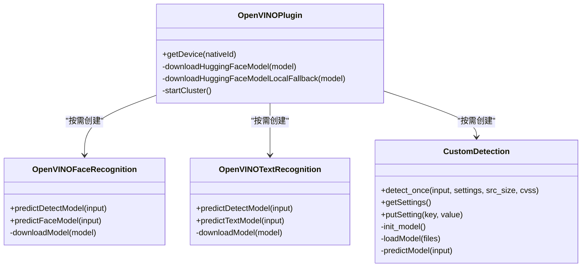
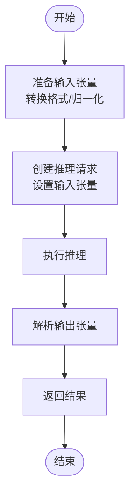
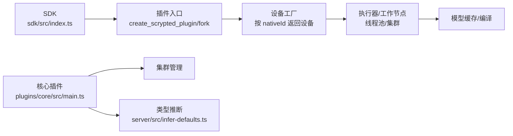

# AI 插件架构

<cite>
**本文引用的文件**
- [plugins/core/src/main.ts](file://plugins/core/src/main.ts)
- [sdk/src/index.ts](file://sdk/src/index.ts)
- [plugins/openvino/src/ov/__init__.py](file://plugins/openvino/src/ov/__init__.py)
- [plugins/openvino/src/ov/face_recognition.py](file://plugins/openvino/src/ov/face_recognition.py)
- [plugins/openvino/src/ov/text_recognition.py](file://plugins/openvino/src/ov/text_recognition.py)
- [plugins/openvino/src/predict/custom_detect.py](file://plugins/openvino/src/predict/custom_detect.py)
- [plugins/openvino/src/predict/__init__.py](file://plugins/openvino/src/predict/__init__.py)
- [plugins/onnx/src/main.py](file://plugins/onnx/src/main.py)
- [plugins/tensorflow-lite/src/main.py](file://plugins/tensorflow-lite/src/main.py)
- [plugins/coreml/src/main.py](file://plugins/coreml/src/main.py)
- [plugins/rknn/src/main.py](file://plugins/rknn/src/main.py)
- [server/src/infer-defaults.ts](file://server/src/infer-defaults.ts)
</cite>

## 目录
1. [引言](#引言)
2. [项目结构](#项目结构)
3. [核心组件](#核心组件)
4. [架构总览](#架构总览)
5. [组件详解](#组件详解)
6. [依赖关系分析](#依赖关系分析)
7. [性能考量](#性能考量)
8. [故障排查指南](#故障排查指南)
9. [结论](#结论)
10. [附录：开发指南与最佳实践](#附录开发指南与最佳实践)

## 引言
本文件系统化梳理 Scrypted 的 AI 插件架构，围绕插件生命周期、模型加载与初始化、推理会话管理、资源分配与回收进行深入解析；同时给出接口规范（模型定义、输入输出格式、配置参数、性能指标）、插件间通信机制（RPC 调用、数据传输、状态同步）、扩展性设计（多框架支持、硬件加速适配、模型优化策略），并提供开发指南与最佳实践，帮助开发者快速构建稳定高效的自定义 AI 插件。

## 项目结构
Scrypted 将 AI 插件以“框架/推理后端”为维度组织在 plugins 目录下，典型包括 OpenVINO、ONNX Runtime、TensorFlow Lite、CoreML、RKNN 等。每个插件通常包含：
- Python 入口与 fork 接口，用于在宿主进程中创建插件实例并启动推理线程池或集群工作节点
- 预测与设备抽象层，封装模型下载、编译、推理执行、结果解析
- 设备工厂与设备获取逻辑，按 nativeId 返回具体任务设备（如人脸检测、文本识别、自定义目标检测等）

图表来源
- [plugins/core/src/main.ts:1-414](file://plugins/core/src/main.ts#L1-L414)
- [sdk/src/index.ts:1-297](file://sdk/src/index.ts#L1-L297)
- [server/src/infer-defaults.ts:39-69](file://server/src/infer-defaults.ts#L39-L69)

章节来源
- [plugins/core/src/main.ts:1-414](file://plugins/core/src/main.ts#L1-L414)
- [sdk/src/index.ts:1-297](file://sdk/src/index.ts#L1-L297)
- [server/src/infer-defaults.ts:39-69](file://server/src/infer-defaults.ts#L39-L69)

## 核心组件
- SDK 基类与设备状态访问
  - 提供设备基类、存储、日志、媒体对象创建、事件分发等能力
  - 通过懒加载访问设备状态，统一事件接口
- 核心插件（Core）
  - 注册系统内部服务设备（集群、脚本、终端、REPL、控制台、自动化、聚合、用户等）
  - 维护本地地址、发布渠道、工作节点更新与镜像拉取
- 类型推断与设备发现
  - 基于接口集合推断设备类型与显示名称，支持默认名称回退

章节来源
- [sdk/src/index.ts:10-71](file://sdk/src/index.ts#L10-L71)
- [sdk/src/index.ts:169-204](file://sdk/src/index.ts#L169-L204)
- [plugins/core/src/main.ts:27-394](file://plugins/core/src/main.ts#L27-L394)
- [server/src/infer-defaults.ts:39-69](file://server/src/infer-defaults.ts#L39-L69)

## 架构总览
AI 插件采用“插件进程 + 推理执行器/工作节点”的双层架构：
- 插件进程负责设备发现、设置、RPC 对象暴露、集群工作节点管理
- 推理执行器/工作节点负责模型加载、编译、批处理队列、异步推理与结果返回
- 插件与推理层通过 SDK 的 RPC/代理机制通信，确保跨进程调用透明

图表来源
- [plugins/onnx/src/main.py:1-9](file://plugins/onnx/src/main.py#L1-L9)
- [plugins/tensorflow-lite/src/main.py:1-9](file://plugins/tensorflow-lite/src/main.py#L1-L9)
- [plugins/coreml/src/main.py:1-9](file://plugins/coreml/src/main.py#L1-L9)
- [plugins/openvino/src/predict/__init__.py:80-494](file://plugins/openvino/src/predict/__init__.py#L80-L494)

## 组件详解

### OpenVINO 插件族
OpenVINO 插件提供多种预置任务设备，并支持自定义检测模型。其关键点包括：
- 设备工厂与按需实例化
  - 根据 nativeId 返回人脸/文本/分割/CLIP 嵌入等专用设备，或动态创建自定义检测设备
- 模型下载与编译
  - 优先在线从 Hugging Face Hub 下载模型，失败时回退到本地缓存
  - 自动选择设备模式（AUTO/NPU/GPU 等），并根据模型特性进行 reshape
- 异步推理执行
  - 使用线程池执行器将推理过程移出主线程，避免阻塞
- 自定义检测模型
  - 支持从配置中读取标签、输入尺寸、权重文件列表
  - 支持 YOLO/ResNet 等不同模型类型的解析与阈值过滤

图表来源
- [plugins/openvino/src/ov/__init__.py:358-377](file://plugins/openvino/src/ov/__init__.py#L358-L377)
- [plugins/openvino/src/ov/face_recognition.py:19-69](file://plugins/openvino/src/ov/face_recognition.py#L19-L69)
- [plugins/openvino/src/ov/text_recognition.py:18-63](file://plugins/openvino/src/ov/text_recognition.py#L18-L63)
- [plugins/openvino/src/predict/custom_detect.py:25-130](file://plugins/openvino/src/predict/custom_detect.py#L25-L130)

章节来源
- [plugins/openvino/src/ov/__init__.py:109-140](file://plugins/openvino/src/ov/__init__.py#L109-L140)
- [plugins/openvino/src/ov/__init__.py:358-377](file://plugins/openvino/src/ov/__init__.py#L358-L377)
- [plugins/openvino/src/ov/face_recognition.py:35-69](file://plugins/openvino/src/ov/face_recognition.py#L35-L69)
- [plugins/openvino/src/ov/text_recognition.py:35-63](file://plugins/openvino/src/ov/text_recognition.py#L35-L63)
- [plugins/openvino/src/predict/custom_detect.py:32-106](file://plugins/openvino/src/predict/custom_detect.py#L32-L106)
- [plugins/openvino/src/predict/__init__.py:80-494](file://plugins/openvino/src/predict/__init__.py#L80-L494)

### ONNX Runtime 插件
- 入口函数负责创建插件实例并导出 fork 接口，以便在工作节点中复用预测逻辑
- 与 OpenVINO 插件类似，遵循“插件进程 + 执行器/工作节点”的模式

章节来源
- [plugins/onnx/src/main.py:1-9](file://plugins/onnx/src/main.py#L1-L9)

### TensorFlow Lite 插件
- 入口函数负责创建插件实例并导出 fork 接口，便于在工作节点中运行推理

章节来源
- [plugins/tensorflow-lite/src/main.py:1-9](file://plugins/tensorflow-lite/src/main.py#L1-L9)

### CoreML 插件
- 入口函数负责创建插件实例并导出 fork 接口，支持在 macOS/iOS 平台上的 CoreML 推理

章节来源
- [plugins/coreml/src/main.py:1-9](file://plugins/coreml/src/main.py#L1-L9)

### RKNN 插件
- 入口函数负责创建插件实例，适用于 RKNN 推理后端

章节来源
- [plugins/rknn/src/main.py:1-5](file://plugins/rknn/src/main.py#L1-L5)

### 推理流程（OpenVINO 文本识别）

图表来源
- [plugins/openvino/src/ov/text_recognition.py:35-62](file://plugins/openvino/src/ov/text_recognition.py#L35-L62)

## 依赖关系分析
- 插件入口与 SDK
  - 各插件通过入口函数导出 create_scrypted_plugin 与 fork，SDK 在运行时注入 RPC/代理上下文
- 设备发现与类型推断
  - 核心插件注册系统设备并维护本地地址；类型推断根据接口集合确定设备类型与显示名
- 集群与工作节点
  - 插件可启动 fork 工作节点，或加入集群标签，按标签调度工作负载

图表来源
- [sdk/src/index.ts:206-297](file://sdk/src/index.ts#L206-L297)
- [plugins/core/src/main.ts:282-394](file://plugins/core/src/main.ts#L282-L394)
- [server/src/infer-defaults.ts:39-69](file://server/src/infer-defaults.ts#L39-L69)

章节来源
- [sdk/src/index.ts:206-297](file://sdk/src/index.ts#L206-L297)
- [plugins/core/src/main.ts:282-394](file://plugins/core/src/main.ts#L282-L394)
- [server/src/infer-defaults.ts:39-69](file://server/src/infer-defaults.ts#L39-L69)

## 性能考量
- 异步与线程池
  - 推理调用通过线程池执行器异步化，避免阻塞事件循环
- 模型缓存与回退
  - 优先在线下载，失败时回退本地缓存，减少重复下载开销
- 设备模式选择
  - 根据可用设备自动选择最优模式（AUTO/NPU/GPU），必要时对模型进行 reshape 以适配硬件
- 批处理与队列
  - 执行器内部维护批处理队列，降低频繁创建销毁的开销

章节来源
- [plugins/openvino/src/predict/__init__.py:80-117](file://plugins/openvino/src/predict/__init__.py#L80-L117)
- [plugins/openvino/src/ov/__init__.py:109-140](file://plugins/openvino/src/ov/__init__.py#L109-L140)
- [plugins/openvino/src/ov/text_recognition.py:18-33](file://plugins/openvino/src/ov/text_recognition.py#L18-L33)

## 故障排查指南
- 模型下载失败
  - 现象：无法从 Hugging Face Hub 下载模型
  - 处理：检查网络与防火墙；插件会自动回退到本地缓存；确认缓存路径与权限
- 设备模式不兼容
  - 现象：NPU/GPU 模式导致崩溃或异常
  - 处理：切换到 AUTO 或其他兼容模式；对特定模型进行 reshape 适配
- 推理阻塞或卡顿
  - 现象：主线程被阻塞
  - 处理：确认推理调用是否通过线程池执行器；检查批处理队列是否过长
- 设置未生效
  - 现象：修改设置后未触发设备事件
  - 处理：确保在 putSetting 中触发设备事件通知

章节来源
- [plugins/openvino/src/predict/__init__.py:104-117](file://plugins/openvino/src/predict/__init__.py#L104-L117)
- [plugins/openvino/src/ov/text_recognition.py:23-33](file://plugins/openvino/src/ov/text_recognition.py#L23-L33)
- [plugins/openvino/src/predict/custom_detect.py:123-129](file://plugins/openvino/src/predict/custom_detect.py#L123-L129)

## 结论
Scrypted 的 AI 插件架构以 SDK 为核心，结合插件进程与推理执行器/工作节点，实现了跨框架、跨硬件的统一推理抽象。通过设备工厂、类型推断、集群与缓存策略，既保证了易用性，也兼顾了性能与可扩展性。开发者可基于现有插件模板快速扩展新框架与新任务。

## 附录：开发指南与最佳实践

### 插件生命周期管理
- 插件入口
  - 导出 create_scrypted_plugin 与 fork，确保在宿主进程与工作节点中均可正确初始化
- 设备发现
  - 在 getDevice 中按 nativeId 返回设备实例，支持延迟创建与缓存
- 设置与事件
  - 通过 Settings 接口暴露配置项；在 putSetting 中触发设备事件以刷新状态

章节来源
- [plugins/onnx/src/main.py:1-9](file://plugins/onnx/src/main.py#L1-L9)
- [plugins/tensorflow-lite/src/main.py:1-9](file://plugins/tensorflow-lite/src/main.py#L1-L9)
- [plugins/coreml/src/main.py:1-9](file://plugins/coreml/src/main.py#L1-L9)
- [plugins/openvino/src/predict/custom_detect.py:111-129](file://plugins/openvino/src/predict/custom_detect.py#L111-L129)

### 模型加载与初始化
- 模型来源
  - 优先使用 Hugging Face Hub 远程仓库，失败时回退本地缓存
- 编译与适配
  - 根据设备模式选择编译目标；对模型进行 reshape 以适配硬件
- 输入规格
  - 明确输入尺寸、通道数与像素格式（如 rgb），并在推理前完成数据预处理

章节来源
- [plugins/openvino/src/predict/__init__.py:91-117](file://plugins/openvino/src/predict/__init__.py#L91-L117)
- [plugins/openvino/src/ov/face_recognition.py:23-35](file://plugins/openvino/src/ov/face_recognition.py#L23-L35)
- [plugins/openvino/src/ov/text_recognition.py:19-33](file://plugins/openvino/src/ov/text_recognition.py#L19-L33)
- [plugins/openvino/src/predict/custom_detect.py:63-71](file://plugins/openvino/src/predict/custom_detect.py#L63-L71)

### 推理会话管理
- 异步执行
  - 使用线程池执行器将推理调用移出主线程，避免阻塞
- 批处理
  - 维护批处理队列，合并多次调用以提升吞吐
- 结果解析
  - 根据模型类型（YOLO/ResNet 等）解析输出并生成标准检测结果

章节来源
- [plugins/openvino/src/ov/text_recognition.py:35-62](file://plugins/openvino/src/ov/text_recognition.py#L35-L62)
- [plugins/openvino/src/predict/custom_detect.py:73-106](file://plugins/openvino/src/predict/custom_detect.py#L73-L106)

### 资源分配与回收
- 模型缓存
  - 缓存已下载与编译的模型，避免重复 IO 与编译
- 工作节点管理
  - 启动 fork 工作节点，按需终止以回收资源
- 存储与设置
  - 使用设备存储保存配置与排除类别等参数

章节来源
- [plugins/openvino/src/predict/__init__.py:80-117](file://plugins/openvino/src/predict/__init__.py#L80-L117)
- [plugins/openvino/src/predict/custom_detect.py:123-129](file://plugins/openvino/src/predict/custom_detect.py#L123-L129)

### 接口规范
- 模型定义
  - 通过配置文件声明输入形状、标签映射、权重文件列表
- 输入输出格式
  - 输入：图像/张量，预处理后符合模型期望
  - 输出：标准化检测结果（含类别、置信度、边界框等）
- 配置参数
  - 支持动态设置（如排除类别）并通过设备事件刷新
- 性能指标
  - 建议记录推理耗时、批大小、缓存命中率等指标

章节来源
- [plugins/openvino/src/predict/custom_detect.py:38-106](file://plugins/openvino/src/predict/custom_detect.py#L38-L106)

### 插件间通信机制
- RPC 调用
  - SDK 通过 RPC/代理机制暴露设备接口，插件进程与工作节点之间透明通信
- 数据传输
  - 通过媒体对象与二进制数据传输，确保大对象高效传递
- 状态同步
  - 通过设备事件与设置变更触发状态同步

章节来源
- [sdk/src/index.ts:68-71](file://sdk/src/index.ts#L68-L71)
- [sdk/src/index.ts:151-153](file://sdk/src/index.ts#L151-L153)

### 扩展性设计
- 多框架支持
  - 通过统一的预测基类与设备抽象，接入不同推理后端（ONNX/TFLite/CoreML/RKNN/OpenVINO）
- 硬件加速适配
  - 自动探测设备并选择最优模式；必要时对模型进行 reshape
- 模型优化策略
  - 使用量化模型（如 INT8）、批处理、缓存与回退策略

章节来源
- [plugins/openvino/src/ov/__init__.py:109-140](file://plugins/openvino/src/ov/__init__.py#L109-L140)
- [plugins/openvino/src/ov/face_recognition.py:23-35](file://plugins/openvino/src/ov/face_recognition.py#L23-L35)

### 开发示例与最佳实践
- 参考路径
  - 插件入口与 fork：[plugins/onnx/src/main.py:1-9](file://plugins/onnx/src/main.py#L1-L9)
  - 设备工厂与设备获取：[plugins/openvino/src/ov/__init__.py:358-377](file://plugins/openvino/src/ov/__init__.py#L358-L377)
  - 自定义检测模型：[plugins/openvino/src/predict/custom_detect.py:25-130](file://plugins/openvino/src/predict/custom_detect.py#L25-L130)
  - 文本识别推理：[plugins/openvino/src/ov/text_recognition.py:35-62](file://plugins/openvino/src/ov/text_recognition.py#L35-L62)
  - 人脸识别推理：[plugins/openvino/src/ov/face_recognition.py:37-69](file://plugins/openvino/src/ov/face_recognition.py#L37-L69)
  - 执行器与集群：[plugins/openvino/src/predict/__init__.py:80-494](file://plugins/openvino/src/predict/__init__.py#L80-L494)
  - SDK 基类与设备状态：[sdk/src/index.ts:10-71](file://sdk/src/index.ts#L10-L71)
  - 类型推断：[server/src/infer-defaults.ts:39-69](file://server/src/infer-defaults.ts#L39-69)