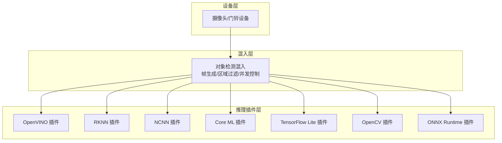
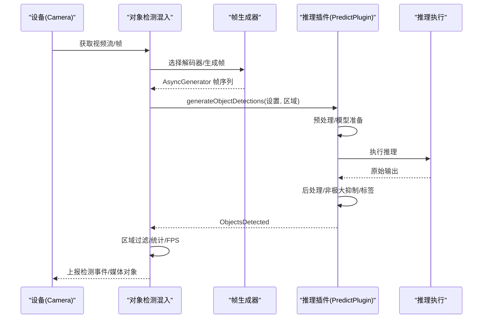
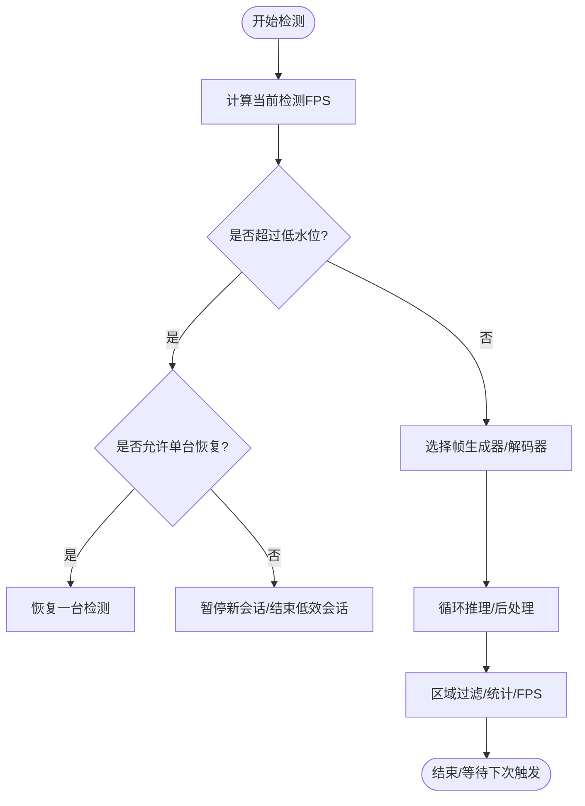
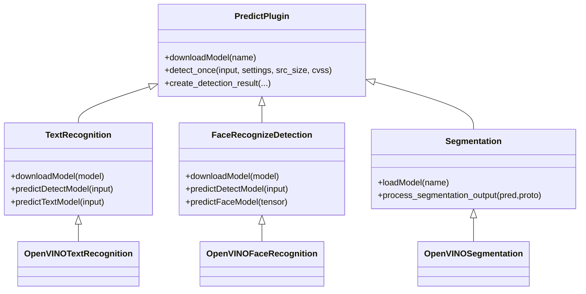
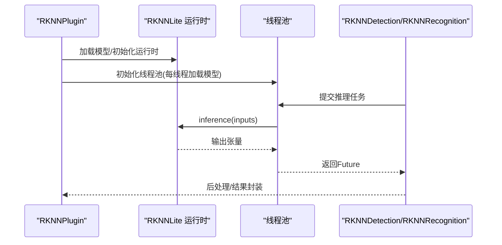
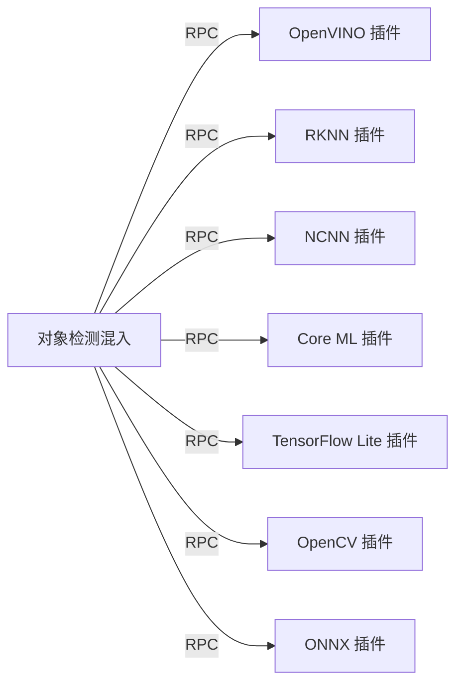

# 人工智能与机器学习

<cite>
**本文引用的文件**
- [plugins/objectdetector/src/main.ts](file://plugins/objectdetector/src/main.ts)
- [plugins/openvino/src/predict/text_recognize.py](file://plugins/openvino/src/predict/text_recognize.py)
- [plugins/openvino/src/predict/face_recognize.py](file://plugins/openvino/src/predict/face_recognize.py)
- [plugins/openvino/src/predict/segment.py](file://plugins/openvino/src/predict/segment.py)
- [plugins/openvino/src/ov/text_recognition.py](file://plugins/openvino/src/ov/text_recognition.py)
- [plugins/openvino/src/ov/face_recognition.py](file://plugins/openvino/src/ov/face_recognition.py)
- [plugins/openvino/src/ov/__init__.py](file://plugins/openvino/src/ov/__init__.py)
- [plugins/openvino/src/common/async_infer.py](file://plugins/openvino/src/common/async_infer.py)
- [plugins/rknn/src/rknn/plugin.py](file://plugins/rknn/src/rknn/plugin.py)
- [plugins/rknn/src/rknn/text_recognition.py](file://plugins/rknn/src/rknn/text_recognition.py)
- [plugins/ncnn/src/nc/text_recognition.py](file://plugins/ncnn/src/nc/text_recognition.py)
- [plugins/coreml/src/coreml/segment.py](file://plugins/coreml/src/coreml/segment.py)
- [plugins/tensorflow-lite/src/main.py](file://plugins/tensorflow-lite/src/main.py)
- [plugins/opencv/src/main.py](file://plugins/opencv/src/main.py)
- [plugins/coreml/src/main.py](file://plugins/coreml/src/main.py)
- [plugins/onnx/src/main.py](file://plugins/onnx/src/main.py)
- [plugins/snapshot/src/ffmpeg-image-filter.ts](file://plugins/snapshot/src/ffmpeg-image-filter.ts)
- [plugins/objectdetector/src/ffmpeg-videoframes.ts](file://plugins/objectdetector/src/ffmpeg-videoframes.ts)
- [sdk/src/promise-debounce.ts](file://sdk/src/promise-debounce.ts)
- [server/src/promise-utils.ts](file://server/src/promise-utils.ts)
</cite>

## 目录
1. [引言](#引言)
2. [项目结构](#项目结构)
3. [核心组件](#核心组件)
4. [架构总览](#架构总览)
5. [详细组件分析](#详细组件分析)
6. [依赖分析](#依赖分析)
7. [性能考虑](#性能考虑)
8. [故障排查指南](#故障排查指南)
9. [结论](#结论)
10. [附录](#附录)

## 引言
本文件面向 Scrypted 的 AI 与机器学习能力，系统化梳理其插件化 AI 架构、模型管理、推理优化与性能监控机制，并结合实际插件（OpenVINO、RKNN、NCNN、Core ML、TensorFlow Lite、OpenCV、ONNX）展示计算机视觉功能（目标检测、人脸识别、文本识别、图像分割）的实现路径与集成方式。文档同时覆盖多框架支持、模型优化（量化、剪枝、蒸馏）思路、硬件加速（GPU/NPU/DSP）策略、实时推理优化（批处理、缓存、并发控制），并提供配置参数、调优建议、错误处理与监控机制说明。

## 项目结构
Scrypted 将 AI 能力以“插件”形式组织，每个 AI 框架对应一个独立插件目录，统一通过对象检测混入层接入到摄像头设备，形成“设备-混入-推理引擎”的分层结构。核心对象检测混入负责帧采集、区域过滤、并发调度与统计上报；各推理插件负责具体模型加载、预处理、推理与后处理。

图表来源
- [plugins/objectdetector/src/main.ts:990-1351](file://plugins/objectdetector/src/main.ts#L990-L1351)
- [plugins/openvino/src/ov/__init__.py:300-377](file://plugins/openvino/src/ov/__init__.py#L300-L377)
- [plugins/rknn/src/rknn/plugin.py:61-103](file://plugins/rknn/src/rknn/plugin.py#L61-L103)
- [plugins/ncnn/src/nc/text_recognition.py:1-49](file://plugins/ncnn/src/nc/text_recognition.py#L1-L49)
- [plugins/coreml/src/coreml/segment.py:1-48](file://plugins/coreml/src/coreml/segment.py#L1-L48)
- [plugins/tensorflow-lite/src/main.py:1-9](file://plugins/tensorflow-lite/src/main.py#L1-L9)
- [plugins/opencv/src/main.py:1-5](file://plugins/opencv/src/main.py#L1-L5)
- [plugins/onnx/src/main.py:1-9](file://plugins/onnx/src/main.py#L1-L9)

章节来源
- [plugins/objectdetector/src/main.ts:990-1351](file://plugins/objectdetector/src/main.ts#L990-L1351)

## 核心组件
- 对象检测混入（ObjectDetectionMixin/Plugin）
  - 负责从摄像头获取视频流或帧生成器输出，按区域与类别过滤检测结果，维护并发与性能水位线，记录检测统计与 FPS。
  - 提供设置项：内置运动传感器补充模式、后运动分析时长、运动持续时间、解码器选择、区域编辑等。
- 推理插件基类与设备发现
  - 各框架插件通过设备发现注册“内置设备”（如人脸/文本/分割/自定义检测），并在需要时按需初始化模型与运行时。
- 预测抽象（PredictPlugin）
  - 统一输入尺寸、格式、阈值、标签映射与检测结果封装，便于上层混入复用。

章节来源
- [plugins/objectdetector/src/main.ts:50-120](file://plugins/objectdetector/src/main.ts#L50-L120)
- [plugins/objectdetector/src/main.ts:1088-1124](file://plugins/objectdetector/src/main.ts#L1088-L1124)
- [plugins/openvino/src/predict/text_recognize.py:25-50](file://plugins/openvino/src/predict/text_recognize.py#L25-L50)
- [plugins/openvino/src/predict/face_recognize.py:25-56](file://plugins/openvino/src/predict/face_recognize.py#L25-L56)
- [plugins/openvino/src/predict/segment.py:17-48](file://plugins/openvino/src/predict/segment.py#L17-L48)

## 架构总览
下图展示了从设备到推理插件的整体调用链路与关键职责划分：

图表来源
- [plugins/objectdetector/src/main.ts:345-537](file://plugins/objectdetector/src/main.ts#L345-L537)
- [plugins/openvino/src/predict/text_recognize.py:50-114](file://plugins/openvino/src/predict/text_recognize.py#L50-L114)
- [plugins/openvino/src/predict/face_recognize.py:58-102](file://plugins/openvino/src/predict/face_recognize.py#L58-L102)
- [plugins/openvino/src/predict/segment.py:36-48](file://plugins/openvino/src/predict/segment.py#L36-L48)

## 详细组件分析

### 对象检测混入与性能监控
- 并发与水位控制
  - 通过低帧率水位（低水位/杀掉水位）与最小并发阈值动态启停检测会话，避免系统过载。
  - 在恢复期允许逐步启动，限制同时启动的相机数量。
- 帧生成与延迟
  - 支持多种帧生成器（WebAssembly/FFmpeg/GStreamer/LibAV），可按设备选择或默认策略。
  - 可对运动型检测降低帧率，减少推理压力。
- 统计与日志
  - 记录并发会话数、每秒检测数（DPS）、会话时长，定期清理旧统计。
- 区域与类别过滤
  - 多边形区域支持包含/相交两种模式，支持排除/观察模式，支持按类别过滤。

图表来源
- [plugins/objectdetector/src/main.ts:1088-1124](file://plugins/objectdetector/src/main.ts#L1088-L1124)
- [plugins/objectdetector/src/main.ts:1143-1173](file://plugins/objectdetector/src/main.ts#L1143-L1173)
- [plugins/objectdetector/src/main.ts:545-553](file://plugins/objectdetector/src/main.ts#L545-L553)

章节来源
- [plugins/objectdetector/src/main.ts:25-35](file://plugins/objectdetector/src/main.ts#L25-L35)
- [plugins/objectdetector/src/main.ts:1088-1124](file://plugins/objectdetector/src/main.ts#L1088-L1124)
- [plugins/objectdetector/src/main.ts:1143-1173](file://plugins/objectdetector/src/main.ts#L1143-L1173)
- [plugins/objectdetector/src/main.ts:545-553](file://plugins/objectdetector/src/main.ts#L545-L553)

### OpenVINO 插件族
- 设备发现与内置设备
  - 注册人脸/文本/CLIP嵌入/分割等内置设备，按需实例化。
- 文本识别
  - 使用 CRAFT 检测 + VGG/CTC 文本识别，支持 GPU/NPU 形态下的模型 reshape 差异。
- 人脸识别
  - YOLOv9 人脸检测 + Inception ResNet 人脸嵌入，支持余弦相似度比较（注释中保留思路）。
- 分割
  - YOLOv9 分割模型，后处理生成掩码轮廓并转换为多边形 clipPaths。
- 异步推理
  - 为不同任务创建独立线程池，分离准备与预测阶段，降低阻塞。

图表来源
- [plugins/openvino/src/predict/text_recognize.py:25-50](file://plugins/openvino/src/predict/text_recognize.py#L25-L50)
- [plugins/openvino/src/predict/face_recognize.py:25-56](file://plugins/openvino/src/predict/face_recognize.py#L25-L56)
- [plugins/openvino/src/predict/segment.py:17-48](file://plugins/openvino/src/predict/segment.py#L17-L48)
- [plugins/openvino/src/ov/text_recognition.py:18-62](file://plugins/openvino/src/ov/text_recognition.py#L18-L62)
- [plugins/openvino/src/ov/face_recognition.py:19-35](file://plugins/openvino/src/ov/face_recognition.py#L19-L35)
- [plugins/openvino/src/ov/__init__.py:358-377](file://plugins/openvino/src/ov/__init__.py#L358-L377)

章节来源
- [plugins/openvino/src/ov/__init__.py:300-377](file://plugins/openvino/src/ov/__init__.py#L300-L377)
- [plugins/openvino/src/ov/text_recognition.py:18-62](file://plugins/openvino/src/ov/text_recognition.py#L18-L62)
- [plugins/openvino/src/ov/face_recognition.py:19-35](file://plugins/openvino/src/ov/face_recognition.py#L19-L35)
- [plugins/openvino/src/predict/segment.py:50-93](file://plugins/openvino/src/predict/segment.py#L50-L93)
- [plugins/openvino/src/common/async_infer.py:1-7](file://plugins/openvino/src/common/async_infer.py#L1-L7)

### RKNN 插件族
- 设备兼容性与模型加载
  - 仅 Linux 平台，自动探测 SoC（rk3562/66/68/76/88），按 CPU 架构下载对应模型库与运行时。
  - 通过线程池为每个工作线程初始化 RKNNLite 运行时，避免跨线程共享状态问题。
- 文本识别
  - 检测采用 DBNet（DBPostProcess/ DetPostProcess），识别采用 CTCLabelDecode，支持预/后处理链式配置。
  - 提供异步推理接口，返回 Future，主线程聚合结果。

图表来源
- [plugins/rknn/src/rknn/plugin.py:61-103](file://plugins/rknn/src/rknn/plugin.py#L61-L103)
- [plugins/rknn/src/rknn/text_recognition.py:105-140](file://plugins/rknn/src/rknn/text_recognition.py#L105-L140)

章节来源
- [plugins/rknn/src/rknn/plugin.py:37-103](file://plugins/rknn/src/rknn/plugin.py#L37-L103)
- [plugins/rknn/src/rknn/text_recognition.py:1-172](file://plugins/rknn/src/rknn/text_recognition.py#L1-L172)

### NCNN 插件族
- 文本识别
  - 使用 ncnn.Net，启用 Vulkan 计算；加载 param/bin 模型，提取指定输入名，构建推理器执行前向。
  - 针对无 batch 场景进行张量处理与内存连续化，保证推理稳定性。

章节来源
- [plugins/ncnn/src/nc/text_recognition.py:1-49](file://plugins/ncnn/src/nc/text_recognition.py#L1-L49)

### Core ML 插件族
- 分割
  - 从 Hugging Face 下载模型包，读取 .mlpackage，调用 Core ML predict 获取检测与原型掩码，再经 NMS 与掩码上采样生成多边形轮廓。

章节来源
- [plugins/coreml/src/coreml/segment.py:1-48](file://plugins/coreml/src/coreml/segment.py#L1-L48)

### TensorFlow Lite/OpenCV/ONNX 插件入口
- 插件入口统一导出 create_scrypted_plugin/fork，便于 Scrypted 插件系统加载与分叉。

章节来源
- [plugins/tensorflow-lite/src/main.py:1-9](file://plugins/tensorflow-lite/src/main.py#L1-L9)
- [plugins/opencv/src/main.py:1-5](file://plugins/opencv/src/main.py#L1-L5)
- [plugins/coreml/src/main.py:1-9](file://plugins/coreml/src/main.py#L1-L9)
- [plugins/onnx/src/main.py:1-9](file://plugins/onnx/src/main.py#L1-L9)

### 计算机视觉功能实现要点
- 目标检测
  - OpenVINO/NCNN/Core ML 均提供统一的 PredictPlugin 抽象，混入层按设置与区域过滤后统一上报。
- 人脸识别
  - OpenVINO 使用 YOLOv9 检测 + Inception ResNet 嵌入，支持余弦相似度比较流程（注释保留）。
- 文本识别
  - OpenVINO 使用 CRAFT 检测 + VGG/CTC 文本识别；RKNN 使用 DBNet 检测 + CTC 识别。
- 图像分割
  - OpenVINO 使用 YOLOv9 分割，生成掩码并转为多边形轮廓；Core ML 同样支持分割输出。

章节来源
- [plugins/openvino/src/predict/face_recognize.py:58-102](file://plugins/openvino/src/predict/face_recognize.py#L58-L102)
- [plugins/openvino/src/predict/text_recognize.py:50-114](file://plugins/openvino/src/predict/text_recognize.py#L50-L114)
- [plugins/openvino/src/predict/segment.py:50-93](file://plugins/openvino/src/predict/segment.py#L50-L93)
- [plugins/rknn/src/rknn/text_recognition.py:125-140](file://plugins/rknn/src/rknn/text_recognition.py#L125-L140)
- [plugins/coreml/src/coreml/segment.py:27-48](file://plugins/coreml/src/coreml/segment.py#L27-L48)

## 依赖分析
- 混入层对推理插件的依赖
  - 通过 Scrypted RPC 对象连接到具体推理插件，调用 generateObjectDetections 并接收 ObjectsDetected。
- 框架特定依赖
  - OpenVINO：openvino、numpy、PIL
  - RKNN：rknnlite、numpy、PIL
  - NCNN：ncnn、numpy
  - Core ML：coremltools、numpy
  - TensorFlow Lite/OpenCV/ONNX：各自 Python 依赖由 requirements.txt 管理

图表来源
- [plugins/objectdetector/src/main.ts:438-452](file://plugins/objectdetector/src/main.ts#L438-L452)

章节来源
- [plugins/objectdetector/src/main.ts:438-452](file://plugins/objectdetector/src/main.ts#L438-L452)

## 性能考虑
- 实时推理优化
  - 帧生成器选择：优先使用内置解码器或更高效的帧生成器，必要时降低帧率。
  - 并发控制：基于 FPS 水位动态启停检测，避免系统过载；在恢复期限制并发数量。
  - 异步推理：为不同任务分配独立线程池，分离准备与预测阶段，减少阻塞。
- 缓存与去抖
  - 使用缓存去抖工具对重复请求进行合并，减少模型加载与网络拉取开销。
- 截图与滤镜
  - 检测到目标时生成 JPEG 媒体对象，可叠加模糊/文字等滤镜，满足告警与可视化需求。

章节来源
- [plugins/objectdetector/src/main.ts:345-386](file://plugins/objectdetector/src/main.ts#L345-L386)
- [plugins/objectdetector/src/main.ts:1088-1124](file://plugins/objectdetector/src/main.ts#L1088-L1124)
- [plugins/openvino/src/common/async_infer.py:1-7](file://plugins/openvino/src/common/async_infer.py#L1-L7)
- [sdk/src/promise-debounce.ts:1-14](file://sdk/src/promise-debounce.ts#L1-L14)
- [plugins/snapshot/src/ffmpeg-image-filter.ts:82-129](file://plugins/snapshot/src/ffmpeg-image-filter.ts#L82-L129)

## 故障排查指南
- 检测卡死/无响应
  - 混入层对长时间无响应的检测会主动终止，检查设备网络、模型加载与线程池状态。
- FPS 过低
  - 检查并发数量、帧率设置、解码器选择与硬件加速配置；必要时降低检测频率或关闭高负载任务。
- 文本识别异常
  - OpenVINO 文本识别在不同设备形态（GPU/NPU）下可能需要不同的 reshape；确认模型路径与编译形态。
- RKNN 运行时初始化失败
  - 确认 librknnrt.so 是否存在或在容器场景下已正确下载；确保 Linux 平台与 SoC 兼容。
- 超时与重试
  - 使用超时工具包装异步操作，避免长时间阻塞；对重复请求使用缓存去抖。

章节来源
- [plugins/objectdetector/src/main.ts:400-406](file://plugins/objectdetector/src/main.ts#L400-L406)
- [plugins/openvino/src/ov/text_recognition.py:24-33](file://plugins/openvino/src/ov/text_recognition.py#L24-L33)
- [plugins/rknn/src/rknn/plugin.py:75-96](file://plugins/rknn/src/rknn/plugin.py#L75-L96)
- [server/src/promise-utils.ts:30-54](file://server/src/promise-utils.ts#L30-L54)
- [sdk/src/promise-debounce.ts:1-14](file://sdk/src/promise-debounce.ts#L1-L14)

## 结论
Scrypted 的 AI 架构以“混入 + 插件 + 抽象基类”为核心，既保证了多框架（OpenVINO、RKNN、NCNN、Core ML、TensorFlow Lite、OpenCV、ONNX）的统一接入，又提供了完善的性能监控与并发控制机制。通过区域过滤、异步推理与缓存去抖，系统能够在资源受限环境下稳定运行多种 CV 任务。建议在部署时结合硬件特性选择合适框架与模型，并根据场景调整帧率与并发策略。

## 附录
- 配置参数与建议
  - 内置运动传感器补充模式：Assist/Replace/Default，影响是否使用内置运动传感器作为触发条件。
  - 后运动分析时长与运动持续时间：用于在运动结束后继续分析一段时间，避免漏检。
  - 解码器选择：优先选择性能更高的帧生成器；运动型检测可适当降低帧率。
  - 区域设置：支持包含/相交、排除/观察、类别过滤，建议合理划分区域以减少误报。
- 模型优化与压缩
  - 量化：OpenVINO 模型命名中包含 int8 后缀，表明可使用整数量化；RKNN/NCNN/TF Lite 均支持量化模型。
  - 剪枝/蒸馏：可在上游训练阶段完成，推理插件按模型文件加载，无需额外改造。
- 硬件加速策略
  - OpenVINO：GPU/NPU 形态下注意模型 reshape 差异；优先使用编译后的模型。
  - RKNN：针对 SoC 自动选择模型与运行时；容器场景需确保特权模式与依赖库可用。
  - NCNN：启用 Vulkan 计算；确保驱动与库版本匹配。
- 使用示例与最佳实践
  - 示例：在对象检测混入中开启分析按钮，进行一分钟离线分析，观察控制台输出与媒体对象生成。
  - 最佳实践：先在低负载场景验证模型效果，再逐步提升并发与帧率；对高负载任务（如人脸识别/文本识别）单独评估资源占用。

章节来源
- [plugins/objectdetector/src/main.ts:818-828](file://plugins/objectdetector/src/main.ts#L818-L828)
- [plugins/objectdetector/src/main.ts:891-894](file://plugins/objectdetector/src/main.ts#L891-L894)
- [plugins/openvino/src/ov/text_recognition.py:24-33](file://plugins/openvino/src/ov/text_recognition.py#L24-L33)
- [plugins/rknn/src/rknn/plugin.py:75-96](file://plugins/rknn/src/rknn/plugin.py#L75-L96)
- [plugins/ncnn/src/nc/text_recognition.py:24-32](file://plugins/ncnn/src/nc/text_recognition.py#L24-L32)