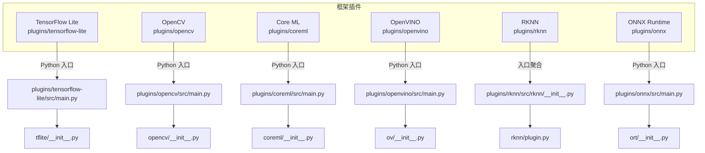
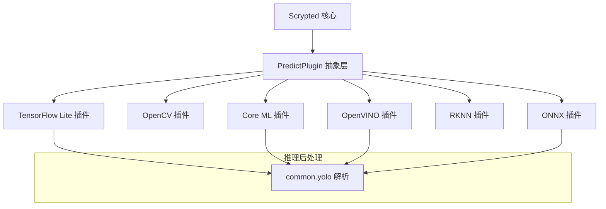
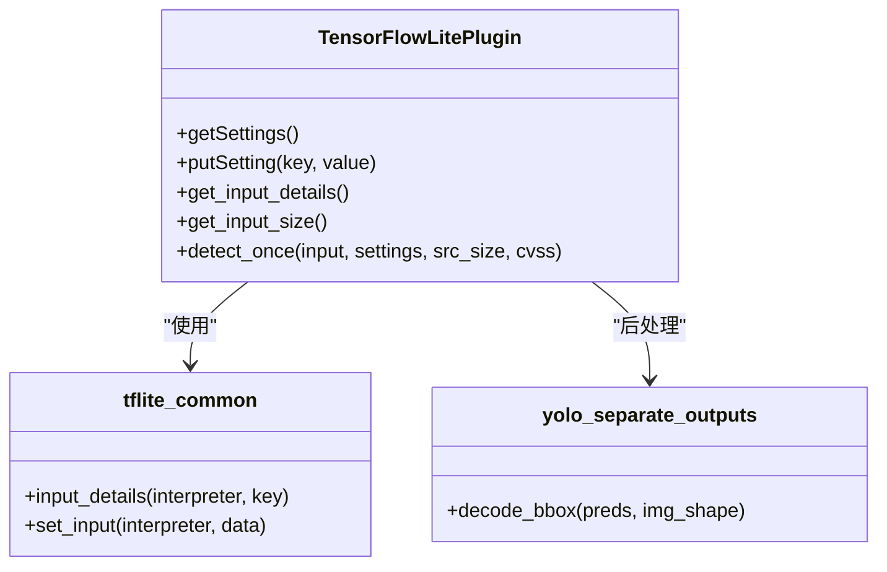
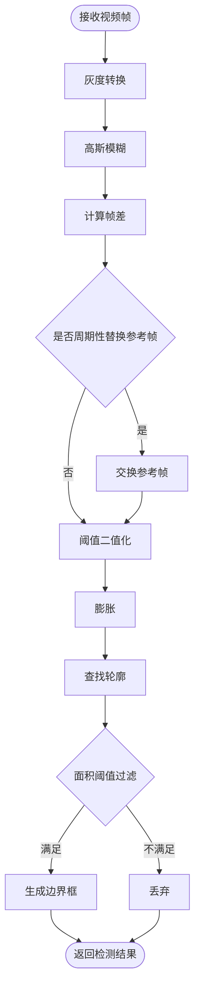
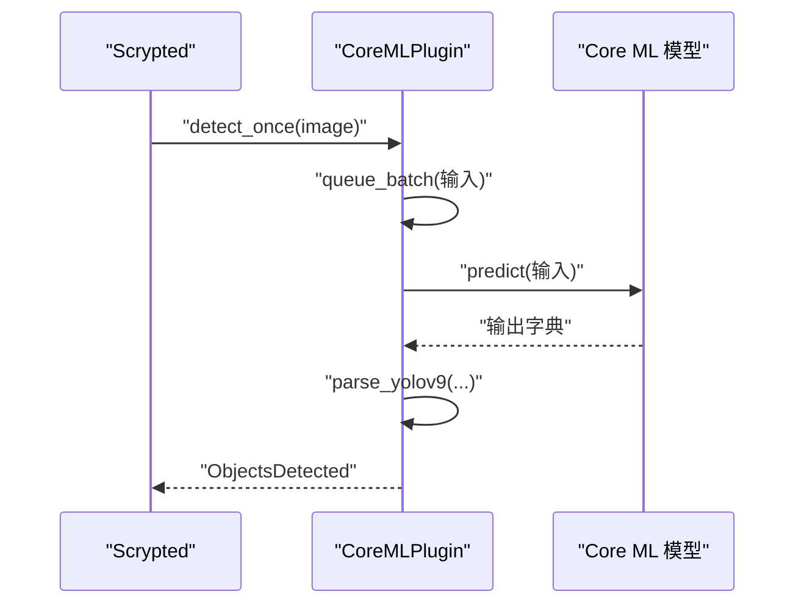
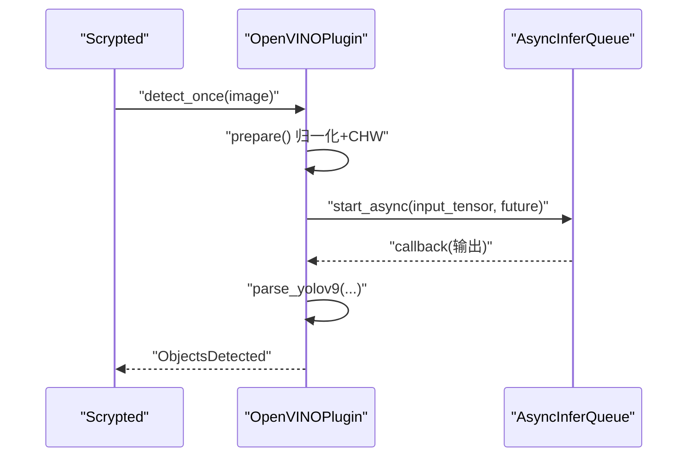
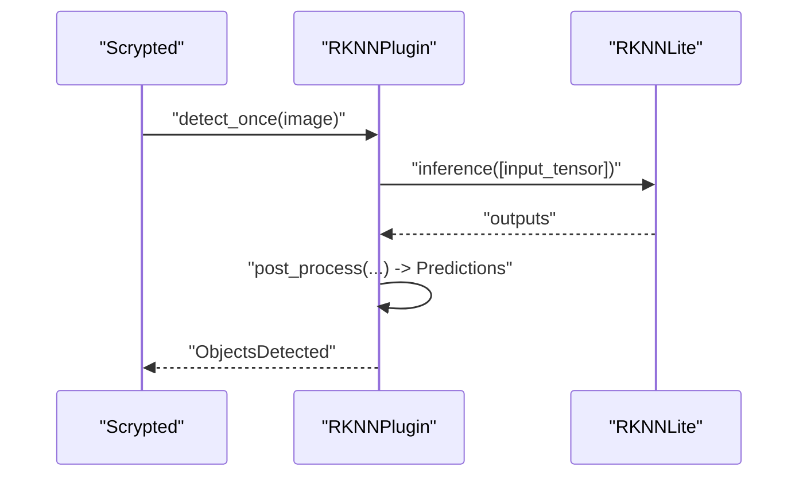
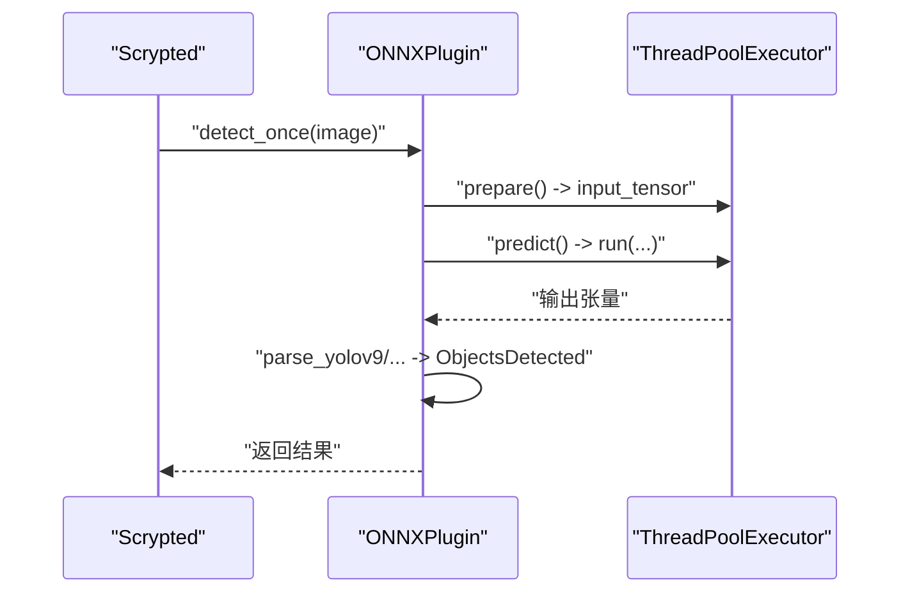
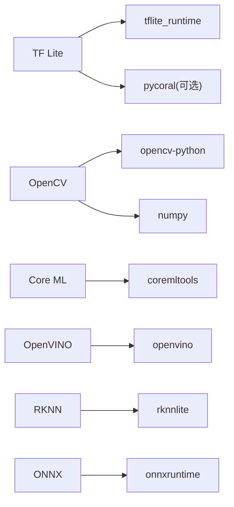

# 多框架支持

<cite>
**本文引用的文件**
- [plugins/tensorflow-lite/src/main.py](file://plugins/tensorflow-lite/src/main.py)
- [plugins/tensorflow-lite/src/tflite/__init__.py](file://plugins/tensorflow-lite/src/tflite/__init__.py)
- [plugins/tensorflow-lite/src/tflite/tflite_common.py](file://plugins/tensorflow-lite/src/tflite/tflite_common.py)
- [plugins/tensorflow-lite/src/tflite/yolo_separate_outputs.py](file://plugins/tensorflow-lite/src/tflite/yolo_separate_outputs.py)
- [plugins/opencv/src/main.py](file://plugins/opencv/src/main.py)
- [plugins/opencv/src/opencv/__init__.py](file://plugins/opencv/src/opencv/__init__.py)
- [plugins/coreml/src/main.py](file://plugins/coreml/src/main.py)
- [plugins/coreml/src/coreml/__init__.py](file://plugins/coreml/src/coreml/__init__.py)
- [plugins/openvino/src/main.py](file://plugins/openvino/src/main.py)
- [plugins/openvino/src/ov/__init__.py](file://plugins/openvino/src/ov/__init__.py)
- [plugins/rknn/src/rknn/__init__.py](file://plugins/rknn/src/rknn/__init__.py)
- [plugins/rknn/src/rknn/plugin.py](file://plugins/rknn/src/rknn/plugin.py)
- [plugins/onnx/src/main.py](file://plugins/onnx/src/main.py)
- [plugins/onnx/src/ort/__init__.py](file://plugins/onnx/src/ort/__init__.py)
</cite>

## 目录
1. [简介](#简介)
2. [项目结构](#项目结构)
3. [核心组件](#核心组件)
4. [架构总览](#架构总览)
5. [详细组件分析](#详细组件分析)
6. [依赖分析](#依赖分析)
7. [性能考虑](#性能考虑)
8. [故障排查指南](#故障排查指南)
9. [结论](#结论)
10. [附录](#附录)

## 简介
本文件系统性梳理 Scrypted 在多推理框架上的支持与集成，覆盖以下框架：
- TensorFlow Lite：模型下载、量化（整数量化）、边缘 TPU 加速、YOLO 推理后处理
- OpenCV：传统计算机视觉运动检测、图像处理与特征匹配能力
- Core ML：苹果生态优化、模型加载与人脸/文本/分割等子任务扩展
- OpenVINO：Intel 硬件优化（NPU/GPU/CPU 自动选择）、异步推理队列
- RKNN：瑞芯微芯片专用运行时、NPU 文本识别与目标检测
- ONNX：跨框架统一模型格式、执行提供者选择（CUDA/CoreML/CPU）

文档从架构、数据流、处理逻辑、配置项、性能与适用场景等方面进行深入说明，并提供框架选择与迁移建议。

## 项目结构
Scrypted 将各框架封装为独立插件目录，每个插件均通过 Python 入口导出 create_scrypted_plugin/fork 工厂方法，统一接入 Scrypted 的预测与对象检测管线。

图示来源
- [plugins/tensorflow-lite/src/main.py:1-9](file://plugins/tensorflow-lite/src/main.py#L1-L9)
- [plugins/opencv/src/main.py:1-5](file://plugins/opencv/src/main.py#L1-L5)
- [plugins/coreml/src/main.py:1-9](file://plugins/coreml/src/main.py#L1-L9)
- [plugins/openvino/src/main.py:1-9](file://plugins/openvino/src/main.py#L1-L9)
- [plugins/rknn/src/rknn/__init__.py:1-1](file://plugins/rknn/src/rknn/__init__.py#L1-L1)
- [plugins/onnx/src/main.py:1-9](file://plugins/onnx/src/main.py#L1-L9)

章节来源
- [plugins/tensorflow-lite/src/main.py:1-9](file://plugins/tensorflow-lite/src/main.py#L1-L9)
- [plugins/opencv/src/main.py:1-5](file://plugins/opencv/src/main.py#L1-L5)
- [plugins/coreml/src/main.py:1-9](file://plugins/coreml/src/main.py#L1-L9)
- [plugins/openvino/src/main.py:1-9](file://plugins/openvino/src/main.py#L1-L9)
- [plugins/rknn/src/rknn/__init__.py:1-1](file://plugins/rknn/src/rknn/__init__.py#L1-L1)
- [plugins/onnx/src/main.py:1-9](file://plugins/onnx/src/main.py#L1-L9)

## 核心组件
- 预测基类与通用工具
  - 各框架均继承 PredictPlugin，统一 detect_once/detect_batch、输入尺寸与标签解析、检测结果封装等流程
  - 通用 YOLO 解码与后处理在 common/yolo 中复用
- 输入预处理与线程池
  - 多数框架使用 ThreadPoolExecutor 将“准备输入”和“推理”解耦，避免阻塞事件循环
- 设备发现与子任务
  - Core ML/OpenVINO/ONNX 插件在初始化时动态上报人脸识别、文本识别、CLIP 嵌入、分割等子设备

章节来源
- [plugins/tensorflow-lite/src/tflite/__init__.py:33-194](file://plugins/tensorflow-lite/src/tflite/__init__.py#L33-L194)
- [plugins/opencv/src/opencv/__init__.py:20-25](file://plugins/opencv/src/opencv/__init__.py#L20-L25)
- [plugins/coreml/src/coreml/__init__.py:28-116](file://plugins/coreml/src/coreml/__init__.py#L28-L116)
- [plugins/openvino/src/ov/__init__.py:32-37](file://plugins/openvino/src/ov/__init__.py#L32-L37)
- [plugins/onnx/src/ort/__init__.py:146-155](file://plugins/onnx/src/ort/__init__.py#L146-L155)

## 架构总览
下图展示 Scrypted 对多框架的统一抽象与关键交互：

图示来源
- [plugins/tensorflow-lite/src/tflite/__init__.py:31-325](file://plugins/tensorflow-lite/src/tflite/__init__.py#L31-L325)
- [plugins/coreml/src/coreml/__init__.py:25-228](file://plugins/coreml/src/coreml/__init__.py#L25-L228)
- [plugins/openvino/src/ov/__init__.py:18-301](file://plugins/openvino/src/ov/__init__.py#L18-L301)
- [plugins/onnx/src/ort/__init__.py:22-319](file://plugins/onnx/src/ort/__init__.py#L22-L319)

## 详细组件分析

### TensorFlow Lite 框架
- 模型与硬件
  - 自动探测 Coral Edge TPU；若存在则优先加载带 _edgetpu 的整数量化模型；否则回退到 CPU tflite 解释器
  - 支持多种内置 YOLO 模型（含 scrypted 定制版），自动下载标签文件与权重
- 输入与后处理
  - 统一输入尺寸与量化参数解析；对分离输出分支（DFL/Anchor）进行解码
  - 使用线程池隔离 prepare/predict，提升并发吞吐
- 配置项
  - 检测到的 Edge TPU 设备路径、可选模型列表

图示来源
- [plugins/tensorflow-lite/src/tflite/__init__.py:71-325](file://plugins/tensorflow-lite/src/tflite/__init__.py#L71-L325)
- [plugins/tensorflow-lite/src/tflite/tflite_common.py:20-93](file://plugins/tensorflow-lite/src/tflite/tflite_common.py#L20-L93)
- [plugins/tensorflow-lite/src/tflite/yolo_separate_outputs.py:41-66](file://plugins/tensorflow-lite/src/tflite/yolo_separate_outputs.py#L41-L66)

章节来源
- [plugins/tensorflow-lite/src/tflite/__init__.py:71-325](file://plugins/tensorflow-lite/src/tflite/__init__.py#L71-L325)
- [plugins/tensorflow-lite/src/tflite/tflite_common.py:1-93](file://plugins/tensorflow-lite/src/tflite/tflite_common.py#L1-L93)
- [plugins/tensorflow-lite/src/tflite/yolo_separate_outputs.py:1-66](file://plugins/tensorflow-lite/src/tflite/yolo_separate_outputs.py#L1-L66)

### OpenCV 框架
- 功能定位
  - 提供基于传统计算机视觉的运动检测（背景差分、阈值、膨胀、轮廓提取）
  - 输入格式为灰度图，支持可调面积阈值、像素变化阈值、高斯模糊半径
- 数据流
  - 图像缓冲区转灰度，高斯去噪，背景帧轮换，二值化与膨胀，轮廓检测，矩形框映射回源分辨率

图示来源
- [plugins/opencv/src/opencv/__init__.py:112-168](file://plugins/opencv/src/opencv/__init__.py#L112-L168)

章节来源
- [plugins/opencv/src/opencv/__init__.py:43-262](file://plugins/opencv/src/opencv/__init__.py#L43-L262)

### Core ML 框架
- 模型与设备
  - 从本地缓存或 Hugging Face 下载 .mlpackage；解析用户定义标签
  - 初始化后动态上报人脸识别、文本识别、CLIP 嵌入、分割等子设备
- 执行与并发
  - 单线程预测执行器，保证 Core ML 模型顺序执行与资源稳定
- 配置项
  - 可选模型列表

图示来源
- [plugins/coreml/src/coreml/__init__.py:217-228](file://plugins/coreml/src/coreml/__init__.py#L217-L228)

章节来源
- [plugins/coreml/src/coreml/__init__.py:71-229](file://plugins/coreml/src/coreml/__init__.py#L71-L229)

### OpenVINO 框架
- 设备与模式
  - 自动枚举可用设备（NPU/GPU/CPU），优先级策略：NPU > dGPU > GPU > CPU
  - 支持显式设置模式（AUTO/CPU/GPU），失败时自动回退
- 异步推理
  - AsyncInferQueue + 回调，主线程 Future 传递检测结果
- 配置项
  - 可见设备列表、模型、执行模式

图示来源
- [plugins/openvino/src/ov/__init__.py:196-301](file://plugins/openvino/src/ov/__init__.py#L196-L301)

章节来源
- [plugins/openvino/src/ov/__init__.py:92-378](file://plugins/openvino/src/ov/__init__.py#L92-L378)

### RKNN 框架
- 平台与模型
  - 仅支持 Linux ARM64 且需 Rockchip SoC；自动下载对应 CPU 优化的 .rknn 模型
  - 运行时库 librknnrt.so：容器中自动下载，宿主需确保权限
- 推理与子任务
  - 多线程 RKNNLite 推理；提供文本识别子设备
- 配置项
  - 当前固定模型名称（YOLOv6n），输入尺寸由优化脚本定义

图示来源
- [plugins/rknn/src/rknn/plugin.py:146-168](file://plugins/rknn/src/rknn/plugin.py#L146-L168)

章节来源
- [plugins/rknn/src/rknn/plugin.py:61-169](file://plugins/rknn/src/rknn/plugin.py#L61-L169)

### ONNX 框架
- 执行提供者
  - macOS：优先 CoreMLExecutionProvider；x86_64 平台：CUDAExecutionProvider；通用：CPUExecutionProvider
  - 支持多设备 ID（多 GPU）组合
- 并发与线程绑定
  - 每线程绑定一个 InferenceSession，记录实际使用的 Provider
- 配置项
  - 模型、设备 ID 列表、当前执行设备显示

图示来源
- [plugins/onnx/src/ort/__init__.py:287-319](file://plugins/onnx/src/ort/__init__.py#L287-L319)

章节来源
- [plugins/onnx/src/ort/__init__.py:55-320](file://plugins/onnx/src/ort/__init__.py#L55-L320)

## 依赖分析
- 组件内聚与耦合
  - 各框架插件内部高度内聚，围绕 PredictPlugin 抽象进行统一的 detect_once/detect_batch、输入尺寸与标签解析
  - 与 Scrypted 的耦合点集中在 Settings/DeviceProvider 接口与设备发现上报
- 外部依赖
  - TensorFlow Lite：tflite_runtime、PIL、pycoral（可选 Edge TPU）
  - OpenCV：cv2、imutils、numpy、PIL
  - Core ML：coremltools、PIL
  - OpenVINO：openvino、numpy
  - RKNN：rknnlite、numpy
  - ONNX：onnxruntime、numpy

图示来源
- [plugins/tensorflow-lite/src/tflite/__init__.py:25-28](file://plugins/tensorflow-lite/src/tflite/__init__.py#L25-L28)
- [plugins/opencv/src/opencv/__init__.py:8-12](file://plugins/opencv/src/opencv/__init__.py#L8-L12)
- [plugins/coreml/src/coreml/__init__.py:10-13](file://plugins/coreml/src/coreml/__init__.py#L10-L13)
- [plugins/openvino/src/ov/__init__.py:18-20](file://plugins/openvino/src/ov/__init__.py#L18-L20)
- [plugins/rknn/src/rknn/plugin.py:12-13](file://plugins/rknn/src/rknn/plugin.py#L12-L13)
- [plugins/onnx/src/ort/__init__.py:14-15](file://plugins/onnx/src/ort/__init__.py#L14-L15)

## 性能考虑
- 线程与并发
  - 多框架普遍采用线程池隔离“准备输入”和“推理”，避免阻塞事件循环
  - OpenVINO 使用 AsyncInferQueue 实现异步回调，减少等待时间
- 设备选择
  - OpenVINO：优先 NPU，其次 dGPU，再 GPU，最后 CPU；失败自动回退
  - ONNX：macOS 优先 CoreML，x86_64 优先 CUDA，通用 CPU
  - TensorFlow Lite：Edge TPU 优先，否则 CPU
- 输入尺寸与量化
  - OpenCV 默认输入尺寸与 TF Lite 对齐，便于流水线复用
  - TF Lite/ONNX/OpenVINO 均进行 CHW/BGR 归一化与量化处理
- 资源管理
  - Core ML 存在缓存重启问题，插件禁用周期性重启以避免系统级缓存污染

章节来源
- [plugins/openvino/src/ov/__init__.py:138-154](file://plugins/openvino/src/ov/__init__.py#L138-L154)
- [plugins/onnx/src/ort/__init__.py:95-113](file://plugins/onnx/src/ort/__init__.py#L95-L113)
- [plugins/tensorflow-lite/src/tflite/__init__.py:144-180](file://plugins/tensorflow-lite/src/tflite/__init__.py#L144-L180)
- [plugins/opencv/src/opencv/__init__.py:170-198](file://plugins/opencv/src/opencv/__init__.py#L170-L198)
- [plugins/coreml/src/coreml/__init__.py:79-81](file://plugins/coreml/src/coreml/__init__.py#L79-L81)

## 故障排查指南
- TensorFlow Lite
  - Edge TPU 未找到：检查驱动与权限；插件会自动回退至 CPU 模式
  - 模型下载失败：检查网络与 GitHub 资源可达性
- OpenCV
  - 运动检测不触发：调整面积阈值、像素变化阈值、模糊半径
  - 参考帧轮换异常：确认帧尺寸一致，必要时重置会话
- Core ML
  - 模型反复重新编译：系统缓存问题，避免周期性重启
  - 文本识别模块缺失：条件导入，不存在时不启用
- OpenVINO
  - GPU 模式崩溃：尝试 CPU 模式；若失败自动回退并重置设置
  - 设备不可用：检查 FULL_DEVICE_NAME 与可用设备列表
- RKNN
  - 平台不兼容：仅支持 Linux ARM64；容器需特权模式访问 /proc 设备树
  - 运行时库缺失：按提示下载 librknnrt.so 或在容器中自动下载
- ONNX
  - CUDA 不可用：检查驱动与设备 ID；回退至 CPU
  - Provider 选择异常：查看当前执行设备显示项

章节来源
- [plugins/tensorflow-lite/src/tflite/__init__.py:77-86](file://plugins/tensorflow-lite/src/tflite/__init__.py#L77-L86)
- [plugins/opencv/src/opencv/__init__.py:100-110](file://plugins/opencv/src/opencv/__init__.py#L100-L110)
- [plugins/coreml/src/coreml/__init__.py:79-81](file://plugins/coreml/src/coreml/__init__.py#L79-L81)
- [plugins/openvino/src/ov/__init__.py:180-195](file://plugins/openvino/src/ov/__init__.py#L180-L195)
- [plugins/rknn/src/rknn/plugin.py:32-58](file://plugins/rknn/src/rknn/plugin.py#L32-L58)
- [plugins/onnx/src/ort/__init__.py:123-131](file://plugins/onnx/src/ort/__init__.py#L123-L131)

## 结论
Scrypted 通过统一的 PredictPlugin 抽象，将多框架推理能力整合到同一对象检测与预测接口之下。各框架在输入预处理、并发执行、设备选择与错误回退方面各有侧重，适合不同平台与硬件条件：
- 移动端/边缘设备优先 TF Lite（Edge TPU）
- 苹果生态优先 Core ML（含人脸识别/文本识别/分割）
- Intel 平台优先 OpenVINO（NPU/GPU/CPU 自动选择）
- ARM64 嵌入式（瑞芯微）优先 RKNN
- 跨平台通用优先 ONNX（自动选择 CUDA/CoreML/CPU）

## 附录

### 各框架配置项与适用场景
- TensorFlow Lite
  - 配置项：检测到的 Edge TPU、模型（多款 YOLO）
  - 场景：树莓派、 Coral、移动设备、低功耗边缘
- OpenCV
  - 配置项：运动面积、阈值、模糊半径、参考帧频率
  - 场景：传统计算机视觉、低延迟运动检测
- Core ML
  - 配置项：模型（多款 YOLO）
  - 场景：macOS/iOS、需要人脸识别/文本识别/分割
- OpenVINO
  - 配置项：可用设备、模型、执行模式（AUTO/CPU/GPU）
  - 场景：Intel NPU/GPU、工作站/服务器
- RKNN
  - 配置项：平台限制、模型下载、lib 库放置
  - 场景：Rockchip SoC、嵌入式 NPU
- ONNX
  - 配置项：模型、设备 ID 列表、当前执行设备
  - 场景：跨平台统一模型、多 GPU 并行

章节来源
- [plugins/tensorflow-lite/src/tflite/__init__.py:196-218](file://plugins/tensorflow-lite/src/tflite/__init__.py#L196-L218)
- [plugins/opencv/src/opencv/__init__.py:67-95](file://plugins/opencv/src/opencv/__init__.py#L67-L95)
- [plugins/coreml/src/coreml/__init__.py:193-203](file://plugins/coreml/src/coreml/__init__.py#L193-L203)
- [plugins/openvino/src/ov/__init__.py:233-264](file://plugins/openvino/src/ov/__init__.py#L233-L264)
- [plugins/rknn/src/rknn/plugin.py:116-129](file://plugins/rknn/src/rknn/plugin.py#L116-L129)
- [plugins/onnx/src/ort/__init__.py:243-271](file://plugins/onnx/src/ort/__init__.py#L243-L271)

### 框架选择与迁移指南
- 选择原则
  - 硬件：优先匹配原生 NPU（RKNN/Edge TPU/OpenVINO NPU）
  - 平台：macOS 选 Core ML；Intel 选 OpenVINO；ARM64 嵌入式选 RKNN；通用跨平台选 ONNX
  - 性能：关注量化精度与并发线程数；必要时关闭周期性重启
- 迁移步骤
  - 保持输入尺寸一致（如 300x300 灰度或 640x640 RGB），便于复用管线
  - 将模型转换为目标框架格式（ONNX/TFLite/Core ML/RKNN/OpenVINO IR）
  - 在插件设置中切换模型与设备，观察执行设备与性能指标
  - 若出现设备冲突或崩溃，回退至 CPU 模式并重置设置