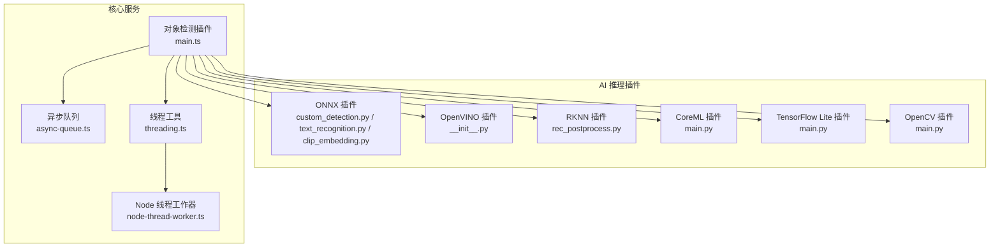
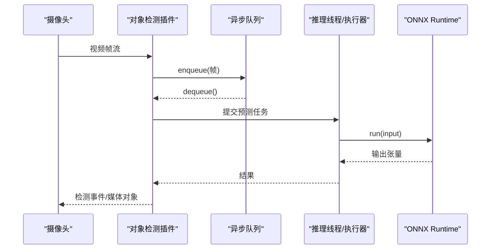
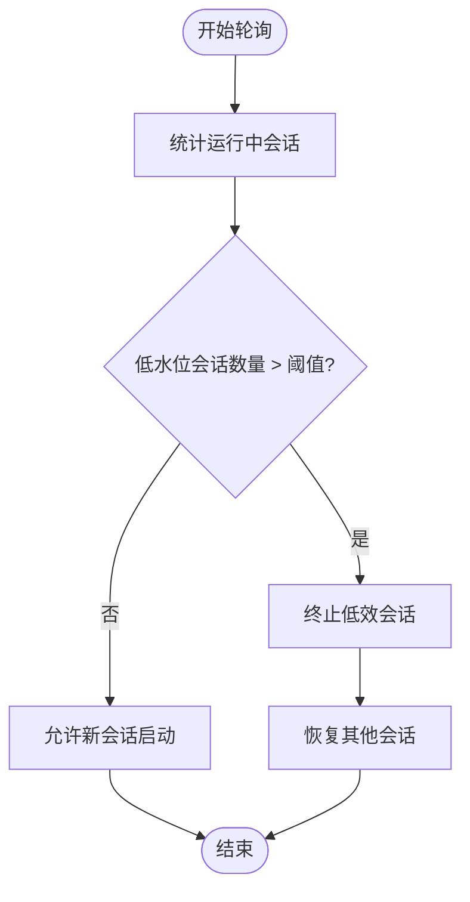
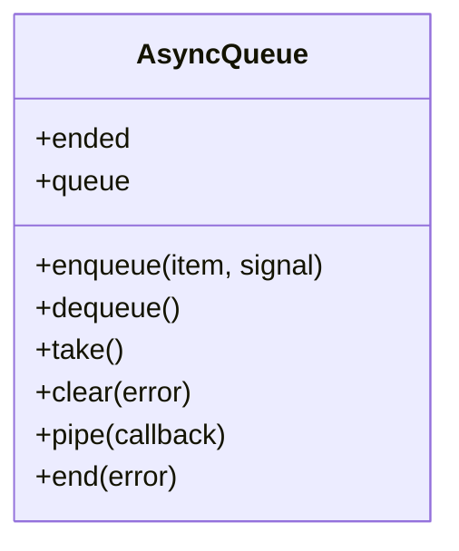
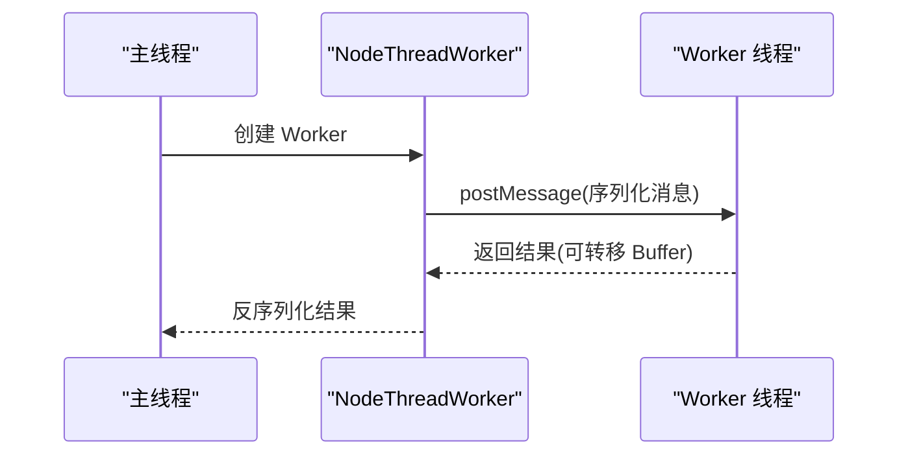
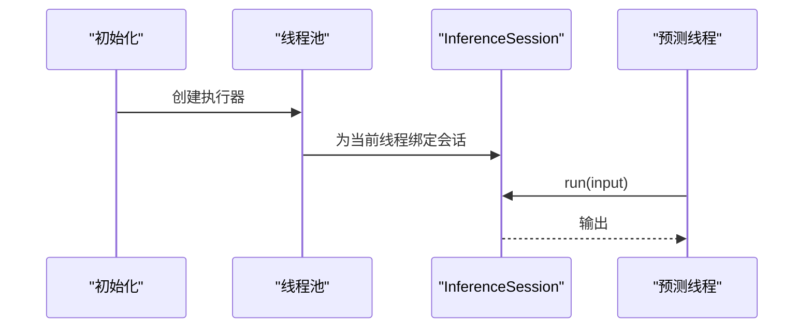
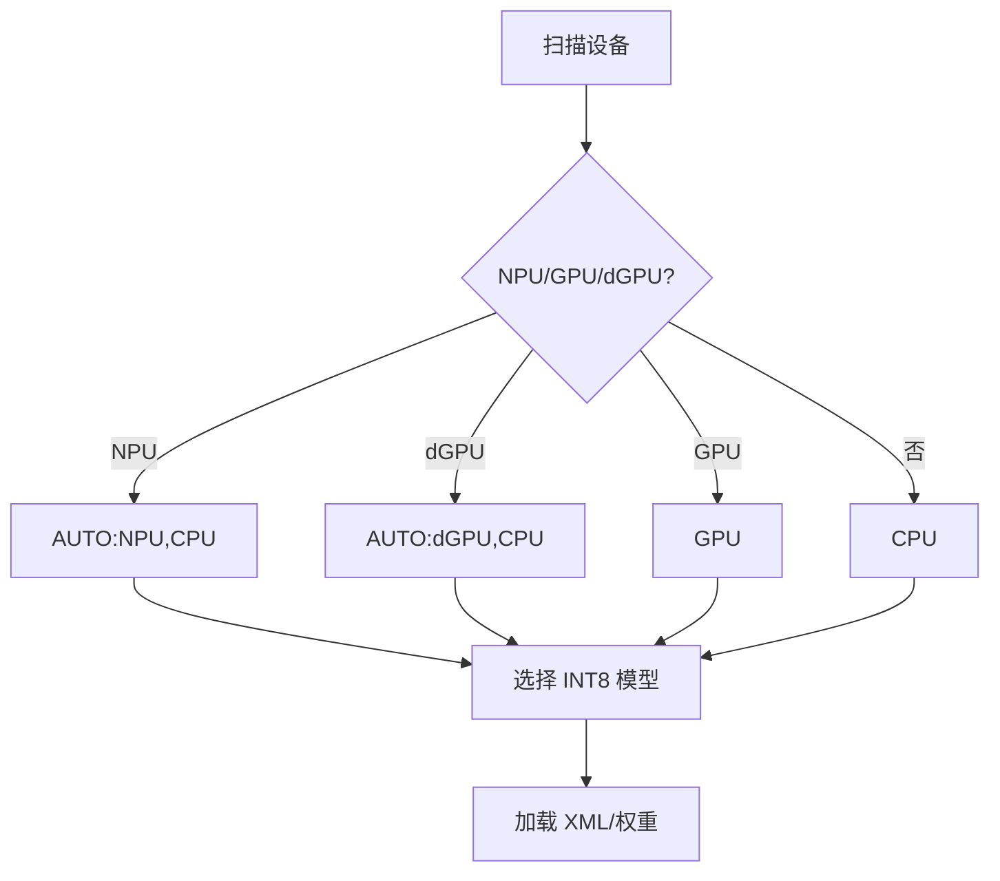
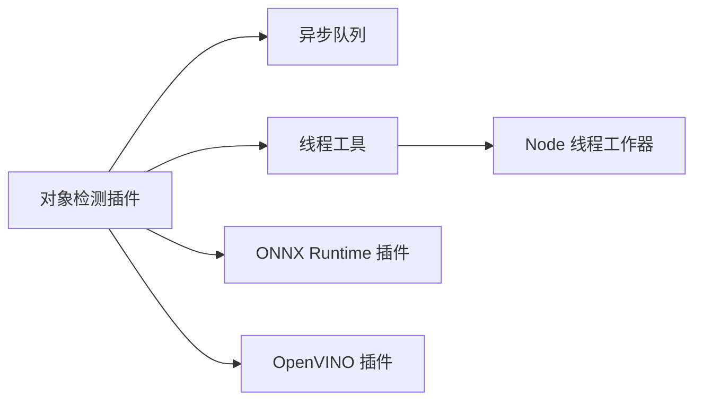

# 性能优化

<cite>
**本文引用的文件**
- [plugins/objectdetector/src/main.ts](file://plugins/objectdetector/src/main.ts)
- [common/src/async-queue.ts](file://common/src/async-queue.ts)
- [server/src/threading.ts](file://server/src/threading.ts)
- [server/src/plugin/runtime/node-thread-worker.ts](file://server/src/plugin/runtime/node-thread-worker.ts)
- [plugins/onnx/src/ort/custom_detection.py](file://plugins/onnx/src/ort/custom_detection.py)
- [plugins/onnx/src/ort/text_recognition.py](file://plugins/onnx/src/ort/text_recognition.py)
- [plugins/onnx/src/ort/clip_embedding.py](file://plugins/onnx/src/ort/clip_embedding.py)
- [plugins/openvino/src/ov/__init__.py](file://plugins/openvino/src/ov/__init__.py)
- [plugins/rknn/src/rec_utils/rec_postprocess.py](file://plugins/rknn/src/rec_utils/rec_postprocess.py)
- [plugins/opencv/src/main.py](file://plugins/opencv/src/main.py)
- [plugins/tensorflow-lite/src/main.py](file://plugins/tensorflow-lite/src/main.py)
- [plugins/coreml/src/main.py](file://plugins/coreml/src/main.py)
- [server/test/threading-test.ts](file://server/test/threading-test.ts)
- [plugins/homekit/src/types/camera/camera-streaming-srtp-sender.ts](file://plugins/homekit/src/types/camera/camera-streaming-srtp-sender.ts)
</cite>

## 目录
1. [引言](#引言)
2. [项目结构](#项目结构)
3. [核心组件](#核心组件)
4. [架构总览](#架构总览)
5. [详细组件分析](#详细组件分析)
6. [依赖分析](#依赖分析)
7. [性能考量](#性能考量)
8. [故障排查指南](#故障排查指南)
9. [结论](#结论)
10. [附录](#附录)

## 引言
本文件面向 Scrypted 的 AI 性能优化，聚焦实时推理在多框架（ONNX Runtime、OpenVINO、RKNN、CoreML、TensorFlow Lite、OpenCV）下的优化策略与实现，涵盖批处理、并行计算、内存池、模型压缩、缓存与并发控制、监控与分析、调优方法及基准测试与瓶颈识别。内容以代码为依据，辅以图示帮助理解。

## 项目结构
Scrypted 将 AI 推理能力通过插件化方式集成，核心对象检测插件负责调度与节流；通用并发与线程工具位于 server 与 common；各推理后端插件分别实现模型加载、执行器初始化与推理管线。

图表来源
- [plugins/objectdetector/src/main.ts:1183-1218](file://plugins/objectdetector/src/main.ts#L1183-L1218)
- [common/src/async-queue.ts:1-170](file://common/src/async-queue.ts#L1-L170)
- [server/src/threading.ts:1-100](file://server/src/threading.ts#L1-L100)
- [server/src/plugin/runtime/node-thread-worker.ts:1-54](file://server/src/plugin/runtime/node-thread-worker.ts#L1-L54)
- [plugins/onnx/src/ort/custom_detection.py:45-72](file://plugins/onnx/src/ort/custom_detection.py#L45-L72)
- [plugins/onnx/src/ort/text_recognition.py:75-94](file://plugins/onnx/src/ort/text_recognition.py#L75-L94)
- [plugins/onnx/src/ort/clip_embedding.py:45-67](file://plugins/onnx/src/ort/clip_embedding.py#L45-L67)
- [plugins/openvino/src/ov/__init__.py:109-177](file://plugins/openvino/src/ov/__init__.py#L109-L177)
- [plugins/rknn/src/rec_utils/rec_postprocess.py:134-181](file://plugins/rknn/src/rec_utils/rec_postprocess.py#L134-L181)

章节来源
- [plugins/objectdetector/src/main.ts:1-1351](file://plugins/objectdetector/src/main.ts#L1-L1351)
- [common/src/async-queue.ts:1-242](file://common/src/async-queue.ts#L1-L242)
- [server/src/threading.ts:1-100](file://server/src/threading.ts#L1-L100)
- [server/src/plugin/runtime/node-thread-worker.ts:1-54](file://server/src/plugin/runtime/node-thread-worker.ts#L1-L54)

## 核心组件
- 对象检测与节流：基于并发会话数与 FPS 水线进行动态启停，避免系统过载。
- 异步队列：提供生产者-消费者模型，支持取消信号与批量出队。
- 线程与工作器：Node Worker 线程封装与消息序列化传输，支持缓冲区零拷贝传递。
- 推理后端：ONNX Runtime 多执行提供者与线程池隔离；OpenVINO 自动设备选择与模型选择；RKNN 蒸馏解码；CoreML/TFLite/Fork 入口；OpenCV 插件入口。

章节来源
- [plugins/objectdetector/src/main.ts:1183-1218](file://plugins/objectdetector/src/main.ts#L1183-L1218)
- [common/src/async-queue.ts:1-170](file://common/src/async-queue.ts#L1-L170)
- [server/src/threading.ts:1-100](file://server/src/threading.ts#L1-L100)
- [server/src/plugin/runtime/node-thread-worker.ts:1-54](file://server/src/plugin/runtime/node-thread-worker.ts#L1-L54)

## 架构总览
Scrypted 的 AI 推理采用“插件 + 服务”分层：
- 插件层：各推理后端提供模型加载、执行器与预测接口。
- 服务层：对象检测插件统一调度、节流与统计；异步队列协调输入输出；线程工具隔离 CPU 密集任务。
- 并发与传输：Node Worker 线程与 RPC 序列化确保跨线程高效传递数据。

图表来源
- [plugins/objectdetector/src/main.ts:345-386](file://plugins/objectdetector/src/main.ts#L345-L386)
- [common/src/async-queue.ts:97-119](file://common/src/async-queue.ts#L97-L119)
- [plugins/onnx/src/ort/text_recognition.py:75-94](file://plugins/onnx/src/ort/text_recognition.py#L75-L94)

## 详细组件分析

### 对象检测与节流（FPS 与并发）
- 周期性检查运行中的检测会话，按 FPS 水线与最低阈值决定是否允许新会话启动或终止现有会话。
- 统计并发会话的每秒检测次数（dps），用于性能报告与趋势分析。
- 针对长时检测与异常挂起设置超时保护，避免资源泄漏。

图表来源
- [plugins/objectdetector/src/main.ts:1088-1123](file://plugins/objectdetector/src/main.ts#L1088-L1123)
- [plugins/objectdetector/src/main.ts:1143-1173](file://plugins/objectdetector/src/main.ts#L1143-L1173)
- [plugins/objectdetector/src/main.ts:1183-1218](file://plugins/objectdetector/src/main.ts#L1183-L1218)

章节来源
- [plugins/objectdetector/src/main.ts:1088-1123](file://plugins/objectdetector/src/main.ts#L1088-L1123)
- [plugins/objectdetector/src/main.ts:1143-1173](file://plugins/objectdetector/src/main.ts#L1143-L1173)
- [plugins/objectdetector/src/main.ts:1183-1218](file://plugins/objectdetector/src/main.ts#L1183-L1218)

### 异步队列（生产者-消费者与取消）
- 支持等待队列、提交入队、批量清空、可选取消信号。
- 适配生成器，自动结束与传播错误，保证迭代安全。

图表来源
- [common/src/async-queue.ts:6-170](file://common/src/async-queue.ts#L6-L170)

章节来源
- [common/src/async-queue.ts:1-242](file://common/src/async-queue.ts#L1-L242)

### 线程与工作器（跨线程执行与缓冲传输）
- newThread 封装 Worker 线程，支持模块注入与参数传递。
- NodeThreadWorker 使用 MessagePort 与 TransferList 实现 Buffer 零拷贝传输，降低内存复制成本。

图表来源
- [server/src/threading.ts:66-99](file://server/src/threading.ts#L66-L99)
- [server/src/plugin/runtime/node-thread-worker.ts:8-40](file://server/src/plugin/runtime/node-thread-worker.ts#L8-L40)

章节来源
- [server/src/threading.ts:1-100](file://server/src/threading.ts#L1-L100)
- [server/src/plugin/runtime/node-thread-worker.ts:1-54](file://server/src/plugin/runtime/node-thread-worker.ts#L1-L54)
- [server/test/threading-test.ts:1-29](file://server/test/threading-test.ts#L1-L29)

### ONNX Runtime 推理（多提供者与线程池隔离）
- 初始化多个 InferenceSession，并为每个线程绑定一个会话实例，避免跨线程共享状态。
- 使用线程池执行准备与预测，减少锁竞争。
- 文本识别与 CLIP 嵌入均采用相同模式，确保推理稳定与吞吐。

图表来源
- [plugins/onnx/src/ort/custom_detection.py:45-72](file://plugins/onnx/src/ort/custom_detection.py#L45-L72)
- [plugins/onnx/src/ort/text_recognition.py:75-94](file://plugins/onnx/src/ort/text_recognition.py#L75-L94)
- [plugins/onnx/src/ort/clip_embedding.py:45-67](file://plugins/onnx/src/ort/clip_embedding.py#L45-L67)

章节来源
- [plugins/onnx/src/ort/custom_detection.py:45-72](file://plugins/onnx/src/ort/custom_detection.py#L45-L72)
- [plugins/onnx/src/ort/text_recognition.py:75-94](file://plugins/onnx/src/ort/text_recognition.py#L75-L94)
- [plugins/onnx/src/ort/clip_embedding.py:45-67](file://plugins/onnx/src/ort/clip_embedding.py#L45-L67)

### OpenVINO 推理（设备选择与模型策略）
- 自动扫描可用设备，优先 NPU/GPU/dGPU，回退到 CPU。
- 根据设备类型选择最优 INT8/FP32 模型，兼顾精度与速度。
- 从本地缓存路径加载转换后的模型文件。

图表来源
- [plugins/openvino/src/ov/__init__.py:109-177](file://plugins/openvino/src/ov/__init__.py#L109-L177)

章节来源
- [plugins/openvino/src/ov/__init__.py:109-177](file://plugins/openvino/src/ov/__init__.py#L109-L177)

### RKNN 文本识别（蒸馏解码）
- 提供 DistillationCTCLabelDecode，支持多头/多模型名称输出的解码。
- 便于教师-学生模型蒸馏后的后处理一致性。

章节来源
- [plugins/rknn/src/rec_utils/rec_postprocess.py:134-181](file://plugins/rknn/src/rec_utils/rec_postprocess.py#L134-L181)

### CoreML/TensorFlow Lite/OpenCV 插件入口
- 插件入口导出 create_scrypted_plugin 与 fork，便于主进程创建与派生执行环境。

章节来源
- [plugins/coreml/src/main.py:1-9](file://plugins/coreml/src/main.py#L1-L9)
- [plugins/tensorflow-lite/src/main.py:1-9](file://plugins/tensorflow-lite/src/main.py#L1-L9)
- [plugins/opencv/src/main.py](file://plugins/opencv/src/main.py)

## 依赖分析
- 对象检测插件依赖异步队列与线程工具，形成稳定的输入输出与执行通道。
- ONNX Runtime 插件内部依赖线程池与执行提供者，避免全局共享状态。
- OpenVINO 插件依赖设备枚举与模型下载/缓存路径，确保离线可用与快速加载。
- Node 线程工作器依赖 Buffer 传输协议，保障大块数据高效传递。

图表来源
- [plugins/objectdetector/src/main.ts:1-1351](file://plugins/objectdetector/src/main.ts#L1-L1351)
- [common/src/async-queue.ts:1-170](file://common/src/async-queue.ts#L1-L170)
- [server/src/threading.ts:1-100](file://server/src/threading.ts#L1-L100)
- [server/src/plugin/runtime/node-thread-worker.ts:1-54](file://server/src/plugin/runtime/node-thread-worker.ts#L1-L54)
- [plugins/onnx/src/ort/custom_detection.py:45-72](file://plugins/onnx/src/ort/custom_detection.py#L45-L72)
- [plugins/openvino/src/ov/__init__.py:109-177](file://plugins/openvino/src/ov/__init__.py#L109-L177)

章节来源
- [plugins/objectdetector/src/main.ts:1-1351](file://plugins/objectdetector/src/main.ts#L1-L1351)
- [common/src/async-queue.ts:1-170](file://common/src/async-queue.ts#L1-L170)
- [server/src/threading.ts:1-100](file://server/src/threading.ts#L1-L100)
- [server/src/plugin/runtime/node-thread-worker.ts:1-54](file://server/src/plugin/runtime/node-thread-worker.ts#L1-L54)

## 性能考量
- 批处理与并行
  - 使用线程池隔离推理，避免全局锁争用；ONNX Runtime 为每个线程绑定独立会话，提升并发稳定性。
  - 异步队列支持批量出队与取消，减少无效计算。
- 内存池与零拷贝
  - Node 线程工作器通过 TransferList 传输 Buffer，避免重复拷贝；RPC 序列化器仅在必要时复制数据。
- 缓存策略
  - OpenVINO 从本地缓存路径加载模型文件，减少网络与 IO 开销。
  - 对象检测插件统计并发与 FPS，辅助判断是否需要缓存中间结果（如媒体对象）。
- 模型压缩与选择
  - OpenVINO 根据设备类型选择 INT8/FP32 模型；ONNX Runtime 可结合 CPU/GPU 提供者优化。
  - RKNN 提供蒸馏解码，便于轻量化部署。
- 并发控制
  - 基于 FPS 水线与最低阈值的动态启停，防止系统过载；线程池大小与队列长度需与硬件能力匹配。
- 监控与分析
  - 统计并发会话数与每秒检测次数（dps），记录采样时间窗口内的平均值与峰值。
  - 对长时间无输出的会话进行超时保护，避免资源泄漏。

章节来源
- [plugins/onnx/src/ort/custom_detection.py:45-72](file://plugins/onnx/src/ort/custom_detection.py#L45-L72)
- [common/src/async-queue.ts:1-170](file://common/src/async-queue.ts#L1-L170)
- [server/src/plugin/runtime/node-thread-worker.ts:8-40](file://server/src/plugin/runtime/node-thread-worker.ts#L8-L40)
- [plugins/openvino/src/ov/__init__.py:109-177](file://plugins/openvino/src/ov/__init__.py#L109-L177)
- [plugins/objectdetector/src/main.ts:1183-1218](file://plugins/objectdetector/src/main.ts#L1183-L1218)

## 故障排查指南
- 推理卡顿或掉帧
  - 检查对象检测插件的 FPS 统计与节流逻辑，确认是否存在低水位会话被终止。
  - 核对 ONNX Runtime 线程池大小与队列长度，避免过度并发导致上下文切换开销。
- 线程阻塞或崩溃
  - 确认线程池初始化回调是否正确绑定会话；避免跨线程共享未序列化的对象。
  - 使用 Node 线程工作器的缓冲传输，减少跨线程数据拷贝引发的异常。
- 设备选择错误
  - OpenVINO 自动模式可能与特定设备冲突，优先显式指定设备组合（如 NPU,GPU,CPU）。
- 资源占用过高
  - 通过节流阈值与并发限制控制同时运行的检测会话数量；对长时无输出会话进行超时清理。

章节来源
- [plugins/objectdetector/src/main.ts:1088-1123](file://plugins/objectdetector/src/main.ts#L1088-L1123)
- [plugins/onnx/src/ort/custom_detection.py:45-72](file://plugins/onnx/src/ort/custom_detection.py#L45-L72)
- [server/src/plugin/runtime/node-thread-worker.ts:8-40](file://server/src/plugin/runtime/node-thread-worker.ts#L8-L40)
- [plugins/openvino/src/ov/__init__.py:136-154](file://plugins/openvino/src/ov/__init__.py#L136-L154)

## 结论
Scrypted 在 AI 性能优化上采取了“插件化 + 服务化”的分层设计：对象检测插件负责调度与节流，异步队列与线程工具提供并发与传输保障，各推理后端通过提供者/设备选择与模型策略实现高效推理。配合 FPS 统计与超时保护，系统能够在复杂场景下保持稳定与高性能。

## 附录
- 性能调优建议
  - 参数调整：根据设备类型选择 INT8/FP32 模型；合理设置线程池大小与队列深度；启用合适的设备组合。
  - 硬件配置：优先使用 NPU/GPU 加速；确保磁盘具备足够空间缓存模型文件。
  - 系统优化：启用缓冲传输与零拷贝；避免跨线程共享可变状态；定期清理长时无输出会话。
- 基准测试与瓶颈识别
  - 使用对象检测插件的 FPS 统计与并发会话数作为指标；对比不同提供者/设备组合的吞吐与延迟。
  - 对长视频流进行压力测试，观察系统在高并发下的抖动与恢复能力。
- 最佳实践
  - 动态节流：根据系统负载动态启停检测会话，避免整体性能雪崩。
  - 缓存优先：优先使用本地缓存模型与中间结果，减少 IO 与重复计算。
  - 分层隔离：推理线程池与主线程职责分离，降低锁竞争与上下文切换成本。