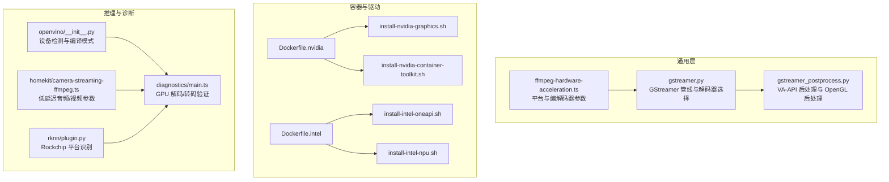
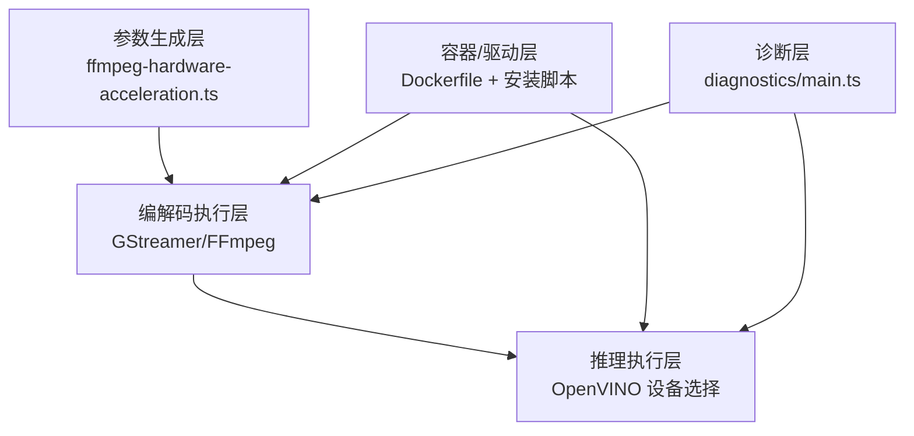
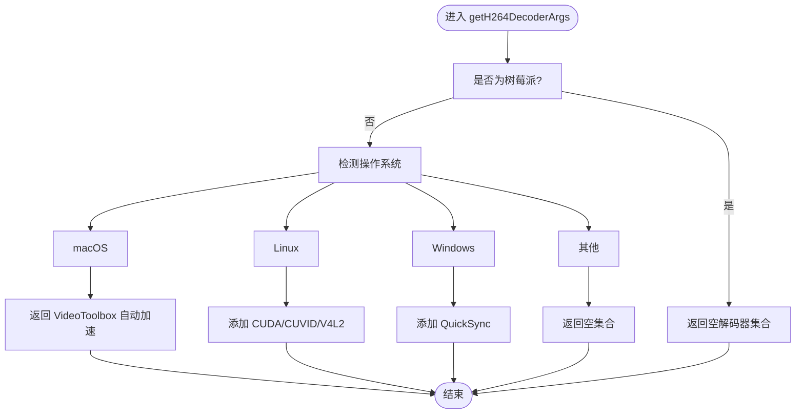
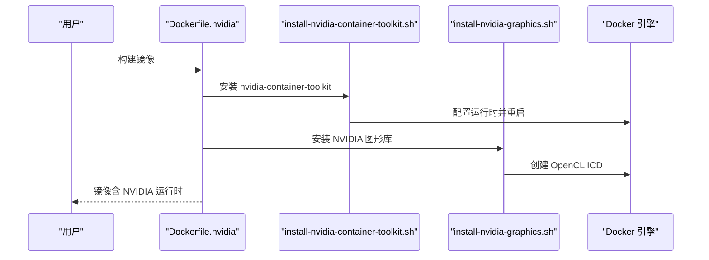
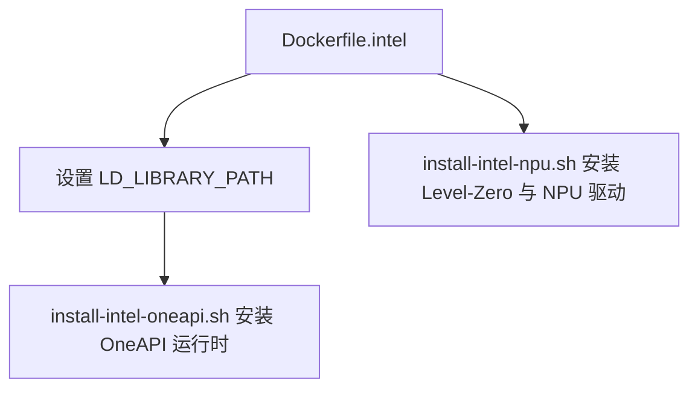
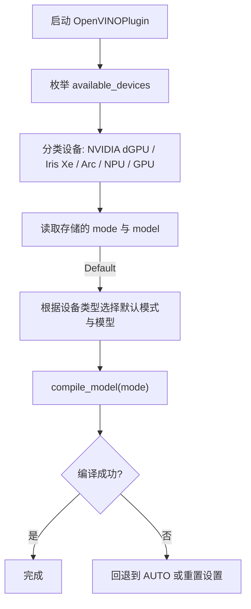
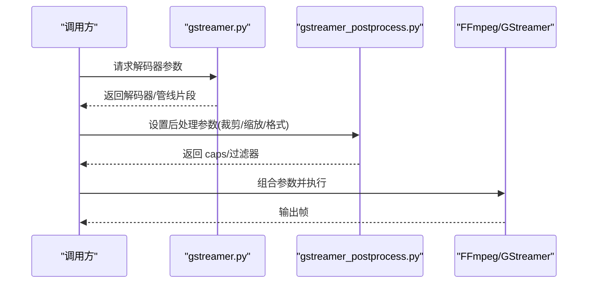
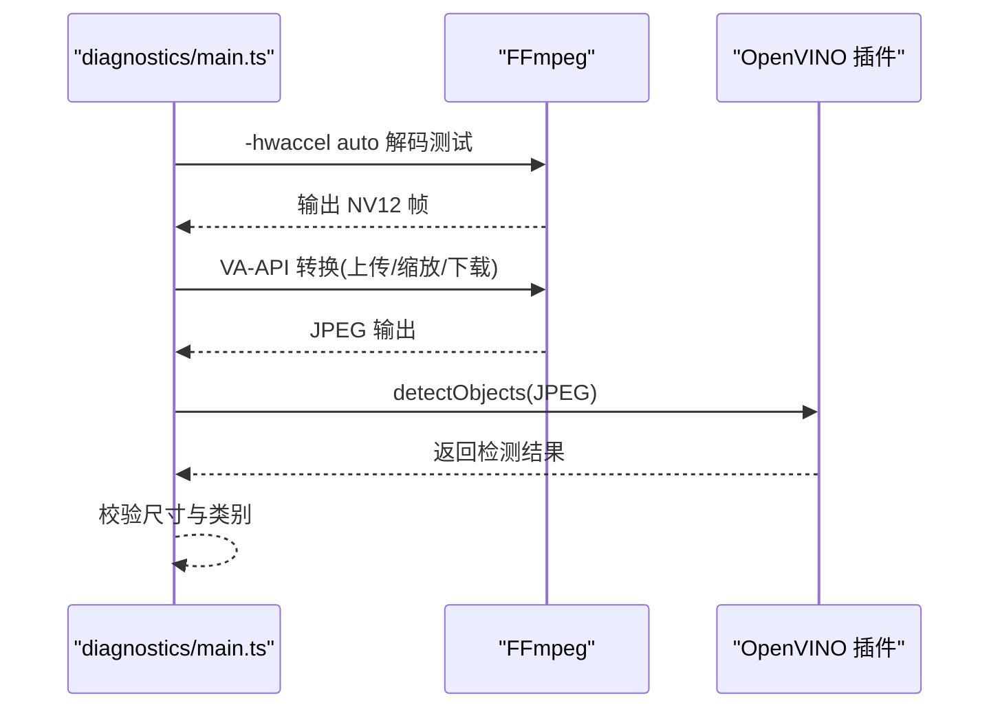
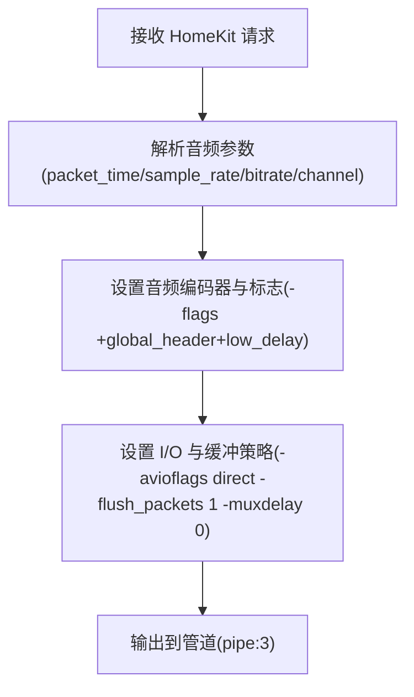
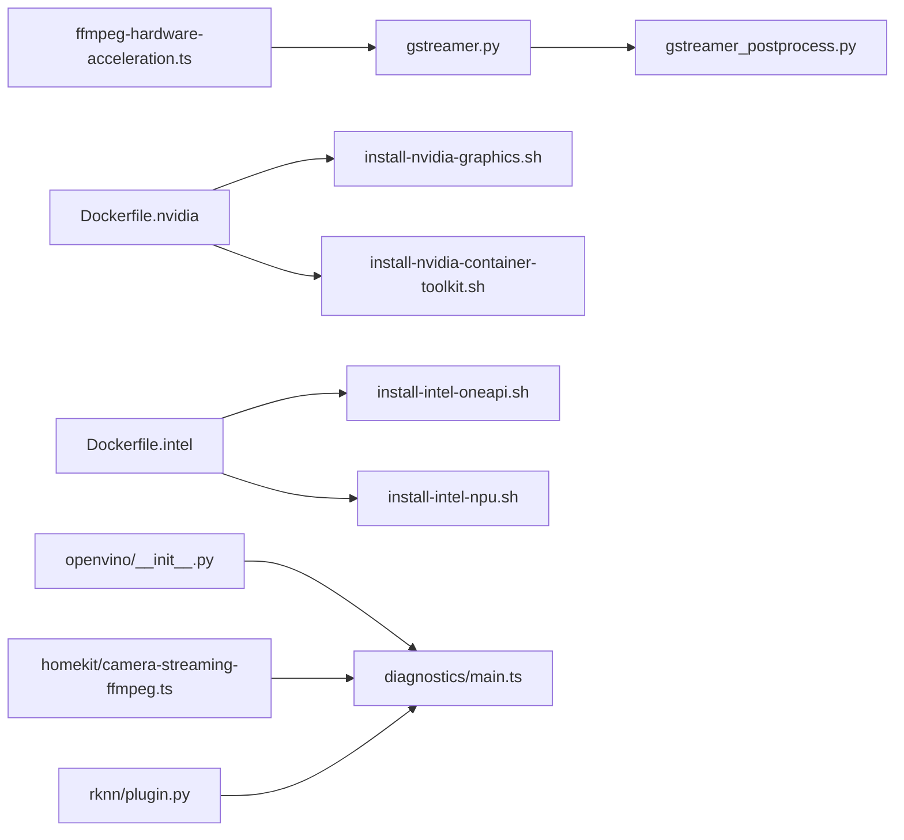

# 硬件加速

<cite>
**本文引用的文件**
- [ffmpeg-hardware-acceleration.ts](file://common/src/ffmpeg-hardware-acceleration.ts)
- [Dockerfile.nvidia](file://install/docker/Dockerfile.nvidia)
- [Dockerfile.intel](file://install/docker/Dockerfile.intel)
- [install-nvidia-container-toolkit.sh](file://install/docker/install-nvidia-container-toolkit.sh)
- [install-nvidia-graphics.sh](file://install/docker/install-nvidia-graphics.sh)
- [install-intel-oneapi.sh](file://install/docker/install-intel-oneapi.sh)
- [install-intel-npu.sh](file://install/docker/install-intel-npu.sh)
- [openvino/__init__.py](file://plugins/openvino/src/ov/__init__.py)
- [diagnostics/main.ts](file://plugins/diagnostics/src/main.ts)
- [python-codecs/gstreamer.py](file://plugins/python-codecs/src/gstreamer.py)
- [python-codecs/gstreamer_postprocess.py](file://plugins/python-codecs/src/gstreamer_postprocess.py)
- [homekit/camera-streaming-ffmpeg.ts](file://plugins/homekit/src/types/camera/camera-streaming-ffmpeg.ts)
- [rknn/plugin.py](file://plugins/rknn/src/rknn/plugin.py)
</cite>

## 目录
1. [简介](#简介)
2. [项目结构](#项目结构)
3. [核心组件](#核心组件)
4. [架构总览](#架构总览)
5. [详细组件分析](#详细组件分析)
6. [依赖关系分析](#依赖关系分析)
7. [性能考量](#性能考量)
8. [故障排查指南](#故障排查指南)
9. [结论](#结论)
10. [附录](#附录)

## 简介
本文件系统化梳理 Scrypted 在硬件加速方面的实现与使用方式，覆盖以下方面：
- 图形处理器优化：CUDA、CUVID、VAAPI、VideoToolbox、QuickSync 等
- 神经网络处理单元（NPU）：Intel NPU 驱动与运行时、OpenVINO 设备选择策略
- 数字信号处理器（DSP）：音频/视频处理路径中的低延迟与实时性优化
- 配置方法：驱动安装、容器运行时、库路径与环境变量
- 监控与诊断：GPU 解码/转码验证、日志与错误定位
- 兼容性：x86、ARM、嵌入式平台支持现状
- 性能提升与最佳实践：参数调优、设备模式选择、并发队列与缓存

## 项目结构
围绕硬件加速的关键代码分布在以下模块：
- 常用媒体工具：FFmpeg 硬件加速参数生成与平台适配
- 容器与驱动安装脚本：NVIDIA 容器工具包、NVIDIA 图形库、Intel OneAPI、Intel NPU
- 推理与模型加载：OpenVINO 自动选择设备与编译模式
- 编解码管线：GStreamer/FFmpeg 参数与后处理
- 诊断插件：GPU 解码/转码自检流程
- 实时流：HomeKit 流媒体编码参数与时延控制
- 特定平台：RKNN 在 Rockchip 平台的识别与兼容性检查

**图示来源**
- [ffmpeg-hardware-acceleration.ts:49-131](file://common/src/ffmpeg-hardware-acceleration.ts#L49-L131)
- [gstreamer.py:346-368](file://plugins/python-codecs/src/gstreamer.py#L346-L368)
- [gstreamer_postprocess.py:125-194](file://plugins/python-codecs/src/gstreamer_postprocess.py#L125-L194)
- [Dockerfile.nvidia:1-12](file://install/docker/Dockerfile.nvidia#L1-L12)
- [Dockerfile.intel:1-17](file://install/docker/Dockerfile.intel#L1-L17)
- [install-nvidia-container-toolkit.sh:1-64](file://install/docker/install-nvidia-container-toolkit.sh#L1-L64)
- [install-nvidia-graphics.sh:28-54](file://install/docker/install-nvidia-graphics.sh#L28-L54)
- [install-intel-oneapi.sh:1-18](file://install/docker/install-intel-oneapi.sh#L1-L18)
- [install-intel-npu.sh:1-83](file://install/docker/install-intel-npu.sh#L1-L83)
- [openvino/__init__.py:109-154](file://plugins/openvino/src/ov/__init__.py#L109-L154)
- [diagnostics/main.ts:654-741](file://plugins/diagnostics/src/main.ts#L654-L741)
- [homekit/camera-streaming-ffmpeg.ts:138-167](file://plugins/homekit/src/types/camera/camera-streaming-ffmpeg.ts#L138-L167)
- [rknn/plugin.py:37-73](file://plugins/rknn/src/rknn/plugin.py#L37-L73)

**章节来源**
- [ffmpeg-hardware-acceleration.ts:1-147](file://common/src/ffmpeg-hardware-acceleration.ts#L1-L147)
- [Dockerfile.nvidia:1-12](file://install/docker/Dockerfile.nvidia#L1-L12)
- [Dockerfile.intel:1-17](file://install/docker/Dockerfile.intel#L1-L17)
- [install-nvidia-container-toolkit.sh:1-64](file://install/docker/install-nvidia-container-toolkit.sh#L1-L64)
- [install-nvidia-graphics.sh:28-54](file://install/docker/install-nvidia-graphics.sh#L28-L54)
- [install-intel-oneapi.sh:1-18](file://install/docker/install-intel-oneapi.sh#L1-L18)
- [install-intel-npu.sh:1-83](file://install/docker/install-intel-npu.sh#L1-L83)
- [openvino/__init__.py:109-154](file://plugins/openvino/src/ov/__init__.py#L109-L154)
- [diagnostics/main.ts:654-741](file://plugins/diagnostics/src/main.ts#L654-L741)
- [python-codecs/gstreamer.py:346-368](file://plugins/python-codecs/src/gstreamer.py#L346-L368)
- [python-codecs/gstreamer_postprocess.py:125-194](file://plugins/python-codecs/src/gstreamer_postprocess.py#L125-L194)
- [homekit/camera-streaming-ffmpeg.ts:138-167](file://plugins/homekit/src/types/camera/camera-streaming-ffmpeg.ts#L138-L167)
- [rknn/plugin.py:37-73](file://plugins/rknn/src/rknn/plugin.py#L37-L73)

## 核心组件
- FFmpeg 硬件加速参数生成：按平台返回可用的解码/编码器参数集合，覆盖 NVIDIA CUDA/CUVID、VAAPI、VideoToolbox、QuickSync 等
- 容器与驱动安装：提供 NVIDIA 容器工具包、NVIDIA 图形库、Intel OneAPI、Intel NPU 的安装脚本与 Dockerfile
- OpenVINO 设备选择：自动探测 NVIDIA dGPU、Intel Iris Xe/Arc、NPU、GPU 等设备，并根据设备能力选择最优编译模式与模型
- GStreamer/FFmpeg 管线：在 Linux 上优先使用 VAAPI；在 macOS 使用 VideoToolbox；在 Windows 使用 QuickSync；提供 VA-API 后处理与 OpenGL 后处理路径
- 诊断与验证：通过 FFmpeg 自动硬件加速与 VA-API 转换测试，验证 GPU 解码/转码链路
- 实时流参数：HomeKit 流媒体严格控制音频帧时长与低延迟标志，确保端到端低时延
- 平台兼容性：针对 ARM/Rockchip 平台进行设备树识别与兼容性检查

**章节来源**
- [ffmpeg-hardware-acceleration.ts:49-131](file://common/src/ffmpeg-hardware-acceleration.ts#L49-L131)
- [openvino/__init__.py:109-154](file://plugins/openvino/src/ov/__init__.py#L109-L154)
- [python-codecs/gstreamer.py:346-368](file://plugins/python-codecs/src/gstreamer.py#L346-L368)
- [python-codecs/gstreamer_postprocess.py:125-194](file://plugins/python-codecs/src/gstreamer_postprocess.py#L125-L194)
- [diagnostics/main.ts:654-741](file://plugins/diagnostics/src/main.ts#L654-L741)
- [homekit/camera-streaming-ffmpeg.ts:138-167](file://plugins/homekit/src/types/camera/camera-streaming-ffmpeg.ts#L138-L167)
- [rknn/plugin.py:37-73](file://plugins/rknn/src/rknn/plugin.py#L37-L73)

## 架构总览
Scrypted 的硬件加速由“参数生成—容器/驱动—推理/编解码—诊断验证”四层构成。参数生成层基于平台能力输出编解码器选项；容器/驱动层负责运行时环境准备；推理/编解码层执行实际的加速任务；诊断层对关键路径进行验证。

**图示来源**
- [ffmpeg-hardware-acceleration.ts:49-131](file://common/src/ffmpeg-hardware-acceleration.ts#L49-L131)
- [Dockerfile.nvidia:1-12](file://install/docker/Dockerfile.nvidia#L1-L12)
- [Dockerfile.intel:1-17](file://install/docker/Dockerfile.intel#L1-L17)
- [install-nvidia-container-toolkit.sh:1-64](file://install/docker/install-nvidia-container-toolkit.sh#L1-L64)
- [install-nvidia-graphics.sh:28-54](file://install/docker/install-nvidia-graphics.sh#L28-L54)
- [install-intel-oneapi.sh:1-18](file://install/docker/install-intel-oneapi.sh#L1-L18)
- [install-intel-npu.sh:1-83](file://install/docker/install-intel-npu.sh#L1-L83)
- [openvino/__init__.py:109-154](file://plugins/openvino/src/ov/__init__.py#L109-L154)
- [diagnostics/main.ts:654-741](file://plugins/diagnostics/src/main.ts#L654-L741)

## 详细组件分析

### FFmpeg 硬件加速参数生成
- 解码器参数：按平台返回 CUDA、CUVID、VAAPI、VideoToolbox、QuickSync 等选项；Linux 提供 V4L2；macOS 使用自动硬件加速；Windows 提供 QuickSync
- 编码器参数：按平台返回 VAAPI、VideoToolbox、QuickSync、AMF、NVENC 等；Linux 还支持 V4L2；调试模式提供软编码参数集合
- Raspberry Pi：当前返回空集，避免不稳定的硬件加速

**图示来源**
- [ffmpeg-hardware-acceleration.ts:49-84](file://common/src/ffmpeg-hardware-acceleration.ts#L49-L84)

**章节来源**
- [ffmpeg-hardware-acceleration.ts:49-131](file://common/src/ffmpeg-hardware-acceleration.ts#L49-L131)

### NVIDIA 容器与驱动集成
- Dockerfile.nvidia：设置 NVIDIA 可见与能力，拉起安装脚本以挂载 OpenCL ICD 文件
- install-nvidia-container-toolkit.sh：安装 CUDA 源与 nvidia-container-toolkit，配置 Docker 运行时
- install-nvidia-graphics.sh：在容器内创建 OpenCL ICD 文件，确保运行时可发现 NVIDIA OpenCL 库

**图示来源**
- [Dockerfile.nvidia:1-12](file://install/docker/Dockerfile.nvidia#L1-L12)
- [install-nvidia-container-toolkit.sh:1-64](file://install/docker/install-nvidia-container-toolkit.sh#L1-L64)
- [install-nvidia-graphics.sh:28-54](file://install/docker/install-nvidia-graphics.sh#L28-L54)

**章节来源**
- [Dockerfile.nvidia:1-12](file://install/docker/Dockerfile.nvidia#L1-L12)
- [install-nvidia-container-toolkit.sh:1-64](file://install/docker/install-nvidia-container-toolkit.sh#L1-L64)
- [install-nvidia-graphics.sh:28-54](file://install/docker/install-nvidia-graphics.sh#L28-L54)

### Intel OneAPI 与 NPU 集成
- Dockerfile.intel：设置 OneAPI 库路径，便于 MKL/SYCL/Blast 等运行时库加载
- install-intel-oneapi.sh：安装 OneAPI 运行时与编译器相关库
- install-intel-npu.sh：安装 Level-Zero 与 NPU 驱动，支持 Debian 12/13 或 Ubuntu 22.04/24.04

**图示来源**
- [Dockerfile.intel:1-17](file://install/docker/Dockerfile.intel#L1-L17)
- [install-intel-oneapi.sh:1-18](file://install/docker/install-intel-oneapi.sh#L1-L18)
- [install-intel-npu.sh:1-83](file://install/docker/install-intel-npu.sh#L1-L83)

**章节来源**
- [Dockerfile.intel:1-17](file://install/docker/Dockerfile.intel#L1-L17)
- [install-intel-oneapi.sh:1-18](file://install/docker/install-intel-oneapi.sh#L1-L18)
- [install-intel-npu.sh:1-83](file://install/docker/install-intel-npu.sh#L1-L83)

### OpenVINO 设备选择与编译模式
- 自动探测设备类型：NVIDIA dGPU、Iris Xe、Arc、NPU、GPU
- 模式选择策略：优先 NPU，其次 dGPU 列表，再尝试 GPU；若指定模式失败则回退 AUTO
- 模型选择：根据设备类型选择 INT8/RELU 模型以获得更好性能

**图示来源**
- [openvino/__init__.py:109-154](file://plugins/openvino/src/ov/__init__.py#L109-L154)
- [openvino/__init__.py:174-215](file://plugins/openvino/src/ov/__init__.py#L174-L215)

**章节来源**
- [openvino/__init__.py:109-154](file://plugins/openvino/src/ov/__init__.py#L109-L154)
- [openvino/__init__.py:174-215](file://plugins/openvino/src/ov/__init__.py#L174-L215)

### GStreamer/FFmpeg 编解码与后处理
- GStreamer 解码器选择：在 macOS 默认启用硬件解码；在 Linux 保持安全默认，避免崩溃
- VA-API 后处理：支持裁剪、缩放、格式转换等；OpenGL 后处理用于内存共享与下载
- 编码器选择：按平台返回 VAAPI、VideoToolbox、QuickSync、AMF、NVENC 等

**图示来源**
- [python-codecs/gstreamer.py:346-368](file://plugins/python-codecs/src/gstreamer.py#L346-L368)
- [python-codecs/gstreamer_postprocess.py:125-194](file://plugins/python-codecs/src/gstreamer_postprocess.py#L125-L194)

**章节来源**
- [python-codecs/gstreamer.py:346-368](file://plugins/python-codecs/src/gstreamer.py#L346-L368)
- [python-codecs/gstreamer_postprocess.py:125-194](file://plugins/python-codecs/src/gstreamer_postprocess.py#L125-L194)

### 诊断与验证（GPU 解码/转码）
- 自动硬件加速检测：通过 FFmpeg 自动选择硬件加速并等待 NV12 输出
- VA-API 转换测试：初始化 VA-API 设备，上传/缩放/下载，校验输出尺寸与内容
- OpenVINO 协同验证：在 GPU 转码后对图像进行目标检测，确保链路完整

**图示来源**
- [diagnostics/main.ts:654-741](file://plugins/diagnostics/src/main.ts#L654-L741)

**章节来源**
- [diagnostics/main.ts:654-741](file://plugins/diagnostics/src/main.ts#L654-L741)

### 实时流参数与时延控制（HomeKit）
- 严格控制音频帧时长：根据 HomeKit 请求的 packet_time 输出 OPUS/Eld 参数
- 低延迟标志：开启 global_header、low_delay，禁用内部缓冲，强制 flush
- 音频编码：按需复制或重编码为 PCM μ-law，输出 mulaw 管道

**图示来源**
- [homekit/camera-streaming-ffmpeg.ts:138-167](file://plugins/homekit/src/types/camera/camera-streaming-ffmpeg.ts#L138-L167)

**章节来源**
- [homekit/camera-streaming-ffmpeg.ts:138-167](file://plugins/homekit/src/types/camera/camera-streaming-ffmpeg.ts#L138-L167)

### 平台兼容性与特定芯片
- Rockchip 平台：通过读取设备树字符串识别 RK3562/66/68/76/88，不满足条件抛出异常并提示特权容器运行
- Raspberry Pi：当前返回空解码器集合，避免不稳定行为

**章节来源**
- [rknn/plugin.py:37-73](file://plugins/rknn/src/rknn/plugin.py#L37-L73)

## 依赖关系分析
- 参数生成依赖于平台检测函数，决定后续编解码器选择
- 容器/驱动层为推理与编解码提供运行时基础
- 诊断层对关键链路进行回归验证，保障稳定性
- 实时流参数直接影响用户体验，需与硬件能力匹配

**图示来源**
- [ffmpeg-hardware-acceleration.ts:49-131](file://common/src/ffmpeg-hardware-acceleration.ts#L49-L131)
- [Dockerfile.nvidia:1-12](file://install/docker/Dockerfile.nvidia#L1-L12)
- [Dockerfile.intel:1-17](file://install/docker/Dockerfile.intel#L1-L17)
- [install-nvidia-graphics.sh:28-54](file://install/docker/install-nvidia-graphics.sh#L28-L54)
- [install-nvidia-container-toolkit.sh:1-64](file://install/docker/install-nvidia-container-toolkit.sh#L1-L64)
- [install-intel-oneapi.sh:1-18](file://install/docker/install-intel-oneapi.sh#L1-L18)
- [install-intel-npu.sh:1-83](file://install/docker/install-intel-npu.sh#L1-L83)
- [openvino/__init__.py:109-154](file://plugins/openvino/src/ov/__init__.py#L109-L154)
- [diagnostics/main.ts:654-741](file://plugins/diagnostics/src/main.ts#L654-L741)
- [homekit/camera-streaming-ffmpeg.ts:138-167](file://plugins/homekit/src/types/camera/camera-streaming-ffmpeg.ts#L138-L167)
- [rknn/plugin.py:37-73](file://plugins/rknn/src/rknn/plugin.py#L37-L73)

**章节来源**
- [ffmpeg-hardware-acceleration.ts:49-131](file://common/src/ffmpeg-hardware-acceleration.ts#L49-L131)
- [Dockerfile.nvidia:1-12](file://install/docker/Dockerfile.nvidia#L1-L12)
- [Dockerfile.intel:1-17](file://install/docker/Dockerfile.intel#L1-L17)
- [install-nvidia-container-toolkit.sh:1-64](file://install/docker/install-nvidia-container-toolkit.sh#L1-L64)
- [install-nvidia-graphics.sh:28-54](file://install/docker/install-nvidia-graphics.sh#L28-L54)
- [install-intel-oneapi.sh:1-18](file://install/docker/install-intel-oneapi.sh#L1-L18)
- [install-intel-npu.sh:1-83](file://install/docker/install-intel-npu.sh#L1-L83)
- [openvino/__init__.py:109-154](file://plugins/openvino/src/ov/__init__.py#L109-L154)
- [diagnostics/main.ts:654-741](file://plugins/diagnostics/src/main.ts#L654-L741)
- [homekit/camera-streaming-ffmpeg.ts:138-167](file://plugins/homekit/src/types/camera/camera-streaming-ffmpeg.ts#L138-L167)
- [rknn/plugin.py:37-73](file://plugins/rknn/src/rknn/plugin.py#L37-L73)

## 性能考量
- 设备模式选择：优先 NPU（如可用），否则 dGPU 列表，最后尝试 GPU；AUTO 模式可能隐藏冲突，必要时显式指定
- 编码器与像素格式：在 Linux 使用 VAAPI/NVENC，在 macOS 使用 VideoToolbox，在 Windows 使用 QuickSync/AMF；调试模式采用软编码以便问题定位
- 低延迟与实时性：HomeKit 流媒体严格控制音频帧时长与低延迟标志，减少端到端时延
- 并发与缓存：推理队列异步化，参数缓存与去抖机制降低重复开销

[本节为通用指导，无需列出具体文件来源]

## 故障排查指南
- GPU 解码/转码验证：使用诊断插件的 GPU Decode 步骤，观察 FFmpeg 输出中是否出现硬件加速类型与 NV12 帧
- VA-API 转换：若 VA-API 初始化失败或输出尺寸不符，检查设备节点与驱动版本
- OpenVINO 模式回退：当指定模式编译失败时，插件会回退到 AUTO 或重置设置，建议查看日志确认设备列表
- NVIDIA 运行时：确认已安装 nvidia-container-toolkit 并正确配置 Docker 运行时；容器内 OpenCL ICD 已创建
- Intel OneAPI/NPU：确认库路径已设置，Level-Zero 与 NPU 驱动安装完成，必要时重启主机

**章节来源**
- [diagnostics/main.ts:654-741](file://plugins/diagnostics/src/main.ts#L654-L741)
- [openvino/__init__.py:180-195](file://plugins/openvino/src/ov/__init__.py#L180-L195)
- [install-nvidia-container-toolkit.sh:54-60](file://install/docker/install-nvidia-container-toolkit.sh#L54-L60)
- [install-nvidia-graphics.sh:48-50](file://install/docker/install-nvidia-graphics.sh#L48-L50)
- [install-intel-oneapi.sh:1-18](file://install/docker/install-intel-oneapi.sh#L1-L18)
- [install-intel-npu.sh:68-74](file://install/docker/install-intel-npu.sh#L68-L74)

## 结论
Scrypted 通过参数生成、容器/驱动集成、推理与编解码执行以及诊断验证形成完整的硬件加速闭环。针对不同厂商与平台，提供了可配置、可回退的策略，既保证了性能，也兼顾了稳定性与可维护性。结合本文的配置与排错建议，可在多种硬件平台上获得一致且高效的加速体验。

[本节为总结性内容，无需列出具体文件来源]

## 附录

### 硬件加速配置清单
- NVIDIA
  - 安装容器工具包与运行时：[install-nvidia-container-toolkit.sh:1-64](file://install/docker/install-nvidia-container-toolkit.sh#L1-L64)
  - 容器内图形库与 OpenCL ICD：[install-nvidia-graphics.sh:28-54](file://install/docker/install-nvidia-graphics.sh#L28-L54)，[Dockerfile.nvidia:1-12](file://install/docker/Dockerfile.nvidia#L1-L12)
- Intel
  - OneAPI 运行时与库路径：[install-intel-oneapi.sh:1-18](file://install/docker/install-intel-oneapi.sh#L1-L18)，[Dockerfile.intel:1-17](file://install/docker/Dockerfile.intel#L1-L17)
  - NPU 驱动与 Level-Zero：[install-intel-npu.sh:1-83](file://install/docker/install-intel-npu.sh#L1-L83)
- OpenVINO
  - 设备模式与模型选择：[openvino/__init__.py:109-154](file://plugins/openvino/src/ov/__init__.py#L109-L154)

**章节来源**
- [install-nvidia-container-toolkit.sh:1-64](file://install/docker/install-nvidia-container-toolkit.sh#L1-L64)
- [install-nvidia-graphics.sh:28-54](file://install/docker/install-nvidia-graphics.sh#L28-L54)
- [Dockerfile.nvidia:1-12](file://install/docker/Dockerfile.nvidia#L1-L12)
- [install-intel-oneapi.sh:1-18](file://install/docker/install-intel-oneapi.sh#L1-L18)
- [Dockerfile.intel:1-17](file://install/docker/Dockerfile.intel#L1-L17)
- [install-intel-npu.sh:1-83](file://install/docker/install-intel-npu.sh#L1-L83)
- [openvino/__init__.py:109-154](file://plugins/openvino/src/ov/__init__.py#L109-L154)