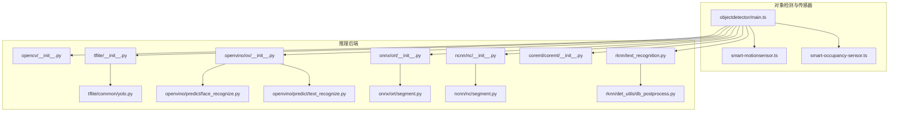
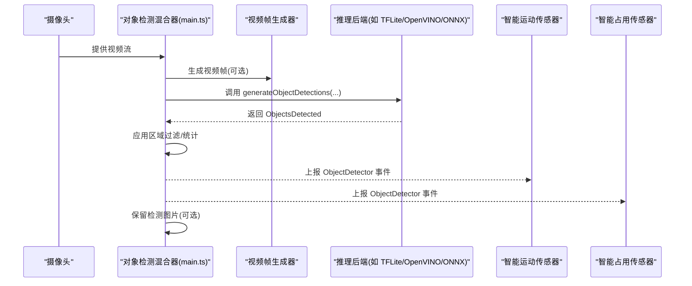
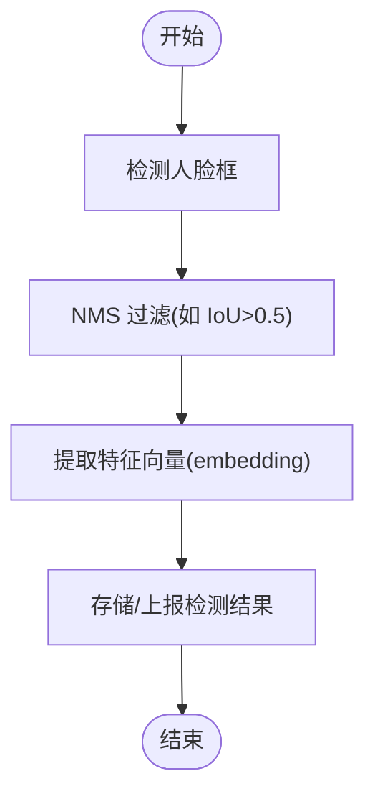
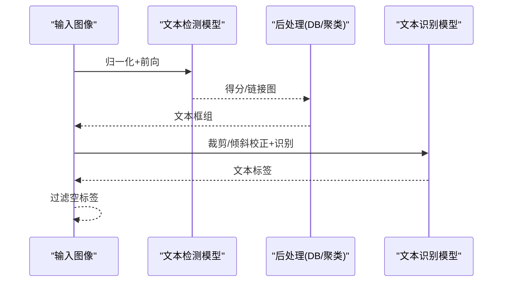
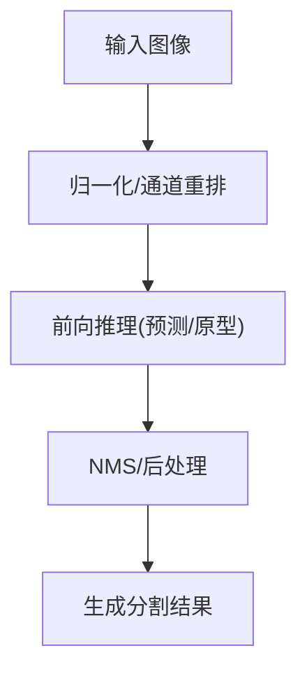
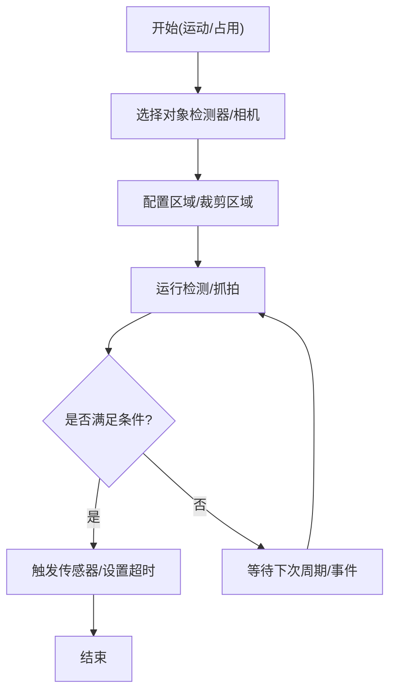
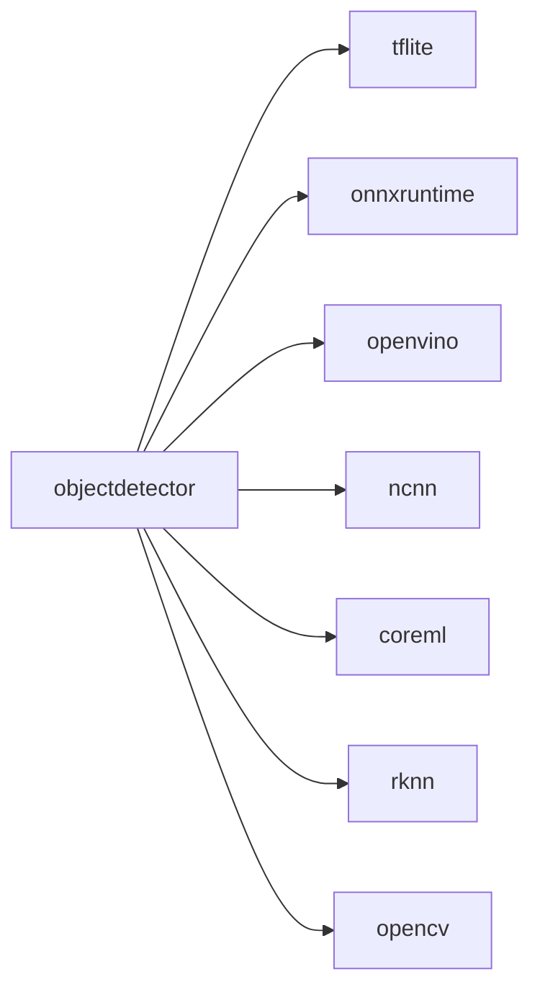

# 计算机视觉算法

<cite>
**本文引用的文件**
- [plugins/objectdetector/src/main.ts](file://plugins/objectdetector/src/main.ts)
- [plugins/objectdetector/src/smart-motionsensor.ts](file://plugins/objectdetector/src/smart-motionsensor.ts)
- [plugins/objectdetector/src/smart-occupancy-sensor.ts](file://plugins/objectdetector/src/smart-occupancy-sensor.ts)
- [plugins/opencv/src/opencv/__init__.py](file://plugins/opencv/src/opencv/__init__.py)
- [plugins/tensorflow-lite/src/tflite/__init__.py](file://plugins/tensorflow-lite/src/tflite/__init__.py)
- [plugins/tensorflow-lite/src/common/yolo.py](file://plugins/tensorflow-lite/src/common/yolo.py)
- [plugins/openvino/src/ov/__init__.py](file://plugins/openvino/src/ov/__init__.py)
- [plugins/openvino/src/predict/face_recognize.py](file://plugins/openvino/src/predict/face_recognize.py)
- [plugins/openvino/src/predict/text_recognize.py](file://plugins/openvino/src/predict/text_recognize.py)
- [plugins/onnx/src/ort/__init__.py](file://plugins/onnx/src/ort/__init__.py)
- [plugins/onnx/src/ort/segment.py](file://plugins/onnx/src/ort/segment.py)
- [plugins/ncnn/src/nc/__init__.py](file://plugins/ncnn/src/nc/__init__.py)
- [plugins/ncnn/src/nc/segment.py](file://plugins/ncnn/src/nc/segment.py)
- [plugins/coreml/src/coreml/__init__.py](file://plugins/coreml/src/coreml/__init__.py)
- [plugins/rknn/src/rknn/text_recognition.py](file://plugins/rknn/src/rknn/text_recognition.py)
- [plugins/rknn/src/det_utils/db_postprocess.py](file://plugins/rknn/src/det_utils/db_postprocess.py)
</cite>

## 目录
1. [简介](#简介)
2. [项目结构](#项目结构)
3. [核心组件](#核心组件)
4. [架构总览](#架构总览)
5. [详细组件分析](#详细组件分析)
6. [依赖分析](#依赖分析)
7. [性能考虑](#性能考虑)
8. [故障排除指南](#故障排除指南)
9. [结论](#结论)
10. [附录](#附录)

## 简介
本文件面向 Scrypted 的计算机视觉能力，系统性梳理目标检测、人脸识别、OCR 文本识别、图像分割与智能传感器（运动/占用/行为）等模块的实现与使用方法。重点覆盖以下算法与能力：
- 目标检测：YOLO（含 YOLOv9/v10、YOLO-NAS）、SSD、EfficientDet 等模型族在不同后端（TensorFlow Lite、ONNX Runtime、OpenVINO、NCNN、Core ML、RKNN）上的集成与推理流程。
- 人脸识别：基于 OpenVINO 的人脸检测与特征向量提取，结合 NMS 过滤与嵌入生成，用于身份识别与后续匹配。
- OCR 文本识别：OpenVINO 的文本检测（如 DBNet）与识别（CTC/CRNN 类似流程），以及 RKNN 的端侧文本检测与识别流水线。
- 图像分割：ONNX/NCNN/OpenVINO 后端对 YOLOv9 分割头的推理封装，输出掩码与边界框。
- 智能传感器：基于对象检测的智能运动传感器与占用传感器，支持区域过滤、标签匹配、阈值控制与周期性检查。

## 项目结构
Scrypted 将计算机视觉能力以“插件”形式组织，核心对象检测与传感器逻辑集中在 objectdetector 插件；各推理后端（OpenVINO、ONNX、NCNN、Core ML、TensorFlow Lite、RKNN）分别由独立插件提供具体模型与推理实现。下图给出与本文相关的核心文件与职责映射：

图表来源
- [plugins/objectdetector/src/main.ts:1-1351](file://plugins/objectdetector/src/main.ts#L1-L1351)
- [plugins/objectdetector/src/smart-motionsensor.ts:1-277](file://plugins/objectdetector/src/smart-motionsensor.ts#L1-L277)
- [plugins/objectdetector/src/smart-occupancy-sensor.ts:1-318](file://plugins/objectdetector/src/smart-occupancy-sensor.ts#L1-L318)
- [plugins/opencv/src/opencv/__init__.py:1-262](file://plugins/opencv/src/opencv/__init__.py#L1-L262)
- [plugins/tensorflow-lite/src/tflite/__init__.py:1-326](file://plugins/tensorflow-lite/src/tflite/__init__.py#L1-L326)
- [plugins/tensorflow-lite/src/common/yolo.py:1-221](file://plugins/tensorflow-lite/src/common/yolo.py#L1-L221)
- [plugins/openvino/src/ov/__init__.py:300-328](file://plugins/openvino/src/ov/__init__.py#L300-L328)
- [plugins/openvino/src/predict/face_recognize.py:88-164](file://plugins/openvino/src/predict/face_recognize.py#L88-L164)
- [plugins/openvino/src/predict/text_recognize.py:44-165](file://plugins/openvino/src/predict/text_recognize.py#L44-L165)
- [plugins/onnx/src/ort/__init__.py:164-192](file://plugins/onnx/src/ort/__init__.py#L164-L192)
- [plugins/onnx/src/ort/segment.py:1-55](file://plugins/onnx/src/ort/segment.py#L1-L55)
- [plugins/ncnn/src/nc/__init__.py:117-180](file://plugins/ncnn/src/nc/__init__.py#L117-L180)
- [plugins/ncnn/src/nc/segment.py:1-44](file://plugins/ncnn/src/nc/segment.py#L1-L44)
- [plugins/coreml/src/coreml/__init__.py:114-142](file://plugins/coreml/src/coreml/__init__.py#L114-L142)
- [plugins/rknn/src/rknn/text_recognition.py:1-264](file://plugins/rknn/src/rknn/text_recognition.py#L1-L264)
- [plugins/rknn/src/det_utils/db_postprocess.py:164-192](file://plugins/rknn/src/det_utils/db_postprocess.py#L164-L192)

章节来源
- [plugins/objectdetector/src/main.ts:1-1351](file://plugins/objectdetector/src/main.ts#L1-L1351)
- [plugins/objectdetector/src/smart-motionsensor.ts:1-277](file://plugins/objectdetector/src/smart-motionsensor.ts#L1-L277)
- [plugins/objectdetector/src/smart-occupancy-sensor.ts:1-318](file://plugins/objectdetector/src/smart-occupancy-sensor.ts#L1-L318)

## 核心组件
- 对象检测混合器与传感器桥接：负责从摄像头拉流、按设置生成帧、调用对象检测后端、应用区域过滤、事件上报与图片保留。
- 智能运动传感器：基于对象检测结果触发运动事件，支持标签匹配、编辑距离、最小置信度与区域过滤。
- 智能占用传感器：周期性抓拍并检测，支持裁剪区域、标签匹配与占用超时。
- 推理后端：提供统一的对象检测接口，封装模型下载、输入预处理、推理执行与后处理（含 NMS、坐标缩放、类别映射）。

章节来源
- [plugins/objectdetector/src/main.ts:50-800](file://plugins/objectdetector/src/main.ts#L50-L800)
- [plugins/objectdetector/src/smart-motionsensor.ts:8-277](file://plugins/objectdetector/src/smart-motionsensor.ts#L8-L277)
- [plugins/objectdetector/src/smart-occupancy-sensor.ts:11-318](file://plugins/objectdetector/src/smart-occupancy-sensor.ts#L11-L318)

## 架构总览
下图展示对象检测主循环与传感器桥接的工作流，以及与各推理后端的交互关系。

图表来源
- [plugins/objectdetector/src/main.ts:345-537](file://plugins/objectdetector/src/main.ts#L345-L537)
- [plugins/objectdetector/src/smart-motionsensor.ts:176-260](file://plugins/objectdetector/src/smart-motionsensor.ts#L176-L260)
- [plugins/objectdetector/src/smart-occupancy-sensor.ts:196-301](file://plugins/objectdetector/src/smart-occupancy-sensor.ts#L196-L301)

## 详细组件分析

### 目标检测与算法族
- TensorFlow Lite（TFLite）
  - 支持多种模型族：YOLOv9/v10、YOLO-NAS、SSD MobileNet、EfficientDet 等。
  - 输入尺寸与量化适配，分离输出解码与 YOLO 解析函数。
  - 多线程解释器池化，边缘 TPU 可选加速。
  
  章节来源
  - [plugins/tensorflow-lite/src/tflite/__init__.py:71-326](file://plugins/tensorflow-lite/src/tflite/__init__.py#L71-L326)
  - [plugins/tensorflow-lite/src/common/yolo.py:1-221](file://plugins/tensorflow-lite/src/common/yolo.py#L1-L221)

- OpenVINO
  - 统一设备发现与识别模型注册（人脸/文本识别）。
  - 文本检测采用 DBNet 风格输出，后处理聚合相邻文本块并识别文本内容。
  - 人脸检测后进行 NMS 过滤与嵌入提取，便于身份识别。

  章节来源
  - [plugins/openvino/src/ov/__init__.py:303-328](file://plugins/openvino/src/ov/__init__.py#L303-L328)
  - [plugins/openvino/src/predict/text_recognize.py:44-165](file://plugins/openvino/src/predict/text_recognize.py#L44-L165)
  - [plugins/openvino/src/predict/face_recognize.py:88-164](file://plugins/openvino/src/predict/face_recognize.py#L88-L164)

- ONNX Runtime
  - 加载本地/远端模型，前向推理，非极大值抑制与分割输出处理。
  - 提供分割能力封装。

  章节来源
  - [plugins/onnx/src/ort/__init__.py:164-192](file://plugins/onnx/src/ort/__init__.py#L164-L192)
  - [plugins/onnx/src/ort/segment.py:1-55](file://plugins/onnx/src/ort/segment.py#L1-L55)

- NCNN
  - Vulkan 加速加载模型，提供分割能力封装。

  章节来源
  - [plugins/ncnn/src/nc/__init__.py:117-180](file://plugins/ncnn/src/nc/__init__.py#L117-L180)
  - [plugins/ncnn/src/nc/segment.py:1-44](file://plugins/ncnn/src/nc/segment.py#L1-L44)

- Core ML
  - 设备发现与识别模型注册（人脸/文本识别）。

  章节来源
  - [plugins/coreml/src/coreml/__init__.py:114-142](file://plugins/coreml/src/coreml/__init__.py#L114-L142)

- RKNN
  - 文本检测（DBNet）与识别流水线，后处理包含膨胀、连通域与文本行合并。

  章节来源
  - [plugins/rknn/src/rknn/text_recognition.py:1-264](file://plugins/rknn/src/rknn/text_recognition.py#L1-L264)
  - [plugins/rknn/src/det_utils/db_postprocess.py:164-192](file://plugins/rknn/src/det_utils/db_postprocess.py#L164-L192)

- OpenCV 运动检测
  - 基于帧差法的简单运动检测，支持面积阈值、阈值与模糊半径等参数。

  章节来源
  - [plugins/opencv/src/opencv/__init__.py:43-262](file://plugins/opencv/src/opencv/__init__.py#L43-L262)

### 人脸识别
- 流程要点
  - 使用对象检测后端输出的人脸框，进行 NMS 过滤（例如 IoU 阈值）。
  - 对每个有效人脸框提取特征向量（embedding），用于后续身份匹配。
  - 可选地对检测结果进行置信度筛选与空值过滤。

图表来源
- [plugins/openvino/src/predict/face_recognize.py:104-164](file://plugins/openvino/src/predict/face_recognize.py#L104-L164)

章节来源
- [plugins/openvino/src/predict/face_recognize.py:88-164](file://plugins/openvino/src/predict/face_recognize.py#L88-L164)

### OCR 文本识别
- 流程要点
  - 文本检测：对输入图像进行归一化与张量化，前向得到得分图与链接图，后处理生成候选框。
  - 文本分组：根据相邻框与倾斜角聚合成文本行。
  - 文本识别：对每个文本行进行裁剪、倾斜校正与识别，得到字符串标签。
  - 结果过滤：移除空标签，返回检测结果。

图表来源
- [plugins/openvino/src/predict/text_recognize.py:50-165](file://plugins/openvino/src/predict/text_recognize.py#L50-L165)
- [plugins/rknn/src/rknn/text_recognition.py:231-264](file://plugins/rknn/src/rknn/text_recognition.py#L231-L264)
- [plugins/rknn/src/det_utils/db_postprocess.py:164-192](file://plugins/rknn/src/det_utils/db_postprocess.py#L164-L192)

章节来源
- [plugins/openvino/src/predict/text_recognize.py:44-165](file://plugins/openvino/src/predict/text_recognize.py#L44-L165)
- [plugins/rknn/src/rknn/text_recognition.py:1-264](file://plugins/rknn/src/rknn/text_recognition.py#L1-L264)
- [plugins/rknn/src/det_utils/db_postprocess.py:164-192](file://plugins/rknn/src/det_utils/db_postprocess.py#L164-L192)

### 图像分割
- 流程要点
  - 输入图像归一化与通道重排（BHWC/BCHW）。
  - 前向推理得到预测与原型张量，进行非极大值抑制与掩码后处理。
  - 输出包含边界框与掩码信息的结果集。

图表来源
- [plugins/onnx/src/ort/segment.py:28-55](file://plugins/onnx/src/ort/segment.py#L28-L55)
- [plugins/ncnn/src/nc/segment.py:37-44](file://plugins/ncnn/src/nc/segment.py#L37-L44)
- [plugins/openvino/src/ov/segment.py:30-44](file://plugins/openvino/src/ov/segment.py#L30-L44)

章节来源
- [plugins/onnx/src/ort/segment.py:1-55](file://plugins/onnx/src/ort/segment.py#L1-L55)
- [plugins/ncnn/src/nc/segment.py:1-44](file://plugins/ncnn/src/nc/segment.py#L1-L44)
- [plugins/openvino/src/ov/segment.py:1-44](file://plugins/openvino/src/ov/segment.py#L1-L44)

### 智能传感器
- 智能运动传感器
  - 选择对象检测器与目标类别，支持区域过滤、标签匹配（编辑距离）、最小置信度与超时控制。
  - 可选要求检测必须携带图片或仅接受 Scrypted 本地检测结果。

- 智能占用传感器
  - 周期性抓拍并检测，支持裁剪区域、标签匹配与占用超时。
  - 可同时监听摄像头自带对象检测事件，实现免费占用检测。

图表来源
- [plugins/objectdetector/src/smart-motionsensor.ts:159-260](file://plugins/objectdetector/src/smart-motionsensor.ts#L159-L260)
- [plugins/objectdetector/src/smart-occupancy-sensor.ts:196-301](file://plugins/objectdetector/src/smart-occupancy-sensor.ts#L196-L301)

章节来源
- [plugins/objectdetector/src/smart-motionsensor.ts:8-277](file://plugins/objectdetector/src/smart-motionsensor.ts#L8-L277)
- [plugins/objectdetector/src/smart-occupancy-sensor.ts:11-318](file://plugins/objectdetector/src/smart-occupancy-sensor.ts#L11-L318)

## 依赖分析
- 组件耦合
  - objectdetector 主模块与各推理后端通过 Scrypted RPC 接口解耦，支持动态切换后端。
  - 传感器模块通过事件监听与设置管理与对象检测器解耦。
- 外部依赖
  - TensorFlow Lite：PyCoral/Edge TPU 可选加速。
  - ONNX Runtime：ONNX 模型加载与推理。
  - OpenVINO：模型编译与推理请求。
  - NCNN：Vulkan 加速与模型加载。
  - RKNN：端侧推理与 DBNet 后处理。
  - OpenCV：运动检测专用。

图表来源
- [plugins/objectdetector/src/main.ts:438-452](file://plugins/objectdetector/src/main.ts#L438-L452)
- [plugins/tensorflow-lite/src/tflite/__init__.py:136-194](file://plugins/tensorflow-lite/src/tflite/__init__.py#L136-L194)
- [plugins/onnx/src/ort/__init__.py:164-192](file://plugins/onnx/src/ort/__init__.py#L164-L192)
- [plugins/openvino/src/ov/__init__.py:303-328](file://plugins/openvino/src/ov/__init__.py#L303-L328)
- [plugins/ncnn/src/nc/__init__.py:117-180](file://plugins/ncnn/src/nc/__init__.py#L117-L180)
- [plugins/coreml/src/coreml/__init__.py:114-142](file://plugins/coreml/src/coreml/__init__.py#L114-L142)
- [plugins/rknn/src/rknn/text_recognition.py:1-264](file://plugins/rknn/src/rknn/text_recognition.py#L1-L264)
- [plugins/opencv/src/opencv/__init__.py:43-262](file://plugins/opencv/src/opencv/__init__.py#L43-L262)

## 性能考虑
- 帧率与节流
  - 当对象检测帧率低于阈值（如 5fps）时，系统会提示可能的硬件瓶颈，并建议优化策略（降低分辨率、减少并发、启用硬件加速）。
- 解码器选择
  - 可配置视频帧生成器（WebAssembly、FFmpeg、GStreamer、LibAV），影响延迟与资源占用。
- 模型与输入尺寸
  - 不同后端对输入尺寸与量化有特定要求，合理设置可提升吞吐。
- 并发与线程池
  - 多后端使用线程池执行准备与推理，避免阻塞事件循环。
- 区域与阈值
  - 合理设置区域与置信度阈值，可显著降低误报与计算开销。

章节来源
- [plugins/objectdetector/src/main.ts:25-35](file://plugins/objectdetector/src/main.ts#L25-L35)
- [plugins/objectdetector/src/main.ts:703-715](file://plugins/objectdetector/src/main.ts#L703-L715)
- [plugins/opencv/src/opencv/__init__.py:170-198](file://plugins/opencv/src/opencv/__init__.py#L170-L198)
- [plugins/tensorflow-lite/src/tflite/__init__.py:184-194](file://plugins/tensorflow-lite/src/tflite/__init__.py#L184-L194)

## 故障排除指南
- 检测长时间未退出
  - 若检测循环超过一定时间未更新状态，系统会终止当前会话并记录错误，检查网络、模型加载与后端可用性。
- 无检测图片
  - 某些检测结果不附带图片，需在传感器设置中开启“需要检测图片”选项。
- 区域过滤无效
  - 若摄像头未在检测事件中提供区域信息，区域过滤将被忽略，请确认摄像头支持区域标注。
- 模型加载失败
  - 检查模型下载路径、后端库版本与设备权限（如 Edge TPU、GPU）。
- OCR 无法识别文本
  - 确认文本检测后处理参数（阈值、链接阈值、低文本阈值）与图像质量；必要时调整倾斜角与裁剪高度。

章节来源
- [plugins/objectdetector/src/main.ts:400-406](file://plugins/objectdetector/src/main.ts#L400-L406)
- [plugins/objectdetector/src/smart-motionsensor.ts:191-192](file://plugins/objectdetector/src/smart-motionsensor.ts#L191-L192)
- [plugins/objectdetector/src/smart-motionsensor.ts:214-218](file://plugins/objectdetector/src/smart-motionsensor.ts#L214-L218)
- [plugins/openvino/src/predict/text_recognize.py:155-165](file://plugins/openvino/src/predict/text_recognize.py#L155-L165)

## 结论
Scrypted 在对象检测、OCR、人脸识别与图像分割方面提供了统一的插件化架构，既支持云端/本地模型，也支持端侧推理后端。通过对象检测混合器与智能传感器模块，用户可以灵活配置区域、标签与阈值，实现运动检测、占用检测与行为分析等高级功能。针对不同硬件平台与部署场景，推荐优先启用硬件加速与合适的解码器，以获得更佳的性能与稳定性。

## 附录
- 使用示例
  - 在“智能运动传感器”中选择对象检测器与目标类别，配置区域与最小置信度，即可在检测到指定对象时触发运动事件。
  - 在“智能占用传感器”中设置周期与裁剪区域，周期性抓拍并检测，满足占用状态持续触发需求。
- 参数与调优
  - 对象检测：调整置信度阈值、NMS 阈值、输入尺寸与解码器类型。
  - OCR：调整文本检测阈值、链接阈值与低文本阈值，确保文本行正确合并。
  - 分割：调整 NMS 参数与掩码阈值，平衡召回与精度。
- 精度评估
  - 建议在真实场景下收集样本，对比不同模型与后端的 mAP、FPS 与资源占用，选择最优组合。