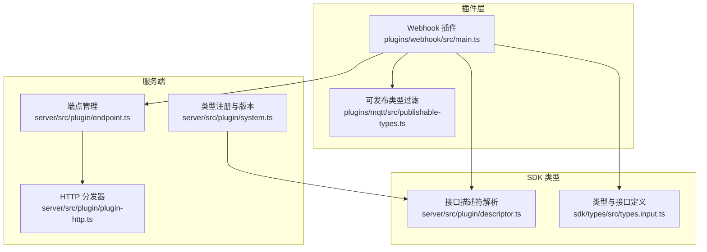
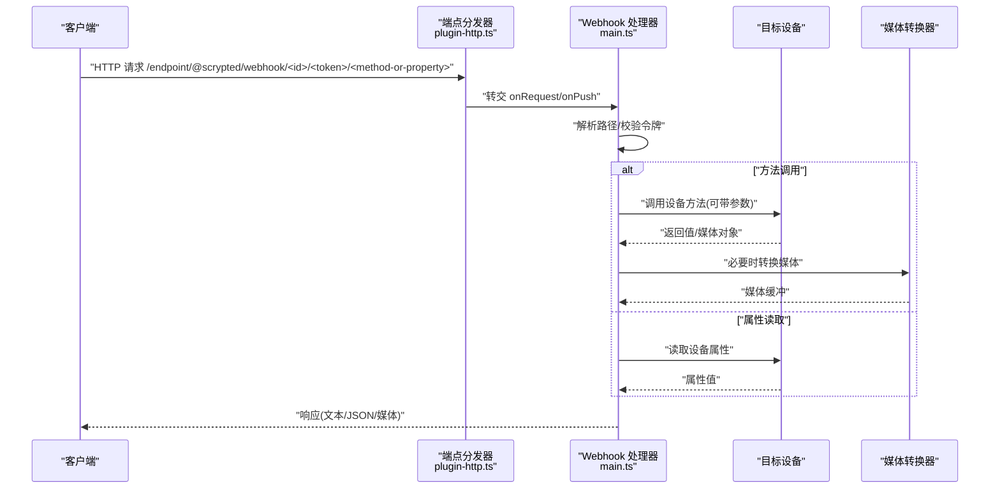
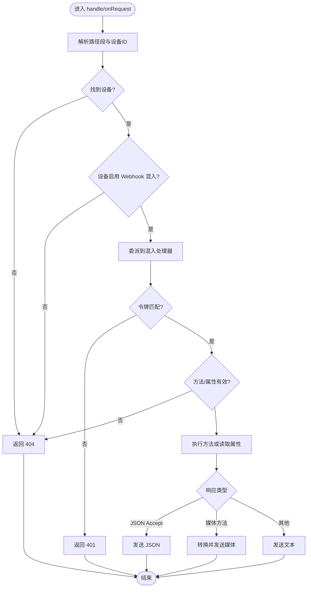
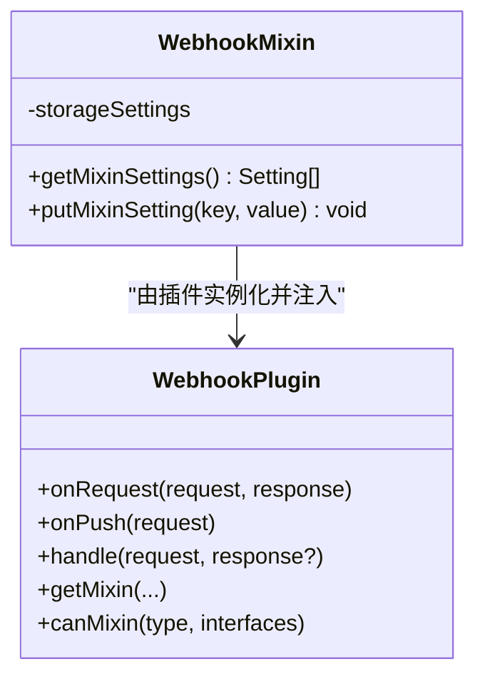
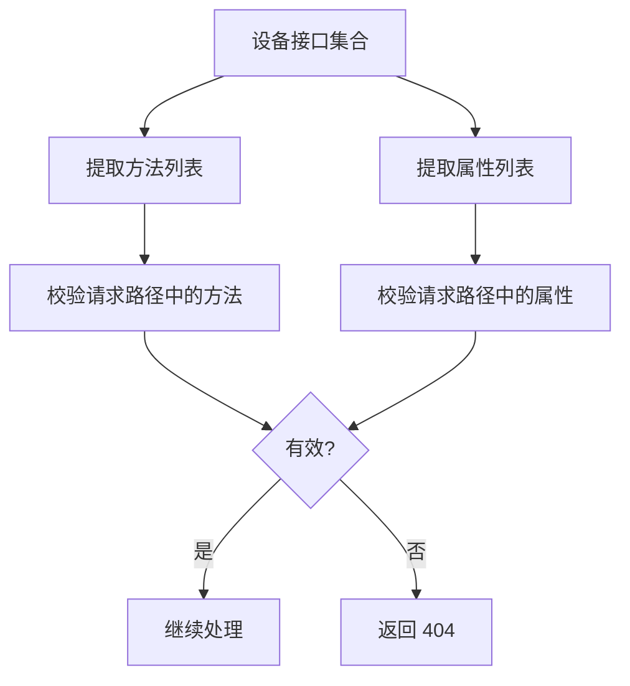
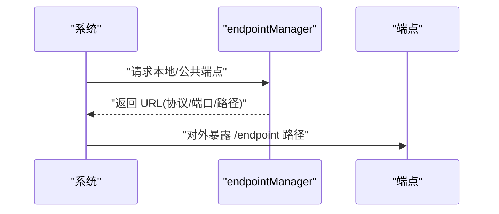
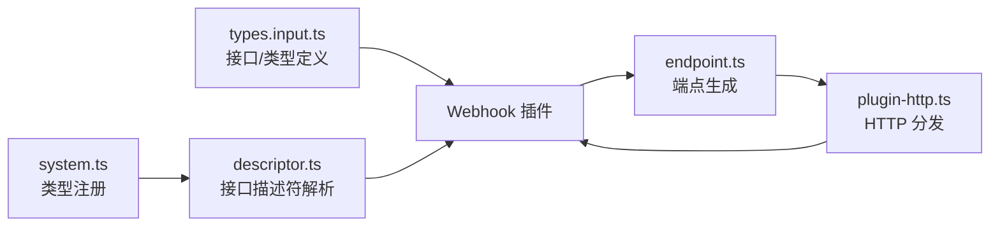

# Webhook 集成

<cite>
**本文引用的文件**
- [plugins/webhook/src/main.ts](file://plugins/webhook/src/main.ts)
- [plugins/webhook/README.md](file://plugins/webhook/README.md)
- [sdk/types/src/types.input.ts](file://sdk/types/src/types.input.ts)
- [plugins/mqtt/src/publishable-types.ts](file://plugins/mqtt/src/publishable-types.ts)
- [server/src/plugin/descriptor.ts](file://server/src/plugin/descriptor.ts)
- [server/src/plugin/endpoint.ts](file://server/src/plugin/endpoint.ts)
- [server/src/plugin/plugin-http.ts](file://server/src/plugin/plugin-http.ts)
- [server/src/plugin/system.ts](file://server/src/plugin/system.ts)
</cite>

## 目录
1. [简介](#简介)
2. [项目结构](#项目结构)
3. [核心组件](#核心组件)
4. [架构总览](#架构总览)
5. [详细组件分析](#详细组件分析)
6. [依赖关系分析](#依赖关系分析)
7. [性能考量](#性能考量)
8. [故障排查指南](#故障排查指南)
9. [结论](#结论)
10. [附录](#附录)

## 简介
本文件面向 Scrypted 的 Webhook 集成功能，提供从原理到实现、从配置到运维的完整技术文档。内容涵盖：
- Webhook 工作原理：HTTP 回调机制、事件触发条件、数据传输格式
- 配置方法：回调 URL、HTTP 方法、请求头、认证方式
- 事件类型与数据格式：设备状态变更、传感器数据、用户操作事件
- 安全机制：签名验证、HTTPS 要求、IP 白名单、速率限制
- 重试策略与错误处理：失败重试、超时处理、错误日志记录
- 最佳实践：幂等性设计、数据完整性、性能优化
- 实际集成示例与常见问题解决方案

## 项目结构
Webhook 功能由插件实现，并通过 Scrypted 的统一 HTTP 端点分发系统对外暴露。关键模块如下：
- 插件入口与混入逻辑：plugins/webhook/src/main.ts
- 插件说明：plugins/webhook/README.md
- SDK 类型与接口：sdk/types/src/types.input.ts
- 可发布类型过滤：plugins/mqtt/src/publishable-types.ts
- 接口描述符与可用方法/属性解析：server/src/plugin/descriptor.ts
- 统一端点生成与访问控制：server/src/plugin/endpoint.ts、server/src/plugin/plugin-http.ts
- 类型版本与接口描述符注册：server/src/plugin/system.ts

**图表来源**
- [plugins/webhook/src/main.ts:1-253](file://plugins/webhook/src/main.ts#L1-L253)
- [sdk/types/src/types.input.ts:2233-2295](file://sdk/types/src/types.input.ts#L2233-L2295)
- [plugins/mqtt/src/publishable-types.ts:1-39](file://plugins/mqtt/src/publishable-types.ts#L1-L39)
- [server/src/plugin/descriptor.ts:1-36](file://server/src/plugin/descriptor.ts#L1-L36)
- [server/src/plugin/endpoint.ts:71-81](file://server/src/plugin/endpoint.ts#L71-L81)
- [server/src/plugin/plugin-http.ts:1-48](file://server/src/plugin/plugin-http.ts#L1-L48)
- [server/src/plugin/system.ts:233-243](file://server/src/plugin/system.ts#L233-L243)

**章节来源**
- [plugins/webhook/src/main.ts:1-253](file://plugins/webhook/src/main.ts#L1-L253)
- [plugins/webhook/README.md:1-8](file://plugins/webhook/README.md#L1-L8)
- [sdk/types/src/types.input.ts:2233-2295](file://sdk/types/src/types.input.ts#L2233-L2295)
- [plugins/mqtt/src/publishable-types.ts:1-39](file://plugins/mqtt/src/publishable-types.ts#L1-L39)
- [server/src/plugin/descriptor.ts:1-36](file://server/src/plugin/descriptor.ts#L1-L36)
- [server/src/plugin/endpoint.ts:71-81](file://server/src/plugin/endpoint.ts#L71-L81)
- [server/src/plugin/plugin-http.ts:1-48](file://server/src/plugin/plugin-http.ts#L1-L48)
- [server/src/plugin/system.ts:233-243](file://server/src/plugin/system.ts#L233-L243)

## 核心组件
- Webhook 插件类：实现 HttpRequestHandler 与 PushHandler，负责接收外部 HTTP 请求与推送请求，解析路径与令牌，转发到目标设备接口（方法或属性），并返回结果或媒体对象。
- Webhook 混入类：为设备添加 Settings 接口能力，允许用户在控制台中选择设备接口以生成对应的 Webhook 访问路径与参数说明。
- 端点与访问控制：通过 endpointManager 提供本地/公共端点，支持安全与非安全协议；HTTP 分发器对 /endpoint 路径进行统一处理。
- 接口描述符与可用项：基于 ScryptedInterfaceDescriptors 获取设备接口的方法与属性集合，用于校验请求路径中的方法/属性是否有效。

**章节来源**
- [plugins/webhook/src/main.ts:95-250](file://plugins/webhook/src/main.ts#L95-L250)
- [sdk/types/src/types.input.ts:2233-2295](file://sdk/types/src/types.input.ts#L2233-L2295)
- [server/src/plugin/endpoint.ts:71-81](file://server/src/plugin/endpoint.ts#L71-L81)
- [server/src/plugin/plugin-http.ts:18-37](file://server/src/plugin/plugin-http.ts#L18-L37)
- [server/src/plugin/descriptor.ts:3-35](file://server/src/plugin/descriptor.ts#L3-L35)

## 架构总览
Webhook 的请求流经统一 HTTP 端点，由插件 HTTP 分发器识别并路由至 Webhook 插件处理器。处理器根据路径解析设备 ID 与令牌，校验后调用设备对应接口（方法或属性），并将结果以文本或媒体形式返回。

**图表来源**
- [server/src/plugin/plugin-http.ts:18-37](file://server/src/plugin/plugin-http.ts#L18-L37)
- [plugins/webhook/src/main.ts:175-208](file://plugins/webhook/src/main.ts#L175-L208)
- [plugins/webhook/src/main.ts:110-173](file://plugins/webhook/src/main.ts#L110-L173)
- [plugins/webhook/src/main.ts:96-108](file://plugins/webhook/src/main.ts#L96-L108)

**章节来源**
- [server/src/plugin/plugin-http.ts:18-37](file://server/src/plugin/plugin-http.ts#L18-L37)
- [plugins/webhook/src/main.ts:175-208](file://plugins/webhook/src/main.ts#L175-L208)
- [plugins/webhook/src/main.ts:110-173](file://plugins/webhook/src/main.ts#L110-L173)
- [plugins/webhook/src/main.ts:96-108](file://plugins/webhook/src/main.ts#L96-L108)

## 详细组件分析

### Webhook 插件类（WebhookPlugin）
- 责任边界
  - 接收 HTTP/Push 请求，解析路径段，定位目标设备
  - 校验设备是否启用 Webhook 混入
  - 委派给混入处理器执行方法调用或属性读取
  - 对媒体对象进行转换与响应
- 关键流程
  - 路径解析：/endpoint/@scrypted/webhook/<id>/<token>/<method-or-property>
  - 令牌校验：从设备混入存储读取 token 并比对
  - 方法/属性校验：基于接口描述符判断是否有效
  - 参数传递：方法调用支持通过查询参数 parameters 传入 JSON 数组
  - 响应格式：默认文本；Accept 包含 application/json 时返回 JSON；媒体方法自动返回图片二进制
- 错误处理：未找到设备/未启用混入/未知方法/内部错误分别返回相应状态码

**图表来源**
- [plugins/webhook/src/main.ts:175-208](file://plugins/webhook/src/main.ts#L175-L208)
- [plugins/webhook/src/main.ts:110-173](file://plugins/webhook/src/main.ts#L110-L173)
- [plugins/webhook/src/main.ts:96-108](file://plugins/webhook/src/main.ts#L96-L108)

**章节来源**
- [plugins/webhook/src/main.ts:95-250](file://plugins/webhook/src/main.ts#L95-L250)

### Webhook 混入类（WebhookMixin）
- 责任边界
  - 为设备动态注入 Settings 接口，提供“创建 Webhook”设置项
  - 在设置被触发时输出本地与非安全本地端点 URL，以及可用的 GET 属性与可调用方法列表
  - 自动生成访问令牌并持久化，避免硬编码
- 用户交互
  - 通过控制台选择设备接口（如 OnOff、Camera 等）
  - 输出示例命令，展示如何携带 parameters 查询参数调用方法

**图表来源**
- [plugins/webhook/src/main.ts:28-93](file://plugins/webhook/src/main.ts#L28-L93)
- [plugins/webhook/src/main.ts:235-246](file://plugins/webhook/src/main.ts#L235-L246)

**章节来源**
- [plugins/webhook/src/main.ts:28-93](file://plugins/webhook/src/main.ts#L28-L93)

### 接口描述符与可用项校验
- 作用：从接口描述符中提取所有可用方法与属性，用于校验请求路径中的 method-or-property 是否合法
- 与 Webhook 的关系：Webhook 在处理请求前会检查该路径段是否属于设备接口的方法或属性集合

**图表来源**
- [server/src/plugin/descriptor.ts:3-35](file://server/src/plugin/descriptor.ts#L3-L35)
- [plugins/webhook/src/main.ts:110-173](file://plugins/webhook/src/main.ts#L110-L173)

**章节来源**
- [server/src/plugin/descriptor.ts:3-35](file://server/src/plugin/descriptor.ts#L3-L35)
- [plugins/webhook/src/main.ts:6-7](file://plugins/webhook/src/main.ts#L6-L7)

### 端点生成与访问控制
- 端点路径：/endpoint/<owner>/<package>/[public]/...
- 协议与端口：支持安全（https）与非安全（http）两种端点生成
- 公共端点：通过 endpointManager 提供 public 标记的端点
- 访问控制：可通过 setAccessControlAllowOrigin 等接口设置跨域与访问策略

**图表来源**
- [server/src/plugin/endpoint.ts:71-81](file://server/src/plugin/endpoint.ts#L71-L81)
- [server/src/plugin/plugin-http.ts:18-37](file://server/src/plugin/plugin-http.ts#L18-L37)

**章节来源**
- [server/src/plugin/endpoint.ts:71-81](file://server/src/plugin/endpoint.ts#L71-L81)
- [server/src/plugin/plugin-http.ts:18-37](file://server/src/plugin/plugin-http.ts#L18-L37)

### 可发布类型过滤
- 作用：过滤掉不适用于 Webhook 发布的设备类型与接口（如 API、Builtin、Settings、PushHandler 等）
- 与 Webhook 的关系：Webhook 插件通过该函数判断设备是否可被混入 Webhook 能力

**章节来源**
- [plugins/mqtt/src/publishable-types.ts:3-38](file://plugins/mqtt/src/publishable-types.ts#L3-L38)

## 依赖关系分析
- Webhook 插件依赖 SDK 的 HttpRequestHandler、PushHandler、ScryptedInterface 等接口定义
- Webhook 处理器依赖接口描述符解析工具，确保仅接受设备接口中已声明的方法/属性
- 端点系统提供统一的 URL 生成与分发，HTTP 分发器负责将请求路由到具体处理器
- 类型系统通过 setScryptedInterfaceDescriptors 注册接口描述符，供运行时校验使用

**图表来源**
- [sdk/types/src/types.input.ts:2233-2295](file://sdk/types/src/types.input.ts#L2233-L2295)
- [server/src/plugin/descriptor.ts:1-36](file://server/src/plugin/descriptor.ts#L1-L36)
- [server/src/plugin/endpoint.ts:71-81](file://server/src/plugin/endpoint.ts#L71-L81)
- [server/src/plugin/plugin-http.ts:18-37](file://server/src/plugin/plugin-http.ts#L18-L37)
- [server/src/plugin/system.ts:233-243](file://server/src/plugin/system.ts#L233-L243)

**章节来源**
- [sdk/types/src/types.input.ts:2233-2295](file://sdk/types/src/types.input.ts#L2233-L2295)
- [server/src/plugin/descriptor.ts:1-36](file://server/src/plugin/descriptor.ts#L1-L36)
- [server/src/plugin/endpoint.ts:71-81](file://server/src/plugin/endpoint.ts#L71-L81)
- [server/src/plugin/plugin-http.ts:18-37](file://server/src/plugin/plugin-http.ts#L18-L37)
- [server/src/plugin/system.ts:233-243](file://server/src/plugin/system.ts#L233-L243)

## 性能考量
- 媒体对象处理：对于媒体相关方法，直接转换为二进制并设置 Content-Type，减少中间层开销
- 响应格式选择：优先使用 Accept 头指示 JSON，避免不必要的字符串序列化
- 路由与解析：HTTP 分发器对 /endpoint 路径进行统一处理，降低路由复杂度
- 令牌校验：在入口处快速失败，避免无效请求进入设备调用链

**章节来源**
- [plugins/webhook/src/main.ts:96-108](file://plugins/webhook/src/main.ts#L96-L108)
- [plugins/webhook/src/main.ts:136-145](file://plugins/webhook/src/main.ts#L136-L145)
- [server/src/plugin/plugin-http.ts:18-37](file://server/src/plugin/plugin-http.ts#L18-L37)

## 故障排查指南
- 404 未找到
  - 设备不存在或未启用 Webhook 混入
  - 方法/属性不在接口描述符中
- 401 未授权
  - 令牌不匹配
- 500 内部错误
  - 设备方法执行异常或媒体转换失败
- 日志定位
  - Webhook 插件在处理过程中会输出日志，便于定位问题

**章节来源**
- [plugins/webhook/src/main.ts:182-189](file://plugins/webhook/src/main.ts#L182-L189)
- [plugins/webhook/src/main.ts:192-198](file://plugins/webhook/src/main.ts#L192-L198)
- [plugins/webhook/src/main.ts:167-172](file://plugins/webhook/src/main.ts#L167-L172)
- [plugins/webhook/src/main.ts:147-152](file://plugins/webhook/src/main.ts#L147-L152)

## 结论
Scrypted 的 Webhook 集成通过统一的端点与混入机制，实现了对任意设备接口的 HTTP 访问。其设计具备以下特点：
- 易用性：通过控制台一键生成访问 URL 与参数说明
- 安全性：基于令牌校验与接口描述符白名单
- 可扩展性：依托接口描述符与类型系统，天然支持新增设备接口
- 可维护性：清晰的错误处理与日志输出，便于排障

## 附录

### Webhook 工作原理与数据格式
- HTTP 回调机制
  - 请求路径：/endpoint/@scrypted/webhook/<id>/<token>/<method-or-property>
  - 方法调用：支持通过查询参数 parameters 传入 JSON 数组作为方法参数
  - 响应格式：默认文本；Accept 含 application/json 返回 JSON；媒体方法返回图片二进制
- 事件触发条件
  - 外部系统向 Webhook URL 发起 HTTP 请求
  - Webhook 插件校验令牌与接口有效性后，调用设备对应接口
- 数据传输格式
  - 文本：字符串化返回值
  - JSON：当 Accept 含 application/json 时返回 { result/value }
  - 媒体：图片二进制，Content-Type 为 image/jpeg

**章节来源**
- [plugins/webhook/src/main.ts:175-208](file://plugins/webhook/src/main.ts#L175-L208)
- [plugins/webhook/src/main.ts:110-173](file://plugins/webhook/src/main.ts#L110-L173)
- [plugins/webhook/src/main.ts:96-108](file://plugins/webhook/src/main.ts#L96-L108)

### 配置方法
- 回调 URL 设置
  - 通过设备的 Webhook 混入设置项生成本地与非安全本地端点 URL
  - 公共端点可通过 endpointManager 获取
- HTTP 方法选择
  - Webhook 支持对设备属性读取（GET）与方法调用（GET/POST，取决于实现）
- 请求头配置
  - Accept: application/json 可切换为 JSON 响应
- 认证方式
  - 使用设备混入存储的随机令牌进行访问控制

**章节来源**
- [plugins/webhook/src/main.ts:53-59](file://plugins/webhook/src/main.ts#L53-L59)
- [plugins/webhook/src/main.ts:119-124](file://plugins/webhook/src/main.ts#L119-L124)
- [plugins/webhook/src/main.ts:136-145](file://plugins/webhook/src/main.ts#L136-L145)

### 事件类型与数据格式规范
- 设备状态变更
  - 通过属性读取接口返回当前状态值
- 传感器数据
  - 通过属性读取接口返回数值或结构化数据
- 用户操作事件
  - 通过方法调用接口执行动作（如开关、亮度调节等）

**章节来源**
- [plugins/webhook/src/main.ts:154-166](file://plugins/webhook/src/main.ts#L154-L166)
- [plugins/webhook/src/main.ts:135-145](file://plugins/webhook/src/main.ts#L135-L145)

### 安全机制
- 签名验证
  - 当前实现未内置签名验证；建议在上游网关或反向代理层实现 HMAC 签名校验
- HTTPS 要求
  - 端点支持 https 与 http；建议优先使用 https
- IP 白名单
  - 可通过上游网关或反向代理配置访问控制
- 速率限制
  - 当前未内置速率限制；建议在反向代理或网关层实施

**章节来源**
- [server/src/plugin/endpoint.ts:75-81](file://server/src/plugin/endpoint.ts#L75-L81)
- [plugins/webhook/src/main.ts:119-124](file://plugins/webhook/src/main.ts#L119-L124)

### 重试策略与错误处理
- 失败重试
  - Webhook 插件未内置重试；建议由上游系统实现指数退避重试
- 超时处理
  - 建议在反向代理或网关层设置合理超时
- 错误日志记录
  - Webhook 插件在异常时输出错误日志，便于定位问题

**章节来源**
- [plugins/webhook/src/main.ts:147-152](file://plugins/webhook/src/main.ts#L147-L152)

### 最佳实践
- 幂等性设计
  - 对于可能重复触发的操作，确保多次调用不会产生副作用
- 数据完整性保证
  - 使用 HTTPS 与令牌保护；必要时增加签名验证
- 性能优化
  - 合理使用 Accept: application/json 减少解析成本
  - 对媒体对象直接返回二进制，避免额外转换

**章节来源**
- [plugins/webhook/src/main.ts:136-145](file://plugins/webhook/src/main.ts#L136-L145)
- [plugins/webhook/src/main.ts:96-108](file://plugins/webhook/src/main.ts#L96-L108)

### 实际集成示例与常见问题
- 示例
  - 通过控制台生成本地端点 URL，并使用 curl 调用方法，携带 parameters 查询参数
- 常见问题
  - 404：确认设备存在且已启用 Webhook 混入，方法/属性名称正确
  - 401：确认令牌一致
  - 500：检查设备方法执行是否抛出异常

**章节来源**
- [plugins/webhook/src/main.ts:53-59](file://plugins/webhook/src/main.ts#L53-L59)
- [plugins/webhook/src/main.ts:86-89](file://plugins/webhook/src/main.ts#L86-L89)
- [plugins/webhook/src/main.ts:182-189](file://plugins/webhook/src/main.ts#L182-L189)
- [plugins/webhook/src/main.ts:192-198](file://plugins/webhook/src/main.ts#L192-L198)
- [plugins/webhook/src/main.ts:167-172](file://plugins/webhook/src/main.ts#L167-L172)
- [plugins/webhook/src/main.ts:147-152](file://plugins/webhook/src/main.ts#L147-L152)