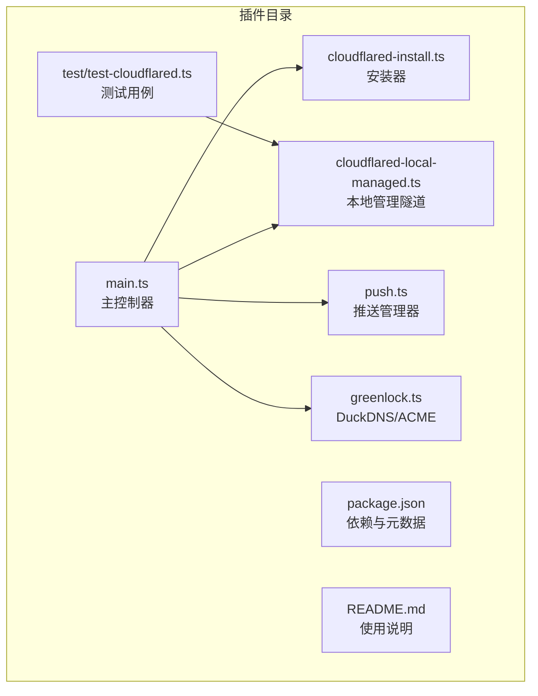
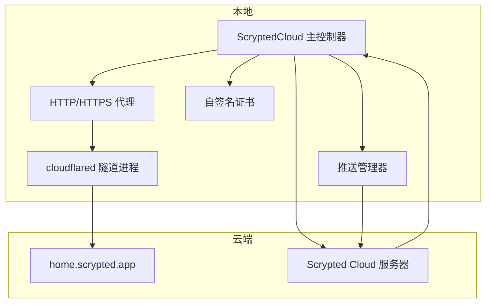
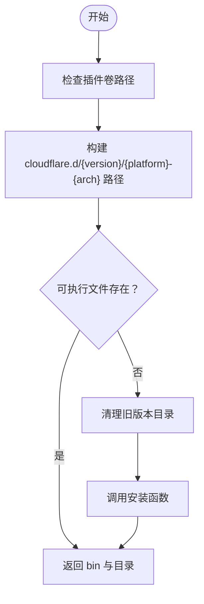
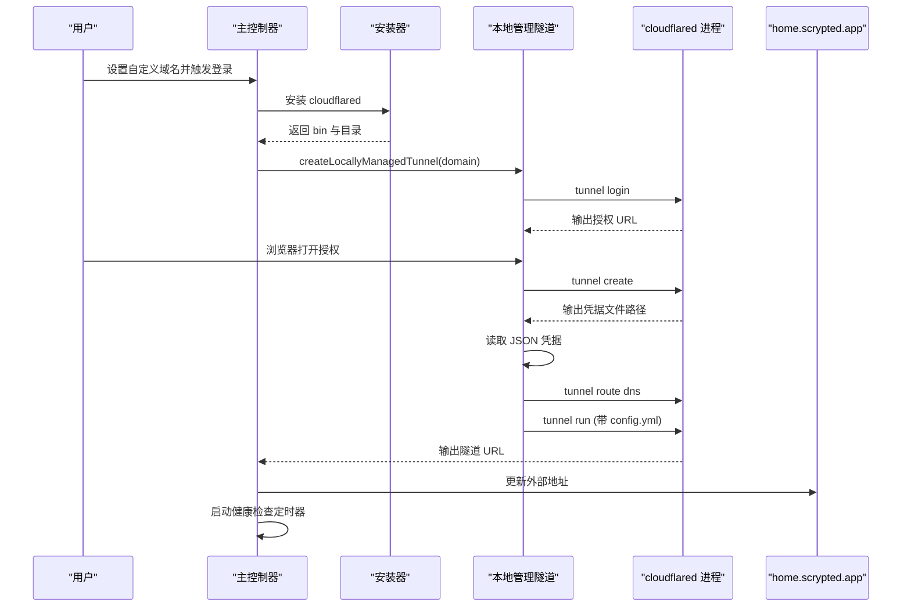
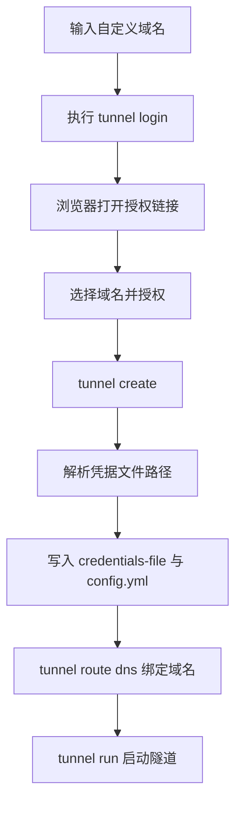
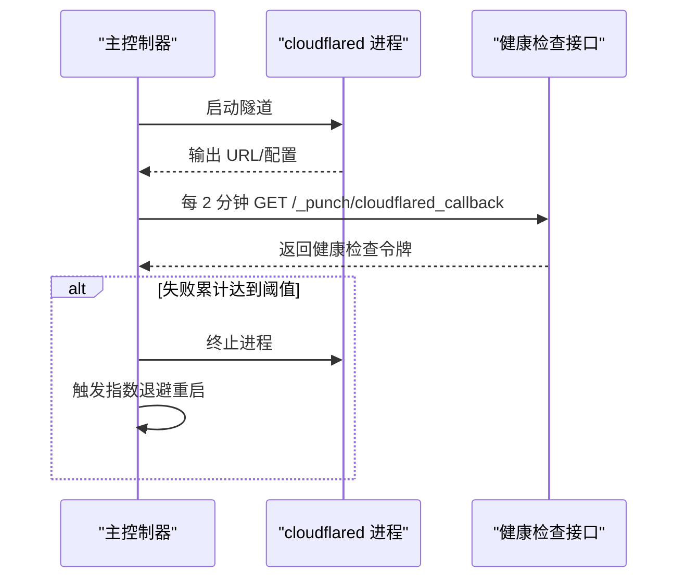
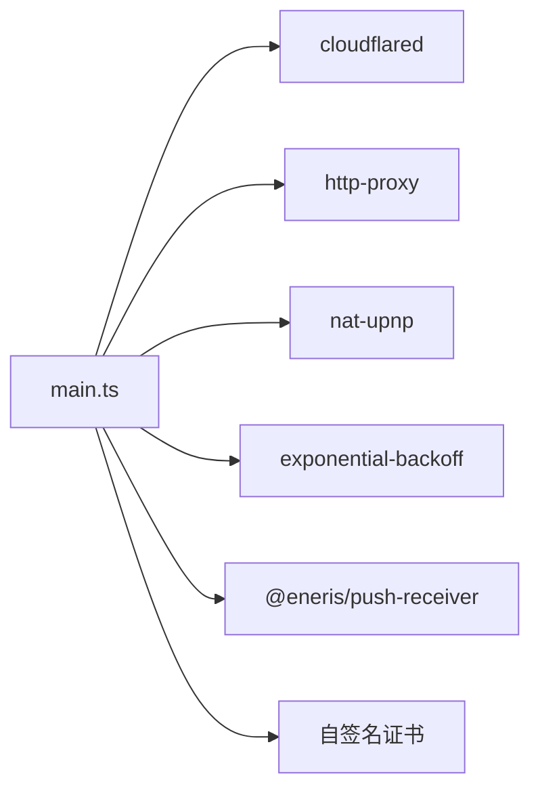

# Cloudflare 隧道服务

<cite>
**本文引用的文件**
- [plugins/cloud/src/main.ts](file://plugins/cloud/src/main.ts)
- [plugins/cloud/src/cloudflared-install.ts](file://plugins/cloud/src/cloudflared-install.ts)
- [plugins/cloud/src/cloudflared-local-managed.ts](file://plugins/cloud/src/cloudflared-local-managed.ts)
- [plugins/cloud/src/greenlock.ts](file://plugins/cloud/src/greenlock.ts)
- [plugins/cloud/src/push.ts](file://plugins/cloud/src/push.ts)
- [plugins/cloud/test/test-cloudflared.ts](file://plugins/cloud/test/test-cloudflared.ts)
- [plugins/cloud/package.json](file://plugins/cloud/package.json)
- [plugins/cloud/README.md](file://plugins/cloud/README.md)
</cite>

## 目录
1. [简介](#简介)
2. [项目结构](#项目结构)
3. [核心组件](#核心组件)
4. [架构总览](#架构总览)
5. [详细组件分析](#详细组件分析)
6. [依赖关系分析](#依赖关系分析)
7. [性能考量](#性能考量)
8. [故障排除指南](#故障排除指南)
9. [结论](#结论)
10. [附录](#附录)

## 简介
本文件面向 Scrypted 的 Cloudflare 隧道服务，系统性梳理 cloudflared 客户端的安装与配置、隧道建立流程（含认证凭据获取、隧道初始化、连接建立与状态监控）、自托管隧道与远程管理隧道的差异、自定义域名配置（DNS、SSL 证书与域名验证）、监控与管理能力（连接状态检查、日志收集、健康检查），以及常见问题排查。文档以仓库源码为依据，辅以图示帮助不同技术背景的读者理解。

## 项目结构
Scrypted 的 Cloudflare 隧道能力由 @scrypted/cloud 插件实现，核心文件位于 plugins/cloud/src，包含：
- 主控制器：负责设置本地代理、注册云端、发起反向连接、启动/重启 cloudflared、健康检查等
- cloudflared 安装器：负责在插件卷中安装/缓存 cloudflared 可执行文件
- 本地管理隧道工具：封装 cloudflared CLI 的登录、创建隧道、写入凭据、路由 DNS 等流程
- 自签名证书生成：用于本地 HTTPS 服务
- 推送管理器：负责与 Scrypted Cloud 的推送通道交互，触发回调与消息投递
- 测试脚本：演示本地管理隧道的创建与运行

**图表来源**
- [plugins/cloud/src/main.ts:1-1344](file://plugins/cloud/src/main.ts#L1-L1344)
- [plugins/cloud/src/cloudflared-install.ts:1-29](file://plugins/cloud/src/cloudflared-install.ts#L1-L29)
- [plugins/cloud/src/cloudflared-local-managed.ts:1-129](file://plugins/cloud/src/cloudflared-local-managed.ts#L1-L129)
- [plugins/cloud/src/greenlock.ts:1-58](file://plugins/cloud/src/greenlock.ts#L1-L58)
- [plugins/cloud/src/push.ts:1-76](file://plugins/cloud/src/push.ts#L1-L76)
- [plugins/cloud/test/test-cloudflared.ts:1-8](file://plugins/cloud/test/test-cloudflared.ts#L1-L8)
- [plugins/cloud/package.json:1-57](file://plugins/cloud/package.json#L1-L57)
- [plugins/cloud/README.md:1-69](file://plugins/cloud/README.md#L1-L69)

**章节来源**
- [plugins/cloud/src/main.ts:1-1344](file://plugins/cloud/src/main.ts#L1-L1344)
- [plugins/cloud/src/cloudflared-install.ts:1-29](file://plugins/cloud/src/cloudflared-install.ts#L1-L29)
- [plugins/cloud/src/cloudflared-local-managed.ts:1-129](file://plugins/cloud/src/cloudflared-local-managed.ts#L1-L129)
- [plugins/cloud/src/greenlock.ts:1-58](file://plugins/cloud/src/greenlock.ts#L1-L58)
- [plugins/cloud/src/push.ts:1-76](file://plugins/cloud/src/push.ts#L1-L76)
- [plugins/cloud/test/test-cloudflared.ts:1-8](file://plugins/cloud/test/test-cloudflared.ts#L1-L8)
- [plugins/cloud/package.json:1-57](file://plugins/cloud/package.json#L1-L57)
- [plugins/cloud/README.md:1-69](file://plugins/cloud/README.md#L1-L69)

## 核心组件
- 主控制器（ScryptedCloud）
  - 负责本地 HTTP/HTTPS 代理、反向连接、注册到 Scrypted Cloud、端口转发模式（UPnP/路由器转发/自定义域名/禁用）与外部地址更新
  - 提供 Settings/HttpRequestHandler/OauthClient/MediaConverter 接口，支持短链转换、OAuth 登录、推送投递
  - 启动 cloudflared 并进行健康检查
- cloudflared 安装器
  - 在插件卷内按平台架构路径安装 cloudflared 可执行文件，避免重复安装
- 本地管理隧道工具
  - 封装 cloudflared CLI：登录、清理/删除旧隧道、创建隧道、写入凭据文件、路由 DNS、运行隧道
- 自签名证书
  - 生成本地 HTTPS 服务证书，确保反向代理与推送通道安全
- 推送管理器
  - 维护 FCM 注册 ID、持久化配置、接收云端消息并分发给设备

**章节来源**
- [plugins/cloud/src/main.ts:36-270](file://plugins/cloud/src/main.ts#L36-L270)
- [plugins/cloud/src/cloudflared-install.ts:7-28](file://plugins/cloud/src/cloudflared-install.ts#L7-L28)
- [plugins/cloud/src/cloudflared-local-managed.ts:54-129](file://plugins/cloud/src/cloudflared-local-managed.ts#L54-L129)
- [plugins/cloud/src/greenlock.ts:10-58](file://plugins/cloud/src/greenlock.ts#L10-L58)
- [plugins/cloud/src/push.ts:11-76](file://plugins/cloud/src/push.ts#L11-L76)

## 架构总览
下图展示 Scrypted Cloud 插件如何通过本地代理、cloudflared 隧道与云端服务协同工作，以及健康检查与反向连接的交互。

**图表来源**
- [plugins/cloud/src/main.ts:809-979](file://plugins/cloud/src/main.ts#L809-L979)
- [plugins/cloud/src/main.ts:1015-1152](file://plugins/cloud/src/main.ts#L1015-L1152)
- [plugins/cloud/src/push.ts:11-76](file://plugins/cloud/src/push.ts#L11-L76)

**章节来源**
- [plugins/cloud/src/main.ts:809-979](file://plugins/cloud/src/main.ts#L809-L979)
- [plugins/cloud/src/main.ts:1015-1152](file://plugins/cloud/src/main.ts#L1015-L1152)
- [plugins/cloud/src/push.ts:11-76](file://plugins/cloud/src/push.ts#L11-L76)

## 详细组件分析

### cloudflared 安装与配置
- 安装位置与版本策略
  - 在插件卷下的 cloudflare.d/v{N}/{platform}-{arch} 目录安装 cloudflared 可执行文件
  - 若检测到旧版本目录则清理，再调用安装函数
- 权限与可执行性
  - 安装后返回 bin 路径与工作目录，后续通过 child_process 启动
- 启动参数
  - 支持 --url 指向本地快速隧道端口或 --token 指向已弃用的令牌模式
  - 当提供自定义域名凭据时，直接运行本地管理隧道

**图表来源**
- [plugins/cloud/src/cloudflared-install.ts:7-28](file://plugins/cloud/src/cloudflared-install.ts#L7-L28)

**章节来源**
- [plugins/cloud/src/cloudflared-install.ts:7-28](file://plugins/cloud/src/cloudflared-install.ts#L7-L28)

### 隧道建立流程（认证、初始化、连接、监控）
- 认证凭据获取（本地管理隧道）
  - 执行 cloudflared tunnel login，解析输出中的授权 URL，用户在浏览器打开完成登录
  - 创建隧道并解析输出中的凭据文件路径，读取 JSON 内容
  - 将 TunnelID 与域名通过 tunnel route dns 命令绑定
  - 写入 credentials-file 与 config.yml，然后以 run 方式启动隧道进程
- 隧道初始化与连接
  - 若启用自定义域名凭据：直接运行本地管理隧道，映射到本地快速隧道端口
  - 若未提供令牌：以 --url 指向本地端口启动；若提供令牌：以 --token 启动（已弃用）
  - 解析 stdout/stderr 中的配置字符串，提取 ingress hostname，拼接为 https://{hostname}
- 状态监控与健康检查
  - 成功启动后每 2 分钟对 /_punch/cloudflared_callback 发起健康检查
  - 若连续失败达到阈值，记录告警并终止当前 cloudflared 进程，触发自动重启

**图表来源**
- [plugins/cloud/src/main.ts:1015-1152](file://plugins/cloud/src/main.ts#L1015-L1152)
- [plugins/cloud/src/cloudflared-local-managed.ts:54-129](file://plugins/cloud/src/cloudflared-local-managed.ts#L54-L129)

**章节来源**
- [plugins/cloud/src/main.ts:1015-1152](file://plugins/cloud/src/main.ts#L1015-L1152)
- [plugins/cloud/src/cloudflared-local-managed.ts:54-129](file://plugins/cloud/src/cloudflared-local-managed.ts#L54-L129)

### 自托管隧道 vs 远程管理隧道
- 自托管隧道（推荐）
  - 使用本地管理隧道工具：登录 Cloudflare、创建隧道、写入凭据、路由 DNS、运行隧道
  - 优点：可远程管理隧道、域名与证书由 Cloudflare/DNS 管理，无需额外反向代理
- 远程管理隧道（已弃用）
  - 通过令牌启动 cloudflared（--token），不再支持
  - 插件中仍保留相关字段但会提示不再支持并强制使用新方式

**章节来源**
- [plugins/cloud/src/main.ts:1046-1051](file://plugins/cloud/src/main.ts#L1046-L1051)
- [plugins/cloud/src/main.ts:158-161](file://plugins/cloud/src/main.ts#L158-L161)

### 自定义域名配置（DNS、SSL、验证）
- DNS 设置
  - 通过 tunnel route dns 将隧道 ID 与子域名绑定
- SSL 证书
  - 插件内置自签名证书用于本地 HTTPS 服务
  - DuckDNS/ACME 证书可通过 @koush/greenlock 与 acme-dns-01-duckdns 获取，存储于插件卷
- 域名验证
  - 通过浏览器登录 Cloudflare 完成授权，随后选择对应域名
  - 本地管理隧道工具会解析凭据文件并写入 config.yml，启动隧道

**图表来源**
- [plugins/cloud/src/cloudflared-local-managed.ts:54-129](file://plugins/cloud/src/cloudflared-local-managed.ts#L54-L129)
- [plugins/cloud/src/greenlock.ts:10-58](file://plugins/cloud/src/greenlock.ts#L10-L58)

**章节来源**
- [plugins/cloud/src/cloudflared-local-managed.ts:54-129](file://plugins/cloud/src/cloudflared-local-managed.ts#L54-L129)
- [plugins/cloud/src/greenlock.ts:10-58](file://plugins/cloud/src/greenlock.ts#L10-L58)

### 监控与管理（连接状态、日志、健康检查）
- 连接状态检查
  - 通过 /_punch/cloudflared_callback 接口返回健康检查令牌，主控制器定时轮询
- 日志收集
  - cloudflared 子进程的标准输出/错误流被实时打印到插件日志
  - 主控制器在启动/退出/错误时记录日志
- 性能与稳定性
  - 健康检查失败达到阈值后自动重启 cloudflared 进程
  - 启动失败采用指数退避重试，最大延迟与尝试次数可配置

**图表来源**
- [plugins/cloud/src/main.ts:1154-1205](file://plugins/cloud/src/main.ts#L1154-L1205)
- [plugins/cloud/src/main.ts:1015-1152](file://plugins/cloud/src/main.ts#L1015-L1152)

**章节来源**
- [plugins/cloud/src/main.ts:1154-1205](file://plugins/cloud/src/main.ts#L1154-L1205)
- [plugins/cloud/src/main.ts:1015-1152](file://plugins/cloud/src/main.ts#L1015-L1152)

### 端口转发与外部可达性
- 端口转发模式
  - UPnP：自动在路由器上创建端口映射，周期刷新
  - 路由器转发：手动配置外网端口到内部 https 端口
  - 自定义域名：通过 443 端口访问，需有效 SSL 证书
  - 禁用：不暴露公网端口
- 外部地址更新
  - 当启用 Cloudflare 隧道或设置自定义域名时，更新系统外部地址列表，便于客户端识别

**章节来源**
- [plugins/cloud/src/main.ts:475-535](file://plugins/cloud/src/main.ts#L475-L535)
- [plugins/cloud/src/main.ts:589-600](file://plugins/cloud/src/main.ts#L589-L600)

## 依赖关系分析
- 关键依赖
  - cloudflared：隧道客户端
  - http-proxy：本地 HTTP/WS 代理
  - nat-upnp：UPnP 端口映射
  - exponential-backoff：启动重试
  - @eneris/push-receiver：推送通道
- 插件接口
  - SystemSettings/MediaConverter/OauthClient/Settings/HttpRequestHandler

**图表来源**
- [plugins/cloud/src/main.ts:1-30](file://plugins/cloud/src/main.ts#L1-L30)
- [plugins/cloud/package.json:39-48](file://plugins/cloud/package.json#L39-L48)

**章节来源**
- [plugins/cloud/package.json:39-48](file://plugins/cloud/package.json#L39-L48)

## 性能考量
- 启动重试与背压
  - 指数退避策略降低瞬时失败对系统的影响
- 健康检查频率
  - 2 分钟一次，兼顾及时发现异常与减少开销
- 代理与连接池
  - http-proxy 使用长连接代理，减少握手开销
- 证书与加密
  - 本地 HTTPS 服务使用自签名证书，避免额外 CA 依赖

[本节为通用建议，无需特定文件引用]

## 故障排除指南
- cloudflared 启动失败
  - 检查安装器是否成功写入可执行文件与工作目录
  - 查看标准输出/错误日志，定位“Unregistered tunnel connection”“Connection terminated error”等关键字
  - 若超过阈值时间仍未解析到 ingress hostname，进程会被终止
- 自定义域名无法访问
  - 确认已通过 tunnel login 完成授权并选择域名
  - 确认 tunnel route dns 已将隧道 ID 与域名绑定
  - 检查 DNS 解析与 Cloudflare 状态
- 健康检查失败
  - 检查 /_punch/cloudflared_callback 是否返回预期令牌
  - 查看定时器是否正常运行，确认插件未被禁用
- 端口转发问题
  - UPnP：检查路由器是否允许映射，查看状态提示
  - 路由器转发：确认外网端口与防火墙规则
  - 自定义域名：确保 443 端口可达且证书有效

**章节来源**
- [plugins/cloud/src/main.ts:1066-1121](file://plugins/cloud/src/main.ts#L1066-L1121)
- [plugins/cloud/src/main.ts:1154-1205](file://plugins/cloud/src/main.ts#L1154-L1205)
- [plugins/cloud/src/cloudflared-local-managed.ts:54-77](file://plugins/cloud/src/cloudflared-local-managed.ts#L54-L77)

## 结论
Scrypted 的 Cloudflare 隧道服务通过本地安装 cloudflared、本地管理隧道工具与健康检查机制，实现了稳定、可远程管理的公网访问能力。结合自定义域名与证书方案，用户可在无公网 IP 或复杂网络环境下安全地将本地服务暴露至互联网。建议优先使用本地管理隧道方式，并配合健康检查与指数退避策略保障可用性。

[本节为总结，无需特定文件引用]

## 附录

### 快速操作清单
- 安装 cloudflared
  - 使用安装器在插件卷中安装指定版本的 cloudflared
- 登录并创建隧道
  - 打开授权链接完成登录，创建隧道并解析凭据
- 绑定域名并运行
  - 将隧道 ID 与子域名绑定，生成 config.yml 并运行
- 启用健康检查
  - 每 2 分钟轮询健康检查接口，失败达阈值自动重启

**章节来源**
- [plugins/cloud/src/cloudflared-install.ts:7-28](file://plugins/cloud/src/cloudflared-install.ts#L7-L28)
- [plugins/cloud/src/cloudflared-local-managed.ts:54-129](file://plugins/cloud/src/cloudflared-local-managed.ts#L54-L129)
- [plugins/cloud/src/main.ts:1154-1205](file://plugins/cloud/src/main.ts#L1154-L1205)