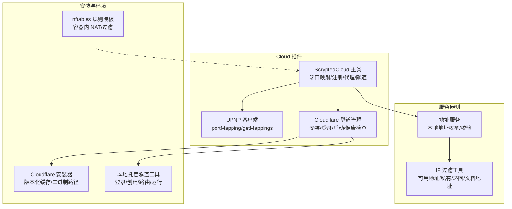
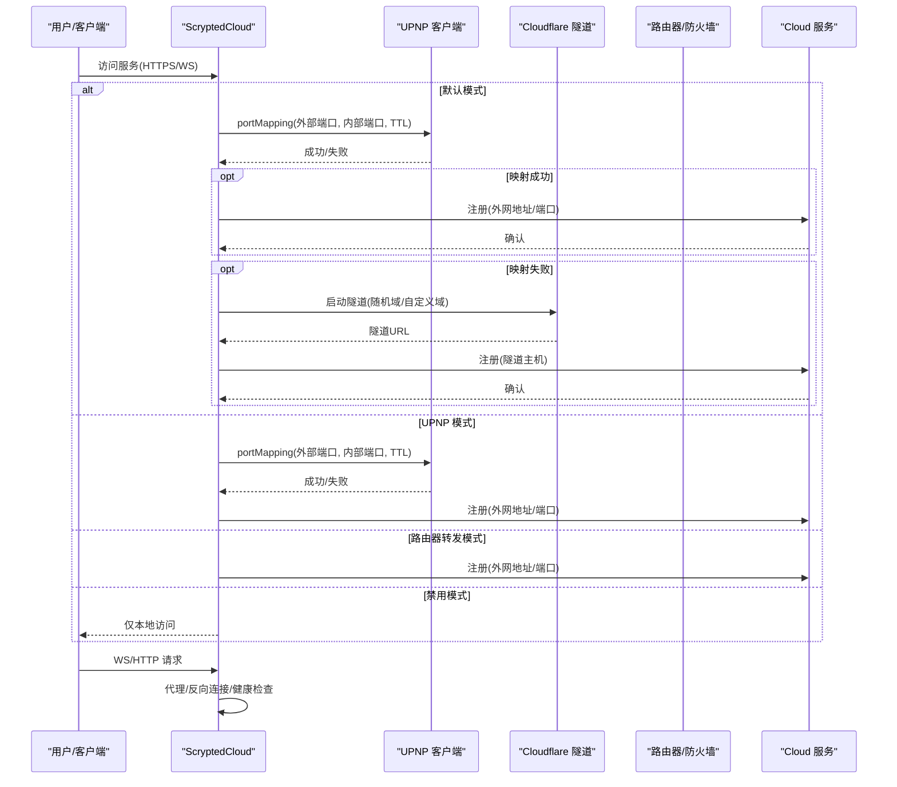
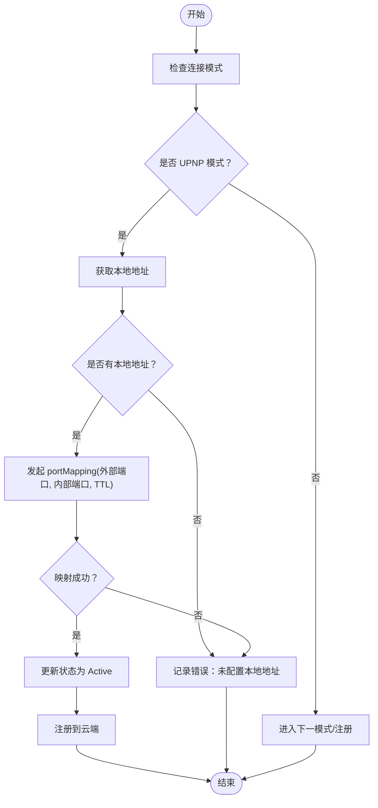
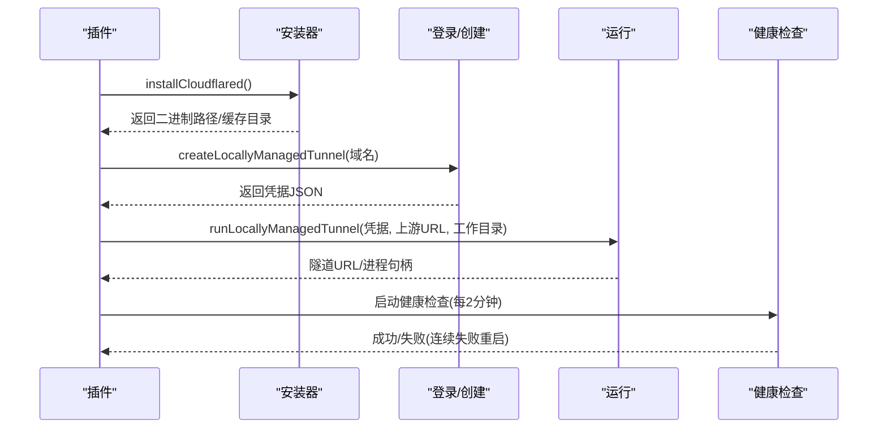
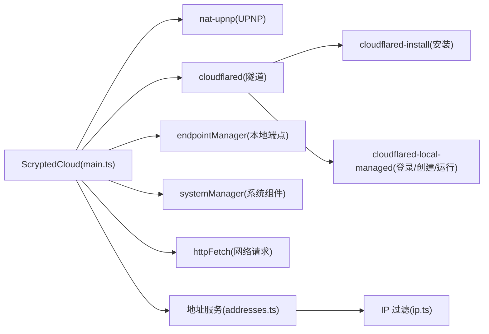

# NAT 穿透技术

<cite>
**本文引用的文件**
- [plugins/cloud/src/main.ts](file://plugins/cloud/src/main.ts)
- [plugins/cloud/src/cloudflared-install.ts](file://plugins/cloud/src/cloudflared-install.ts)
- [plugins/cloud/src/cloudflared-local-managed.ts](file://plugins/cloud/src/cloudflared-local-managed.ts)
- [plugins/cloud/README.md](file://plugins/cloud/README.md)
- [install/docker/router/01-scrypted.conf](file://install/docker/router/01-scrypted.conf)
- [server/src/services/addresses.ts](file://server/src/services/addresses.ts)
- [server/src/ip.ts](file://server/src/ip.ts)
</cite>

## 目录
1. [简介](#简介)
2. [项目结构](#项目结构)
3. [核心组件](#核心组件)
4. [架构总览](#架构总览)
5. [详细组件分析](#详细组件分析)
6. [依赖关系分析](#依赖关系分析)
7. [性能考量](#性能考量)
8. [故障排除指南](#故障排除指南)
9. [结论](#结论)
10. [附录](#附录)

## 简介
本文件系统性梳理 Scrypted 的 NAT 穿透能力，围绕四种连接模式展开：默认模式（自动选择最佳方案）、UPNP 模式（自动端口映射）、路由器转发模式（手动端口配置）、禁用模式（仅本地访问）。同时深入解析 UPNP 客户端的端口映射建立、维护与清理流程，以及 Cloudflare Tunnel 的安装、登录、隧道建立、健康检查与故障恢复机制。文档还提供各模式的适用场景、优缺点、配置要求、性能优化建议与安全注意事项，并给出故障排除清单。

## 项目结构
与 NAT 穿透直接相关的模块主要集中在 cloud 插件与安装脚本中：
- cloud 插件负责对外暴露服务、端口映射、Cloudflare 隧道管理、反向连接与健康检查。
- 安装脚本提供 Cloudflare 客户端的安装与运行支持。
- 路由器容器化规则提供基于 nftables 的 NAT/过滤链模板，便于在容器环境中进行端口转发。
- 服务器侧地址与 IP 过滤工具用于识别可用的外网地址，辅助端口映射与注册。

图表来源
- [plugins/cloud/src/main.ts:1-1344](file://plugins/cloud/src/main.ts#L1-L1344)
- [plugins/cloud/src/cloudflared-install.ts:1-29](file://plugins/cloud/src/cloudflared-install.ts#L1-L29)
- [plugins/cloud/src/cloudflared-local-managed.ts:1-129](file://plugins/cloud/src/cloudflared-local-managed.ts#L1-L129)
- [install/docker/router/01-scrypted.conf:1-55](file://install/docker/router/01-scrypted.conf#L1-L55)
- [server/src/services/addresses.ts:31-61](file://server/src/services/addresses.ts#L31-L61)
- [server/src/ip.ts:1-106](file://server/src/ip.ts#L1-L106)

章节来源
- [plugins/cloud/src/main.ts:1-1344](file://plugins/cloud/src/main.ts#L1-L1344)
- [plugins/cloud/src/cloudflared-install.ts:1-29](file://plugins/cloud/src/cloudflared-install.ts#L1-L29)
- [plugins/cloud/src/cloudflared-local-managed.ts:1-129](file://plugins/cloud/src/cloudflared-local-managed.ts#L1-L129)
- [install/docker/router/01-scrypted.conf:1-55](file://install/docker/router/01-scrypted.conf#L1-L55)
- [server/src/services/addresses.ts:31-61](file://server/src/services/addresses.ts#L31-L61)
- [server/src/ip.ts:1-106](file://server/src/ip.ts#L1-L106)

## 核心组件
- ScryptedCloud 主类：负责端口映射、注册、HTTP/WS 代理、Cloudflare 隧道生命周期管理、反向连接与健康检查。
- UPNP 客户端：封装 nat-upnp 的 portMapping 与 getMappings，实现动态端口映射与状态更新。
- Cloudflare 安装器：在插件卷中按版本化目录缓存 cloudflared 二进制，避免重复下载。
- 本地托管隧道工具：提供浏览器登录、隧道创建、DNS 路由与本地运行。
- 地址服务与 IP 过滤：从系统接口中筛选可用外网地址，过滤环回、链路本地与文档地址等。

章节来源
- [plugins/cloud/src/main.ts:36-246](file://plugins/cloud/src/main.ts#L36-L246)
- [plugins/cloud/src/cloudflared-install.ts:7-28](file://plugins/cloud/src/cloudflared-install.ts#L7-L28)
- [plugins/cloud/src/cloudflared-local-managed.ts:54-128](file://plugins/cloud/src/cloudflared-local-managed.ts#L54-L128)
- [server/src/services/addresses.ts:31-61](file://server/src/services/addresses.ts#L31-L61)
- [server/src/ip.ts:48-105](file://server/src/ip.ts#L48-L105)

## 架构总览
Scrypted Cloud 插件通过以下路径实现对外可达：
- 默认模式：优先尝试 UPNP 自动映射；若失败或被禁用，则回落到 Cloudflare 隧道或自定义域名。
- UPNP 模式：强制使用 UPNP 建立映射，周期刷新并记录状态。
- 路由器转发模式：不自动映射，仅将外部端口转发到内部端口，需用户在路由器侧配置。
- 禁用模式：仅本地访问，不对外暴露。
- Cloudflare 隧道：可选启用，支持本地托管与远程管理，内置健康检查与自动重启。

图表来源
- [plugins/cloud/src/main.ts:475-535](file://plugins/cloud/src/main.ts#L475-L535)
- [plugins/cloud/src/main.ts:1015-1152](file://plugins/cloud/src/main.ts#L1015-L1152)
- [plugins/cloud/src/main.ts:633-686](file://plugins/cloud/src/main.ts#L633-L686)

## 详细组件分析

### 四种连接模式与适用场景
- 默认模式
  - 行为：优先尝试 UPNP 自动映射；若失败或不可用，则使用 Cloudflare 隧道或自定义域名。
  - 优点：对用户透明，自动适配网络环境。
  - 缺点：依赖路由器 UPNP 支持；若失败需要依赖隧道。
  - 适用：大多数家庭/小型办公网络，路由器支持 UPNP。
- UPNP 模式
  - 行为：强制使用 UPNP 建立映射，周期刷新状态。
  - 优点：无需手动配置路由器。
  - 缺点：部分路由器禁用 UPNP 或策略限制。
  - 适用：路由器明确支持且允许 UPNP 的环境。
- 路由器转发模式
  - 行为：不自动映射，仅注册外网地址/端口；需用户在路由器侧完成端口转发。
  - 优点：稳定可控，不受 UPNP 限制。
  - 缺点：需要用户具备路由器配置权限。
  - 适用：企业/高安全要求网络，或路由器不支持 UPNP。
- 禁用模式
  - 行为：仅本地访问，不对外暴露。
  - 优点：最安全，无公网入口。
  - 缺点：无法从外网访问。
  - 适用：完全局域网使用或开发调试。

章节来源
- [plugins/cloud/src/main.ts:67-79](file://plugins/cloud/src/main.ts#L67-L79)
- [plugins/cloud/src/main.ts:475-535](file://plugins/cloud/src/main.ts#L475-L535)
- [plugins/cloud/README.md:8-46](file://plugins/cloud/README.md#L8-L46)

### UPNP 客户端工作机制
- 端口映射建立
  - 使用 nat-upnp 客户端发起 portMapping，目标为本地地址与内部 HTTPS 端口，设置 TTL。
  - 成功后更新状态并注册到云端。
- 映射维护
  - 定期调用 refreshPortForward，周期性重建映射以保持有效性。
- 清理与回退
  - 若映射失败，记录错误并提示启用路由器 UPNP 或改为其他模式。
  - 可查询当前映射列表用于诊断。

图表来源
- [plugins/cloud/src/main.ts:507-535](file://plugins/cloud/src/main.ts#L507-L535)
- [plugins/cloud/src/main.ts:334-354](file://plugins/cloud/src/main.ts#L334-L354)

章节来源
- [plugins/cloud/src/main.ts:240-241](file://plugins/cloud/src/main.ts#L240-L241)
- [plugins/cloud/src/main.ts:507-535](file://plugins/cloud/src/main.ts#L507-L535)
- [plugins/cloud/src/main.ts:334-354](file://plugins/cloud/src/main.ts#L334-L354)

### Cloudflare Tunnel 实现原理
- 安装与版本化缓存
  - 在插件卷下按版本号与平台架构缓存 cloudflared 二进制，避免重复下载。
- 登录与隧道创建
  - 提供浏览器登录流程，创建隧道并生成凭据文件。
  - 可选将隧道绑定到自定义子域名并路由 DNS。
- 隧道运行与配置解析
  - 通过本地 HTTP 服务作为隧道上游，支持自定义域或随机域。
  - 解析 cloudflared 输出中的配置变更，提取第一个主机名并更新外部地址。
- 健康检查与自动重启
  - 定时访问隧道回调端点，验证响应令牌，连续失败达到阈值后自动重启进程。
  - 退出时清理健康检查定时器与状态。

图表来源
- [plugins/cloud/src/cloudflared-install.ts:7-28](file://plugins/cloud/src/cloudflared-install.ts#L7-L28)
- [plugins/cloud/src/cloudflared-local-managed.ts:116-128](file://plugins/cloud/src/cloudflared-local-managed.ts#L116-L128)
- [plugins/cloud/src/cloudflared-local-managed.ts:79-97](file://plugins/cloud/src/cloudflared-local-managed.ts#L79-L97)
- [plugins/cloud/src/main.ts:1015-1152](file://plugins/cloud/src/main.ts#L1015-L1152)
- [plugins/cloud/src/main.ts:1154-1205](file://plugins/cloud/src/main.ts#L1154-L1205)

章节来源
- [plugins/cloud/src/cloudflared-install.ts:1-29](file://plugins/cloud/src/cloudflared-install.ts#L1-L29)
- [plugins/cloud/src/cloudflared-local-managed.ts:1-129](file://plugins/cloud/src/cloudflared-local-managed.ts#L1-L129)
- [plugins/cloud/src/main.ts:1015-1152](file://plugins/cloud/src/main.ts#L1015-L1152)
- [plugins/cloud/src/main.ts:1154-1205](file://plugins/cloud/src/main.ts#L1154-L1205)

### 代理与反向连接
- HTTP/WS 代理
  - 将请求转发至本地端口，注入必要的头部信息，如云地址、服务器标识等。
- 反向连接
  - 当云端服务器主动连接时，通过 TLS 建立反向通道，使用 BPMux 复用多路会话。
- 外部地址更新
  - 根据当前模式与隧道状态，更新外部地址集合，确保注册与白名单生效。

章节来源
- [plugins/cloud/src/main.ts:809-979](file://plugins/cloud/src/main.ts#L809-L979)
- [plugins/cloud/src/main.ts:981-1013](file://plugins/cloud/src/main.ts#L981-L1013)
- [plugins/cloud/src/main.ts:589-600](file://plugins/cloud/src/main.ts#L589-L600)

### 地址与网络可达性
- 地址枚举与过滤
  - 从系统网络接口中提取可用地址，过滤环回、链路本地与文档地址。
  - 对 IPv6 进行临时地址过滤，保留固定前缀地址。
- 本地地址选择
  - 用于 UPNP 映射的目标主机，确保映射指向正确的外网地址。

章节来源
- [server/src/services/addresses.ts:31-61](file://server/src/services/addresses.ts#L31-L61)
- [server/src/ip.ts:48-105](file://server/src/ip.ts#L48-L105)

### 路由器容器化 NAT/转发规则
- nftables 模板
  - 提供 IPv4/IPv6 的 NAT 与过滤链，便于在容器环境中启用端口转发。
  - 包含预置链与空动作，便于按需扩展。

章节来源
- [install/docker/router/01-scrypted.conf:1-55](file://install/docker/router/01-scrypted.conf#L1-L55)

## 依赖关系分析

图表来源
- [plugins/cloud/src/main.ts:1-26](file://plugins/cloud/src/main.ts#L1-L26)
- [plugins/cloud/src/cloudflared-install.ts:1-6](file://plugins/cloud/src/cloudflared-install.ts#L1-L6)
- [plugins/cloud/src/cloudflared-local-managed.ts:1-7](file://plugins/cloud/src/cloudflared-local-managed.ts#L1-L7)
- [server/src/services/addresses.ts:31-61](file://server/src/services/addresses.ts#L31-L61)
- [server/src/ip.ts:1-106](file://server/src/ip.ts#L1-L106)

章节来源
- [plugins/cloud/src/main.ts:1-26](file://plugins/cloud/src/main.ts#L1-L26)
- [plugins/cloud/src/cloudflared-install.ts:1-6](file://plugins/cloud/src/cloudflared-install.ts#L1-L6)
- [plugins/cloud/src/cloudflared-local-managed.ts:1-7](file://plugins/cloud/src/cloudflared-local-managed.ts#L1-L7)
- [server/src/services/addresses.ts:31-61](file://server/src/services/addresses.ts#L31-L61)
- [server/src/ip.ts:1-106](file://server/src/ip.ts#L1-L106)

## 性能考量
- UPNP 映射
  - TTL 设置为 1800 秒，减少频繁映射开销；定期刷新保证长期有效。
  - 仅在必要时触发映射更新，避免不必要的网络交互。
- Cloudflare 隧道
  - 健康检查间隔 2 分钟，降低云端轮询压力。
  - 指数回退重试，避免在失败时频繁重启造成资源浪费。
- 代理与反向连接
  - 使用持久连接池与代理复用，减少握手成本。
  - BPMux 复用单条 TLS 连接承载多路会话，降低连接数与延迟。

章节来源
- [plugins/cloud/src/main.ts:515-535](file://plugins/cloud/src/main.ts#L515-L535)
- [plugins/cloud/src/main.ts:1126-1131](file://plugins/cloud/src/main.ts#L1126-L1131)
- [plugins/cloud/src/main.ts:914-930](file://plugins/cloud/src/main.ts#L914-L930)
- [plugins/cloud/src/main.ts:1212-1254](file://plugins/cloud/src/main.ts#L1212-L1254)

## 故障排除指南
- UPNP 映射失败
  - 现象：状态显示错误，日志提示启用路由器 UPNP 或改为其他模式。
  - 排查：确认路由器已启用 UPNP；检查本地地址是否正确；查看映射列表。
  - 解决：启用路由器 UPNP；切换到“路由器转发”或“默认模式”。
- 端口 443 不允许
  - 现象：当外部端口为 443 时拒绝使用，提示改用自定义域名。
  - 排查：确认是否选择了“自定义域名”模式；检查主机名配置。
  - 解决：使用自定义域名并通过反向代理终止 TLS。
- Cloudflare 隧道启动失败
  - 现象：输出包含“Unregistered tunnel connection”、“Connection terminated error”等。
  - 排查：检查登录链接是否打开两次；确认凭据文件存在；查看安装缓存。
  - 解决：重新执行登录流程；清理旧版本缓存；检查网络连通性。
- 健康检查失败
  - 现象：连续失败达到阈值后自动重启隧道进程。
  - 排查：检查回调端点可达性；确认令牌一致；观察日志输出。
  - 解决：修复网络问题；调整健康检查间隔；检查防火墙策略。
- 路由器转发未生效
  - 现象：外网无法访问，测试按钮失败。
  - 排查：确认路由器端口转发规则；确认防火墙放行；确认模式为“路由器转发”。
  - 解决：在路由器添加端口转发；放行对应端口；保存并重载配置。

章节来源
- [plugins/cloud/src/main.ts:522-528](file://plugins/cloud/src/main.ts#L522-L528)
- [plugins/cloud/src/main.ts:486-493](file://plugins/cloud/src/main.ts#L486-L493)
- [plugins/cloud/src/main.ts:1066-1078](file://plugins/cloud/src/main.ts#L1066-L1078)
- [plugins/cloud/src/main.ts:1190-1199](file://plugins/cloud/src/main.ts#L1190-L1199)
- [plugins/cloud/README.md:8-46](file://plugins/cloud/README.md#L8-L46)

## 结论
Scrypted 的 NAT 穿透通过“默认模式 + UPNP + Cloudflare 隧道 + 手动转发”的组合，覆盖了从家庭到企业级网络的多种场景。UPNP 提供自动化映射，Cloudflare 隧道提供免端口配置的远程访问，路由器转发满足高安全与可控需求，禁用模式保障纯内网使用。配合健康检查与指数回退，系统在复杂网络环境下仍能保持稳定与易用。

## 附录
- 配置要点
  - 默认模式：无需额外配置，自动选择最佳方案。
  - UPNP 模式：确保路由器启用 UPNP；关注映射状态。
  - 路由器转发模式：在路由器上配置端口转发；在插件中选择该模式。
  - 自定义域名：准备反向代理与证书；将外部端口设为 443。
- 安全建议
  - 优先使用 HTTPS 与反向代理终止 TLS。
  - 限制 Cloudflare 隧道访问范围，使用 WARP 路由控制。
  - 定期审查端口映射与隧道凭据，及时撤销不再使用的授权。
- 性能优化
  - 合理设置 TTL 与健康检查间隔，平衡稳定性与资源消耗。
  - 使用持久连接池与会话复用，降低握手开销。
  - 在容器环境中结合 nftables 模板，简化端口转发配置。