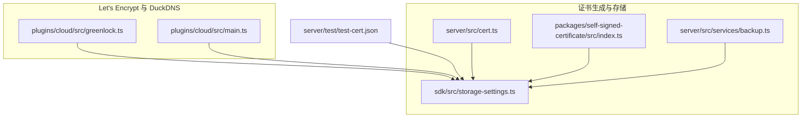
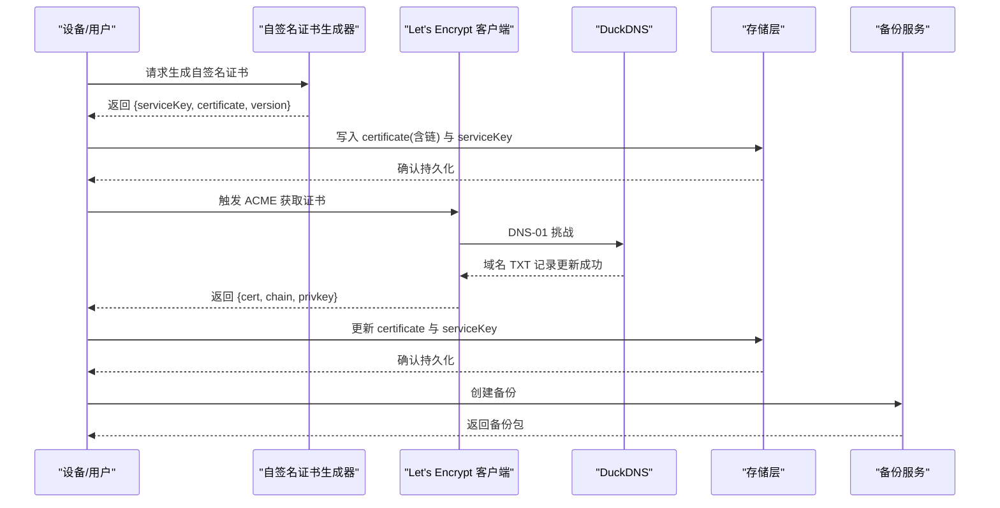
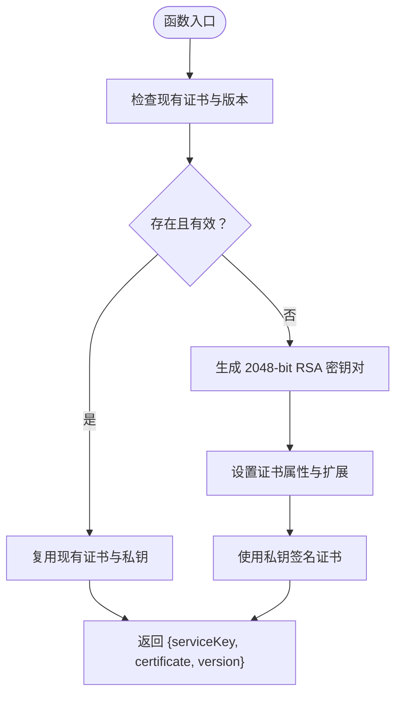
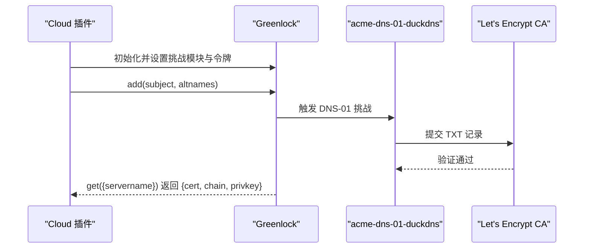
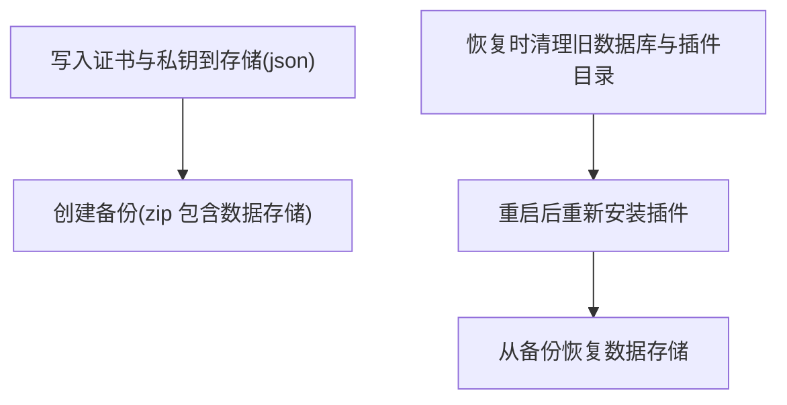
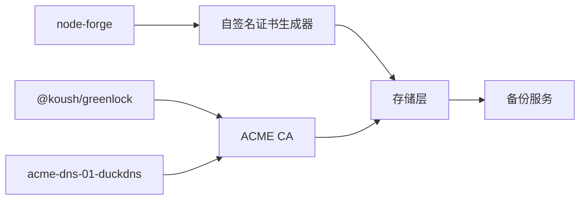

# SSL 证书管理

<cite>
**本文引用的文件**
- [server/src/cert.ts](file://server/src/cert.ts)
- [packages/self-signed-certificate/src/index.ts](file://packages/self-signed-certificate/src/index.ts)
- [plugins/cloud/src/greenlock.ts](file://plugins/cloud/src/greenlock.ts)
- [plugins/cloud/src/main.ts](file://plugins/cloud/src/main.ts)
- [server/test/test-cert.json](file://server/test/test-cert.json)
- [server/src/services/backup.ts](file://server/src/services/backup.ts)
- [sdk/src/storage-settings.ts](file://sdk/src/storage-settings.ts)
</cite>

## 目录
1. [简介](#简介)
2. [项目结构](#项目结构)
3. [核心组件](#核心组件)
4. [架构总览](#架构总览)
5. [组件详解](#组件详解)
6. [依赖关系分析](#依赖关系分析)
7. [性能考量](#性能考量)
8. [故障排除指南](#故障排除指南)
9. [结论](#结论)
10. [附录](#附录)

## 简介
本文件系统化梳理 Scrypted 的 SSL 证书管理能力，覆盖以下方面：
- 自签名证书的生成与管理：有效期、私钥保护、续期策略
- Let’s Encrypt 集成：ACME 协议处理、域名验证（DNS-01）、证书获取流程
- DuckDNS 动态域名服务集成：域名更新、证书申请与状态监控
- 证书存储格式、加密保护与备份恢复
- 证书链构建、中间证书处理与浏览器兼容性
- 最佳实践、性能优化与故障排除

## 项目结构
围绕证书管理的关键模块分布如下：
- 自签名证书生成与版本控制：server/src/cert.ts、packages/self-signed-certificate/src/index.ts
- Let’s Encrypt 与 DuckDNS 集成：plugins/cloud/src/greenlock.ts、plugins/cloud/src/main.ts
- 证书存储与备份：server/src/services/backup.ts、sdk/src/storage-settings.ts
- 测试样例：server/test/test-cert.json

**图表来源**
- [server/src/cert.ts:1-102](file://server/src/cert.ts#L1-L102)
- [packages/self-signed-certificate/src/index.ts:1-102](file://packages/self-signed-certificate/src/index.ts#L1-L102)
- [plugins/cloud/src/greenlock.ts:1-58](file://plugins/cloud/src/greenlock.ts#L1-L58)
- [plugins/cloud/src/main.ts:1-200](file://plugins/cloud/src/main.ts#L1-L200)
- [server/src/services/backup.ts:1-76](file://server/src/services/backup.ts#L1-L76)
- [sdk/src/storage-settings.ts:47-89](file://sdk/src/storage-settings.ts#L47-L89)
- [server/test/test-cert.json:1-5](file://server/test/test-cert.json#L1-L5)

**章节来源**
- [server/src/cert.ts:1-102](file://server/src/cert.ts#L1-L102)
- [plugins/cloud/src/greenlock.ts:1-58](file://plugins/cloud/src/greenlock.ts#L1-L58)
- [plugins/cloud/src/main.ts:1-200](file://plugins/cloud/src/main.ts#L1-L200)
- [server/src/services/backup.ts:1-76](file://server/src/services/backup.ts#L1-L76)
- [sdk/src/storage-settings.ts:47-89](file://sdk/src/storage-settings.ts#L47-L89)
- [server/test/test-cert.json:1-5](file://server/test/test-cert.json#L1-L5)

## 核心组件
- 自签名证书生成器：基于 node-forge 生成 2048-bit RSA 密钥对，创建 X.509v3 证书，设置有效期、扩展与签名；支持版本化与续期阈值判断。
- Let’s Encrypt 客户端：通过 @koush/greenlock 与 acme-dns-01-duckdns 挑战模块，完成 DNS-01 验证并获取证书。
- DuckDNS 集成：在插件中预留 DuckDNS 主机名与令牌设置项，并提供证书有效性标记位。
- 存储与备份：使用 StorageSettings 的 json 字段持久化证书对象；备份包含数据存储与插件目录，便于灾难恢复。

**章节来源**
- [server/src/cert.ts:17-101](file://server/src/cert.ts#L17-L101)
- [packages/self-signed-certificate/src/index.ts:17-101](file://packages/self-signed-certificate/src/index.ts#L17-L101)
- [plugins/cloud/src/greenlock.ts:10-58](file://plugins/cloud/src/greenlock.ts#L10-L58)
- [plugins/cloud/src/main.ts:86-107](file://plugins/cloud/src/main.ts#L86-L107)
- [server/src/services/backup.ts:12-76](file://server/src/services/backup.ts#L12-L76)
- [sdk/src/storage-settings.ts:60-72](file://sdk/src/storage-settings.ts#L60-L72)

## 架构总览
下图展示从证书生成到存储与备份的整体流程，以及与 DuckDNS/Let’s Encrypt 的交互路径。

**图表来源**
- [server/src/cert.ts:17-101](file://server/src/cert.ts#L17-L101)
- [plugins/cloud/src/greenlock.ts:10-58](file://plugins/cloud/src/greenlock.ts#L10-L58)
- [plugins/cloud/src/main.ts:393-423](file://plugins/cloud/src/main.ts#L393-L423)
- [server/src/services/backup.ts:12-76](file://server/src/services/backup.ts#L12-L76)

## 组件详解

### 自签名证书生成与管理
- 版本化与续期策略
  - 使用 CURRENT_SELF_SIGNED_CERTIFICATE_VERSION 标识证书版本
  - 若现有证书未过期超过约 60 天，则复用原证书与私钥，避免频繁重建
- 有效期与扩展
  - 默认有效期为当前时间起 5 年
  - 设置 basicConstraints、keyUsage、extKeyUsage、nsCertType、subjectAltName、subjectKeyIdentifier 等扩展
- 私钥保护
  - 以 PEM 格式返回私钥与证书，建议结合文件系统权限与存储加密进行保护
- 适用场景
  - 开发测试或无公网域名时的本地安全通道

**图表来源**
- [server/src/cert.ts:17-101](file://server/src/cert.ts#L17-L101)

**章节来源**
- [server/src/cert.ts:8-101](file://server/src/cert.ts#L8-L101)
- [packages/self-signed-certificate/src/index.ts:8-101](file://packages/self-signed-certificate/src/index.ts#L8-L101)

### Let’s Encrypt 集成（ACME/DNS-01）
- 实现原理
  - 使用 @koush/greenlock 作为 ACME 客户端
  - 通过 acme-dns-01-duckdns 挑战模块执行 DNS-01 验证
  - 在插件中预留 DuckDNS 主机名与令牌设置项，并维护证书有效性标记
- 证书获取流程
  - 初始化 Greenlock，设置配置目录与通知回调
  - defaults 中启用 dns-01 挑战并指定 acme-dns-01-duckdns 与令牌
  - add(subject, altnames) 注册域名，get({servername}) 获取证书材料
  - 返回 {cert, chain, privkey}，可直接写入存储

**图表来源**
- [plugins/cloud/src/greenlock.ts:10-58](file://plugins/cloud/src/greenlock.ts#L10-L58)
- [plugins/cloud/src/main.ts:393-423](file://plugins/cloud/src/main.ts#L393-L423)

**章节来源**
- [plugins/cloud/src/greenlock.ts:10-58](file://plugins/cloud/src/greenlock.ts#L10-L58)
- [plugins/cloud/src/main.ts:86-107](file://plugins/cloud/src/main.ts#L86-L107)
- [plugins/cloud/src/main.ts:393-423](file://plugins/cloud/src/main.ts#L393-L423)

### DuckDNS 动态域名服务集成
- 设置项
  - duckDnsHostname：动态域名主机名
  - duckDnsToken：DuckDNS 访问令牌
  - duckDnsCertValid：证书有效性标记位
- 工作流
  - 当设置变更时，将 duckDnsCertValid 置为 false，提示需重新加载插件以应用更改
  - 证书申请流程预留（当前抛出“未实现”错误），后续可调用 registerDuckDns 获取证书并更新存储
- 状态监控
  - 通过日志与标记位跟踪证书状态，便于 UI 展示与用户提示

**章节来源**
- [plugins/cloud/src/main.ts:86-107](file://plugins/cloud/src/main.ts#L86-L107)
- [plugins/cloud/src/main.ts:393-423](file://plugins/cloud/src/main.ts#L393-L423)

### 证书存储格式、加密保护与备份恢复
- 存储格式
  - 证书与私钥采用 PEM 文本格式
  - 通过 StorageSettings 的 json 字段持久化证书对象
- 加密保护
  - 建议结合文件系统权限与存储加密策略，防止敏感信息泄露
- 备份恢复
  - 备份服务会打包数据存储与插件目录，便于完整恢复
  - 恢复时会清理现有数据库与插件目录，首次启动后重新安装插件

**图表来源**
- [sdk/src/storage-settings.ts:60-72](file://sdk/src/storage-settings.ts#L60-L72)
- [server/src/services/backup.ts:12-76](file://server/src/services/backup.ts#L12-L76)

**章节来源**
- [sdk/src/storage-settings.ts:47-89](file://sdk/src/storage-settings.ts#L47-L89)
- [server/src/services/backup.ts:12-76](file://server/src/services/backup.ts#L12-L76)

### 证书链构建、中间证书与浏览器兼容性
- 证书链
  - Let’s Encrypt 返回的证书材料包含 leaf cert 与 chain，应合并为完整链后再写入存储
- 中间证书处理
  - 确保 chain 中包含必要的中间证书，避免客户端信任链断裂
- 兼容性
  - 通过扩展设置满足常见用途（如服务器/客户端认证、代码签名等），提升跨平台兼容性

**章节来源**
- [plugins/cloud/src/greenlock.ts:52-58](file://plugins/cloud/src/greenlock.ts#L52-L58)
- [server/src/cert.ts:58-92](file://server/src/cert.ts#L58-L92)

## 依赖关系分析
- 组件耦合
  - 自签名证书生成器与存储层松耦合，通过接口返回 PEM 文本
  - Let’s Encrypt 客户端与 DuckDNS 挑战模块通过插件配置解耦
- 外部依赖
  - node-forge：证书生成与签名
  - @koush/greenlock 与 acme-dns-01-duckdns：ACME 协议与 DNS-01 验证
  - StorageSettings：键值存储与 JSON 序列化

**图表来源**
- [server/src/cert.ts:1-102](file://server/src/cert.ts#L1-L102)
- [plugins/cloud/src/greenlock.ts:10-58](file://plugins/cloud/src/greenlock.ts#L10-L58)
- [sdk/src/storage-settings.ts:60-72](file://sdk/src/storage-settings.ts#L60-L72)

**章节来源**
- [server/src/cert.ts:1-102](file://server/src/cert.ts#L1-L102)
- [plugins/cloud/src/greenlock.ts:10-58](file://plugins/cloud/src/greenlock.ts#L10-L58)
- [sdk/src/storage-settings.ts:60-72](file://sdk/src/storage-settings.ts#L60-L72)

## 性能考量
- 自签名证书
  - 仅在本地开发/测试使用，生产环境建议使用 Let’s Encrypt
  - 5 年有效期减少频繁续签开销，但需关注浏览器与系统信任策略
- Let’s Encrypt
  - DNS-01 验证依赖外部 DNS 服务，网络抖动可能影响验证时延
  - 合理设置重试与超时，避免阻塞主流程
- 存储与备份
  - 备份包含数据存储与插件目录，注意磁盘空间与压缩效率
  - 恢复流程会重启服务，建议在低峰时段执行

[本节为通用指导，不涉及具体文件分析]

## 故障排除指南
- 自签名证书问题
  - 证书过期或不受信任：确认有效期与扩展设置是否符合预期
  - 私钥丢失：检查存储层是否正确持久化 serviceKey
- Let’s Encrypt 与 DuckDNS
  - DNS-01 验证失败：检查 DuckDNS 令牌与主机名设置，确认 TXT 记录已生效
  - 证书未更新：核对 duckDnsCertValid 标记位与插件日志
- 存储与备份
  - 备份损坏：检查 zip 校验与磁盘空间
  - 恢复后插件缺失：首次启动会重新安装插件，等待初始化完成

**章节来源**
- [plugins/cloud/src/main.ts:393-423](file://plugins/cloud/src/main.ts#L393-L423)
- [server/src/services/backup.ts:48-76](file://server/src/services/backup.ts#L48-L76)

## 结论
Scrypted 的证书管理体系以自签名证书为基础，辅以 Let’s Encrypt 与 DuckDNS 的自动化集成，形成从生成、验证到存储与备份的闭环。通过版本化与续期阈值控制、JSON 存储与完整备份机制，系统在易用性与可靠性之间取得平衡。建议在生产环境中优先使用 Let’s Encrypt，并配合严格的私钥与存储保护策略。

[本节为总结性内容，不涉及具体文件分析]

## 附录
- 测试样例
  - 提供了包含私钥与证书的测试样例文件，可用于验证解析与导入逻辑

**章节来源**
- [server/test/test-cert.json:1-5](file://server/test/test-cert.json#L1-L5)