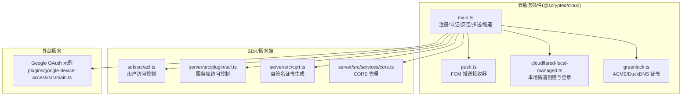
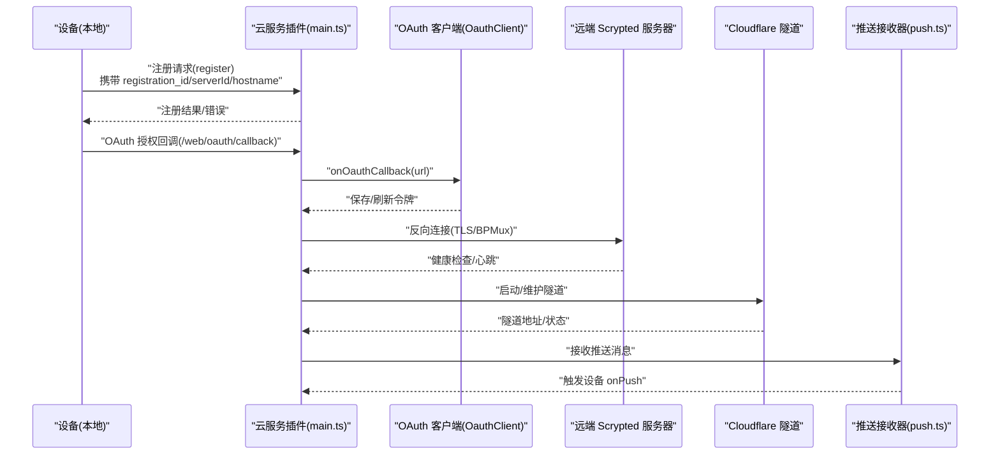
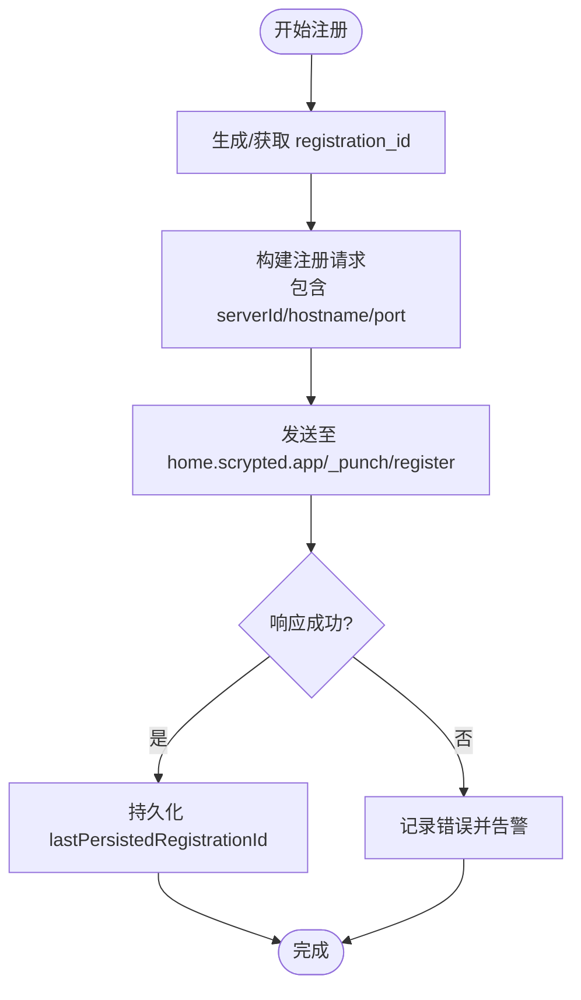
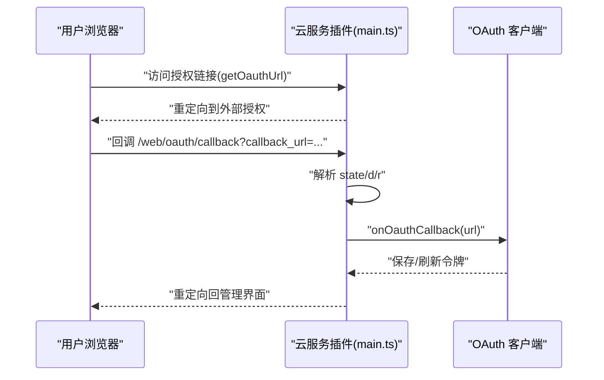
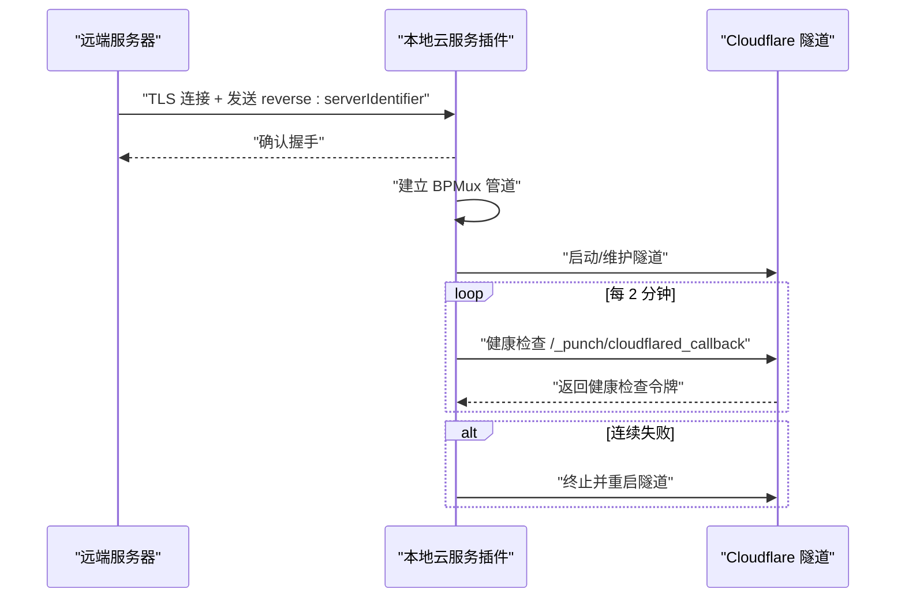
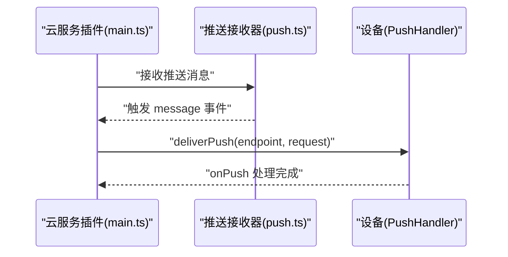
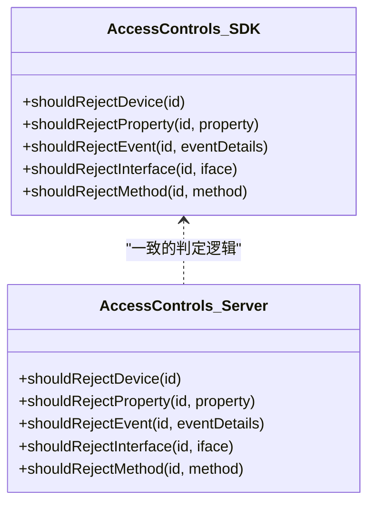
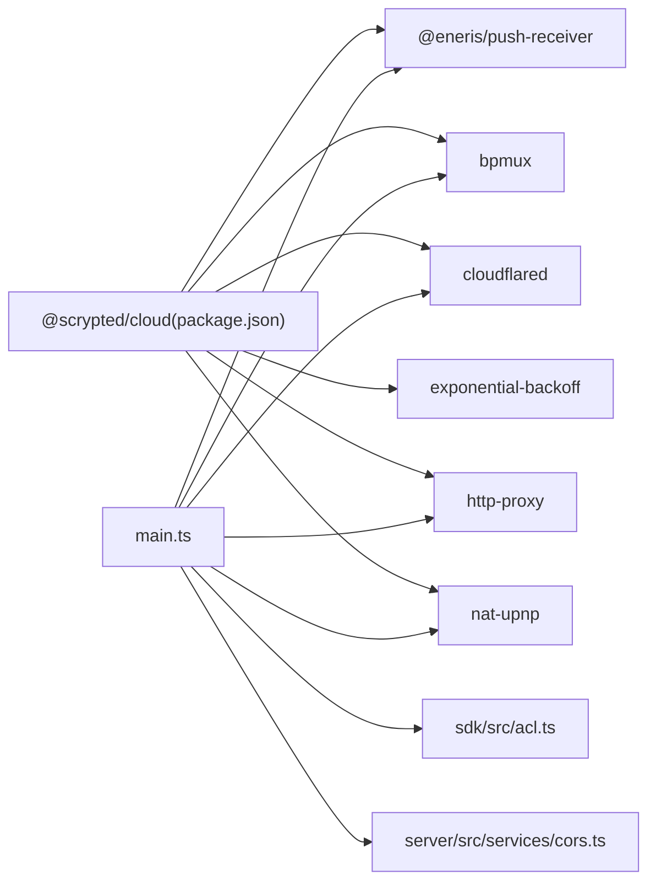

# 云服务注册与认证

<cite>
**本文引用的文件**
- [plugins/cloud/src/main.ts](file://plugins/cloud/src/main.ts)
- [plugins/cloud/src/push.ts](file://plugins/cloud/src/push.ts)
- [plugins/cloud/src/greenlock.ts](file://plugins/cloud/src/greenlock.ts)
- [plugins/cloud/src/cloudflared-local-managed.ts](file://plugins/cloud/src/cloudflared-local-managed.ts)
- [plugins/cloud/package.json](file://plugins/cloud/package.json)
- [sdk/src/acl.ts](file://sdk/src/acl.ts)
- [server/src/plugin/acl.ts](file://server/src/plugin/acl.ts)
- [server/src/cert.ts](file://server/src/cert.ts)
- [server/src/services/cors.ts](file://server/src/services/cors.ts)
- [plugins/google-device-access/src/main.ts](file://plugins/google-device-access/src/main.ts)
</cite>

## 目录
1. [简介](#简介)
2. [项目结构](#项目结构)
3. [核心组件](#核心组件)
4. [架构总览](#架构总览)
5. [详细组件分析](#详细组件分析)
6. [依赖关系分析](#依赖关系分析)
7. [性能考量](#性能考量)
8. [故障排查指南](#故障排查指南)
9. [结论](#结论)
10. [附录](#附录)

## 简介
本文件面向 Scrypted 的云服务注册与认证系统，围绕以下目标展开：设备注册流程（注册 ID 生成、设备标识管理、安全令牌机制、注册信息验证）、OAuth 认证流程（授权码获取、令牌交换、会话管理）、反向连接建立（连接建立、心跳检测、健康检查、故障转移）、推送消息系统（消息路由、设备匹配、投递确认）、安全机制（数据加密、身份验证、访问控制），并提供最佳实践、性能优化与安全加固建议。

## 项目结构
Scrypted 的云服务能力主要由 @scrypted/cloud 插件提供，核心文件包括：
- 注册与认证主逻辑：plugins/cloud/src/main.ts
- 推送管理：plugins/cloud/src/push.ts
- 本地隧道与登录：plugins/cloud/src/cloudflared-local-managed.ts
- Let’s Encrypt/DuckDNS 证书：plugins/cloud/src/greenlock.ts
- SDK 访问控制：sdk/src/acl.ts、server/src/plugin/acl.ts
- 自签名证书生成：server/src/cert.ts
- CORS 控制：server/src/services/cors.ts
- OAuth 示例插件：plugins/google-device-access/src/main.ts

**图表来源**
- [plugins/cloud/src/main.ts](file://plugins/cloud/src/main.ts)
- [plugins/cloud/src/push.ts](file://plugins/cloud/src/push.ts)
- [plugins/cloud/src/cloudflared-local-managed.ts](file://plugins/cloud/src/cloudflared-local-managed.ts)
- [plugins/cloud/src/greenlock.ts](file://plugins/cloud/src/greenlock.ts)
- [sdk/src/acl.ts](file://sdk/src/acl.ts)
- [server/src/plugin/acl.ts](file://server/src/plugin/acl.ts)
- [server/src/cert.ts](file://server/src/cert.ts)
- [server/src/services/cors.ts](file://server/src/services/cors.ts)
- [plugins/google-device-access/src/main.ts](file://plugins/google-device-access/src/main.ts)

**章节来源**
- [plugins/cloud/src/main.ts](file://plugins/cloud/src/main.ts)
- [plugins/cloud/src/push.ts](file://plugins/cloud/src/push.ts)
- [plugins/cloud/src/cloudflared-local-managed.ts](file://plugins/cloud/src/cloudflared-local-managed.ts)
- [plugins/cloud/src/greenlock.ts](file://plugins/cloud/src/greenlock.ts)
- [sdk/src/acl.ts](file://sdk/src/acl.ts)
- [server/src/plugin/acl.ts](file://server/src/plugin/acl.ts)
- [server/src/cert.ts](file://server/src/cert.ts)
- [server/src/services/cors.ts](file://server/src/services/cors.ts)
- [plugins/google-device-access/src/main.ts](file://plugins/google-device-access/src/main.ts)

## 核心组件
- 设备注册与标识
  - 注册 ID 与服务器 ID：通过随机字节生成，持久化存储于插件设置中，作为设备唯一标识与安全校验因子。
  - 注册密钥（registrationSecret）：用于反向连接鉴权与回调校验。
  - 服务器名称与主机名：支持多种暴露模式（UPNP、路由器转发、自定义域名、Cloudflare 隧道）。
- OAuth 认证
  - 授权端点与回调处理：统一在插件内部处理 /web/oauth/callback，解析状态参数，调用具体 OauthClient 设备完成令牌交换。
  - 令牌存储与刷新：示例插件展示如何保存/加载令牌并在过期时刷新。
- 反向连接
  - BPMux 多路复用：通过 TLS 连接远端 Scrypted 服务器，握手后建立双向管道，转发本地端口流量。
  - 健康检查与故障转移：周期性探测隧道回调端点，连续失败自动重启隧道进程。
- 推送消息
  - 推送接收器：基于 Firebase/Firestore 的推送接收器，负责注册 ID 获取与消息事件分发。
  - 消息路由：云端通过 /_punch/cloudmessage 路径投递，插件解析目标设备并调用 PushHandler.onPush。
- 安全机制
  - 传输加密：自签名证书或 ACME 证书；Cloudflare 隧道提供 TLS 终止。
  - 访问控制：基于用户权限模型的接口/方法/属性级访问控制。
  - CORS：集中管理跨域来源列表。

**章节来源**
- [plugins/cloud/src/main.ts](file://plugins/cloud/src/main.ts)
- [plugins/cloud/src/push.ts](file://plugins/cloud/src/push.ts)
- [plugins/cloud/src/greenlock.ts](file://plugins/cloud/src/greenlock.ts)
- [sdk/src/acl.ts](file://sdk/src/acl.ts)
- [server/src/plugin/acl.ts](file://server/src/plugin/acl.ts)
- [server/src/cert.ts](file://server/src/cert.ts)
- [server/src/services/cors.ts](file://server/src/services/cors.ts)
- [plugins/google-device-access/src/main.ts](file://plugins/google-device-access/src/main.ts)

## 架构总览
下图展示了从设备注册到反向连接、推送投递与 OAuth 回调的关键交互路径。

**图表来源**
- [plugins/cloud/src/main.ts](file://plugins/cloud/src/main.ts)
- [plugins/cloud/src/push.ts](file://plugins/cloud/src/push.ts)
- [plugins/google-device-access/src/main.ts](file://plugins/google-device-access/src/main.ts)

## 详细组件分析

### 设备注册与标识管理
- 注册 ID 生成
  - 使用随机字节生成 registration_id，并持久化存储，用于后续注册与推送端点生成。
- 服务器标识
  - serverId 与 registrationSecret 组合形成 serverIdentifier，用于反向连接鉴权。
- 注册信息验证
  - 向 home.scrypted.app 发送注册请求，携带服务器名称、主机名、端口等信息；若未登录或禁用连接，返回错误提示。
- 端口转发与外网可达性
  - 支持 UPNP、路由器转发、自定义域名与 DuckDNS；当使用 443 或自定义域名时，要求正确配置证书与解析。

**图表来源**
- [plugins/cloud/src/main.ts](file://plugins/cloud/src/main.ts)

**章节来源**
- [plugins/cloud/src/main.ts](file://plugins/cloud/src/main.ts)

### OAuth 认证流程
- 授权端点
  - 通过 getOauthUrl 生成授权链接，包含 registration_id、serverId、redirect_uri 等参数。
- 回调处理
  - /web/oauth/callback 解析 callback_url 与 state 参数，提取目标 OauthClient 设备 ID，调用其 onOauthCallback 完成令牌交换。
- 令牌管理
  - 示例插件展示令牌保存/加载、过期刷新与错误处理。

**图表来源**
- [plugins/cloud/src/main.ts](file://plugins/cloud/src/main.ts)
- [plugins/google-device-access/src/main.ts](file://plugins/google-device-access/src/main.ts)

**章节来源**
- [plugins/cloud/src/main.ts](file://plugins/cloud/src/main.ts)
- [plugins/google-device-access/src/main.ts](file://plugins/google-device-access/src/main.ts)

### 反向连接与隧道
- 连接建立
  - 远端服务器通过 TLS 主动连接本地端口，握手后发送 reverse:serverIdentifier，本地确认后建立 BPMux 管道。
- 心跳与健康检查
  - 启动后每 2 分钟对隧道回调端点进行探测，失败累计达阈值则重启隧道进程。
- 故障转移
  - 当隧道退出或异常时，清理定时器与状态，重新进入循环启动流程。

**图表来源**
- [plugins/cloud/src/main.ts](file://plugins/cloud/src/main.ts)

**章节来源**
- [plugins/cloud/src/main.ts](file://plugins/cloud/src/main.ts)

### 推送消息系统
- 推送接收器
  - 初始化 PushReceiver，监听凭据变更与通知事件，持久化配置并发出 registrationId 与 message 事件。
- 消息路由
  - 云端通过 /_punch/cloudmessage 投递，插件解析目标设备 ID 并调用 PushHandler.onPush。
- 投递确认
  - 插件侧仅负责路由与调用，设备需实现 PushHandler 接口以处理消息。

**图表来源**
- [plugins/cloud/src/main.ts](file://plugins/cloud/src/main.ts)
- [plugins/cloud/src/push.ts](file://plugins/cloud/src/push.ts)

**章节来源**
- [plugins/cloud/src/main.ts](file://plugins/cloud/src/main.ts)
- [plugins/cloud/src/push.ts](file://plugins/cloud/src/push.ts)

### 安全机制
- 数据加密
  - 自签名证书生成与 ACME/DuckDNS 证书流程，确保 HTTPS 终端安全。
- 身份验证
  - OAuth 令牌与 Bearer 授权头；注册回调通过 registrationSecret 校验。
- 访问控制
  - 用户维度的设备/接口/方法/属性级访问控制，拒绝未授权操作。

**图表来源**
- [sdk/src/acl.ts](file://sdk/src/acl.ts)
- [server/src/plugin/acl.ts](file://server/src/plugin/acl.ts)

**章节来源**
- [server/src/cert.ts](file://server/src/cert.ts)
- [plugins/cloud/src/greenlock.ts](file://plugins/cloud/src/greenlock.ts)
- [plugins/cloud/src/main.ts](file://plugins/cloud/src/main.ts)
- [sdk/src/acl.ts](file://sdk/src/acl.ts)
- [server/src/plugin/acl.ts](file://server/src/plugin/acl.ts)

## 依赖关系分析
- 插件依赖
  - @scrypted/cloud 依赖 @eneris/push-receiver、bpmux、cloudflared、exponential-backoff、http-proxy、nat-upnp 等库。
- 内部耦合
  - main.ts 与 push.ts、cloudflared-local-managed.ts、greenlock.ts 协同工作；ACL 与 CORS 提供安全与跨域控制。

**图表来源**
- [plugins/cloud/package.json](file://plugins/cloud/package.json)
- [plugins/cloud/src/main.ts](file://plugins/cloud/src/main.ts)

**章节来源**
- [plugins/cloud/package.json](file://plugins/cloud/package.json)
- [plugins/cloud/src/main.ts](file://plugins/cloud/src/main.ts)

## 性能考量
- 隧道稳定性
  - 使用指数退避策略启动 cloudflared，避免频繁失败导致资源浪费。
- 连接池与代理
  - http-proxy 使用长连接与高并发 Socket，减少握手开销。
- 健康检查频率
  - 2 分钟一次的健康检查在可用性与资源消耗间取得平衡。
- 推送处理
  - 云端消息按设备 ID 路由，避免广播风暴；设备端应尽快处理并释放资源。

[本节为通用性能建议，不直接分析特定文件，故无“章节来源”]

## 故障排查指南
- 注册失败
  - 检查是否已登录并启用连接；确认 token_info 是否存在；核对 hostname/port 配置。
- 隧道无法启动
  - 查看控制台输出的错误信息；确认 Cloudflare 凭据与自定义域名配置；必要时重启隧道。
- 反向连接断开
  - 观察健康检查日志；确认远端服务器可达性；检查防火墙与端口映射。
- 推送不达
  - 确认设备实现 PushHandler 接口；检查 registrationId 是否有效；查看消息路由路径。
- CORS 问题
  - 检查额外 CORS 来源列表；确保管理界面与云端地址在允许范围内。

**章节来源**
- [plugins/cloud/src/main.ts](file://plugins/cloud/src/main.ts)
- [plugins/cloud/src/push.ts](file://plugins/cloud/src/push.ts)
- [server/src/services/cors.ts](file://server/src/services/cors.ts)

## 结论
Scrypted 的云服务注册与认证体系通过“注册 ID + 服务器标识 + OAuth + 反向连接 + 推送路由 + 安全控制”的组合，实现了从本地设备到云端的稳定、可审计、可扩展的远程接入能力。遵循本文的最佳实践与排障建议，可在保证安全的前提下获得良好的性能与用户体验。

[本节为总结性内容，不直接分析特定文件，故无“章节来源”]

## 附录

### 最佳实践
- 注册与标识
  - 使用强随机数生成 registration_id 与 serverId；定期轮换 registrationSecret。
  - 在自定义域名场景下，提前完成 DNS 与证书配置。
- OAuth
  - 将令牌安全存储于插件设置中；实现过期检测与自动刷新；严格校验回调中的 state 参数。
- 反向连接
  - 保持隧道健康检查开启；合理设置反连数量上限；监控连接状态与错误日志。
- 推送
  - 设备端实现 PushHandler 接口并快速响应；避免阻塞推送线程。
- 安全
  - 使用 HTTPS 终端；限制 CORS 来源；启用访问控制；定期审查权限配置。

[本节为通用建议，不直接分析特定文件，故无“章节来源”]