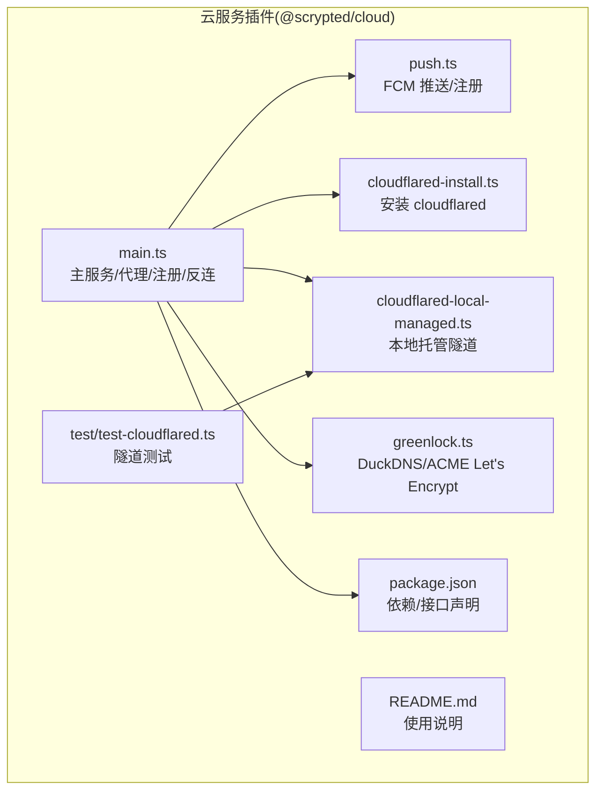
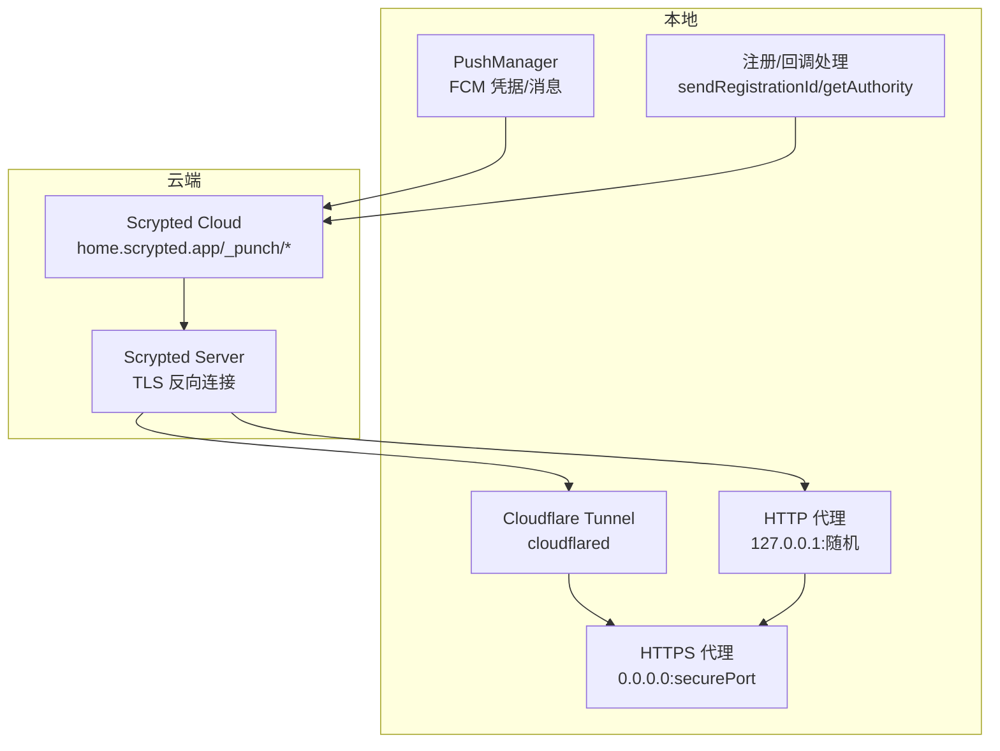
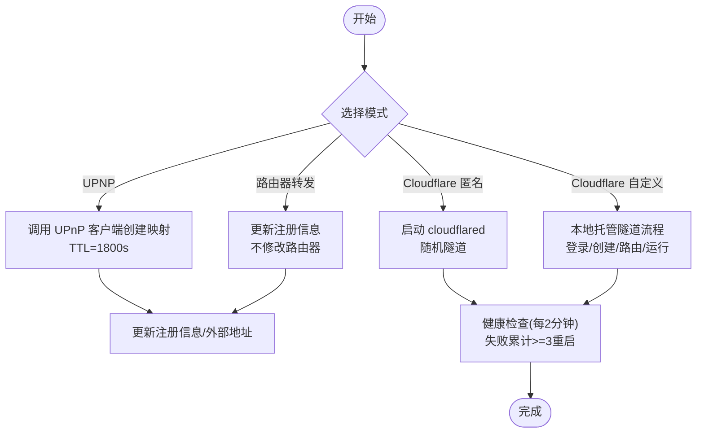
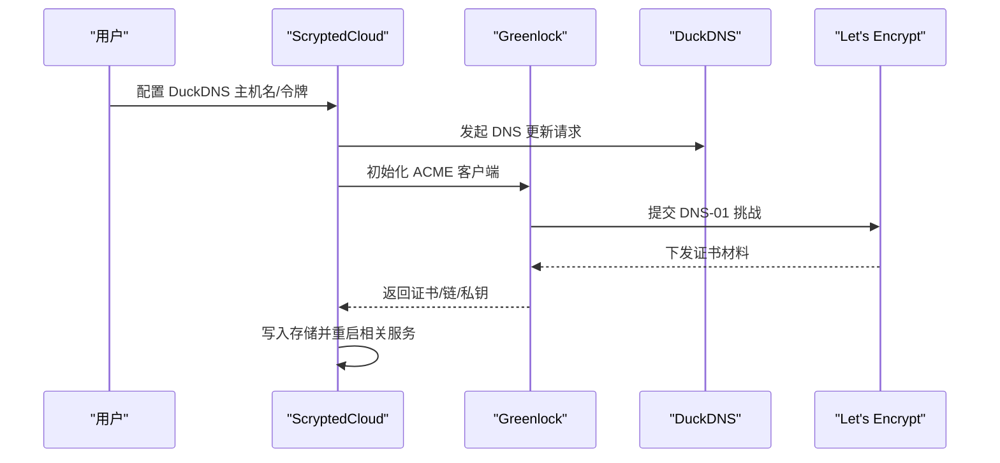
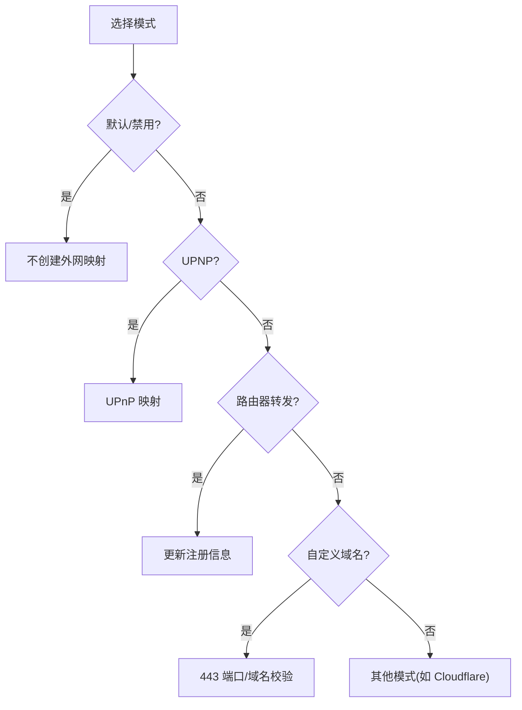
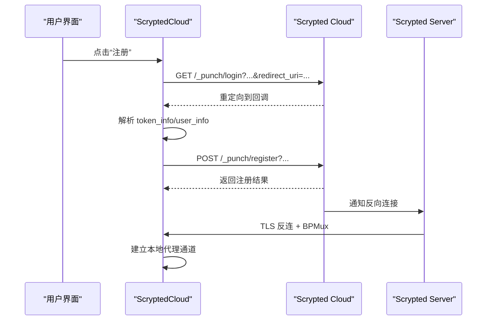
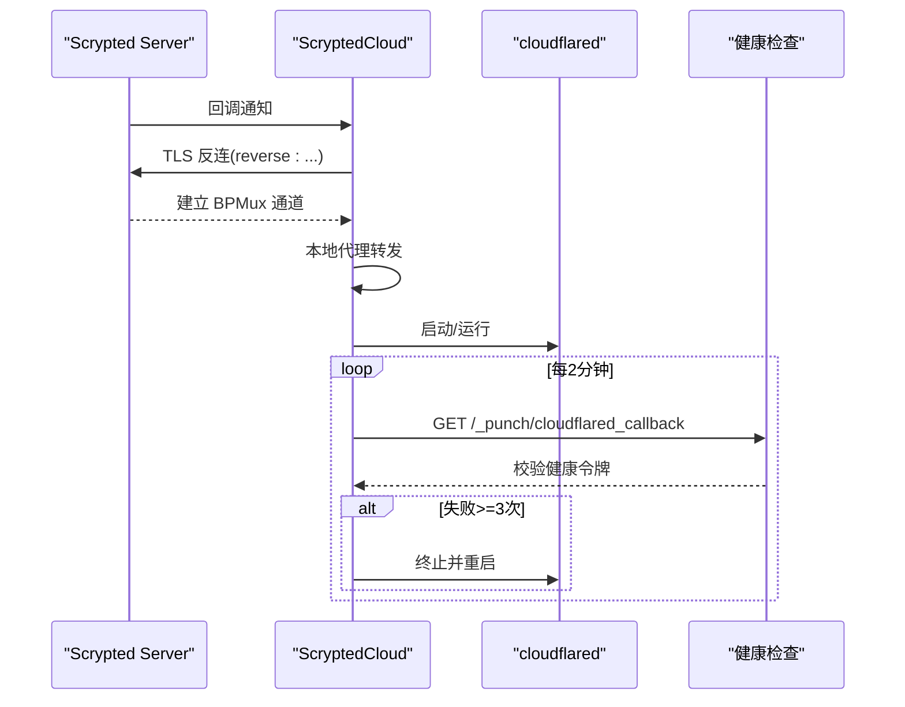
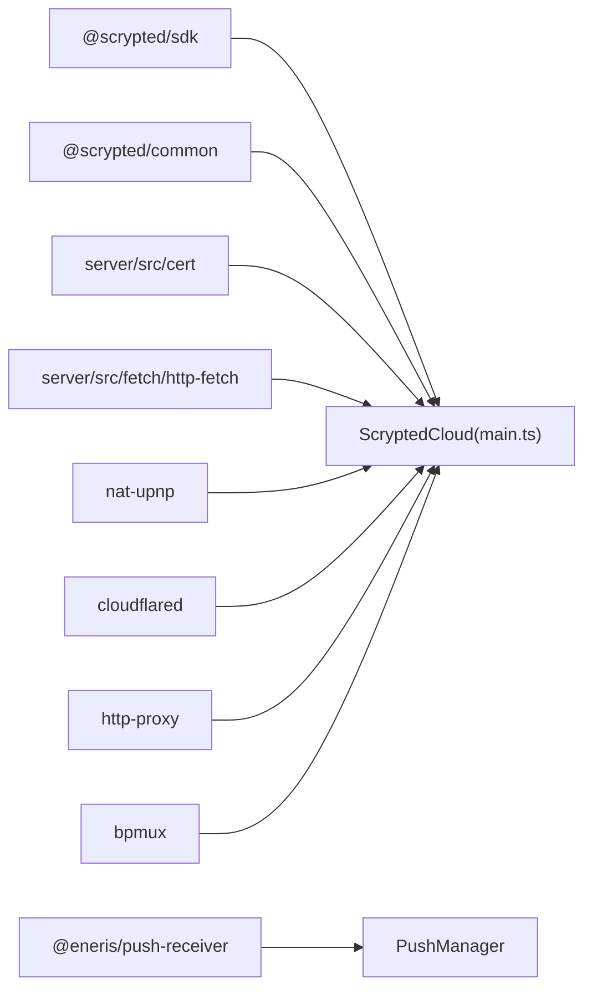

# 云服务集成

<cite>
**本文引用的文件**
- [plugins/cloud/src/main.ts](file://plugins/cloud/src/main.ts)
- [plugins/cloud/src/greenlock.ts](file://plugins/cloud/src/greenlock.ts)
- [plugins/cloud/src/cloudflared-install.ts](file://plugins/cloud/src/cloudflared-install.ts)
- [plugins/cloud/src/cloudflared-local-managed.ts](file://plugins/cloud/src/cloudflared-local-managed.ts)
- [plugins/cloud/src/push.ts](file://plugins/cloud/src/push.ts)
- [plugins/cloud/README.md](file://plugins/cloud/README.md)
- [plugins/cloud/package.json](file://plugins/cloud/package.json)
- [plugins/cloud/test/test-cloudflared.ts](file://plugins/cloud/test/test-cloudflared.ts)
</cite>

## 目录
1. [简介](#简介)
2. [项目结构](#项目结构)
3. [核心组件](#核心组件)
4. [架构总览](#架构总览)
5. [详细组件分析](#详细组件分析)
6. [依赖关系分析](#依赖关系分析)
7. [性能考量](#性能考量)
8. [故障排除指南](#故障排除指南)
9. [结论](#结论)
10. [附录](#附录)

## 简介
本文件面向 Scrypted 的云服务集成能力，系统性阐述其远程访问与安全连接的实现方式，覆盖以下主题：
- NAT 穿透与端口映射：UPnP 自动映射、路由器手动端口转发、Cloudflare Tunnel（本地托管隧道）。
- SSL 证书与域名：自签名证书、Let’s Encrypt（通过 DuckDNS DNS-01 挑战）、动态域名服务 DuckDNS。
- 远程访问模式：默认模式、UPNP 模式、路由器转发、自定义域名、禁用模式。
- 注册与认证：设备标识管理、安全令牌、OAuth 登录回调、推送凭据持久化。
- 反向连接与健康检查：反向 TLS 连接、BPMux 多路复用、定期健康检查与自动重启。
- 最佳实践、性能优化与安全建议。
- 故障排除与监控方法。

## 项目结构
云服务插件位于 plugins/cloud，核心源码集中在 src 目录，包含：
- 主入口与服务编排：main.ts
- 证书与域名：greenlock.ts（Let’s Encrypt 与 DuckDNS）、cloudflared-install.ts、cloudflared-local-managed.ts
- 推送与注册：push.ts
- 插件配置与依赖：package.json
- 使用说明与操作指引：README.md
- 测试示例：test/test-cloudflared.ts

**图表来源**
- [plugins/cloud/src/main.ts:1-1344](file://plugins/cloud/src/main.ts#L1-L1344)
- [plugins/cloud/src/greenlock.ts:1-58](file://plugins/cloud/src/greenlock.ts#L1-L58)
- [plugins/cloud/src/cloudflared-install.ts:1-29](file://plugins/cloud/src/cloudflared-install.ts#L1-L29)
- [plugins/cloud/src/cloudflared-local-managed.ts:1-129](file://plugins/cloud/src/cloudflared-local-managed.ts#L1-L129)
- [plugins/cloud/src/push.ts:1-76](file://plugins/cloud/src/push.ts#L1-L76)
- [plugins/cloud/README.md:1-69](file://plugins/cloud/README.md#L1-L69)
- [plugins/cloud/package.json:1-57](file://plugins/cloud/package.json#L1-L57)
- [plugins/cloud/test/test-cloudflared.ts:1-8](file://plugins/cloud/test/test-cloudflared.ts#L1-L8)

**章节来源**
- [plugins/cloud/src/main.ts:1-1344](file://plugins/cloud/src/main.ts#L1-L1344)
- [plugins/cloud/README.md:1-69](file://plugins/cloud/README.md#L1-L69)
- [plugins/cloud/package.json:1-57](file://plugins/cloud/package.json#L1-L57)

## 核心组件
- ScryptedCloud 主类：负责设置本地 HTTP/HTTPS 代理、端口映射、Cloudflare Tunnel 生命周期、注册与回调、反向连接、推送消息分发等。
- PushManager：封装 Firebase Cloud Messaging 凭据获取、持久化与消息事件。
- Cloudflare 集成：安装 cloudflared、本地托管隧道创建与路由、健康检查与自动重启。
- 证书与域名：自签名证书初始化；DuckDNS 动态域名与 ACME 挑战（通过 @koush/greenlock）。

**章节来源**
- [plugins/cloud/src/main.ts:36-270](file://plugins/cloud/src/main.ts#L36-L270)
- [plugins/cloud/src/push.ts:11-76](file://plugins/cloud/src/push.ts#L11-L76)
- [plugins/cloud/src/cloudflared-install.ts:7-29](file://plugins/cloud/src/cloudflared-install.ts#L7-L29)
- [plugins/cloud/src/cloudflared-local-managed.ts:15-129](file://plugins/cloud/src/cloudflared-local-managed.ts#L15-L129)
- [plugins/cloud/src/greenlock.ts:10-58](file://plugins/cloud/src/greenlock.ts#L10-L58)

## 架构总览
云服务插件在本地启动 HTTP/HTTPS 代理与 Cloudflare Tunnel，同时通过 Scrypted 平台的注册机制将本机可达地址暴露给云端。云端可经由推送或反向连接访问本地服务。

**图表来源**
- [plugins/cloud/src/main.ts:809-979](file://plugins/cloud/src/main.ts#L809-L979)
- [plugins/cloud/src/main.ts:981-1013](file://plugins/cloud/src/main.ts#L981-L1013)
- [plugins/cloud/src/main.ts:1015-1152](file://plugins/cloud/src/main.ts#L1015-L1152)
- [plugins/cloud/src/push.ts:11-76](file://plugins/cloud/src/push.ts#L11-L76)

## 详细组件分析

### NAT 穿透与端口映射（UPnP、路由器转发、Cloudflare Tunnel）
- UPnP 自动映射
  - 基于 nat-upnp 客户端，周期性创建/刷新端口映射，映射 TTL 为 1800 秒。
  - 若路由器不支持或未启用，会记录错误并提示用户切换到其他模式。
- 路由器手动转发
  - 用户在路由器侧配置“外部端口”到服务器内部“转发端口”，插件仅更新注册信息。
- Cloudflare Tunnel
  - 支持两种模式：匿名随机隧道与本地托管隧道（自定义域名）。
  - 本地托管隧道通过浏览器登录 Cloudflare，创建隧道并绑定域名，写入凭据文件，然后以 --config 方式运行 cloudflared。
  - 启动后进行健康检查，连续失败达到阈值则自动重启。

**图表来源**
- [plugins/cloud/src/main.ts:475-535](file://plugins/cloud/src/main.ts#L475-L535)
- [plugins/cloud/src/main.ts:1015-1152](file://plugins/cloud/src/main.ts#L1015-L1152)
- [plugins/cloud/src/cloudflared-local-managed.ts:116-129](file://plugins/cloud/src/cloudflared-local-managed.ts#L116-L129)
- [plugins/cloud/src/cloudflared-install.ts:7-29](file://plugins/cloud/src/cloudflared-install.ts#L7-L29)

**章节来源**
- [plugins/cloud/src/main.ts:475-535](file://plugins/cloud/src/main.ts#L475-L535)
- [plugins/cloud/src/main.ts:1015-1152](file://plugins/cloud/src/main.ts#L1015-L1152)
- [plugins/cloud/src/cloudflared-local-managed.ts:116-129](file://plugins/cloud/src/cloudflared-local-managed.ts#L116-L129)
- [plugins/cloud/src/cloudflared-install.ts:7-29](file://plugins/cloud/src/cloudflared-install.ts#L7-L29)

### SSL 证书与域名管理
- 自签名证书
  - 插件启动时若未配置证书，会生成自签名证书并缓存，用于本地 HTTPS 代理。
- DuckDNS + Let’s Encrypt
  - 通过 @koush/greenlock 与 acme-dns-01-duckdns 挑战模块申请证书，保存到插件卷目录。
  - 当前代码中 DuckDNS 更新逻辑存在占位注释，证书写回与重启逻辑暂未启用。
- 动态域名
  - DuckDNS 主机名与令牌配置后，插件会尝试更新 DuckDNS 记录（当前实现为占位，证书申请逻辑未启用）。

**图表来源**
- [plugins/cloud/src/greenlock.ts:10-58](file://plugins/cloud/src/greenlock.ts#L10-L58)
- [plugins/cloud/src/main.ts:379-412](file://plugins/cloud/src/main.ts#L379-L412)

**章节来源**
- [plugins/cloud/src/greenlock.ts:10-58](file://plugins/cloud/src/greenlock.ts#L10-L58)
- [plugins/cloud/src/main.ts:379-412](file://plugins/cloud/src/main.ts#L379-L412)

### 远程访问模式
- 默认模式：不强制外网可达，仅在需要时通过其他模式暴露。
- UPNP 模式：自动映射端口，适合家庭网络环境。
- 路由器转发：手动配置路由器端口转发规则。
- 自定义域名：通过 SSL 终止反向代理或 Cloudflare Tunnel 提供 HTTPS。
- 禁用模式：关闭外网可达性，仅限内网访问。

**图表来源**
- [plugins/cloud/src/main.ts:67-79](file://plugins/cloud/src/main.ts#L67-L79)
- [plugins/cloud/src/main.ts:475-535](file://plugins/cloud/src/main.ts#L475-L535)
- [plugins/cloud/src/main.ts:602-631](file://plugins/cloud/src/main.ts#L602-L631)

**章节来源**
- [plugins/cloud/src/main.ts:67-79](file://plugins/cloud/src/main.ts#L67-L79)
- [plugins/cloud/src/main.ts:475-535](file://plugins/cloud/src/main.ts#L475-L535)
- [plugins/cloud/src/main.ts:602-631](file://plugins/cloud/src/main.ts#L602-L631)

### 云服务注册流程与安全令牌
- 设备标识与密钥
  - 生成 serverId 与 registrationSecret，作为设备唯一标识与注册密钥。
- OAuth 登录
  - 提供 getOauthUrl，引导用户在 home.scrypted.app 完成登录与授权。
  - 回调解析 token_info 与 user_info，写入存储并触发重新注册。
- 注册与回调
  - sendRegistrationId 将 authority（主机/端口）、serverId、serverName、senderId、registrationSecret 等参数发送至云端。
  - 云端回调 /_punch/callback 时，插件通过 ensureReverseConnections 建立反向 TLS 连接。

**图表来源**
- [plugins/cloud/src/main.ts:787-804](file://plugins/cloud/src/main.ts#L787-L804)
- [plugins/cloud/src/main.ts:831-845](file://plugins/cloud/src/main.ts#L831-L845)
- [plugins/cloud/src/main.ts:633-686](file://plugins/cloud/src/main.ts#L633-L686)
- [plugins/cloud/src/main.ts:981-1013](file://plugins/cloud/src/main.ts#L981-L1013)

**章节来源**
- [plugins/cloud/src/main.ts:48-66](file://plugins/cloud/src/main.ts#L48-L66)
- [plugins/cloud/src/main.ts:787-804](file://plugins/cloud/src/main.ts#L787-L804)
- [plugins/cloud/src/main.ts:831-845](file://plugins/cloud/src/main.ts#L831-L845)
- [plugins/cloud/src/main.ts:633-686](file://plugins/cloud/src/main.ts#L633-L686)
- [plugins/cloud/src/main.ts:981-1013](file://plugins/cloud/src/main.ts#L981-L1013)

### 反向连接、健康检查与故障转移
- 反向连接
  - 云端请求回调时，插件通过 TLS 连接 Scrypted Server，发送 reverse:serverIdentifier，随后建立 BPMux 多路复用通道，将本地 HTTP/WS 代理与远端连接打通。
  - 维护一组反向连接集合，确保连接数维持在一定水平。
- 健康检查
  - 启动 cloudflared 后，每 2 分钟对 /_punch/cloudflared_callback 发起健康检查，若连续失败达到阈值，则终止并重启 cloudflared。
- 故障转移
  - cloudflared 子进程退出时进入循环重试，指数退避策略保障稳定性。

**图表来源**
- [plugins/cloud/src/main.ts:981-1013](file://plugins/cloud/src/main.ts#L981-L1013)
- [plugins/cloud/src/main.ts:1154-1205](file://plugins/cloud/src/main.ts#L1154-L1205)
- [plugins/cloud/src/main.ts:1015-1152](file://plugins/cloud/src/main.ts#L1015-L1152)

**章节来源**
- [plugins/cloud/src/main.ts:1212-1254](file://plugins/cloud/src/main.ts#L1212-L1254)
- [plugins/cloud/src/main.ts:1154-1205](file://plugins/cloud/src/main.ts#L1154-L1205)
- [plugins/cloud/src/main.ts:1015-1152](file://plugins/cloud/src/main.ts#L1015-L1152)

### 代理与白名单机制
- 本地代理
  - 启动 HTTP 与 HTTPS 服务器，将请求代理到本地端点；WebSocket 升级走 ws/wss。
  - 设置 X-Scrypted-* 响应头，便于上层识别直连/云连/服务器标识。
- 白名单短链
  - 对 PushEndpoint/LocalUrl 转换为带短期 user_token 的 URL，限制有效期与作用域，避免泄露内部地址。

**章节来源**
- [plugins/cloud/src/main.ts:809-931](file://plugins/cloud/src/main.ts#L809-L931)
- [plugins/cloud/src/main.ts:537-572](file://plugins/cloud/src/main.ts#L537-L572)
- [plugins/cloud/src/main.ts:729-757](file://plugins/cloud/src/main.ts#L729-L757)

## 依赖关系分析
- 外部依赖
  - @eneris/push-receiver：FCM 推送接收与凭据持久化。
  - nat-upnp：UPnP 端口映射。
  - cloudflared：Cloudflare Tunnel 客户端。
  - http-proxy：本地 HTTP/WS 代理。
  - exponential-backoff：指数退避策略。
  - bpmux：反向连接多路复用。
- 内部依赖
  - @scrypted/sdk：设备/系统接口。
  - @scrypted/common：通用工具。
  - server/src/cert：自签名证书生成。
  - server/src/fetch/http-fetch：HTTP 请求封装。

**图表来源**
- [plugins/cloud/src/main.ts:1-27](file://plugins/cloud/src/main.ts#L1-L27)
- [plugins/cloud/package.json:39-47](file://plugins/cloud/package.json#L39-L47)
- [plugins/cloud/src/push.ts:1-76](file://plugins/cloud/src/push.ts#L1-L76)

**章节来源**
- [plugins/cloud/package.json:39-47](file://plugins/cloud/package.json#L39-L47)
- [plugins/cloud/src/main.ts:1-27](file://plugins/cloud/src/main.ts#L1-L27)

## 性能考量
- 代理与连接
  - 使用 http-proxy 并启用 keep-alive，减少连接开销。
  - 反向连接池数量固定上限，避免资源耗尽。
- 重试与退避
  - cloudflared 启动失败采用指数退避，最大延迟与最大尝试次数可控，降低瞬时失败影响。
- 健康检查频率
  - 2 分钟一次的健康检查频率平衡了可用性与开销。
- 证书与域名
  - 自签名证书用于本地 HTTPS，避免不必要的证书轮换；DuckDNS/ACME 证书按需申请与缓存。

[本节为通用指导，无需特定文件引用]

## 故障排除指南
- UPNP 映射失败
  - 现象：状态显示错误，日志提示启用路由器 UPNP 或改为其他模式。
  - 处理：确认路由器已启用 UPNP，或切换到“路由器转发”模式并手动配置端口。
- 端口转发测试失败
  - 使用插件“测试端口转发”按钮，核对返回数据与随机字符串一致性。
  - 检查防火墙放行、路由器规则生效与端口未被占用。
- Cloudflare 隧道异常
  - 现象：隧道日志出现“未注册/连接终止/注册错误”等信息。
  - 处理：查看控制台输出定位问题；健康检查连续失败将自动重启；必要时清理旧版本缓存目录后重试。
- 自定义域名/证书问题
  - DuckDNS 更新与证书申请逻辑当前为占位，若出现域名解析异常，请先确认域名与令牌配置正确。
- 推送/注册失败
  - 确认已登录 Scrypted Cloud，检查 token_info 是否存在；查看注册回调是否正常写入。

**章节来源**
- [plugins/cloud/src/main.ts:522-534](file://plugins/cloud/src/main.ts#L522-L534)
- [plugins/cloud/src/main.ts:444-473](file://plugins/cloud/src/main.ts#L444-L473)
- [plugins/cloud/src/main.ts:1066-1121](file://plugins/cloud/src/main.ts#L1066-L1121)
- [plugins/cloud/src/main.ts:1165-1201](file://plugins/cloud/src/main.ts#L1165-L1201)
- [plugins/cloud/src/main.ts:654-660](file://plugins/cloud/src/main.ts#L654-L660)

## 结论
Scrypted 的云服务集成为家庭与小型部署提供了灵活的远程访问方案：既可通过 UPnP 自动映射快速联通，也可通过 Cloudflare Tunnel 实现零公网端口暴露的安全隧道；结合自签名证书与 DuckDNS/ACME 证书，满足不同网络与合规需求。插件内置推送注册、反向连接与健康检查机制，保证云端可达性与稳定性。建议优先采用 Cloudflare 自定义域名模式，配合严格的防火墙策略与定期健康检查，获得最佳安全性与可用性。

[本节为总结，无需特定文件引用]

## 附录
- 操作指南参考
  - 端口转发步骤、防火墙配置、自定义域名与 Cloudflare 隧道配置说明详见插件 README。
- 开发与调试
  - 插件脚本与接口声明见 package.json；可参考 README 中的开发与调试说明。

**章节来源**
- [plugins/cloud/README.md:1-69](file://plugins/cloud/README.md#L1-L69)
- [plugins/cloud/package.json:1-57](file://plugins/cloud/package.json#L1-L57)